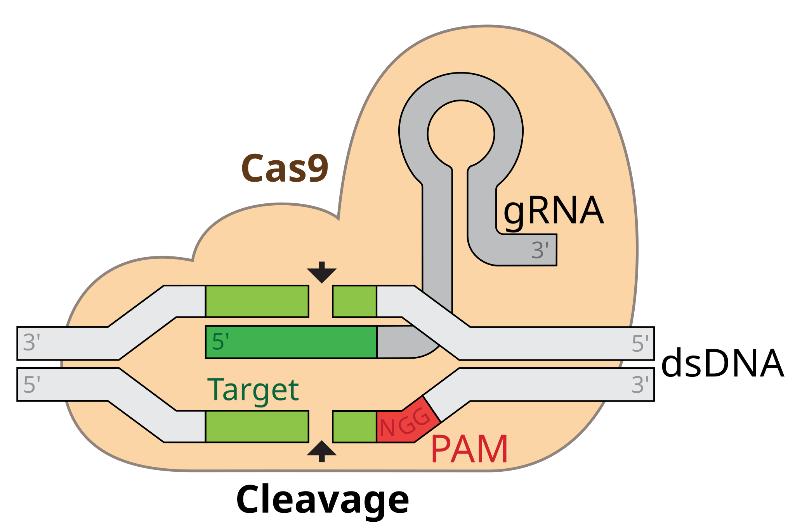

## Materials

1.  Spleen + LNs C57BL/6 mouse.
2.  For activated CD8 T cells:\
    0.5 x 10^6^ cells/ml\
    anti-CD3 (clone l45-2c11, BD)\
    anti-CD28 (clone 37.51)\
    Pre-activation for 1-2 days before transfection. (see [CD8 Selection and activation](/protocols/t_cells/cd8_selection.html))
3.  crRNA and tracrRNA from IDT:\
    Alt-R CRISPR-Cas9 TracrRNA\
    Alt-R CRISPR-Cas9 TracrRNA-ATTO 550\
    (ATTO 550: a fluorochrome excited by yellow laser, PE channel)\
    Alt-R CRISPR-Cas9 crRNA NTC negative control\
4.  Cas9 Protein\
    IDT Cas9 v3 (10 mg/ml) or\
    TrueCut Cas9 Protein v2 (5 mg/ml; Invitrogen) or\
    Cas9 (6.4 mg/ml; QB3 Berkley Lab) **We use this one, it is greatly discounted for UCs.**\
5.  Neon Transfection System
6.  Neon Transfection System 100μL Kit\
    Catalog #: MPK10096

## Crispr Guide Design

-   I use CHOPCHOP for guide design: https://chopchop.cbu.uib.no/ because I think it's simple to use, there are many alternatives (just google "crispr guide generator")

-   When ordering crRNA from IDT, you can check your guides again on their website

-   Make sure to order crRNA and NOT sgRNA. To learn the difference on more on RNPs, this is a great resource: https://www.idtdna.com/pages/education/decoded/article/crispr-guide-rna-format-affects-genome-editing-outcomes

-   To validate the knockout efficiency, you also need to order amplification primers for the gneomic location. You can use CHOPCHOP to design these primers. Under "Options" -\> "Primers" select a product size between 500 and 800bp and a minimal distance from primer to target site of 200bp.

    ::: callout-tip
    I use tide to calculate the Knockout efficiency. http://shinyapps.datacurators.nl/tide/ The site advises to to sequence a stretch of DNA \~700bp enclosing the designed editing site. The projected break site should be located preferably \~200bp downstream from the sequencing start site. This region upstream of the break site is used to align the sequencing data of the test sample with that of the control sample.
    :::

## Day 0

Isolation and activation of CD8+ cells. See [CD8 Selection and activation](/protocols/t_cells/cd8_selection.html)

## Day 1

### Preparation of crRNA-tracrRNA duplex

To prepare the duplex, each Alt-R crRNA and Alt-R tracrRNA or Alt-tracrRNA-ATTO550 were reconstituted to 100 uM with Nuclease Free Duplex buffer (IDT).

    100 μM = 100 pmol/μL = 10 nmol/100 μL = 2 nmol/20 μL

::: callout-tip
If you order 10 nmols from IDT, this means resuspend with 100 μL of NF Duplex Buffer (IDT)
:::

Mix oligos at equimolar concentrations in a sterile PCR tube (e.g. 3 μL Alt-R crRNA + 3 μL Alt-R-tracrRNA). Annealing oligos by heating at 95°C for 5 min in a PCR machine, then cool down at RT at least 1 h.

After duplexing, the concentration of crRNA-tracrRNA duplex in solution is now 50 μM (50 pmol/μL).

### Precomplexing of Cas9 / RNP

*TrueCut Cas9 Protein v2 concentration: 5 mg/mL (1 μg = 6.1 pmol; 30.5 pmol / μL)*\
*IDT Cas9 Protein v2 concentration: 10 mg/mL (1 μg = 6.1 pmol; 61 pmol / μL)*\
**QB3 Berkley Lab Cas9 Protein: 6.4 mg/mL (1 μg = 6.1 pmol; 39 pmol / μL)**

Mix gRNA and Cas9 at \~3:1 molar ratio

#### QB3 Cas9

In a PCR strip, mix **4.8 μL** crRNA-tracrRNA duplexes (240 pmol) and **2.0 μL** QB3 Cas9 (80 pmol) by gentle pipetting up and down and incubated RT for at least 20 min. Now total 6.8 μL mixture generated per reaction.

::: callout-tip
During this 20 minute incubation is typical when I start prepping the activated cells for Electroporation
:::

#### IDT Cas9 v3

::: {.callout-note collapse="true"}
In a PCR strip, mix **4.8 μL** crRNA-tracrRNA duplexes (240 pmol) and **1.3 μL** IDT Cas9 v3 (80 pmol) by gentle pipetting up and down and incubated RT for at least 10 min. Now total 6.1 μL mixture generated per reaction.
:::

::: callout-tip
Check the amount of crRNA, tracrRNA and Cas9 protein mixture before the reaction (meaning make sure you have enough volume). \~2.4 μL crRNA, \~2.4 μL tracrRNA, and \~2.0 μL Cas9 protein are needed per reaction.
:::

### For Electroporation with Neon Transfection System

1.  Harvest activated cells and count cell number

2.  Wash with sterile PBS twice: it's important to remove as much serum as possible since it could interfere with the electroporation

3.  Resuspend cells **\@ 2x10**^6^ cells / 110 μL "R Buffer" (from Neon Kit)

    ::: callout-tip
    *I have also resuspended at 1.5x10*^6^ cells and it worked as well
    :::

4.  Aliquot **6.8 μL of RNP mixture** into sterile Eppendorf tubes

5.  Carefully add 110 μL of cells (now in R buffer) into each Eppendorf: **do not introduce bubbles or you will regret it**

6.  Mix carefully with pipette (NO BUBBLES) then incubate the cells and RNP mixture for 3-5 mins

7.  Very carefully fill the Neon Pipette with the cell/RNP mixture without introducing any bubbles!

    ::: callout-tip
    If there are bubbles in the pipette tip during the electroporation, the bubbles will spark and kill off A LOT of cells. Observe the tip as you start the electroporation and if you see a spark, expect dead cells.
    :::

8.  Electroporate with following settings:

    -   Voltage: 1600
    -   Width: 10 ms
    -   Pulses: 3

9.  After electroporation, transfer the cells into 2mL of TCM + IL2 in a 6 well plate and move to 37°C incubator.

### For Electroporation using other systems

::: {.callout-note collapse="true"}
## MaxCyte ATX

1.  Aliquot **57 μL** of complete media/well in 24 well plate.
2.  Wash cells with electroporation buffer (Hyclone) once and resuspend the cells at 4 x 107 cells / mL in electroporation buffer.
3.  Aliquot 50 μL of cells into Eppendorf tubes (2 x 10^6^ cells / rxn)
4.  Add 6.8 μL RNP into the cells and mix well. Now total approx. 57 μL.
5.  Transfer the cells/RNP mixture to cuvette (OC-100).
6.  Electroporation with **Expended-5 protocol**
7.  After electroporation, transfer the cells into 57 μL media in 24 well, and incubate for 20 min in 37°C incubator.
8.  Add 1 mL of R10 + BME + NEAA + 10 ng/mL IL-2.
:::

::: {.callout-note collapse="true"}
## 4D-Nucleofector Core Unit: Lonza, AAF-1002B

1.  Aliquot **35 μL** of complete media/well in 24 well plate.
2.  Prepare 25 μL / rxn P4 buffer + Supplement 1 (20.4 μL + 4.6 μL)
3.  1 x 10^6^ murine T cells resuspended into **23.5 or 22.2 μL or 21 μL** of P4 buffer (Primary Cell 4D-Nuclcofector X Kit S (32 RCT, V4XP-4032; Lonza)).
4.  Mix T cells with **11.5 or 12.8 μL or 14 μL** RNP in round bottom 96 well and incubate for 2 min at RT. Now total 35 μL
5.  Transfer the cells+RNP mix to Nucleofection cuvette strips (4D-Nuclcofector X Kit S; Lonza)
6.  Electroporate the cells the 4D-Nucleofector.
    -   Pulse for activated murine T cells: CM137
    -   Pulse for resting murine T cells: DS 137
7.  After electroporation, transfer the cells into 35 μL media in 24 well plate, and incubate for 20 min in 37°C incubator.
8.  Add 1 mL of R10 + BME + NEAA + 10 ng/mL IL-2.
:::

## Day 2

### Transfection efficiency & Transfer

-   Check transfection efficiency ATTO 550 fluorescence (PE channel) by flow 1-3 day after transfection

    ::: callout-note
    Use X-20 for that. The laser configuration on the "old" Fortessa does not allow detecting Atto 550.
    :::

-   Prep cells for *in vivo* transfer

## Validation

See here for [Validation using Sanger](/protocols/mol_bio/crispr_validation)

## Acknowledgement

::: callout-note
Generated by Katia Faliti Modified by Jinyong Choi Re-Modified by Tianda Deng
:::
