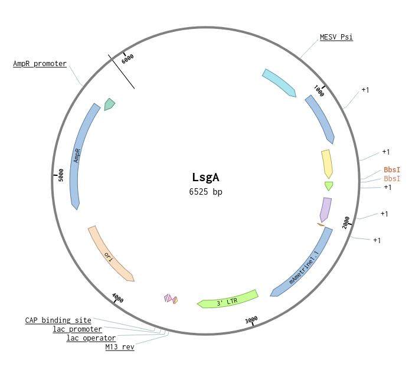

The LsgA Plasmig can be used as a vector to express guide RNAs for Crispr/Cas9. The Plasmid already contains all the "helper" sequences and we only need to add the guide RNA for the gene. It can than be used to create retrovirus using the pCL-Eco packaging plasmid.

::: callout-tip
Download the plasmid file here: [LSgA_empty.gb](LSgA_empty.gb)


:::

## sgRNA design

Get your guide RNA Sequence from IDT or ChopChop or anywhere else. Do not include the PAM sequence. The length of the guide RNA sould be 20 nucleotides.

::: callout-tip
OPTIONAL: Add G to 20 nt sgRNA sequence if it does not start with G to increase transcription.
:::

Design the fwd and reverse oligos:

```{=html}
<pre>
5’ –<b>CACC</b><u>G</u>NNNNNNNNNNNNNNNNNNN –    3’
3’     –<u>C</u>NNNNNNNNNNNNNNNNNNN<b>CAAA</b> –5’
</pre>
```
The **`CACC`** and the **`CAAA`** are the overlapping sequences to the digested plasmid. The <u>`G`</u> and <u>`C`</u> are the optimal base before the guide sequence to improve the transcription. `NNNNNNNNNNNNNNNNNNN` is the 20 bp guide RNA.

Order the primers.

## sgRNA oligos annealing

Resuspend oligos in ddH~2~0 100 µM. Mix

| Name                 | Volume |
|----------------------|--------|
| H20                  | 8µl    |
| Fwd Oligo            | 5µl    |
| Rev Oligo            | 5µl    |
| T4 Ligase 10x buffer | 2µl    |

Heat the samples up to 95°C, then slowly cool it down (e.g. 0.1°C / sec in the PCR machine).

## Digestion of LsgA

| Name           | Volume   |
|----------------|----------|
| LsgA           | 5 µg     |
| BbsI           | 0.5µl    |
| 10X Buffer NEB | 2µl      |
| ddH20          | Up to 20 |

Digest for 1h \@ 37°C.

::: callout-note
The **Bbs1** restriction enzyme does not cut the sequence it binds to, but a few nucleotides next to it. Therefore, we do not get a ligation of the empty digested vector despite we use Bbs1 as the 5' and 3' restriction exzyme.
<pre>
5' ... GAAGAC(N<sub>2</sub>)<sup>&#9660;</sup> ... 3'
5' ... CTTCTG(N<sub>6</sub>)<sub>&#9650;</sub> ... 3'
</pre>
:::

## Ligation of digested LsgA vector and insert gRNA

Mix:

| Name                | Volume      |
|---------------------|-------------|
| 10X Ligation Buffer | 2 µl        |
| T4 DNA ligase       | 1 µl        |
| Vector              | 0.5-1 µl    |
| gRNA (annealed)     | 5 µl        |
| ddH20               | Up to 20 µl |

Incubate at room temperature for \>2h (or overnight).\
Heat inactivate at 65°C for 10 minutes.

## Transformation

1.  Thaw competent cells on ice.
2.  Chill approximately 5 ng (2 μl) of the ligation mixture in a 1.5 ml microcentrifuge tube.
3.  Add 50 µl of competent cells to the DNA. Mix gently by pipetting up and down or flicking the tube 4--5 times to mix the cells and DNA. Do not vortex.
4.  Place the mixture on ice for 30 minutes. Do not mix.
5.  Heat shock at 42°C for 30 seconds. Do not mix.
6.  Add 500 µl of SOC media to the tube.
7.  Place tube at 37°C for 60 minutes. Shake vigorously (250 rpm) or rotate.
8.  Warm selection plates to 37°C.
9.  Spread 50--100 µl of the cells and ligation mixture onto the plates.
10. Incubate overnight at 37°C
