# Flow Cytometry part I

Source: `Flow_Cytometry_part_I.ppt`

This document contains 70 slides. Each slide is preserved as an image, followed by searchable text extracted from the presentation.

## Slide 1 — ACHILLE ANSELMO PhD

Extracted slide text

<pre>ACHILLE ANSELMO PhD
  FLOW CYTOMETRY CORE</pre>

## Slide 2 — Untitled slide

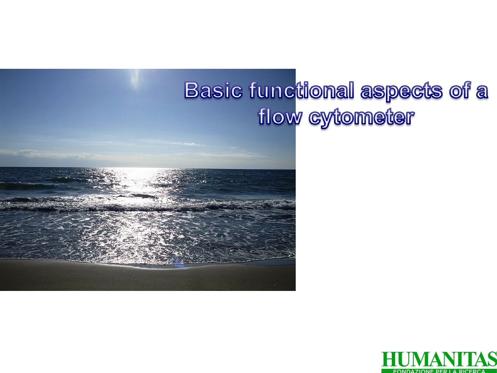

## Slide 3 — CYTOMETRY vs FLOW CYTOMETRY

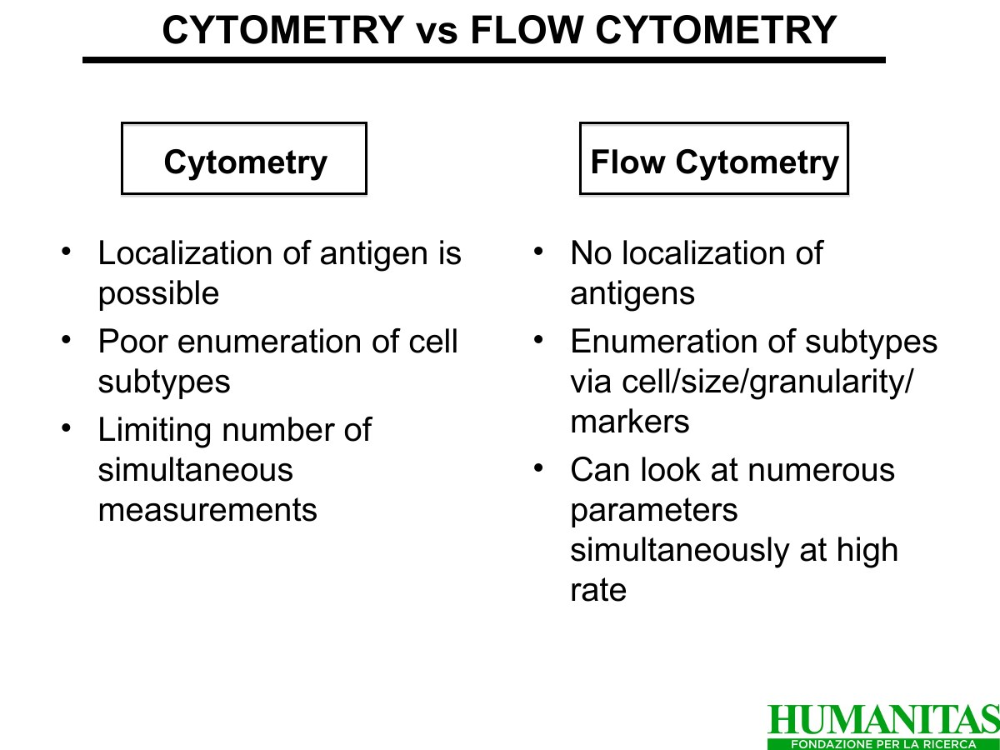

Extracted slide text

<pre>CYTOMETRY vs FLOW CYTOMETRY

       Cytometry                  Flow Cytometry

• Localization of antigen is   • No localization of
  possible                       antigens
• Poor enumeration of cell     • Enumeration of subtypes
  subtypes                       via cell/size/granularity/
• Limiting number of             markers
  simultaneous                 • Can look at numerous
  measurements                   parameters
                                 simultaneously at high
                                 rate</pre>

## Slide 4 — FLOW CYTOMETRY APPLICATIONS

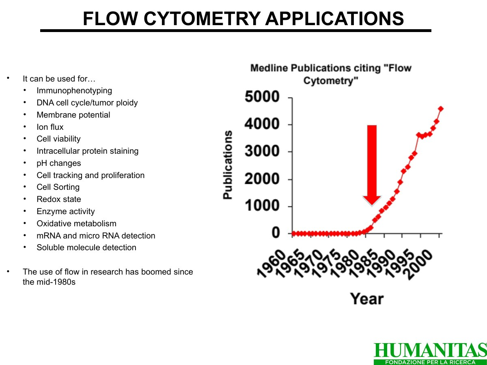

Extracted slide text

<pre>FLOW CYTOMETRY APPLICATIONS

•   It can be used for…
    • Immunophenotyping
    • DNA cell cycle/tumor ploidy
    • Membrane potential
    • Ion flux
    • Cell viability
    • Intracellular protein staining
    • pH changes
    • Cell tracking and proliferation
    • Cell Sorting
    • Redox state
    • Enzyme activity
    • Oxidative metabolism
    • mRNA and micro RNA detection
    • Soluble molecule detection

•   The use of flow in research has boomed since
    the mid-1980s</pre>

## Slide 5 — FLOW CYTOMETER MAIN PARTS

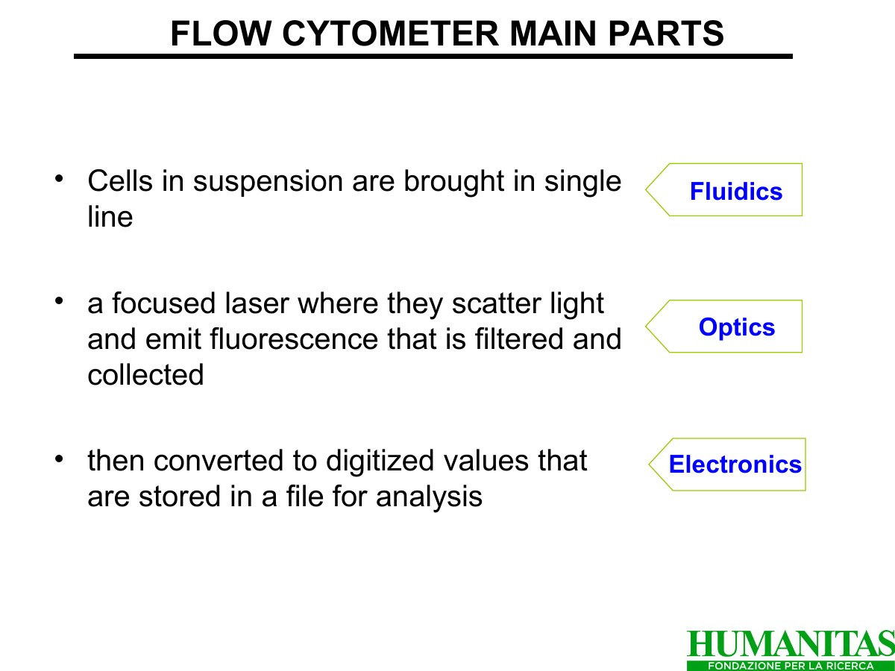

Extracted slide text

<pre>FLOW CYTOMETER MAIN PARTS

• Cells in suspension are brought in single     Fluidics
  line

• a focused laser where they scatter light
                                                 Optics
  and emit fluorescence that is filtered and
  collected

• then converted to digitized values that      Electronics
  are stored in a file for analysis</pre>

## Slide 6 — DIGITAL INSTRUMENTS FOR FLOW CYTOMETRY

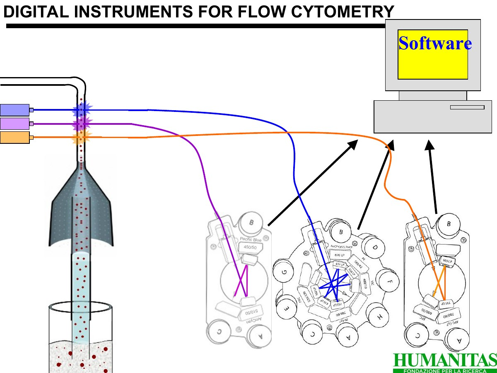

Extracted slide text

<pre>DIGITAL INSTRUMENTS FOR FLOW CYTOMETRY
                                         Software

                      Pacific Blue

                        450/50

                        510/
                            50
                              AmC
                         an      y</pre>

## Slide 7 — FLUIDIC PART

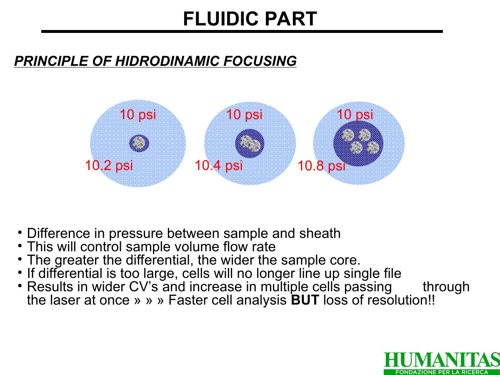

Extracted slide text

<pre>FLUIDIC PART

PRINCIPLE OF HIDRODINAMIC FOCUSING

                 10 psi             10 psi              10 psi

           10.2 psi            10.4 psi          10.8 psi

• Difference in pressure between sample and sheath
• This will control sample volume flow rate
• The greater the differential, the wider the sample core.
• If differential is too large, cells will no longer line up single file
• Results in wider CV’s and increase in multiple cells passing           through
  the laser at once » » » Faster cell analysis BUT loss of resolution!!</pre>

## Slide 8 — FLUIDIC PART

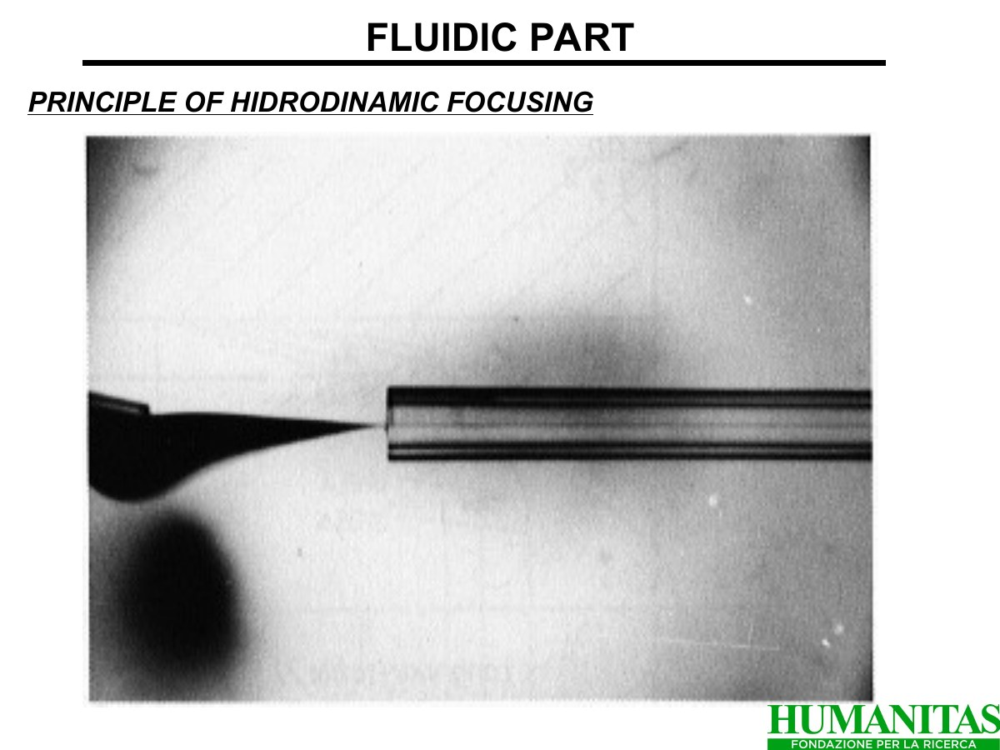

Extracted slide text

<pre>FLUIDIC PART
PRINCIPLE OF HIDRODINAMIC FOCUSING</pre>

## Slide 9 — OPTICAL PART

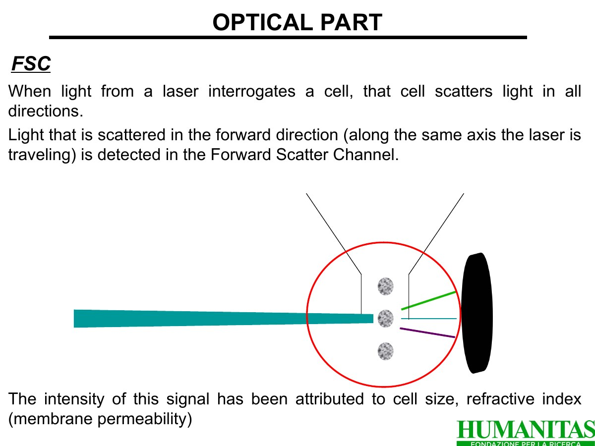

Extracted slide text

<pre>OPTICAL PART
FSC
When light from a laser interrogates a cell, that cell scatters light in all
directions.
Light that is scattered in the forward direction (along the same axis the laser is
traveling) is detected in the Forward Scatter Channel.

The intensity of this signal has been attributed to cell size, refractive index
(membrane permeability)</pre>

## Slide 10 — OPTICAL PART

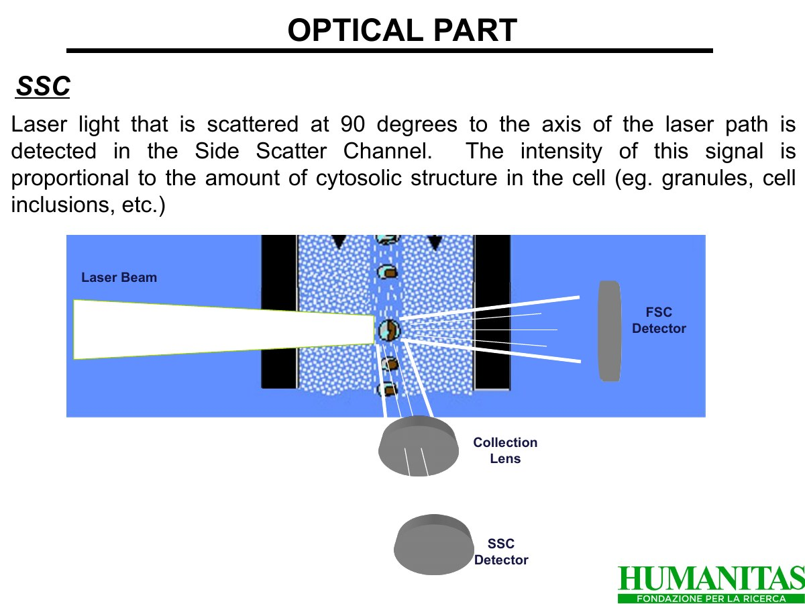

Extracted slide text

<pre>OPTICAL PART
SSC
Laser light that is scattered at 90 degrees to the axis of the laser path is
detected in the Side Scatter Channel. The intensity of this signal is
proportional to the amount of cytosolic structure in the cell (eg. granules, cell
inclusions, etc.)

       Laser Beam

                                                                  FSC
                                                                Detector

                                               Collection
                                                 Lens

                                                 SSC
                                               Detector</pre>

## Slide 11 — OPTICAL PART

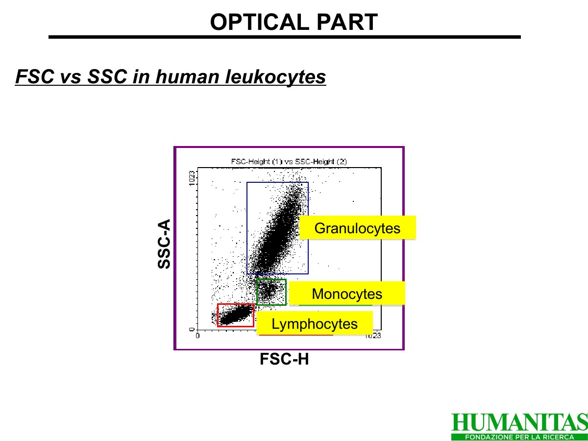

Extracted slide text

<pre>OPTICAL PART

FSC vs SSC in human leukocytes

             SSC-A

                                Granulocytes

                                Monocytes

                         Lymphocytes

                        FSC-H</pre>

## Slide 12 — OPTICAL PART

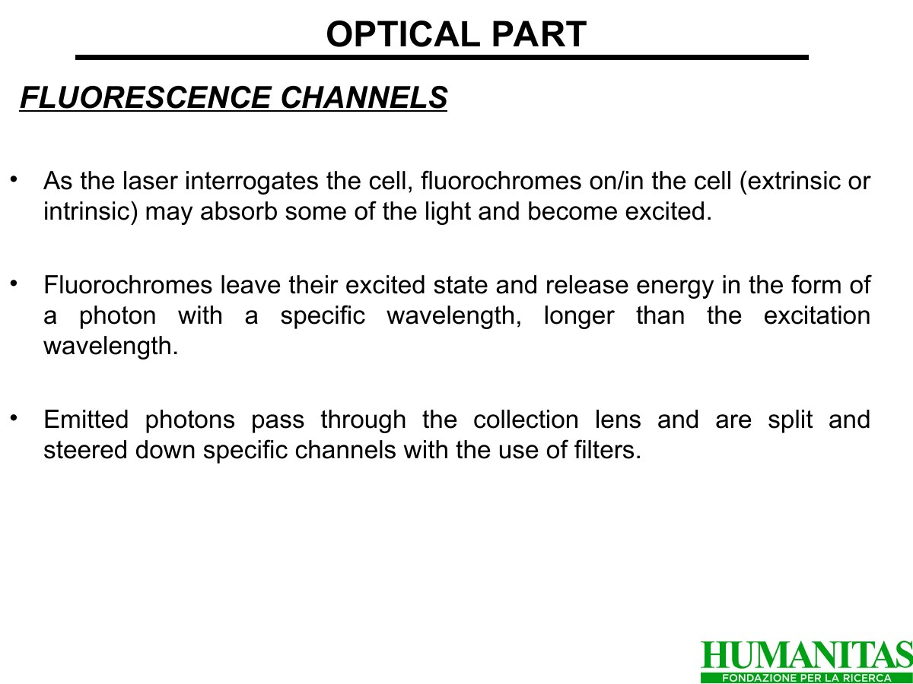

Extracted slide text

<pre>OPTICAL PART
FLUORESCENCE CHANNELS

• As the laser interrogates the cell, fluorochromes on/in the cell (extrinsic or
  intrinsic) may absorb some of the light and become excited.

• Fluorochromes leave their excited state and release energy in the form of
  a photon with a specific wavelength, longer than the excitation
  wavelength.

• Emitted photons pass through the collection lens and are split and
  steered down specific channels with the use of filters.</pre>

## Slide 13 — OPTICAL PART

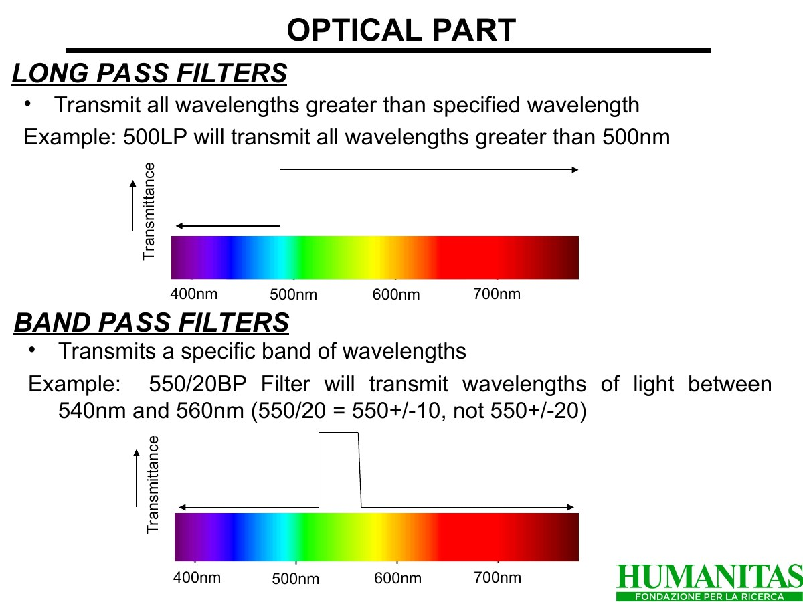

Extracted slide text

<pre>OPTICAL PART
LONG PASS FILTERS
• Transmit all wavelengths greater than specified wavelength
Example: 500LP will transmit all wavelengths greater than 500nm
           Transmittance

                             400nm   500nm   600nm   700nm

BAND PASS FILTERS
 • Transmits a specific band of wavelengths
 Example: 550/20BP Filter will transmit wavelengths of light between
   540nm and 560nm (550/20 = 550+/-10, not 550+/-20)
             Transmittance

                             400nm   500nm   600nm   700nm</pre>

## Slide 14 — DIGITAL INSTRUMENTS FOR FLOW CYTOMETRY

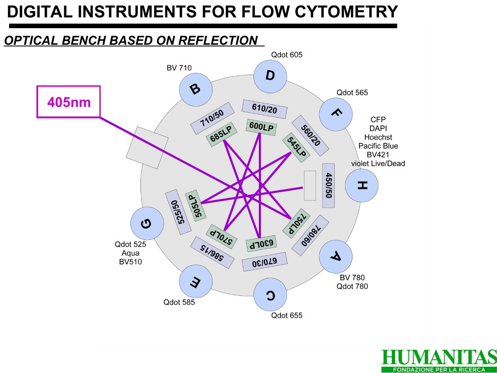

Extracted slide text

<pre>DIGITAL INSTRUMENTS FOR FLOW CYTOMETRY
OPTICAL BENCH BASED ON REFLECTION

     405nm</pre>

## Slide 15 — ANALOGICAL INSTRUMENTS FOR FLOW CYTOMETRY

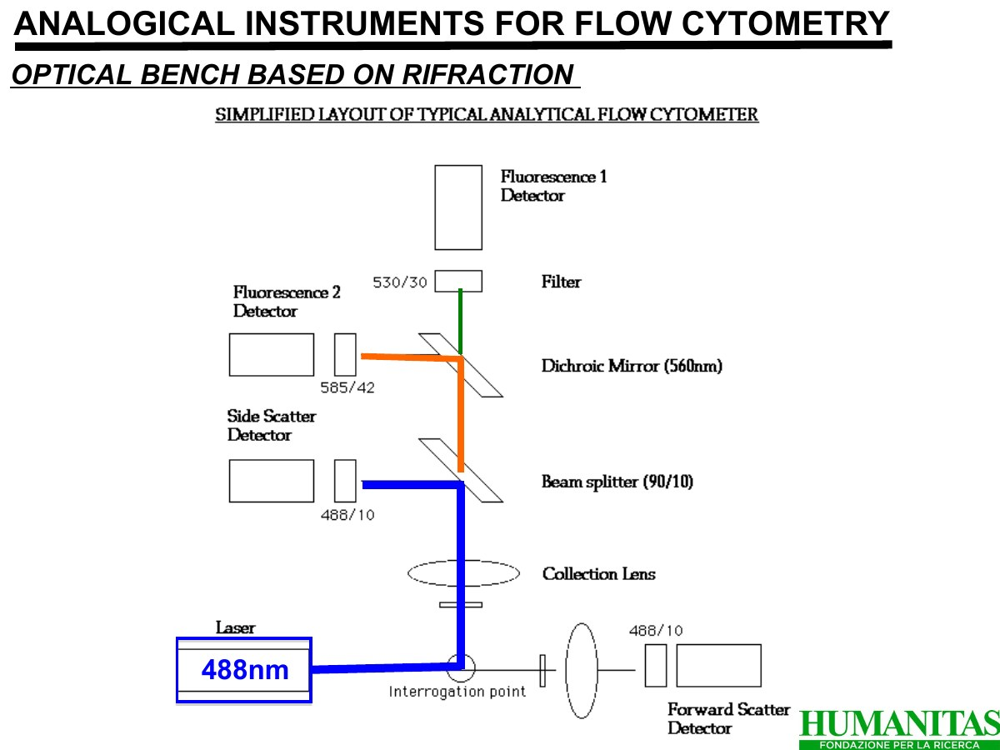

Extracted slide text

<pre>ANALOGICAL INSTRUMENTS FOR FLOW CYTOMETRY
OPTICAL BENCH BASED ON RIFRACTION

           488nm</pre>

## Slide 16 — OPTICAL PART

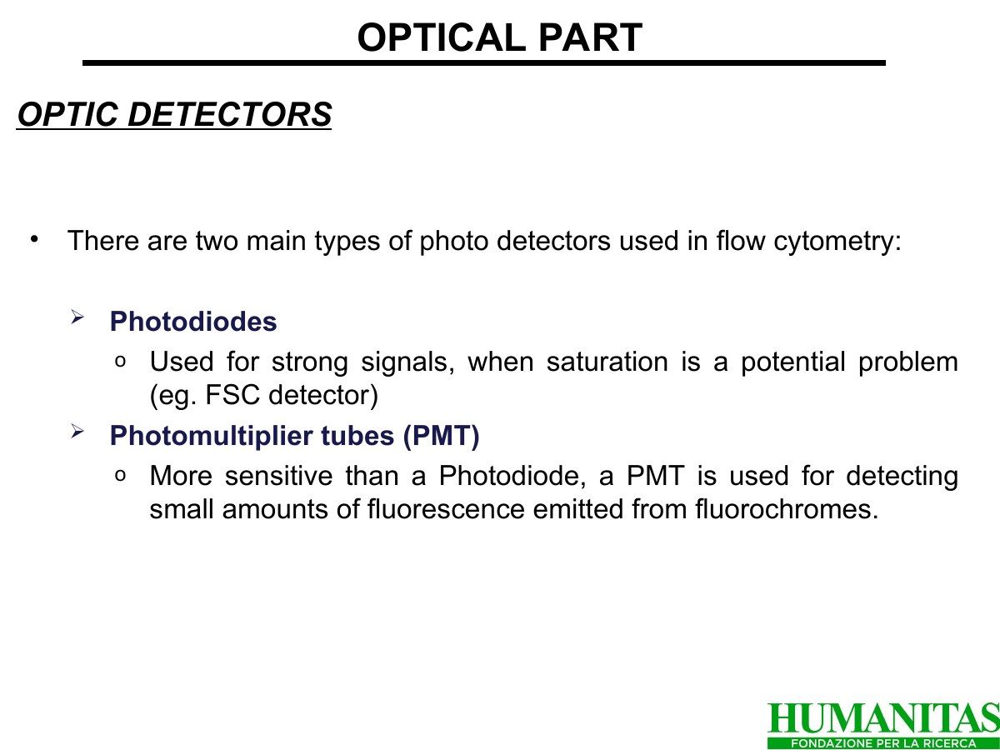

Extracted slide text

<pre>OPTICAL PART
OPTIC DETECTORS

• There are two main types of photo detectors used in flow cytometry:

      Photodiodes
       o Used for strong signals, when saturation is a potential problem
         (eg. FSC detector)
      Photomultiplier tubes (PMT)
       o More sensitive than a Photodiode, a PMT is used for detecting
         small amounts of fluorescence emitted from fluorochromes.</pre>

## Slide 17 — ELECTRONIC PART

Extracted slide text

<pre>ELECTRONIC PART
STEPS FROM OPTIC TO ELECTRONIC CONVERSION OF THE SIGNAL

1 Photon recovery from a single event in a time window
 2 Conversion into current
 3 Current transfer through an amplifier
 4 Conversion into a voltage pulse
 5 Conversion into a digitized value
 6 Software visualization</pre>

## Slide 18 — ELECTRONIC PART

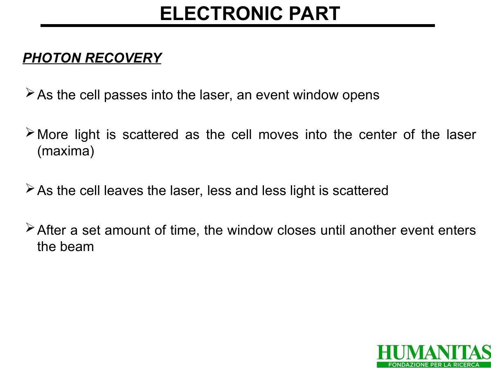

Extracted slide text

<pre>ELECTRONIC PART

PHOTON RECOVERY

 As the cell passes into the laser, an event window opens

 More light is scattered as the cell moves into the center of the laser
  (maxima)

 As the cell leaves the laser, less and less light is scattered

 After a set amount of time, the window closes until another event enters
  the beam</pre>

## Slide 19 — ELECTRONIC PART

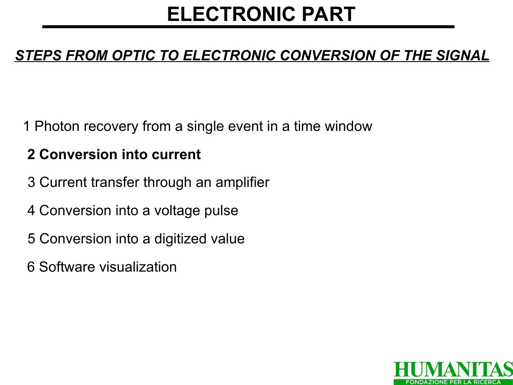

Extracted slide text

<pre>ELECTRONIC PART
STEPS FROM OPTIC TO ELECTRONIC CONVERSION OF THE SIGNAL

1 Photon recovery from a single event in a time window
 2 Conversion into current
 3 Current transfer through an amplifier
 4 Conversion into a voltage pulse
 5 Conversion into a digitized value
 6 Software visualization</pre>

## Slide 20 — ELECTRONIC PART

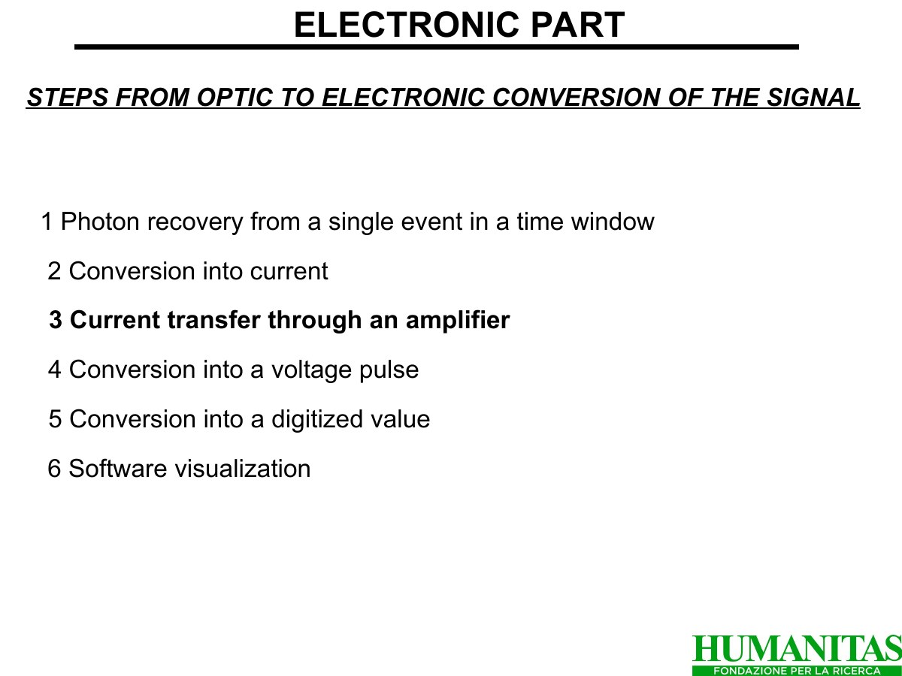

Extracted slide text

<pre>ELECTRONIC PART
STEPS FROM OPTIC TO ELECTRONIC CONVERSION OF THE SIGNAL

1 Photon recovery from a single event in a time window
 2 Conversion into current
 3 Current transfer through an amplifier
 4 Conversion into a voltage pulse
 5 Conversion into a digitized value
 6 Software visualization</pre>

## Slide 21 — ELECTRONIC PART

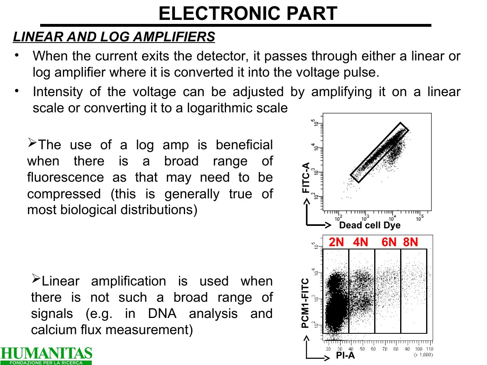

Extracted slide text

<pre>ELECTRONIC PART
LINEAR AND LOG AMPLIFIERS
• When the current exits the detector, it passes through either a linear or
   log amplifier where it is converted it into the voltage pulse.
• Intensity of the voltage can be adjusted by amplifying it on a linear
   scale or converting it to a logarithmic scale

  The use of a log amp is beneficial
  when there is a broad range of

                                                FITC-A
  fluorescence as that may need to be
  compressed (this is generally true of
  most biological distributions)
                                                            Dead cell Dye
                                                           2N 4N    6N 8N

   Linear amplification is used when
                                               PCM1-FITC
   there is not such a broad range of
   signals (e.g. in DNA analysis and
   calcium flux measurement)
                                                           PI-A</pre>

## Slide 22 — ELECTRONIC PART

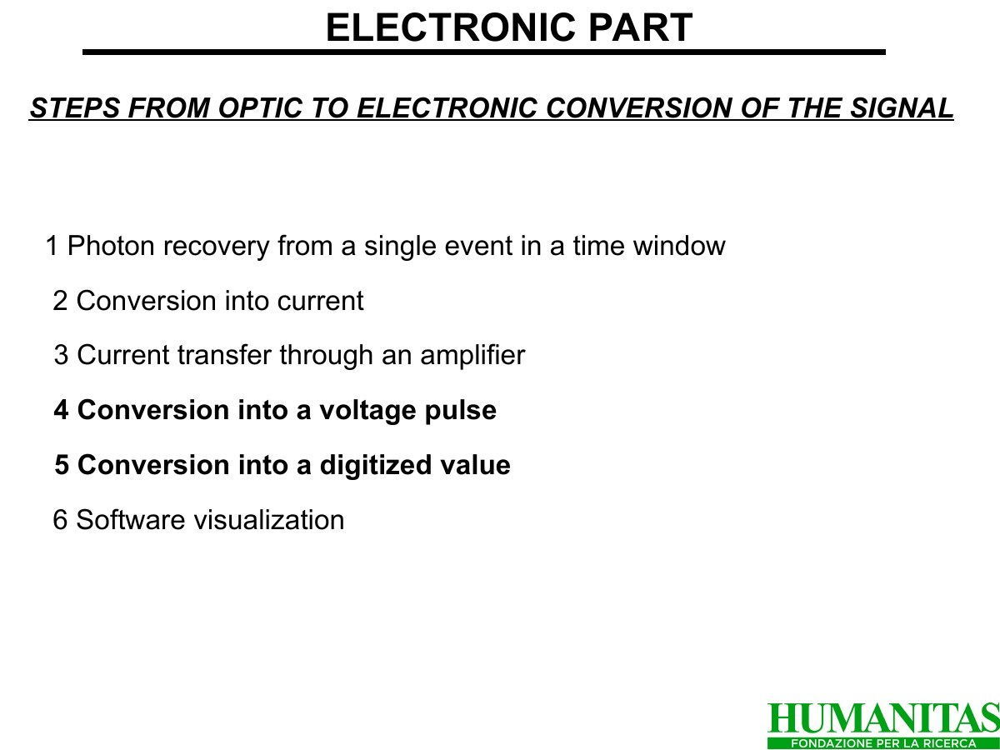

Extracted slide text

<pre>ELECTRONIC PART
STEPS FROM OPTIC TO ELECTRONIC CONVERSION OF THE SIGNAL

1 Photon recovery from a single event in a time window
 2 Conversion into current
 3 Current transfer through an amplifier
 4 Conversion into a voltage pulse
 5 Conversion into a digitized value
 6 Software visualization</pre>

## Slide 23 — ELECTRONIC PART

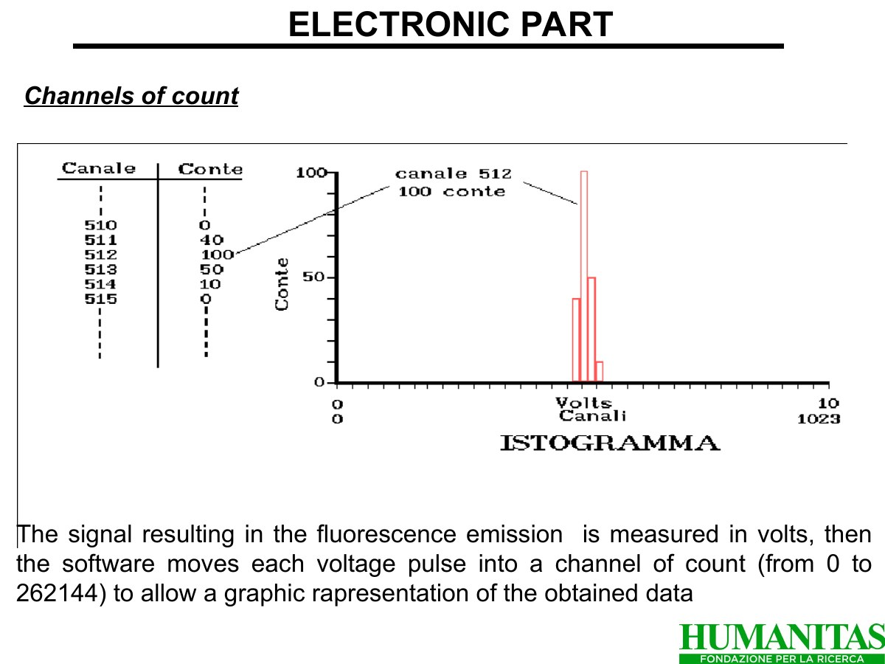

Extracted slide text

<pre>ELECTRONIC PART
Channels of count

The signal resulting in the fluorescence emission is measured in volts, then
the software moves each voltage pulse into a channel of count (from 0 to
262144) to allow a graphic rapresentation of the obtained data</pre>

## Slide 24 — ELECTRONIC PART

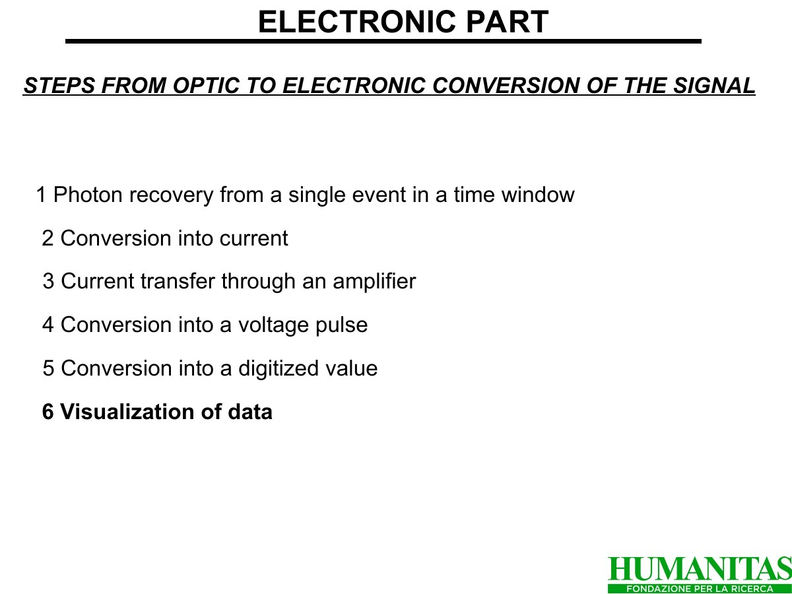

Extracted slide text

<pre>ELECTRONIC PART
STEPS FROM OPTIC TO ELECTRONIC CONVERSION OF THE SIGNAL

1 Photon recovery from a single event in a time window
 2 Conversion into current
 3 Current transfer through an amplifier
 4 Conversion into a voltage pulse
 5 Conversion into a digitized value
 6 Visualization of data</pre>

## Slide 25 — ELECTRONIC PART

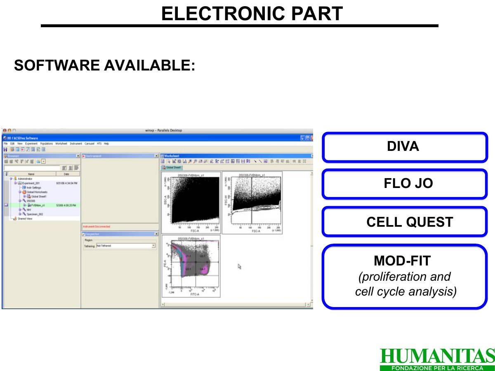

Extracted slide text

<pre>ELECTRONIC PART

SOFTWARE AVAILABLE:

                                       DIVA

                                      FLO JO

                                   CELL QUEST

                                    MOD-FIT
                                  (proliferation and
                                 cell cycle analysis)</pre>

## Slide 26 — FLOW CYTOMETRY UNIT EQUIPMENT

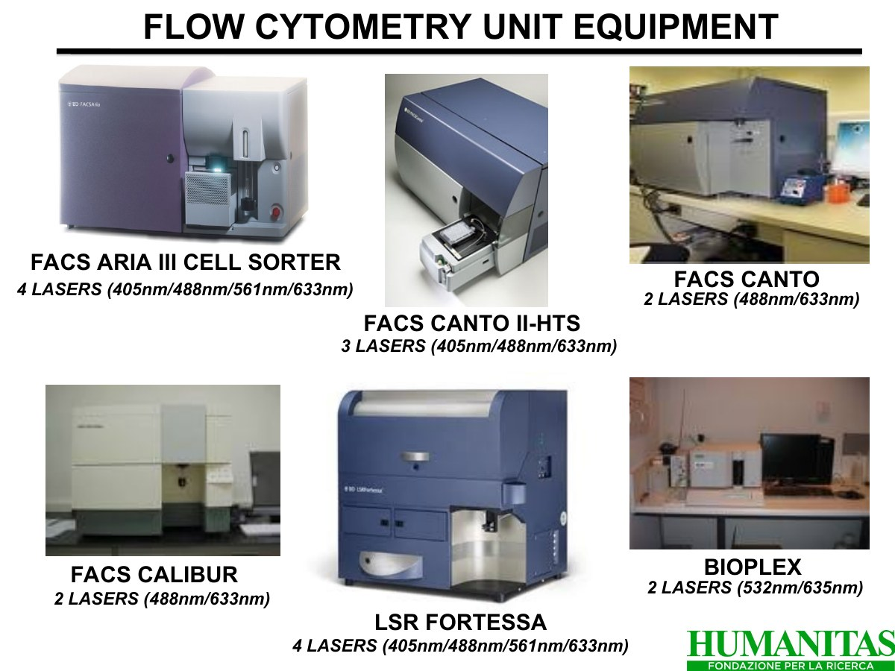

Extracted slide text

<pre>FLOW CYTOMETRY UNIT EQUIPMENT

 FACS ARIA III CELL SORTER
4 LASERS (405nm/488nm/561nm/633nm)                                  FACS CANTO
                                                                 2 LASERS (488nm/633nm)
                                     FACS CANTO II-HTS
                                3 LASERS (405nm/488nm/633nm)

     FACS CALIBUR                                                      BIOPLEX
                                                                 2 LASERS (532nm/635nm)
   2 LASERS (488nm/633nm)
                                     LSR FORTESSA
                            4 LASERS (405nm/488nm/561nm/633nm)</pre>

## Slide 27 — Untitled slide

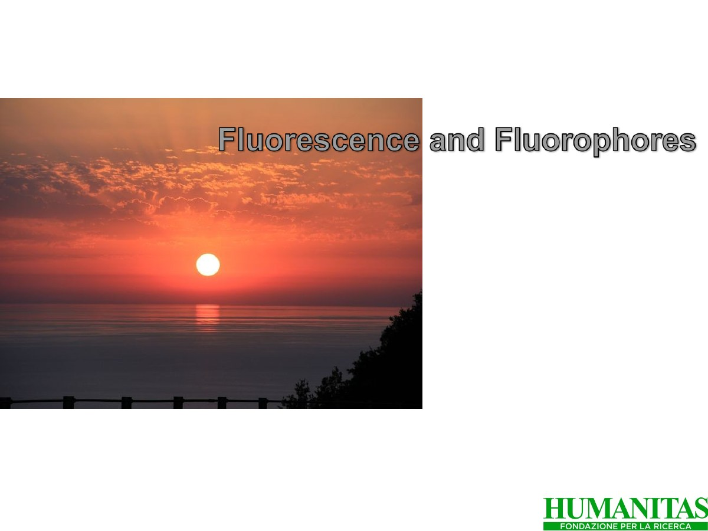

## Slide 28 — Fluorescence

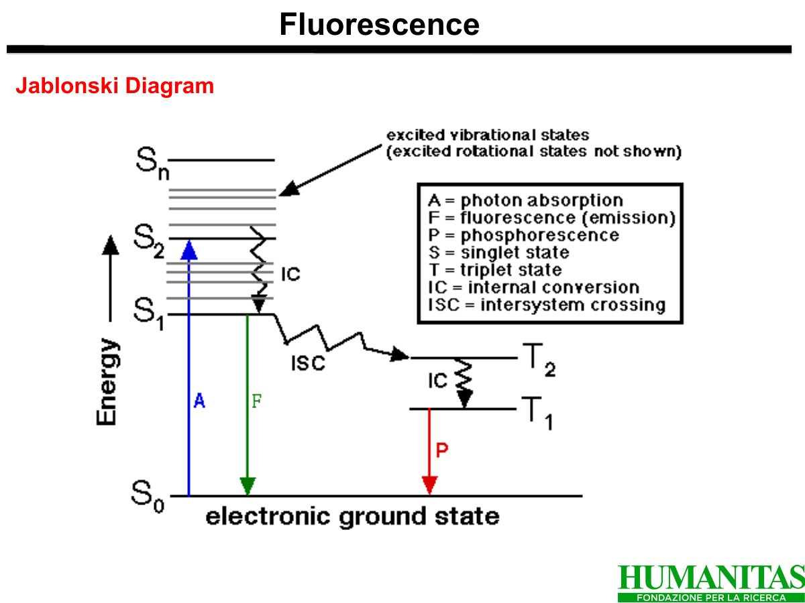

Extracted slide text

<pre>Fluorescence
Jablonski Diagram</pre>

## Slide 29 — Fluorophores

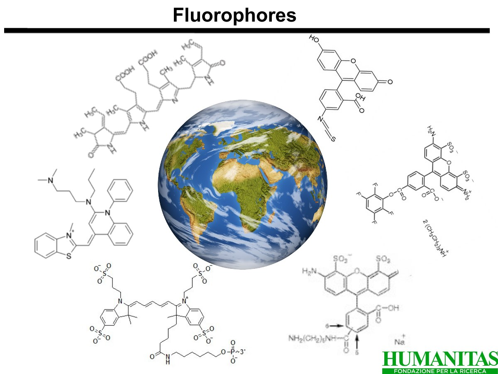

Extracted slide text

<pre>Fluorophores</pre>

## Slide 30 — FLUOROPHORES CLASSIFICATION

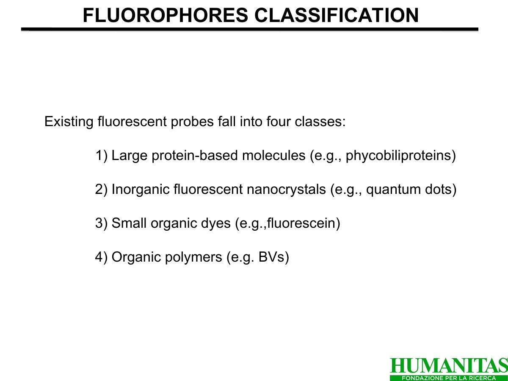

Extracted slide text

<pre>FLUOROPHORES CLASSIFICATION

Existing fluorescent probes fall into four classes:

        1) Large protein-based molecules (e.g., phycobiliproteins)

        2) Inorganic fluorescent nanocrystals (e.g., quantum dots)

        3) Small organic dyes (e.g.,fluorescein)

        4) Organic polymers (e.g. BVs)</pre>

## Slide 31 — FLUOROPHORES CLASSIFICATION

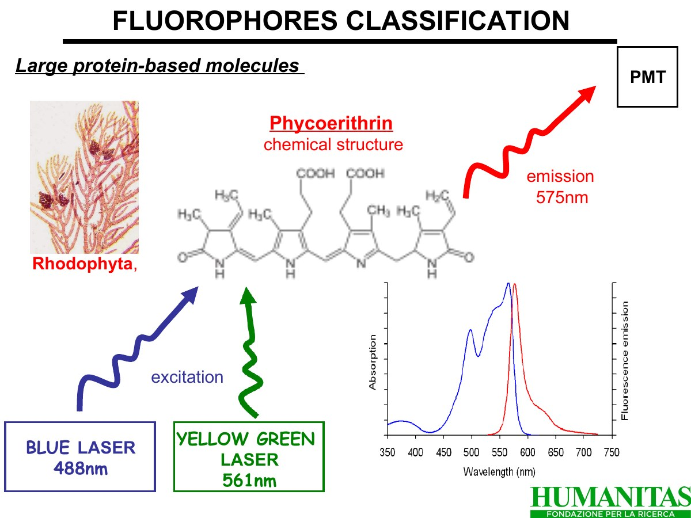

Extracted slide text

<pre>FLUOROPHORES CLASSIFICATION
Large protein-based molecules
                                                            PMT

                            Phycoerithrin
                            chemical structure
                                                 emission
                                                  575nm

 Rhodophyta,

               excitation

                  YELLOW GREEN
 BLUE LASER
                      LASER
    488nm
                      561nm</pre>

## Slide 32 — FLUOROPHORES CLASSIFICATION

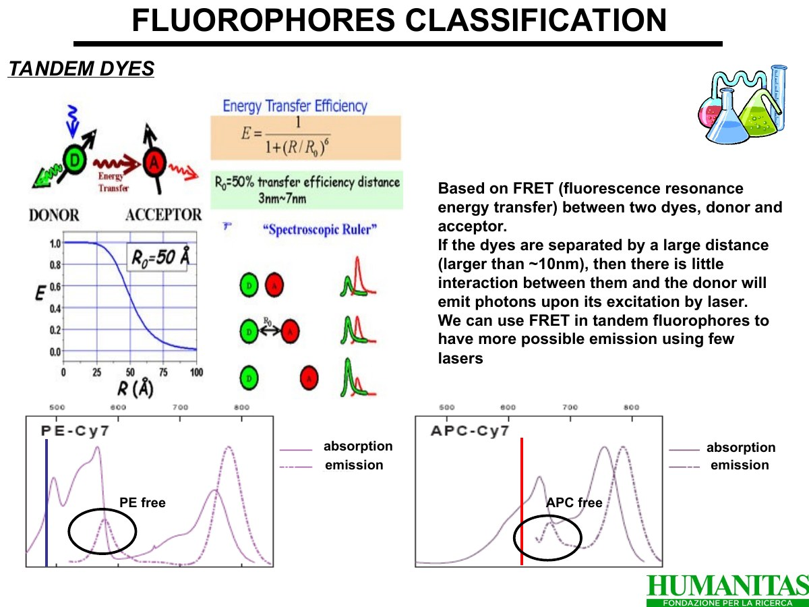

Extracted slide text

<pre>FLUOROPHORES CLASSIFICATION
TANDEM DYES

                               Based on FRET (fluorescence resonance
                               energy transfer) between two dyes, donor and
                               acceptor.
                               If the dyes are separated by a large distance
                               (larger than ~10nm), then there is little
                               interaction between them and the donor will
                               emit photons upon its excitation by laser.
                               We can use FRET in tandem fluorophores to
                               have more possible emission using few
                               lasers

                  absorption                                      absorption
                  emission                                         emission

        PE free                              APC free</pre>

## Slide 33 — FLUOROPHORES CLASSIFICATION

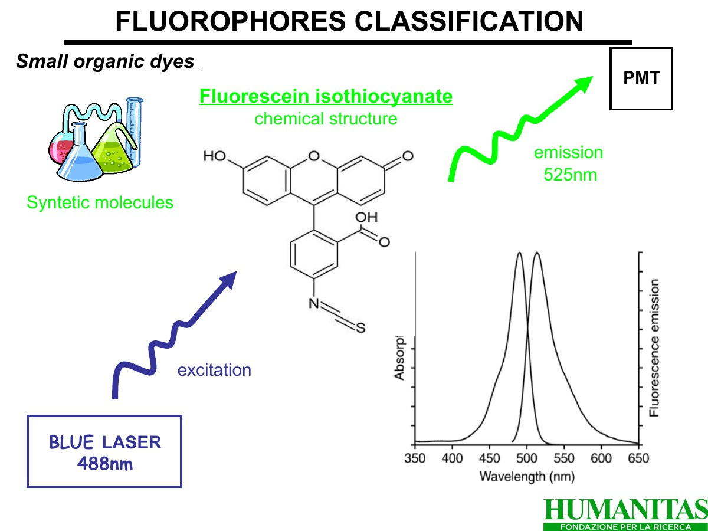

Extracted slide text

<pre>FLUOROPHORES CLASSIFICATION
Small organic dyes
                                                                   PMT
                        Fluorescein isothiocyanate
                                   chemical structure
                                                        emission
                                                         525nm
 Syntetic molecules

                      excitation

   BLUE LASER
      488nm</pre>

## Slide 34 — FLUOROPHORES CLASSIFICATION

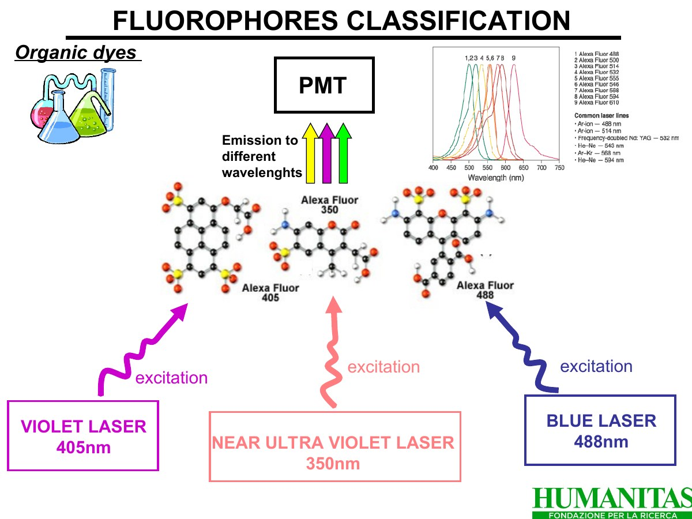

Extracted slide text

<pre>FLUOROPHORES CLASSIFICATION
Organic dyes
                                  PMT

                        Emission to
                        different
                        wavelenghts

                                        excitation    excitation
           excitation

VIOLET LASER                                         BLUE LASER
    405nm               NEAR ULTRA VIOLET LASER        488nm
                                 350nm</pre>

## Slide 35 — FLUOROPHORES CLASSIFICATION

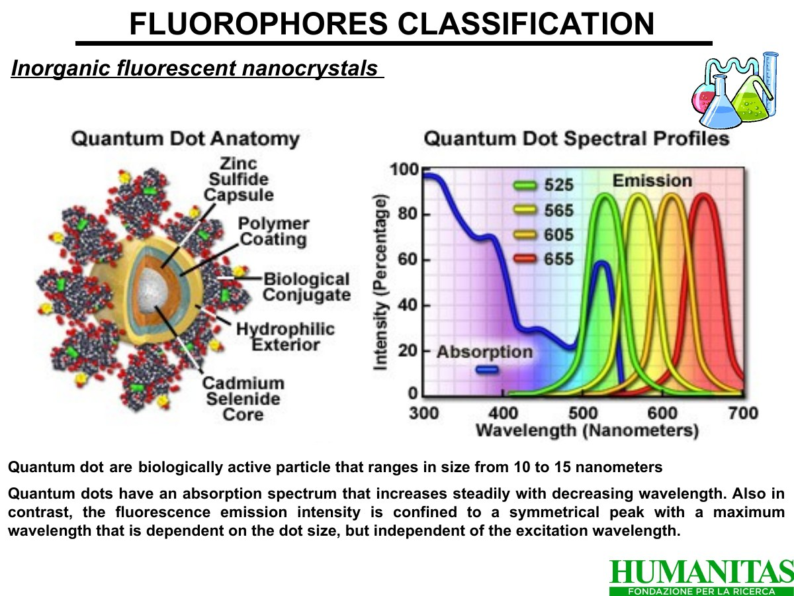

Extracted slide text

<pre>FLUOROPHORES CLASSIFICATION
Inorganic fluorescent nanocrystals

Quantum dot are biologically active particle that ranges in size from 10 to 15 nanometers
Quantum dots have an absorption spectrum that increases steadily with decreasing wavelength. Also in
contrast, the fluorescence emission intensity is confined to a symmetrical peak with a maximum
wavelength that is dependent on the dot size, but independent of the excitation wavelength.</pre>

## Slide 36 — FLUOROPHORES CLASSIFICATION

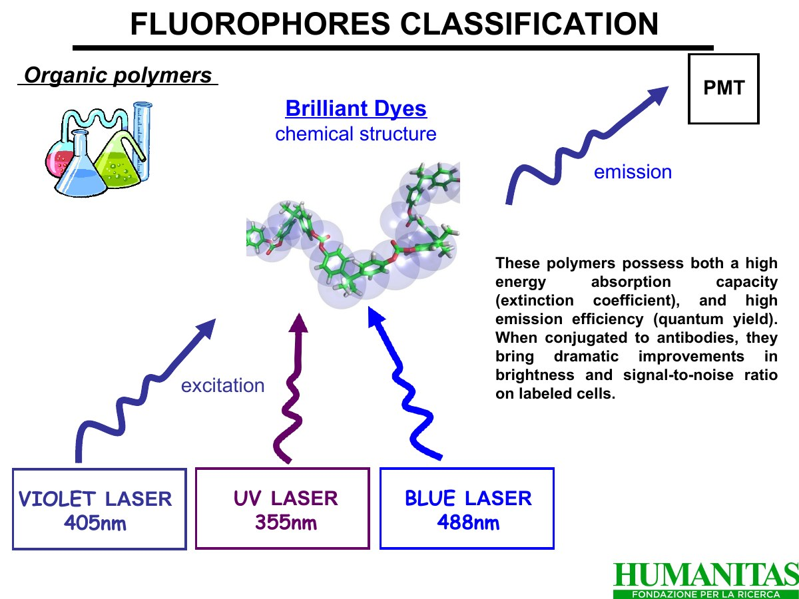

Extracted slide text

<pre>FLUOROPHORES CLASSIFICATION
Organic polymers
                                                                           PMT
                             Brilliant Dyes
                            chemical structure
                                                             emission

                                                 These polymers possess both a high
                                                 energy       absorption     capacity
                                                 (extinction coefficient), and high
                                                 emission efficiency (quantum yield).
                                                 When conjugated to antibodies, they
                                                 bring dramatic improvements in
                                                 brightness and signal-to-noise ratio
               excitation                        on labeled cells.

VIOLET LASER         UV LASER             BLUE LASER
   405nm              355nm                  488nm</pre>

## Slide 37 — BRILLIANT DYES STRUCTURE AND FEATURES

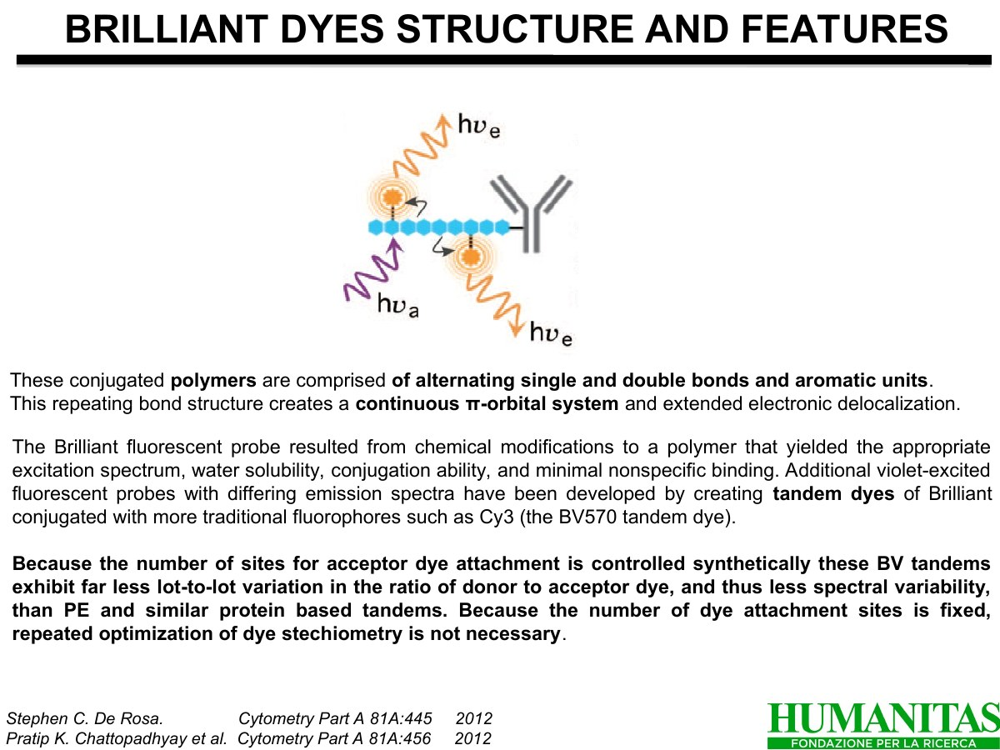

Extracted slide text

<pre>BRILLIANT DYES STRUCTURE AND FEATURES

These conjugated polymers are comprised of alternating single and double bonds and aromatic units.
This repeating bond structure creates a continuous π-orbital system and extended electronic delocalization.

The Brilliant fluorescent probe resulted from chemical modifications to a polymer that yielded the appropriate
excitation spectrum, water solubility, conjugation ability, and minimal nonspecific binding. Additional violet-excited
fluorescent probes with differing emission spectra have been developed by creating tandem dyes of Brilliant
conjugated with more traditional fluorophores such as Cy3 (the BV570 tandem dye).

Because the number of sites for acceptor dye attachment is controlled synthetically these BV tandems
exhibit far less lot-to-lot variation in the ratio of donor to acceptor dye, and thus less spectral variability,
than PE and similar protein based tandems. Because the number of dye attachment sites is fixed,
repeated optimization of dye stechiometry is not necessary.

Stephen C. De Rosa.            Cytometry Part A 81A:445   2012
Pratip K. Chattopadhyay et al. Cytometry Part A 81A:456   2012</pre>

## Slide 38 — …MORE ABOUT BRILLIANT

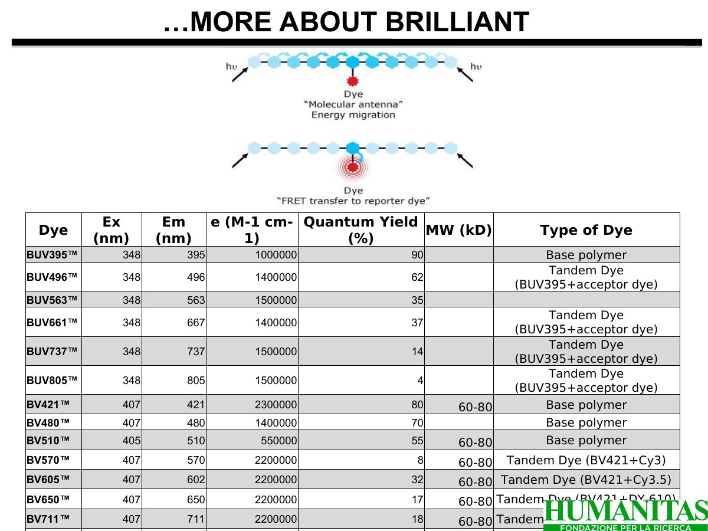

Extracted slide text

<pre>…MORE ABOUT BRILLIANT

           Ex       Em      e (M-1 cm- Quantum Yield
 Dye                                                 MW (kD)        Type of Dye
          (nm)     (nm)         1)          (%)
BUV395™      348      395        1000000          90                 Base polymer
                                                                      Tandem Dye
BUV496™      348      496        1400000          62
                                                                 (BUV395+acceptor dye)
BUV563™      348      563        1500000          35
                                                                      Tandem Dye
BUV661™      348      667        1400000          37
                                                                 (BUV395+acceptor dye)
                                                                      Tandem Dye
BUV737™      348      737        1500000          14
                                                                 (BUV395+acceptor dye)
                                                                      Tandem Dye
BUV805™      348      805        1500000           4
                                                                 (BUV395+acceptor dye)
BV421™       407      421        2300000          80    60-80        Base polymer
BV480™       407      480        1400000          70                 Base polymer
BV510™       405      510         550000          55    60-80        Base polymer
BV570™       407      570        2200000           8    60-80   Tandem Dye (BV421+Cy3)
BV605™       407      602        2200000          32    60-80 Tandem Dye (BV421+Cy3.5)
BV650™       407      650        2200000          17    60-80 Tandem Dye (BV421+DY-610)
BV711™       407      711        2200000          18    60-80 Tandem Dye (BV421+DY-682)</pre>

## Slide 39 — BRILLIANT VIOLET FILTERS EQUIPMENT

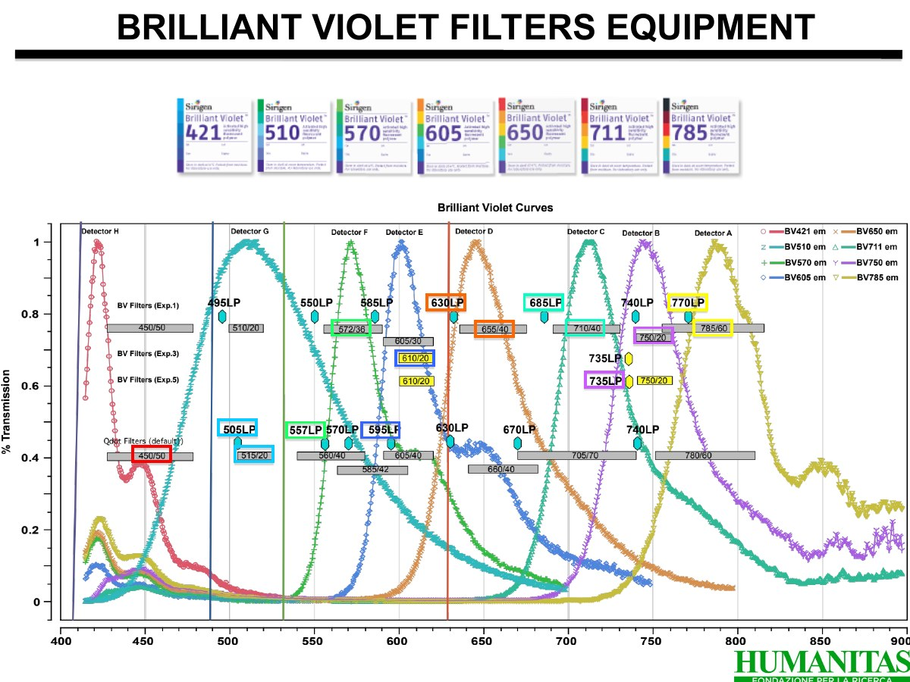

Extracted slide text

<pre>BRILLIANT VIOLET FILTERS EQUIPMENT</pre>

## Slide 40 — BRILLIANT STAIN BUFFER

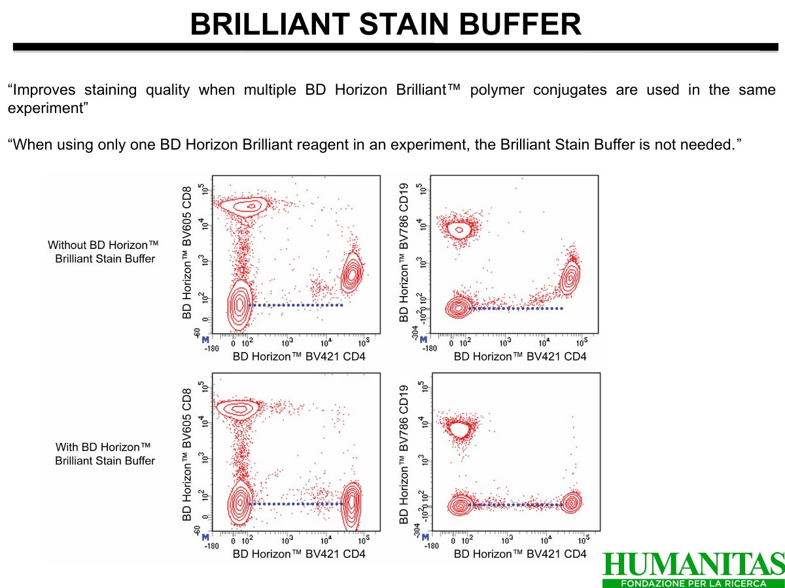

Extracted slide text

<pre>BRILLIANT STAIN BUFFER
“Improves staining quality when multiple BD Horizon Brilliant™ polymer conjugates are used in the same
experiment”

“When using only one BD Horizon Brilliant reagent in an experiment, the Brilliant Stain Buffer is not needed.”</pre>

## Slide 41 — SOME EXAMPLES OF BRILLIANT DYES STAINING

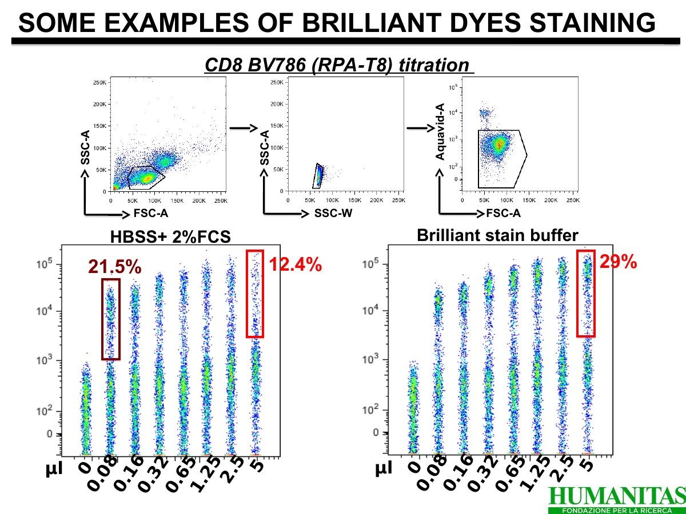

Extracted slide text

<pre>SOME EXAMPLES OF BRILLIANT DYES STAINING
                        CD8 BV786 (RPA-T8) titration

                                                    Aquavid-A
      SSC-A

                             SSC-A
                FSC-A                SSC-W                      FSC-A

              HBSS+ 2%FCS                         Brilliant stain buffer
         21.5%                  12.4%                                      29%

 μl                                          μl
                                                     08

                                                  0. 6

                                                      5
         08
         16

                                                     25
          5
         25

                                                     65
                                                     32
         65
         32

                                                      5
          5

                                                     0
         0

                                                     1

                                                   2.
       2.

                                                  0.
                                                  0.
      0.
      0.

                                                  1.
      1.

                                                  0.
      0.
      0.</pre>

## Slide 42 — SOME EXAMPLES OF BRILLIANT DYES STAINING

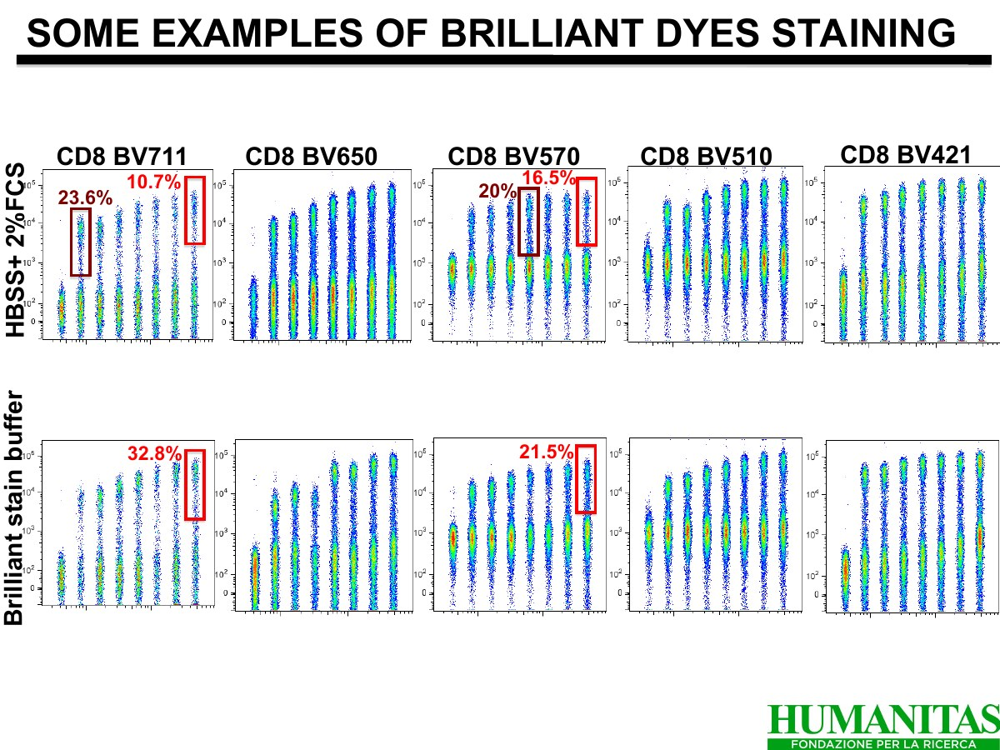

Extracted slide text

<pre>SOME EXAMPLES OF BRILLIANT DYES STAINING

                         CD8 BV711       CD8 BV650   CD8 BV570       CD8 BV510   CD8 BV421
 HBSS+ 2%FCS

                                 10.7%                       16.5%
                         23.6%                         20%
Brilliant stain buffer

                                 32.8%                       21.5%</pre>

## Slide 43 — … AND BRILLIANT BLUE CONJUGATES TITRATION

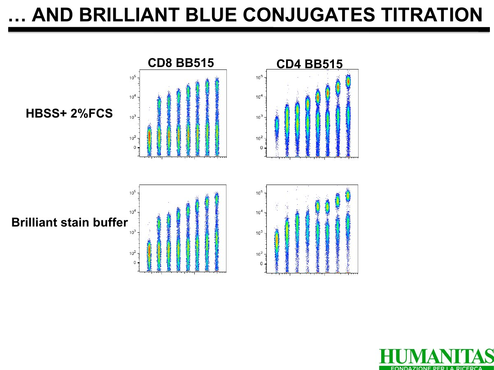

Extracted slide text

<pre>… AND BRILLIANT BLUE CONJUGATES TITRATION

                         CD8 BB515   CD4 BB515

  HBSS+ 2%FCS

Brilliant stain buffer</pre>

## Slide 44 — RESOLUTION MATRIX

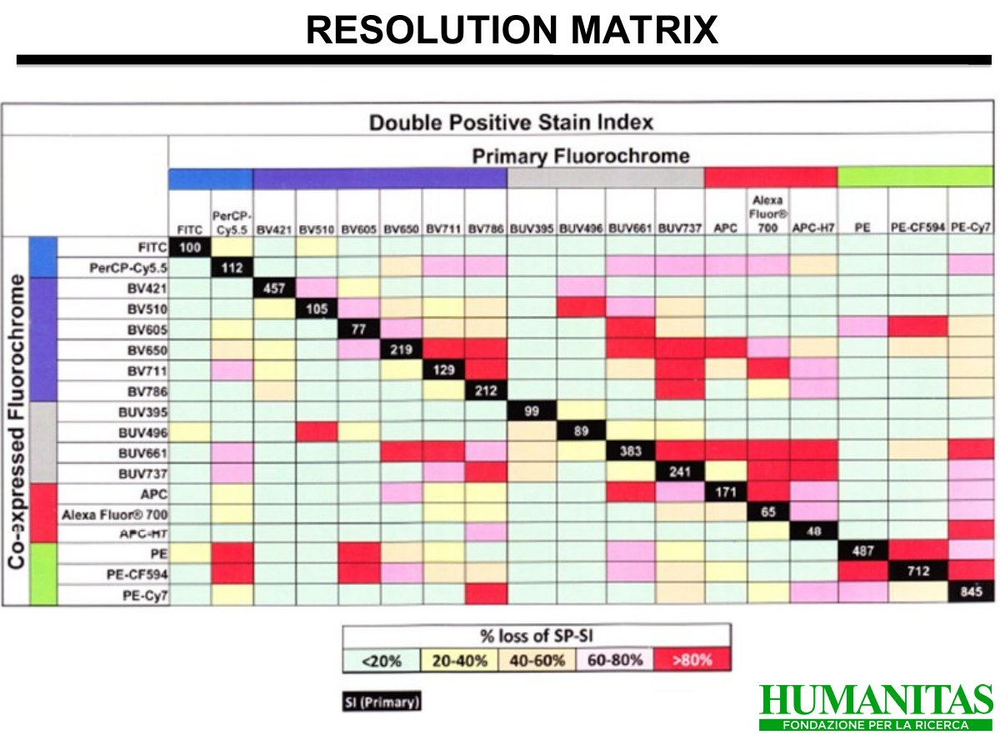

Extracted slide text

<pre>RESOLUTION MATRIX</pre>

## Slide 45 — BUV395 BUV496 SPILLOVER

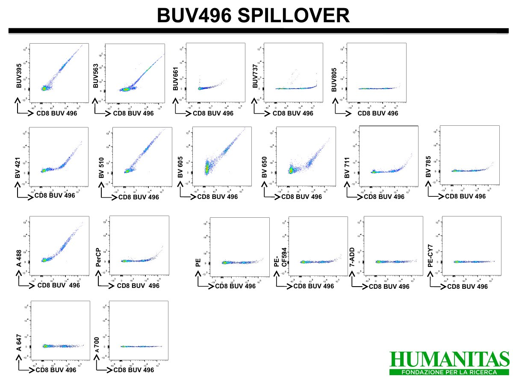

Extracted slide text

<pre>BUV395                                            BUV496 SPILLOVER

                       BUV563

                                                                              BUV737
                                                   BUV661

                                                                                                                 BUV805
         CD8 BUV 496                CD8 BUV 496                CD8 BUV 496                      CD8 BUV 496                          CD8 BUV 496

                                                                                                                                                      BV 785
                                                      BV 605

                                                                                       BV 650

                                                                                                                          BV 711
BV 421

                           BV 510

         CD8 BUV 496                 CD8 BUV 496                CD8 BUV 496                       CD8 BUV 496                         CD8 BUV 496               CD8 BUV 496

                                                                                                                                                       PE-CY7
                                                                                                                             7-ADD
                                                                                                CF594
                        PerCP
A 488

                                                                                                PE-
                                                               PE

         CD8 BUV 496                 CD8 BUV 496                    CD8 BUV 496                         CD8 BUV 496                     CD8 BUV 496             CD8 BUV 496
A 647

                       A 700

         CD8 BUV 496                CD8 BUV 496</pre>

## Slide 46 — BRILLIANT DYES CONCLUSIONS

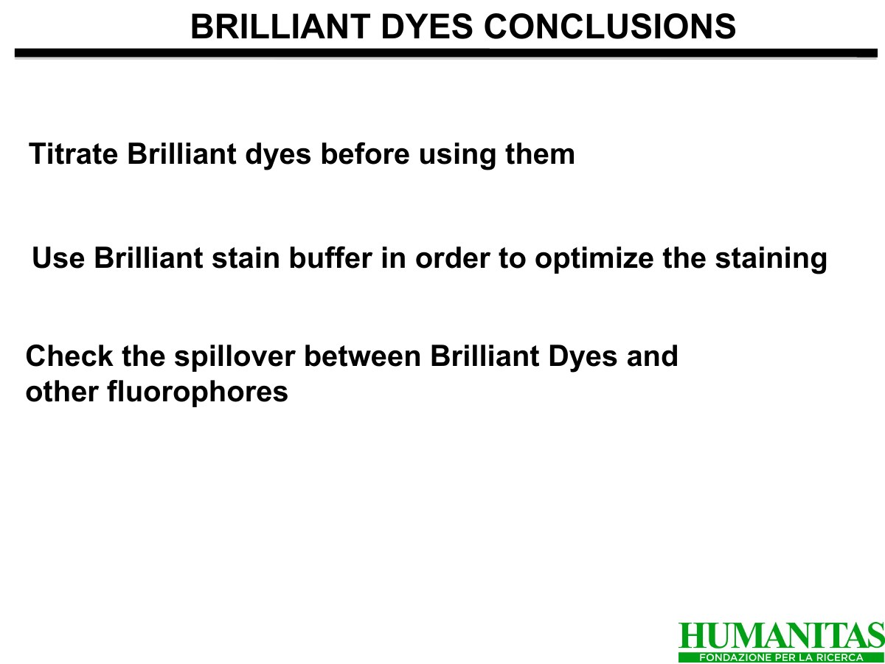

Extracted slide text

<pre>BRILLIANT DYES CONCLUSIONS

Titrate Brilliant dyes before using them

Use Brilliant stain buffer in order to optimize the staining

Check the spillover between Brilliant Dyes and
other fluorophores</pre>

## Slide 47 — EVALUATION OF FLUOROPHORE BRILLIANCE

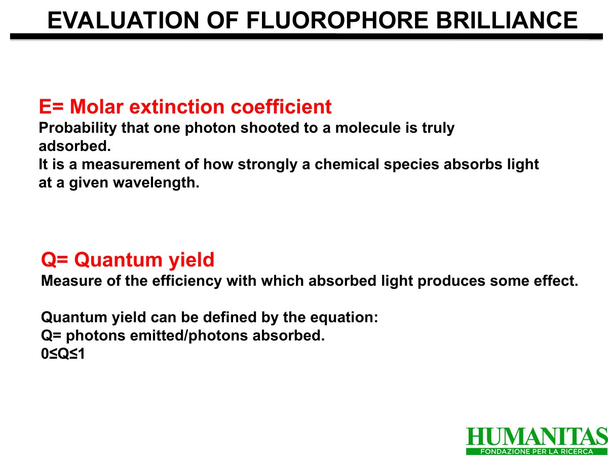

Extracted slide text

<pre>EVALUATION OF FLUOROPHORE BRILLIANCE

E= Molar extinction coefficient
Probability that one photon shooted to a molecule is truly
adsorbed.
It is a measurement of how strongly a chemical species absorbs light
at a given wavelength.

Q= Quantum yield
Measure of the efficiency with which absorbed light produces some effect.

Quantum yield can be defined by the equation:
Q= photons emitted/photons absorbed.
0≤Q≤1</pre>

## Slide 48 — EVALUATION OF FLUOROPHORE BRILLIANCE: F/P ratio

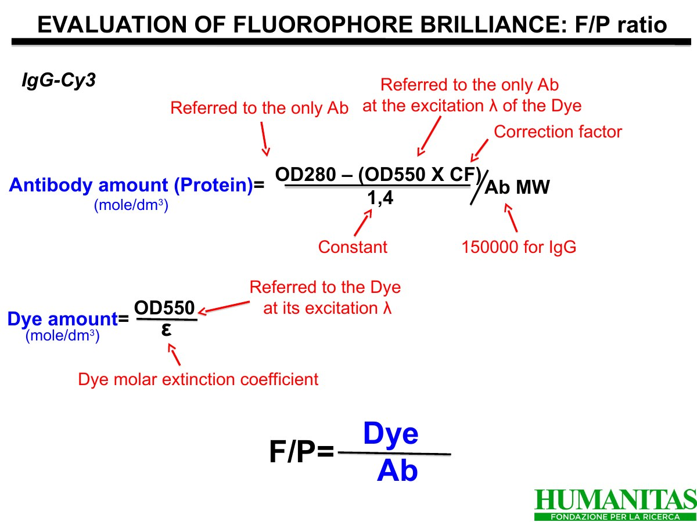

Extracted slide text

<pre>EVALUATION OF FLUOROPHORE BRILLIANCE: F/P ratio

 IgG-Cy3                                          Referred to the only Ab
                       Referred to the only Ab at the excitation λ of the Dye
                                                                  Correction factor

                                    OD280 – (OD550 X CF)
Antibody amount (Protein)=                               Ab MW
          (mole/dm3)                         1,4

                                          Constant           150000 for IgG

                                 Referred to the Dye
               OD550              at its excitation λ
Dye amount=
 (mole/dm3)        ε

        Dye molar extinction coefficient

                                         Dye
                                    F/P=
                                          Ab</pre>

## Slide 49 — GENETICALLY ENCODED FLUORESCENT PROTEINS

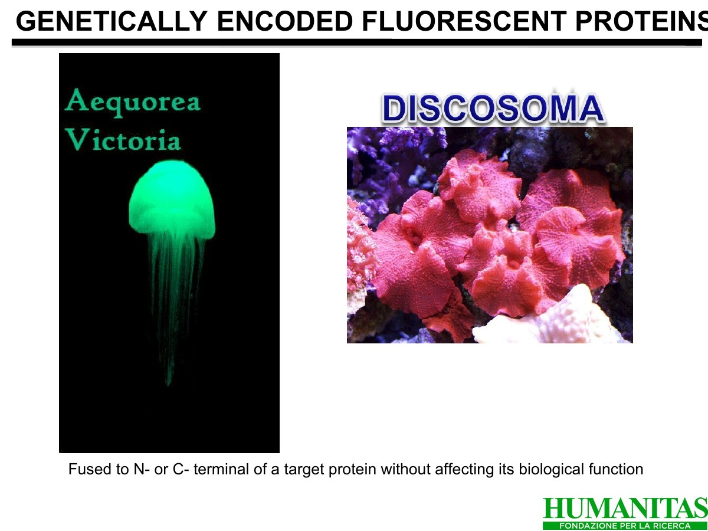

Extracted slide text

<pre>GENETICALLY ENCODED FLUORESCENT PROTEINS

   Fused to N- or C- terminal of a target protein without affecting its biological function</pre>

## Slide 50 — PROPERTIES OF THE BEST FP VARIANTS

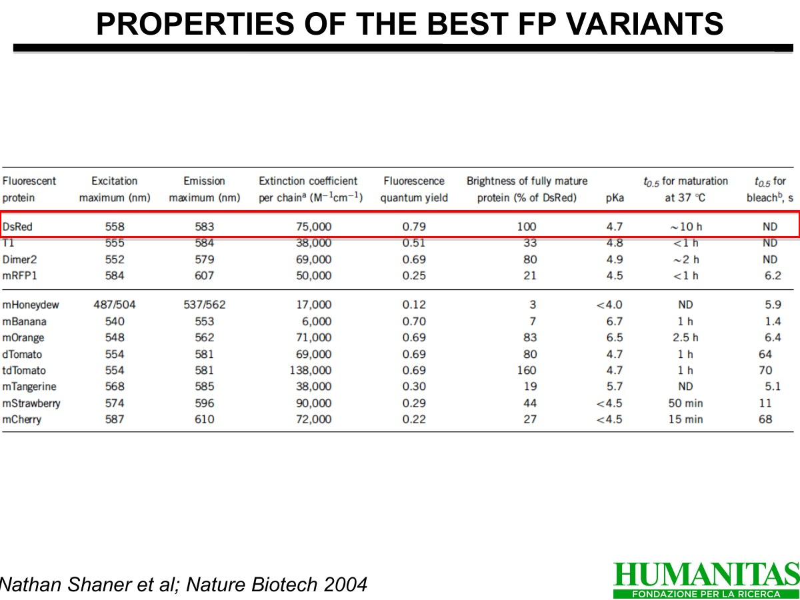

Extracted slide text

<pre>PROPERTIES OF THE BEST FP VARIANTS

Nathan Shaner et al; Nature Biotech 2004</pre>

## Slide 51 — MAIN FACTORS THAT INFLUENCE FLUORESCENCE

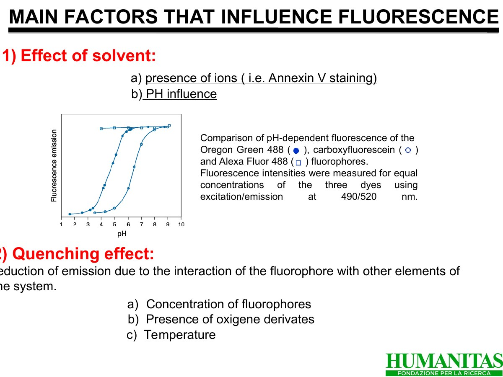

Extracted slide text

<pre>MAIN FACTORS THAT INFLUENCE FLUORESCENCE
 1) Effect of solvent:
                        a) presence of ions ( i.e. Annexin V staining)
                        b) PH influence

                                     Comparison of pH-dependent fluorescence of the
                                     Oregon Green 488 ( ), carboxyfluorescein ( )
                                     and Alexa Fluor 488 ( ) fluorophores.
                                     Fluorescence intensities were measured for equal
                                     concentrations of the three dyes using
                                     excitation/emission      at    490/520      nm.

2) Quenching effect:
eduction of emission due to the interaction of the fluorophore with other elements of
he system.
                       a) Concentration of fluorophores
                       b) Presence of oxigene derivates
                       c) Temperature</pre>

## Slide 52 — MAIN FACTORS THAT INFLUENCE FLUORESCENCE

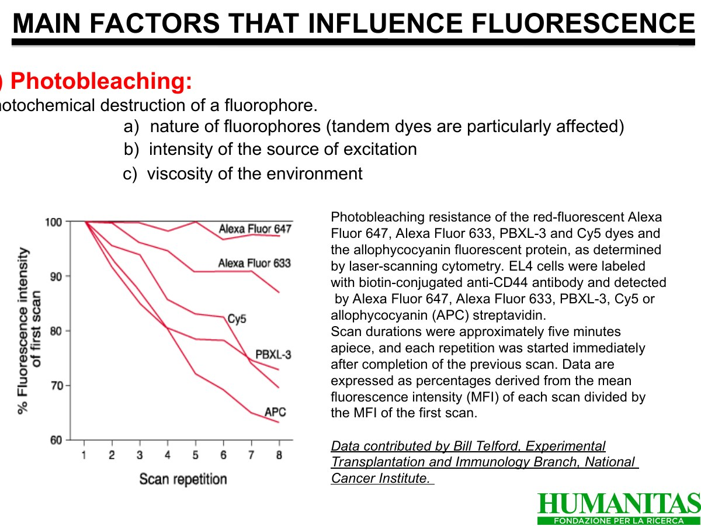

Extracted slide text

<pre>MAIN FACTORS THAT INFLUENCE FLUORESCENCE

) Photobleaching:
hotochemical destruction of a fluorophore.
               a) nature of fluorophores (tandem dyes are particularly affected)
               b) intensity of the source of excitation
               c) viscosity of the environment

                                          Photobleaching resistance of the red-fluorescent Alexa
                                          Fluor 647, Alexa Fluor 633, PBXL-3 and Cy5 dyes and
                                          the allophycocyanin fluorescent protein, as determined
                                          by laser-scanning cytometry. EL4 cells were labeled
                                          with biotin-conjugated anti-CD44 antibody and detected
                                           by Alexa Fluor 647, Alexa Fluor 633, PBXL-3, Cy5 or
                                          allophycocyanin (APC) streptavidin.
                                          Scan durations were approximately five minutes
                                          apiece, and each repetition was started immediately
                                          after completion of the previous scan. Data are
                                          expressed as percentages derived from the mean
                                          fluorescence intensity (MFI) of each scan divided by
                                          the MFI of the first scan.

                                          Data contributed by Bill Telford, Experimental
                                          Transplantation and Immunology Branch, National
                                          Cancer Institute.</pre>

## Slide 53 — THE BEST FLUOROPHORE:

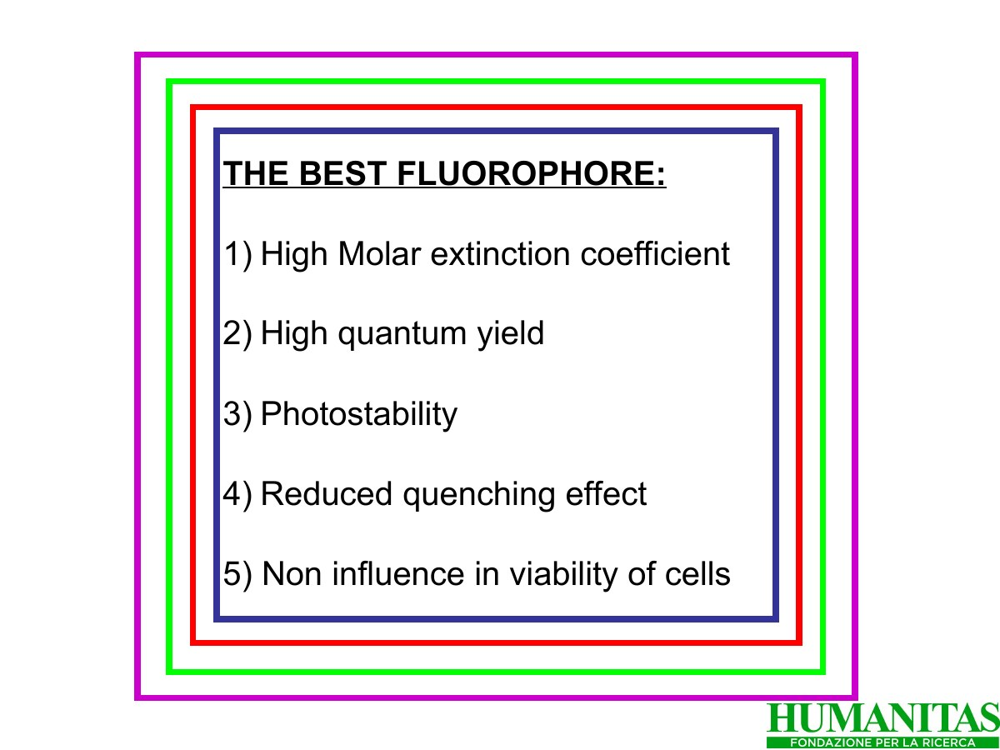

Extracted slide text

<pre>THE BEST FLUOROPHORE:

1) High Molar extinction coefficient

2) High quantum yield

3) Photostability

4) Reduced quenching effect

5) Non influence in viability of cells</pre>

## Slide 54 — BIBLIOGRAPHY

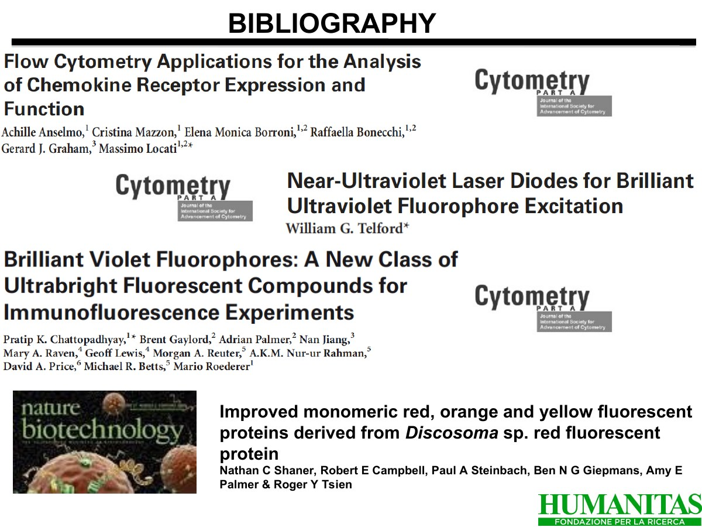

Extracted slide text

<pre>BIBLIOGRAPHY

Improved monomeric red, orange and yellow fluorescent
proteins derived from Discosoma sp. red fluorescent
protein
Nathan C Shaner, Robert E Campbell, Paul A Steinbach, Ben N G Giepmans, Amy E
Palmer &amp; Roger Y Tsien</pre>

## Slide 55 — USEFUL LINKS

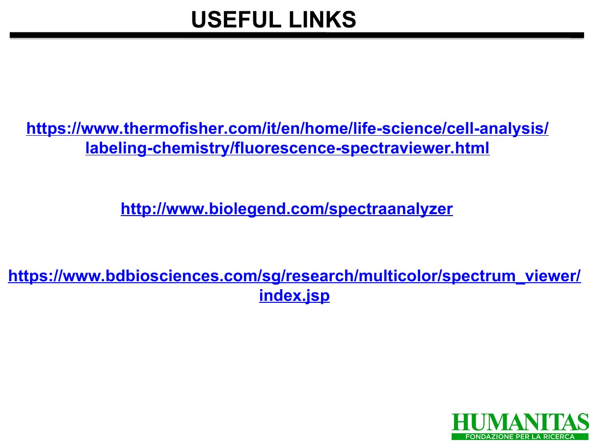

Extracted slide text

<pre>USEFUL LINKS

  https://www.thermofisher.com/it/en/home/life-science/cell-analysis/
          labeling-chemistry/fluorescence-spectraviewer.html

              http://www.biolegend.com/spectraanalyzer

https://www.bdbiosciences.com/sg/research/multicolor/spectrum_viewer/
                             index.jsp</pre>

## Slide 56 — Untitled slide

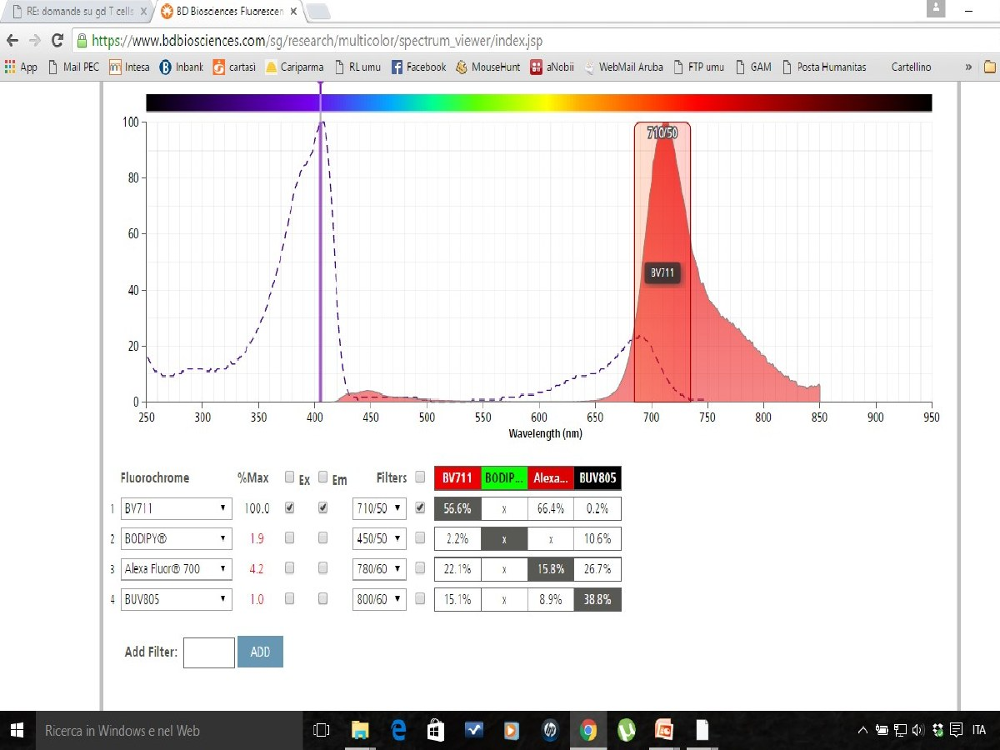

## Slide 57 — Untitled slide

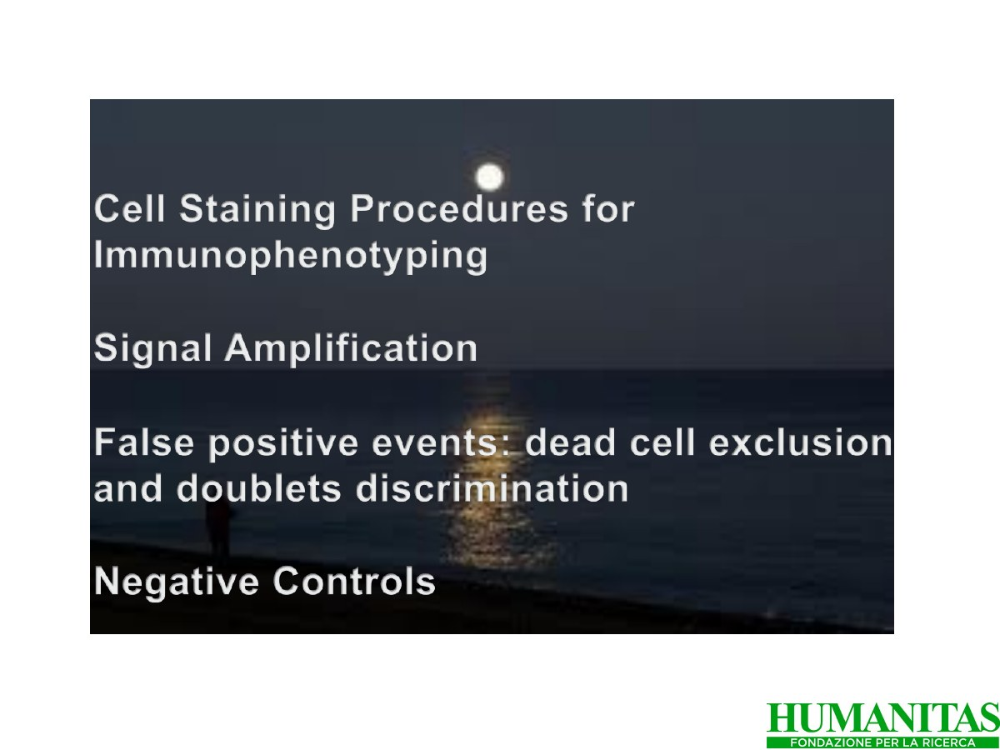

## Slide 58 — CELL STAINING PROCEDURES FOR IMMUNOPHENOTYPING

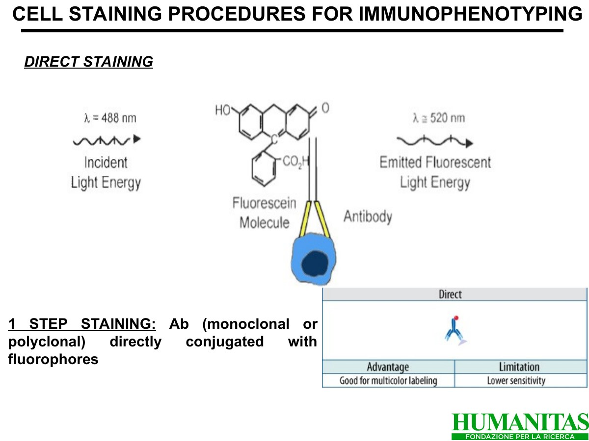

Extracted slide text

<pre>CELL STAINING PROCEDURES FOR IMMUNOPHENOTYPING

 DIRECT STAINING

1 STEP STAINING: Ab (monoclonal or
polyclonal)  directly conjugated with
fluorophores</pre>

## Slide 59 — CELL STAINING PROCEDURES FOR IMMUNOPHENOTYPING

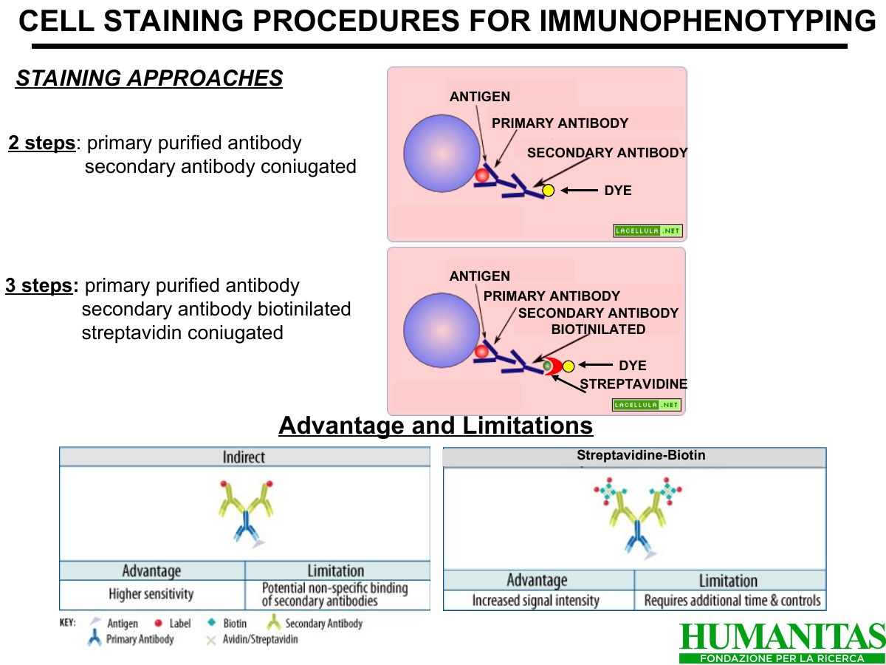

Extracted slide text

<pre>CELL STAINING PROCEDURES FOR IMMUNOPHENOTYPING
 STAINING APPROACHES
                                           ANTIGEN
                                               PRIMARY ANTIBODY
2 steps: primary purified antibody                   SECONDARY ANTIBODY
         secondary antibody coniugated
                                                              DYE

                                           ANTIGEN
3 steps: primary purified antibody             PRIMARY ANTIBODY
        secondary antibody biotinilated            SECONDARY ANTIBODY
        streptavidin coniugated                        BIOTINILATED

                                                              DYE
                                                          STREPTAVIDINE

                              Advantage and Limitations
                                                          Streptavidine-Biotin</pre>

## Slide 60 — SIGNAL AMPLIFICATION

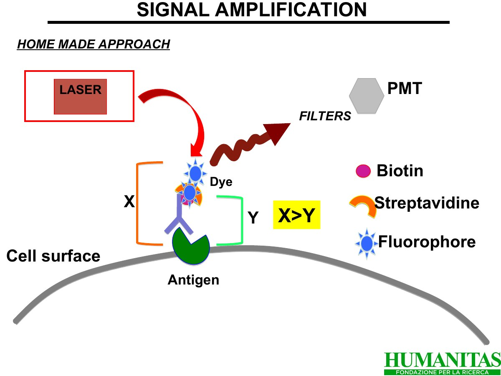

Extracted slide text

<pre>SIGNAL AMPLIFICATION
 HOME MADE APPROACH

      LASER                                     PMT
                                     FILTERS

                                               Biotin
                          Dye
               X                               Streptavidine
                                Y   X&gt;Y
                                               Fluorophore
Cell surface
                     Antigen</pre>

## Slide 61 — SIGNAL AMPLIFICATION

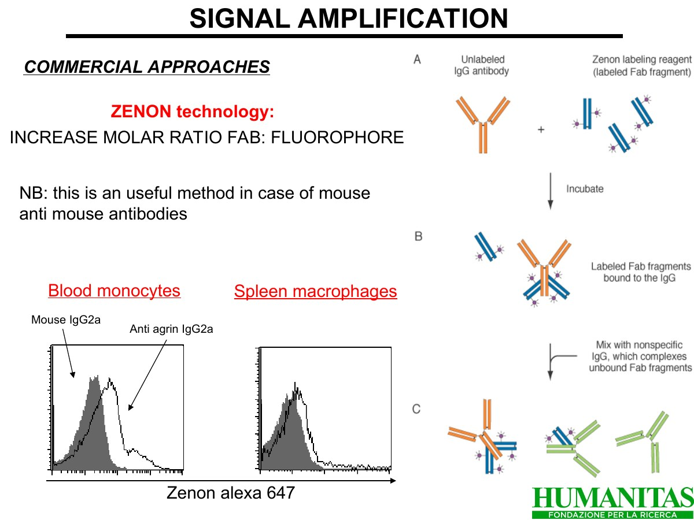

Extracted slide text

<pre>SIGNAL AMPLIFICATION
 COMMERCIAL APPROACHES

          ZENON technology:
INCREASE MOLAR RATIO FAB: FLUOROPHORE

NB: this is an useful method in case of mouse
anti mouse antibodies

    Blood monocytes                Spleen macrophages
  Mouse IgG2a
                Anti agrin IgG2a

                       Zenon alexa 647</pre>

## Slide 62 — SIGNAL AMPLIFICATION

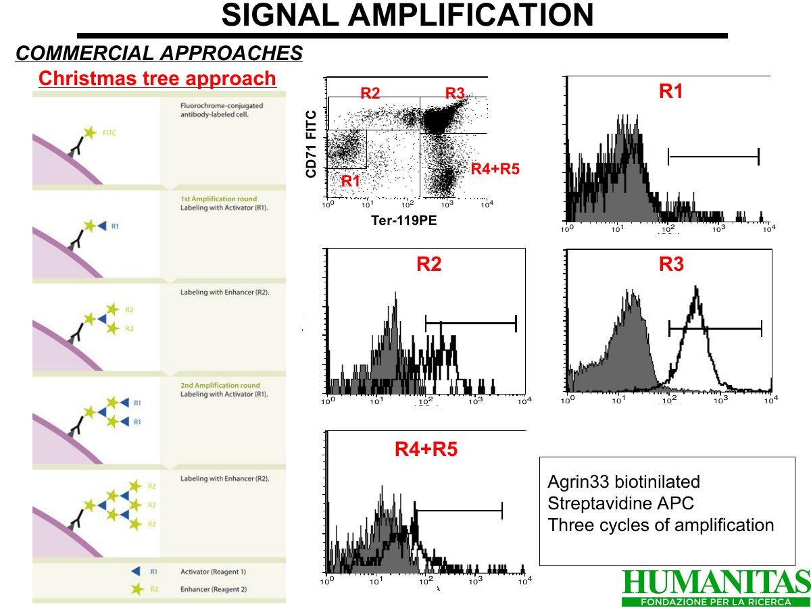

Extracted slide text

<pre>SIGNAL AMPLIFICATION
COMMERCIAL APPROACHES
  Christmas tree approach
                                              spleen post mix agr33bio#A8.fcs

                                                  R2                       R3                                R1

                            CD71 FITC
                                                                     R7
                                                                     R8
                                                                      R9
                                                                     R10

                                                                                 R4+R5
                                              R1
                                        100        101       102          10 3     104
                                                         TER-119 PE-A
                                                     Ter-119PE
                                                                                                100    101    102    103   104
                                                                                                             APC-A

                                                                  R2                                         R3

                                        100          101          102            103     104    100    101    102    103   104
                                                                 APC -A                                      APC-A

                                                            R4+R5
                                                                                               Agrin33 biotinilated
                                                                                               Streptavidine APC
                                                                                               Three cycles of amplification

                                    100              101          102            103     104
                                                                 APC-A</pre>

## Slide 63 — FALSE POSITIVE EVENTS

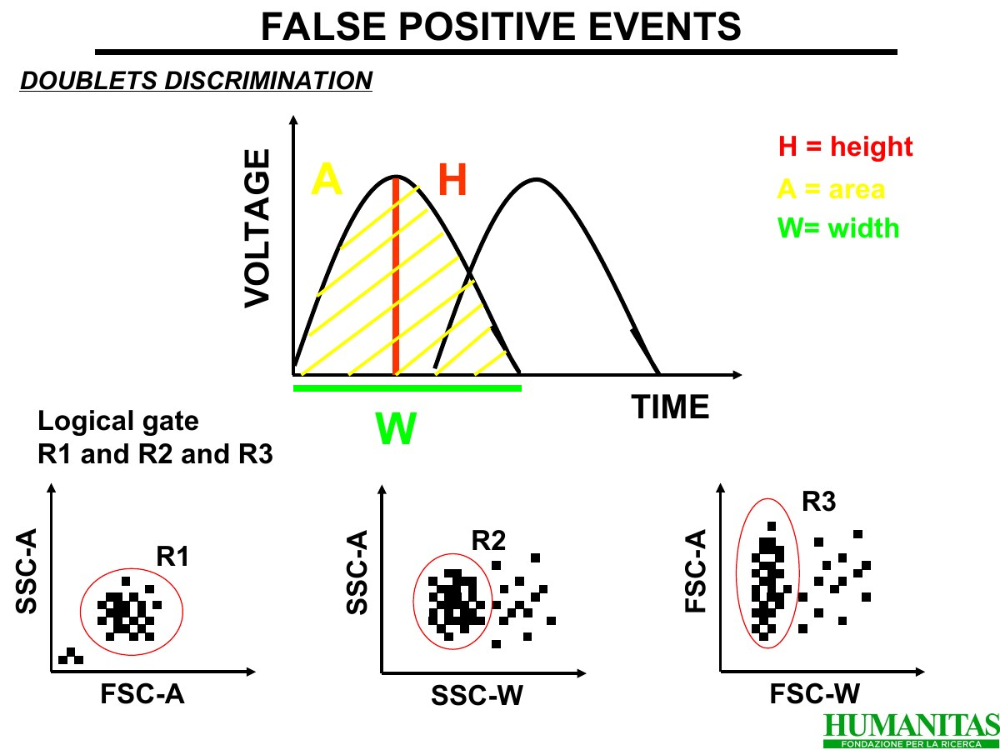

Extracted slide text

<pre>FALSE POSITIVE EVENTS
 DOUBLETS DISCRIMINATION

                                                     H = height

                VOLTAGE
                          A       H                  A = area
                                                     W= width

                                           TIME
   Logical gate
   R1 and R2 and R3
                              W
                                                      R3
                                      R2
SSC-A

                                             FSC-A
                          SSC-A

           R1

        FSC-A                     SSC-W              FSC-W</pre>

## Slide 64 — FALSE POSITIVE EVENTS

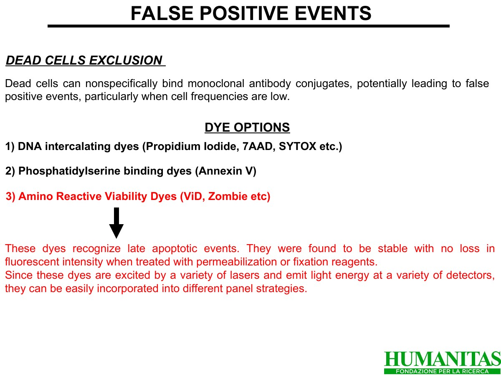

Extracted slide text

<pre>FALSE POSITIVE EVENTS

DEAD CELLS EXCLUSION
Dead cells can nonspecifically bind monoclonal antibody conjugates, potentially leading to false
positive events, particularly when cell frequencies are low.

                                        DYE OPTIONS
1) DNA intercalating dyes (Propidium Iodide, 7AAD, SYTOX etc.)

2) Phosphatidylserine binding dyes (Annexin V)

3) Amino Reactive Viability Dyes (ViD, Zombie etc)

These dyes recognize late apoptotic events. They were found to be stable with no loss in
fluorescent intensity when treated with permeabilization or fixation reagents.
Since these dyes are excited by a variety of lasers and emit light energy at a variety of detectors,
they can be easily incorporated into different panel strategies.</pre>

## Slide 65 — FALSE POSITIVE EVENTS

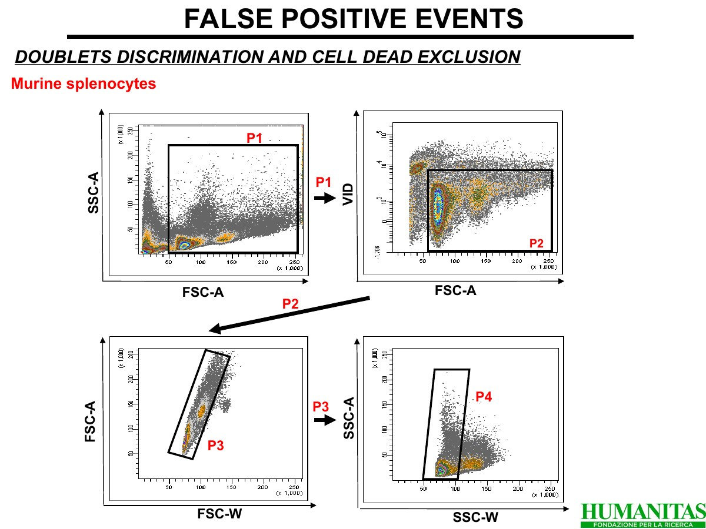

Extracted slide text

<pre>FALSE POSITIVE EVENTS
DOUBLETS DISCRIMINATION AND CELL DEAD EXCLUSION
Murine splenocytes

                              P1
         SSC-A

                                        P1

                                             VID
                                                               P2

                     FSC-A                           FSC-A
                                   P2

                                                         P4
                                             SSC-A

                                        P3
        FSC-A

                        P3

                      FSC-W                            SSC-W</pre>

## Slide 66 — NEGATIVE CONTROLS

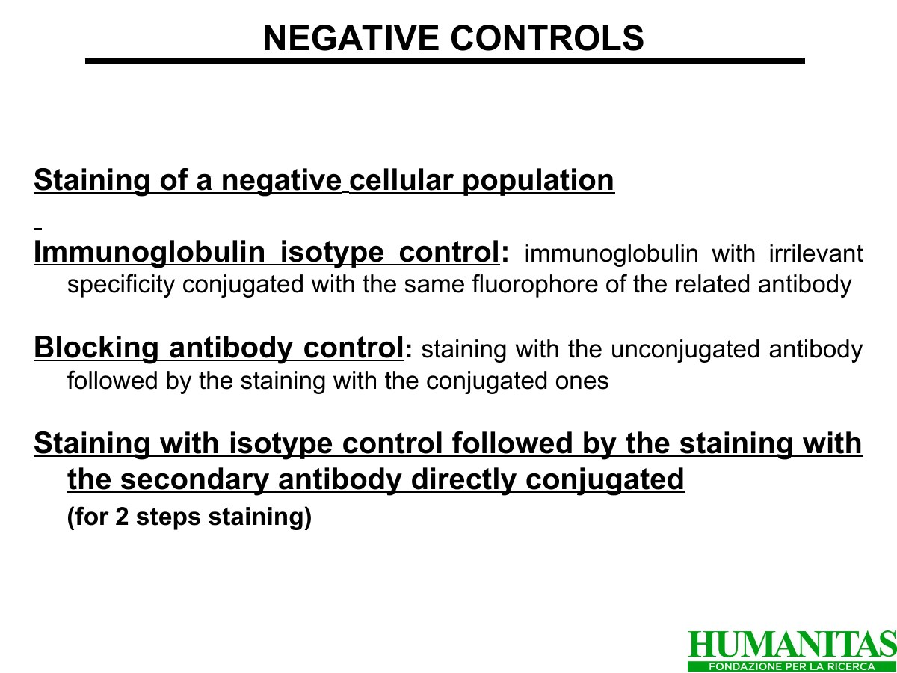

Extracted slide text

<pre>NEGATIVE CONTROLS

Staining of a negative cellular population

Immunoglobulin isotype control: immunoglobulin with irrilevant
  specificity conjugated with the same fluorophore of the related antibody

Blocking antibody control: staining with the unconjugated antibody
  followed by the staining with the conjugated ones

Staining with isotype control followed by the staining with
  the secondary antibody directly conjugated
  (for 2 steps staining)</pre>

## Slide 67 — NEGATIVE CONTROLS

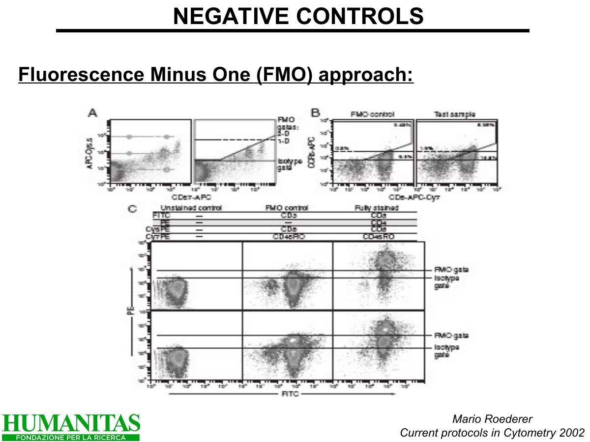

Extracted slide text

<pre>NEGATIVE CONTROLS

Fluorescence Minus One (FMO) approach:

                                              Mario Roederer
                                    Current protocols in Cytometry 2002</pre>

## Slide 68 — NEGATIVE CONTROLS

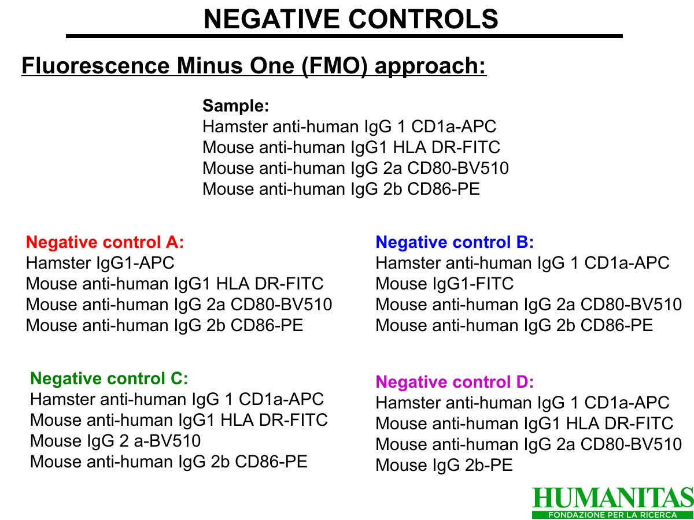

Extracted slide text

<pre>NEGATIVE CONTROLS
Fluorescence Minus One (FMO) approach:
                   Sample:
                   Hamster anti-human IgG 1 CD1a-APC
                   Mouse anti-human IgG1 HLA DR-FITC
                   Mouse anti-human IgG 2a CD80-BV510
                   Mouse anti-human IgG 2b CD86-PE

Negative control A:                   Negative control B:
Hamster IgG1-APC                      Hamster anti-human IgG 1 CD1a-APC
Mouse anti-human IgG1 HLA DR-FITC     Mouse IgG1-FITC
Mouse anti-human IgG 2a CD80-BV510    Mouse anti-human IgG 2a CD80-BV510
Mouse anti-human IgG 2b CD86-PE       Mouse anti-human IgG 2b CD86-PE

Negative control C:                   Negative control D:
Hamster anti-human IgG 1 CD1a-APC     Hamster anti-human IgG 1 CD1a-APC
Mouse anti-human IgG1 HLA DR-FITC     Mouse anti-human IgG1 HLA DR-FITC
Mouse IgG 2 a-BV510                   Mouse anti-human IgG 2a CD80-BV510
Mouse anti-human IgG 2b CD86-PE       Mouse IgG 2b-PE</pre>

## Slide 69 — BIBLIOGRAPHY

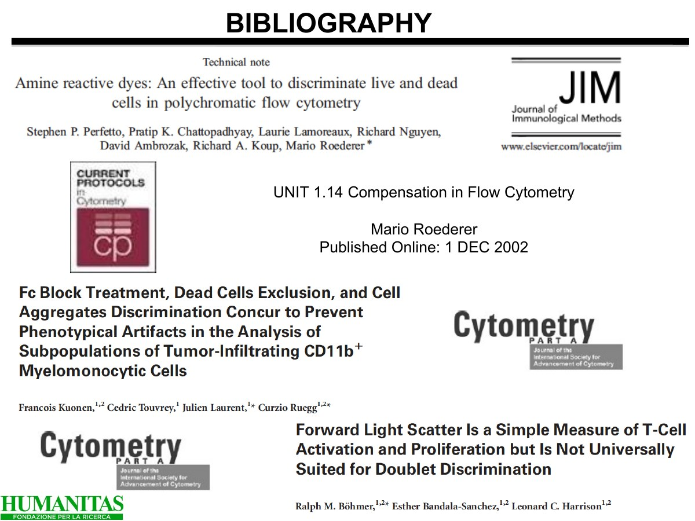

Extracted slide text

<pre>BIBLIOGRAPHY

  UNIT 1.14 Compensation in Flow Cytometry

               Mario Roederer
        Published Online: 1 DEC 2002</pre>

## Slide 70 — BEFORE STARTING…….

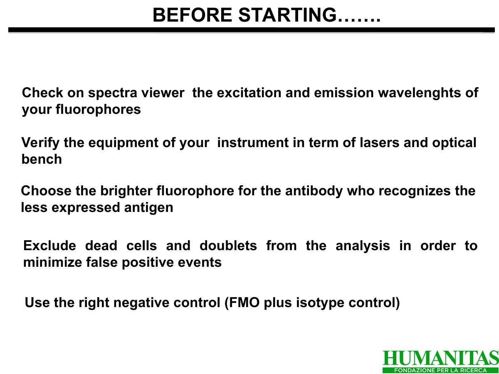

Extracted slide text

<pre>BEFORE STARTING…….

Check on spectra viewer the excitation and emission wavelenghts of
your fluorophores

Verify the equipment of your instrument in term of lasers and optical
bench

Choose the brighter fluorophore for the antibody who recognizes the
less expressed antigen

Exclude dead cells and doublets from the analysis in order to
minimize false positive events

Use the right negative control (FMO plus isotype control)</pre>

