# Flow Cytometry part II

Source: `Flow_Cytometry_part_II.pptx`

This document contains 71 slides. Each slide is preserved as an image, followed by searchable text extracted from the presentation.

## Slide 1 — Practical

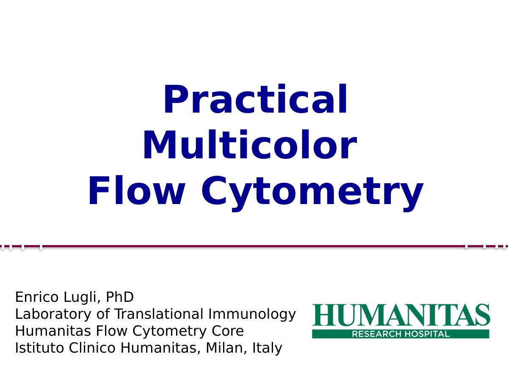

Extracted slide text

<pre>Practical
             Multicolor
          Flow Cytometry

Enrico Lugli, PhD
Laboratory of Translational Immunology
Humanitas Flow Cytometry Core
Istituto Clinico Humanitas, Milan, Italy</pre>

## Slide 2 — The Humanitas Flow Cytometry

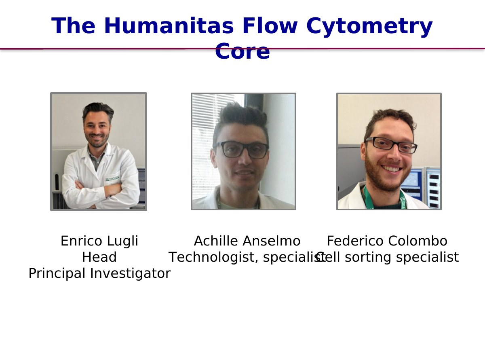

Extracted slide text

<pre>The Humanitas Flow Cytometry
               Core

     Enrico Lugli        Achille Anselmo       Federico Colombo
        Head          Technologist, specialist
                                            Cell sorting specialist
Principal Investigator</pre>

## Slide 3 — How to avoid artifacts in flow

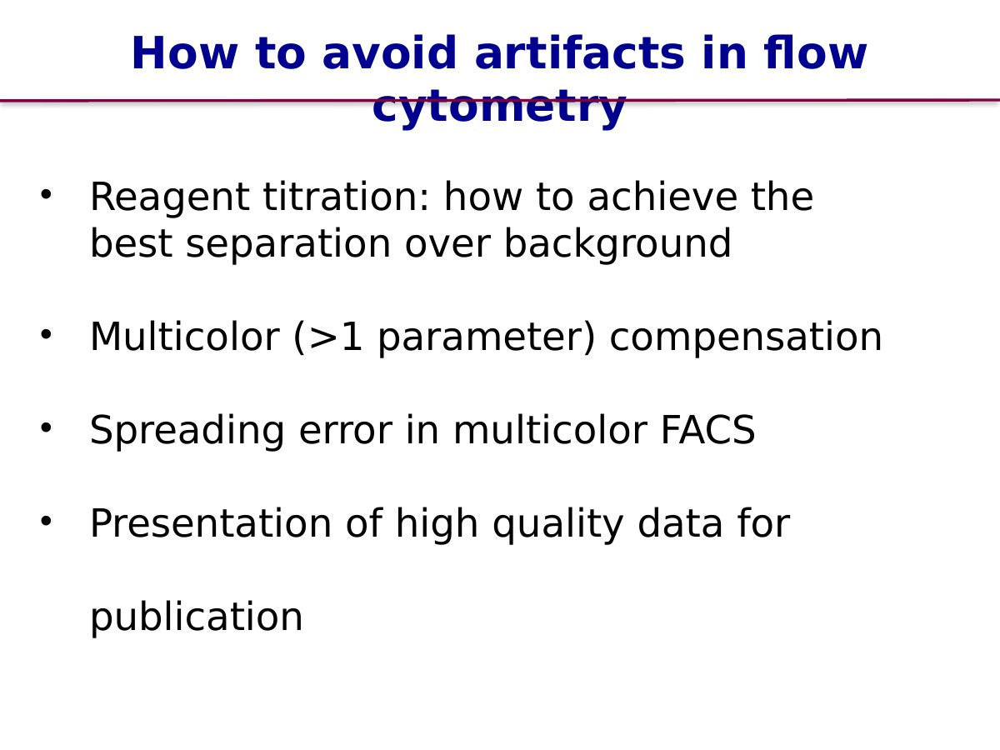

Extracted slide text

<pre>How to avoid artifacts in flow
             cytometry
• Reagent titration: how to achieve the
  best separation over background

• Multicolor (&gt;1 parameter) compensation

• Spreading error in multicolor FACS

• Presentation of high quality data for

  publication</pre>

## Slide 4 — Abs: not just the manufacturer’s

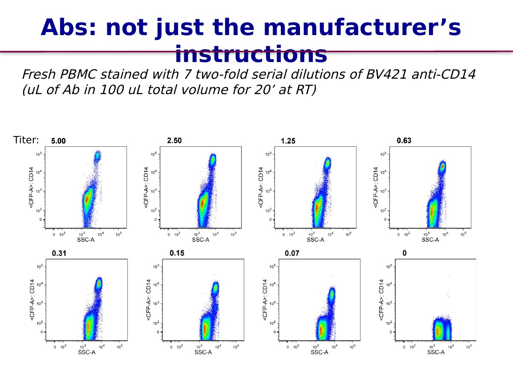

Extracted slide text

<pre>Abs: not just the manufacturer’s
                    instructions
 Fresh PBMC stained with 7 two-fold serial dilutions of BV421 anti-CD14
 (uL of Ab in 100 uL total volume for 20’ at RT)

Titer:</pre>

## Slide 5 — Abs: not just the manufacturer’s

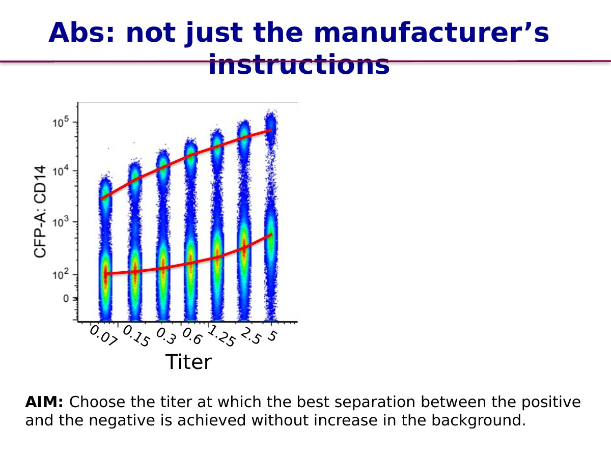

Extracted slide text

<pre>Abs: not just the manufacturer’s
             instructions

        0.    0           1
           07 .15 0.3 0.6 .25 2.5 5

                   Titer
AIM: Choose the titer at which the best separation between the positive
and the negative is achieved without increase in the background.</pre>

## Slide 6 — Abs: not just the manufacturer’s

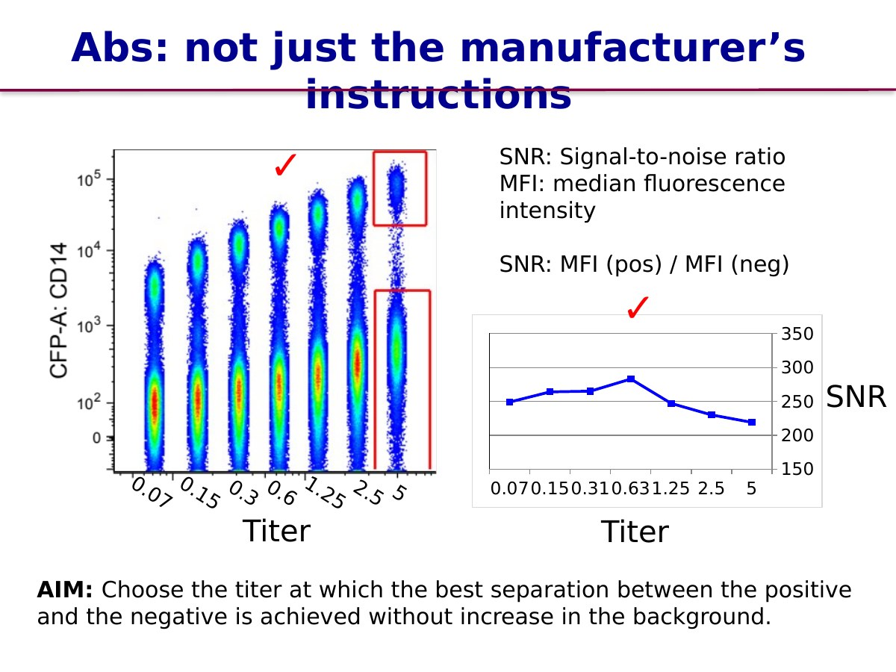

Extracted slide text

<pre>Abs: not just the manufacturer’s
             instructions
                     ✓                  SNR: Signal-to-noise ratio
                                        MFI: median fluorescence
                                        intensity

                                        SNR: MFI (pos) / MFI (neg)

                                                      ✓                   350
                                                                          300
                                                                          250   SNR
                                                                          200
                                                                          150
        0.    0           1
           07 .15 0.3 0.6 .25 2.5 5    0.07 0.15 0.31 0.63 1.25 2.5   5

                   Titer                            Titer
AIM: Choose the titer at which the best separation between the positive
and the negative is achieved without increase in the background.</pre>

## Slide 7 — Abs: not just the manufacturer’s

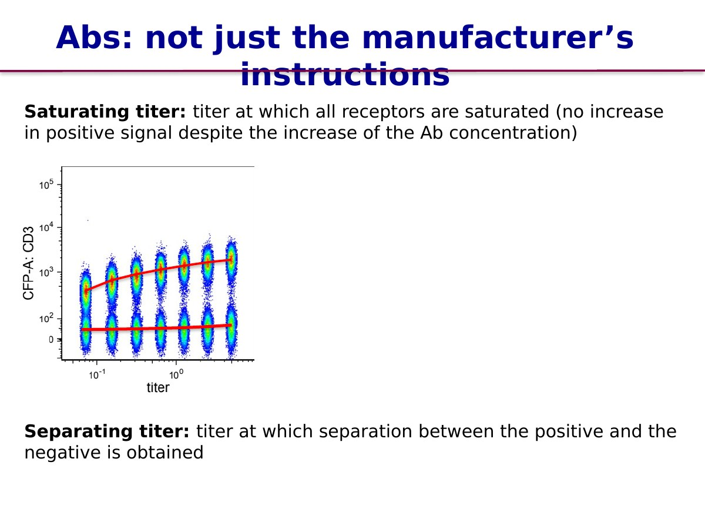

Extracted slide text

<pre>Abs: not just the manufacturer’s
              instructions
Saturating titer: titer at which all receptors are saturated (no increase
in positive signal despite the increase of the Ab concentration)

Separating titer: titer at which separation between the positive and the
negative is obtained</pre>

## Slide 8 — Titering antibodies: procedure

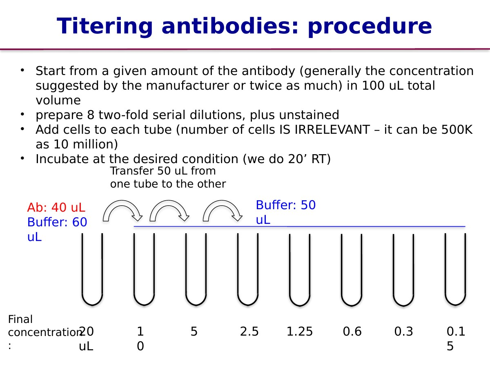

Extracted slide text

<pre>Titering antibodies: procedure
  • Start from a given amount of the antibody (generally the concentration
    suggested by the manufacturer or twice as much) in 100 uL total
    volume
  • prepare 8 two-fold serial dilutions, plus unstained
  • Add cells to each tube (number of cells IS IRRELEVANT – it can be 500K
    as 10 million)
  • Incubate at the desired condition (we do 20’ RT)
                  Transfer 50 uL from
                  one tube to the other

   Ab: 40 uL                                Buffer: 50
   Buffer: 60                               uL
   uL

Final
concentration20       1         5         2.5    1.25    0.6   0.3   0.1
:            uL       0                                              5</pre>

## Slide 9 — Careful with BV dyes

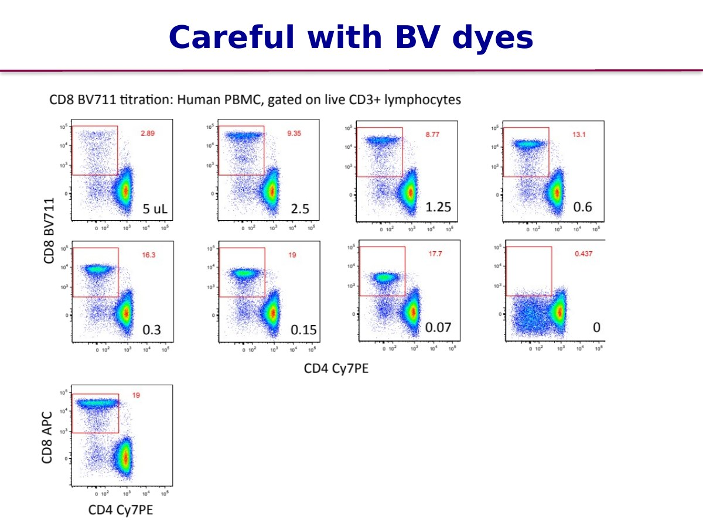

Extracted slide text

<pre>Careful with BV dyes</pre>

## Slide 10 — Critical parameters affecting

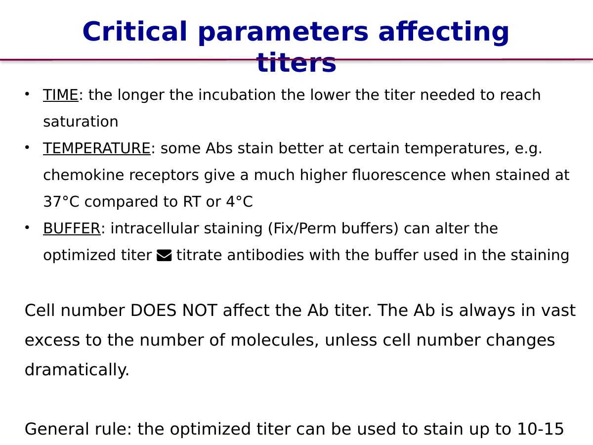

Extracted slide text

<pre>Critical parameters affecting
                    titers
• TIME: the longer the incubation the lower the titer needed to reach
  saturation
• TEMPERATURE: some Abs stain better at certain temperatures, e.g.
  chemokine receptors give a much higher fluorescence when stained at
  37°C compared to RT or 4°C
• BUFFER: intracellular staining (Fix/Perm buffers) can alter the
  optimized titer  titrate antibodies with the buffer used in the staining

Cell number DOES NOT affect the Ab titer. The Ab is always in vast
excess to the number of molecules, unless cell number changes
dramatically.

General rule: the optimized titer can be used to stain up to 10-15</pre>

## Slide 11 — Pro and cons of antibody

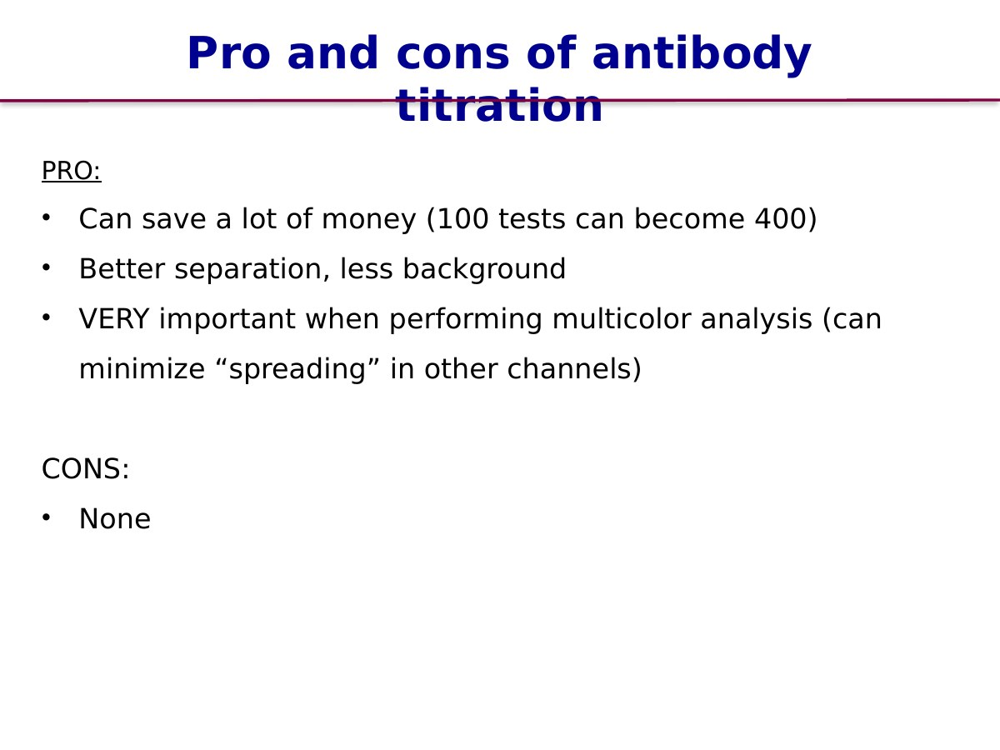

Extracted slide text

<pre>Pro and cons of antibody
                 titration
PRO:
• Can save a lot of money (100 tests can become 400)
• Better separation, less background
• VERY important when performing multicolor analysis (can
  minimize “spreading” in other channels)

CONS:
• None</pre>

## Slide 12 — Optimized voltage

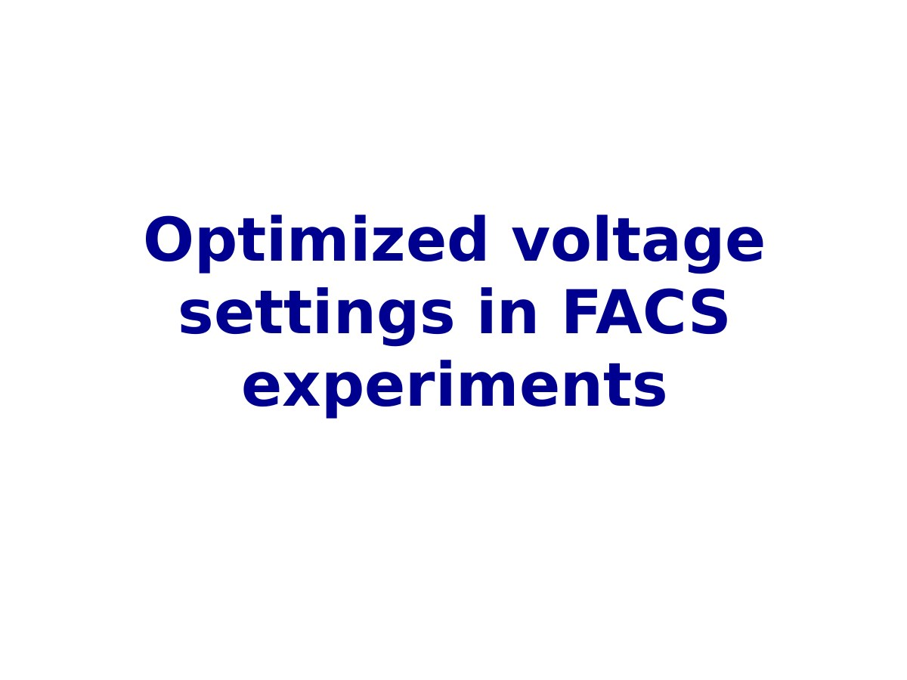

Extracted slide text

<pre>Optimized voltage
 settings in FACS
   experiments</pre>

## Slide 13 — Voltage calibration

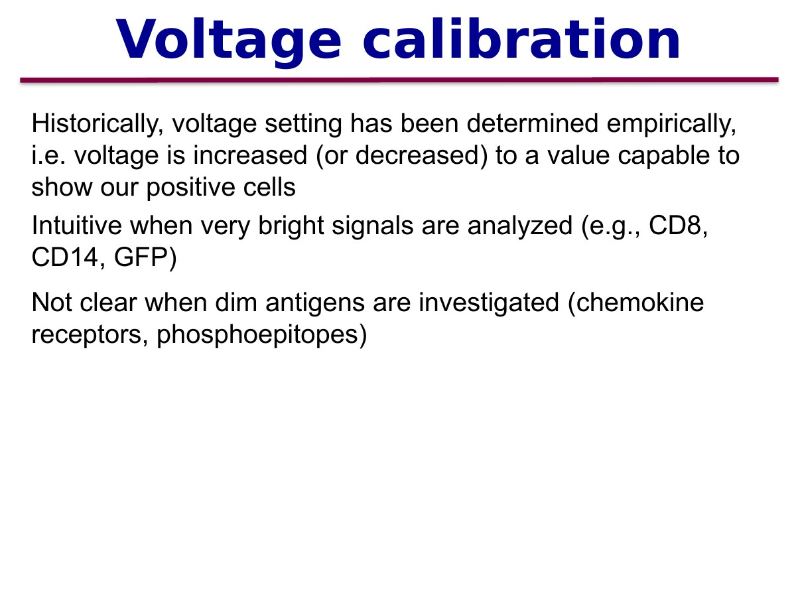

Extracted slide text

<pre>Voltage calibration
Historically, voltage setting has been determined empirically,
i.e. voltage is increased (or decreased) to a value capable to
show our positive cells
Intuitive when very bright signals are analyzed (e.g., CD8,
CD14, GFP)
Not clear when dim antigens are investigated (chemokine
receptors, phosphoepitopes)</pre>

## Slide 14 — Voltage calibration

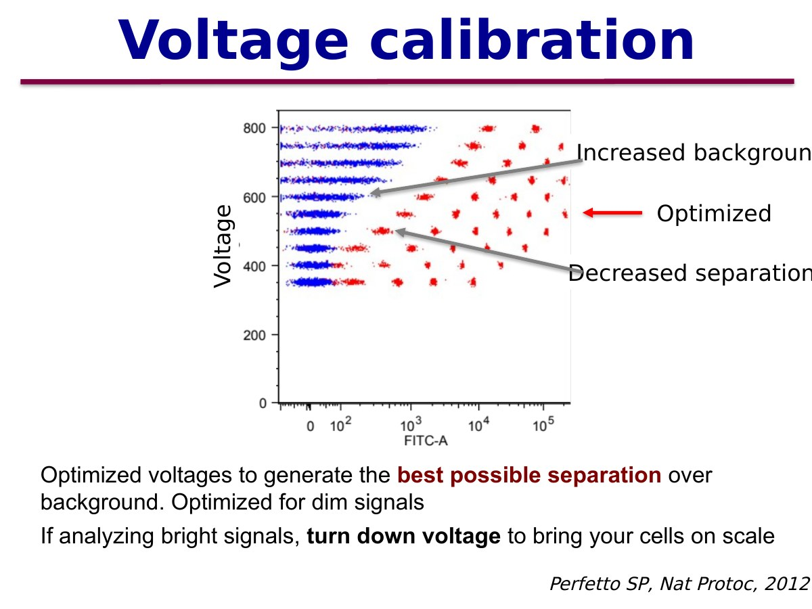

Extracted slide text

<pre>Voltage calibration
                                                      Increased backgroun

                 Voltage                                       Optimized

                                                     Decreased separation

Optimized voltages to generate the best possible separation over
background. Optimized for dim signals
If analyzing bright signals, turn down voltage to bring your cells on scale

                                                   Perfetto SP, Nat Protoc, 2012</pre>

## Slide 15 — Fluorescence

Extracted slide text

<pre>Fluorescence
Compensation</pre>

## Slide 16 — Compensation

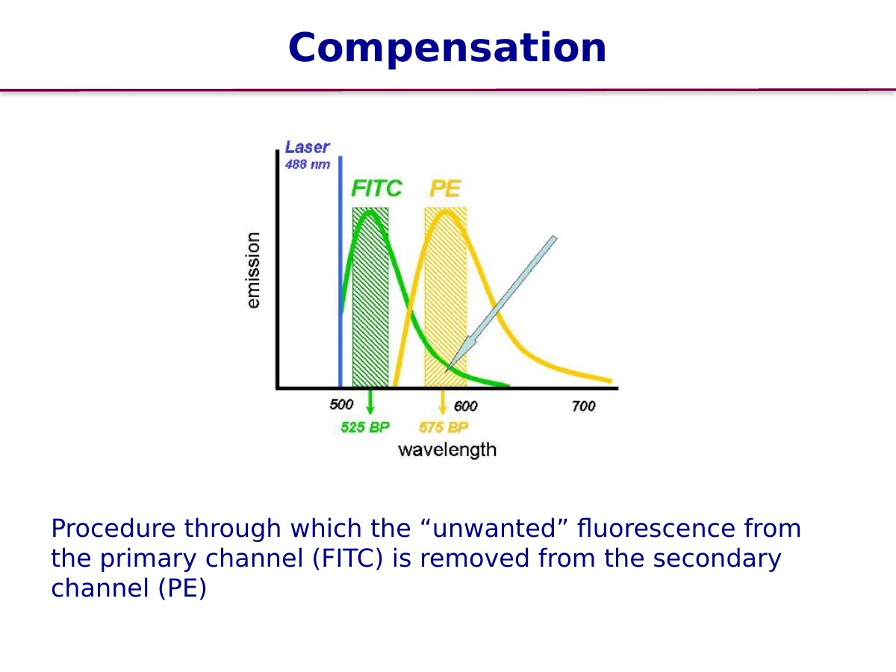

Extracted slide text

<pre>Compensation

Procedure through which the “unwanted” fluorescence from
the primary channel (FITC) is removed from the secondary
channel (PE)</pre>

## Slide 17 — Compensation: just linear

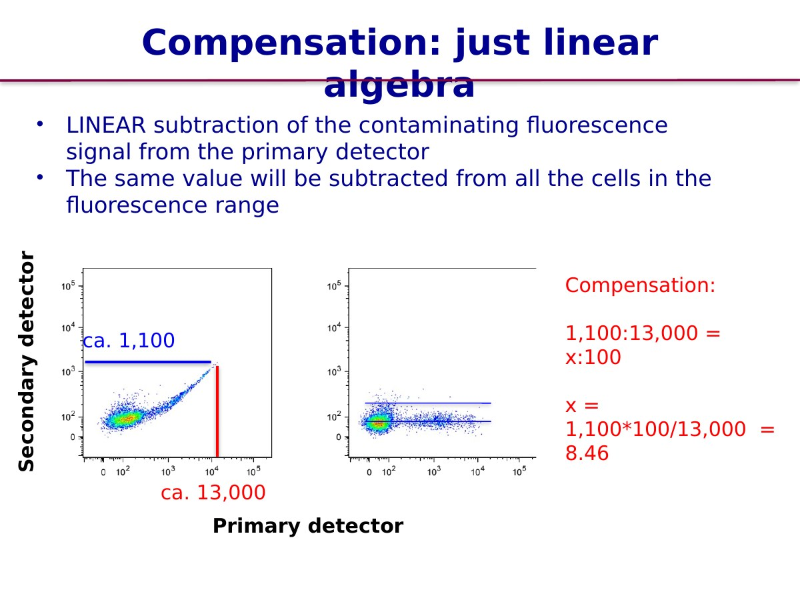

Extracted slide text

<pre>Compensation: just linear
                                 algebra
               • LINEAR subtraction of the contaminating fluorescence
                 signal from the primary detector
               • The same value will be subtracted from all the cells in the
                 fluorescence range
Secondary detector

                                                              Compensation:

                     ca. 1,100                                1,100:13,000 =
                                                              x:100

                                                              x=
                                                              1,100*100/13,000 =
                                                              8.46
                            ca. 13,000
                                 Primary detector</pre>

## Slide 18 — Is this correctly compensated?

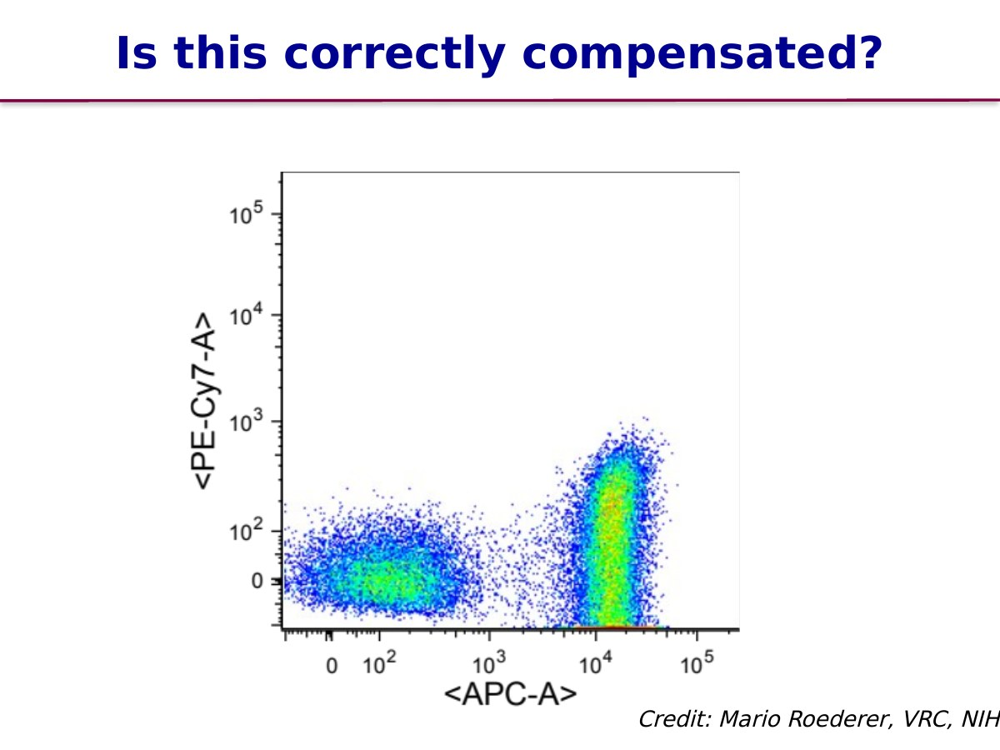

Extracted slide text

<pre>Is this correctly compensated?

                    Credit: Mario Roederer, VRC, NIH</pre>

## Slide 19 — Aspects to consider

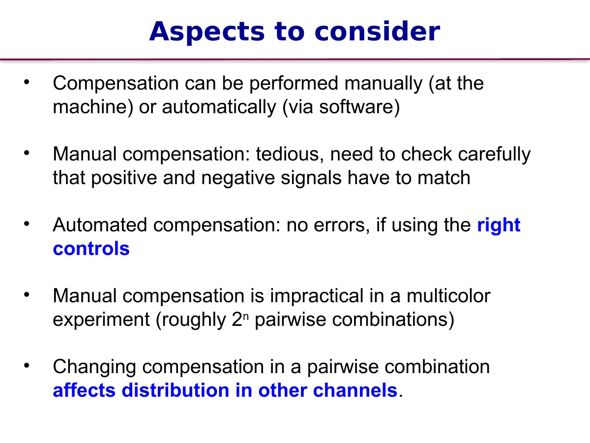

Extracted slide text

<pre>Aspects to consider
•   Compensation can be performed manually (at the
    machine) or automatically (via software)

•   Manual compensation: tedious, need to check carefully
    that positive and negative signals have to match

•   Automated compensation: no errors, if using the right
    controls

•   Manual compensation is impractical in a multicolor
    experiment (roughly 2n pairwise combinations)

•   Changing compensation in a pairwise combination
    affects distribution in other channels.</pre>

## Slide 20 — Practical compensation

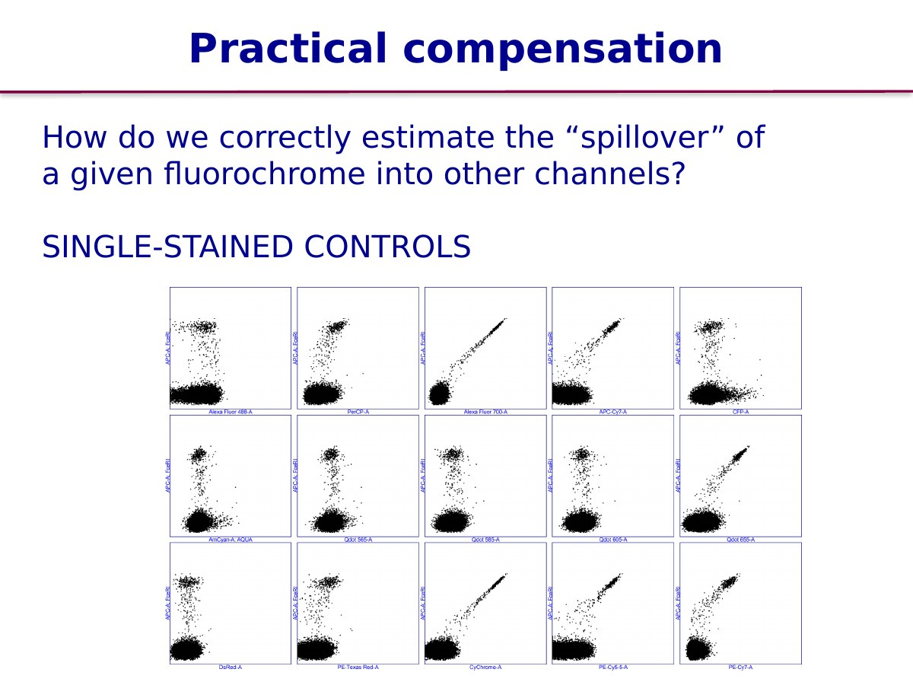

Extracted slide text

<pre>Practical compensation

How do we correctly estimate the “spillover” of
a given fluorochrome into other channels?

SINGLE-STAINED CONTROLS</pre>

## Slide 21 — Compbeads for single stained

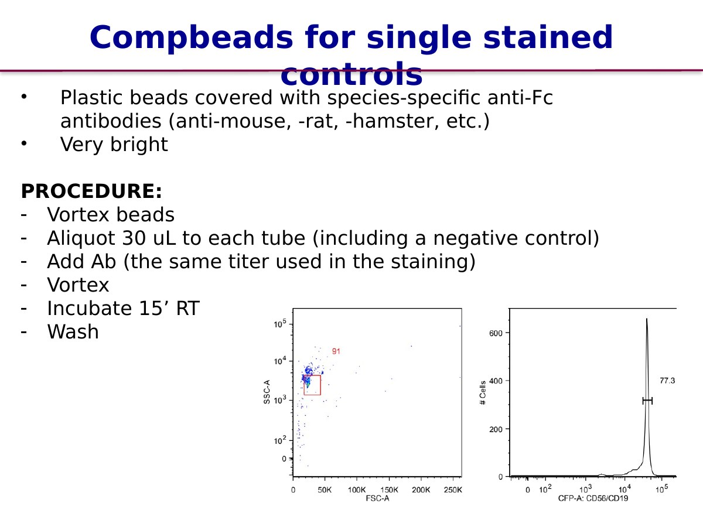

Extracted slide text

<pre>Compbeads for single stained
               controls
•   Plastic beads covered with species-specific anti-Fc
    antibodies (anti-mouse, -rat, -hamster, etc.)
•   Very bright

PROCEDURE:
- Vortex beads
- Aliquot 30 uL to each tube (including a negative control)
- Add Ab (the same titer used in the staining)
- Vortex
- Incubate 15’ RT
- Wash</pre>

## Slide 22 — Minimizing compensation

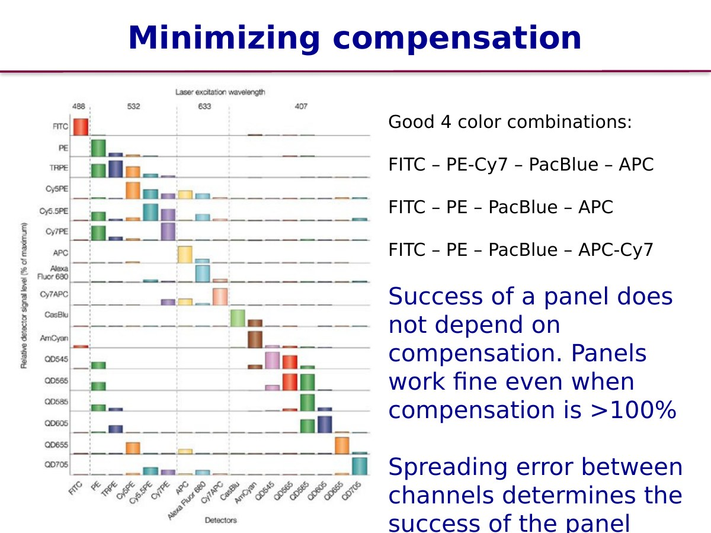

Extracted slide text

<pre>Minimizing compensation

             Good 4 color combinations:

             FITC – PE-Cy7 – PacBlue – APC

             FITC – PE – PacBlue – APC

             FITC – PE – PacBlue – APC-Cy7

             Success of a panel does
             not depend on
             compensation. Panels
             work fine even when
             compensation is &gt;100%

             Spreading error between
             channels determines the
             success of the panel</pre>

## Slide 23 — The 3 golden rules of

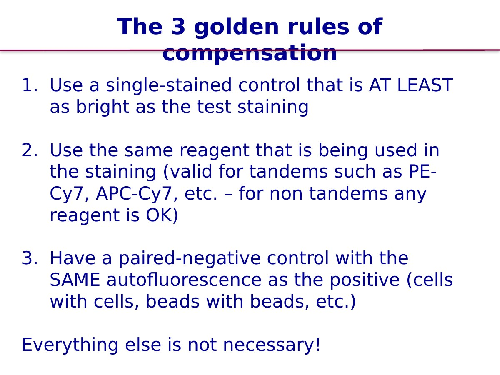

Extracted slide text

<pre>The 3 golden rules of
             compensation
1. Use a single-stained control that is AT LEAST
   as bright as the test staining

2. Use the same reagent that is being used in
   the staining (valid for tandems such as PE-
   Cy7, APC-Cy7, etc. – for non tandems any
   reagent is OK)

3. Have a paired-negative control with the
   SAME autofluorescence as the positive (cells
   with cells, beads with beads, etc.)

Everything else is not necessary!</pre>

## Slide 24 — Experiment plan

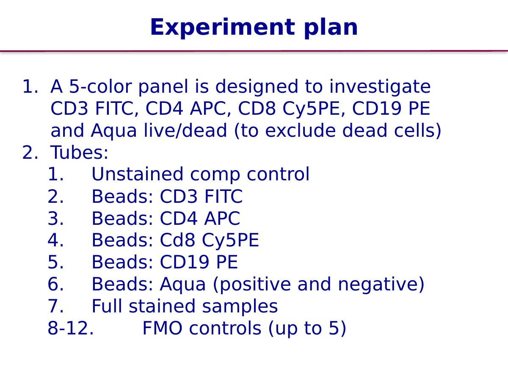

Extracted slide text

<pre>Experiment plan

1. A 5-color panel is designed to investigate
   CD3 FITC, CD4 APC, CD8 Cy5PE, CD19 PE
   and Aqua live/dead (to exclude dead cells)
2. Tubes:
   1. Unstained comp control
   2. Beads: CD3 FITC
   3. Beads: CD4 APC
   4. Beads: Cd8 Cy5PE
   5. Beads: CD19 PE
   6. Beads: Aqua (positive and negative)
   7. Full stained samples
   8-12.     FMO controls (up to 5)</pre>

## Slide 25 — Rule 1: at least as bright!

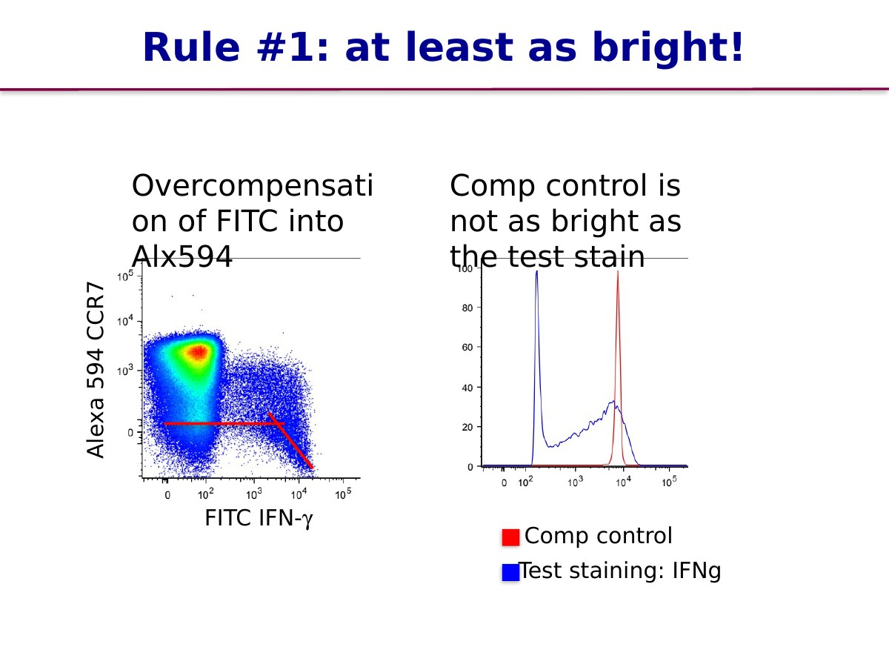

Extracted slide text

<pre>Rule #1: at least as bright!

                 Overcompensati    Comp control is
                 on of FITC into   not as bright as
                 Alx594            the test stain
Alexa 594 CCR7

                     FITC IFN-g
                                        Comp control
                                       Test staining: IFNg</pre>

## Slide 26 — How to accomplish Rule 1?

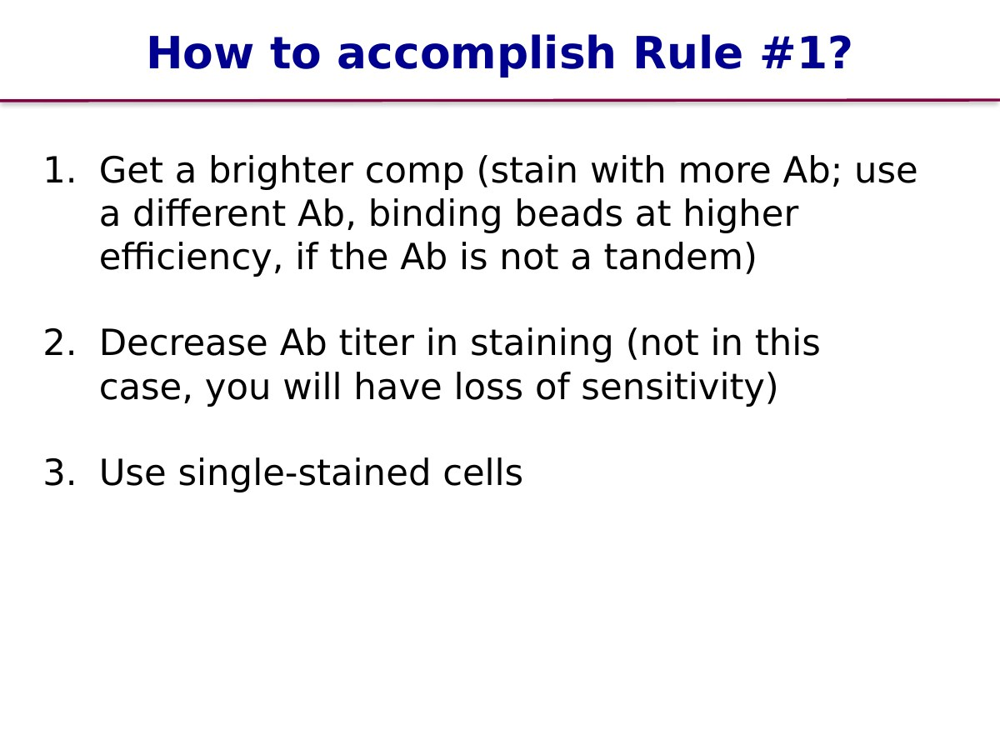

Extracted slide text

<pre>How to accomplish Rule #1?

1. Get a brighter comp (stain with more Ab; use
   a different Ab, binding beads at higher
   efficiency, if the Ab is not a tandem)

2. Decrease Ab titer in staining (not in this
   case, you will have loss of sensitivity)

3. Use single-stained cells</pre>

## Slide 27 — Rule 2: different Abs

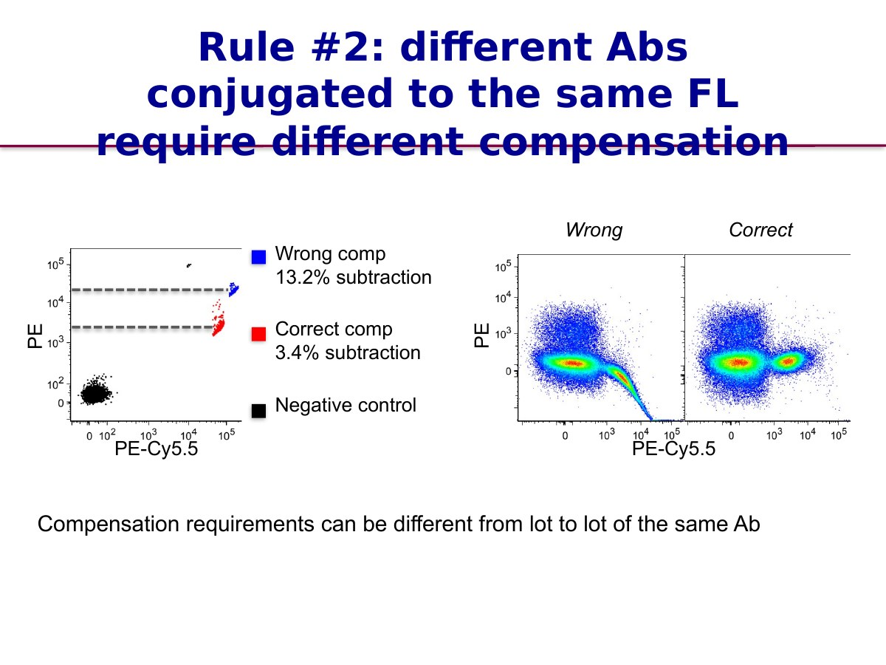

Extracted slide text

<pre>Rule #2: different Abs
        conjugated to the same FL
      require different compensation

                                                      Wrong              Correct
                        Wrong comp
                        13.2% subtraction

                        Correct comp

                                            PE
PE

                        3.4% subtraction

                        Negative control

        PE-Cy5.5                                              PE-Cy5.5

 Compensation requirements can be different from lot to lot of the same Ab</pre>

## Slide 28 — Changing compensation affects

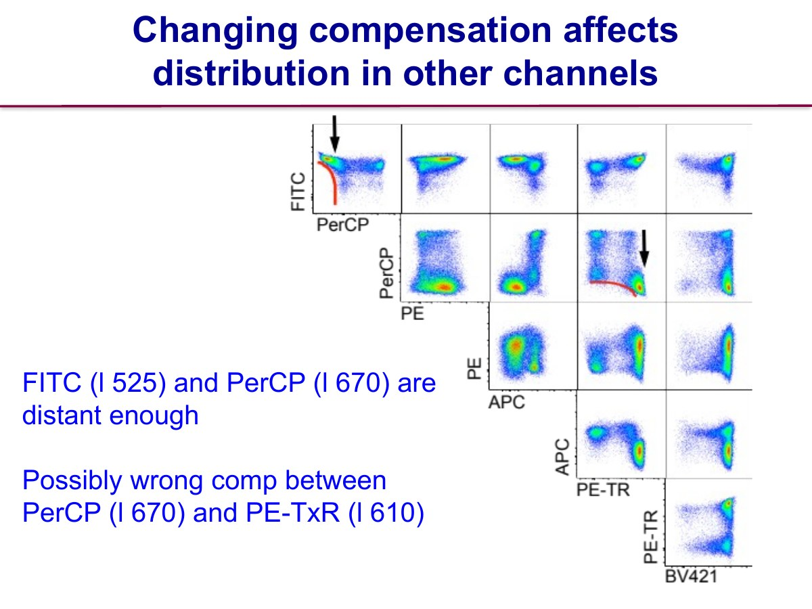

Extracted slide text

<pre>Changing compensation affects
          distribution in other channels

FITC (l 525) and PerCP (l 670) are
distant enough

Possibly wrong comp between
PerCP (l 670) and PE-TxR (l 610)</pre>

## Slide 29 — How to compensate in FACSDiva

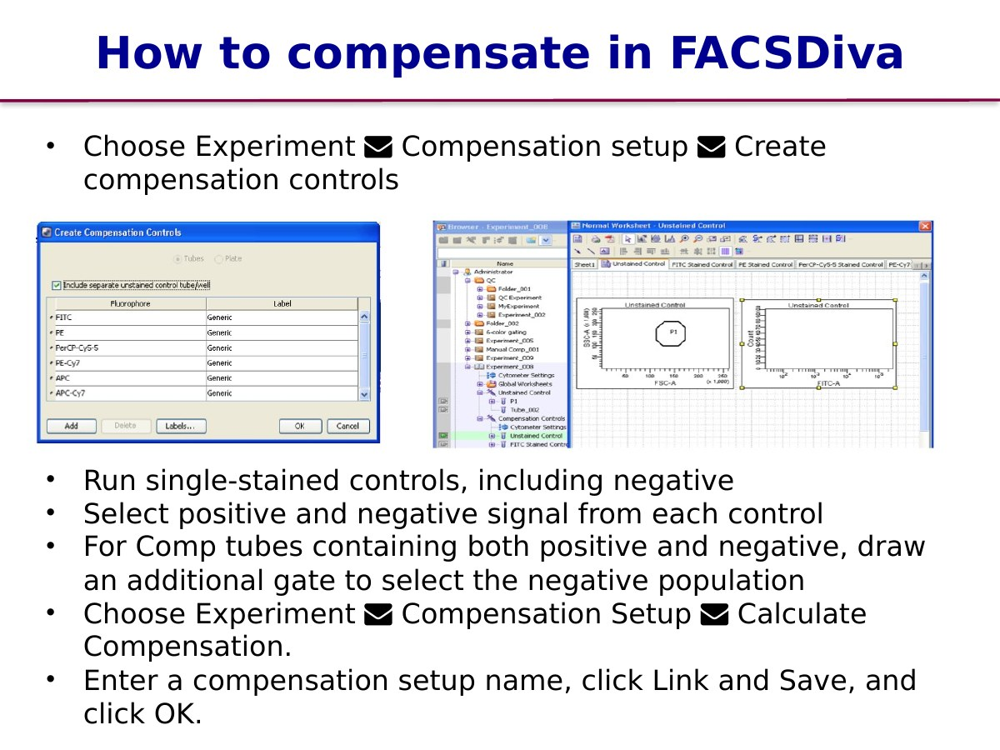

Extracted slide text

<pre>How to compensate in FACSDiva
• Choose Experiment  Compensation setup  Create
  compensation controls

• Run single-stained controls, including negative
• Select positive and negative signal from each control
• For Comp tubes containing both positive and negative, draw
  an additional gate to select the negative population
• Choose Experiment  Compensation Setup  Calculate
  Compensation.
• Enter a compensation setup name, click Link and Save, and
  click OK.</pre>

## Slide 30 — Spreading error in

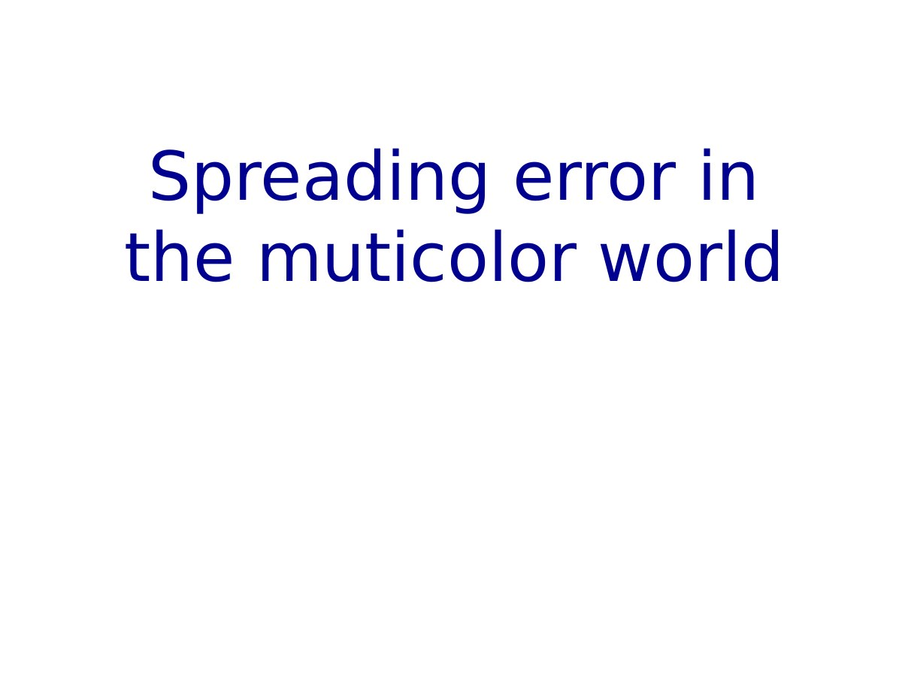

Extracted slide text

<pre>Spreading error in
the muticolor world</pre>

## Slide 31 — Signal spreading

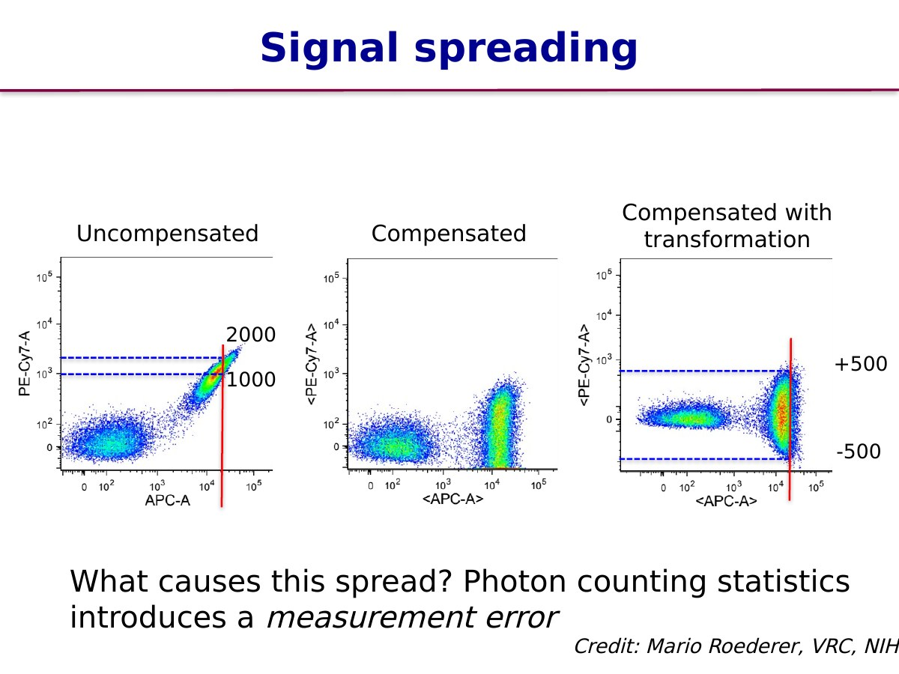

Extracted slide text

<pre>Signal spreading

                                      Compensated with
Uncompensated       Compensated        transformation

          2000
                                                           +500
          1000

                                                           -500

What causes this spread? Photon counting statistics
introduces a measurement error
                                  Credit: Mario Roederer, VRC, NIH</pre>

## Slide 32 — “Errors” in compensation

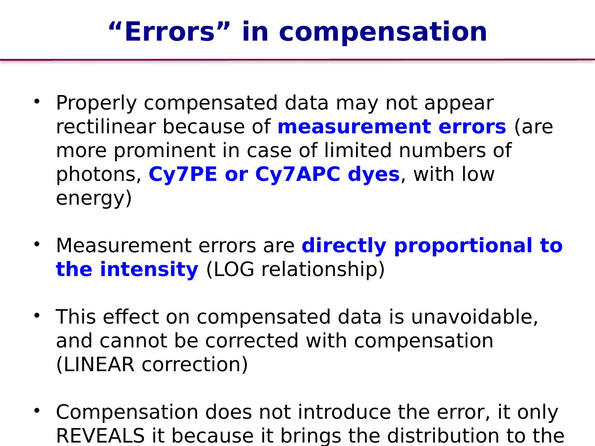

Extracted slide text

<pre>“Errors” in compensation

• Properly compensated data may not appear
  rectilinear because of measurement errors (are
  more prominent in case of limited numbers of
  photons, Cy7PE or Cy7APC dyes, with low
  energy)

• Measurement errors are directly proportional to
  the intensity (LOG relationship)

• This effect on compensated data is unavoidable,
  and cannot be corrected with compensation
  (LINEAR correction)

• Compensation does not introduce the error, it only
  REVEALS it because it brings the distribution to the</pre>

## Slide 33 — How do we overcome this problem?

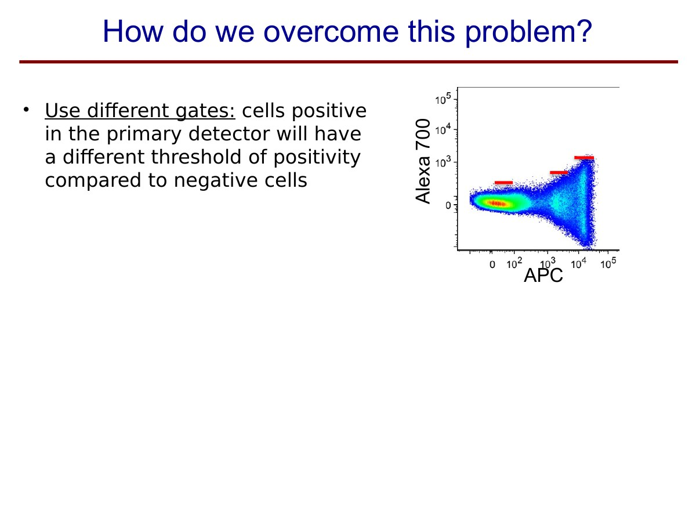

Extracted slide text

<pre>How do we overcome this problem?

• Use different gates: cells positive

                                        Alexa 700
  in the primary detector will have
  a different threshold of positivity
  compared to negative cells

                                                    APC</pre>

## Slide 34 — How do we overcome this problem?

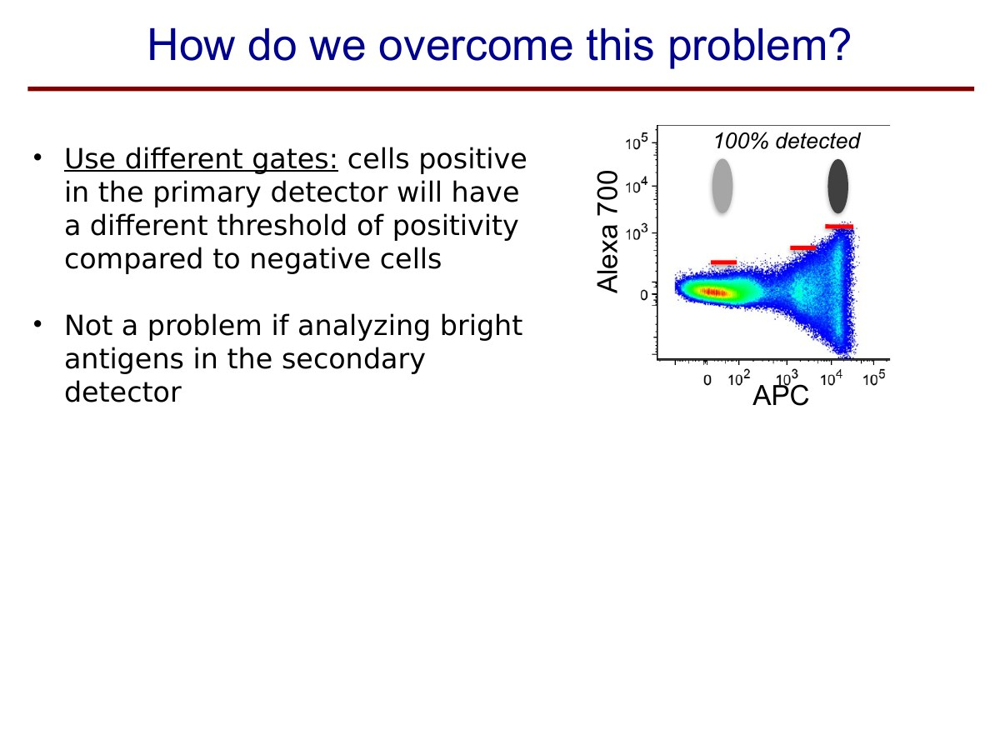

Extracted slide text

<pre>How do we overcome this problem?
                                                    100% detected
• Use different gates: cells positive

                                        Alexa 700
  in the primary detector will have
  a different threshold of positivity
  compared to negative cells

• Not a problem if analyzing bright
  antigens in the secondary
  detector                                             APC</pre>

## Slide 35 — How do we overcome this problem?

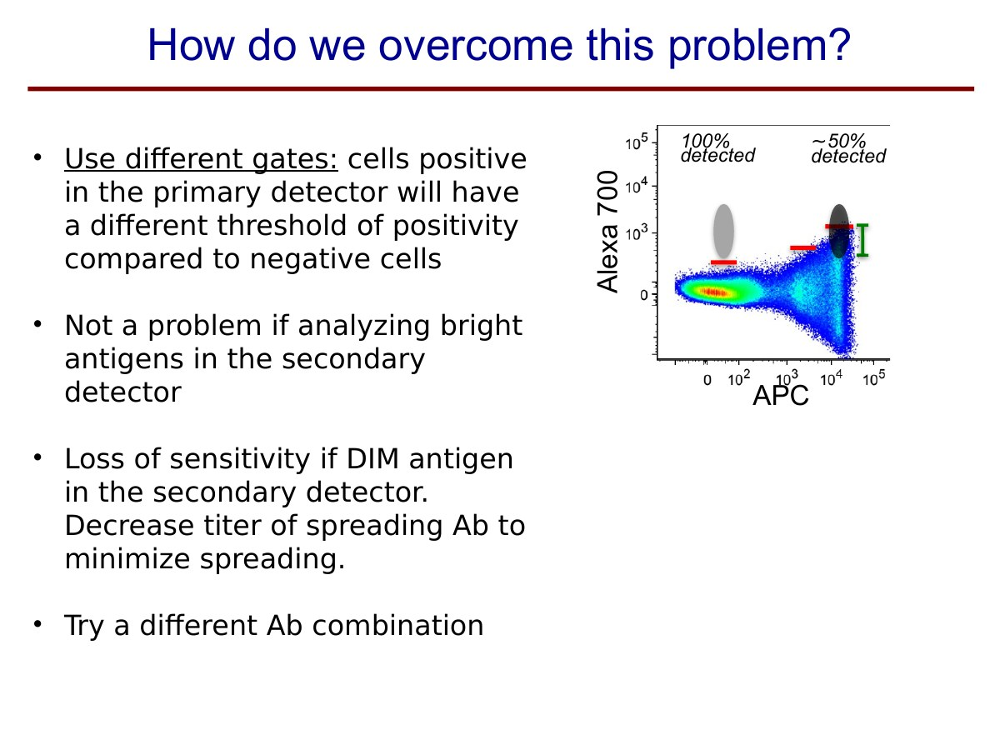

Extracted slide text

<pre>How do we overcome this problem?
                                                    100%         ~50%
• Use different gates: cells positive               detected     detected

                                        Alexa 700
  in the primary detector will have
  a different threshold of positivity
  compared to negative cells

• Not a problem if analyzing bright
  antigens in the secondary
  detector                                                 APC

• Loss of sensitivity if DIM antigen
  in the secondary detector.
  Decrease titer of spreading Ab to
  minimize spreading.

• Try a different Ab combination</pre>

## Slide 36 — Final considerations for panel development

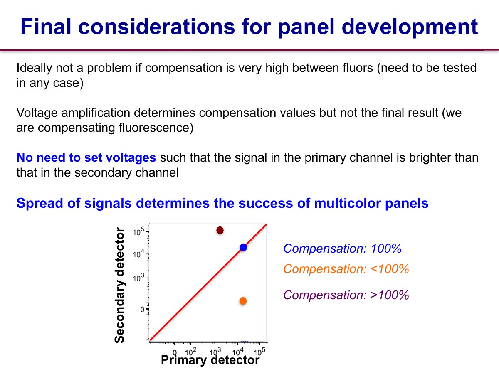

Extracted slide text

<pre>Final considerations for panel development
Ideally not a problem if compensation is very high between fluors (need to be tested
in any case)

Voltage amplification determines compensation values but not the final result (we
are compensating fluorescence)

No need to set voltages such that the signal in the primary channel is brighter than
that in the secondary channel

Spread of signals determines the success of multicolor panels
                 Secondary detector

                                                         Compensation: 100%
                                                         Compensation: &lt;100%

                                                         Compensation: &gt;100%

                                      Primary detector</pre>

## Slide 37 — Define markers to be used

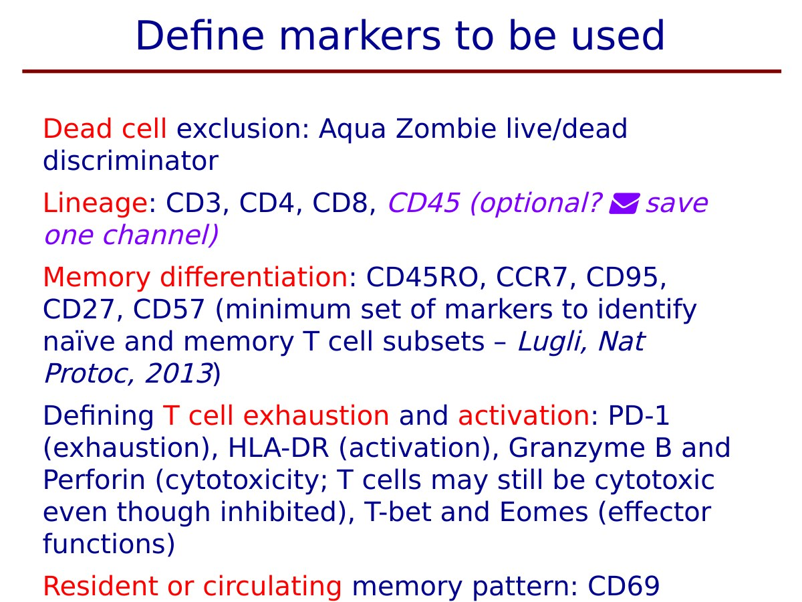

Extracted slide text

<pre>Define markers to be used

Dead cell exclusion: Aqua Zombie live/dead
discriminator
Lineage: CD3, CD4, CD8, CD45 (optional?  save
one channel)
Memory differentiation: CD45RO, CCR7, CD95,
CD27, CD57 (minimum set of markers to identify
naïve and memory T cell subsets – Lugli, Nat
Protoc, 2013)
Defining T cell exhaustion and activation: PD-1
(exhaustion), HLA-DR (activation), Granzyme B and
Perforin (cytotoxicity; T cells may still be cytotoxic
even though inhibited), T-bet and Eomes (effector
functions)
Resident or circulating memory pattern: CD69</pre>

## Slide 38 — Is this panel going

Extracted slide text

<pre>Is this panel going
to work?</pre>

## Slide 39 — It is difficult to predict,

Extracted slide text

<pre>It is difficult to predict,
especially the future</pre>

## Slide 40 — Titrate every single reagent

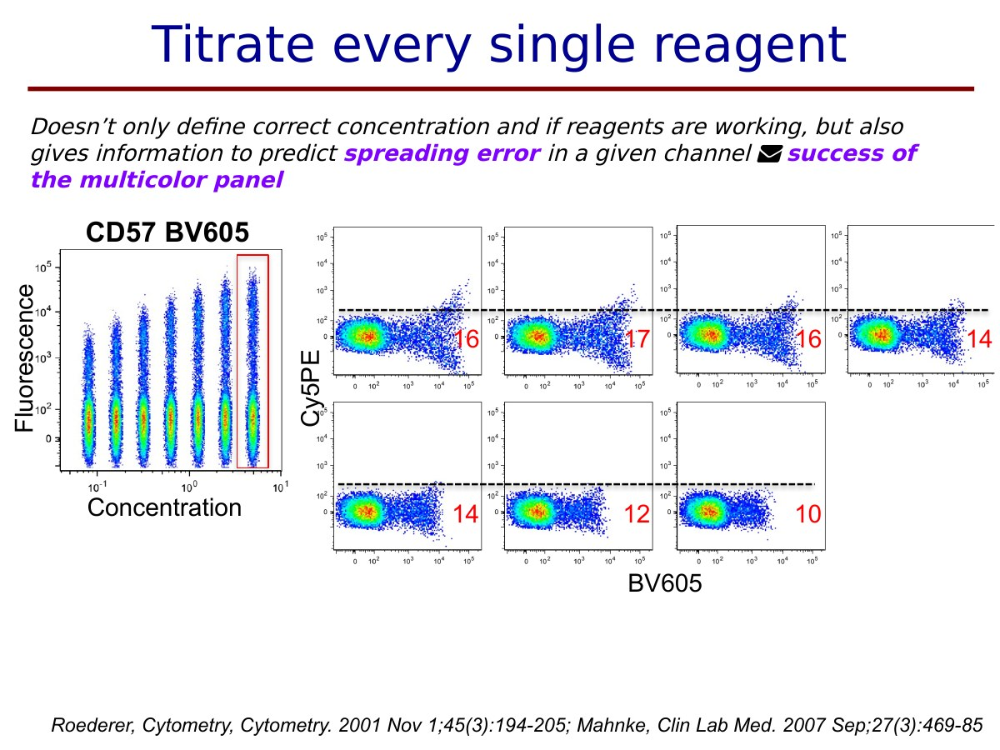

Extracted slide text

<pre>Titrate every single reagent
       Doesn’t only define correct concentration and if reagents are working, but also
       gives information to predict spreading error in a given channel  success of
       the multicolor panel

                  CD57 BV605
Fluorescence

                                                          16                 17                16                 14
                                         Cy5PE

                  Concentration                           14                12                 10

                                                                             BV605

               Roederer, Cytometry, Cytometry. 2001 Nov 1;45(3):194-205; Mahnke, Clin Lab Med. 2007 Sep;27(3):469-85</pre>

## Slide 41 — Spillover spreading across all PMTs

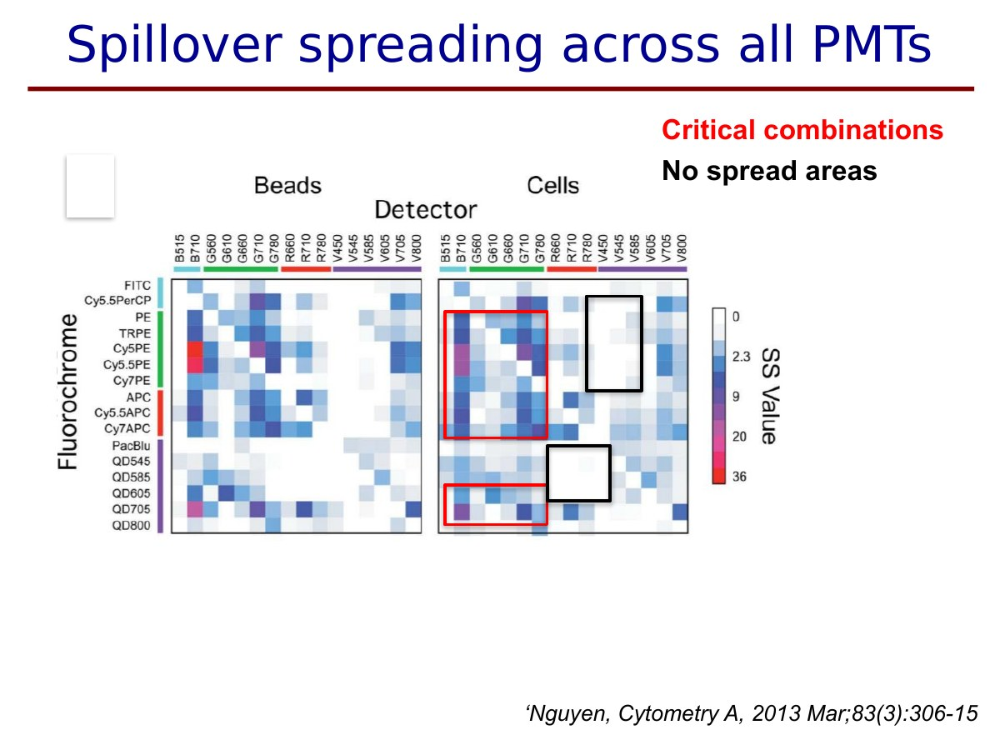

Extracted slide text

<pre>Spillover spreading across all PMTs
                               Critical combinations
                               No spread areas

                  ‘Nguyen, Cytometry A, 2013 Mar;83(3):306-15</pre>

## Slide 42 — Choose the best combo

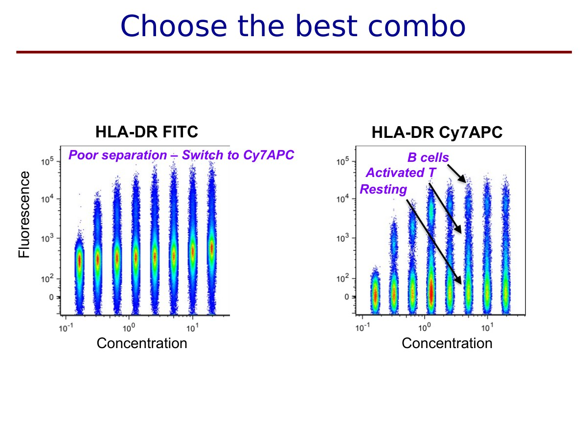

Extracted slide text

<pre>Choose the best combo

                   HLA-DR FITC                        HLA-DR Cy7APC
               Poor separation – Switch to Cy7APC           B cells
                                                     Activated T
Fluorescence

                                                    Resting

                   Concentration                           Concentration</pre>

## Slide 43 — Panel-specific adjustments

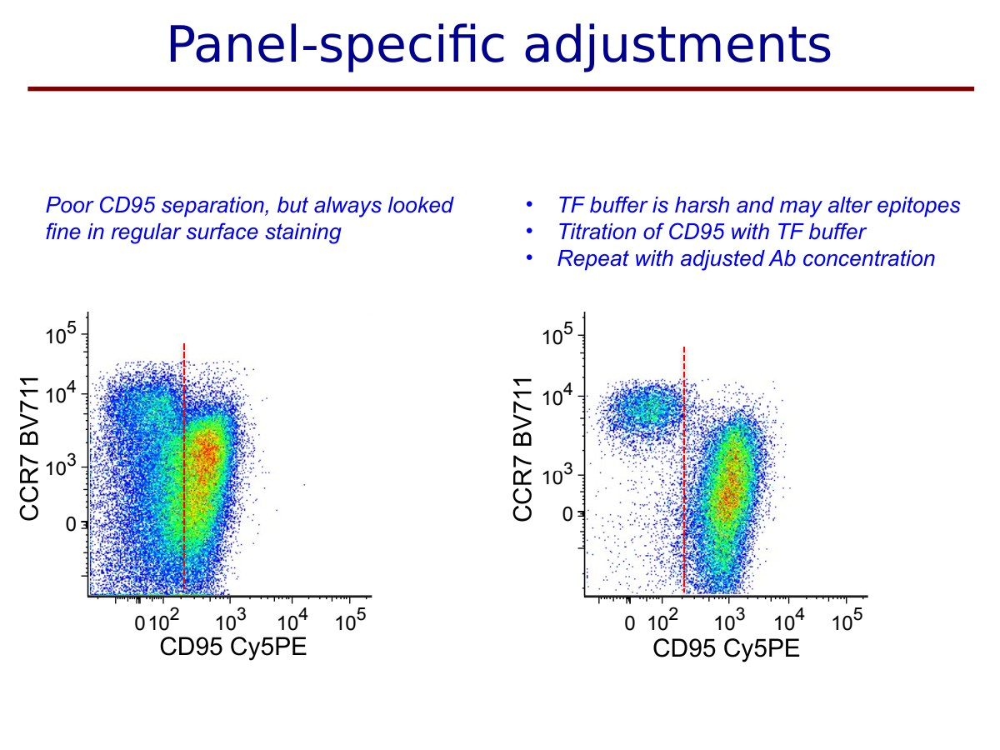

Extracted slide text

<pre>Panel-specific adjustments

         Poor CD95 separation, but always looked        •       TF buffer is harsh and may alter epitopes
         fine in regular surface staining               •       Titration of CD95 with TF buffer
                                                        •       Repeat with adjusted Ab concentration
CCR7 BV711

                                                   CCR7 BV711

                   CD95 Cy5PE                                            CD95 Cy5PE</pre>

## Slide 44 — Sample-specific adjustments

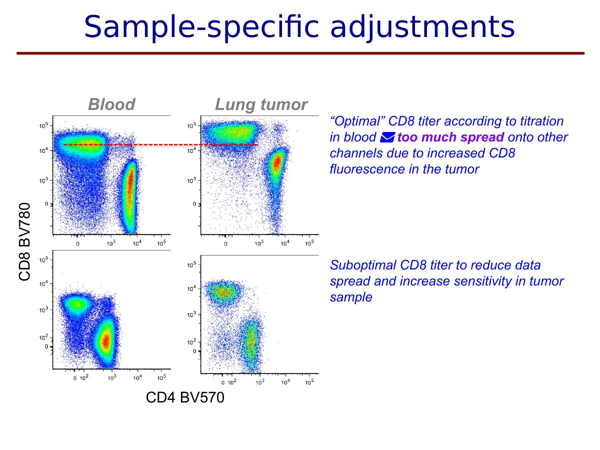

Extracted slide text

<pre>Sample-specific adjustments

            Blood          Lung tumor
                                        “Optimal” CD8 titer according to titration
                                        in blood  too much spread onto other
                                        channels due to increased CD8
                                        fluorescence in the tumor
CD8 BV780

                                        Suboptimal CD8 titer to reduce data
                                        spread and increase sensitivity in tumor
                                        sample

                    CD4 BV570</pre>

## Slide 45 — Sample-specific adjustments

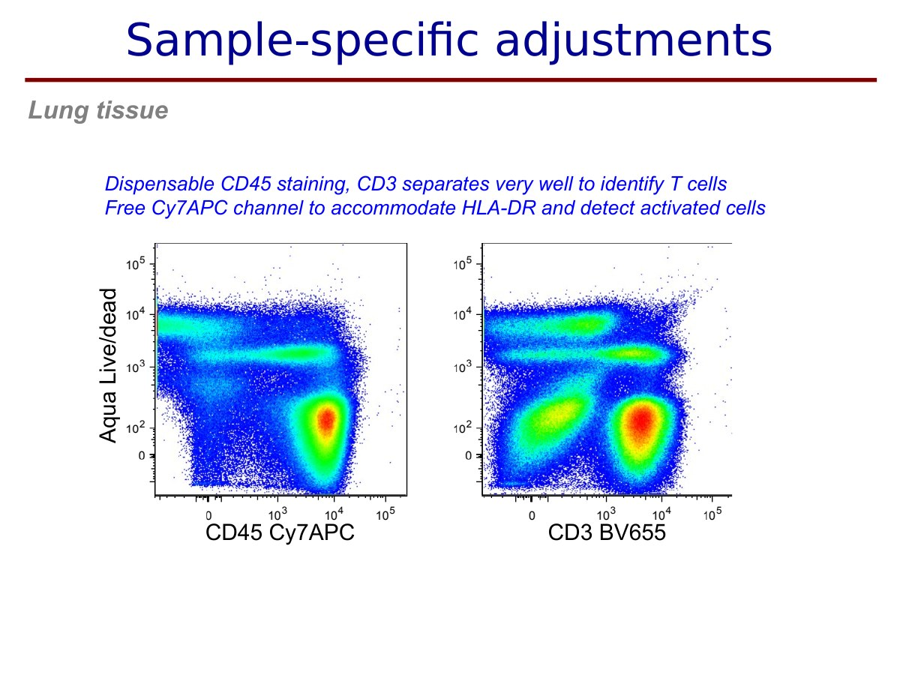

Extracted slide text

<pre>Sample-specific adjustments
Lung tissue

         Dispensable CD45 staining, CD3 separates very well to identify T cells
         Free Cy7APC channel to accommodate HLA-DR and detect activated cells
     Aqua Live/dead

                         CD45 Cy7APC                   CD3 BV655</pre>

## Slide 46 — Fluor Antigen Notes

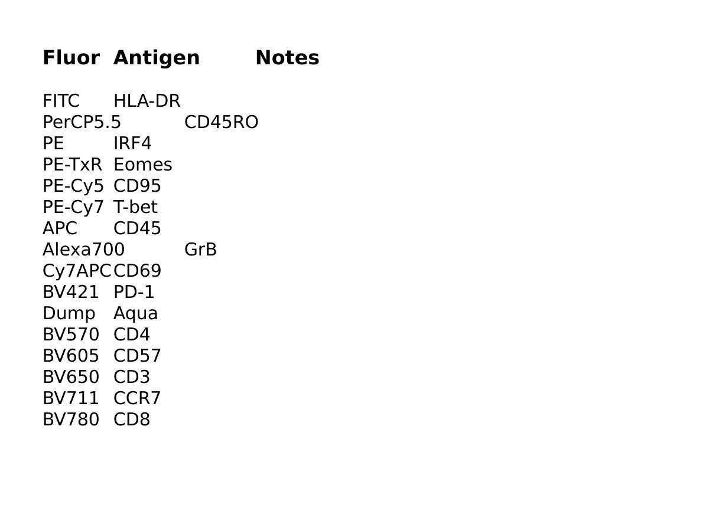

Extracted slide text

<pre>Fluor Antigen      Notes

FITC   HLA-DR
PerCP5.5      CD45RO
PE     IRF4
PE-TxR Eomes
PE-Cy5 CD95
PE-Cy7 T-bet
APC    CD45
Alexa700      GrB
Cy7APCCD69
BV421 PD-1
Dump Aqua
BV570 CD4
BV605 CD57
BV650 CD3
BV711 CCR7
BV780 CD8</pre>

## Slide 47 — Fluor Antigen Notes

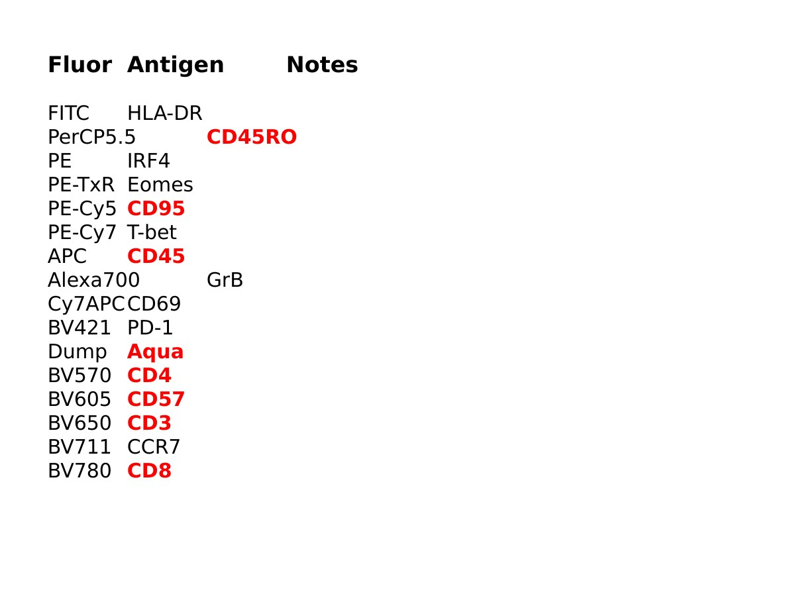

Extracted slide text

<pre>Fluor Antigen      Notes

FITC   HLA-DR
PerCP5.5      CD45RO
PE     IRF4
PE-TxR Eomes
PE-Cy5 CD95
PE-Cy7 T-bet
APC    CD45
Alexa700      GrB
Cy7APCCD69
BV421 PD-1
Dump Aqua
BV570 CD4
BV605 CD57
BV650 CD3
BV711 CCR7
BV780 CD8</pre>

## Slide 48 — Fluor Antigen Notes

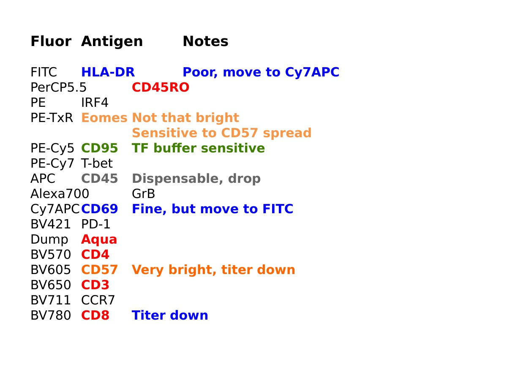

Extracted slide text

<pre>Fluor Antigen      Notes

FITC   HLA-DR       Poor, move to Cy7APC
PerCP5.5     CD45RO
PE     IRF4
PE-TxR Eomes Not that bright
             Sensitive to CD57 spread
PE-Cy5 CD95 TF buffer sensitive
PE-Cy7 T-bet
APC    CD45 Dispensable, drop
Alexa700     GrB
Cy7APCCD69 Fine, but move to FITC
BV421 PD-1
Dump Aqua
BV570 CD4
BV605 CD57 Very bright, titer down
BV650 CD3
BV711 CCR7
BV780 CD8    Titer down</pre>

## Slide 49 — Fluor Antigen Notes Operations

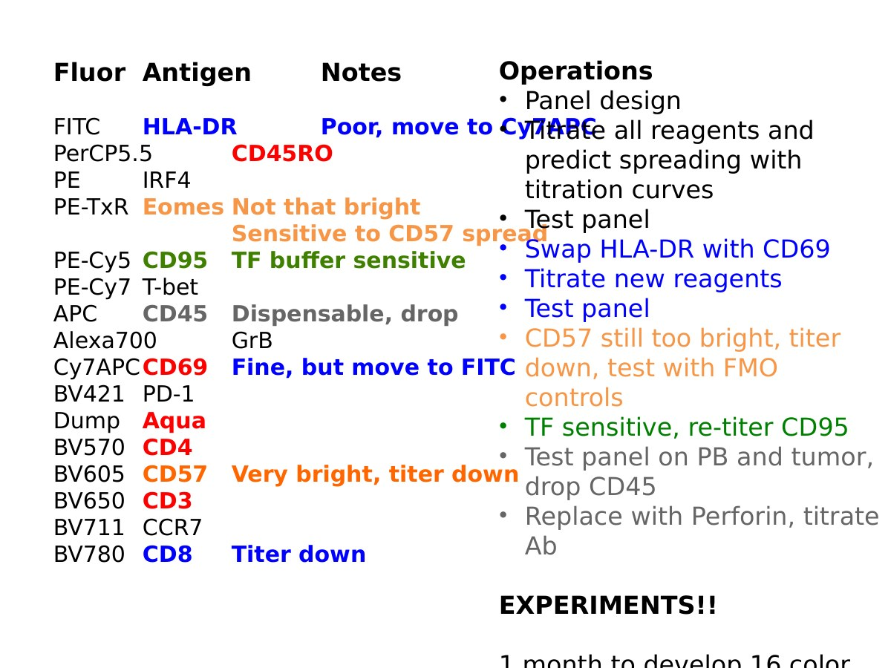

Extracted slide text

<pre>Fluor Antigen        Notes        Operations
                                  • Panel design
FITC   HLA-DR       Poor, move to •Cy7APC
                                     Titrate all reagents and
PerCP5.5     CD45RO                  predict spreading with
PE     IRF4                          titration curves
PE-TxR Eomes Not that bright
                                  • Test panel
             Sensitive to CD57 spread
PE-Cy5 CD95 TF buffer sensitive
                                  • Swap HLA-DR with CD69
PE-Cy7 T-bet                      • Titrate new reagents
APC    CD45 Dispensable, drop     • Test panel
Alexa700     GrB                  • CD57 still too bright, titer
Cy7APCCD69 Fine, but move to FITC down, test with FMO
BV421 PD-1                           controls
Dump Aqua                         • TF sensitive, re-titer CD95
BV570 CD4                         • Test panel on PB and tumor,
BV605 CD57 Very bright, titer down
                                     drop CD45
BV650 CD3
BV711 CCR7
                                  • Replace with Perforin, titrate
BV780 CD8    Titer down              Ab

                                   EXPERIMENTS!!</pre>

## Slide 50 — Fluor Antigen Notes Final panel

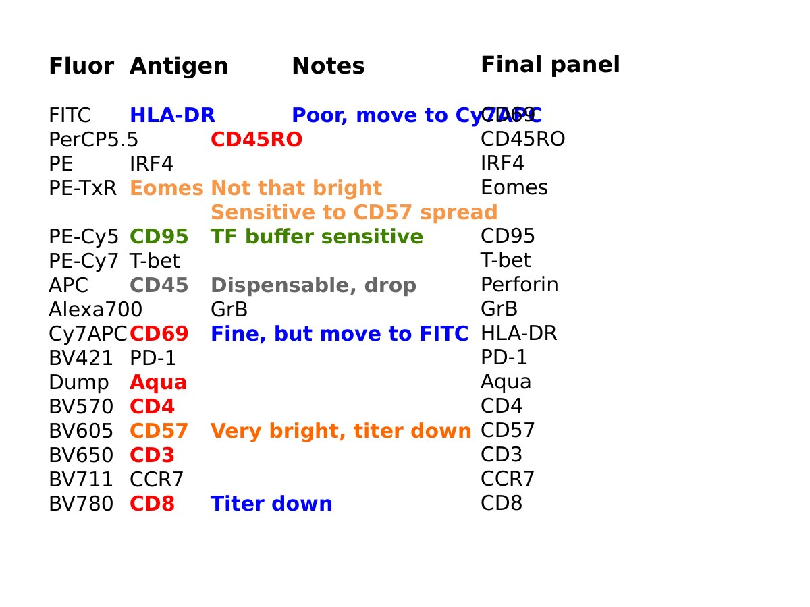

Extracted slide text

<pre>Fluor Antigen       Notes           Final panel

FITC   HLA-DR                       CD69
                    Poor, move to Cy7APC
PerCP5.5     CD45RO                 CD45RO
PE     IRF4                         IRF4
PE-TxR Eomes Not that bright        Eomes
             Sensitive to CD57 spread
PE-Cy5 CD95 TF buffer sensitive     CD95
PE-Cy7 T-bet                        T-bet
APC    CD45 Dispensable, drop       Perforin
Alexa700     GrB                    GrB
Cy7APCCD69 Fine, but move to FITC HLA-DR
BV421 PD-1                          PD-1
Dump Aqua                           Aqua
BV570 CD4                           CD4
BV605 CD57 Very bright, titer down CD57
BV650 CD3                           CD3
BV711 CCR7                          CCR7
BV780 CD8    Titer down             CD8</pre>

## Slide 51 — 20-parameter FACS

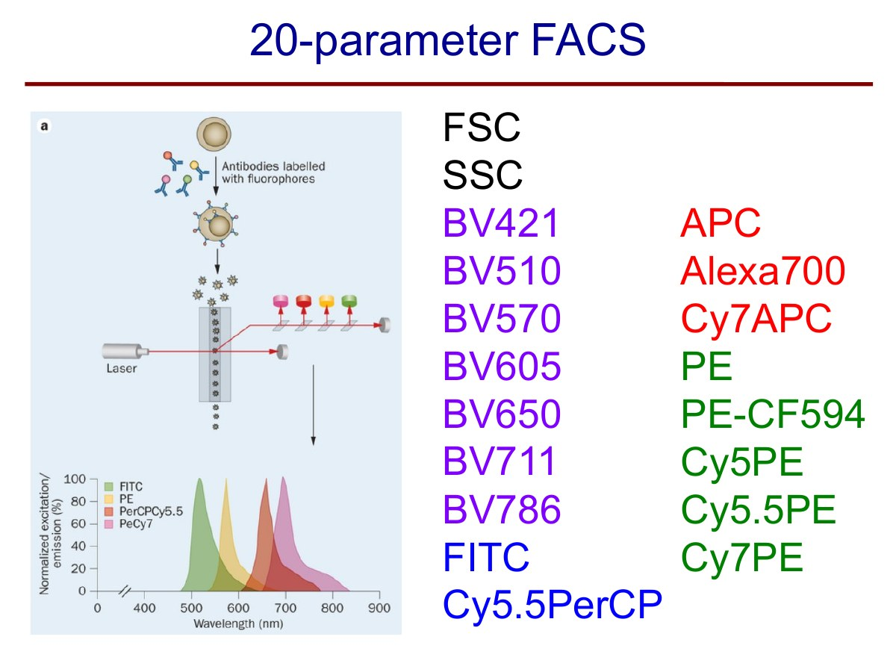

Extracted slide text

<pre>20-parameter FACS
        FSC
        SSC
        BV421      APC
        BV510      Alexa700
        BV570      Cy7APC
        BV605      PE
        BV650      PE-CF594
        BV711      Cy5PE
        BV786      Cy5.5PE
        FITC       Cy7PE
        Cy5.5PerCP</pre>

## Slide 52 — Moving towards 50 parameter

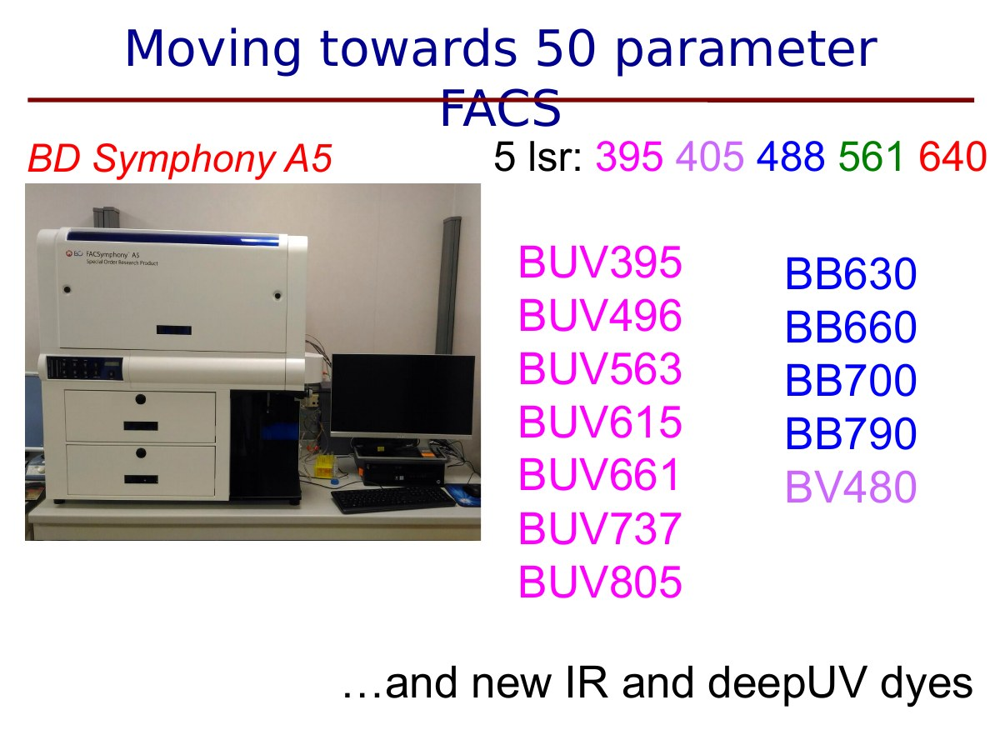

Extracted slide text

<pre>Moving towards 50 parameter
               FACS
BD Symphony A5         5 lsr: 395 405 488 561 640

                        BUV395        BB630
                        BUV496        BB660
                        BUV563        BB700
                        BUV615        BB790
                        BUV661        BV480
                        BUV737
                        BUV805

                 …and new IR and deepUV dyes</pre>

## Slide 53 — A new Age of Enlightenment in

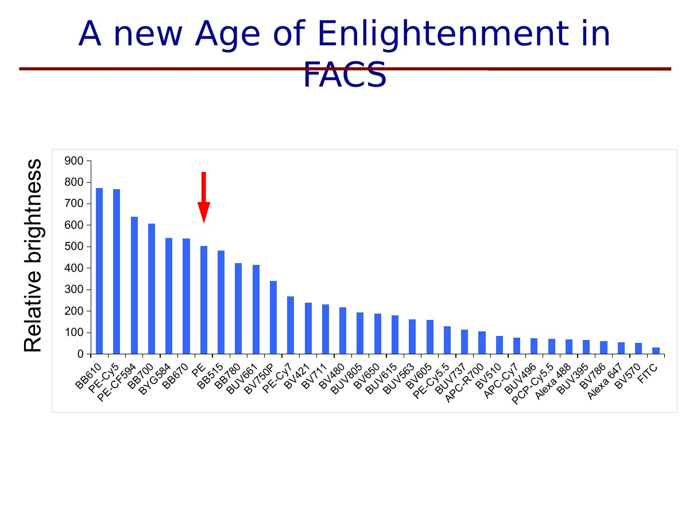

Extracted slide text

<pre>A new Age of Enlightenment in
                                    FACS

                      900
Relative brightness

                      800
                      700
                      600
                      500
                      400
                      300
                      200
                      100
                        0
                             0 5 4 0 4 0 E 5 0 1 P 7 1 1 0 5 0 5 3 5 .5 7 0 0 7 6 .5 8 5 6 7 0 C
                         B 61 -Cy F59 B70 58 B67 P B51 B78 V66 750 -Cy V42 V71 V48 V80 V65 V61 V56 V60 y5 V73 70 V51 -Cy V49 y5 48 V39 V78 64 V57 FIT
                        B P E -C B Y G B          B B U BV PE B B B U B U U B E-C U C-R B PC U P-C exa U B exa B
                                       B                B                       B       B B             B P            B C Al B        Al
                              PE                                                                   P      A       A
                                                                                                                        P</pre>

## Slide 54 — Flow cytometry data

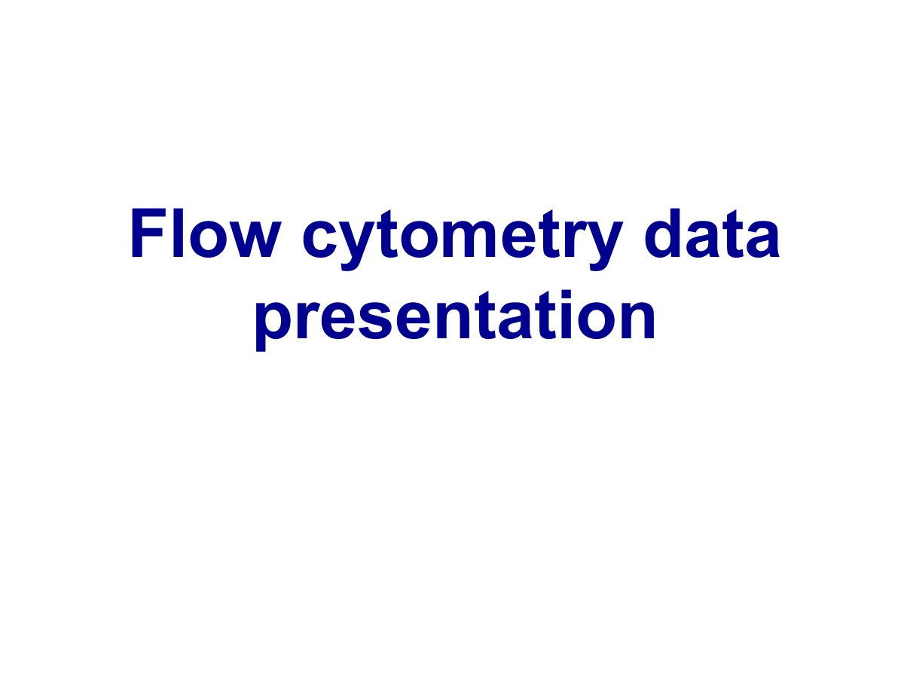

Extracted slide text

<pre>Flow cytometry data
   presentation</pre>

## Slide 55 — A call for data integrity in FACS

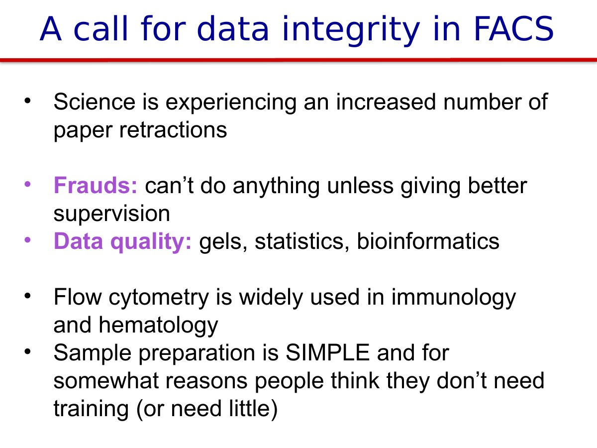

Extracted slide text

<pre>A call for data integrity in FACS

• Science is experiencing an increased number of
  paper retractions

• Frauds: can’t do anything unless giving better
  supervision
• Data quality: gels, statistics, bioinformatics

• Flow cytometry is widely used in immunology
  and hematology
• Sample preparation is SIMPLE and for
  somewhat reasons people think they don’t need
  training (or need little)</pre>

## Slide 56 — Introducing artifacts in flow cytometry

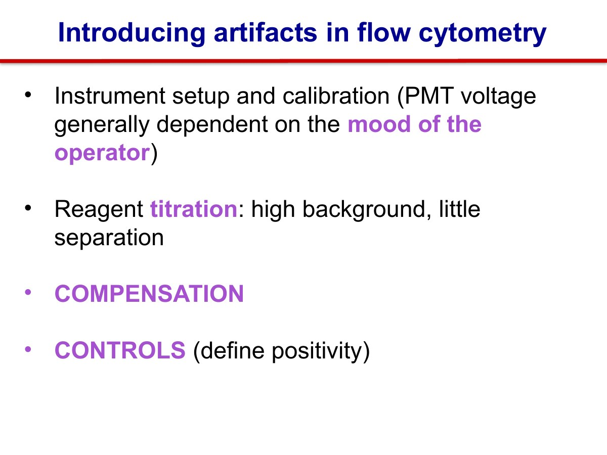

Extracted slide text

<pre>Introducing artifacts in flow cytometry

• Instrument setup and calibration (PMT voltage
  generally dependent on the mood of the
  operator)

• Reagent titration: high background, little
  separation

• COMPENSATION

• CONTROLS (define positivity)</pre>

## Slide 57 — Some papers rely heavily on FACS

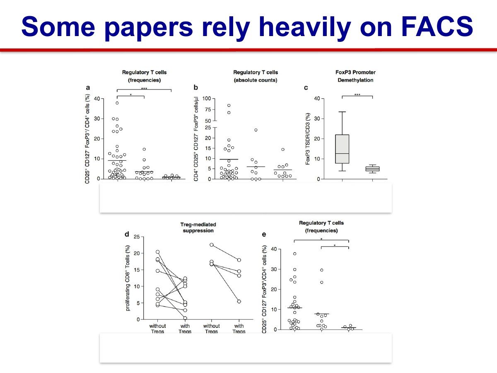

Extracted slide text

<pre>Some papers rely heavily on FACS</pre>

## Slide 58 — Some papers rely heavily on FACS

Extracted slide text

<pre>Some papers rely heavily on FACS

   SHOW ME THE
      DATA !</pre>

## Slide 59 — Questions arising

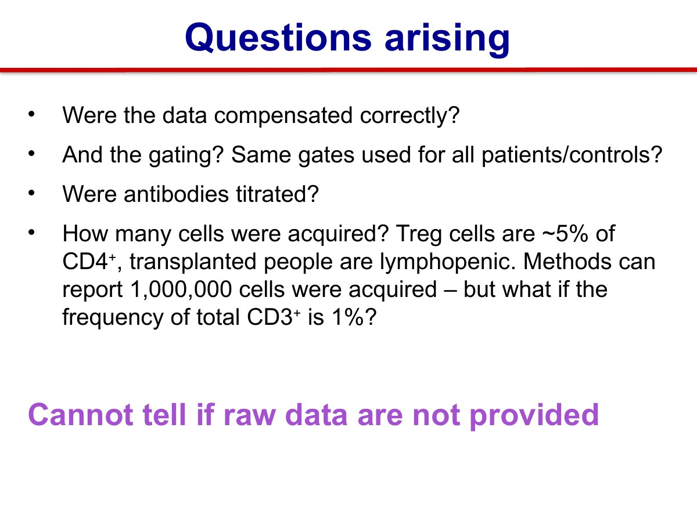

Extracted slide text

<pre>Questions arising
•   Were the data compensated correctly?
•   And the gating? Same gates used for all patients/controls?
•   Were antibodies titrated?
•   How many cells were acquired? Treg cells are ~5% of
    CD4+, transplanted people are lymphopenic. Methods can
    report 1,000,000 cells were acquired – but what if the
    frequency of total CD3+ is 1%?

Cannot tell if raw data are not provided</pre>

## Slide 60 — Outline

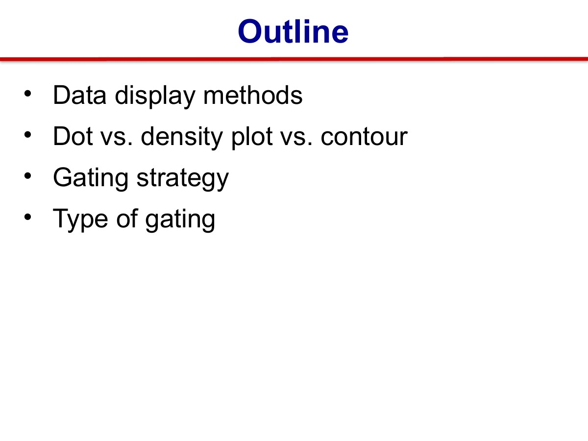

Extracted slide text

<pre>Outline
• Data display methods
• Dot vs. density plot vs. contour
• Gating strategy
• Type of gating</pre>

## Slide 61 — Avoid histograms (or be careful)

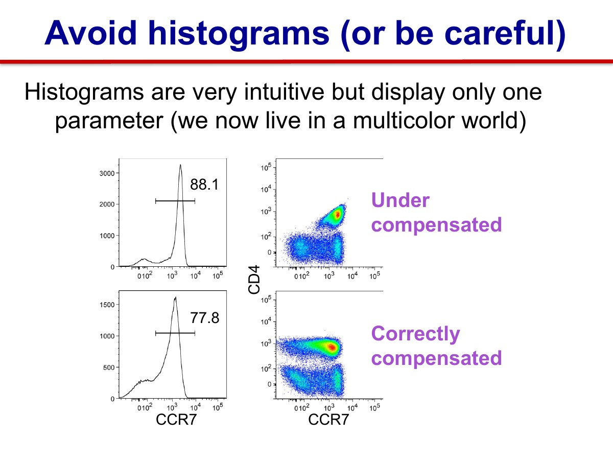

Extracted slide text

<pre>Avoid histograms (or be careful)
Histograms are very intuitive but display only one
   parameter (we now live in a multicolor world)

                88.1
                                    Under
                                    compensated
                       CD4

                77.8
                                    Correctly
                                    compensated

            CCR7             CCR7</pre>

## Slide 62 — Dot vs. density plot vs. contour

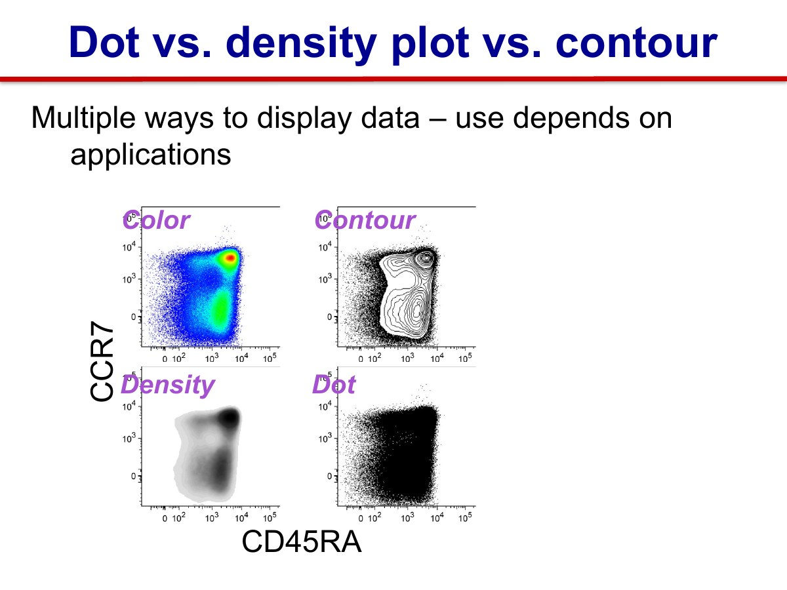

Extracted slide text

<pre>Dot vs. density plot vs. contour
Multiple ways to display data – use depends on
  applications

      Color         Contour
   CCR7

      Density       Dot

                CD45RA</pre>

## Slide 63 — Saturated areas by events

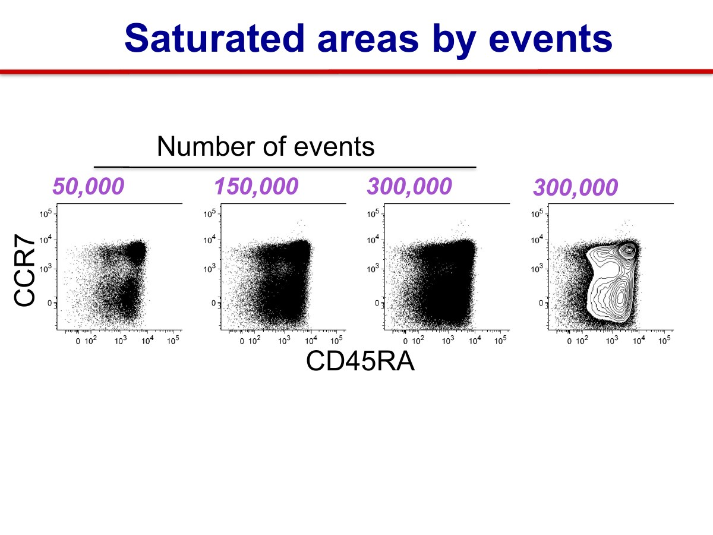

Extracted slide text

<pre>Saturated areas by events

                 Number of events
       50,000        150,000      300,000   300,000
CCR7

                               CD45RA</pre>

## Slide 64 — Dots are useful with low numbers

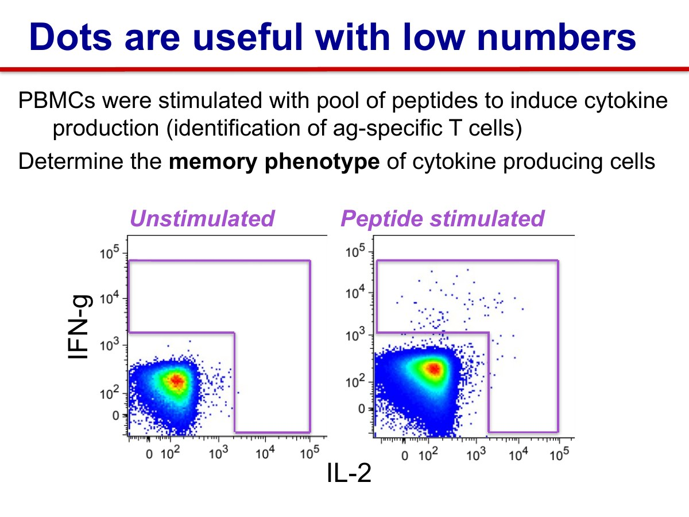

Extracted slide text

<pre>Dots are useful with low numbers
PBMCs were stimulated with pool of peptides to induce cytokine
   production (identification of ag-specific T cells)
Determine the memory phenotype of cytokine producing cells

            Unstimulated      Peptide stimulated
    IFN-g

                             IL-2</pre>

## Slide 65 — Dots are useful with low numbers

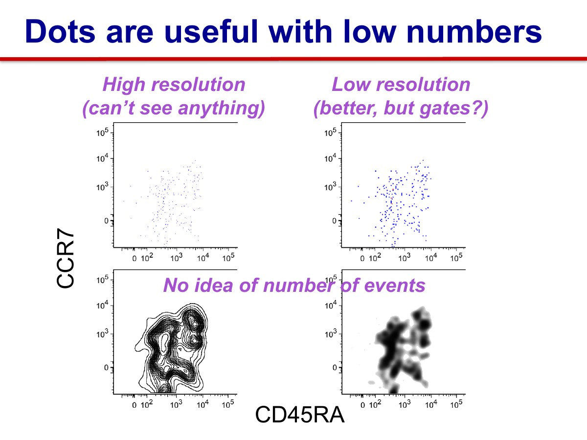

Extracted slide text

<pre>Dots are useful with low numbers
          High resolution        Low resolution
        (can’t see anything)   (better, but gates?)
 CCR7

                No idea of number of events

                          CD45RA</pre>

## Slide 66 — Dots are useful with low numbers

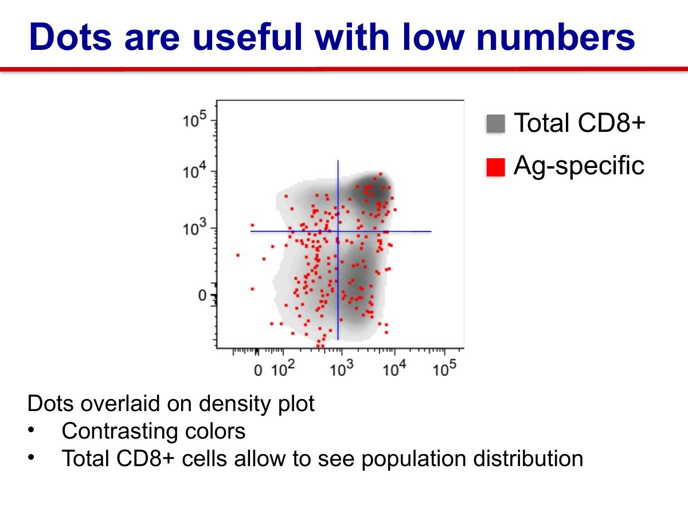

Extracted slide text

<pre>Dots are useful with low numbers

                                                Total CD8+
                                                Ag-specific

Dots overlaid on density plot
• Contrasting colors
• Total CD8+ cells allow to see population distribution</pre>

## Slide 67 — Complex experiments: gating strategy

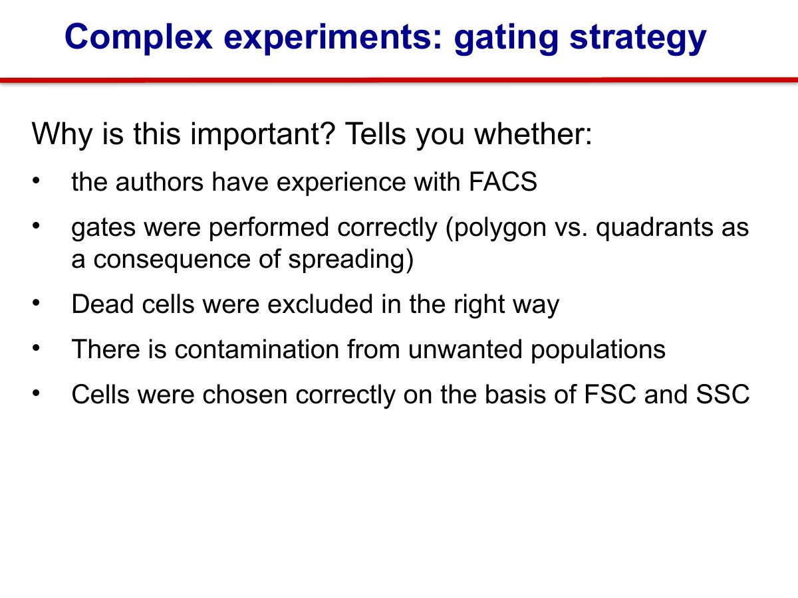

Extracted slide text

<pre>Complex experiments: gating strategy

Why is this important? Tells you whether:
•   the authors have experience with FACS
•   gates were performed correctly (polygon vs. quadrants as
    a consequence of spreading)
•   Dead cells were excluded in the right way
•   There is contamination from unwanted populations
•   Cells were chosen correctly on the basis of FSC and SSC</pre>

## Slide 68 — Memory T cells: full gating strategy

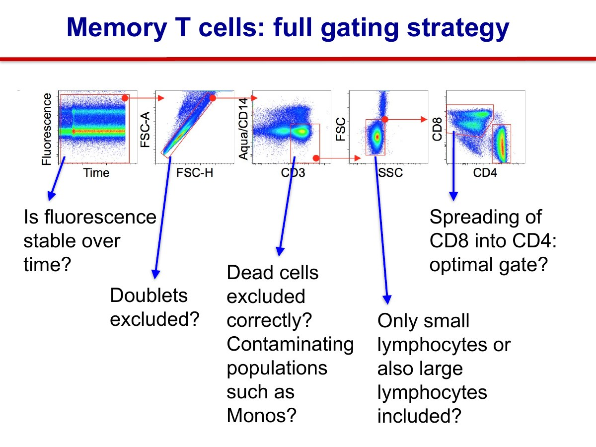

Extracted slide text

<pre>Memory T cells: full gating strategy

Is fluorescence                           Spreading of
stable over                               CD8 into CD4:
time?                Dead cells           optimal gate?
         Doublets    excluded
         excluded?   correctly?      Only small
                     Contaminating   lymphocytes or
                     populations     also large
                     such as         lymphocytes
                     Monos?          included?</pre>

## Slide 69 — MIFlowCyt – ISAC standards for data display

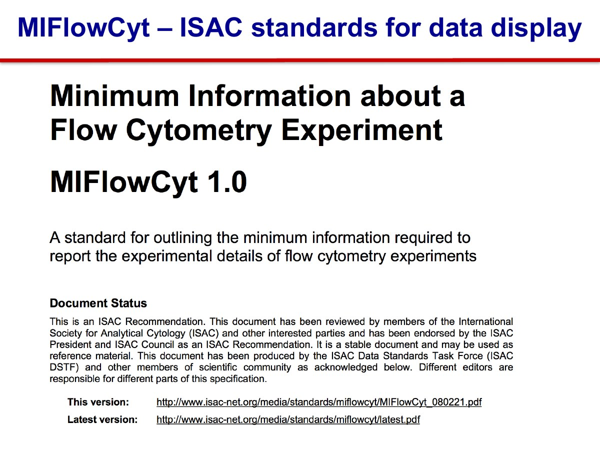

Extracted slide text

<pre>MIFlowCyt – ISAC standards for data display</pre>

## Slide 70 — Untitled slide

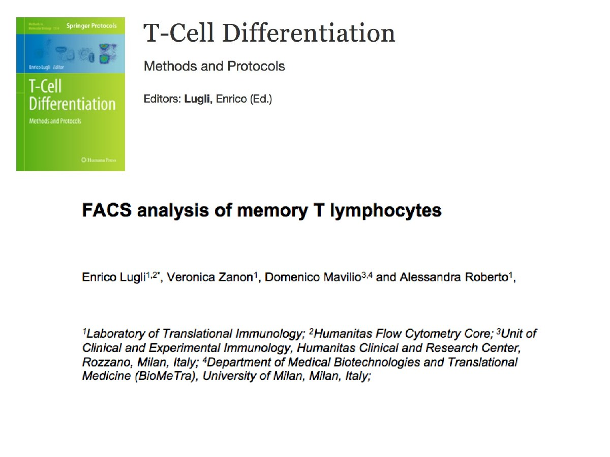

## Slide 71 — enrico.lugli@humanitasresearch.it

Extracted slide text

<pre>enrico.lugli@humanitasresearch.it</pre>

