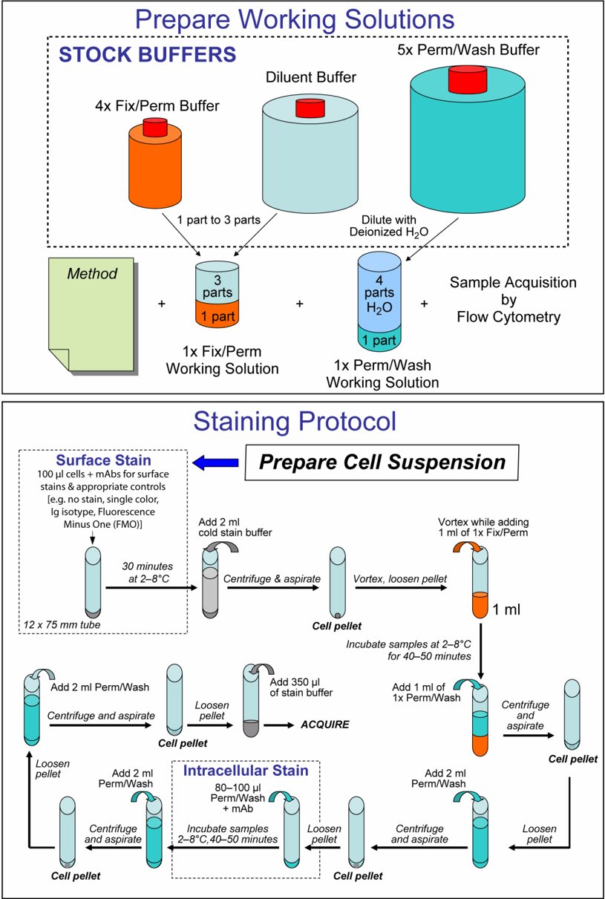
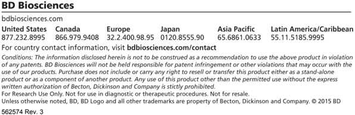
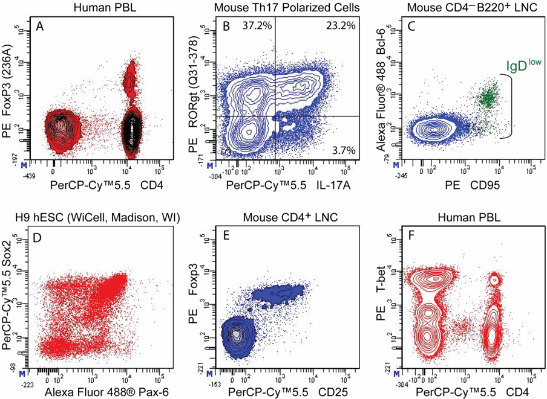

[Download the original PDF](FC4.TF_buffer_set.pdf){.btn .btn-primary download="FC4.TF_buffer_set.pdf"}

Source PDF: [FC4.TF_buffer_set.pdf](FC4.TF_buffer_set.pdf)

## Technical Data Sheet

## Transcription Factor Buffer Set

## Product Information

Material Number:

562574

Size:

100 Tests

Component:

51-9008100

TF Fix/Perm Buffer (4X) 25 mL (1 ea)

Description:

Size:

Component:

51-9008101

TF Diluent Buffer 75 mL (1 ea)

Description:

Size:

Component:

51-9008102

TF Perm/Wash Buffer (5X) 150 mL (1 ea)

Description:

Size:

## Description

The BD Pharmingen™ Transcription Factor Buffer Set is optimized for fixing and permeabilizing cells prior to immunofluorescent staining and flow cytometric analysis of cells that express specific intracytoplasmic and intranuclear proteins. The BD Pharmingen™ Transcription Factor Buffer Set was designed to improve ease-of-use and minimize processing time, to reduce nonspecific staining, to increase the resolution of positively stained cells and to significantly reduce cell loss during fixation, permeabilization and staining procedures. Flow cytometric detection of the many proteins known to be expressed within various intracellular compartments, especially transcription factors, is improved with BD Pharmingen™ Transcription Factor Buffer Set use. This buffer system has been found useful for fixing and permeabilizing a variety of cell types from diverse human and mouse tissues. The buffer system is flexible in supporting multiwell-plate high-throughput and bulk sample analyses and applications that require overnight sample storage. The buffer system has minimal impact on the light-scatter and autofluorescence characteristics of processed cells resulting in characteristics similar to those observed for freshly prepared, highly viable primary cells. In many cases the buffer system was found to be compatible with the immunofluorescent staining of cell-surface antigens both before and after cellular fixation and permeabilization. The buffer system is also compatible with many tandem fluorochromes.

## Preparation and Storage

Store undiluted at 4°C.

Keep stock buffers and 1x working solutions at 2-8°C. After opening the BD Pharmingen™ Transcription Factor Buffer Set, use it within six months. If stored without opening, then use before the expiration date indicated on the bottle labels.

Avoid microbial contamination of reagents as incorrect results may occur.

Handle TF Diluent Buffer (Component 51-9008101) in a sterile cabinet or use aseptic practices to preserve the integrity of the solution.

## Application Notes

Application

Intracellular staining (flow cytometry)

## Recommended Assay Procedure:

Prior to intracellular staining

- Prepare single-cell suspensions from lymphoid tissues of interest (eg, human peripheral blood, mouse thymus or lymph node). Label 5-ml round-bottom 12 × 75-mm polystyrene tubes and identify appropriate antibodies for your experiment.
- Slowly invert five times the stock BD Pharmingen™ TF Fix/Perm Buffer (4X), TF Diluent Buffer and TF Perm/Wash Buffer (5X) bottles before making working solutions.
- Dilute the 4x Fix/Perm Buffer using the TF Diluent Buffer to the necessary volume of 1x Fix/Perm working solution (a typical dilution for 20 tests is 5 ml of 4x Fix/Perm and 15 ml of TF Diluent Buffer). Use the 1x Fix/Perm Buffer working solution for the Intracellular Staining Protocol listed below within an hour of preparation.
- Dilute the 5x Perm/Wash Buffer to a 1x Perm/Wash Buffer working solution. (A typical dilution for 20 tests would be 30 ml of 5x Perm/Wash Buffer added to 120 ml of deionized water to yield 150 ml of 1x Perm/Wash Buffer). Use the 1x Perm/Wash Buffer working solution for the Intracellular Staining Protocol listed below. Store the 1x Perm/Wash Buffer at 2-8°C for up to one week.

## Routinely Tested

- Buffers for intracellular staining should be kept on ice or at 2-8°C throughout the Intracellular Staining Protocol.
- Surface Staining: Prepare cell suspension containing 10 million cells per ml in flow cytometry stain buffer, such as BD Pharmingen™ Stain Buffer (FBS) (Cat. No. 554656) or Stain Buffer (BSA) (Cat. No. 554657). Incubate 100 µl of cells per tube with fluorescent antibodies (eg, antibodies specific for CD4, CD8, CD25, CD19) for 30 minutes at 2-8°C. Wash cells one time with 2 ml of stain buffer and move forward with the intracellular staining protocol listed below.

## Intracellular Staining Protocol

1. Fix/Perm: After the cell surface staining procedure is completed, aspirate residual stain buffer. Resuspend cell pellets by brief vortexing and add 1 ml of freshly prepared 1x Fix/Perm Buffer working solution to each tube. Vortex samples for approximately three seconds after adding the Fix/Perm Buffer. Incubate samples at 2-8°C for 40-50 minutes protected from light.
2. Perm/Wash: Add 1 ml of 1x Perm/Wash Buffer directly to the fixed and permeabilized cells suspended in the 1x Fix/Perm Buffer. Pellet the cells by centrifugation. (Note: All centrifugation steps post Fix/Perm are at 350 g and at 2-8 °C for 6 minutes). Decant or aspirate the supernatants.
3. Perm/Wash: Add 2 ml of 1x Perm/Wash Buffer to the pelleted cells followed by centrifugation. Decant or aspirate wash buffer.
4. Intracellular Staining: Add 80-100 µl of 1x Perm/Wash Buffer to cell samples and the fluorescent antibodies specific for intracellular proteins (eg, FoxP3, T-bet and/or IL-17A) and for nonspecific control staining (eg, matching fluorescent Ig isotype controls) to each tube. Vortex tube or rack for 10 seconds and incubate at 2-8°C for 40-50 minutes protected from light.
5. Perm/Wash: Briefly vortex samples prior to washing. Wash cells with 2 ml of 1x Perm/Wash Buffer. Centrifuge cells. Decant or aspirate the wash buffer.
6. Perm/Wash: Wash cells with 2 ml 1x Perm/Wash. Centrifuge cells. Decant or aspirate wash buffer.
7. Sample preparation for flow cytometry: Resuspend cell pellet in 350 µl of flow cytometry stain buffer. Analyze the cells and acquire data using a flow cytometer.

## Notes:

- Due to the fixation and permeabilization procedure, forward and side light-scatter signals will be slightly different than those of live cells.
- The buffer system is optimized for use with fluorescence settings established by using the BD™ Cytometer Setup &amp; Tracking Beads Kit (Cat. No. 642412). However, for your application, minor adjustments in gate and/or detector voltage may need to be made prior to compensation and acquisition.
- Target the acquisition for a statistically significant number of events.
- A titration of the fluorescent antibody's optimal staining amount and optimization of the staining time may be required in your application.

Danger : TF Fix/Perm Buffer (4X) (Component 51-9008100) contains 5.0% formaldehyde (w/w) and 1.76% methanol (w/w).

## Hazard statements:

Harmful if swallowed or in contact with skin.

Toxic if inhaled.

Causes skin irritation.

Causes serious eye damage.

May cause an allergic skin reaction.

Suspected of causing genetic defects.

May cause cancer. Route of exposure: Inhalative.

May cause respiratory irritation.

## Precautionary statements:

Wear protective clothing / eye protection.

Wear protective gloves.

Avoid breathing mist/vapours/spray.

IF IN EYES: Rinse cautiously with water for several minutes. Remove contact lenses, if present and easy to do.

Continue rinsing.

IF INHALED: Remove victim to fresh air and keep at rest in a position comfortable for breathing.

IF ON SKIN: Wash with plenty of water.

Caution: TF Perm/Wash Buffer (5X) (Component 51-9008102) contains ≤ 0.09% sodium azide.  Sodium azide yields highly toxic hydrazoic azid under acidic conditions. Dilute azide compounds in running water before discarding to avoid accumulation of potentially explosive deposits in plumbing.

Overview of Buffer Dilution and Staining Protocol.

## Suggested Companion Products

Multicolor flow cytometric analysis of transcription factors expressed in different cell types using the BD Pharmingen™ Transcription Factor Buffer Set. Bivariate flow cytometric plots showing (A) CD4 versus FoxP3 expression in human peripheral blood lymphocytes (PBL); (B) IL-17A versus RORgt expression in BALB/c mouse Th17-polarized cells; (C) CD95 versus Bcl-6 expression in C57BL/6 mouse lymph node cells (LNC) and identification of germinal center B-cells using CD4-B220+IgDloCD95hi phenotype as green colorized dots; (D) Pax-6 versus Sox-2 in H9 (WiCell, Madison, Wi) human embryonic stem cell (ESC) derived neural cultures; (E) mouse CD25 versus Foxp3 expression in CD4 T cells derived from C57BL/6 mouse LNC; (F) CD4 versus T-bet expression in human PBL. Plots were derived from gated events with the forward and side light-scattering characteristics of intact lymphocytes or indicated cell types using BD FACSDiva™ Software v. 6.1.3 and a BD LSRFortessa™ Flow Cytometer System.

|   Catalog Number | Name                            | Size     | Clone   |
|------------------|---------------------------------|----------|---------|
|           554656 | Stain Buffer (FBS)              | 500 mL   | (none)  |
|           554657 | Stain Buffer (BSA)              | 500 mL   | (none)  |
|           562725 | Transcription Factor Buffer Set | 25 Tests | (none)  |

## Product Notices

- Cy is a trademark of Amersham Biosciences Limited. 1.
- Alexa Fluor® is a registered trademark of Molecular Probes, Inc., Eugene, OR. 2.
- Source of all serum proteins is from USDA inspected abattoirs located in the United States. 3.
- Caution: Sodium azide yields highly toxic hydrazoic acid under acidic conditions. Dilute azide compounds in running water before discarding to avoid accumulation of potentially explosive deposits in plumbing. 4.
- Please refer to www.bdbiosciences.com/pharmingen/protocols for technical protocols. 5.

