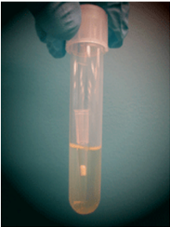
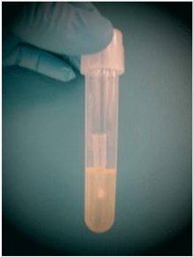

[Download the original PDF](Addgene_%20Protocol%20-%20How%20to%20Inoculate%20a%20Bacterial%20Culture.pdf){.btn .btn-primary download="Addgene_ Protocol - How to Inoculate a Bacterial Culture.pdf"}

Source PDF: [Addgene_ Protocol - How to Inoculate a Bacterial Culture.pdf](Addgene_%20Protocol%20-%20How%20to%20Inoculate%20a%20Bacterial%20Culture.pdf)

This website uses cookies to ensure you get the best experience. By continuing to use this site, you agree to the use of cookies.

## Inoculating a Liquid Bacterial Culture

## Background Information

Plasmids can carry one or more antibiotic resistance genes, which confer resistance to a specic antibiotic to the bacteria carrying them. The presence of an antibiotic resistance gene on a plasmids allows researchers to easily isolate bacteria containing that plasmid from bacteria that do not contain it by articial selection (i.e. growing the bacteria in the presence of the antibiotic).

Luria broth (LB) is a nutrient-rich media commonly used to culture bacteria in the lab. LB agar plates are frequently used to isolate individual (clonal) colonies of bacteria carrying a specic plasmid. However, a liquid culture is capable of supporting a higher density of bacteria and is used to grow up sucient numbers of bacteria necessary to isolate enough plasmid DNA for experimental use. The following protocol is for inoculating an overnight culture of liquid LB with bacteria.

## Video

Watch the protocol video below to learn how to inoculate bacteria in liquid culture.

[Inoculating Liquid Bacterial Culture](https://www.youtube.com/watch?v=5XbLrXtWNOk)

## Protocol

1. Prepare liquid LB. For example, to make 400 mL of LB, weigh out the following into a 500 mL glass bottle:
2. 4 g NaCl
3. 4 g Tryptone
4. 2 g Yeast Extract
5. and dH O to 400 mL 2

Note: If your lab has pre-mixed LB agar powder, use the suggested amount, instead of the other dry ingredients above.

Loosely close the cap on the bottle (do NOT close all the way or the bottle may explode!) and then loosely cover the entire top of the bottle with aluminum foil. Autoclave and allow to cool to room temperature. Now screw on the top of the bottle and store the LB at room temperature.

2. When ready to grow your culture, add liquid LB to a tube or ask and add the appropriate antibiotic to the correct concentration (see table below).

Note: If you intend to do a mini-prep you will usually want to start 2 mL in a falcon tube, but for larger preps you might want to use as much as a liter of LB in a 2 L Erlenmeyer ask.

Media without growth (top) and with growth (bottom)

Help Center

You may also like...

[Streaking and Isolating Bacteria on an LB Agar Plate](https://www.addgene.org/protocols/streak-plate/)

[Creating Bacterial Glycerol Stocks for Long-term Storage of Plasmids](https://www.addgene.org/protocols/create-glycerol-stock/)

[Recovering Plasmid DNA from Bacterial Culture](https://www.addgene.org/protocols/purify-plasmid-dna/)

3. Using a sterile pipette tip or toothpick, select a single colony from your LB agar plate.
4. Drop the tip or toothpick into the liquid LB + antibiotic and swirl.
5. Loosely cover the culture with sterile aluminum foil or a cap that is not air tight.
6. Incubate bacterial culture at 37°C for 12-18 hr in a shaking incubator.

Note: Some plasmids or strains require growth at 30°C. If so, you will likely need to grow for a longer time to get the correct density of bacteria since they will grow more slowly at lower temperatures.

7. After incubation, check for growth, which is characterized by a cloudy haze in the media (see right).

Note: Some protocols require bacteria to be in the log phase of growth. Check the instructions for your specic protocol and conduct an OD600 to measure the density of your culture if needed.

Note: A good negative control is LB media + antibiotic without any bacteria inoculated. You should see no growth in this culture after overnight incubation.

8. (Optional) For long term storage of the bacteria, you can proceed with Creating a Glycerol Stock.
9. [You can now isolate your plasmid DNA from the bacterial culture by following Isolating Your Plasmid DNA.](https://www.addgene.org/protocols/purify-plasmid-dna/)

## Antibiotic Concentrations

| Commonly Used Antibiotics   | Recommended Concentration   |
|-----------------------------|-----------------------------|
| Ampicillin                  | 100 µg/mL                   |
| Bleocin                     | 5 µg/mL                     |
| Carbenicillin               | 100 µg/mL                   |
| Chloramphenicol             | 25 µg/mL                    |
| Coumermycin                 | 25 µg/mL                    |
| Gentamycin                  | 10 µg/mL                    |
| Kanamycin                   | 50 µg/mL                    |
| Spectinomycin               | 50 µg/mL                    |
| Tetracycline                | 10 µg/mL                    |

## Tips and FAQ

- What is the difference between high copy and low copy plasmids?

The copy number refers to the number of copies of an individual plasmid within a single bacterial cell. Large plasmids usually have a low copy number (approximately one or two copies per cell) and they need to grow for longer periods of time (approximately 18-30 hr). On the other hand, smaller plasmids can be present in large numbers, 50 or more per cell and have a high copy number. High copy number plasmids should only need to be grown for 12-16 hr on average. Certain features of a plasmid may render it low copy regardless of plasmid size. See the plasmid's info page to determine if your plasmid is high or low copy.

- I didn't get any growth after overnight incubation. What went wrong?

Try growing the culture for more time. Some bacterial cultures grow more slowly. Also, bacteria incubated at 30°C rather than 37°C often require longer incubation times.

Double check that the antibiotic in your LB media matches the antibiotic resistance on your plasmid.

Help Center

If the bacteria on your LB agar plates are not fresh, you should streak your bacteria onto a new LB agar plate before growing in liquid culture.

More aeration may help to increase the density of the culture. Normally cultures shake at 150 - 250 rpm, increase this to 350 - 400 rpm to obtain a higher cell density.

Reference Page   |   Top   |   Index
