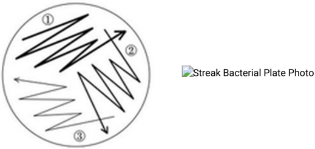

[Download the original PDF](Addgene_%20Protocol%20-%20How%20to%20Streak%20a%20Plate.pdf){.btn .btn-primary download="Addgene_ Protocol - How to Streak a Plate.pdf"}

Source PDF: [Addgene_ Protocol - How to Streak a Plate.pdf](Addgene_%20Protocol%20-%20How%20to%20Streak%20a%20Plate.pdf)

This website uses cookies to ensure you get the best experience. By continuing to use this site, you agree to the use of cookies.

## Streaking and Isolating Bacteria on an LB Agar Plate

## Introduction

If you have a glycerol stock or stab culture of bacteria and need to purify plasmid DNA from it, you will want to isolate an individual clonal population (single colony) of bacteria from this stock. Using a single colony from a freshly streaked agar plate to inoculate a bacterial culture for DNA purication will minimize the chance of having a mixture of plasmids in your puried DNA. This protocol explains how to isolate a single bacterial colony by streaking it onto an LB agar plate.

Last Update: Feb. 28, 2017

## Equipment

- Sterile toothpicks or wire loop
- Bunsen burner (or other small ame source)
- Incubator
- Marker

## Reagents

- LB agar plate (with appropriate antibiotic)
- Bacterial stab

## Procedure

1.  Obtain an LB agar plate with appropriate antibiotic.
2.  Label the bottom of the plate with the plasmid name and the date. It is also a good idea to add the antibiotic resistance and your initials. Labeling within a laboratory setting is important for organization, and it is recommended that you keep a standard labeling system for all your objects/solutions.
3. Sterilize your lab bench by spraying it

down with 70% ethanol and wiping it down with a paper towel. Maintain sterility by working near a ame or bunsen burner.

4. Obtain the approrpriate bacterial stab or glycerol stock.
5. Using a sterile loop, pipette tip or toothpick, touch the bacteria growing within the punctured area of the stab culture or the top of the glycerol stock.

*Pro-Tip* If you use a wire loop you can sterilize it by passing it through a ame, just be sure to allow enough time for the loop to cool before touching it to the bacteria.

Help Center

You may also like...

[Making LB Agar Plates](https://www.addgene.org/protocols/pouring-lb-agar-plates/)

[Bacterial Transformation](https://www.addgene.org/protocols/bacterial-transformation/)

[Recovering Plasmid DNA from Bacterial Culture](https://www.addgene.org/protocols/purify-plasmid-dna/)

6.  Gently spread the bacteria over a section of the plate, as shown in the diagram above, to create streak #1.

*Pro-Tip* Hold your tooth pick at an angle, the way you would hold a pencil, so that you can make a broad stroke. Only touch the surface of the plate, do NOT dig into the agar.

*Pro-Tip* Another very popular technique is to draw in discontinuous lines. Start by streaking a vertical line of bacteria along one edge of the plate. Then streak horizontal lines in another section of the plate, and then diagonal lines in another section of the plate. Make sure that the rst line (and only the rst) in each new section crosses at least one line of the previous section so that it will contain some bacteria.

7. Using a fresh, sterile toothpick, or freshly sterilized loop, drag through streak #1 and spread the bacteria over a second section of the plate, to create streak #2.
8. Using a third sterile pipette tip, toothpick, or sterilized loop, drag through streak #2 and spread the bacteria over the last section of the plate, to create streak #3.
9.  Incubate plate with newly plated bacteria overnight (12-18 hours) at 37 °C.

*Pro-Tip* Some plasmids or bacteria need to be grown at 30 °C instead of 37 °C. This is often true for large unstable plasmids, which sometimes recombine at 37 °C. Be sure to check this before incubating your plate.

10. In the morning, single colonies should be visible. A single colony should look like a white dot growing on the solid medium. This dot is composed of millions of genetically identical bacteria that arose from a single bacterium. If the bacterial growth is too dense and you do not see single colonies, re-streak onto a new agar plate to obtain single colonies.
11.  Once you have single colonies, you can proceed to Recovering Plasmid DNA or use the individual colonies for other experiments.
