[Download the original PDF](NucleoBond%20Xtra%20Plasmid%20DNA%20Purification%20User%20Manual.pdf){.btn .btn-primary download="NucleoBond Xtra Plasmid DNA Purification User Manual.pdf"}

Source PDF: [NucleoBond Xtra Plasmid DNA Purification User Manual.pdf](NucleoBond%20Xtra%20Plasmid%20DNA%20Purification%20User%20Manual.pdf){.btn .btn-primary download="NucleoBond Xtra Plasmid DNA Purification User Manual.pdf"}

## MACHEREY-NAGEL

## User manual

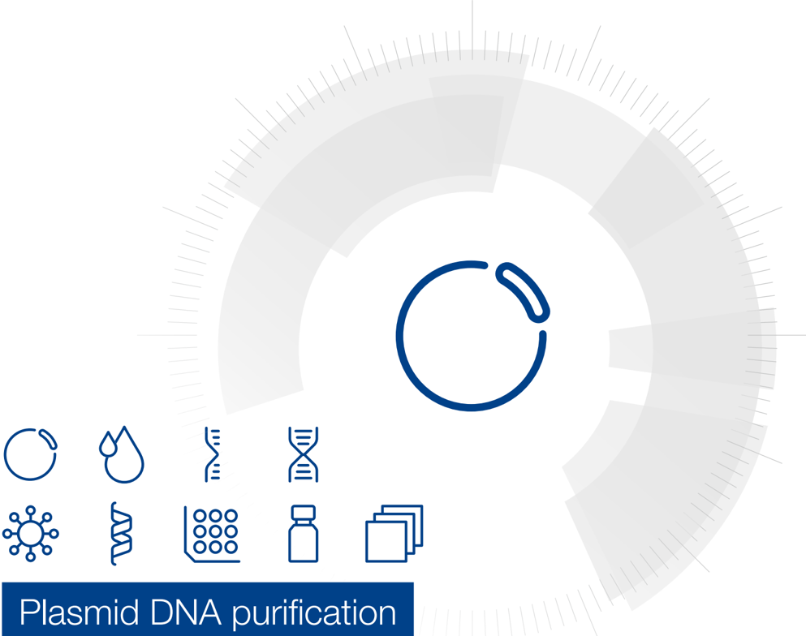

- „ NucleoBond ® Xtra Midi
- „ NucleoBond ® Xtra Maxi
- „ NucleoBond ® Xtra Midi Plus
- „ NucleoBond ® Xtra Maxi Plus

February 2021 / Rev. 16

## Plasmid DNA purification (NucleoBond ®  Xtra Midi / Maxi) Protocol at a glance (Rev. 16)

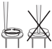

|                                               | Midi                                                                   |                                                          |                                                |                                                        |
|-----------------------------------------------|------------------------------------------------------------------------|----------------------------------------------------------|------------------------------------------------|--------------------------------------------------------|
| 1-3 Cultivation and harvest                   | Maxi 4,500-6,000 x g 4 °C, 15 min                                      |                                                          |                                                |                                                        |
| 4-5 Cell lysis                                | High-copy / low-copy                                                   |                                                          | High-copy / low-copy                           |                                                        |
| (Important: Check Buffer LYS for precipitated | 8 mL / 16 mL 8 mL / 16 mL                                              | Buffer RES Buffer LYS                                    | 12 mL / 24 mL 12 mL / 24 mL                    | Buffer RES Buffer LYS                                  |
| SDS)                                          | RT, 5 min                                                              |                                                          | RT, 5 min                                      |                                                        |
| 6 Equilibration of the column and filter      | 12 mL Buffer EQU                                                       |                                                          |                                                | 25 mL Buffer EQU                                       |
| 7 Neutralization                              | 8 mL / 16 mL Buffer NEU Mix thoroughly until colorless                 |                                                          | 12 mL / 24 mL Buffer NEU Mix thoroughly        |                                                        |
| 8 Clarification and loading of the lysate     | 5 mL Buffer EQU                                                        |                                                          |                                                | until colorless                                        |
|                                               | Invert the tube 3 times Load lysate on NucleoBond ® Xtra Column Filter |                                                          |                                                |                                                        |
| 9 1 st Wash                                   |                                                                        | !                                                        |                                                | 15 mL Buffer EQU !                                     |
| 10 Filter removal                             | Discard NucleoBond ® Xtra Column Filter                                |                                                          |                                                | Discard NucleoBond ® Xtra Column Filter                |
| 11 2 nd Wash                                  | 8 mL Buffer WASH                                                       | !                                                        | 25 mL Buffer WASH                              |                                                        |
| 12 Elution                                    | 5 mL Buffer ELU                                                        |                                                          | 15 mL Buffer ELU                               | !                                                      |
| 13 Precipitation                              | NucleoBond ®                                                           | NucleoBond ®                                             | NucleoBond ®                                   | NucleoBond ®                                           |
|                                               | Xtra Midi 3.5 mL Isopropanol Vortex                                    | Xtra Midi Plus 3.5 mL                                    | Xtra Maxi 10.5 mL                              | Xtra Maxi Plus                                         |
| 14 Washing and drying                         | 4,5-15,000 x g 4 °C, 30 min                                            | Isopropanol Vortex RT, 2 min Load NucleoBond ® Finalizer | Isopropanol Vortex 4,5-15,000 x g 4 °C, 30 min | 10.5 mL Isopropanol Vortex RT, 2 min Load NucleoBond ® |
|                                               | 2 mL 70 % ethanol 4,5-15,000 x g RT, 5 min 10-15 min                   | 2 mL 70 % ethanol                                        | 4 mL 70 % ethanol                              | Finalizer Large 4 mL 70 % ethanol                      |
| 15 Reconstitution                             | Appropriate volume of TE buffer                                        | ≥ 6 x air until dry 200-800 μ L Buffer TRIS              |                                                |                                                        |
|                                               |                                                                        |                                                          | Appropriate                                    | 400-1000 μ L Buffer TRIS                               |
|                                               |                                                                        |                                                          | volume of                                      |                                                        |
|                                               |                                                                        |                                                          | TE buffer                                      |                                                        |
|                                               |                                                                        |                                                          | 15-30                                          |                                                        |
|                                               |                                                                        |                                                          | RT, 5                                          |                                                        |
|                                               |                                                                        |                                                          | 4,5-15,000 x min                               |                                                        |
|                                               |                                                                        |                                                          |                                                | ≥ 6 x air until dry                                    |
|                                               |                                                                        |                                                          | g                                              |                                                        |
|                                               |                                                                        |                                                          | min                                            |                                                        |

## Table of contents

| 1 Components                                    | 1 Components                                            | 1 Components                                                            |   4 |
|-------------------------------------------------|---------------------------------------------------------|-------------------------------------------------------------------------|-----|
|                                                 | 1.1                                                     | Kit contents                                                            |   4 |
|                                                 | 1.2                                                     | Reagents and equipment to be supplied by user                           |   6 |
| 2 Kit specifications                            | 2 Kit specifications                                    | 2 Kit specifications                                                    |   7 |
| 3 About this user manual                        | 3 About this user manual                                | 3 About this user manual                                                |   8 |
| 4 NucleoBond ® Xtra plasmid purification system | 4 NucleoBond ® Xtra plasmid purification system         | 4 NucleoBond ® Xtra plasmid purification system                         |   9 |
|                                                 | 4.1                                                     | Basic principle                                                         |   9 |
|                                                 | 4.2                                                     | NucleoBond ® Xtra anion exchange columns                                |   9 |
|                                                 | 4.3                                                     | Growth of bacterial cultures                                            |  10 |
|                                                 | 4.4                                                     | Chloramphenicol amplification of low copy plasmids                      |  12 |
|                                                 | 4.5                                                     | Culture volume for high copy plasmids                                   |  12 |
|                                                 | 4.6                                                     | Culture volume for low copy plasmids                                    |  13 |
|                                                 | 4.7                                                     | Lysate neutralization and LyseControl                                   |  13 |
|                                                 | 4.8                                                     | Cell lysis                                                              |  14 |
|                                                 | 4.9                                                     | Difficult-to-lyse strains                                               |  14 |
|                                                 | 4.10                                                    | Setup of NucleoBond ® Xtra Columns                                      |  14 |
|                                                 | 4.11 Filtration and loading of the lysate               | 4.11 Filtration and loading of the lysate                               |  15 |
|                                                 | 4.12 Washing of the column                              | 4.12 Washing of the column                                              |  16 |
|                                                 | 4.13 Elution and concentration of plasmid DNA           | 4.13 Elution and concentration of plasmid DNA                           |  16 |
|                                                 | 4.14 Determination of DNA yield and quality             | 4.14 Determination of DNA yield and quality                             |  19 |
|                                                 | 4.15 Convenient stopping points                         | 4.15 Convenient stopping points                                         |  19 |
| 5                                               | Storage conditions and preparation of working solutions | Storage conditions and preparation of working solutions                 |  21 |
| 6                                               | Safety instructions                                     | Safety instructions                                                     |  22 |
| 7                                               | NucleoBond ® Xtra plasmid purification                  | NucleoBond ® Xtra plasmid purification                                  |  24 |
|                                                 | 7.1                                                     | High copy plasmid purification (Midi, Maxi)                             |  24 |
|                                                 | 7.2                                                     | Low copy plasmid purification (Midi, Maxi)                              |  29 |
|                                                 | 7.3                                                     | Concentration of NucleoBond ® Xtra eluates with NucleoBond ® Finalizers |  32 |
| 8                                               | Appendix                                                | Appendix                                                                |  34 |
|                                                 | 8.1                                                     | Troubleshooting                                                         |  34 |
|                                                 | 8.2                                                     | Ordering information                                                    |  42 |
|                                                 | 8.3                                                     | Product use restriction / warranty                                      |  43 |

## 1 Components

## 1.1 Kit contents

|                                                                            | NucleoBond ® Xtra Midi   | NucleoBond ® Xtra Midi   | NucleoBond ® Xtra Midi   | NucleoBond ® Xtra Midi Plus   | NucleoBond ® Xtra Midi Plus   |
|----------------------------------------------------------------------------|--------------------------|--------------------------|--------------------------|-------------------------------|-------------------------------|
| REF                                                                        | 10 preps 740410.10       | 50 preps 740410.50       | 100 preps 740410.100     | 10 preps 740412.10            | 50 preps 740412.50            |
| Buffer RES                                                                 | 100 mL                   | 500 mL                   | 1000 mL                  | 100 mL                        | 500 mL                        |
| Buffer LYS                                                                 | 100 mL                   | 500 mL                   | 1000 mL                  | 100 mL                        | 500 mL                        |
| Buffer NEU                                                                 | 100 mL                   | 500 mL                   | 1000 mL                  | 100 mL                        | 500 mL                        |
| Buffer EQU                                                                 | 200 mL                   | 1000 mL                  | 2 x 1000 mL              | 200 mL                        | 1000 mL                       |
| Buffer WASH                                                                | 100 mL                   | 500 mL                   | 1000 mL                  | 100 mL                        | 500 mL                        |
| Buffer ELU                                                                 | 60 mL                    | 300 mL                   | 600 mL                   | 60 mL                         | 300 mL                        |
| RNase A* (lyophilized)                                                     | 6 mg                     | 30 mg                    | 60 mg                    | 6 mg                          | 30 mg                         |
| NucleoBond ® Xtra Midi Columns incl. NucleoBond ® Xtra Midi Column Filters | 10                       | 50                       | 100                      | 10                            | 50                            |
| NucleoBond ® Finalizers                                                    | -                        | -                        | -                        | 10                            | 50                            |
| 30 mL Syringes                                                             | -                        | -                        | -                        | 10                            | 50                            |
| 1 mL Syringes                                                              | -                        | -                        | -                        | 10                            | 50                            |
| Buffer TRIS                                                                | -                        | -                        | -                        | 13 mL                         | 60 mL                         |
| Plastic Washers (reusable)                                                 | 5                        | 10                       | 10                       | 5                             | 10                            |
| User manual                                                                | 1                        | 1                        | 1                        | 1                             | 1                             |

## 1.1 Kit contents continued

|                                                             | NucleoBond ® Xtra Maxi   | NucleoBond ® Xtra Maxi   | NucleoBond ® Xtra Maxi   | NucleoBond ® Xtra Maxi Plus   | NucleoBond ® Xtra Maxi Plus   |
|-------------------------------------------------------------|--------------------------|--------------------------|--------------------------|-------------------------------|-------------------------------|
| REF                                                         | 10 preps 740414.10       | 50 preps 740414.50       | 100 preps 740414.100     | 10 preps 740416.10            | 50 preps 740416.50            |
| Buffer RES                                                  | 150 mL                   | 750 mL                   | 2 x 750 mL               | 150 mL                        | 750 mL                        |
| Buffer LYS                                                  | 150 mL                   | 750 mL                   | 2 x 750 mL               | 150 mL                        | 750 mL                        |
| Buffer NEU                                                  | 150 mL                   | 750 mL                   | 2 x 750 mL               | 150 mL                        | 750 mL                        |
| Buffer EQU                                                  | 500 mL                   | 2 x 1000 mL 500 mL       | 5 x 1000 mL              | 500 mL                        | 2 x 1000 mL 500 mL            |
| Buffer WASH                                                 | 300 mL                   | 1000 mL 500 mL           | 3 x 1000 mL              | 300 mL                        | 1000 mL 500 mL                |
| Buffer ELU                                                  | 180 mL                   | 900 mL                   | 2 x 900 mL               | 180 mL                        | 900 mL                        |
| RNase A* (lyophilized)                                      | 10 mg                    | 50 mg                    | 2 x 50 mg                | 10 mg                         | 50 mg                         |
| NucleoBond ® Xtra Maxi Columns incl. NucleoBond ® Xtra Maxi | 10                       | 50                       | 100                      | 10                            | 50                            |
| NucleoBond ® Finalizers Large                               | -                        | -                        | -                        | 10                            | 50                            |
| 30 mL Syringes                                              | -                        | -                        | -                        | 10                            | 50                            |
| 1 mL Syringes                                               | -                        | -                        | -                        | 10                            | 50                            |
| Buffer TRIS                                                 | -                        | -                        | -                        | 13 mL                         | 60 mL                         |
| Plastic Washers (reusable)                                  | 5                        | 10                       | 10                       | 5                             | 10                            |
| User manual                                                 | 1                        | 1                        | 1                        | 1                             | 1                             |

## 1.2 Reagents and equipment to be supplied by user

## Reagents

- Isopropanol (room-temperatured)
- 70 % ethanol (room-temperatured)
- Buffer for reconstitution of DNA, for example TE buffer or sterile H 2 O (not necessary for NucleoBond ®  Xtra Midi  /Maxi Plus kits)

## Equipment

Standard microbiological equipment for growing and harvesting bacteria (e. g., inoculating loop, culture tubes and flasks, 37 °C shaking incubator, and centrifuge with rotor and tubes or bottles for harvesting cells)

- Refrigerated centrifuge capable of reaching ≥ 4,500 x g with rotor for the appropriate centrifuge tubes or bottles (not necessary for NucleoBond ®  Xtra Midi  /  Maxi Plus kits)
- Centrifugation tubes or vessels with suitable capacity for the volumes specified in the respective protocol
- NucleoBond ®  Xtra Combi Rack (see ordering information) or equivalent holder

## 2 Kit specifications

- NucleoBond ®  Xtra kits are suitable for ultra fast purification of plasmids, cosmids, and very large constructs (P1 constructs, BACs, PACs) ranging from 3 kbp up to 300 kbp. For preparation of working solutions and storage conditions see section 5.
- NucleoBond ®  Xtra Columns are polypropylene columns containing NucleoBond ®  Xtra Silica Resin packed between two inert filter elements. The columns are available in Midi and Maxi sizes with typical DNA yields of 500 µg and 1000 µg, respectively.
- All NucleoBond ®  Xtra Columns are resistant to organic solvents such as alcohol, chloroform, and phenol and are also suitable for buffers containing denaturing agents like formamide, urea, or common detergents like Triton X-100 or NP-40.
- NucleoBond ®  Xtra Silica Resin can be used over a wide pH range (pH 2.5-8.5), and can remain in contact with buffers for several hours without any change in its chromatographic properties.
- The NucleoBond ®  Xtra Column Filters are specially designed depth filters that fit into the NucleoBond ®  Xtra Columns . The filters are inserted ready-to-use in the NucleoBond ®  Xtra Columns and allow a time-saving simultaneous clearing of bacterial lysate and loading of cleared lysate onto the NucleoBond ®  Xtra Column . Furthermore, the use of the column filters avoids the time-consuming centrifugation step for lysate clearing.
- The NucleoBond ®  Xtra Column Filters allow complete removal of precipitate even with large lysate volumes without clogging and avoid shearing of large DNA constructs, such as PACs or BACs by the gentle depth filter effect.
- The NucleoBond ®  Xtra Midi Plus and NucleoBond ®  Xtra Maxi Plus kits additionally contain the NucleoBond ®  Finalizers and NucleoBond ®  Finalizers Large , respectively. These tools for a fast concentration and desalination of eluates are suitable for most plasmids and cosmids ranging from 2-50 kbp with recovery efficiencies from 40-90 % (depending on elution volume).
- NucleoBond ®  Finalizer is a polypropylene syringe filter containing a special silica membrane. The NucleoBond ®  Finalizer provides a binding capacity of 500 µg, whereas the NucleoBond ®  Finalizer Large can hold up to 2000 µg plasmid DNA.
- Due to the small dead volumes of the NucleoBond ®  Finalizers the plasmid DNA can be eluted with a concentration up to 3 µg/µL (see section 4.13, Table  4 and Table  5 for dependence of concentration on elution volume).
- All NucleoBond ®  Finalizers are resistant to organic solvents such as alcohol, chloroform, and phenol and are free of endotoxins.

## 3 About this user manual

The following section 4 provides you with a detailed description of the NucleoBond ®  Xtra purification system and important information about cell growth, cell lysis, and the subsequent purification steps. Sections 5 and 6 inform you about storage, buffer preparation, and safety instructions.

First-time users are strongly advised to read these chapters thoroughly before using this kit. Experienced users can directly proceed with the purification protocols (section 7) or just use the Protocol-at-a-glance for a quick reference.

Section 7 includes the protocols for high copy and low copy plasmid purification as well as for the concentration of NucleoBond ®  Xtra eluates with the NucleoBond ®  Finalizer . This part of the protocol is also available at www.mn-net.com in French and German.

Each procedural step in the purification protocol is arranged like the following example taken from section 7.1:

## 5 Cell lysis (Buffer LYS)

!

Check Lysis Buffer LYS for precipitated SDS prior to use . If a white precipitate is visible, warm the buffer for several minutes at 30-40 °C until precipitate is dissolved completely. Cool buffer down to room temperature (18-25 °C).

Add Lysis Buffer LYS to the suspension.

Mix gently by inverting the tube 5 times . Do not vortex as this will shear and release contaminating chromosomal DNA from cellular debris into the suspension.

Incubate the mixture at room temperature (18-25 °C) for 5 min .

Warning: Prolonged exposure to alkaline conditions can irreversibly denature and degrade plasmid DNA and liberate contaminating chromosomal DNA into the lysate.

Note: Increase LYS buffer volume proportionally if more than the recommended cell mass is used (see section 4.8 for information on optimal cell lysis).

If you are performing a Midi prep to purify plasmid DNA you will find volumes or incubation times in the white boxes. For Maxi preps please refer to the black boxes.

The name of the buffer, incubation times, repeats or important handling steps are emphasized in bold type within the instruction. Additional notes or optional steps are printed in italic. The exclamation point marks information and hints that are essential for a successful preparation.

In the example shown above you are asked to check the Lysis Buffer LYS prior to use and then to lyse the resuspended cell pellet in 8 mL of Buffer LYS when performing a Midi prep and in 12 mL for a Maxi prep. Follow the handling instructions exactly and note the given hints for protocol alterations.

## 4 NucleoBond ®  Xtra plasmid purification system

## 4.1 Basic principle

The bacterial cells are lysed by an optimized set of newly formulated buffers based on the NaOH  /  SDS lysis method of Birnboim and Doly*.

After  equilibration  of  the NucleoBond ®   Xtra  Column together  with  the  corresponding NucleoBond ®   Xtra  Column  Filter ,  the  entire  lysate  is  loaded  by  gravity  flow  and simultaneously cleared by the specially designed column filter.

Plasmid DNA is bound to the NucleoBond ®  Xtra Silica Resin .

After an efficient washing step the plasmid DNA is eluted, precipitated, and easily dissolved in any suitable buffer (e. g., low-salt buffer or water) for further use.

!

NucleoBond ®   Xtra  Columns  can  not  be  processed  by  vacuum.  Using NucleoBond ®  Xtra Columns on a vacuum manifold might lead to a complete loss of plasmid DNA.

## 4.2 NucleoBond ®  Xtra anion exchange columns

NucleoBond ®   Xtra is  a  patented  silica-based  anion  exchange  resin,  developed  by MACHEREY-NAGEL. It is developed for routine separation of different classes of nucleic acids like oligonucleotides, RNA, and plasmids.

NucleoBond ®   Xtra  Silica  Resin consists of hydrophilic,  macroporous  silica  beads functionalized with MAE (methyl-amino-ethanol). The dense coating of this functional group provides a high overall positive charge density under acidic pH conditions that permits the negatively charged phosphate backbone of plasmid DNA to bind with high specificity (Figure 1).

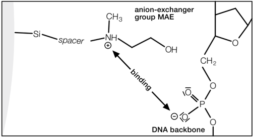

## Figure 1    Ionic interaction of the positively charged methyl-hydroxyethyl-amino group with

the negative phosphate oxygen of the DNA backbone. methyl-hydroxyethyl-amin can be involved in additional hydrogen bonding interactions

In contrast to the widely used DEAE (diethylaminoethyl) group, the hydroxy group of with the DNA.

* Birnboim, H. C. and Doly, J., (1979) Nucl. Acids Res. 7, 1513-1523

All contaminants from proteins to RNA are washed from the column, the positive charge of the resin is neutralized by a pH shift to slightly alkaline conditions, and pure plasmid DNA is eluted in a high-salt elution buffer.

The purified nucleic acid products are suitable for use in the most demanding molecular biology  applications,  including  transfection, in  vitro transcription,  automated  or  manual sequencing, cloning, hybridization, and PCR.

Figure 2    Elution profile of NucleoBond ® Xtra Silica Resin at pH 7.0

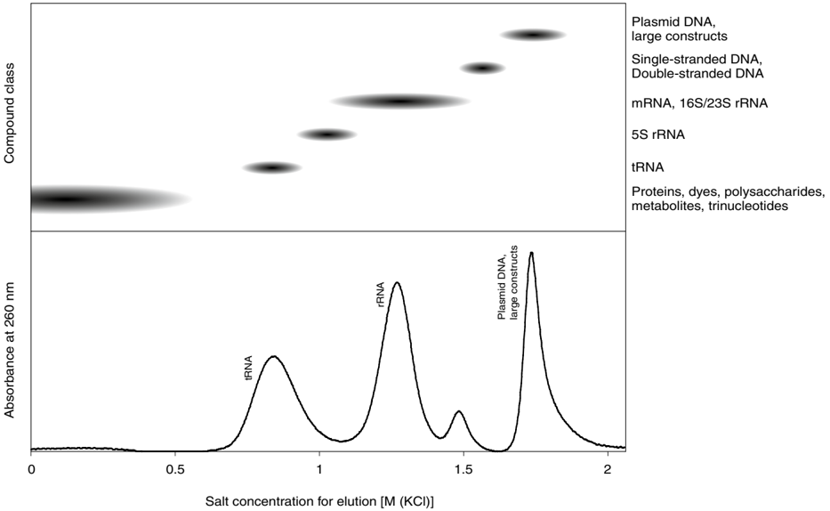

The more interactions a nucleic acid can form between the phosphate backbone and the positively charged resin the later it is eluted with increasing salt concentration. Large nucleic acids carry more charges than short ones, double stranded DNA more than single stranded RNA.

## 4.3 Growth of bacterial cultures

Yield and quality of plasmid DNA highly depend on the type of culture media and antibiotics, the bacterial host strain, the plasmid type, size, and copy number, but also on the growth conditions .

For standard high copy plasmids LB (Luria-Bertani) medium is recommended. The cell culture should be incubated at 37 °C with constant shaking (200-250 rpm) preferably 12-16 h over night. Use flasks of at least three or four times the volume of the culture volume to provide a growth medium saturated with oxygen. Alternatively, rich media like 2  xYT (Yeast  /  Tryptone), TB (Terrific Broth) or CircleGrow can be used. In this case bacteria grow faster, reach the stationary phase much earlier than in LB medium ( ≤ 2 h), and higher cell masses can be reached. However, this does not necessarily yield more plasmid DNA. Overgrowing a culture might lead to a higher percentage of dead or starving cells and the resulting plasmid DNA might be partially degraded or contaminated with chromosomal DNA. To find the optimal culture conditions, the culture medium and incubation times have to be optimized for each host strain  /  plasmid construct combination individually.

Cell  cultures  should  be  grown  under antibiotic  selection at  all  times  to  ensure  plasmid propagation. Without this selective pressure, cells tend to lose a plasmid during cell division. Since bacteria grow much faster without the burden of a high copy plasmid, they take over the culture rapidly and the plasmid yield goes down regardless of the cell mass. Table  1 gives information on concentrations of commonly used antibiotics.

Table  1:  Information about antibiotics according to Maniatis*

| Antibiotic      | Stock solution (concentration)   | Storage   | Working concentration   |
|-----------------|----------------------------------|-----------|-------------------------|
| Ampicillin      | 50 mg/mL in H2O                  | -20 °C    | 20-60 µg/mL             |
| Chloramphenicol | 34 mg/mL in EtOH                 | -20 °C    | 25-170 µg/mL            |
| Kanamycin       | 10 mg/mL in H2O                  | -20 °C    | 10-50 µg/mL             |
| Streptomycin    | 10 mg/mL in H2O                  | -20 °C    | 10-50 µg/mL             |
| Tetracycline    | 5 mg/mL in EtOH                  | -20 °C    | 10-50 µg/mL             |
| Carbenicillin   | 50 mg/mL in H2O                  | -20 °C    | 20-60 µg/mL             |

The E. coli host strain mostly influences the quality of the plasmid DNA. Whereas strains like DH5 α ®  or XL1-Blue usually produce high quality super-coiled plasmid DNA, other strains like for example HB101 with high levels of endonuclease activity might yield lower quality plasmid giving poor results in downstream applications like enzymatic restriction or sequencing.

The type of plasmid , especially the size and the origin of replication (ori) has a crucial influence on DNA yield. In general, the larger the plasmid or the cloned insert is, the lower is the expected DNA yield due to a lower copy number. Even a high copy construct based on a ColE1 ori can behave like a low copy vector in case of a large or unfavorable insert. In addition, the ori itself influences the yield by factor 10-100. Thus plasmids based on for example pBR322 or pACYC, cosmids or BACs are maintained at copy numbers &lt; 20 down to even only 1, whereas vectors based on for example pUC, pBluescript or pGEM can be present in several hundred copies per cell.

Therefore, all the above mentioned factors should be taken into consideration if a particular DNA yield has to be achieved. Culture volume and lysis procedures have to be adjusted accordingly.

*  Maniatis T, Fritsch EF , Sambrook J: Molecular cloning. A laboratory manual, Cold Spring Harbor, Cold Spring, New York 1982.

## 4.4 Chloramphenicol amplification of low copy plasmids

To dramatically increase the low copy number of pMB1  /  colE1 derived plasmids grow the cell  culture to mid or late log phase (OD 600 ≈ 0.6-2.0) under selective conditions with an appropriate  antibiotic. Then  add  170 µg/mL  chloramphenicol  and  continue  incubation  for a  further  8-12  hours.  Chloramphenicol  inhibits  host  protein  synthesis  and  thus  prevents replication of the host chromosome. Plasmid replication, however, is independent of newly synthesized proteins and continues for several hours until up to 2000-3000 copies per cell are accumulated*.

Alternatively, the cell culture can be grown with only partial inhibition of protein synthesis under low chloramphenicol concentrations (10-20 µg/mL) resulting in a 5-10-fold greater yield of plasmid DNA**.

Both methods show the positive side effect of much less genomic DNA per plasmid, but they obviously work only with plasmids that do not carry the chloramphenicol resistance gene. Furthermore, the method is only effective with low copy number plasmids under stringent control (e. g., pBR322). All modern high copy number plasmids (e. g., pUC) are already under relaxed control due to mutations in the plasmid copy number control genes and show no significant additional increase in their copy number.

## 4.5 Culture volume for high copy plasmids

Due to the influence of growth media (TB, CircleGrow, 2 xYT), growth conditions (shaking, temperature), host strain, or type of plasmid insert etc. the final amount of cells in a bacterial culture can vary over a wide range. By rule of thumb, 1 liter of E. coli LB culture with an OD600 of 1 consists of 1 x 10 12 cells and yields about 1.5-1.8 g cell wet weight. Overnight cultures grown in LB medium usually reach an OD 600 of 3-6 under vigorous shaking in flasks. Fermentation cultures even reach an OD 600 of 10 and more. The expected DNA yield for a high copy plasmid is approximately 1 mg per gram cell wet weight.

It is therefore important to adjust the cell mass rather than the culture volume for the best plasmid purification results. But since the cell mass or cell wet weight is tedious to determine it  was  replaced  in  this  manual  by  the  mathematical  product  of  optical  density  at  600 nm (OD600 ) and culture volume (Vol) - two variables that are much easier to measure.

## ODV = OD600 x Vol [  mL  ]

Note that for a correct OD determination the culture samples have to be diluted if OD 600 exceeds 0.5 in order to increase proportionally with cell mass. For a well grown E. coli culture a 1  :  10  dilution  with  fresh  culture  medium  is  recommended. The  measured  OD 600 is  then multiplied with the dilution factor 10 to result in a theoretical OD 600 value. This OD 600 is used in Table  2 to determine the appropriate culture volume. Table  2 shows recommended ODVs and the corresponding pairs of OD 600 and culture volume that can be easily handled using the standard kit protocol lysis buffer volumes. For example, if the OD 600 of your E. coli culture is 6, use 66 mL culture for a Midi prep or 200 mL for a Maxi prep.

*    Maniatis T, Fritsch EF , Sambrook J: Molecular cloning. A laboratory manual, Cold Spring Harbor, Cold Spring, New York 1982.

**    Frenkel  L,  Bremer  H:  Increased  amplification  of  plasmids  pBR322  and  pBR327  by  low  concentrations  of chloramphenicol, DNA (5), 539 - 544, 1986..

| Table 2: Recommended culture volumes for high copy plasmids   | Table 2: Recommended culture volumes for high copy plasmids   | Table 2: Recommended culture volumes for high copy plasmids   | Table 2: Recommended culture volumes for high copy plasmids   | Table 2: Recommended culture volumes for high copy plasmids   | Table 2: Recommended culture volumes for high copy plasmids   | Table 2: Recommended culture volumes for high copy plasmids   | Table 2: Recommended culture volumes for high copy plasmids   |
|---------------------------------------------------------------|---------------------------------------------------------------|---------------------------------------------------------------|---------------------------------------------------------------|---------------------------------------------------------------|---------------------------------------------------------------|---------------------------------------------------------------|---------------------------------------------------------------|
| NucleoBond ® Xtra                                             | Pellet wet weight                                             | Rec. ODV                                                      | OD 600 = 2                                                    | OD 600 = 4                                                    | OD 600 = 6                                                    | OD 600 = 8                                                    | OD 600 = 10                                                   |
| Midi                                                          | 0.75 g                                                        | 400                                                           | 200 mL                                                        | 100 mL                                                        | 66 mL                                                         | 50 mL                                                         | 40 mL                                                         |
| Maxi                                                          | 2.25 g                                                        | 1200                                                          | 600 mL                                                        | 300 mL                                                        | 200 mL                                                        | 150 mL                                                        | 120 mL                                                        |

## 4.6 Culture volume for low copy plasmids

NucleoBond ®   Xtra kits  are  designed  for  isolation  of  high  copy  plasmids  (up  to  several hundred  copies  /  cell)  as  well  as  low  copy  plasmids  (&lt; 20  copies  /  cell).  However,  when purifying low copy plasmids, the cell mass and the lysis buffer volumes should be increased at least by factor 2 to provide enough DNA to utilize the columns' binding capacity. Table  3 shows recommended ODVs and the corresponding pairs of OD600 and culture volume for low copy plasmid cell cultures (for detailed information on calculating ODV = OD 600 x Vol. refer to section 4.5). For example, if the OD 600 of your E. coli culture is 6, use 133 mL culture for a Midi prep or 400 mL for a Maxi prep.

| Table 3: Recommended culture volumes for low copy plasmids   | Table 3: Recommended culture volumes for low copy plasmids   | Table 3: Recommended culture volumes for low copy plasmids   | Table 3: Recommended culture volumes for low copy plasmids   | Table 3: Recommended culture volumes for low copy plasmids   | Table 3: Recommended culture volumes for low copy plasmids   | Table 3: Recommended culture volumes for low copy plasmids   | Table 3: Recommended culture volumes for low copy plasmids   |
|--------------------------------------------------------------|--------------------------------------------------------------|--------------------------------------------------------------|--------------------------------------------------------------|--------------------------------------------------------------|--------------------------------------------------------------|--------------------------------------------------------------|--------------------------------------------------------------|
| NucleoBond ® Xtra                                            | Pellet wet weight                                            | Rec. ODV                                                     | OD 600 = 2                                                   | OD 600 = 4                                                   | OD 600 = 6                                                   | OD 600 = 8                                                   | OD 600 = 10                                                  |
| Midi                                                         | 1.5 g                                                        | 800                                                          | 400 mL                                                       | 200 mL                                                       | 133 mL                                                       | 100 mL                                                       | 80 mL                                                        |
| Maxi                                                         | 4.5 g                                                        | 2400                                                         | 1200 mL                                                      | 600 mL                                                       | 400 mL                                                       | 300 mL                                                       | 240 mL                                                       |

For higher yields, it is advantageous to increase the cell culture and lysis buffer volumes even more (e. g., by factor 3-5). In this case additional lysis buffer can be ordered separately (see ordering information). Furthermore, a centrifuge should be used for lysate clarification instead of the provided NucleoBond ®  Xtra Column Filters since their capacity for precipitate is limited.

Alternatively, chloramphenicol amplification can be considered to increase the plasmid copy number (see section 4.4)

## 4.7 Lysate neutralization and LyseControl

Proper  mixing  of  the  lysate  with  Neutralization  Buffer  NEU  is  of  utmost  importance  for complete precipitation of SDS, protein, and genomic DNA. Incomplete neutralization leads to reduced yields, slower flow-rates, and potential clogging of the NucleoBond ®  Xtra Column Filter. However, released plasmid DNA is very vulnerable at this point and shaking too much or too strongly will damage the DNA.

Therefore, do not vortex or shake but just invert the mixture very gently until  a  fluffy off-white precipitate has formed and the LyseControl has turned colorless throughout the lysate without any traces of blue color.

## 4.8 Cell lysis

The bacterial cell pellet is resuspended in Buffer RES and lysed by a sodium hydroxide/ SDS treatment with Buffer LYS. Proteins, as well as chromosomal and plasmid DNA are denatured under these conditions. RNA is degraded by RNase A. Neutralization Buffer NEU, containing potassium acetate, is then added to the lysate, causing SDS to precipitate as KDS (potassium dodecyl sulfate) and pulling down proteins, chromosomal DNA, and other cellular debris. The potassium acetate buffer also neutralizes the lysate. Plasmid DNA can revert to its native super-coiled structure and remains in solution.

The NucleoBond ®  Xtra buffer volumes (standard protocol) are adjusted to ensure optimal lysis  for  culture  volumes,  appropriate  for  high  copy  plasmids  according  to  section  4.5, Table  2.  Using  too  much  cell  material  leads  to  inefficient  cell  lysis  and  precipitation  and might reduce plasmid yield and purity. Therefore, lysis buffer volumes should be increased when applying larger culture volumes in case of for example low copy vector purification (section 4.6, Table  3).

## By rule of thumb, calculate the necessary lysis buffer volumes for RES, LYS, and NEU as follows:

## Vol. [  mL  ] = Culture Volume [  mL  ] x OD 600 /    50

For  example,  if  200 mL  of  a  low  copy  bacterial  culture  (OD 600 = 4)  is  to  be  lysed,  the appropriate volumes of lysis buffers RES, LYS, and NEU are 16 mL each. If more lysis buffer is needed than is provided with the kit, an additional buffer set including buffers RES, LYS, NEU, and RNase A can be ordered separately (see ordering information).

By using sufficient amounts of lysis buffer, lysis time can be limited to 3-4 minutes and should not exceed 5 minutes. Prolonged exposure to alkaline conditions can irreversibly denature and degrade plasmid DNA and liberate contaminating chromosomal DNA into the lysate.

Please note that the calculated lysis buffer volumes for NucleoBond ®  Xtra Maxi preparations do not match the recommended volumes in the protocol due to the fact that most users start with much less cells than the recommended ODV 1200. Furthermore, the 3 x 12 mL of the protocol can conveniently be used in combination with 50 mL centrifugation tubes. More lysis buffer usually requires to split the sample.

## 4.9 Difficult-to-lyse strains

For plasmid purification of for example Gram-positive bacteria or strains with a more resistant cell  wall  it  might  be  advantageous  to  start  the  preparation  with  a  lysozyme  treatment. Therefore,  resuspend  the  cell  pellet  in  Buffer  RES  containing 2 mg/mL  lysozyme and incubate at 37 °C for 30 minutes .  Proceed then with the lysis procedure according to the NucleoBond ®  Xtra standard protocol.

## 4.10  Setup of NucleoBond ®  Xtra Columns

Ideally  the NucleoBond ®   Xtra Midi or Maxi  Columns are  placed  into  a NucleoBond ® Xtra Combi Rack (see ordering information). They are held either by the collar ring of the cartridges or by the Plastic Washers (reusable) included in the kit to individually adjust the height of each column (see Figure 3). The Plastic Washers (reusable) can also be used to hold the columns on top of suitable collection tubes or flasks. The NucleoBond ®  Xtra Combi Rack can be used in combination with NucleoBond ®  PC 100 , 500 , and 2000 as well. Note that the NucleoBond ®  Xtra Midi Columns can also be placed in the NucleoBond ®  Rack Large (REF 740563).

A

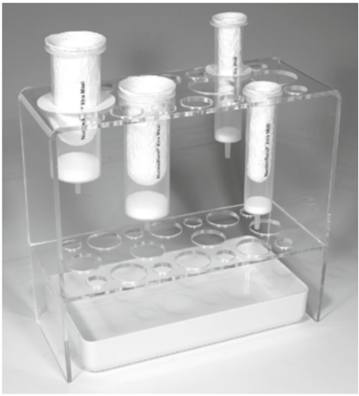

B

Figure 3    Setup of NucleoBond ® Xtra Midi /   Maxi Columns with the NucleoBond ® Xtra Combi Rack

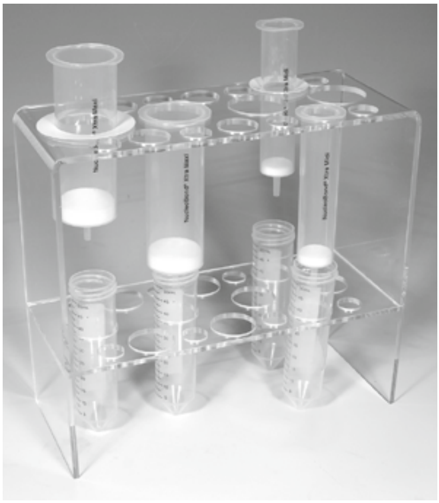

A: Setup for clarification, loading, and first washing step; B: Setup for elution.

## 4.11  Filtration and loading of the lysate

After  the  alkaline  lysis,  the  sample  has  to  be  cleared  from  cell  debris  and  precipitate  to ensure high plasmid purity  and  a  fast  column  flow  rate. This  is  achieved  by  passing  the solution through a NucleoBond ®  Xtra Column Filter which is provided already inserted into the NucleoBond ®  Xtra Column .

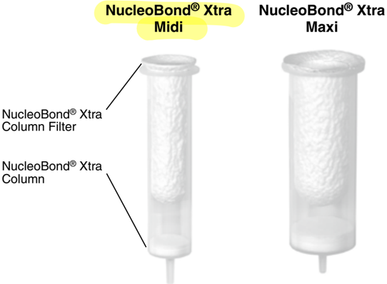

The NucleoBond ®  Xtra Column Filters are designed to eliminate the centrifugation step after  alkaline  lysis. They  are  pre-wet  during  column  equilibration  and  allow  a  time-saving simultaneous clearing of bacterial lysate and loading of the NucleoBond ®  Xtra Column .

Compared  to  lysate  clearing  by  centrifugation  or  syringe  filters  the NucleoBond ®   Xtra Column Filter furthermore avoids shearing of large DNA constructs such as PACs or BACs by the gentle depth filter effect (filtration occurs on the surface of the filter as well as inside the filter  matrix).  Its  special  material  and  design lead to very rapid passage of the lysate through  the  filter  and  even  very  large  lysate  volumes  can  be  applied  without  the  risk  of clogging. This is especially important for low copy plasmid purification for example. However, if  more than the recommended cell mass (see section 4.5, Table  2, section 4.6, Table  3) was lysed, it might be advantageous to use a centrifuge for lysate clarification rather than the provided column filters due to their limited precipitate capacity.

## 4.12  Washing of the column

The high salt concentration of the lysate prevents proteins and RNA from binding to the NucleoBond ®  Xtra Column (see section 4.2, Figure 2). However, to remove all traces of contaminants and to purge the dead volume of the NucleoBond ®  Xtra Column Filters it is important to wash the column and the filter in two subsequent washing steps.

First apply Equilibration Buffer EQU to the funnel rim of the filter to wash all residual lysate out of the filter onto the column. Do not just pour the buffer inside the filter. Then pull out and discard the column filter or remove the filter by turning the column upside down. It is essential to wash the NucleoBond ®  Xtra Column without filter for a second time with Wash Buffer WASH . This ensures highest yields with best achievable purity.

## 4.13  Elution and concentration of plasmid DNA

Elution is carried out under high-salt conditions and by a shift of pH from 7.0 to 9.0. Under these alkaline conditions the positive charge of the anion exchange resin is neutralized and plasmid DNA is released. For any downstream application it is necessary to precipitate the DNA and to remove salt and all traces of alcohol since they disturb or inhibit enzymatic activity needed for restriction or sequencing reactions.

All NucleoBond ®  Xtra eluates already contain enough salt for an isopropanol precipitation of DNA. Therefore the precipitation is started by directly adding 0.7 volumes of isopropanol. To prevent co-precipitation of salt, use room-temperature (18-25°C) isopropanol only and do not let the plasmid DNA solution drop into a vial with isopropanol but add isopropanol to the final eluate and mix immediately .

Afterwards  either  follow  the  centrifugation  protocol  given  after  the NucleoBond ®   Xtra purification  protocol  or  follow  the  support  protocol  for  the NucleoBond ®   Finalizers in section  7.3  to  eliminate  the  time-consuming  centrifugation  steps  for  precipitation  (use  of NucleoBond ®  Finalizers is only recommended for vector sizes smaller than 50 kbp).

The NucleoBond ®   Finalizers are  designed  for  quick  concentration  and  desalination  of plasmid  and  cosmid  DNA  eluates  that  are  obtained  by  anion  exchange  chromatography based DNA purification. The sample is precipitated with isopropanol as mentioned above and loaded onto a special silica membrane by means of a syringe. After an ethanolic washing step the membrane is dried by pressing air through the filter. Elution of pure DNA is carried out with slightly alkaline low salt buffers like Buffer TRIS (5 mM Tris/HCl, pH 8.5, provided with all NucleoBond ®  Xtra Plus kits) or TE buffer (10 mM Tris/HCl, pH 7.5, 1 mM EDTA). Do not use pure water unless pH is definitely higher than 7.0

For  maximum  yield  it  is  recommended  to  perform  the  elution  step  twice .  The  first elution step is done using fresh buffer whereas in the second elution step the eluate from the first elution is reapplied on the NucleoBond ®  Finalizer to allow complete solubilization of the plasmid.

DNA recovery highly depends on the used elution buffer volume . Large volumes result in a high recovery of up to 90 % but in a lower DNA concentration. Small elution volumes on the other hand increase the concentration but at the cost of DNA yield.

If  a  small  volume  is  chosen,  make  sure  to  recover  as  much  eluate  as  possible  from  the syringe and NucleoBond ®  Finalizer by  pressing air through the NucleoBond ®  Finalizer several times after elution and collecting every single droplet to minimize the dead volume.

Figure 4 and Figure 5 illustrate exemplarily how DNA recovery and final DNA concentration depend  on  the  buffer  volume  which  is  used  for  elution  of  DNA  from  the NucleoBond ® Finalizer and NucleoBond ®  Finalizer Large , respectively.

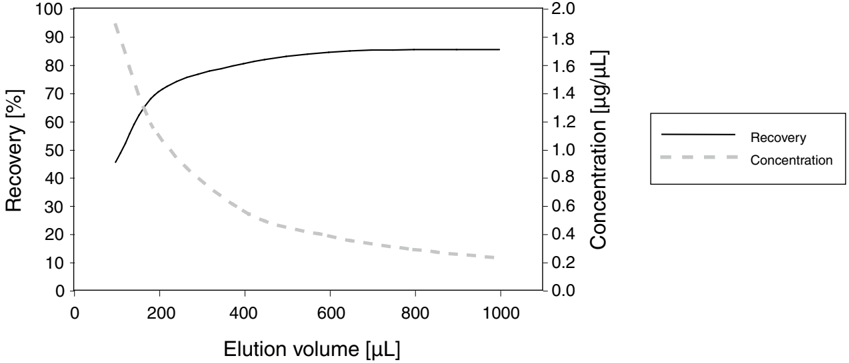

- Figure 4    Final DNA recovery and concentration after NucleoBond ® Finalizer application A NucleoBond ®  Xtra Midi eluate containing 250 µg plasmid DNA (8 kbp) was loaded onto a NucleoBond ®  Finalizer and eluted two-fold with increasing volumes of TE buffer.

The NucleoBond ®  Finalizer is designed to hold a maximum of 500 µg DNA and is therefore ideally  suited  to  be  used  in  combination  with NucleoBond ®   Xtra Midi .  Maximum  DNA recovery can be achieved by using &gt; 600 µL of elution buffer. For a higher concentration experienced users can lower the elution buffer volume to 400-200 µL.

Table  4 gives an overview about recovery and concentration of different amounts of plasmid DNA  loaded  onto  a NucleoBond ®   Finalizer .  DNA  was  eluted  two-fold  with  increasing volumes of TE. Please refer to this tables to select an elution buffer volume that meets your needs best.

| Table 4: DNA recovery and concentration for the NucleoBond ® Finalizer   | Table 4: DNA recovery and concentration for the NucleoBond ® Finalizer   | Table 4: DNA recovery and concentration for the NucleoBond ® Finalizer   | Table 4: DNA recovery and concentration for the NucleoBond ® Finalizer   | Table 4: DNA recovery and concentration for the NucleoBond ® Finalizer   | Table 4: DNA recovery and concentration for the NucleoBond ® Finalizer   | Table 4: DNA recovery and concentration for the NucleoBond ® Finalizer   |
|--------------------------------------------------------------------------|--------------------------------------------------------------------------|--------------------------------------------------------------------------|--------------------------------------------------------------------------|--------------------------------------------------------------------------|--------------------------------------------------------------------------|--------------------------------------------------------------------------|
|                                                                          | Elution volume                                                           | Elution volume                                                           | Elution volume                                                           | Elution volume                                                           | Elution volume                                                           | Elution volume                                                           |
|                                                                          | 100 µL                                                                   | 200 µL                                                                   | 400 µL                                                                   | 600 µL                                                                   | 800 µL                                                                   | 1000 µL                                                                  |
| 500 µg                                                                   | 35 %                                                                     | 60 %                                                                     | 70 %                                                                     | 75 %                                                                     | 75 %                                                                     | 75 %                                                                     |
| 500 µg                                                                   | 2.5                                                                      | µg/µL                                                                    | 2.3 µg/µL 1.2 µg/µL                                                      | 0.8 µg/µL                                                                | 0.6 µg/µL                                                                | 0.5 µg/µL                                                                |
| Loaded DNA                                                               | 250 µg                                                                   | 40 %                                                                     | 65 % 75 %                                                                | 80 %                                                                     | 80 %                                                                     | 80 %                                                                     |
| Loaded DNA                                                               | 1.9                                                                      | µg/µL                                                                    | 1.1 µg/µL 0.6 µg/µL                                                      | 0.4 µg/µL                                                                | 0.3 µg/µL                                                                | 0.2 µg/µL                                                                |
| Loaded DNA                                                               | 100 µg                                                                   | 45 %                                                                     | 70 % 80 %                                                                | 85 %                                                                     | 85 %                                                                     | 85 %                                                                     |
| Loaded DNA                                                               | 0.7                                                                      | µg/µL                                                                    | 0.4 µg/µL 0.2 µg/µL                                                      | 0.1 µg/µL                                                                | 0.1 µg/µL                                                                | 0.1 µg/µL                                                                |
| Loaded DNA                                                               | 50 µg                                                                    | 30 %                                                                     | 75 % 85 %                                                                | 90 %                                                                     | 90 %                                                                     | 90 %                                                                     |
| Loaded DNA                                                               | 0.3                                                                      | µg/µL                                                                    | 0.2 µg/µL 0.1 µg/µL                                                      | 0.1 µg/µL                                                                | 0.1 µg/µL                                                                | < 0.1 µg/µL                                                              |

DNA recovery

DNA concentration

Figure 5    Final DNA recovery and concentration after NucleoBond ® Finalizer Large application

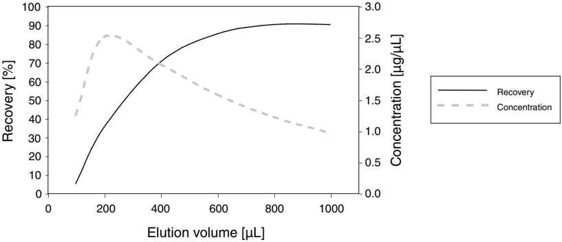

A NucleoBond ®  Xtra Maxi eluate containing 1000 µg plasmid DNA (8 kbp) was loaded onto a NucleoBond ®  Finalizer Large and eluted two-fold with increasing volumes of TE buffer.

NucleoBond ®  Xtra Maxi  eluates  are  easily  concentrated  with  a NucleoBond ®  Finalizer Large which is able to bind up to 2000 µg plasmid DNA. Maximum DNA recovery can be achieved by using &gt; 800 µL of elution buffer. For a higher concentration experienced users can lower the elution buffer volume to 600-400 µL.

Table  5 gives an overview about recovery and concentration of different amounts of plasmid DNA loaded onto a NucleoBond ®  Finalizer Large . DNA was eluted two-fold with increasing volumes of TE. Please refer to this tables to select an elution buffer volume that meets your needs best.

| Table 5: DNA recovery and concentration for the NucleoBond ® Finalizer Large   | Table 5: DNA recovery and concentration for the NucleoBond ® Finalizer Large   | Table 5: DNA recovery and concentration for the NucleoBond ® Finalizer Large   | Table 5: DNA recovery and concentration for the NucleoBond ® Finalizer Large   | Table 5: DNA recovery and concentration for the NucleoBond ® Finalizer Large   | Table 5: DNA recovery and concentration for the NucleoBond ® Finalizer Large   | Table 5: DNA recovery and concentration for the NucleoBond ® Finalizer Large   |
|--------------------------------------------------------------------------------|--------------------------------------------------------------------------------|--------------------------------------------------------------------------------|--------------------------------------------------------------------------------|--------------------------------------------------------------------------------|--------------------------------------------------------------------------------|--------------------------------------------------------------------------------|
|                                                                                |                                                                                | Elution volume                                                                 | Elution volume                                                                 | Elution volume                                                                 | Elution volume                                                                 | Elution volume                                                                 |
|                                                                                | 100 µL                                                                         | 200 µL                                                                         | 400 µL                                                                         | 600 µL                                                                         | 800 µL                                                                         | 1000 µL                                                                        |
| DNA 1500 µg                                                                    |                                                                                | 5 %                                                                            | 30 %                                                                           | 65 % 80 %                                                                      | 85 %                                                                           | 90 %                                                                           |
| DNA 1500 µg                                                                    |                                                                                | 1.9 µg/µL                                                                      | 3.2 µg/µL                                                                      | 2.9 µg/µL 2.2 µg/µL                                                            | 1.7 µg/µL                                                                      | 1.4 µg/µL                                                                      |
|                                                                                | 1000 µg                                                                        | 5 %                                                                            | 35 % 70                                                                        | % 85 %                                                                         | 90 %                                                                           | 90 %                                                                           |
|                                                                                |                                                                                | 1.3 µg/µL                                                                      | 2.5 µg/µL 2.1                                                                  | µg/µL 1.6 µg/µL                                                                | 1.2 µg/µL                                                                      | 1.0 µg/µL                                                                      |
|                                                                                | 500 µg                                                                         | 10 %                                                                           | 40 % 70                                                                        | % 85 %                                                                         | 90 %                                                                           | 90 %                                                                           |
|                                                                                |                                                                                | 1.3 µg/µL                                                                      | 1.4 µg/µL 1.0                                                                  | µg/µL 0.8 µg/µL                                                                | 0.6 µg/µL                                                                      | 0.5 µg/µL                                                                      |
|                                                                                | 100 µg                                                                         | 15 %                                                                           | 45 %                                                                           | 70 % 80 %                                                                      | 85 %                                                                           | 90 %                                                                           |
|                                                                                |                                                                                | 0.4 µg/µL                                                                      | 0.3 µg/µL                                                                      | 0.2 µg/µL 0.1 µg/µL                                                            | 0.1 µg/µL                                                                      | 0.1 µg/µL                                                                      |

DNA recovery

DNA concentration

## 4.14  Determination of DNA yield and quality

The yield of a plasmid preparation should be estimated prior to and after the isopropanol precipitation in order to calculate the recovery after precipitation and to find the best volume to  dissolve  the  pellet  in.  Simply  use  either NucleoBond ®  Xtra Elution  Buffer  ELU  or  the respective low-salt buffer as a blank in your photometric measurement.

The nucleic acid concentration of the sample can be calculated from its UV absorbance at 260 nm where an absorbance of 1 (1 cm path length) is equivalent to 50 µg DNA  /  mL. Note that the absolute measured absorbance should lie between 0.1 and 0.7 in order to be in the linear part of Lambert-Beer's law. Dilute your sample in the respective buffer if necessary.

The plasmid purity can be checked by UV spectroscopy as well. A ratio of A 260 /    A280 between 1.80-1.90 and A260 /    A230 around 2.0 indicates pure plasmid DNA. An A 260 /    A280 ratio above 2.0 is a sign for too much RNA in your preparation, an A 260 /    A280 ratio below 1.8 indicates protein contamination.

Plasmid quality can be checked by running the precipitated samples on a 1 % agarose gel. This will give information on conformation and structural integrity of isolated plasmid DNA, i.  e. it shows whether the sample is predominantly present in the favorable super-coiled form (ccc, usually the fastest band), as an open circle (oc), or even in a linear form (see section 8.1, Figure 6).

## 4.15  Convenient stopping points

Cell pellets can easily be stored for several months at -20 °C.

Cleared lysates can be kept on ice or at 4 °C for several days.

For  optimal  performance  the  column  purification  should  not  be  interrupted.  However,  the columns can be left unattended for several hours since the columns do not run dry. This might cause only small losses in DNA yield.

The eluate can be stored for several days at 4 °C. Note that the eluate should be warmed up to room temperature before precipitating the DNA to avoid co-precipitation of salt.

## 5 Storage conditions and preparation of working solutions

All kit components can be stored at room temperature (18-25 °C) and are stable for at least two years.

Storage  of  Buffer  L YS  below  20 °C  may  cause  precipitation  of  SDS.  If  salt  precipitate  is observed, incubate buffer at 30-40 °C for several minutes and mix well until all precipitate is redissolved completely. Cool down to room temperature before use.

Before the first use of the NucleoBond ®  Xtra Midi /   Maxi kit, prepare the following:

- Dissolve the lyophilized RNase A* by the addition of 1 mL of Buffer RES. Wearing gloves is recommended. Pipette up and down until the RNase A is dissolved completely. Transfer the RNase A solution back to the bottle containing Buffer RES and shake well. Note the date of RNase A addition. The final concentration of RNase A is 60 µg/mL Buffer RES. Store Buffer RES with RNase A at 4 °C. The solution will be stable at this temperature for at least 6 months.

*  REF 740414.100 contains 2 x 50 mg of RNase A. Make sure to dissolve RNase A of both vials, each in 1 mL of Buffer RES, and transfer the solution back into the bottle containing Buffer RES.

## 6 Safety instructions

The following components of the NucleoBond ®  Xtra kit contain hazardous contents.

Wear gloves and goggles and follow the safety instructions given in this section.

## GHS classification

Only harmful features need not be labeled with H and P phrases up to 125 mL or 125 g. Mindergefährliche Eigenschaften müssen bis 125 mL oder 125 g nicht mit H- und P-Sätzen gekennzeichnet werden.

| Component Inhalt   | Hazard contents Gefahrstoff                                          | GHS symbol GHS Symbol   | Hazard phrases H-Sätze   | Precaution phrases P-Sätze   |
|--------------------|----------------------------------------------------------------------|-------------------------|--------------------------|------------------------------|
| LYS                | Sodium hydroxide solution 0.5-1.0 % Natriumhydroxid-Lösung 0,5-1,0 % | WARNING ACHTUNG         | 315, 319                 | 280sh                        |
| WASH               | Ethanol 5-20 % Ethanol 5-20 %                                        | WARNING ACHTUNG         | 226                      | 210                          |
| ELU                | 2-propanol 10-15 % 2-Propanol 10-15 %                                | WARNING ACHTUNG         | 226, 319                 | 210, 280sh                   |
| RNase A            | RNase A 90-100 % RNase A 90-100 %                                    | DANGER GEFAHR           | 334                      | 261sh, 342+311               |

The symbol shown on labels refers to further safety information in this section. Das auf Etiketten dargestellte Symbol weist auf weitere Sicherheitsinformationen dieses Kapitels hin.

## Hazard phrases

| H 226   | Flammable liquid and vapour. Flüssigkeit und Dampf entzündbar.                                                                                                 |
|---------|----------------------------------------------------------------------------------------------------------------------------------------------------------------|
| H 315   | Causes skin irritation. Verursacht Hautreizungen.                                                                                                              |
| H 319   | Causes serious eye irritation. Verursacht schwere Augenreizung.                                                                                                |
| H 334   | May cause allergy or asthma symptoms or breathing difficulties if inhaled. Kann bei Einatmen Allergie, asthmaartige Symptome oder Atembeschwerden verursachen. |

## Precaution phrases

| P 210     | Keep away from heat, hot surfaces, sparks, open flames and other ignition sources. No smoking. Von Hitze, heißen Oberflächen, Funken, offenen Flammen sowie anderen Zündquellenarten fernhalten. Nicht rauchen.   |
|-----------|-------------------------------------------------------------------------------------------------------------------------------------------------------------------------------------------------------------------|
| P 261sh   | Avoid breathing dust/vapors. Einatmen von Staub/Dampf vermeiden.                                                                                                                                                  |
| P 280sh   | Wear protective gloves / eye protection. Schutzhandschuhe / Augenschutz tragen.                                                                                                                                   |
| P 342+311 | If experiencing respiratory symptoms: Call a POISON CENTER / doctor. Bei Symptomen der Atemwege: GIFTINFORMATIONSZENTRUM / Arzt anrufen.                                                                          |

## For further information please see Material Safety Data Sheets (www.mn-net.com).

Weiterführende Informationen finden Sie in den Sicherheitsdatenblättern (www.mn-net.com).

## 7 NucleoBond ®  Xtra plasmid purification

The following section includes the protocols for high copy and low copy plasmid purification as well as for concentration of NucleoBond ®  Xtra eluates with the NucleoBond ®  Finalizers.

## 7.1 High copy plasmid purification (Midi, Maxi)

Midi Maxi

## 1 Preparation of starter culture only if starting from plates

Inoculate a 3-5 mL starter culture of LB medium with a single colony picked from a  freshly  streaked  agar  plate.  Make  sure  that  plate  and  liquid  culture  contain  the appropriate selective antibiotic to guarantee plasmid propagation (see section 4.3 for more information). Shake at 37 °C and ~ 300 rpm for ~ 8 h.

- 2 Preparation of large overnight culture start from here with glycerol stock

100 mL

300 mL

Inoculate an overnight culture by diluting the starter culture 1  /  1000 into the given volumes of LB medium also containing the appropriate selective antibiotic. Grow the culture overnight at 37 °C and ~ 300 rpm for 12-16 h. 11000 Trbenicillinomglmlosedong my

lobecarbenicillin

3 Harvest of bacterial cells Measure the cell culture OD 600 and determine the recommended culture volume. Just check bacteria have grown ME Dion Is cloudy

Pellet the cells by centrifugation at 4,500-6,000 x g for ≥ 10 min at 4 °C and discard the supernatant completely.

Note: Optimal lysis conditions are achieved by a unique ratio of lysis buffer RES, LYS, and NEU to the cell mass. See section 4.5 for recommendations concerning the optimal pelleted culture volume for cells containing high copy plasmids and section 4.6 for recommendations concerning cells with low copy plasmids. Read section 4.5 carefully as excess cell input will result in reduced yield. The recommended culture volumes below are calculated for a final OD 600 of around 4.

## 4 Resuspension (Buffer RES) move to one tube

Resuspend the cell pellet completely in Resuspension Buffer RES + RNase A by pipetting the cells up and down or vortexing the cells.

For an efficient cell lysis it is important that no clumps remain in the suspension.

Note: Increase RES buffer volume proportionally if more than the recommended cell mass is used (see section 4.8 for information on optimal cell lysis and section 4.9 regarding difficult-to-lyse strains).

TOTAL

## Midi

## 5 Cell lysis (Buffer LYS)

!

Check Lysis Buffer LYS for precipitated SDS prior to use . If a white precipitate is visible, warm the buffer for several minutes at 30-40 °C until precipitate is dissolved completely. Cool buffer down to room temperature (18-25 °C).

Add Lysis Buffer LYS to the suspension.

Mix gently by inverting the tube 5 times . Do not vortex as this will shear and release contaminating chromosomal DNA from cellular debris into the suspension.

Incubate the mixture at room temperature (18-25 °C) for 5 min .

Warning: Prolonged exposure to alkaline conditions can irreversibly denature and degrade plasmid DNA and liberate contaminating chromosomal DNA into the lysate.

Note: Increase LYS buffer volume proportionally if more than the recommended cell mass is used (see section 4.8 for information on optimal cell lysis).

8 mL

## 6 Equilibration (Buffer EQU)

Equilibrate a NucleoBond ® Xtra Column together with the inserted column  filter  with Equilibration  Buffer EQU .

Apply  the  buffer  onto  the  rim  of  the column filter as shown in the picture and make sure to wet the entire filter.

Allow  the  column  to  empty  by  gravity flow. The column does not run dry.

12 mL

12 mL

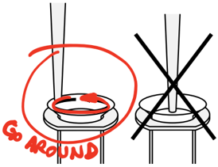

25 mL

Maxi BYNow

## Midi

## 7 Neutralization (Buffer NEU)

!

Add Neutralization Buffer NEU to the suspension and immediately mix the lysate gently by inverting the tube until blue samples turns colorless completely! Do not vortex .

The flask  or  tube  used  for  this  step  should  not  be  filled  more  than  two  thirds  to allow  homogeneous  mixing.  Make  sure  to  neutralize  completely  to  precipitate  all the  protein  and  chromosomal  DNA. The  lysate  should  turn  from  a  slimy,  viscous consistency to a low viscosity, homogeneous suspension of an off-white flocculate. In addition, LyseControl should turn completely colorless without any traces of blue.

Immediately proceed with step 8. An incubation of the lysate is not necessary .

Note: Increase NEU buffer volume proportionally if more than the recommended cell mass is used (see section 4.8 for information on optimal cell lysis).

## 8 Clarification and loading

!

Make sure to have a homogeneous suspension of the precipitate by inverting the tube 3 times directly before applying the lysate to the equilibrated NucleoBond ®  Xtra Column Filter to avoid clogging of the filter.

The lysate is simultaneously cleared and loaded onto the column. Refill the filter if more lysate has to be loaded than the filter is able to hold. Allow the column to empty by gravity flow.

Alternative : The precipitate can be removed by centrifugation at ≥ 5,000 x g for at least 10 min, for example if more than double the recommended cell mass was used. If the supernatant still contains suspended matter transfer it to a new tube and repeat the centrifugation, preferably at higher speed, or apply the lysate to the equilibrated NucleoBond ®  Xtra Column Filter.

This clarification step is extremely important since residual precipitate may clog the NucleoBond ®   Xtra  Column. To  load  the  column  you  can  either  apply  the  cleared lysate  to  the  equilibrated  filter  or  remove  the  unused  filter  beforehand.  Allow  the column to empty by gravity flow.

Note: You may want to save all or part of the flow-through for analysis (see section 8.1).

Maxi

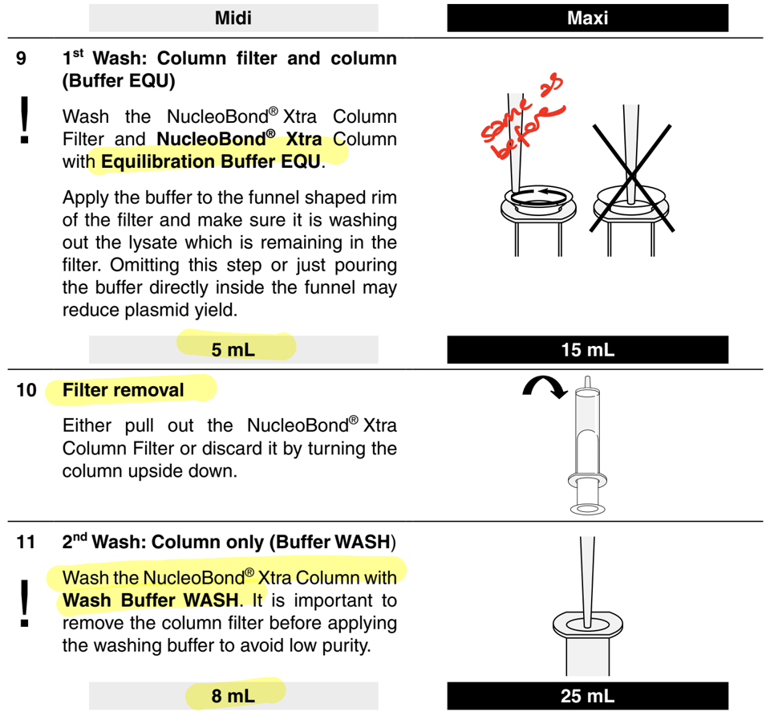

## 12 Elution (Buffer ELU) change collection tube to a new one

Elute the plasmid DNA with Elution Buffer ELU .  Collect the eluate in a 15 mL or 50 mL centrifuge tube (not provided).

Note: Preheating Buffer ELU to 50 °C prior to elution may improve yields for large constructs such as BACs.

Optional: Determine plasmid yield by UV spectrophotometry in order to adjust desired concentration of DNA in step 15 and calculate the recovery after precipitation.

5 mL

## NucleoBond ®  Xtra Midi /   Maxi Plus:

Proceed with step 13 for the centrifugation protocol after isopropanol precipitation or continue with section 7.3 for  plasmid concentration and desalting by using the NucleoBond ®   Finalizer  (NucleoBond ®   Xtra  Midi  Plus)  or  NucleoBond ®   Finalizer Large (NucleoBond ®  Xtra Maxi Plus).

15 mL

!

## 13 Precipitation

Add room-temperature isopropanol

Vortex thoroughly!

Maxi

to precipitate the eluted plasmid DNA.

where is

Centrifuge  at ≥ 4,500 x g for ≥ 15 min at ≤ room  temperature ,  preferably  at 15,000 x g for 30 min at 4 °C . Carefully discard the supernatant.

it under funneled

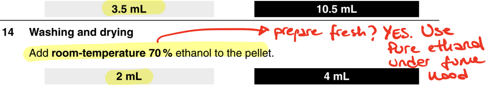

BEd Centrifuge at ≥ 4,500 x g , preferably ≥ 15,000 x g for 5 min at room temperature (18-25 °C).

Carefully remove ethanol completely from the tube with a pipette tip. Allow the pellet to dry at room temperature (18-25 °C).

Note: Plasmid DNA might be harder to dissolve when over-dried.

10-15 min

## 15 Reconstitution

Dissolve  the  DNA  pellet  in  an  appropriate  volume  of  buffer  TE  or  sterile  H 2 O. Depending on the type of centrifugation tube, dissolve under gentle pipetting up and down or constant spinning in a sufficient amount of buffer for 10-60 min (3D-shaker).

Determine  plasmid  yield  by  UV  spectrophotometry.  Confirm  plasmid  integrity  by agarose gel electrophoresis (see section 4.14).

- usually dilute first in 50 to be
- measure at nano drop
- bring to tooo ng lil
- freeze at 20 C

15-30 min

Midi

## 7.2 Low copy plasmid purification (Midi, Maxi)

The lysis buffer volumes provided in the kit are adjusted for high copy plasmid purification. Therefore, additional buffer has to be ordered separately for routine purification of low copy plasmids (see ordering information).

Midi

## 1 Preparation of starter culture

Inoculate a 3-5 mL starter culture of LB medium with a single colony picked from a  freshly  streaked  agar  plate.  Make  sure  that  plate  and  liquid  culture  contain  the appropriate selective antibiotic to guarantee plasmid propagation (see section 4.3 for more information). Shake at 37 °C and ~ 300 rpm for ~ 8 h.

## 2 Preparation of large overnight culture

!

Note: To utilize the entire large binding capacity of the NucleoBond ®  Xtra Columns it is important to provide enough plasmid DNA. For the standard low copy procedure the culture volumes were doubled compared to the high copy vector protocol. However, due to a plasmid content that is 10-100 times lower, this might be insufficient. If you need large amounts of low copy plasmids, further increase the culture volume by factor 3-5. The recommended culture volumes below are calculated for a final OD600 of around 4 (see section 4.6 for more information) .

Inoculate an overnight culture by diluting the starter culture 1  /  1000 into the given volumes of LB medium also containing the appropriate selective antibiotic. Grow the culture overnight at 37 °C and ~ 300 rpm for 12-16 h.

200 mL

## 3 Harvest of bacterial cells

Measure the cell culture OD 600 and determine the recommended culture volume.

Pellet the cells by centrifugation at 4,500-6,000 x g for ≥ 10 min at 4 °C and dis-card the supernatant completely.

Note: It is of course possible to use larger culture volumes, for example if a large amount of low copy plasmid is needed (see section 4.6 for more information). In this case increase RES, LYS and NEU buffer volumes proportionally in steps 4, 5 and 7. Additional lysis buffer volumes might have to be ordered separately (see ordering  information  for  NucleoBond ® Xtra  Buffer  Set  I,  section  8.2) .  Use  a centrifuge for the lysate clarification rather than the NucleoBond ®  Xtra Column Filters.

600 mL

Maxi

## Midi

## 4 Resuspension (Buffer RES)

Resuspend the cell pellet completely in Resuspension Buffer RES + RNase A by pipetting the cells up and down or vortexing the cells.

For an efficient cell lysis it is important that no clumps remain in the suspension.

Note: Increase RES buffer volume proportionally if more than the recommended cell mass is used (see section 4.8 for information on optimal cell lysis and section 4.9 regarding difficult-to-lyse strains).

16 mL

## 5 Cell lysis (Buffer LYS)

!

Check Lysis Buffer LYS for precipitated SDS prior to use . If a white precipitate is visible, warm the buffer for several minutes at 30-40 °C until precipitate is dissolved completely. Cool buffer down to room temperature (18-25 °C).

Add Lysis Buffer LYS to the suspension.

Note: Increase LYS buffer volume proportionally if more than the recommended cell mass is used (see section 4.8 for information on optimal cell lysis).

16 mL

Mix gently by inverting the tube 5 times . Do not vortex as this will shear and release contaminating chromosomal DNA from cellular debris into the suspension.

Incubate the mixture at room temperature (18-25 °C) for 5 min .

Warning: Prolonged exposure to alkaline conditions can irreversibly denature and degrade plasmid DNA and liberate contaminating chromosomal DNA into the lysate.

## 6 Equilibration (Buffer EQU)

Equilibrate a NucleoBond ®  Xtra Column together  with  the  inserted  column  filter with Equilibration Buffer EQU .

Apply  the  buffer  onto  the  rim  of  the column filter as shown in the picture and make sure to wet the entire filter.

Allow  the  column  to  empty  by  gravity flow. The column does not run dry.

12 mL

24 mL

Maxi

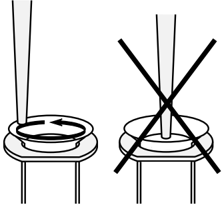

25 mL

| Midi   | Maxi   |
|--------|--------|

## 7 Neutralization (Buffer NEU)

Add Neutralization Buffer NEU to the suspension and immediately mix the lysate gently by inverting the tube until blue samples turns colorless completely! Do not vortex.

!

The flask  or  tube  used  for  this  step  should  not  be  filled  more  than  two  thirds  to allow  homogeneous  mixing.  Make  sure  to  neutralize  completely  to  precipitate  all the  protein  and  chromosomal  DNA. The  lysate  should  turn  from  a  slimy,  viscous consistency to a low viscosity, homogeneous suspension of an off-white flocculate. In addition, LyseControl should turn completely colorless without any traces of blue.

Note: Increase NEU buffer volume proportionally if more than the recommended cell mass is used (see section 4.8 for information on optimal cell lysis).

| 16 mL   | 24 mL   |
|---------|---------|

Proceed with step 8 of the high copy plasmid purification protocol (section 7.1) if not significantly more than the recommended lysis buffer volumes were used.

Otherwise it might be advantageous to centrifuge the precipitate first in order to avoid clogging of the NucleoBond ® Xtra Column Filters.

## 7.3 Concentration of NucleoBond ®  Xtra eluates with NucleoBond ®  Finalizers

Note: Use of the NucleoBond ®  Finalizers is  only  recommended for vector sizes smaller than 50 kbp.

Midi - NucleoBond ® Finalizer

## 1 Precipitation

Note: Check DNA concentration photometrically before precipitation. This helps to choose the best buffer volume in step 5 and allows calculation of the recovery after concentration.

Add 0.7  volumes of room-temperature isopropanol (not  supplied  with  the  kit). Vortex well and let the mixture sit for 2 minutes .

(E.g.,  for  5 mL  NucleoBond ®   Xtra  Midi  eluate  add 3.5 mL isopropanol,  for  15 mL NucleoBond ®  Xtra Maxi eluate add 10.5 mL isopropanol)

| 3.5 mL for   | 10.5 mL for   |
|--------------|---------------|
| 5 mL eluate  | 15 mL eluate  |

## 2 Loading

Remove the plunger from a 30 mL Syringe and attach a NucleoBond ®  Finalizer to the outlet. Add the precipitation mixture into the syringe, insert the plunger, hold the syringe in a vertical position, and press the mixture slowly through the NucleoBond ® Finalizer (the mixture should pass the NucleoBond ®  Finalizer drop by drop). Discard the flow-through.

## 3 Washing

Remove the NucleoBond ®  Finalizer from the syringe, pull out the plunger and reattach the NucleoBond ®  Finalizer to the syringe outlet.

Add 70 %  ethanol (not  supplied  with  the  kit)  into  the  syringe,  insert  the  plunger, hold  the  syringe  in  a  vertical  position,  and  press  the  ethanol slowly through  the NucleoBond ®  Finalizer. Discard the flow-through.

2 mL

4 mL

Maxi - NucleoBond ® Finalizer Large

## 4 Drying

Remove the NucleoBond ®  Finalizer from the syringe, pull out the plunger and reattach the NucleoBond ®  Finalizer. Press air through the NucleoBond ®  Finalizer  as strongly as possible while touching a tissue with the tip of the NucleoBond ®  Finalizer to soak up ethanol.

Repeat this step at least as often as indicated below until no more ethanol leaks from the NucleoBond ®  Finalizer.

Note: A new dry syringe can be used to speed up the procedure (not provided).

≥ 6 times until dry

≥ 6 times until dry

Optional: You  can  incubate  the  NucleoBond ®   Finalizer  for  10 minutes  at  80 °C  to minimize ethanol carry-over. However, the final recovery may be reduced by overdrying the DNA.

## 5 Elution (Buffer TRIS)

Remove the NucleoBond ®  Finalizer from the syringe, pull out the plunger of a 1 mL Syringe and attach the NucleoBond ® Finalizer to the syringe outlet.

Note: Refer to section 4.13, Table  4 (Midi) or Table  5 (Maxi) to choose the appropriate volume of elution buffer.

Pipette an appropriate volume of Redissolving Buffer TRIS (5 mM Tris/HCl, pH 8.5) or TE buffer into the syringe (see section 4.13). Do not use pure water unless pH is  definitely  higher  than  7.0.  Place  the NucleoBond ®  Finalizer outlet  in  a  vertical position  over  a  fresh  collection  tube  (not  provided)  and elute plasmid DNA very slowly drop by drop by inserting the plunger.

200-800 µL

400-1000 µL

Remove the NucleoBond ®  Finalizer from the syringe, pull out the plunger and reattach the NucleoBond ®  Finalizer to the syringe outlet.

Transfer the first eluate back into the syringe and elute into the same collection tube a second time.

Load first eluate completely Load first eluate completely

For  very  large  expected  yields  (&gt; 400 µg  NucleoBond ® Xtra  Midi;  &gt; 1000 µg NucleoBond ®  Xtra Maxi recovery can be increased by a third round of elution.

Remove the NucleoBond ®  Finalizer from the syringe, pull out the plunger to aspirate air, reattach the NucleoBond ®  Finalizer and press the air out again to force out as much eluate as possible .

Determine  plasmid  yield  by  UV  spectroscopy  and  confirm  plasmid  integrity  by agarose gel electrophoresis (see section 4.14).

Midi - NucleoBond ® Finalizer Maxi - NucleoBond ® Finalizer Large

## 8 Appendix

## 8.1 Troubleshooting

If you experience problems with reduced yield or purity, it is recommended to check which purification step of the procedure is causing the problem.

First , the bacterial culture has to be checked for sufficient growth (OD 600 ) in the presence of an appropriate selective antibiotic (Table  1, section 4.13). Second , aliquots of the cleared lysate, the flow-through, the combined washing steps (Buffer EQU and Buffer WASH), and the eluate should be kept for further analysis by agarose gel electrophoresis.

Refer to Table  6 to choose a fraction volume yielding approximately 5 µg of plasmid DNA assuming 250 µg and 1000 µg were loaded onto the NucleoBond ®  Xtra Midi and Maxi Column , respectively. Precipitate the nucleic acids by adding 0.7 volumes of isopropanol, centrifuge  the  sample,  wash  the  pellet  using  70 %  ethanol,  centrifuge  again,  remove supernatant, air dry for 10 minutes, dissolve the DNA in 100 µL TE buffer, pH 8.0, and run 20 µL on a 1 % agarose gel.

| Table 6: NucleoBond ® Xtra eluate volumes required for an analytical check   | Table 6: NucleoBond ® Xtra eluate volumes required for an analytical check   | Table 6: NucleoBond ® Xtra eluate volumes required for an analytical check   | Table 6: NucleoBond ® Xtra eluate volumes required for an analytical check   |
|------------------------------------------------------------------------------|------------------------------------------------------------------------------|------------------------------------------------------------------------------|------------------------------------------------------------------------------|
| Sample                                                                       | Purification step                                                            | Volume required [µL]                                                         | Volume required [µL]                                                         |
|                                                                              | Purification step                                                            | Midi                                                                         | Maxi                                                                         |
| I                                                                            | Cleared lysate of protocol step 8                                            | 500                                                                          | 200                                                                          |
| II                                                                           | Column flow-through after protocol step 8                                    | 500                                                                          | 200                                                                          |
| III                                                                          | Wash flow-through after protocol step 9 and 11                               | 250                                                                          | 200                                                                          |
| IV                                                                           | Eluate after protocol step 12                                                | 100                                                                          | 100                                                                          |

The exemplary gel picture (Figure 6) will help you to address the specific questions outlined in the following section more quickly and efficiently.

It shows for example the dominant plasmid bands which should only be present in the eluate and in the lysate before loading to proof plasmid production in your cell culture (lane 1). Plasmid DNA found in the wash fractions, however, narrows down the problem to wrong or bad wash buffers (e. g., wrong pH, buffer components precipitated, evaporation of liquid due to wrong storage).

RNA might be visible as a broad band at the bottom of the gel for the lysate and the lysate flow-through samples (lanes 1 and 2). It might also occur in the wash fraction but must be absent in the eluate.

Genomic DNA should not be visible at all but would show up in the gel slot or right below indicating for example too harsh lysis conditions.

Figure 6    Exemplary analytical check of NucleoBond ® Xtra Midi purification samples Plasmid: pUC18, bacterial strain: E. coli DH5 α ® . 20 µL of each precipitated sample has been analyzed on a 1 % agarose gel. Equal amounts of plasmid DNA before (lane 1) and after (lane 4) purification using NucleoBond ®  Xtra Midi are shown with a recovery of &gt; 90 %.

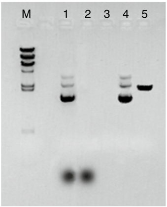

| M:   | Marker λ Hin dIII                                                            |
|------|------------------------------------------------------------------------------|
| 1:   | I, cleared lysate, ccc, linear and oc structure of the plasmid, degraded RNA |
| 2:   | II, lysate flow-through, no plasmid DNA, but degraded RNA                    |
| 3:   | III, wash flow-through, no plasmid DNA or residual RNA                       |
| 4:   | IV, eluate, pure plasmid DNA                                                 |
| 5:   | Eco RI restriction, linearized form of plasmid                               |

| Problem                     | Possible cause and suggestions                                                                                                                                                                                                                                                                                                                                                                                                                                                                                                                                                                                                                                                                                                                                                                                                                                                                                                                                                                                                                                                                                                                                                                                                                                                                                                                                                                                                                                                                                                                                                                                                                                                                                                                                                                                                                                   |
|-----------------------------|------------------------------------------------------------------------------------------------------------------------------------------------------------------------------------------------------------------------------------------------------------------------------------------------------------------------------------------------------------------------------------------------------------------------------------------------------------------------------------------------------------------------------------------------------------------------------------------------------------------------------------------------------------------------------------------------------------------------------------------------------------------------------------------------------------------------------------------------------------------------------------------------------------------------------------------------------------------------------------------------------------------------------------------------------------------------------------------------------------------------------------------------------------------------------------------------------------------------------------------------------------------------------------------------------------------------------------------------------------------------------------------------------------------------------------------------------------------------------------------------------------------------------------------------------------------------------------------------------------------------------------------------------------------------------------------------------------------------------------------------------------------------------------------------------------------------------------------------------------------|
| No or low plasmid DNA yield | Plasmid did not propagate • Check plasmid content in the cleared lysate (see Figure 6). Use colonies from fresh plates for inoculation and add fresh selective antibiotic to plates and media. • Estimate plasmid content prior to large purifications by a quick NucleoSpin ® Plasmid or NucleoSpin ® Plasmid EasyPure preparation. Alkaline lysis was inefficient • Too much cell mass was used. Refer to section 4.5-4.8 regarding recommended culture volumes and lysis buffer volumes. Check plasmid content in the cleared lysate (see Figure 6). • Check Buffer LYS for SDS precipitation before use, especially after storage below 20 °C. If necessary incubate the bottle for several minutes at 30-40 °C and mix well until SDS is redissolved. SDS- or other precipitates are present in the sample • Load the crude lysate onto the NucleoBond ® Xtra Column Filter inserted in the NucleoBond ® Xtra Column. This ensures complete removal of SDS precipitates. Incubation of cleared lysates for longer periods of time might lead to formation of new precipitate. If precipitate is visible, it is recommended to filter and centrifuge the lysate again directly before loading it onto the NucleoBond ® Xtra Column. Sample/lysate is too viscous • Too much cell mass was used. Refer to section 4.5-4.8 regarding recommended culture volumes and lysis buffer volumes. • Make sure to mix well after neutralization to completely precipitate SDS and chromosomal DNA. Otherwise, filtration efficiency and flow rate go down and SDS prevents DNA from binding to the column. pH or salt concentrations of buffers are too high • Check plasmid content in the wash fractions (see Figure 6). Keep all buffers tightly closed. Check and adjust pH of Buffer EQU (pH 6.5), WASH (pH 7.0), and ELU (pH 9.0) with HCl or NaOH if necessary. |

| Problem                                                   | Possible cause and suggestions                                                                                                                                                                                                                                                                                                                                                                                                                                                                                                                                                                                                                                                                                                         |
|-----------------------------------------------------------|----------------------------------------------------------------------------------------------------------------------------------------------------------------------------------------------------------------------------------------------------------------------------------------------------------------------------------------------------------------------------------------------------------------------------------------------------------------------------------------------------------------------------------------------------------------------------------------------------------------------------------------------------------------------------------------------------------------------------------------|
| NucleoBond ® Xtra Column Filter clogs during filtra- tion | Culture volumes are too large • Refer to section 4.5-4.8 regarding recommended culture volumes and larger lysis buffer volumes. Precipitate was not resuspended before loading • Invert crude lysate at least 3 times directly before loading. Incomplete precipitation step • Make sure to mix well after neutralization to completely precipitate SDS and chromosomal DNA.                                                                                                                                                                                                                                                                                                                                                           |
| NucleoBond ® Xtra Column is blocked or very slow          | Sample is too viscous • Do NOT attempt to purify lysate prepared from a culture volume larger than recommended for any given column size with standard lysis buffer volumes. Incomplete lysis not only blocks the column but can also significantly reduce yields. Refer to section 4.5 and 4.6 for recommended culture volumes and section 4.8 for larger culture volumes and adjusted lysis buffer volumes. • Make sure to mix well after neutralization to completely precipitate SDS and chromosomal DNA. Lysate was not cleared completely • Use NucleoBond ® Xtra Column Filter or centrifuge at higher speed or for a longer period of time. • Precipitates occur during storage. Clear lysate again before loading the column. |
| Genomic DNA contamination of plasmid DNA                  | Lysis treatment was too harsh • Make sure not to lyse in Buffer LYS for more than 5 min. Lysate was mixed too vigorously or vortexed after lysis • Invert tube for only 5 times. Do not vortex after addition of Buffer LYS. • Use larger tubes or reduce culture volumes for easier mixing.                                                                                                                                                                                                                                                                                                                                                                                                                                           |

| Problem                                           | Possible cause and suggestions                                                                                                                                                                                                                                                                                                                                                                                                                                                                                                                                                                                                                                   |
|---------------------------------------------------|------------------------------------------------------------------------------------------------------------------------------------------------------------------------------------------------------------------------------------------------------------------------------------------------------------------------------------------------------------------------------------------------------------------------------------------------------------------------------------------------------------------------------------------------------------------------------------------------------------------------------------------------------------------|
| RNA conta- mination of plasmid DNA                | RNase digestion was inefficient • RNase was not added to Buffer RES or stored improperly. Add new RNase to Buffer RES. See section 8.2 for ordering information. pH or salt concentration of wash buffer is too low • Check RNA content in the wash fractions (see Figure 6). Keep all buffers tightly closed. Check pH of Buffer EQU (pH 6.5) and WASH (pH 7.0) and adjust with HCl or NaOH if necessary. • Increase wash buffer stringency by adjusting pH of Buffer WASH to 7.5. Wash step with Buffer WASH was not sufficient • Double or triple washing step with Buffer WASH. Additional Buffer WASH can be ordered separately (see ordering information). |
| Low purity (A 260 /A 280 < 1.8)                   | NucleoBond ® Xtra Column Filter was not removed before second washing step • Protein content too high due to inefficient washing. Remove the NucleoBond ® Xtra Column Filter before performing the second washing step with Buffer WASH. Buffer WASH was used instead of Buffer EQU for the first wash • Buffer EQU has to be used to wash out the NucleoBond ® Xtra Column Filter to avoid SDS carry-over. Only minimal amounts of DNA were loaded onto the column • Excess free binding capacity requires more extensive washing - double washing step with Buffer WASH. • Reduce lysis time < 5 min.                                                          |
| No nucleic acid pellet formed after precipitation | of plasmid DNA that should be recovered after precipitation. Plasmid DNA might be smeared over the wall of the tube • Dissolve DNA with an appropriate volume of reconstitution buffer by rolling the tube for at least 30 min. Nucleic acid did not precipitate • Check type and volumes of precipitating solvent. Make sure to use at least 0.7 volumes of isopropanol and mix thoroughly. • Centrifuge for longer periods of time at higher speed.                                                                                                                                                                                                            |

| Problem                                                            | Possible cause and suggestions                                                                                                                                                                                                                                                                                                                                                                                                                                                                                                                                                                                                                                                                                 |
|--------------------------------------------------------------------|----------------------------------------------------------------------------------------------------------------------------------------------------------------------------------------------------------------------------------------------------------------------------------------------------------------------------------------------------------------------------------------------------------------------------------------------------------------------------------------------------------------------------------------------------------------------------------------------------------------------------------------------------------------------------------------------------------------|
| Nucleic acid pellet is opaque or white instead of clear and glassy | Co-precipitation of salt • Check isopropanol purity, and perform precipitation at room temperature (18-25 °C) but centrifuge at 4 °C. Do not let the eluate drip from the column into isopropanol but add isopropanol to the final eluate and mix immediately. • Try resuspending the pellet in Buffer WASH, and reload onto the same NucleoBond ® Xtra Column. Wash the column several times with Buffer WASH before loading.                                                                                                                                                                                                                                                                                 |
| Nucleic acid pellet does not resuspend in buffer                   | Pellet was over-dried • Try to dissolve at higher temperatures for a longer period of time (e. g., 2 h at 37 °C or overnight at RT), preferably under constant spinning (3D-shaker). Co-precipitation of salt or residual alcohol • Wash the pellet again with 70 % ethanol, or increase the reconstitution buffer volume. Insoluble particles in redissolved DNA • Centrifuge the redissolved DNA to pellet the insoluble particles and transfer supernatant to a new tube. Insoluble particles do not affect DNA quality. As an alternative insoluble particles can easily be removed by using the NucleoBond ® Finalizer (NucleoBond ® Xtra Midi) or NucleoBond ® Finalizer Large (NucleoBond ® Xtra Maxi). |

## Problem Possible cause and suggestions

## Already no or low plasmid DNA after elution from the NucleoBond ®  Xtra Column

- Refer to detailed troubleshooting 'No or low plasmid DNA yield'.

## Dead volume too high

- If high concentration of plasmid DNA is the main priority, elution should be performed in small volumes. Naturally a portion of the eluate will be lost in the syringe and on the NucleoBond ®  Finalizer. To minimize these losses in the second elution step, try to transfer even the last droplet from the syringe to the NucleoBond ®  Finalizer, for example by tapping the NucleoBond ® Finalizer and syringe onto the bench top. Then fill the syringe with air and press forcefully the last droplets out of the NucleoBond ®  Finalizer. Repeat this step several times. You might have to practice this procedure several times to achieve optimal results. An acceptable dead volume is smaller than 30 µL with NucleoBond ® Finalizer and 60 µL with NucleoBond ®  Finalizer Large.

## Elution volume too small

- Since there are dead volumes of about 30 µL (NucleoBond ® Finalizer) and 60 µL (NucleoBond ®  Finalizer Large), reasonable elution volumes start with 200 µL (NucleoBond ®  Finalizer) and 400 µL (NucleoBond ®  Finalizer Large) respectively. Further-more, smaller volumes are insufficient to wet the entire membrane and will drastically decrease your yield. Refer to section 4.13, Table  4 and Table  5 to estimate the recovery that can be expected depending on elution buffer volume.

## Elution too fast

- Plasmid DNA needs time to dissolve. Elute really very slowly, drop by drop. Repeat the elution procedure using the first eluate.

## Forgot to elute a second time

- Repeating the elution procedure with the first eluate is crucial for optimal yields. However, eluting a third time shows no further improvement.

## Plasmid size

- Precipitation efficiency is almost independent of plasmid size, but elution from the NucleoBond ®  Finalizers becomes more and more difficult with increasing size of the construct. If you face low yields with large cosmids you may try heating the NucleoBond ®  Finalizer, the syringes, and elution buffer to 70 °C.

## No or low plasmid DNA yield after NucleoBond ® Finalizer precipitation

| Problem                                                          | Possible cause and suggestions                                                                                                                                                                                                                                                                                                                                                                                                                                                                                                                                                                                                                                                                                                                                                                                                                                                                                                                                                                                                                                                                                 |
|------------------------------------------------------------------|----------------------------------------------------------------------------------------------------------------------------------------------------------------------------------------------------------------------------------------------------------------------------------------------------------------------------------------------------------------------------------------------------------------------------------------------------------------------------------------------------------------------------------------------------------------------------------------------------------------------------------------------------------------------------------------------------------------------------------------------------------------------------------------------------------------------------------------------------------------------------------------------------------------------------------------------------------------------------------------------------------------------------------------------------------------------------------------------------------------|
| Low DNA concentration after NucleoBond ® Finalizer precipitation | Low overall yield • Refer to detailed troubleshooting 'No or low plasmid DNA yield' and lower your elution buffer volume. Refer to section 4.13, Table 4 and Table 5 to estimate the DNA concentrations that can be expected. Fresh elution buffer was used for second elution step • The second elution step is crucial for optimal yield but to achieve a high DNA concentration the eluate of the first elution step has to be used for the second elution. Not enough DNA loaded • Since there is a technical limitation to at least 200 µL (NucleoBond ® Finalizer) and 400 µL (NucleoBond ® Finalizer Large) of elution buffer due to membrane wetting and dead volume, a minimal amount of DNA has to be loaded to achieve a desired concentration. If possible try to pool several DNA precipitation batches since percentage of recovery and concentration significantly increase with higher amounts of loaded DNA.                                                                                                                                                                                  |
| Low recovery when using the Finalizer                            | Resuspension time might be too short • Depending on the total amount of the precipitated plasmid it will need some time to redissolve completely. Resuspension time might be too short for a complete recovery, if the redissolving buffer is passed by the precipitated plasmid on the Finalizer membrane too quickly. If a high recovery is mandatory it is recommended to incubate the precipitated plasmid in the redissolving buffer during the elution step. Therefore, do not press the elution buffer through the Finalizer in one rush, but rather stop pressing the buffer through as soon as the first drops have passed the outlet. Let the redissolving buffer sit on the membrane in the Finalizer for 5 minutes at room temperature before completing the elution step. Reload the eluate onto the Finalizer and repeat the procedure at least once. General recommendations are also valid here: push the redissolving buffer through the membrane slowly, increase the elution volume to gain a higher recovery and blow out the dead volume completely by pushing air through the Finalizer. |

| Problem                                                        | Possible cause and suggestions                                                                                                                                                                                                                                                                                                                                                                                                                                                                                                                                                                                                                                                                                                                                                                  |
|----------------------------------------------------------------|-------------------------------------------------------------------------------------------------------------------------------------------------------------------------------------------------------------------------------------------------------------------------------------------------------------------------------------------------------------------------------------------------------------------------------------------------------------------------------------------------------------------------------------------------------------------------------------------------------------------------------------------------------------------------------------------------------------------------------------------------------------------------------------------------|
| Purified plasmid does not perform well in subsequent reactions | Plasmid DNA is contaminated with chromosomal DNA or RNA • Refer to the detailed troubleshooting above. Plasmid DNA is contaminated with residual alcohol • Plasmid DNA was not dried completely before redissolving. Precipitate DNA again by adding 1 / 10 volume of 3 M NaAc pH 5.0 and 0.7 volumes of isopropanol. Proceed with the precipitation protocol in this manual and dry DNA pellet completely. DNA is degraded • Make sure that your entire equipment (pipettes, centrifuge tubes, etc.) is clean and nuclease-free. • Do not lyse the sample with Buffer LYS for more than 5 min. DNA is irreversibly denatured • A denatured plasmid band runs faster on the gel than the supercoiled conformation. Do not lyse the sample after addition of Buffer LYS for more than 5 minutes. |

## 8.2 Ordering information

| Product                                                                                                                                                                            | REF                    | Pack of             |
|------------------------------------------------------------------------------------------------------------------------------------------------------------------------------------|------------------------|---------------------|
| NucleoBond ® Xtra Midi                                                                                                                                                             | 740410.10 / .50 / .100 | 10 / 50 / 100 preps |
| NucleoBond ® Xtra Midi Plus (incl. NucleoBond ® Finalizers)                                                                                                                        | 740412.10 / .50        | 10 / 50 preps       |
| NucleoBond ® Xtra Maxi                                                                                                                                                             | 740414.10 / .50 / .100 | 10 / 50 / 100 preps |
| NucleoBond ® Xtra Maxi Plus (incl. NucleoBond ® Finalizers Large)                                                                                                                  | 740416.10 / .50        | 10 / 50 preps       |
| NucleoBond ® Xtra Combi Rack                                                                                                                                                       | 740415                 | 1                   |
| NucleoBond ® Xtra Buffer Set I (Buffer RES, LYS (with LyseControl), NEU, RNase A; only applicable with NucleoBond ® Xtra kits; sufficient for 12 Xtra Maxi and 18 Xtra Midi preps) | 740417                 | 1                   |
| Buffer RES                                                                                                                                                                         | 740363.1000            | 1000 mL             |
| Buffer EQU                                                                                                                                                                         | 740317.1000            | 1000 mL             |
| Buffer WASH                                                                                                                                                                        | 740375.1000            | 1000 mL             |

| Product                                                                                | REF              | Pack of                            |
|----------------------------------------------------------------------------------------|------------------|------------------------------------|
| Buffer ELU                                                                             | 740316.600       | 600 mL                             |
| NucleoBond ® Finalizer                                                                 |                  |                                    |
| (for use with NucleoBond ® Xtra Midi, Midi EF, NucleoBond ® PC 100, PC 500, PC 500 EF) | 740519.20        | 20 filters 2 syringe sets          |
| NucleoBond ® Finalizer Plus                                                            |                  |                                    |
| (for use with NucleoBond ® Xtra Midi, Midi EF, NucleoBond ® PC 100, PC 500, PC 500 EF) | 740520.20        | 20 filters 20 syringe sets         |
| NucleoBond ® Finalizer Large                                                           |                  |                                    |
| (for use with NucleoBond ® Xtra Maxi, Maxi EF, NucleoBond ® PC 2000, PC 2000 EF)       | 740418.20        | 20 large filters 2 syringe sets    |
| NucleoBond ® Finalizer Large Plus                                                      |                  |                                    |
| (for use with NucleoBond ® Xtra Maxi, Maxi EF, NucleoBond ® PC 2000, PC 2000 EF)       | 740419.20        | 20 large filters 20 syringe sets   |
| RNase A (lyophilized)                                                                  | 740505.50 740505 | 50 mg 100 mg                       |
| NucleoMag ® Desalting Beads (for desalting of NucleoBond ® eluates)                    | 744410.50        | 4 x 1.5 mL and Buffer TRIS (60 mL) |

Visit www.mn-net.com for more detailed product information.

## 8.3 Product use restriction / warranty

NucleoBond ®  Xtra Midi /   Maxi kit components are intended, developed, designed, and sold FOR RESEARCH PURPOSES ONLY, except, however, any other function of the product being expressly described in original MACHEREY-NAGEL product leaflets.

MACHEREY-NAGEL products are intended for GENERAL LABORATORY USE ONLY!  MACHEREY-NAGEL  products  are  suited  for  QUALIFIED  PERSONNEL  ONLY! MACHEREY-NAGEL  products  shall  in  any  event  only be used wearing adequate PROTECTIVE CLOTHING. For detailed information please refer to the respective Material Safety Data Sheet of the product! MACHEREY-NAGEL products shall exclusively be used in  an  ADEQUATE  TEST  ENVIRONMENT.  MACHEREY-NAGEL  does  not  assume  any responsibility  for  damages  due  to  improper  application  of  our  products  in  other  fields  of application. Application on the human body is STRICTLY FORBIDDEN. The respective user is liable for any and all damages resulting from such application.

DNA/RNA/PROTEIN purification products of MACHEREY-NAGEL are suitable for IN-VITROUSES ONLY!

ONLY MACHEREY-NAGEL products specially labeled as IVD are also suitable for IN-VITROdiagnostic  use.  Please  pay  attention  to  the  package  of  the  product.  IN-VITRO-diagnostic products are expressly marked as IVD on the packaging.

IF THERE IS NO IVD SIGN, THE PRODUCT SHALL NOT BE SUITABLE FOR IN-VITRODIAGNOSTIC USE!

ALL OTHER PRODUCTS NOT LABELED AS IVD ARE NOT SUITED FOR ANY CLINICAL USE  (INCLUDING,  BUT  NOT  LIMITED  TO  DIAGNOSTIC,  THERAPEUTIC  AND/OR PROGNOSTIC USE).

No claim or representations is intended for its use to identify any specific organism or for clinical use (included, but not limited to diagnostic, prognostic, therapeutic, or blood banking). It is rather in the responsibility of the user or - in any case of resale of the products - in the responsibility of the reseller to inspect and assure the use of the DNA/RNA/protein purification products of MACHEREY-NAGEL for a well-defined and specific application.

MACHEREY-NAGEL  shall  only  be  responsible  for  the  product  specifications  and  the performance range of MN products according to the specifications of in-house quality control, product documentation and marketing material.

This MACHEREY-NAGEL product is shipped with documentation stating specifications and other technical information. MACHEREY-NAGEL warrants to meet the stated specifications. MACHEREY-NAGEL's sole obligation and the customer's sole remedy is limited to replacement of products free of charge in the event products fail to perform as warranted. Supplementary reference is made to the general business terms and conditions of MACHEREY-NAGEL, which are printed on the price list. Please contact us if you wish to get an extra copy.

There is no warranty for and MACHEREY-NAGEL is not liable for damages or defects arising in shipping and handling (transport insurance for customers excluded), or out of accident or improper or abnormal use of this product; defects in products or components not manufactured by MACHEREY-NAGEL,  or  damages  resulting  from  such  non-MACHEREY-NAGEL components or products.

MACHEREY-NAGEL makes no other warranty of any kind whatsoever, and SPECIFICALLY DISCLAIMS AND EXCLUDES ALL OTHER WARRANTIES OF ANY KIND OR NATURE WHATSOEVER,  DIRECTLY  OR  INDIRECTLY,  EXPRESS  OR  IMPLIED,  INCLUDING, WITHOUT  LIMITATION,  AS  TO  THE  SUITABILITY,  REPRODUCTIVITY,  DURABILITY, FITNESS FOR A PARTICULAR PURPOSE OR USE, MERCHANTABILITY, CONDITION, OR ANY OTHER MATTER WITH RESPECT TO MACHEREY-NAGEL PRODUCTS.

In no event shall MACHEREY-NAGEL be liable for claims for any other damages, whether direct, indirect, incidental, compensatory, foreseeable, consequential, or special (including but  not  limited  to  loss  of  use,  revenue  or  profit),  whether  based  upon  warranty,  contract, tort (including negligence) or strict liability arising in connection with the sale or the failure of  MACHEREY-NAGEL products to perform in accordance with the stated specifications. This warranty is exclusive and MACHEREY-NAGEL makes no other warranty expressed or implied.

The  warranty  provided  herein  and  the  data,  specifications  and  descriptions  of  this MACHEREY-NAGEL product appearing in MACHEREY-NAGEL published catalogues and product literature are MACHEREY-NAGEL's sole representations concerning the product and warranty. No other statements or representations, written or oral, by MACHEREY-NAGEL 's employees, agent or representatives, except written statements signed by a duly authorized officer of MACHEREY-NAGEL are authorized; they should not be relied upon by the customer and are not a part of the contract of sale or of this warranty.

Product  claims  are  subject  to  change.  Therefore  please  contact  our  Technical  Service Team for the most up-to-date information on MACHEREY-NAGEL  products.  You may  also  contact  your  local  distributor  for  general  scientific  information.  Applications mentioned  in  MACHEREY-NAGEL  literature  are  provided  for  informational  purposes only.  MACHEREY-NAGEL  does  not  warrant  that  all  applications  have  been  tested  in MACHEREY-NAGEL laboratories using MACHEREY-NAGEL products. MACHEREY-NAGEL does not warrant the correctness of any of those applications.

Last updated: 07 / 2010, Rev. 03

## Please contact:

MACHEREY-NAGEL GmbH &amp; Co. KG Tel.: +49 (0) 24 21 969 270 e-mail: tech-bio@mn-net.com

Trademarks:

DH5 α ®  is a trademark of Life Technologies, Inc. NucleoSpin ®  is a trademark of MACHEREY-NAGEL GmbH &amp; Co. KG

NucleoBond ®  is a trademark of MACHEREY-NAGEL GmbH &amp; Co. KG.

Plasmid DNA

Clean up

RNA

DNA

Viral RNA and DNA

Protein

High throughput

Accessories

Auxiliary tools www.mn-net.com MACHEREY-NAGEL GmbH &amp; Co. KG

Neumann-Neander-Str. 6-8

52355 Düren · Germany

DE Tel.: +49 24 21 969-0

info@mn-net.com

CH Tel.: +41 62 388 55 00

sales-ch@mn-net.com

FR Tel.: +33 388 68 22 68

sales-fr@mn-net.com

US Tel.: +1 484 821 0984

sales-us@mn-net.com

