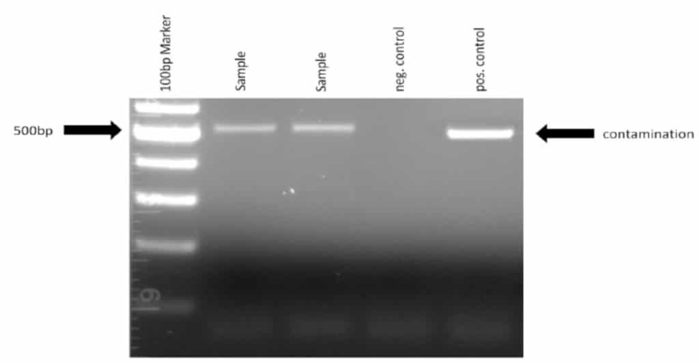

**MYCO-PCR**

MRC 10/2019

Order Primers

You will need to order multiple forward and reverse primers to detect multiple species of mycoplasma.

Forward primers

  -    Myco-5-1   CGCCTGAGTAGTACGTTCGC

  -    Myco-5-2  CGCCTGAGTAGTACGTACGC

  -    Myco-5-3  TGCCTGAGTAGTACATTCGC

  -    Myco-5-4  TGCCTGGGTAGTACATTCGC

  -    Myco-5-5  CGCCTGGGTAGTACATTCGC

  -    Myco-5-6  CGCCTGAGTAGTATGCTCGC

 Reverse primers

  -    Myco-3-1  GCGGTGTGTACAAGACCCGA

  -    Myco-3-2  GCGGTGTGTACAAAACCCGA

  -    Myco-3-3  GCGGTGTGTACAAACCCCGA

Prepare Primer Mix

Dissolve each primer to a final concentration of 100 µM. Mix all forward primers together to reach a final concentration of 10 µM each. For example, if you want to prepare 100 µl primer mix, take 10 µl of each forward primer and add 40 µl of water. Mix all reverse primers in a similar fashion.

Prepare Sample

Take 100 µl of cell culture supernatant from a dense culture (80-100% confluent) into a 1.5ml tube (or media, sera, whatever you want to test). Heat the sample for 5 min at 95°C (to denaturate it) and spin it for 2min in a bench centrifuge at maximum speed.

Set up PCR

Prepare the PCR reaction mix using the following table (may need some adjustment depending on the manufacturer). Remember to include a negative control sample with water to exclude false positives and a positive control if you have one (If you identify an infected culture you can also use this supernatant as a positive control.)

| **Reagent**              | **Volume (microliters)** |
| ------------------------ | ------------------------ |
| 10x PCR Buffer           | 2.5                      |
| 25 mM MgCl 2  | 2.0                      |
| 10mM dNTPs               | 1.0                      |
| Forward primers          | 1.0                      |
| Reverse primers          | 1.0                      |
| Cell culture supernatant | 2.0                      |
| Taq polymerase           | 0.2                      |
| Water                    | 15.3                     |
| Total                    | 25                       |

Perform PCR and Run Gel

Perform the PCR using the following program:

| **Step**             | **Temperature (Celsius)** | **Time** |
| -------------------- | ------------------------- | -------- |
| Initial denaturation | 95                        | 2:00 min |
| 5 cycles             | 94                        | 0:30 sec |
|                      | 50                        | 0:30 sec |
|                      | 72                        | 0:35 sec |
| 30 cycles            | 94                        | 0:15 sec |
|                      | 56                        | 0:15 sec |
|                      | 72                        | 0:30 sec |
| Store                | 4                         | Infinity |

  - The final PCR should be about 500 nucleotides, so you may need to adapt the extention time based on the recommendations for your polymerase. For the Taq polymerase you need about 35 seconds of amplification time (already including some safety margin).

  - The PCR goes through 5 cycles with lower specificity to ensure that the multiple mycoplasma species can be amplified and then through additional 30 cycles with higher specificity to avoid false positives.

  - If the signal is too weak,  you can use 35 cycles instead of 30.

Run the samples on a 1.5% agarose gel. An example is shown below:

Figure 1. Image showing mycoplasma contamination as detected by PCR.
