[Download the original PDF](MB5.NextGEMSingleCell5_v2_CellSurfaceProtein_RevA.pdf){.btn .btn-primary download="MB5.NextGEMSingleCell5_v2_CellSurfaceProtein_RevA.pdf"}


Source PDF: [MB5.NextGEMSingleCell5_v2_CellSurfaceProtein_RevA.pdf](MB5.NextGEMSingleCell5_v2_CellSurfaceProtein_RevA.pdf)

USER GUIDE

## Chromium Next GEM Single Cell 5 ' Reagent Kits v2 (Dual Index)

with Feature Barcode technology for Cell Surface Protein &amp; Immune Receptor Mapping


Chromium Next GEM Single Cell 5 ' Kit v2, 16 rxns PN-1000263

Chromium Next GEM Single Cell 5 ' Kit v2, 4 rxns PN-1000265

Library Construction Kit, 16 rxns PN-1000190

5' Feature Barcode Kit, 16 rxns PN-1000256

Chromium Single Cell Human TCR Amplification Kit, 16 rxns PN-1000252

Chromium Single Cell Human BCR Amplification Kit, 16 rxns PN-1000253

Chromium Single Cell Mouse TCR Amplification Kit, 16 rxns PN-1000254

Chromium Single Cell Mouse BCR Amplification Kit, 16 rxns PN-1000255

Chromium Next GEM Chip K Single Cell Kit, 48 rxns PN-1000286

Chromium Next GEM Chip K Single Cell Kit, 16 rxns PN-1000287

Dual Index Kit TT Set A, 96 rxns PN-1000215

Dual Index Kit TN Set A, 96 rxns PN-1000250


## Notices

## Document Number

## CG000330 · Rev A

## Legal Notices

© 2020 10x Genomics, Inc. (10x Genomics). All rights reserved. Duplication and/or reproduction of all or any portion of this document without the express written consent of 10x Genomics, is strictly forbidden. Nothing contained herein shall constitute any warranty, express or implied, as to the performance of any products described herein. Any and all warranties applicable to any products are set forth in the applicable terms and conditions of sale accompanying the purchase of such product. 10x Genomics provides no warranty and hereby disclaims any and all warranties as to the use of any third-party products or protocols described herein. The use of products described herein is subject to certain restrictions as set forth in the applicable terms and conditions of sale accompanying the purchase of such product. A non-exhaustive list of 10x Genomics' marks, many of which are registered in the United States and other countries can be viewed at:  www.10xgenomics.com/trademarks. 10x Genomics may refer to the products or services offered by other companies by their brand name or company name solely for clarity, and does not claim any rights in those third-party marks or names. 10x Genomics products may be covered by one or more of the patents as indicated at:www.10xgenomics.com/patents.  The use of products described herein is subject to 10x Genomics Terms and Conditions of Sale, available at www.10xgenomics.com/legal-notices, or such other terms that have been agreed to in writing between 10x Genomics and user.  All products and services described herein are intended FOR RESEARCH USE ONLY and NOT FOR USE IN DIAGNOSTIC PROCEDURES.

## Instrument &amp; Licensed Software Updates Warranties

Updates to existing  Instruments  and  Licensed  Software  may  be  required  to  enable  customers  to  use new or existing products.  In the event of an Instrument failure resulting from an update, such failed Instrument will be replaced or repaired in accordance with the 10x Limited Warranty, Assurance Plan or service agreement, only if such Instrument is covered by any of the foregoing at the time of such failure. Instruments not covered under a current 10x Limited Warranty, Assurance Plan or service agreement will not be replaced or repaired.

## Support

Email: support@10xgenomics.com 10x Genomics 6230 Stoneridge Mall Road Pleasanton, CA 94588 USA

| Document Revision Summary   | Document Number   | CG000330                                                                                                                                                     |
|-----------------------------|-------------------|--------------------------------------------------------------------------------------------------------------------------------------------------------------|
|                             | Title             | Chromium Next GEM Single Cell 5 ' Reagent Kits v2 (Dual Index) User Guide with Feature Barcode technology for Cell Surface Protein & Immune Receptor Mapping |
|                             | Revision          | Rev A                                                                                                                                                        |
|                             | Revision Date     | August 2020                                                                                                                                                  |

## Table of Contents

| Introduction                                                                    |   6 |
|---------------------------------------------------------------------------------|-----|
| Chromium Next GEM Single Cell 5 މ Reagent Kits v2 (Dual Index)                  |   7 |
| Chromium Accessories                                                            |  12 |
| Recommended Thermal Cyclers                                                     |  12 |
| Additional Kits, Reagents & Equipment                                           |  13 |
| Protocol Steps & Timing                                                         |  15 |
| Stepwise Objectives                                                             |  16 |
| Cell Labeling Guidelines                                                        |  21 |
| Tips & Best Practices                                                           |  22 |
| Step 1                                                                          |  29 |
| GEM Generation & Barcoding                                                      |  30 |
| 1.1 Prepare Reaction Mix                                                        |  31 |
| 1.2 Load Chromium Next GEM Chip K                                               |  33 |
| 1.3 Run the Chromium Controller                                                 |  34 |
| 1.4 Transfer GEMs                                                               |  34 |
| 1.5 GEM-RT Incubation                                                           |  35 |
| Step 2                                                                          |  36 |
| Post GEM-RT Cleanup & cDNA Amplification                                        |  37 |
| 2.1 Post GEM-RT Cleanup - Dynabeads                                             |  38 |
| 2.2 cDNA Amplification                                                          |  40 |
| 2.3 cDNA Cleanup - SPRIselect                                                   |  42 |
| 2.3A Pellet Cleanup                                                             |  42 |
| 2.3B Transferred Supernatant Cleanup                                            |  42 |
| 2.4 cDNA QC & Quantification                                                    |  43 |
| Step 3                                                                          |  44 |
| V(D)J Amplification from cDNA                                                   |  45 |
| 3.1 V(D)J Amplification 1                                                       |  46 |
| 3.2 Post V(D)J Amplification 1 Cleanup Double Sided Size Selection - SPRIselect |  47 |
| 3.3 V(D)J Amplification 2                                                       |  48 |
| 3.4 Post V(D)J Amplification 2 Cleanup Double Sided Size Selection - SPRIselect |  49 |
| 3.5 Post V(D)J Amplification QC & Quantification                                |  50 |

| Step 4                                                                                      |   51 |
|---------------------------------------------------------------------------------------------|------|
| V(D)J Library Construction                                                                  |   52 |
| 4.1 Fragmentation, End Repair & A-tailing                                                   |   53 |
| 4.2 Adaptor Ligation                                                                        |   54 |
| 4.3 Post Ligation Cleanup - SPRIselect                                                      |   54 |
| 4.4 Sample Index PCR                                                                        |   55 |
| 4.5 Post Sample Index PCR Cleanup - SPRIselect                                              |   56 |
| 4.6 Post Library Construction QC                                                            |   56 |
| Step 5                                                                                      |   57 |
| 5 މ Gene Expression (GEX) Library Construction                                              |   58 |
| 5.1 GEX Fragmentation, End Repair & A-tailing                                               |   59 |
| 5.2 GEX Post Fragmentation, End Repair & A-tailing Double Sided Size Selection - SPRIselect |   60 |
| 5.3 GEX Adaptor Ligation                                                                    |   61 |
| 5.4 GEX Post Ligation Cleanup - SPRIselect                                                  |   61 |
| 5.5 GEX Sample Index PCR                                                                    |   62 |
| 5.6 GEX Post Sample Index PCR Double Sided Size Selection - SPRIselect                      |   63 |
| 5.7 GEX Post Library Construction QC                                                        |   63 |
| Step 6                                                                                      |   64 |
| Cell Surface Protein/Immune Receptor Mapping Library Construction                           |   65 |
| 6.1 Sample Index PCR                                                                        |   66 |
| 6.2 Post Sample Index PCR Size Selection - SPRIselect                                       |   67 |
| 6.3 Post Library Construction QC                                                            |   67 |
| Sequencing                                                                                  |   68 |
| Troubleshooting                                                                             |   71 |
| GEMs                                                                                        |   72 |
| Chromium Controller Errors                                                                  |   74 |
| Appendix                                                                                    |   75 |
| Post Library Construction Quantification                                                    |   76 |
| Agilent TapeStation Traces                                                                  |   77 |
| LabChip Traces                                                                              |   78 |
| Oligonucleotide Sequences                                                                   |   79 |

## Introduction

Chromium Next GEM Single Cell 5 ' Reagent Kits v2 (Dual Index) Chromium Accessories Recommended Thermal Cyclers Additional Kits, Reagents &amp; Equipment Protocol Steps &amp; Timing Stepwise Objectives Cell Labeling Guidelines

## Chromium Next GEM Single Cell 5 މ Reagent Kits v2 (Dual Index)

## Chromium Next GEM Single Cell 5 މ Kit v2, 16 rxns PN-1000263

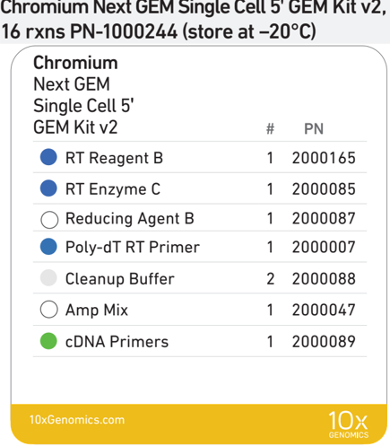

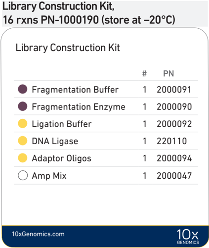

## Chromium Next GEM Single Cell 5 ' Gel Bead Kit v2, 16 rxns PN-1000264 (store at -80°C)

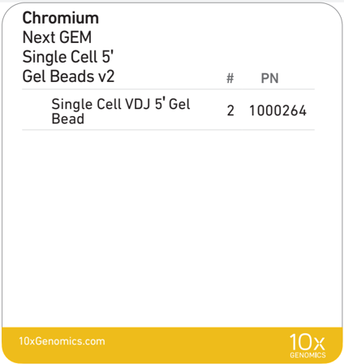

## Dynabeads ™ MyOne ™ SILANE PN-2000048 (store at 4°C)

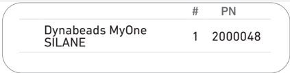

## Chromium Next GEM Single Cell 5 މ Kit v2, 4 rxns PN-1000265

## Chromium Next GEM Single Cell 5 ' GEM Kit v2, 4 rxns PN-1000266 (store at -20°C)

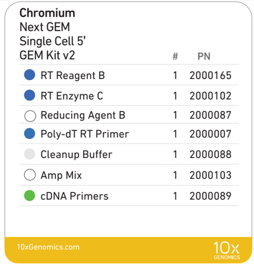

Library Construction Kit, 4 rxns PN-1000196 (store at -20°C)

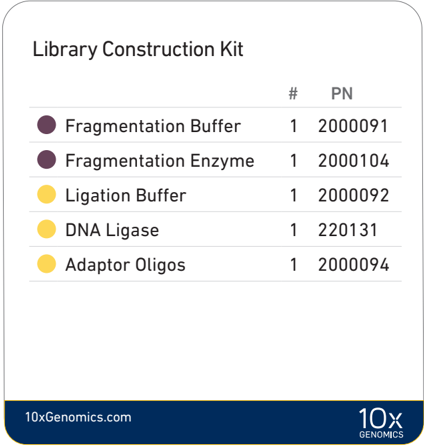

## Chromium Next GEM Single Cell 5 މ Gel Bead Kit v2, 4 rxns PN-1000267 (store at -80°C)

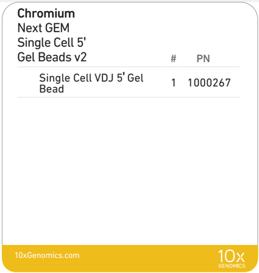

## Dynabeads ™ MyOne ™ SILANE PN-2000048 (store at 4°C)

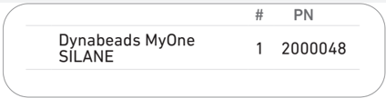

## 5 ' Feature Barcode Kit, 16 rxns PN-1000256 (store at -20°C)

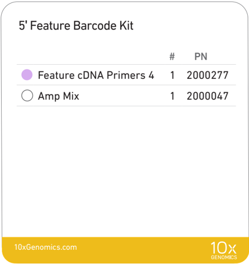

## Chromium Single Cell V(D)J Amplification Kits, Human (store at -20°C)

## TCR Amplification Kit, 16 rxns PN-1000252

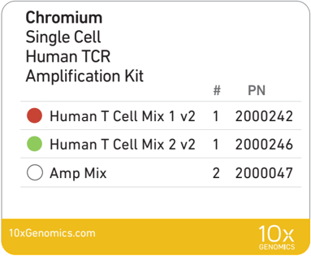

## BCR Amplification Kit, 16 rxns PN-1000253

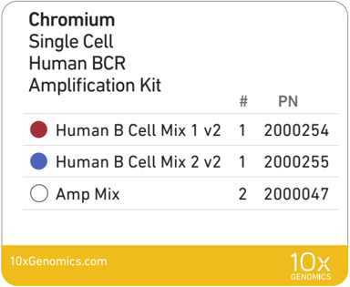

## Chromium Single Cell V(D)J Amplification Kits, Mouse (store at -20°C)

## TCR Amplification Kit, 16 rxns PN-1000254

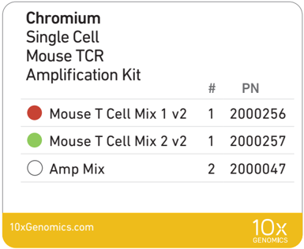

## BCR Amplification Kit, 16 rxns PN-1000255

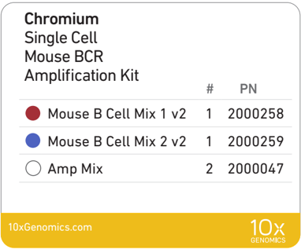

## Chromium Next GEM Chip K Single Cell Kit, 48 rxns PN-1000286 (store at ambient temperature)

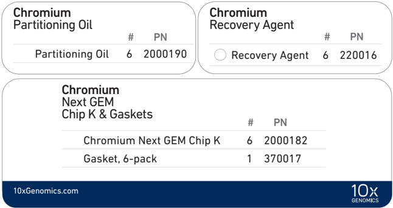

## Chromium Next GEM Chip K Single Cell Kit, 16 rxns PN-1000287 (store at ambient temperature)

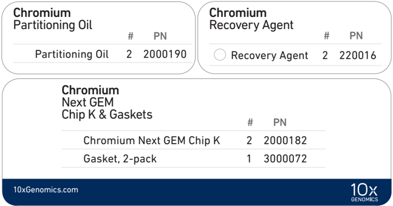

## Dual Index Kit TT Set A, 96 rxns PN-1000215  (store at -20°C)

| Dual Index Kit TT Set A   | # PN      |
|---------------------------|-----------|
| Dual Index Plate TT Set A | 1 3000431 |

## Dual Index Kit TN Set A, 96 rxns PN-1000250  (store at -20°C)

| Dual Index Kit TN Set A   | # PN      |
|---------------------------|-----------|
| Dual Index Plate TN Set A | 1 3000510 |

| Product                            |   PN (Kit) |   PN (Item) |
|------------------------------------|------------|-------------|
| 10x Vortex Adapter                 |     120251 |      330002 |
| Chromium Next GEM Secondary Holder |    1000195 |     3000332 |
| 10x Magnetic Separator             |     120250 |      230003 |

Thermal cyclers used must support uniform heating of 100 µl emulsion volumes.

| Supplier                 | Description                                                  | Part Number                                        |
|--------------------------|--------------------------------------------------------------|----------------------------------------------------|
| BioRad                   | C1000 Touch Thermal Cycler with 96-Deep Well Reaction Module | 1851197                                            |
| Eppendorf                | MasterCycler Pro (discontinued)                              | North America 950030010 International 6321 000.019 |
| Thermo Fisher Scientific | Veriti 96-Well Thermal Cycler                                | 4375786                                            |

## Chromium Accessories

## Recommended Thermal Cyclers

## Additional Kits, Reagents &amp; Equipment

The items in the table below have been validated by 10x Genomics and are highly recommended for the Single Cell 5 ' protocols. Substituting materials may adversely affect  system  performance.  This  list  may  not  include  some  standard  laboratory equipment.

| Supplier                 | Description                                                                                                                                                                                                                                                                  |                                            | Part Number (US)                                                        |
|--------------------------|------------------------------------------------------------------------------------------------------------------------------------------------------------------------------------------------------------------------------------------------------------------------------|--------------------------------------------|-------------------------------------------------------------------------|
| Plastics                 |                                                                                                                                                                                                                                                                              |                                            |                                                                         |
| Eppendorf                | PCR Tubes 0.2 ml 8-tube strips DNA LoBind Tubes, 1.5 ml DNA LoBind Tubes, 2.0 ml                                                                                                                                                                                             | Choose either Eppendorf, USA Scientific or | 951010022 022431021 022431048                                           |
| USA Scientific           | TempAssure PCR 8-tube strip                                                                                                                                                                                                                                                  | Thermo Fisher Scientific PCR               | 1402-4700                                                               |
| Thermo Fisher Scientific | MicroAmp 8-Tube Strip, 0.2 ml MicroAmp 8-Cap Strip, clear                                                                                                                                                                                                                    | 8-tube strips.                             | N8010580 N8010535                                                       |
| Rainin                   | Tips LTS 200UL Filter RT-L200FLR Tips LTS 1ML Filter RT-L1000FLR Tips LTS 20UL Filter RT-L10FLR                                                                                                                                                                              |                                            | 30389240 30389213 30389226                                              |
| Kits & Reagents          |                                                                                                                                                                                                                                                                              |                                            |                                                                         |
| Thermo Fisher Scientific | Nuclease-free Water                                                                                                                                                                                                                                                          |                                            | AM9937                                                                  |
| Millipore Sigma          | Ethanol, Pure (200 Proof, anhydrous)                                                                                                                                                                                                                                         |                                            | E7023-500ML                                                             |
| Beckman Coulter          | SPRIselect Reagent Kit                                                                                                                                                                                                                                                       |                                            | B23318                                                                  |
| Bio-Rad                  | 10% Tween 20                                                                                                                                                                                                                                                                 |                                            | 1662404                                                                 |
| Ricca Chemical Company   | Glycerin (glycerol), 50% (v/v) Aqueous Solution                                                                                                                                                                                                                              |                                            | 3290-32                                                                 |
| Qiagen                   | Qiagen Buffer EB                                                                                                                                                                                                                                                             |                                            | 19086                                                                   |
| Equipment                |                                                                                                                                                                                                                                                                              |                                            |                                                                         |
| VWR                      | Vortex Mixer Divided Polystyrene Reservoirs Mini Centrifuge (alternatively, use any equivalent mini centrifuge)                                                                                                                                                              |                                            | 10153-838 41428-958 76269-064                                           |
| Eppendorf                | Eppendorf ThermoMixer C Eppendorf SmartBlock 1.5 ml, Thermoblock for 24 reaction (alternatively, use a temperature-controlled Heat Block)                                                                                                                                    | vessel                                     | 5382000023 5360000038                                                   |
| Rainin                   | Pipet-Lite Multi Pipette L8-50XLS+ Pipet-Lite Multi Pipette L8-200XLS+ Pipet-Lite Multi Pipette L8-10XLS+ Pipet-Lite Multi Pipette L8-20XLS+ Pipet-Lite LTS Pipette L-2XLS+ Pipet-Lite LTS Pipette L-10XLS+ Pipet-Lite LTS Pipette L-20XLS+ Pipet-Lite LTS Pipette L-100XLS+ |                                            | 17013804 17013805 17013802 17013803 17014393 17014388 17014392 17014384 |

## Additional Kits, Reagents &amp; Equipment

The items in the table below have been validated by 10x Genomics and are highly recommended for the Single Cell 5 ' protocols. Substituting materials may adversely affect  system  performance.  This  list  may  not  include  some  standard  laboratory equipment.

| Supplier                         | Description                                                                                                                                                           | Part Number (US)                              |
|----------------------------------|-----------------------------------------------------------------------------------------------------------------------------------------------------------------------|-----------------------------------------------|
| Quantification & Quality Control | Quantification & Quality Control                                                                                                                                      | Quantification & Quality Control              |
| Agilent                          | 2100 Bioanalyzer Laptop Bundle High Sensitivity DNA Kit 4200 TapeStation High Sensitivity D5000 ScreenTape High Sensitivity D5000 Reagents Choose TapeStation based & | G2943CA 5067-4626 G2991AA 5067-5592 5067-5593 |
| Thermo Fisher Scientific         | Qubit 4.0 Fluorometer Qubit dsDNA HS Assay Kit                                                                                                                        | Q33238 Q32854                                 |
| KAPA Biosystems                  | KAPA Library Quantification Kit for Illumina Platforms                                                                                                                | KK4824                                        |

## Protocol Steps &amp; Timing


|                       | Steps                                                                           | Timing                                                              | Stop & Store                                              |
|-----------------------|---------------------------------------------------------------------------------|---------------------------------------------------------------------|-----------------------------------------------------------|
|                       | Cell Preparation and Labeling Dependent on cell type and labeling protocol used | ~1-2 h                                                              |                                                           |
|                       | Step 1 - GEM Generation & Barcoding                                             | Step 1 - GEM Generation & Barcoding                                 |                                                           |
| 3 h                   | 1.1 Prepare Reaction Mix                                                        | 20 min                                                              |                                                           |
| 3 h                   | 1.2                                                                             | Load Chromium Next GEM Chip K                                       | 10 min                                                    |
| 3 h                   | 1.3 Run the Chromium Controller                                                 | 18 min                                                              |                                                           |
| 3 h                   | 1.4 Transfer GEMs                                                               | 3 min                                                               |                                                           |
| 3 h                   | GEM-RT Incubation                                                               | 55 min STOP                                                         | 4°C ” 2 h or - 20°C ” 1 week                              |
| 3 h                   | 1.5 Step 2 - Post GEM RT Cleanup, cDNA Amplification & QC                       | 1.5 Step 2 - Post GEM RT Cleanup, cDNA Amplification & QC           | 1.5 Step 2 - Post GEM RT Cleanup, cDNA Amplification & QC |
| 6 h                   | 2.1 Post GEM-RT Cleanup - Dynabead                                              | 45 min                                                              |                                                           |
| 6 h                   | 2.2                                                                             | cDNA Amplification                                                  | 50 min 4°C ” 2 h or - 20°C ” 1 week STOP                  |
| 6 h                   | 2.3                                                                             | cDNA Cleanup 2.3A Pellet Cleanup                                    | 15 min 4°C ” 2 h or - 20°C ” 1 week STOP                  |
| 6 h                   |                                                                                 | 2.3B Supernatant Cleanup                                            | min 4°C ” 2 h or - 20°C ” 1 week STOP                     |
| 6 h                   | 2.4                                                                             | cDNA Quantification & QC                                            | 20 50 min                                                 |
| 6 h                   | Step 3 - V(D)J Amplification from cDNA                                          | Step 3 - V(D)J Amplification from cDNA                              | Step 3 - V(D)J Amplification from cDNA                    |
| 6 h                   | 3.1                                                                             | V(D)J Amplification 1                                               | 40 min 4°C ” 72 h STOP                                    |
| 6 h                   | 3.2                                                                             | Post V(D)J Amplification 1 Double Sided Size Selection - SPRIselect | 20 min 4°C ” 72 h or - 20°C ” 1 week STOP                 |
| 6 h                   | 3.3                                                                             | V(D)J Amplification 2                                               | 40 min 4°C ” 72 h STOP                                    |
| 6 h                   | 3.4                                                                             | Post V(D)J Amplification 2 Double Sided Size Selection - SPRIselect | 30 min 4°C ” 72 h or - 20°C ” 1 week STOP                 |
| 6 h                   | 3.5                                                                             | Post V(D)J Amplification QC & Quantification                        | 50 min                                                    |
| 6 h                   | Step 4 - V(D)J Library Construction                                             | Step 4 - V(D)J Library Construction                                 | Step 4 - V(D)J Library Construction                       |
| 6 h                   | 4.1 Fragmentation, End Repair & A-tailing                                       |                                                                     | 45 min                                                    |
| 6 h                   | 4.2                                                                             | Adaptor Ligation                                                    | 25 min                                                    |
| 6 h                   | 4.3                                                                             | Post Ligation Cleanup - SPRIselect                                  | 20 min                                                    |
| 6 h                   | 4.4                                                                             | Sample Index PCR                                                    | 40 min 4°C ” 72 h STOP                                    |
| 6 h                   | 4.5                                                                             | Post Sample Index PCR Cleanup - SPRIselect                          | 20 min 4°C ” 72 h or - 20°C long-term STOP                |
| 10 h                  | Step 5 - 5' Gene Expression (GEX) Library Construction                          | Step 5 - 5' Gene Expression (GEX) Library Construction              | Step 5 - 5' Gene Expression (GEX) Library Construction    |
| plus*                 | 5.1 GEX Fragmentation, End Repair & A-tailing                                   |                                                                     | 45 min                                                    |
| *Time dependent       | 5.2                                                                             | GEX Post Fragmentation, End Repair & A-tailing Double Sided         | 30 min                                                    |
| on Stop options used. | 5.3                                                                             | GEX Adaptor Ligation                                                | 25 min                                                    |
| on Stop options used. | 5.4                                                                             | GEX Post Ligation Cleanup - SPRIselect GEX Sample Index PCR         | 20 min STOP                                               |
| on Stop options used. | 5.5                                                                             |                                                                     | 40 min 4°C ” 72 h                                         |
| on Stop options used. | 5.6                                                                             | GEX Post Sample Index PCR Double Sided Cleanup - SPRIselect         | 30 min 4°C ” 72 h or - 20°C long-term STOP                |
| on Stop options used. | 5.7                                                                             |                                                                     |                                                           |
| on Stop options used. | Step 6 - Cell Surface Protein/Immune                                            | GEX Post Library Construction QC Receptor Mapping                   | 50 min Library Construction                               |
| on Stop options used. | 6.1                                                                             | Sample Index PCR                                                    | 30 min                                                    |
|                       | 6.2                                                                             | Post Sample Index PCR Size Selection - SPRIselect                   | 20 min 4°C ” 72 h or - 20°C long-term STOP                |

## Stepwise Objectives


## Step 1 GEM Generation &amp; Barcoding

The Chromium Single Cell 5 ' v2 workflow with Feature Barcode technology offers a comprehensive, scalable approach to detect cell surface proteins and analyze antigen specificity along with the gene expression and immune repertoire information from the same single cell. This is accomplished  by labeling cell surface proteins with antibodies or multimeric MHC peptide complexes, such as Dextramer reagents conjugated to a Feature Barcode oligonucleotide, followed by direct capture of the Feature Barcode by the Gel Bead primer. To profile the immune repertoire of cells, full-length (5' UTR to constant region), paired T-cell receptor (TCR) and/or B-cell receptor (BCR) transcripts from 500-10,000 individual cells per sample can be assessed.

A pool of ~750,000 barcodes are sampled separately to index each cell's transcriptome and antigen specificity. It is done by partitioning thousands of cells into nanoliter-scale Gel Beads-in-emulsion (GEMs), where all generated cDNA share a common 10x Barcode. Libraries are generated and sequenced and 10x Barcodes are used to associate individual reads back to the individual partitions.

This document outlines the protocols to generate the following libraries:

- Single Cell V(D)J libraries from V(D)J-amplified cDNA derived from poly-adenylated mRNA
- Single Cell 5 ' Gene Expression libraries from amplified cDNA derived from polyadenylated mRNA
- Single Cell 5 ' Cell Surface Protein libraries (include immune receptor mapping when cells are also labeled with multimeric MHC peptide complexes, such as Dextramer reagents) from amplified DNA derived from Feature Barcode

GEMs are generated by combining barcoded Single Cell VDJ 5 ' Gel Beads,  a  Master  Mix  with  cell surface protein labeled cells, and Partitioning Oil onto Chromium Next GEM Chip K.

To achieve single cell resolution, cells are delivered at a limiting dilution, such that the majority (~90 - 99%) of generated GEMs contains  no  cell,  while  the remainder largely contain a single cell.

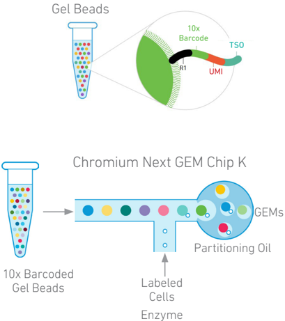

Step 1 GEM Generation &amp; Barcoding

Immediately following GEM generation, the Gel Bead is dissolved and any copartitioned cell is lysed. Gel Bead primers containing (i) an Illumina TruSeq Read 1 sequence (read 1 sequencing primer), (ii) a 16 nt 10x Barcode, (iii) a 10 nt unique molecular identifier (UMI), and (iv) 13 nt template switch oligo (TSO) are released and mixed with the cell lysate and a Master Mix containing reverse transcription (RT) reagents and poly(dT) primers.

A. The  cell  lysate  and  the  released Gel Bead primer incubated with the Master  Mix  containing  RT  reagents, produce  10x  Barcoded,  full-length cDNA  from poly-adenylated mRNA.

B. Simultaneously in the  same partition, the Gel Bead primer captures the cell surface protein Feature  Barcode  conjugated  to  the antibody or to antibody and antigen containing (i) a Nextera  Read 2 (Read 2N), (ii) a 1 5 nt Feature Barcode, and (iii) Capture Sequence. Incubation of  the  GEMs  with  the  Master  Mix containing  RT  reagents,  produces 10x  Barcoded,  DNA  from  the  cell surface protein Feature Barcode.

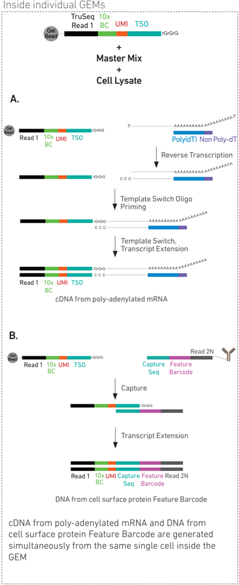

Step 2 Post GEM-RT Cleanup &amp; cDNA Amplification

GEMs are broken and pooled after GEM-RT reaction mixtures are recovered. Silane magnetic beads are used to purify the 10x Barcoded first-strand cDNA from polyadenylated  mRNA  and  DNA  from  cell  surface  protein/antigen  specificity  Feature Barcode from the post GEM-RT reaction mixture, which includes leftover biochemical reagents and primers.

10x Barcoded, full-length cDNA from poly-adenylated mRNA and DNA from protein Feature Barcode are  amplified.  Amplification generates sufficient material to construct multiple libraries from the same cells, e.g. both T and/or B cell libraries (steps 3 and 4), 5 ' Gene Expression libraries (step 5), and Cell Surface Protein libraries (step 6).

The amplified cDNA from  polyadenylated mRNA and the amplified DNA from cell surface protein Feature Barcode are separated by size selection for  generating  V(D)J  and/or  5 މ Gene  Expression  libraries  and Cell Surface Protein libraries, respectively.

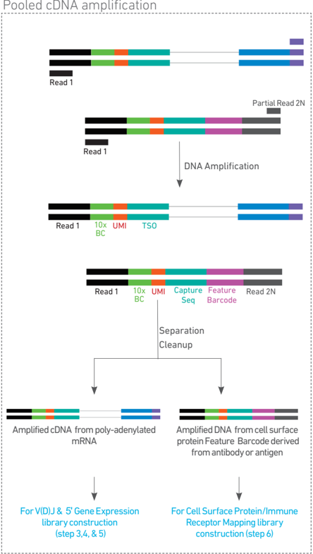

Step 3 V(D)J Amplification from cDNA

## Step 4 V(D)J Library Construction

## Step 5 5 މ Gene Expression (GEX) Library Construction

Amplified  full-length  cDNA from  poly-adenylated  mRNA is  used  to  enrich  full-length V(D)J segments (10x Barcoded) via PCR amplification with primers specific to either the TCR or BCR constant regions. If both T and B cells are expected to be present in the partitioned cell population, TCR and BCR transcripts can be amplified in separate reactions from the same amplified cDNA material.

Enzymatic fragmentation and size selection are used to generate variable  length  fragments that collectively span the V(D)J segments of the amplified TCR or BCR transcripts prior to library construction.

Pooled amplified cDNA processed in bulk

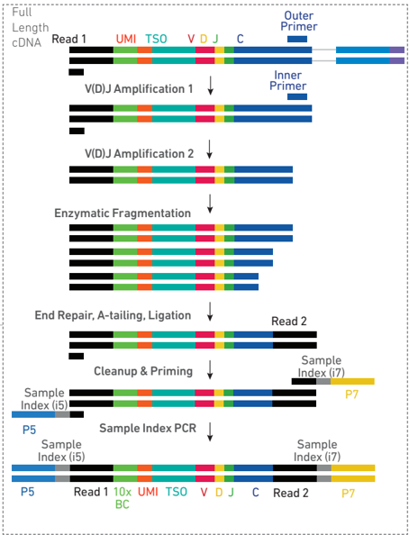

P5, P7, i5 and i7 sample indexes, and an Illumina R2 sequence (read 2 primer sequence) are added via End Repair, A-tailing, Adaptor Ligation, and Sample Index PCR. The final libraries contain the P5 and P7 priming sites used in Illumina sequencing.

Amplified full-length cDNA  from poly-adenylated mRNA is used to generate 5 މ Gene Expression library. Enzymatic fragmentation and size selection are used to optimize the cDNA amplicon size prior to 5' gene expression library construction. P5, P7, i5 and i7 sample indexes, and Illumina R2 sequence (read 2 primer sequence) are added via End Repair, A-tailing, Adaptor Ligation, and Sample Index PCR. The final libraries contain the P5 and P7 priming sites used in Illumina sequencers.

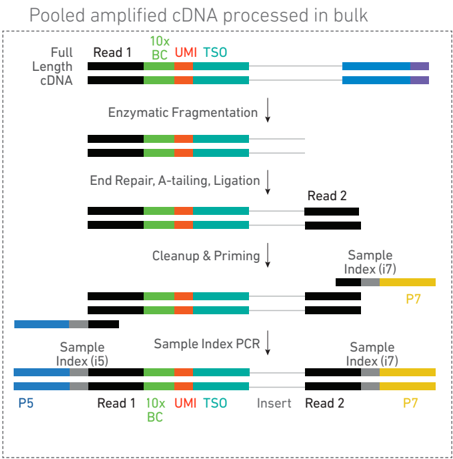

Step 6 Cell Surface Protein/ Immune Receptor Mapping Library Construction

Step 7 Sequencing

Amplified DNA from the cell surface protein Feature Barcodes derived from the antibody or antibody and multimeric MHC peptide complexes, such as Dextramer reagents is used to construct the Cell Surface Protein library.  A Cell Surface Protein library also detects antigen specificity if cells were labeled with both antibody and antigen.

P5, P7,  i5 and i7 sample indexes, and Nextera Read 2 (Read 2N primer sequence) are added via Sample Index PCR.

Pooled amplified DNA processed in bulk

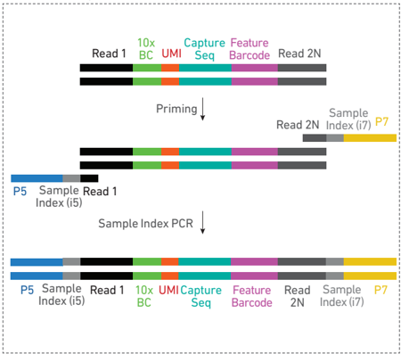

The final libraries contain the P5 and P7 priming sites used in Illumina sequencers.

Illumina-ready dual index libraries can be sequenced at the recommended depth &amp; run parameters. Illumina sequencer compatibility, sample indices, library loading and pooling for sequencing are summarized in step 7.

## Chromium Single Cell V(D)J Dual Index Library

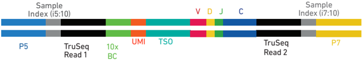

## Chromium Single Cell 5 މ Gene Expression Dual Index Library

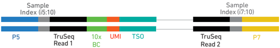

## Chromium Single Cell 5 މ Cell Surface Protein Dual Index Library*

*Detects antigen specificity in cells labeled with antibodies and antigen

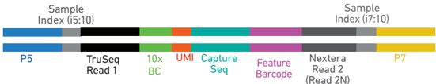

## See Appendix for Oligonucleotide Sequences

## Cell Labeling Guidelines


## Overview

Protein/s on the surface of a cell can be labeled with:

- a Feature Barcode oligonucleotide conjugated to a specific protein binding molecule, such as an antibody for detecting cell surface protein expression
- a Feature Barcode oligonucleotide conjugated to an MHC peptide, such as a dCODE Dextramer along with the Feature Barcode oligonucleotide conjugated antibody for mapping immune receptors

The Feature Barcode conjugated molecule bound to the cell surface protein can be directly captured by the Gel Bead inside a GEM during GEM generation and amplified (see Stepwise Objectives for assay scheme specifics). The amplified DNA generated from the Feature Barcode can be used for Cell Surface Protein/Immune Receptor Mapping Library Construction.

DNA from cell surface protein Feature Barcode

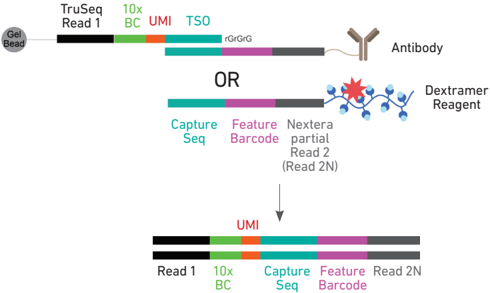

## Demonstrated Protocols for cell labeling

- Demonstrated  Protocol  Cell  Surface  Protein  Labeling  for  Single  Cell  RNA Sequencing Protocols with Feature Barcode technology (Document CG000149).
- Demonstrated Protocol Cell Labeling with Dextramer Reagents for Single Cell RNA Sequencing Protocols with Feature Barcode technology (Document CG000203).

## Cell Surface Protein Library:

Amplified DNA from the cell surface protein Feature Barcode derived from the antibody or antibody and antigen is used to construct the Cell Surface Protein library. If cells were labeled with both antibody and antigen, the cell surface protein library will also map immune receptor.

Failure to label cell surface proteins with a Feature Barcode conjugated to a specific protein binding molecule prior to using the cells for GEM Generation &amp; Barcoding will preclude generation of Cell Surface Protein library.

## Tips &amp; Best Practices


## Icons

## Version Specific Update

## Emulsion-safe Plastics

## Cell Concentration

## General Reagent Handling


Indicates version specific updates in a particular protocol step to inform users who have used a previous version of the product. The updates may be in volume, temperature, calculation instructions etc.

-  Use validated emulsion-safe plastic consumables when handling GEMs as some plastics can destabilize GEMs.
-  Recommended starting point is to load ~1700 cells per reaction, resulting in recovery of ~1000 cells, and a multiplet rate of ~0.8%. The optimal input cell concentration is 700-1,200 cells/µl.
-  The presence of dead cells in the suspension may also reduce the recovery rate. Consult the 10x Genomics Single Cell Protocols Cell Preparation Guide and the Guidelines for Optimal Sample Preparation flowchart (Documents CG00053 and CG000126 respectively) for more information on preparing cells.
-  Refer to the 10x Genomics Support website for more information regarding cell type specific sample preparation, for example, the Demonstrated Protocol for Enrichment of CD3+ T Cells from Dissociated Tissues for Single Cell RNA Sequencing and Immune Repertoire Profiling (Document CG000123).
-  Fully thaw and thoroughly mix reagents before use.
-  Keep all enzymes and Master Mixes on ice during setup and use. Promptly move reagents back to the recommended storage after use.
-  Calculate reagent volumes with 10% excess of 1 reaction values.
-  Cover Partitioning Oil tubes and reservoirs to minimize evaporation.
-  If using multiple chips, use separate reagent reservoirs for each chip during loading.
-  Thoroughly mix samples with the beads during bead-based cleanup steps.

| Multiplet Rate (%)   | # of Cells Loaded   | # of Cells Recovered   |
|----------------------|---------------------|------------------------|
| ~0.4%                | ~870                | ~500                   |
| ~0.8%                | ~1,700              | ~1,000                 |
| ~1.6%                | ~3,500              | ~2,000                 |
| ~2.3%                | ~5,300              | ~3,000                 |
| ~3.1%                | ~7,000              | ~4,000                 |
| ~3.9%                | ~8,700              | ~5,000                 |
| ~4.6%                | ~10,500             | ~6,000                 |
| ~5.4%                | ~12,200             | ~7,000                 |
| ~6.1%                | ~14,000             | ~8,000                 |
| ~6.9%                | ~15,700             | ~9,000                 |
| ~7.6%                | ~17,400             | ~10,000                |

## 50% Glycerol Solution

## Pipette Calibration

## Chromium Next GEM Chip Handling

## Chromium Next GEM Secondary Holders

-  Purchase 50% glycerol solution from Ricca Chemical Company, Glycerin (glycerol), 50% (v/v) Aqueous Solution, PN-3290-32.
-  Prepare 50% glycerol solution:
- i.  Mix an equal volume of water and 99% Glycerol, Molecular Biology Grade.
- ii.  Filter through a 0.2-µm filter.
- iii.  Store at -20°C in 1-ml LoBind tubes. 50% glycerol solution should be equilibrated to room temperature before use.
-  Follow manufacturer's calibration and maintenance schedules.
-  Pipette accuracy is particularly important when using SPRIselect reagents.
-  Minimize exposure of reagents, chips, and gaskets to sources of particles and fibers, laboratory wipes, frequently opened flip-cap tubes, clothing that sheds fibers, and dusty surfaces.
-  After removing the chip from the sealed bag, use in ” 24 h.
-  Execute steps without pause or delay, unless indicated. When multiple chips are to be used, load, run, and collect the content from one chip before loading the next.
-  Fill all unused input wells in rows labeled 1, 2, and 3 on a chip with an appropriate volume of 50% glycerol solution before loading the used wells. DO NOT add glycerol to the wells in the bottom NO FILL row.
-  Avoid contacting the bottom surface of the chip with gloved hands and other surfaces. Frictional charging can lead to inadequate priming of the channels, potentially leading to either clogs or wetting failures.
-  Minimize the distance that a loaded chip is moved to reach the Chromium Controller.
-  Keep the chip horizontal to prevent wetting the gasket with oil, which depletes the input volume and may adversely affect the quality of the resulting emulsion.
-  Chromium Next GEM Secondary Holders encase Chromium Next GEM Chips.
-  The holder lid flips over to become a stand, holding the chip at 45 degrees for optimal recovery well content removal.
-  Squeeze the black sliders on the back side of the holder together to unlock the lid and return the holder to a flat position.

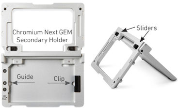

## Chromium Next GEM Chip &amp; Holder Assembly

## Chromium Next GEM Chip Loading

## Gel Bead Handling

-  Align notch on the chip (upper left corner) and the holder.
-  Insert the left-hand side of the chip under the guide. Depress the right-hand side of the chip until the spring-loaded clip engages.
-  Close the lid before dispensing reagents into the wells.
-  Place the assembled chip and holder flat on the bench with the lid closed.
-  Dispense at the bottom of the wells without introducing bubbles.
-  When dispensing Gel Beads into the chip, wait for the remainder to drain into the bottom of the pipette tips and dispense again to ensure complete transfer.
-  Refer to Load Chromium Next GEM Chip K for specific instructions.
-  Use one tube of Gel Beads per sample. DO NOT puncture the foil seals of tubes not used at the time.
-  Equilibrate the Gel Beads strip to room temperature before use.
-  Store unused Gel Beads at -80°C and avoid more than 12 freeze-thaw cycles. DO NOT store Gel Beads at -20°C.
-  Snap the tube strip holder with the Gel Bead strip into a 10x Vortex Adapter. Vortex 30 sec .
-  Centrifuge the Gel Bead strip for ~ 5 sec after removing from the holder. Confirm there are no bubbles at the bottom of the tubes and the liquid levels look even. Place the Gel Bead strip back in the holder and secure the holder lid.
-  If the required volume of beads cannot be recovered, place the pipette tips against the sidewalls and slowly dispense the Gel Beads back into the tubes. DO NOT introduce bubbles into the tubes and verify that the pipette tips contain no leftover Gel Beads. Withdraw the full volume of beads again by pipetting slowly.

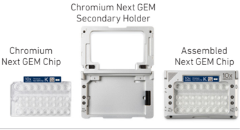

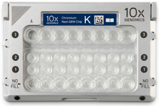

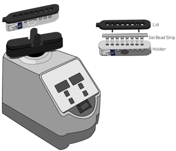

## 10x Gasket Attachment

## 10x Magnetic Separator

## Magnetic Bead Cleanup Steps

-  After reagents are loaded, attach the gasket by holding the tongue (curved end, to the right) and hook it on the left-hand tabs of the holder. Gently pull the gasket toward the right and hook it on the two right-hand tabs.
-  DO NOT touch the smooth side of the gasket. DO NOT press down on the top of the gasket after attachment.
-  Keep the assembly horizontal to avoid wetting the gasket with Partitioning Oil.
-  Offers two positions of the magnets (high and low) relative to a tube, depending on its orientation. Flip the magnetic separator over to switch between high (magnet· High) or low (magnet· Low) positions.
-  If using MicroAmp 8-Tube Strips, use the high position (magnet· High) only throughout the protocol.
-  During magnetic bead based cleanup steps that specify waiting 'until the solution clears', visually confirm clearing of solution before proceeding to the next step. See adjacent panel for an example.
-  The time need for the solution to clear may vary based on specific step, reagents, volume of reagents used etc.

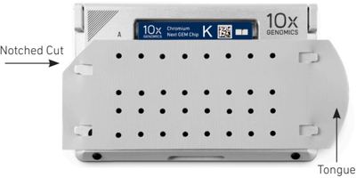

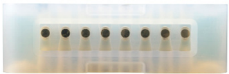

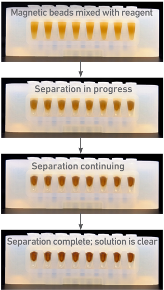

## SPRIselect Cleanup &amp; Size Selection

## cDNA Amplification PCR Cycle Numbers

-  After aspirating the desired volume of SPRIselect reagent, examine the pipette tips before dispensing to ensure the correct volume is transferred.
-  Pipette mix thoroughly as insufficient mixing of sample and SPRIselect reagent will lead to inconsistent results.
-  Use fresh preparations of 80% Ethanol.

## Tutorial - SPRIselect Reagent : DNA Sample Ratios

SPRI beads selectively bind DNA according to the ratio of SPRIselect reagent (beads).

Example: Ratio =  Volume of SPRIselect reagent added to the sample  =  50 µl  = 0.5X Volume of DNA sample 100 µl

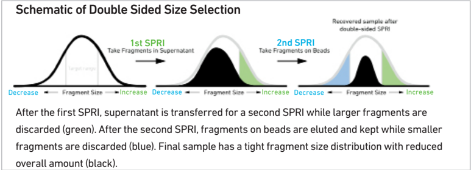

## Tutorial - Double Sided Size Selection

Step a - First SPRIselect : Add 50 µl SPRIselect reagent to 100 µl sample ( 0.5X ).

Ratio =  Volume of SPRIselect reagent added to the sample  =  50 µl  = 0.5X Volume of DNA sample 100 µl

Step b - Second SPRIselect: Add 30 µl SPRIselect reagent to supernatant from step a ( 0.8X ).

Ratio =  Total Volume of SPRIselect reagent added to the sample (step a + b)  =  50 µl + 30 µl   = 0.8X Original Volume of DNA sample 100 µl

-  Follow cycle number recommendations for high and low RNA content cells based on Targeted Cell Recovery and cell sample.

Recommended starting point for cycle number optimization.

| Targeted Cell Recovery   |   Low RNA Content Cells e.g., Primary Cells Total Cycles |   High RNA Content Cells e.g., Cell Lines Total Cycles |
|--------------------------|----------------------------------------------------------|--------------------------------------------------------|
| 500-2,000                |                                                       16 |                                                     14 |
| 2,001-6,000              |                                                       14 |                                                     12 |
| 6,001-10,000             |                                                       13 |                                                     11 |

## Enzymatic Fragmentation

## Sample Indices in Sample Index PCR

## Index Hopping Mitigation

-  Ensure enzymatic fragmentation reactions are prepared on ice and then loaded into a thermal cycler pre-cooled to 4°C prior to initiating the Fragmentation, End Repair, and A-tailing incubation steps.
-  Choose the appropriate sample index sets to ensure that no sample indices overlap in a multiplexed sequencing run.
-  Each well in the Dual Index Plate contains a unique i7 and a unique i5 oligonucleotide.
-  Use ONLY Dual Index Plate TT, Set A for V(D)J and 5 ' Gene Expression libraries. Use ONLY Dual Index Plate TN, Set A for Cell Surface Protein library.
-  Consider sample index compatibility when pooling different libraries; a unique sample index for each of the pooled libraries is required.
-  The sample indices of Dual Index Plate TT, Set A are unique from those of Dual Index Plate TN, Set A. Therefore, respective libraries from the two plates may be pooled.

Index hopping can impact pooled samples sequenced on Illumina sequencing platforms that utilize patterned flow cells and exclusion amplification chemistry. To minimize index hopping, follow the guidelines listed below.

-  Remove adapters during cleanup steps.
-  Ensure no leftover primers and/or adapters are present when performing postLibrary Construction QC.
-  Store each library individually at 4°C for up to 72 h or at -20°C for long-term storage. DO NOT pool libraries during storage.
-  Pool libraries prior to sequencing. An additional 1.0X SPRI may be performed for the pooled libraries to remove any free adapters before sequencing.
-  Hopped indices can be computationally removed from the data generated from single cell dual index libraries.

## Step 1

## GEM Generation &amp; Barcoding

- 1.1 Prepare Master Mix
- 1.2 Load Chromium Next GEM Chip K
- 1.3 Run the Chromium Controller
- 1.4 Transfer GEMs
- 1.5 GEM-RT Incubation

Click to TOC 1

## 1.0 GEM Generation &amp; Barcoding


Firmware Version 4.0 or higher is required in the Chromium Controller or the Chromium Single Cell Controller used for the Single Cell 5 ' v2 protocol.


| GET STARTED!                    | GET STARTED!                                                                                          | 10x PN                                                                                                | Preparation & Handling                                                                                | Storage                                                                                               |
|---------------------------------|-------------------------------------------------------------------------------------------------------|-------------------------------------------------------------------------------------------------------|-------------------------------------------------------------------------------------------------------|-------------------------------------------------------------------------------------------------------|
| Equilibrate to Room Temperature | Equilibrate to Room Temperature                                                                       | Equilibrate to Room Temperature                                                                       | Equilibrate to Room Temperature                                                                       | Equilibrate to Room Temperature                                                                       |
|                                 | Single Cell VDJ 5 ' Gel Bead                                                                          | 1000264/ 1000267                                                                                      | Equilibrate to room temperature 30 min before loading the chip.                                       | - 80°C                                                                                                |
|                                 | RT Reagent B                                                                                          | 2000165                                                                                               | Vortex, verify no precipitate, centrifuge briefly.                                                    | - 20°C                                                                                                |
|                                 | Poly-dT RT Primer                                                                                     | 2000007                                                                                               | Vortex, verify no precipitate, centrifuge briefly.                                                    | - 20°C                                                                                                |
|                                 | Reducing Agent B                                                                                      | 2000087                                                                                               | Vortex, verify no precipitate, centrifuge briefly.                                                    | - 20°C                                                                                                |
| Place on ice                    | Place on ice                                                                                          | Place on ice                                                                                          | Place on ice                                                                                          | Place on ice                                                                                          |
|                                 | RT Enzyme C                                                                                           | 2000085/ 2000102                                                                                      | Centrifuge briefly before adding to the mix.                                                          | - 20°C                                                                                                |
|                                 | Labeled Cells Refer to Demonstrated Protocols for Cell Surface Protein Labeling (CG000149, CG000203). | Labeled Cells Refer to Demonstrated Protocols for Cell Surface Protein Labeling (CG000149, CG000203). | Labeled Cells Refer to Demonstrated Protocols for Cell Surface Protein Labeling (CG000149, CG000203). | Labeled Cells Refer to Demonstrated Protocols for Cell Surface Protein Labeling (CG000149, CG000203). |
| Obtain                          | Obtain                                                                                                | Obtain                                                                                                | Obtain                                                                                                | Obtain                                                                                                |
|                                 | Partitioning Oil                                                                                      | 2000190                                                                                               | -                                                                                                     | Ambient                                                                                               |
|                                 | Chromium Next GEM Chip K Verify name & PN                                                             | 2000182                                                                                               | -                                                                                                     | Ambient                                                                                               |
|                                 | 10x Gasket                                                                                            | 370017/ 3000072                                                                                       | See Tips & Best Practices.                                                                            | Ambient                                                                                               |
|                                 | Chromium Next GEM Secondary Holder                                                                    | 3000332                                                                                               | See Tips & Best Practices.                                                                            | Ambient                                                                                               |
|                                 | 10x Vortex Adapter                                                                                    | 330002                                                                                                | See Tips & Best Practices.                                                                            | Ambient                                                                                               |
|                                 | 50% glycerol solution If using <8 reactions                                                           | -                                                                                                     | See Tips & Best Practices.                                                                            | -                                                                                                     |

## 1.1 Prepare Reaction Mix


Try


## a. Prepare Master Mix on ice. Pipette mix 15x and centrifuge briefly.


| Master Mix Add reagents in the order listed   | PN               |   1X (µl) |   4X + 10% (µl) |   8X + 10% (µl) |
|-----------------------------------------------|------------------|-----------|-----------------|-----------------|
| RT Reagent B                                  | 2000165          |      18.8 |            82.7 |           165.4 |
| Poly-dT RT Primer T                           | 2000007          |       7.3 |            32.1 |            64.2 |
| Reducing Agent B                              | 2000087          |       1.9 |             8.4 |            16.7 |
| RT Enzyme C                                   | 2000085/ 2000102 |       8.3 |            36.5 |            73.0 |
| Total                                         | -                |      36.3 |           159.7 |           319.3 |

b. Add 36.3 µl Master Mix into each tube of a PCR 8-tube strip on ice.

## Assemble Chromium Next GEM Chip

After removing the chip from the sealed bag, use the chip in ≤ 24 h.

See Tips &amp; Best Practices for chip handling instructions.

- Align notch on the chip (upper left corner) and the holder.
-  Insert the left-hand side of the chip under the guide. Depress the righthand side of the chip until the springloaded clip engages.
-  Close the lid before dispensing reagents into the wells.
-  The assembled chip is ready for loading the indicated reagents. Refer to step 1.2 for reagent volumes and loading order.

Assembled Chip

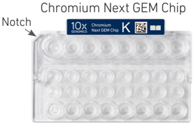

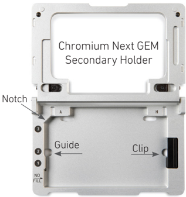

For GEM generation, load the indicated reagents  only  in  the  specified  rows, starting  from  row  labeled  1,  followed by rows labeled 2 and 3.   DO NOT  load reagents  in  the  bottom  row  labeled NO FILL.  See step 1.2 for details.

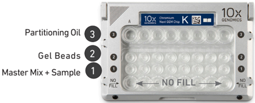


## Cell Suspension Volume Calculator Table

(for step 1.2 of Chromium Next GEM Single Cell 5 ' v2 (Dual Index) protocol)

Volume of Cell Suspension Stock per reaction (µl) | Volume of Nuclease-free Water per reaction (µl)

| Stock Concentration (Cells/µl)   | Targeted Cell Recovery   | Targeted Cell Recovery   | Targeted Cell Recovery   | Targeted Cell Recovery   | Targeted Cell Recovery   | Targeted Cell Recovery     | Targeted Cell Recovery   | Targeted Cell Recovery   | Targeted Cell Recovery   | Targeted Cell Recovery   | Targeted Cell Recovery   |
|----------------------------------|--------------------------|--------------------------|--------------------------|--------------------------|--------------------------|----------------------------|--------------------------|--------------------------|--------------------------|--------------------------|--------------------------|
| Stock Concentration (Cells/µl)   | 500                      | 1000                     | 2000                     | 3000                     | 4000                     | 5000                       | 6000                     | 7000                     | 8000 9000                | 10000                    |                          |
| 100 8.3 30.4                     | 16.5                     | 33.0 22.2                | n/a 5.7                  | n/a                      | n/a                      | n/a                        | n/a                      | n/a                      | n/a                      | n/a                      |                          |
| 200 4.1 34.6                     | 8.3 30.4                 | 16.5 22.2                | 24.8 13.9                | 33.0 5.7                 |                          | n/a n/a                    | n/a                      | n/a                      | n/a                      | n/a                      |                          |
| 300 2.8 35.9                     | 5.5 33.2                 | 11.0 27.7                | 16.5 22.2                | 22.0 16.7                | 27.5 11.2                | 33.0 5.7                   | n/a                      | n/a                      | n/a                      | n/a                      |                          |
| 400 2.1 36.6                     | 4.1 34.6                 | 8.3 30.5                 | 12.4 26.3                |                          | 16.5 22.2                | 20.6 18.1                  | 24.8 13.9                | 28.9 33.0 9.8 5.7        | n/a                      | n/a                      |                          |
| 500 1.7 37.0                     | 3.3 35.4 1.4             | 6.6 32.1                 | 9.9 28.8                 | 13.2 25.5                | 16.5 11.0                | 22.2 13.8                  | 19.8 23.1 18.9 15.6 16.5 | 26.4 12.3                | 29.7 9.0                 | 33.0 5.7 27.5            |                          |
| 600 37.3 700 1.2 37.5            | 2.8 35.9 2.4             | 5.5 33.2 4.7             | 8.3 30.5 7.1             |                          | 27.7 9.4 29.3            | 24.9 11.8                  | 19.3 22.2 19.4 16.5      | 22.0 16.7                | 24.8 13.9 21.2           | 11.2 23.6 15.1           |                          |
| 800 1.0                          | 36.3 2.1 36.6            | 34.0 4.1                 | 31.6                     | 8.3 30.4                 | 26.9 10.3                | 14.1 24.6 12.4             | 22.2 14.4                | 18.9 19.8 16.5           | 17.5                     | 20.6                     |                          |
| 37.7 900 0.9                     | 1.8 36.9                 | 34.6 3.7 35.0            | 6.2 32.5 5.5             | 7.3                      | 28.4 9.2 29.5            | 26.3 11.0 27.7             | 24.3 12.8 25.9           | 22.2 14.7                | 18.6 20.1 16.5           | 18.1                     |                          |
| 37.8 1000 0.8 37.9               | 1.7 37.0                 | 3.3 35.4                 | 33.2 5.0                 | 33.7                     | 31.4 6.6 32.1            | 8.3 9.9 30.4 28.8 9.0 29.7 | 11.6 27.1 10.5           | 13.2 25.5 12.0           | 24.0 22.2 14.9 23.8      | 18.3 20.4 16.5 22.2      |                          |
| 1100 0.8 37.9                    | 1.5 37.2                 | 3.0 35.7                 | 4.5                      | 34.2                     | 6.0 32.7 5.5             | 7.5 31.2                   | 28.2                     | 26.7                     | 13.5 25.2                | 15.0 23.7                |                          |
| 1200 0.7 38.0                    | 1.4 37.3                 | 2.8 35.9                 |                          | 4.1 34.6                 | 33.2                     | 6.9 31.8                   | 8.3 9.6 30.4 29.1        | 11.0 27.7                | 12.4 26.3                | 13.8                     |                          |
| 1300 0.6 38.1                    | 1.3 37.4                 | 2.5 36.2                 | 3.8 34.9                 |                          | 5.1 33.6                 | 6.3 32.4                   | 7.6 8.9 31.1 29.8        | 10.2 28.5                | 11.4 27.3                | 24.9 12.7                |                          |
| 1400 0.6 38.1                    | 1.2 37.5                 | 2.4 36.3 2.2             | 3.5 35.2                 |                          | 4.7 34.0                 | 5.9 32.8 5.5               | 7.1 8.3 31.6 30.4        | 9.4 29.3                 | 10.6 28.1 9.9            | 26.0 11.8                |                          |
| 1500 0.6 38.1                    | 1.1 37.6                 | 36.5                     | 3.3 35.4                 |                          | 4.4 34.3                 | 6.6 32.1 6.2               | 7.7 31.0                 | 8.8 29.9                 | 28.8 9.3                 | 26.9 11.0 27.7           |                          |
| 1600 0.5                         | 1.0                      | 2.1                      | 3.1                      |                          | 4.1                      | 33.2 5.2 33.5              | 7.2                      | 8.3                      |                          |                          |                          |
| 38.2 0.5                         | 37.7 1.0                 | 36.6 1.9 36.8            | 2.9                      | 35.6 35.8                | 34.6 3.9                 | 4.9 33.8                   | 32.5 31.5 5.8 6.8 31.9   | 30.4 7.8                 |                          | 10.3 28.4 9.7            |                          |
| 1700 38.2                        | 37.7                     |                          |                          |                          |                          |                            |                          | 30.9                     | 29.4 8.7 30.0            |                          |                          |
| 0.5                              | 0.9                      | 1.8                      | 2.8                      |                          | 34.8 3.7                 | 32.9 5.5 33.2              | 6.4 32.3                 | 7.3                      | 8.3                      | 29.0 9.2                 |                          |
| 1800                             | 37.8                     | 36.9                     | 35.9                     |                          | 35.0                     | 4.6 34.1                   |                          | 31.4                     |                          | 29.5                     |                          |
| 38.2                             |                          |                          |                          |                          |                          |                            |                          |                          | 30.5                     |                          |                          |
| 38.3                             | 0.9                      | 1.7                      | 2.6                      |                          |                          |                            | 6.1                      | 6.9                      |                          | 8.7                      |                          |
| 0.4                              |                          |                          |                          |                          |                          |                            |                          | 31.8                     |                          |                          |                          |
| 1900                             |                          | 37.0                     |                          |                          | 3.5 35.2                 | 4.3 34.4                   | 32.6                     |                          | 7.8 30.9                 |                          |                          |
|                                  | 37.8                     |                          |                          |                          |                          |                            |                          |                          |                          | 30.0                     |                          |
| 2000                             | 0.4 0.8                  | 1.7                      | 36.1 2.5                 |                          | 3.3                      | 5.2 33.5 4.1 5.0           | 5.8                      | 6.6                      | 7.4                      | 8.3                      |                          |

Grey boxes: Yellow boxes: Blue boxes:

Volumes that would exceed the allowable water volume in each reaction

Indicate a low transfer volume that may result in higher cell load variability

Optimal range of cell stock concentration to maximize the likelihood of achieving the desired cell recovery target

## 1.2 Load Chromium Next GEM Chip K


the chip from the sealed bag, use in ≤ 24 h. For all chip loading steps , raising and depressing the pipette plunger should each take ~5 sec . When dispensing, raise the pipette tips at the same rate as the liquid is rising, keeping the tips

After removing !

- slightly submerged.


Attach the gasket and run the chip in the Chromium Controller immediately after loading the Partitioning Oil. !

## a.  Dispense 50% Glycerol into Unused Chip Wells (if &lt; 8 samples per chip)

- i. 70 µl to unused wells in row labeled 1 .
- ii. 50 µl to unused wells in row labeled 2 .
- iii. 45 µl to unused wells in row labeled 3 .

## b.  Prepare Master Mix + Cell Suspension

Refer to the Cell Suspension Volume Calculator Table. Add the appropriate volume of nuclease-free water first, followed by corresponding volume of single cell suspension to Master Mix for a total of 75 µl in each tube. Gently pipette mix the cells suspension before adding to the Master Mi x.

## c.  Load Row Labeled 1

Gently pipette mix the Master Mix + Cell Suspension and using the same pipette tip, dispense 70 µl Master Mix + Cell Suspension into the bottom center of each well in row labeled 1 without introducing bubbles.


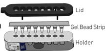

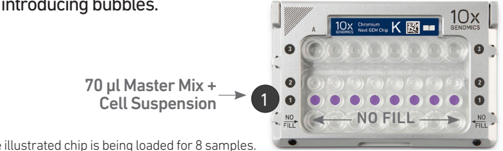

## d.  Prepare Gel Beads

Snap the tube strip holder with the Gel Bead strip into a 1 0x Vortex Adapter. Vortex 30 sec. Centrifuge the Gel Bead strip for ~ 5 sec . Confirm there are no bubbles at the bottom of the tubes and the liquid levels are even. Place the Gel Bead strip back in the holder . Secure the holder lid.

## e.  Load Row Labeled 2

Puncture the foil seal of the Gel Bead tubes. Slowly aspirate 50 µl Gel Beads. Dispense into the wells in row labeled 2 without introducing bubbles. Wait 30 sec .

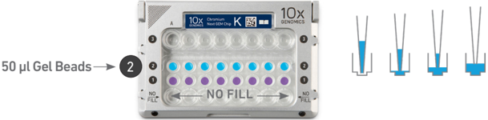

## f.  Load Row Labeled 3

Dispense 45 µl Partitioning Oil into the wells in row labeled 3 from a reagent reservoir. Failure to add Partitioning Oil to the top row labeled 3 will prevent GEM generation and can damage the Chromium Controller.

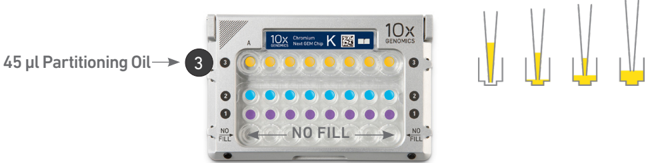

## g.  Attach 10x Gasket

Align the notch with the top left-hand corner. Ensure the gasket holes are aligned with the wells. Avoid touching the smooth surface.

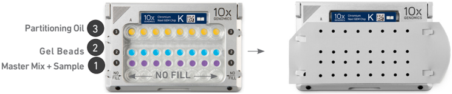

Keep horizontal to avoid wetting the gasket. DO NOT press down on the gasket.

DO NOT add 50% glycerol solution to the bottom row of NO FILL wells. DO NOT use any substitute for 50% glycerol solution.

## 1.3 Run the Chromium Controller

## 1.4 Transfer GEMs


- a. Press the eject button on the Controller to eject the tray.
- b. Place the assembled chip with the gasket in the tray, ensuring that the chip stays horizontal. Press the button to retract the tray.
- c. Confirm the Chromium Chip K program on screen. Press the play button.
- d. At completion of the run (~18 min), the Controller will chime. Immediately proceed to the next step.
- a. Place a tube strip on ice.
- b. Press the eject button of the Controller and remove the chip.
- c. Discard the gasket. Open the chip holder. Fold the lid back until it clicks to expose the wells at 45 degrees.
- d. Check the volume in rows labeled 1-2. Abnormally high volume in any well indicates a clog.
- e. Slowly aspirate 100 µl GEMs from the lowest points of the recovery wells in the top row labeled 3 without creating a seal between the pipette tips and the bottom of the wells.
- f. Withdraw pipette tips from the wells. GEMs should appear opaque and uniform across all channels. Excess Partitioning Oil (clear) in the pipette tips indicates a potential clog.
- g. Over the course of ~20 sec , dispense GEMs into the tube strip on ice with the pipette tips against the sidewalls of the tubes.
- h. If multiple chips are run back-to-back, cap/ cover the GEM-containing tube strip and place on ice for no more than 1 h .


Firmware Version 4.0 or higher is required in the Chromium Controller or the Chromium Single Cell Controller used for the Single Cell 5 ' v2 protocol.

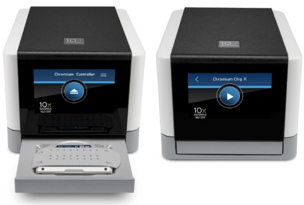

Expose Wells at 45 Degrees

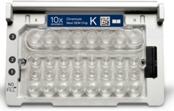

Transfer GEMs

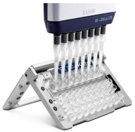

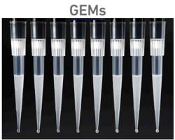

## 1.5 GEM-RT Incubation


Use a thermal cycler that can accommodate at least 100 µl volume. A volume of 125 µl is the preferred setting on Bio-Rad C1000 Touch. In alternate thermal cyclers, use highest reaction volume setting.

- a. Incubate in a thermal cycler with the following protocol.

| Lid Temperature   | Reaction Volume   | Run Time   |
|-------------------|-------------------|------------|
| 53°C              | 125 µl            | ~55 min    |
| Step              | Temperature       | Time       |
| 1                 | 53°C              | 00:45:00   |
| 2                 | 85°C              | 00:05:00   |
| 3                 | 4°C               | Hold       |

b. Store at 4°C for up to 72 h or at -20°C for up to a week , or proceed to the next step.

## Step 2

## Post GEM-RT Cleanup &amp; cDNA Amplification

- 2.1 Post GEM-RT Cleanup - Dynabeads
- 2.2 cDNA Amplification
- 2.3 cDNA Cleanup - SPRIselect
- 2.1 cDNA QC &amp; Amplification

Click to TOC 2

## 2.0 Post GEM-RT Cleanup &amp; cDNA Amplification


| GET STARTED! Item                                         | 10x PN           | Preparation & Handling                                                                                                                                  | Storage   |
|-----------------------------------------------------------|------------------|---------------------------------------------------------------------------------------------------------------------------------------------------------|-----------|
| Equilibrate to Room Temperature                           |                  |                                                                                                                                                         |           |
| Reducing Agent B                                          | 2000087          | Thaw, vortex, verify no precipitate, centrifuge briefly.                                                                                                | - 20°C    |
| Feature cDNA Primers 4                                    | 2000277          | Thaw, vortex, centrifuge briefly.                                                                                                                       | - 20°C    |
| Dynabeads MyOne SILANE                                    | 2000048          | Vortex thoroughly ( • 30 sec) immediately before adding to the mix. If still clumpy, pipette mix to resuspend completely. DO NOT centrifuge before use. | 4°C       |
| Beckman Coulter SPRIselect Reagent                        | -                | Manufacturer's recommendations.                                                                                                                         | -         |
| Sensitivity Kit If used for QC and quantification         | -                | Manufacturer's recommendations.                                                                                                                         | -         |
| ScreenTape and Reagents If used for QC and quantification | -                | Manufacturer's recommendations.                                                                                                                         | -         |
| Qubit dsDNA HS Assay Kit If used for quantification       | -                | Manufacturer's recommendations.                                                                                                                         | -         |
| Place on ice                                              |                  |                                                                                                                                                         |           |
| Amp Mix                                                   | 2000047/ 2000103 | Vortex, centrifuge briefly.                                                                                                                             | - 20°C    |
| Thaw at 65 o C                                            |                  |                                                                                                                                                         |           |
| Cleanup Buffer                                            | 2000088          | Thaw for 10 min at 65°C at max speed on a thermomixer. Verify there are no visible crystals. Cool to room temperature.                                  | - 20°C    |
| Obtain                                                    |                  |                                                                                                                                                         |           |
| Recovery Agent                                            | 220016           | -                                                                                                                                                       | Ambient   |
| Qiagen Buffer EB                                          | -                | Manufacturer's recommendations.                                                                                                                         | Ambient   |
| Bio-Rad 10% Tween 20                                      | -                | Manufacturer's recommendations.                                                                                                                         | -         |
| 10x Magnetic Separator                                    | 230003           | -                                                                                                                                                       | Ambient   |
| Prepare 80% Ethanol Prepare 15 ml for 8 reactions         | -                | Prepare fresh.                                                                                                                                          | Ambient   |

## 2.1 Post GEM-RT Cleanup Dynabeads


- a. Add 125 µl Recovery Agent to each sample (post GEM-RT incubation) at room temperature. DO NOT pipette mix or vortex the biphasic mixture. Wait 2 min .

The resulting biphasic mixture contains Recovery Agent/Partitioning Oil (pink) and aqueous phase (clear), with no persisting emulsion (opaque).

If biphasic separation is incomplete:

Firmly secure the cap on the tube strip, ensuring that no liquid is trapped between the cap and the tube rim. Mix by inverting the capped tube strip 5x, centrifuge briefly, and proceed to step b. DO NOT invert without firmly securing the caps.

A smaller aqueous phase volume indicates a clog during GEM generation.

- b. Slowly remove and discard 125 µl Recovery Agent/Partitioning Oil (pink) from the bottom of the tube. DO NOT aspirate any aqueous sample.
- c. Prepare Dynabeads Cleanup Mix .
- d. Vortex and add 200 µl to each sample. Pipette mix 5x (pipette set to 200 µl).
- e. Incubate 10 min at room temperature (keep caps open).

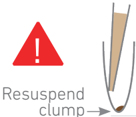


| Dynabeads Cleanup Mix Add reagents in the order listed                                                                                                                      | PN      |   1X (µl) |   4X + 10% (µl) |   8X + 10% (µl) |
|-----------------------------------------------------------------------------------------------------------------------------------------------------------------------------|---------|-----------|-----------------|-----------------|
| Nuclease-free Water                                                                                                                                                         |         |         5 |              22 |              44 |
| Cleanup Buffer                                                                                                                                                              | 2000088 |       182 |             801 |            1602 |
| Dynabeads MyOne SILANE Vortex thoroughly ( • 30 sec) immediately before adding to the mix. Aspirate the full liquid volume with a pipette tip to verify that the beads have | 2000048 |         8 |              35 |              70 |
| Reducing Agent B                                                                                                                                                            | 2000087 |         5 |              22 |              44 |
| Total                                                                                                                                                                       | -       |       200 |             880 |            1760 |

Add Dynabeads Cleanup Mix

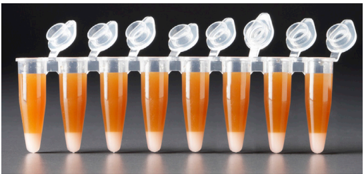

Remove Recovery Agent

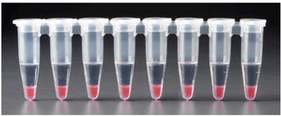

Biphasic Mixture

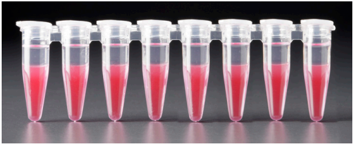

## f. Prepare Elution Solution I. Vortex and centrifuge briefly.


| Elution Solution I Add reagents in the order listed   | PN      |   1X (µl) |   10X (µl) |
|-------------------------------------------------------|---------|-----------|------------|
| Buffer EB                                             | -       |        98 |        980 |
| 10% Tween 20                                          | -       |         1 |         10 |
| Reducing Agent B                                      | 2000087 |         1 |         10 |
| Total                                                 | -       |       100 |       1000 |

- g. At the end of 10 min incubation, place on a 10x Magnetic Separator· High position (magnet· High) until the solution clears.

A white interface between the aqueous phase and Recovery Agent is normal.

- h. Remove the supernatant.
- i. Add 300 µl 80% ethanol to the pellet while on the magnet. Wait 30 sec .
- j. Remove the ethanol.
- k. Add 200 µl 80% ethanol to pellet. Wait 30 sec .
- l. Remove the ethanol.

m. Centrifuge briefly. Place on the 10x Magnetic Separator· Low position ( magnet· Low) .

- n. Remove remaining ethanol. Air dry for 2 min .
- o. Remove from the magnet. Immediately add 35.5 µl Elution Solution I.
- p. Pipette mix (pipette set to 30 µl) without introducing bubbles. Pipette mix 15x. If beads still appear clumpy, continue pipette mixing until fully resuspended.
- q. Incubate 1 min at room temperature .
- r. Place on the magnet· Low until the solution clears.
- s. Transfer 35 µl sample to a new tube strip.

## 2.2 cDNA Amplification


## a. Prepare cDNA Amplification Mix on ice. Vortex and centrifuge briefly.


| cDNA Amplification Mix Add reagents in the order listed   | PN               |   1X (µl) |   4X + 10% (µl) |   8X + 10% (µl) |
|-----------------------------------------------------------|------------------|-----------|-----------------|-----------------|
| Amp Mix                                                   | 2000047/ 2000103 |        50 |             220 |             440 |
| Feature cDNA Primers 4 Verify name & PN                   | 2000277          |        15 |              66 |             132 |
| Total                                                     | -                |        65 |             286 |             572 |

b. Add 65 µl cDNA Amplification Mix to 35 µl sample (Post GEM-RT Cleanup, step 2.1s).

- c. Pipette mix 5x (pipette set to 90 µl). Centrifuge briefly.
- d. Incubate in a thermal cycler with the following protocol.

| Lid Temperature   | Reaction Volume                                     | Run Time                                            |
|-------------------|-----------------------------------------------------|-----------------------------------------------------|
| 105°C             | 100 µl                                              | ~25-50 min                                          |
| Step              | Temperature                                         | Time                                                |
| 1                 | 98°C                                                | 00:00:45                                            |
| 2                 | 98°C                                                | 00:00:20                                            |
| 3                 | 63°C                                                | 00:00:30                                            |
| 4                 | 72°C                                                | 00:01:00                                            |
| 5                 | Go to Step 2, see table below for total # of cycles | Go to Step 2, see table below for total # of cycles |
| 6                 | 72°C                                                | 00:01:00                                            |
| 7                 | 4°C                                                 | Hold                                                |

Recommended starting point for cycle number optimization.

| Targeted Cell Recovery   |   Low RNA Content Cells e.g., Primary Cells Total Cycles |   High RNA Content Cells e.g., Cell Lines Total Cycles |
|--------------------------|----------------------------------------------------------|--------------------------------------------------------|
| 500-2,000                |                                                       16 |                                                     14 |
| 2,001-6,000              |                                                       14 |                                                     12 |
| 6,001-10,000             |                                                       13 |                                                     11 |

The optimal number of cycles is a trade-off between generating sufficient final mass for library construction and minimizing PCR amplification artifacts.

- e. Store at 4°C for up to 72 h or -20°C for ≤ 1 week , or proceed to the next step.

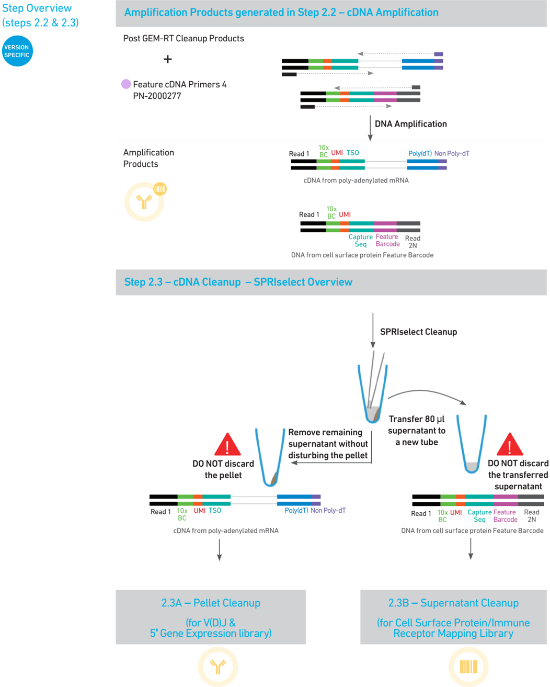

## 2.3 cDNA Cleanup SPRIselect


- a. Vortex to resuspend the SPRIselect reagent. Add 60 µl SPRIselect reagent (0.6X) to each sample and pipette mix 15x (pipette set to 140 µl).
- b. Incubate 5 min at room temperature .
- c. Place on the magnet· High until the solution clears.
- d. Transfer and save 80 µl supernatant in a new tube strip without disturbing the pellet. Maintain at room temperature . DO NOT discard the transferred supernatant (cleanup for Cell Surface Protein  library construction).
- e. Remove the remaining supernatant from the pellet without disturbing the pellet. DO NOT discard the pellet (cleanup for V(D)J and 5 މ Gene Expression library construction). Immediately proceed to Pellet Cleanup (step 2.3A).

## 2.3A  Pellet Cleanup

(for V(D)J &amp; 5 މ Gene Expression library)

- i. Add 200 µl 80% ethanol to the pellet while still on magnet· High . Wait 30 sec .
- ii. Remove the ethanol.
- iii.  Repeat steps i and ii for a total of 2 washes.
- iv. Centrifuge briefly and place on the magnet· Low .
- v. Remove any remaining ethanol. Air dry for 2 min . DO NOT exceed 2 min as this will decrease elution efficiency.
- vi. Remove from the magnet. Add 45.5 µl Buffer EB. Pipette mix 15x.
- vii. Incubate 2 min at room temperature .
- viii. Place the tube strip on the magnet· High until the solution clears.
- ix. Transfer 45 µl sample to a new tube strip.


Store at 4°C for up to 72 h or at -20°C for up to 4 weeks , or proceed to step 2.4 for cDNA

- x. QC &amp; Quantification. STOP

## 2.3B Transferred Supernatant Cleanup

## (for Cell Surface Protein/Immune Receptor Mapping library)

- i. Vortex to resuspend the SPRIselect reagent. Add 70 µl SPRIselect reagent (2.0X) to 80 µl of the transferred supernatant and pipette mix 15x (pipette set to 150 µl).
- ii. Incubate for 5 min at room temperature .
- iii. Place on the magnet· High until the solution clears.
- iv. Remove the supernatant.
- v. Add 200 µl 80% ethanol to the pellet. Wait 30 sec .
- vi. Remove the ethanol.
- vii.   Repeat steps v and vi for a total of 2 washes.
- viii. Centrifuge briefly and place on the magnet· Low .
- ix. Remove any remaining ethanol. Air dry for 2 min . DO NOT exceed 2 min as this will decrease elution efficiency.
- x. Remove from the magnet. Add 45.5 µl Buffer EB. Pipette mix 15x.
- xi. Incubate 2 min at room temperatur e.
- xii. Place the tube strip on the magnet· High until the solution clears.
- xiii. Transfer 45 µl sample to a new tube strip.


xiv. Store at 4°C for up to 72 h or at -20°C for up to 4 weeks , or proceed directly to step 6 for Cell Surface Protein/Immune Receptor Mapping Library. STOP

## 2.4 cDNA QC &amp; Quantification

For 5 މ Gene Expression Library Construction proceed directly to step 5 after step 2.4.


- a. Run 1 µl undiluted sample from the Pellet Cleanup step 2.3A-x (Dilution Factor 1) on an Agilent Bioanalyzer High Sensitivity chip. Run 1 µl undiluted product for input cells with low RNA content (&lt;1pg total RNA/cell), and 1 µl of 1:10

diluted product for input cells with high RNA content.


- b. If proceeding to 5 މ GEX Library Construction (step 5), determine cDNA yield for each sample. Example calculation below.

## EXAMPLE CALCULATION

- i.  Select Region

Under the 'Electropherogram' view choose the 'Region Table'. Manually select the region of ~200 - ~9000 bp


- ii. Note Concentration [pg/µl]


```
iii. Calculate Concentration: 1622.44 pg/µl Dilution Factor: 1 cDNA Conc. = Conc. (pg/µl) x Dilution Factor  =  1622.44 x 1  = 1.6 ng/µl 1000 (pg/ng) 1000
```

Example Calculation for Carrying Forward 50 ng Sample for 5 މ GEX Library Construction

<!-- formula-not-decoded -->

- If the volume required for 50 ng is less than 20 µl, adjust the total volume of each sample to 20 µl with nuclease-free water.
- If the volume for 50 ng exceeds 20 µl (as in above example), carry ONLY 20 µl sample into library construction.

Sample volume for library construction

= 20 µl

If &lt;50 ng available, carry forward 20 µl sample (2-50 ng) into 5 ' GEX Library Construction.

DO NOT exceed a mass of 50 ng in the 20 µl carry forward volume.


Alternate Quantification Methods ( See Appendix for representative traces)

- Agilent TapeStation.
- LabChip
- Qubit Fluorometer and Qubit dsDNA HS Assay Kit.

## Step 3

## V(D)J Amplification from cDNA

- 3.1 V(D)J Amplification 1
- 3.2 Post V(D)J Amplification 1 Cleanup - Double Sided Size Selection - SPRIselect
- 3.3 V(D)J Amplification 2
- 3.4 Post V(D)J Amplification 2 Cleanup - Double Sided Size Selection - SPRIselect
- 3.5 Post V(D)J Amplification QC &amp; Quantification

Click to TOC 3

## 3.0 V(D)J Amplification from cDNA


| GET STARTED! Item                                                                       | 10x PN                                                                                  | Preparation & Handling                                                                  | Storage                                                                                 |
|-----------------------------------------------------------------------------------------|-----------------------------------------------------------------------------------------|-----------------------------------------------------------------------------------------|-----------------------------------------------------------------------------------------|
| Equilibrate to Room Temperature                                                         | Equilibrate to Room Temperature                                                         | Equilibrate to Room Temperature                                                         | Equilibrate to Room Temperature                                                         |
| For Human Samples ( Choose B or T-cell primers based on desired amplification products) | For Human Samples ( Choose B or T-cell primers based on desired amplification products) | For Human Samples ( Choose B or T-cell primers based on desired amplification products) | For Human Samples ( Choose B or T-cell primers based on desired amplification products) |
| Human T Cell Mix 1 v2                                                                   | 2000242                                                                                 | Thaw, vortex, centrifuge briefly.                                                       | - 20°C                                                                                  |
| Human T Cell Mix 2 v2                                                                   | 2000246                                                                                 | Thaw, vortex, centrifuge briefly                                                        | - 20°C                                                                                  |
| Human B Cell Mix 1 v2                                                                   | 2000254                                                                                 | Thaw, vortex, centrifuge briefly                                                        | - 20°C                                                                                  |
| Human B Cell Mix 2 v2                                                                   | 2000255                                                                                 | Thaw, vortex, centrifuge briefly                                                        | - 20°C                                                                                  |
| For Mouse Samples ( Choose B or T-cell primers based on desired amplification products) | For Mouse Samples ( Choose B or T-cell primers based on desired amplification products) | For Mouse Samples ( Choose B or T-cell primers based on desired amplification products) | For Mouse Samples ( Choose B or T-cell primers based on desired amplification products) |
| Mouse T Cell Mix 1 v2                                                                   | 2000256                                                                                 | Thaw, vortex, centrifuge briefly                                                        | - 20°C                                                                                  |
| Mouse T Cell Mix 2 v2                                                                   | 2000257                                                                                 | Thaw, vortex, centrifuge briefly                                                        | - 20°C                                                                                  |
| Mouse B Cell Mix 1 v2                                                                   | 2000258                                                                                 | Thaw, vortex, centrifuge briefly                                                        | - 20°C                                                                                  |
| Mouse B Cell Mix 2 v2                                                                   | 2000259                                                                                 | Thaw, vortex, centrifuge briefly                                                        | - 20°C                                                                                  |
| For all Samples                                                                         | For all Samples                                                                         | For all Samples                                                                         | For all Samples                                                                         |
| Beckman Coulter SPRIselect Reagent                                                      | -                                                                                       | Manufacturer's recommendations.                                                         | -                                                                                       |
| Sensitivity Kit If used for QC and                                                      | -                                                                                       | Manufacturer's recommendations.                                                         | -                                                                                       |
| Agilent TapeStation ScreenTape and Reagents If used for QC and quantification           | -                                                                                       | Manufacturer's recommendations.                                                         | -                                                                                       |
| Qubit dsDNA HS Assay Kit If used for quantification                                     | -                                                                                       | Manufacturer's recommendations.                                                         | -                                                                                       |
| Place on ice                                                                            | Place on ice                                                                            | Place on ice                                                                            | Place on ice                                                                            |
| Amp Mix                                                                                 | 2000047/ 2000103                                                                        | Vortex, centrifuge briefly.                                                             | - 20°C                                                                                  |
| Obtain                                                                                  | Obtain                                                                                  | Obtain                                                                                  | Obtain                                                                                  |
| Qiagen Buffer EB                                                                        | -                                                                                       | Manufacturer's recommendations.                                                         | Ambient                                                                                 |
| 10x Magnetic Separator                                                                  | 230003                                                                                  | -                                                                                       | Ambient                                                                                 |
| Prepare 80% Ethanol Prepare 15 ml for 8 reactions                                       | -                                                                                       | Prepare fresh.                                                                          | Ambient                                                                                 |

## 3.1 V(D)J Amplification 1


- a. Place a tube strip on ice and transfer 2 µl sample (post cDNA Amplification &amp; QC, step 2.3A) to the same tube.
- b. Prepare V(D)J Amplification 1 Reaction Mix on ice. Vortex and centrifuge briefly.
- c. Add 98 µl V(D)J Amplification 1 Reaction Mix to each tube containing 2 µl sample.
- d. Pipette mix 5x (pipette set to 90 µl). Centrifuge briefly.
- e. Incubate in a thermal cycler with the following protocol.
- f. Store at 4°C for up to 72 h or proceed to the next step.


| V(D)J Amplification 1 Reaction Mix Add reagents in the order listed   | PN                                                           |   1X (µl) |   4X + 10% (µl) |   8X + 10% (µl) |
|-----------------------------------------------------------------------|--------------------------------------------------------------|-----------|-----------------|-----------------|
| Amp Mix                                                               | 2000047/ 2000103                                             |        50 |             220 |             440 |
| T Cell Mix 1 v2 or B Cell Mix 1 v2                                    | Human 2000242/ Mouse 2000256 or Human 2000254/ Mouse 2000258 |        48 |           211.2 |           422.4 |
| Total                                                                 | -                                                            |        98 |           431.2 |           862.4 |

| Lid Temperature                           | Reaction Volume                                                                      | Run Time                                                                             |
|-------------------------------------------|--------------------------------------------------------------------------------------|--------------------------------------------------------------------------------------|
| 105°C                                     | 100 µl                                                                               | ~20-30 min                                                                           |
| Step                                      | Temperature                                                                          | Time                                                                                 |
| 1                                         | 98°C                                                                                 | 00:00:45                                                                             |
| 2                                         | 98°C                                                                                 | 00:00:20                                                                             |
| 3                                         | 62°C                                                                                 | 00:00:30                                                                             |
| 4                                         | 72°C                                                                                 | 00:01:00                                                                             |
| 5 Different cycle numbers for T & B cells | T Cell: Go to Step 2, 11x (total 12 cycles) B Cell Go to Step 2, 7x (total 8 cycles) | T Cell: Go to Step 2, 11x (total 12 cycles) B Cell Go to Step 2, 7x (total 8 cycles) |
| 6                                         | 72°C                                                                                 | 00:01:00                                                                             |
| 7                                         | 4°C                                                                                  | Hold                                                                                 |

## 3.2 Post V(D)J Amplification 1 Cleanup Double Sided Size Selection - SPRIselect


- a. Vortex to resuspend the SPRIselect reagent. Add 50 µl SPRIselect reagent (0.5X) to each sample. Pipette mix 15x (pipette set to 140 µl).
- b. Incubate 5 min at room temperature .
- c. Place tube strip on the magnet· High until the solution clears.

DO NOT discard supernatant.

- d. Transfer 145 µl supernatant to a new tube strip.
- e. Vortex to resuspend SPRIselect reagent. Add 30 µl SPRIselect reagent (0.8X) to each sample. Pipette mix 15x (pipette set to 150 µl).
- f. Incubate 5 min at room temperature .
- g. Place on the magnet· High until the solution clears.
- h. Remove 170 µl supernatant. DO NOT discard any beads.
- i. Add 200 µl 80% ethanol. Wait 30 sec .
- j. Remove the ethanol.
- k. Repeat steps i and j for a total of 2 washes.
- l. Centrifuge briefly. Place on the magnet· Low .
- m. Remove remaining ethanol wash. DO NOT over-dry beads to ensure maximum elution efficiency.
- n. Remove from the magnet. Add 35.5 µl Buffer EB. Pipette mix 15x.
- o. Incubate 2 min at room temperature .
- p. Place on the magnet· Low until the solution clears.
- q. Transfer 35 µl sample to a new tube strip.
- r. Store at 4°C for up to 72 h or at -20°C for up to 1 week , or proceed to the next step.

## 3.3 V(D)J Amplification 2


## a. Prepare V(D)J Amplification 2 Reaction Mix on ice. Vortex and centrifuge briefly.


| V(D)J Amplification 2 Reaction Mix Add reagents in the order listed   | PN                                                           |   1X (µl) |   4X + 10% (µl) |   8X + 10% (µl) |
|-----------------------------------------------------------------------|--------------------------------------------------------------|-----------|-----------------|-----------------|
| Amp Mix                                                               | 2000047/ 2000103                                             |        50 |             220 |             440 |
| T Cell Mix 2 v2 or B Cell Mix 2 v2                                    | Human 2000246/ Mouse 2000257 or Human 2000255/ Mouse 2000259 |        15 |              66 |             132 |
| Total                                                                 | -                                                            |        65 |             286 |             572 |

- c. Add 65 µl V(D)J Amplification 2 Reaction Mix to each tube containing 35 µl sample.
- d. Pipette mix 5x (pipette set to 90 µl). Centrifuge briefly.
- e. Incubate in a thermal cycler with the following protocol.
- f. Store at 4°C for up to 72 h or proceed to the next step.

| Lid Temperature                           | Reaction Volume                                                                      | Run Time                                                                             |
|-------------------------------------------|--------------------------------------------------------------------------------------|--------------------------------------------------------------------------------------|
| 105°C                                     | 100 µl                                                                               | ~25-30 min                                                                           |
| Step                                      | Temperature                                                                          | Time                                                                                 |
| 1                                         | 98°C                                                                                 | 00:00:45                                                                             |
| 2                                         | 98°C                                                                                 | 00:00:20                                                                             |
| 3                                         | 62°C                                                                                 | 00:00:30                                                                             |
| 4                                         | 72°C                                                                                 | 00:01:00                                                                             |
| 5 Different cycle numbers for T & B cells | T Cell: Go to Step 2, 9x (total 10 cycles) B Cell: Go to Step 2, 7x (total 8 cycles) | T Cell: Go to Step 2, 9x (total 10 cycles) B Cell: Go to Step 2, 7x (total 8 cycles) |
| 6                                         | 72°C                                                                                 | 00:01:00                                                                             |
| 7                                         | 4°C                                                                                  | Hold                                                                                 |

## 3.4 Post V(D)J Amplification 2 Cleanup Double Sided Size Selection SPRIselect


- a. Vortex to resuspend SPRIselect reagent. Add 50 µl SPRIselect reagent (0.5X) to each sample. Pipette mix 15x (pipette set to 145 µl).
- b. Incubate 5 min at room temperature .
- c. Place on the magnet· High until the solution clears. DO NOT discard supernatant.
- d. Transfer 145 µl supernatant to a new tube strip.
- e. Vortex to resuspend SPRIselect reagent. Add 30 µl SPRIselect reagent (0.8X) to each sample. Pipette mix 15x (pipette set to 150 µl).
- f. Incubate 5 min at room temperature .
- g. Place on the magnet· High until the solution clears.
- h. Remove 170 µl supernatant. DO NOT discard any beads.
- i. Add 200 µl 80% ethanol. Wait 30 sec .
- j. Remove the ethanol.
- k. Repeat steps i and j for a total of 2 washes.
- l. Centrifuge briefly. Place on the magnet· Low .
- m. Remove remaining ethanol wash. DO NOT over-dry beads to ensure maximum elution efficiency.
- n. Remove from the magnet. Add 45.5 µl Buffer EB. Pipette mix 15x.
- o. Incubate 2 min at room temperature .
- p. Place on the magnet· Low until the solution clears.
- q. Transfer 45 µl sample to a new tube strip.
- r. Store at 4°C for up to 72 h or at -20°C for up to 1 week , or proceed to the next step.

## 3.5 Post V(D)J Amplification QC &amp; Quantification

- a. Run 1 µl sample at 1:5 dilution (Dilution Factor 5) on an Agilent Bioanalyzer High Sensitivity chip.

Samples of RNA-rich cells may require additional dilution in nuclease-free water. The number of distinct peaks may vary. Higher molecular weight product (2,000- 9,000 bp) may be present. This does not affect sequencing.


- b. Determine yield for each sample. Example calculation below.

## EXAMPLE CALCULATION

- i. Select Region

Under the 'Electropherogram' view choose the 'Region Table'. Manually select the region of ~200 - ~9000 bp.


## ii. Note Concentration [pg/µl]


- iii. Calculate

Concentration: 7271.32 pg/µl

Dilution Factor: 5

Amplified Product Conc.

<!-- formula-not-decoded -->

= 36.35 ng/µl

Example Calculation for Carrying Forward 50 ng Sample for V(D)J Library Construction

<!-- formula-not-decoded -->

V(D)J Library Construction Sample =1.37 µl + 18.63 µl nuclease-free water =20 µl total

- If &lt;50 ng available, carry forward 20 µl sample (2-50 ng) into V(D)J Library Construction.

DO NOT exceed a mass of 50 ng in the 20 µl carry forward volume.


Alternate Quantification Methods ( See Appendix for representative traces)

- Agilent TapeStation
- LabChip
- Qubit Fluorometer and Qubit dsDNA HS Assay Kit

## Step 4

## V(D)J Dual Index Library Construction

- 4.1 Fragmentation, End Repair &amp; A-tailing
- 4.2 Adaptor Ligation
- 4.3 Post Ligation Cleanup - SPRIselect
- 4.4 Sample Index PCR
- 4.5 Post Sample Index PCR Cleanup - SPRIselect
- 4.6 Post Library Construction QC

Click to TOC 4

## 4.0 V(D)J Library Construction


| GET STARTED! Item                                                          | 10x PN           | Preparation & Handling                                   | Storage      |
|----------------------------------------------------------------------------|------------------|----------------------------------------------------------|--------------|
| Equilibrate to Room Temperature                                            |                  |                                                          |              |
| Fragmentation Buffer                                                       | 2000091          | Thaw, vortex, verify no precipitate, centrifuge briefly. | - 20°C       |
| Adaptor Oligos                                                             | 2000094          | Thaw, vortex, centrifuge briefly.                        | - 20°C       |
| Ligation Buffer                                                            | 2000092          | Thaw, vortex, verify no precipitate, centrifuge briefly. | - 20°C       |
| Dual Index Plate TT Set A                                                  | 3000431          | -                                                        | - 20°C       |
| Beckman Coulter SPRIselect Reagent                                         | -                | Manufacturer's recommendations.                          | -            |
| Agilent Bioanalyzer High Sensitivity Kit If used for QC and quantification | -                | Manufacturer's recommendations.                          | -            |
| ScreenTape and Reagents If used for QC and quantification                  | -                | Manufacturer's recommendations.                          | -            |
| Qubit dsDNA HS Assay Kit If used for quantification                        | -                | Manufacturer's recommendations.                          | -            |
| Place on ice                                                               | Place on ice     | Place on ice                                             | Place on ice |
| Fragmentation Enzyme                                                       | 2000090/ 2000104 | Centrifuge briefly.                                      | - 20°C       |
| DNA Ligase                                                                 | 220110/ 220131   | Centrifuge briefly.                                      | - 20°C       |
| Amp Mix                                                                    | 2000047/ 2000103 | Vortex, centrifuge briefly.                              | - 20°C       |
| Obtain                                                                     | Obtain           | Obtain                                                   | Obtain       |
| Qiagen Buffer EB                                                           | -                | -                                                        | Ambient      |
| 10x Magnetic Separator                                                     | 230003           | See Tips & Best Practices.                               | Ambient      |
| Prepare 80% Ethanol Prepare 15 ml for 8 reactions                          | -                | Prepare fresh.                                           | Ambient      |

## 4.1 Fragmentation, End Repair &amp; A-tailing


- a. Determine the volume for 50 ng mass of sample (see example calculation at step 3.5). Dispense the sample volume in a tube strip on ice . If the volume required for 50 ng is less than 20 µl , adjust the total volume of each sample to 20 µl with nuclease-free water. If the volume for 50 ng exceeds 20 µl , carry only 20 µl sample into library construction.
- b. Prepare a thermal cycler with the following incubation protocol.
- c. Vortex Fragmentation Buffer. Verify there is no precipitate.
- d. Prepare Fragmentation Mix on ice. Pipette mix and centrifuge briefly.
- e. Add 30 µl Fragmentation Mix into each tube containing 20 µl sample.
- f. Pipette mix 15x (pipette set to 30 µl) on ice. Centrifuge briefly.
- g. Transfer into the pre-cooled thermal cycler (4°C) and press 'SKIP' to initiate the protocol.

| Lid Temperature                                                        | Reaction Volume   | Run Time   |
|------------------------------------------------------------------------|-------------------|------------|
| 65°C                                                                   | 50 µl             | ~35 min    |
| Step                                                                   | Temperature       | Time       |
| Pre-cool block Pre-cool block prior to preparing the Fragmentation Mix | 4°C               | Hold       |
| Fragmentation                                                          | 32°C              | 00:02:00   |
| End Repair & A-tailing                                                 | 65°C              | 00:30:00   |
| Hold                                                                   | 4°C               | Hold       |


| Fragmentation Mix Add reagents in the order listed   | PN               |   1X (µl) |   4X + 10% (µl) |   8X + 10% (µl) |
|------------------------------------------------------|------------------|-----------|-----------------|-----------------|
| Nuclease-free Water                                  | -                |        15 |              66 |             132 |
| Fragmentation Buffer                                 | 2000091          |         5 |              22 |              44 |
| Fragmentation Enzyme                                 | 2000090/ 2000104 |        10 |              44 |              88 |
| Total                                                | -                |        30 |             132 |             264 |

## 4.2 Adaptor Ligation


## 4.3 Post Ligation Cleanup SPRIselect

- a. Prepare Adaptor Ligation Mix. Pipette mix and centrifuge briefly.
- b. Remove the sample from the thermal cycler.
- c. Add 50 µl Adaptor Ligation Mix to 50 µl sample. Pipette mix 15x (pipette set to 90 µl). Centrifuge briefly.
- d. Incubate in a thermal cycler with the following protocol.
- a. Vortex to resuspend SPRIselect Reagent. Add 80 µl SPRIselect Reagent (0.8X ) to each sample. Pipette mix 15x (pipette set to 150 µl).
- b. Incubate 5 min at room temperature .
- c. Place on the magnet· High until the solution clears.
- d. Remove the supernatant.
- e. Add 200 µl 80% ethanol to the pellet. Wait 30 sec .
- f. Remove the ethanol.
- g.  Repeat steps e and f for a total of 2 washes.
- h. Centrifuge briefly. Place on the magnet· Low .
- i. Remove any remaining ethanol. Air dry for 2 min .
- j. Remove from the magnet. Add 30.5 µl Buffer EB. Pipette mix 15x. If beads still appear clumpy, continue pipette mixing until fully resuspended.
- k. Incubate 2 min at room temperature .
- l. Place on the magnet· Low until the solution clears.
- m. Transfer 30 µl sample to a new tube strip.


| Adaptor Ligation Mix Add reagents in the order listed   | PN             |   1X (µl) |   4X + 10% (µl) |   8X + 10% (µl) |
|---------------------------------------------------------|----------------|-----------|-----------------|-----------------|
| Ligation Buffer                                         | 2000092        |        20 |              88 |             176 |
| DNA Ligase                                              | 220110/ 220131 |        10 |              44 |              88 |
| Adaptor Oligos                                          | 2000094        |        20 |              88 |             176 |
| Total                                                   | -              |        50 |             220 |             440 |

| Lid Temperature   | Reaction Volume   | Run Time   |
|-------------------|-------------------|------------|
| 30°C              | 100 µl            | 15 min     |
| Step              | Temperature       | Time       |
| 1                 | 20°C              | 00:15:00   |
| 2                 | 4°C               | Hold       |

## 4.4 Sample Index PCR


- a. Choose the appropriate sample index sets to ensure that no sample indices overlap in a multiplexed sequencing run.

Record the 10x sample index name (PN-3000431 Dual Index Plate TT Set A well ID) used.

- b. Add 50 µl Amp Mix (PN-2000047/2000103) to 30 µl sample.
- c. Add 20 µl of an individual Dual Index TT Set A to each well and record the well ID used. Pipette mix 5x (pipette set to 90 µl). Centrifuge briefly.
- d. Incubate in a thermal cycler with the following protocol.

| Lid Temperature   | Reaction Volume                   | Run Time   |
|-------------------|-----------------------------------|------------|
| 105°C             | 100 µl                            | ~30 min    |
| Step              | Temperature                       | Time       |
| 1                 | 98°C                              | 00:00:45   |
| 2                 | 98°C                              | 00:00:20   |
| 3                 | 54°C                              | 00:00:30   |
| 4                 | 72°C                              | 00:00:20   |
| 5                 | Go to step 2, 7x (total 8 cycles) |            |
| 6                 | 72°C                              | 00:01:00   |
| 7                 | 4°C                               | Hold       |

e. Store at 4°C for up to 72 h or proceed to the next step.

## 4.5 Post Sample Index PCR Cleanup - SPRIselect


## 4.6 Post Library Construction QC

- a. Vortex to resuspend the SPRIselect reagent. Add 80 µl SPRIselect Reagent (0.8X) to each sample. Pipette mix 15x (pipette set to 150 µl).
- b. Incubate 5 min at room temperature .
- c. Place the magnet· High until the solution clears.
- d. Remove the supernatant.
- e. Add 200 µl 80% ethanol to the pellet. Wait 30 sec .
- f. Remove the ethanol.
- g.  Repeat steps e and f for a total of 2 washes.
- h. Centrifuge briefly. Place on the magnet· Low .
- i. Remove remaining ethanol. Air dry for 2 min .
- j. Remove from the magnet. Add 35.5 µl Buffer EB. Pipette mix 15x.
- k. Incubate 2 min at room temperature .
- l. Place on the magnet· Low until the solution clears.
- m. Transfer 35 µl to a new tube strip.
- n. Store at 4°C for up to 72 h or at -20°C for long-term storage.
- a. Run 1 µl s ample at 1:10 dilution on an Agilent Bioanalyzer High Sensitivity chip.
- b. Determine the average fragment size from the trace. This will be used as the insert size for library quantification.


## Alternate QC Method ( See Appendix for representative traces)

- Agilent TapeStation
- LabChip

See Appendix for Post Library Construction Quantification

## Step 5

## 5 މ Gene Expression (GEX) Library Construction

- 5.1 GEX Fragmentation, End Repair &amp; A-tailing
- 5.2 GEX Post Fragmentation, End Repair &amp; A-tailing Double Sided Size Selection SPRIselect
- 5.3 GEX Adaptor Ligation
- 5.4 GEX Post Ligation Cleanup - SPRIselect
- 5.5 GEX Sample Index PCR
- 5.6 GEX Post Sample Index Double Sided Size Selection - SPRIselect
- 5.7 GEX Post Library Construction QC

Click to TOC 5

## 5.0 5 މ Gene Expression (GEX) Library Construction


| GET STARTED! Item               |                                                                               | 10x PN                          | Preparation & Handling                                   | Storage                         |
|---------------------------------|-------------------------------------------------------------------------------|---------------------------------|----------------------------------------------------------|---------------------------------|
| Equilibrate to Room Temperature | Equilibrate to Room Temperature                                               | Equilibrate to Room Temperature | Equilibrate to Room Temperature                          | Equilibrate to Room Temperature |
|                                 | Fragmentation Buffer                                                          | 2000091                         | Thaw, vortex, verify no precipitate, centrifuge briefly. | - 20°C                          |
|                                 | Adaptor Oligos                                                                | 2000094                         | Thaw, vortex, centrifuge briefly.                        | - 20°C                          |
|                                 | Ligation Buffer                                                               | 2000092                         | Thaw, vortex, verify no precipitate, centrifuge briefly. | - 20°C                          |
|                                 | Dual Index Plate TT Set A Verify name & PN                                    | 3000431                         | -                                                        | - 20°C                          |
|                                 | Beckman Coulter SPRIselect Reagent                                            | -                               | Manufacturer's recommendations.                          | -                               |
|                                 | Agilent Bioanalyzer High Sensitivity Kit If used for QC and quantification    | -                               | Manufacturer's recommendations.                          | -                               |
|                                 | Agilent TapeStation ScreenTape and Reagents If used for QC and quantification | -                               | Manufacturer's recommendations.                          | -                               |
|                                 | Qubit dsDNA HS Assay Kit If used for quantification                           | -                               | Manufacturer's recommendations.                          | -                               |
| Place on ice                    | Place on ice                                                                  | Place on ice                    | Place on ice                                             | Place on ice                    |
|                                 | Fragmentation Enzyme                                                          | 2000090/ 2000104                | Centrifuge briefly.                                      | - 20°C                          |
|                                 | DNA Ligase                                                                    | 220110/ 220131                  | Centrifuge briefly.                                      | - 20°C                          |
|                                 | Amp Mix                                                                       | 2000047/ 2000103                | Vortex, centrifuge briefly.                              | - 20°C                          |
|                                 | KAPA Library Quantification Kit for Illumina Platforms                        | -                               | Manufacturer's recommendations.                          | - 20°C                          |
| Obtain                          | Obtain                                                                        | Obtain                          | Obtain                                                   | Obtain                          |
|                                 | Qiagen Buffer EB                                                              | -                               | -                                                        | Ambient                         |
|                                 | 10x Magnetic Separator                                                        | 230003                          | See Tips & Best Practices.                               | Ambient                         |
|                                 | Prepare 80% Ethanol Prepare 15 ml for 8 reactions                             | -                               | Prepare fresh.                                           | Ambient                         |

## 5.1 GEX Fragmentation, End Repair &amp; A-tailing


- a. Determine the volume for 50 ng mass of sample (see example calculation at step 2.4). Dispense the sample volume in a tube strip on ice . If the volume required for 50 ng is less than 20 µl , adjust the total volume of each sample to 20 µl with nuclease-free water. If the volume for 50 ng exceeds 20 µl , carry ONLY 20 µl sample into library construction.
- b. Prepare a thermal cycler with the following incubation protocol.
- c. Vortex Fragmentation Buffer. Verify there is no precipitate.
- d. Prepare Fragmentation Mix on ice. Pipette mix and centrifuge briefly.
- e. Add 30 µl Fragmentation Mix into each tube containing 20 µl sample.
- f. Pipette mix 15x (pipette set to 30 µl) on ice. Centrifuge briefly.
- g. Transfer into the pre-cooled thermal cycler (4°C) and press 'SKIP' to initiate the protocol.

| Lid Temperature                                                        | Reaction Volume   | Run Time   |
|------------------------------------------------------------------------|-------------------|------------|
| 65°C                                                                   | 50 µl             | ~35 min    |
| Step                                                                   | Temperature       | Time       |
| Pre-cool block Pre-cool block prior to preparing the Fragmentation Mix | 4°C               | Hold       |
| Fragmentation                                                          | 32°C              | 00:05:00   |
| End Repair & A-tailing                                                 | 65°C              | 00:30:00   |
| Hold                                                                   | 4°C               | Hold       |


| Fragmentation Mix Add reagents in the order listed   | PN               |   1X (µl) |   4X + 10% (µl) |   8X + 10% (µl) |
|------------------------------------------------------|------------------|-----------|-----------------|-----------------|
| Nuclease-free Water                                  | -                |        15 |              66 |             132 |
| Fragmentation Buffer                                 | 2000091          |         5 |              22 |              44 |
| Fragmentation Enzyme                                 | 2000090/ 2000104 |        10 |              44 |              88 |
| Total                                                | -                |        30 |             132 |             264 |

## 5.2 GEX Post Fragmentation, End Repair &amp; A-tailing Double Sided Size Selection - SPRIselect

- a. Vortex to resuspend SPRIselect Reagent. Add 3 0 µl SPRIselect Reagent (0.6X) to each sample. Pipette mix 15x (pipette set to 75 µl).
- b. Incubate 5 min at room temperature .
- c. Place on the magnet· High until the solution clears. DO NOT discard supernatant.
- d. Transfer 75 µl supernatant to a new tube strip.
- e. Add 10 µl SPRIselect reagent (0.8X) to each sample. Pipette mix 15x (pipette set to 75 µl).
- f. Incubate 5 min at room temperature .
- g. Place on the magnet· High until the solution clears.
- h. Remove 80 µl supernatant. DO NOT discard any beads.
- i. With the tube strip still on the magnet, add 125 µl 80% ethanol to the pellet. Wait 30 sec .
- j. Remove the ethanol.
- k.  Repeat steps i and j for a total of 2 washes.
- l. Centrifuge briefly. Place on the magnet · Low .
- m. Remove the ethanol. DO NOT over-dry beads to ensure maximum elution efficiency.
- n. Remove from the magnet. Add 50.5 µl Buffer EB. Pipette mix 15x.
- o. Incubate 2 min at room temperature .
- p. Place on the magnet ·High until the solution clears.
- q. Transfer 50 µl sample to a new tube strip.

## 5.3 GEX Adaptor Ligation


## 5.4 GEX Post Ligation Cleanup SPRIselect

- a. Prepare Adaptor Ligation Mix. Pipette mix and centrifuge briefly.
- b. Add 50 µl Adaptor Ligation Mix to 50 µl sample. Pipette mix 15x (pipette set to 90 µl). Centrifuge briefly.
- c. Incubate in a thermal cycler with the following protocol.
- a. Vortex to resuspend SPRIselect Reagent. Add 80 µl SPRIselect Reagent (0.8X) to each sample. Pipette mix 15x (pipette set to 150 µl).
- b. Incubate 5 min at room temperature .
- c. Place on the magnet· High until the solution clears.
- d. Remove the supernatant.
- e. Add 200 µl 80% ethanol to the pellet. Wait 30 sec .
- f. Remove the ethanol.
- g.  Repeat steps e and f for a total of 2 washes.
- h. Centrifuge briefly. Place on the magnet· Low .
- i. Remove any remaining ethanol. Air dry for 2 min .
- j. Remove from the magnet. Add 30.5 µl Buffer EB. Pipette mix 15x.
- k. Incubate 2 min at room temperature .
- l. Place on the magnet· Low until the solution clears.
- m. Transfer 30 µl sample to a new tube strip.


| Adaptor Ligation Mix Add reagents in the order listed   | PN             |   1X (µl) |   4X + 10% (µl) |   8X + 10% (µl) |
|---------------------------------------------------------|----------------|-----------|-----------------|-----------------|
| Ligation Buffer                                         | 2000092        |        20 |              88 |             176 |
| DNA Ligase                                              | 220110/ 220131 |        10 |              44 |              88 |
| Adaptor Oligos                                          | 2000094        |        20 |              88 |             176 |
| Total                                                   | -              |        50 |             220 |             440 |

| Lid Temperature   | Reaction Volume   | Run Time   |
|-------------------|-------------------|------------|
| 30°C              | 100 µl            | 15 min     |
| Step              | Temperature       | Time       |
| 1                 | 20°C              | 00:15:00   |
| 2                 | 4°C               | Hold       |

## 5.5 GEX Sample Index PCR


- a. Choose the appropriate sample index sets to ensure that no sample indices overlap in a multiplexed sequencing run.

Record the 10x sample index name (PN-3000431 Dual Index Plate TT Set A well ID) used.

- b. Add 50 µl Amp Mix (PN-2000047/2000103) to 30 µl sample.
- c. Add 20 µl of an individual Dual Index TT Set A to each well and record the well ID used. Pipette mix 5x (pipette set to 90 µl). Centrifuge briefly.
- d. Incubate in a thermal cycler with the following protocol.

| Lid Temperature   | Reaction Volume                         | Run Time   |
|-------------------|-----------------------------------------|------------|
| 105°C             | 100 µl                                  | ~30 min    |
| Step              | Temperature                             | Time       |
| 1                 | 98°C                                    | 00:00:45   |
| 2                 | 98°C                                    | 00:00:20   |
| 3                 | 54°C                                    | 00:00:30   |
| 4                 | 72°C                                    | 00:00:20   |
| 5                 | Go to step 2, see below for # of cycles |            |
| 6                 | 72°C                                    | 00:01:00   |
| 7                 | 4°C                                     | Hold       |

## Recommended cycle numbers

| cDNA Input   |   Total Cycles |
|--------------|----------------|
| 1-25 ng      |             16 |
| 26-50 ng     |             14 |

The table recommends starting point for optimization. If less than 50 ng was carried into 5 ' Gene Expression Library Construction, refer to the product yield calculation example in step 2.4  to determine the mass input into Library Construction.

e. Store at 4°C for up to 72 h or proceed to the next step.

## 5.6 GEX Post Sample Index PCR Double Sided Size Selection - SPRIselect


## 5.7 GEX Post Library Construction QC

- a. Vortex to resuspend SPRIselect reagent. Add 60 µl SPRIselect reagent (0.6X) to each sample. Pipette mix 15x (pipette set to 150 µl).
- b. Incubate 5 min at room temperature .
- c. Place on the magnet· High until the solution clears. DO NOT discard supernatant.
- d. Transfer 150 µl supernatant to a new tube strip.
- e. Vortex to resuspend SPRIselect reagent. Add 20 µl SPRIselect reagent (0.8X) to each sample. Pipette mix 15x (pipette set to 150 µl).
- f. Incubate 5 min at room temperature.
- g. Place on the magnet· High until the solution clears.
- h. Remove 165 µl supernatant. DO NOT discard any beads.
- i. With the tube strip still on the magnet, add 200 µl 80% ethanol to the pellet. Wait 30 sec .
- j. Remove the ethanol.
- k.  Repeat steps i and j for a total of 2 washes.
- l. Centrifuge briefly. Place on the magnet· Low .
- m. Remove the remaining ethanol. DO NOT over-dry beads to ensure maximum elution efficiency.
- n. Remove the tube strip from the magnet. Add 35.5 µl Buffer EB. Pipette mix 15x.
- o. Incubate 2 min at room temperature .
- p. Place on the magnet· Low until the solution clears.
- q. Transfer 35 µl sample to a new tube strip.
- r. Store at 4°C for up to 72 h or at -20°C for long-term storage.
- a. Run 1 µl s ample at 1:10 dilution on an Agilent Bioanalyzer High Sensitivity chip.
- b. Determine the average fragment size from the trace. This will be used as the insert size for library quantification.


## Alternate QC Method ( See Appendix for representative traces)

- Agilent TapeStation
- LabChip

See Appendix for Post Library Construction Quantification

## Step 6

## Cell Surface Protein/Immune Receptor Mapping Library Construction

- 6.1 Sample Index PCR
- 6.2 Post Sample Index PCR Size Selection - SPRIselect
- 6.3 Post Library Construction QC

Click to TOC Click to TOC 6

## 6.0 Cell Surface Protein/ Immune Receptor Mapping Library Construction


| GET STARTED!                    | GET STARTED!                                                                  | 10x PN   | Preparation & Handling          | Storage   |
|---------------------------------|-------------------------------------------------------------------------------|----------|---------------------------------|-----------|
| Equilibrate to Room Temperature | Equilibrate to Room Temperature                                               |          |                                 |           |
|                                 | Dual Index Plate TN Set A                                                     | 3000510  | -                               | - 20°C    |
|                                 | Beckman Coulter SPRIselect Reagent                                            | -        | Manufacturer's recommendations. | -         |
|                                 | Agilent Bioanalyzer High Sensitivity Kit If used for QC                       | -        | Manufacturer's recommendations. | -         |
|                                 | Agilent TapeStation ScreenTape and Reagents If used for QC and quantification | -        | Manufacturer's recommendations. | -         |
| Place on ice                    | Place on ice                                                                  |          |                                 |           |
|                                 | Amp Mix                                                                       | 2000047  | Vortex, centrifuge briefly.     | - 20°C    |
|                                 | KAPA Library Quantification Kit for Illumina Platforms                        | -        | Manufacturer's recommendations. | - 20°C    |
| Obtain                          | Obtain                                                                        |          |                                 |           |
|                                 | Qiagen Buffer EB                                                              | -        | Manufacturer's recommendations. | Ambient   |
|                                 | 10x Magnetic Separator                                                        | 230003   | -                               | Ambient   |
|                                 | Prepare 80% Ethanol Prepare 20 ml for 8 reactions                             | -        | Prepare fresh.                  | Ambient   |

## 6.1 Sample Index PCR


- a. Choose the appropriate sample index sets to ensure that no sample indices overlap in a multiplexed sequencing run. Record the 10x sample index name (PN-3000510 Dual Index Plate TN Set A well ID; verify name and part number) used.
- b. Prepare Sample Index PCR Mix.
- c. Transfer ONLY 5 µl sample from the Transferred Supernatant Cleanup (step 2.3B-xiv) to a new tube strip.


| Sample Index PCR Mix Add reagents in the order listed   | PN      |   1X (µl) |   4X + 10% (µl) |   8X + 10% (µl) |
|---------------------------------------------------------|---------|-----------|-----------------|-----------------|
| Nuclease-free Water                                     |         |        25 |             110 |             220 |
| Amp Mix                                                 | 2000047 |        50 |             220 |             440 |
| Total                                                   | -       |        75 |             330 |             660 |

Note that only 5 µl of the DNA sample is adequate for generating Cell Surface Protein library. The remaining DNA sample can be stored at 4°C for up to 72 h or at -20°C for up to 4 weeks for generating additional Cell Surface Protein libraries.

- d. Add 75 µl Sample Index PCR Mix to the 5 µl Transferred Supernatant Cleanup sample.
- e. Add 20 µl of an individual sample index (Dual Index Plate TN Set A) to each well and record the well ID. Pipette mix 5x (pipette set to 90 µl). Centrifuge briefly.
- f. Incubate in a thermal cycler with the following protocol.

| Lid Temperature   | Reaction Volume                           | Run Time                                  |
|-------------------|-------------------------------------------|-------------------------------------------|
| 105°C             | 100 µl                                    | ~30 min                                   |
| Step              | Temperature                               | Time                                      |
| 1                 | 98°C                                      | 00:00:45                                  |
| 2                 | 98°C                                      | 00:00:20                                  |
| 3                 | 54°C                                      | 00:00:30                                  |
| 4                 | 72°C                                      | 00:00:20                                  |
| 5                 | Go to step 2, repeat 7X (total 8 cycles)* | Go to step 2, repeat 7X (total 8 cycles)* |
| 6                 | 72°C                                      | 00:01:00                                  |
| 7                 | 4°C                                       | Hold                                      |

## 6.2 Post Sample Index PCR Size Selection SPRIselect


## 6.3 Post Library Construction QC

- a. Vortex to resuspend the SPRIselect reagent. Add 120 µl SPRIselect Reagent (1.2X) to each sample. Pipette mix 15x (pipette set to 150 µl).
- b. Incubate 5 min at room temperature .
- c. Place the magnet· High until the solution clears. Remove the supernatant.
- d. Add 300 µl 80% ethanol to the pellet. Wait 30 sec .
- e. Remove the ethanol.
- f. Add 200 µl 80% ethanol to the pellet. Wait 30 sec .
- g. Remove the ethanol.
- h. Centrifuge briefly. Place on the magnet· Low . Remove remaining ethanol.
- i. Remove from the magnet. Add 35.5 µl Buffer EB. Pipette mix 15x.
- j. Incubate 2 min at room temperature .
- k. Place on the magnet· Low until the solution clears.
- l. Transfer 35 µl to a new tube strip.
- m. Store at 4°C for up to 72 h or at -20°C for long-term storage.

Run 1 µl s ample at 1:10 dilution on an Agilent Bioanalyzer High Sensitivity chip.


Determine the average fragment size from the Bioanalyzer trace. This will be used as the insert size for library quantification.

## Alternate QC Method (See Appendix for representative traces)

- Agilent TapeStation
- LabChip

## See Appendix for Post Library Construction Quantification

## Sequencing

Click to TOC 7

## Sequencing Libraries

## Illumina Sequencer Compatibility

## Sample Indices

Chromium Single Cell V(D)J, 5 ' Gene Expression, and Cell Surface Protein Dual Index libraries comprise standard Illumina paired-end constructs which begin with P5 and end with P7. These libraries include 16 bp 10x Barcodes encoded at the start of TruSeq Read 1. Sample index sequences are incorporated as the i5 and i7 index read for V(D)J and 5 ' Gene Expression libraries; as i5 and i7 index read N for Cell Surface Protein library.

TruSeq Read 1, TruSeq Read 2, and Nextera Read 2 (Read 2N) are all standard Illumina sequencing primer sites. TruSeq Read 1 and TruSeq Read 2 are used in paired-end sequencing of V(D)J and 5 ' Gene Expression libraries. TruSeq Read 1 and Nextera Read 2 (Read 2N) are used for paired-end sequencing of Cell Surface Protein library. Sequencing these libraries produce a standard Illumina BCL data output folder.

## Chromium Single Cell V(D)J Dual Index Library


## Chromium Single Cell 5 ' Gene Expression Dual Index Library


## Chromium Single Cell 5 ' Cell Surface Protein Dual Index Library


The compatibility of the listed sequencers has been verified by 10x Genomics. Some variation in assay performance is expected based on sequencer choice. For more information about performance variation, visit the 10x Genomics Support website.

-  MiSeq
-  NextSeq 500/550
-  HiSeq  2500 (Rapid Run)
-  HiSeq 3000/4000
-  NovaSeq

Each well of the Dual Index Kit TT Set A (PN-1000215) and Dual Index Kit TN Set A (PN-1000250) contains a mix of one unique i7 and one unique i5 sample index. If multiple samples are pooled in a sequence lane, the sample index name (i.e. the Dual Index plate well ID) is needed in the sample sheet used for generating FASTQs with 'cellranger mkfastq'. If multiple libraries are pooled in a sequence lane, a separate sample index is needed with each library (see Tips &amp; Best Practices).

## Library Sequencing Depth &amp; Run Parameters

## Library Loading

## Library Pooling

| Sequencing Depth   | Minimum 5,000 read pairs per cell for V(D)J Dual Index library Minimum 20,000 read pairs per cell for 5 ' Gene Expression Dual Index library Minimum 5,000 read pairs per cell for Cell Surface Protein Dual Index library   |
|--------------------|------------------------------------------------------------------------------------------------------------------------------------------------------------------------------------------------------------------------------|
| Sequencing Type    | Paired-end, Dual indexing                                                                                                                                                                                                    |
| Sequencing Read    | Read 1: 26 cycles i7 Index: 10 cycles i5 Index: 10 cycles Read 2: 90 cycles                                                                                                                                                  |

Once quantified and normalized, V(D)J, 5 ' Gene Expression, and Cell Surface Protein libraries should be denatured and diluted as recommended for Illumina sequencing platforms. Refer to Illumina documentation for denaturing and diluting libraries. Refer to the 10x Genomics Support website, for more information.

| Instrument      |   Loading Concentration (pM) |   PhiX (%) |
|-----------------|------------------------------|------------|
| MiSeq           |                           10 |          1 |
| NextSeq 500     |                          1.5 |          1 |
| HiSeq 2500 (RR) |                           10 |          1 |
| HiSeq 4000      |                          180 |          1 |
| NovaSeq         |                          200 |          1 |

V(D)J, 5 ' Gene Expression, and Cell Surface Protein libraries may be pooled for sequencing, taking into account the differences in depth requirements between the pooled libraries.

## Library Pooling Examples:

| Libraries                    |   Sequencing Depth (read pairs per cell) |   Library Pooling Ratio |
|------------------------------|------------------------------------------|-------------------------|
| Example 1                    |                                          |                         |
| V(D)J library                |                                    5,000 |                       1 |
| 5 މ Gene Expression library  |                                   20,000 |                       4 |
| Cell Surface Protein library |                                    5,000 |                       1 |
| Example 2                    |                                          |                         |
| V(D)J library                |                                    5,000 |                       1 |
| 5 މ Gene Expression library  |                                   50,000 |                      10 |
| Cell Surface Protein library |                                    5,000 |                       1 |

## Troubleshooting

Click to TOC 8

## GEMs

## STEP

1.4 d After Chip K is removed from the Controller and the wells are exposed

## 1.4 e Transfer GEMs from Chip K Recovery Wells

## NORMAL

All 8 recovery wells are similar in volume and opacity.


All liquid levels are similar in volume and opacity without air trapped in the pipette tips.


## REAGENT CLOGS &amp; WETTING FAILURES

Recovery well G indicates a reagent clog. Recovery well C and E indicate a wetting failure. Recovery wells B, D, and F are normal. Wells A and H contain 50% Glycerol Solution.


Pipette tips C and E indicate a wetting failure. Pipette tip C contains partially emulsified GEMs. Emulsion is absent in pipette tip E. Pipette tip G indicates a reagent clog.


## STEP

2.1 a After transfer of the GEMs + Recovery Agent

2.1 b After aspiration of Recovery Agent/ Partitioning Oil

2.1 d After addition of Dynabeads Cleanup Mix

## NORMAL


All liquid levels are similar in the aqueous sample volume (clear) and Recovery Agent/Partitioning Oil (pink).

All liquid volumes are similar in the aqueous sample volume (clear) and residual Recovery Agent/Partitioning Oil (pink).


All liquid volumes are similar after addition of the Dynabeads Cleanup Mix.


If a channel clogs or wetting failure occurs during GEM generation, it is recommended that the sample be remade. If any of the listed issues occur, take a picture and send it to support@10xgenomics.com for further assistance.

## REAGENT CLOGS &amp; WETTING FAILURES

Tube G indicates a reagent clog has


occurred. There is an abnormal volume of Recovery Agent/Partitioning Oil (pink).

occurred. There is a decreased volume of aqueous layer (clear). Tube C and E indicate a wetting failure has

Tube G indicates a reagent clog has occurred. There is a decreased volume of aqueous layer (clear). There is also a greater residual volume of Recovery Agent/Partitioning Oil (pink). Tube C and E indicate a wetting failure has volume of Recovery Agent/Partitioning Oil


occurred. There is an abnormal residual (pink).

Tube G indicates a reagent clog has occurred. There is an abnormal ratio of Dynabeads Cleanup Mix (brown) to


of Dynabeads Cleanup Mix (brown) to white).

Recovery Agent/Partitioning Oil (appears white). Tube C and E indicate a wetting failure has occurred. There is an abnormal ratio Recovery Agent/Partitioning Oil (appears

## Chromium Controller Errors

If the Chromium Controller or the Chromium Single Cell Controller fails to start, an error tone will sound and one of the following error messages will be displayed:

- a. Chip not read - Try again: Eject the tray, remove and/or reposition the Chromium Next GEM Secondary Holder assembly and try again. If the error message is still received after trying this more than twice, contact support@10xgenomics.com for further assistance.
- b. Check gasket: Eject the tray by pressing the eject button to check that the 10x Gasket is correctly installed on the Chromium Next GEM Chip. If the error message persists, contact support@10xgenomics.com for further assistance.

## c. Error Detected: Row \_ Pressure:

- i.  If this message is received within a few seconds of starting a run, eject the tray by pressing the eject button and check for dirt or deposits on the 10x Gasket. If dirt is observed, replace with a new 10x Gasket and try again. If the error message is still received after trying this more than twice, contact support@10xgenomics.com for further assistance.
- ii.  If this message is received after a few minutes into the run, the Chromium Next GEM Chip must be discarded. Do not try running this Chromium Next GEM Chip again as this may damage the Chromium Controller.
- d. Invalid Chip CRC Value: This indicates that a Chromium Next GEM Chip has been used with an older firmware version. The chip must be discarded. Contact support@10xgenomics.com for further assistance.
- e. Chip Holder Not Present: Open the controller drawer and check if chip holder is present. Insert chip properly into chip holder and retry.
- f.  Unauthorized Chip: This indicates that an incompatible non-Next GEM chip has been used with an instrument that only can run Next GEM assays. Use only Chromium Controller (PN-120223;120246) or Chromium Single Cell Controller (PN-120263;120212) to run that chip or chip must be discarded. Contact support@10xgenomics.com for further assistance.
- g. Endpoint Reached Early: If this message is received, contact support@1 0xgenomics.com for further assistance.

## Appendix

Post Library Construction Quantification Agilent TapeStation Traces LapChip Traces Oligonucleotide Sequences

Click to TOC 9

## Post Library Construction Quantification

- a. Thaw KAPA Library Quantification Kit for Illumina Platforms.
- b. Dilute 1 µl sample with deionized water to appropriate dilutions that fall within the linear detection range of the KAPA Library Quantification Kit for Illumina Platforms. (For more accurate quantification, make the dilution(s) in duplicate).
- c. Make enough Quantification Master Mix for the DNA dilutions per sample and the DNA Standards (plus 10% excess) using the guidance for 1 reaction volume below.
- d. Dispense 16 µl Quantification Master Mix for sample dilutions and DNA Standards into a 96 well PCR plate.
- e. Add 4 µl sample dilutions and 4 µl DNA Standards to appropriate wells. Centrifuge briefly.
- f. Incubate in a thermal cycler with the following protocol.
- g. Follow the manufacturer's recommendations for qPCR-based quantification. For library quantification for sequencer clustering, determine the concentration based on insert size derived from the Bioanalyzer/TapeStation trace.

| Quantification Master Mix     |   1X (µl) |
|-------------------------------|-----------|
| SYBR Fast Master Mix + Primer |        12 |
| Water                         |         4 |
| Total                         |        16 |

|   Step | Temperature                         | Run Time                            |
|--------|-------------------------------------|-------------------------------------|
|      1 | 95°C                                | 00:03:00                            |
|      2 | 95°C                                | 00:00:05                            |
|      3 | 67°C                                | 00:00:30                            |
|      4 | Go to Step 2, 29X (Total 30 cycles) | Go to Step 2, 29X (Total 30 cycles) |

## Agilent TapeStation Traces


All traces are representative

## LabChip Traces


## Oligonucleotide Sequences


| Protocol Step 3.1 - V(D)J Amplification 1   | Protocol Step 3.1 - V(D)J Amplification 1                    | Protocol Step 3.1 - V(D)J Amplification 1                                                                                                                                                                                                                                                                                                                                      | Protocol Step 3.1 - V(D)J Amplification 1   |
|---------------------------------------------|--------------------------------------------------------------|--------------------------------------------------------------------------------------------------------------------------------------------------------------------------------------------------------------------------------------------------------------------------------------------------------------------------------------------------------------------------------|---------------------------------------------|
| Human T Cell Mix 1 v2 PN-2000242            | Forward Primer: 5'-GATCTACACTCTTTCCCTACACGACGC-3' PCR Primer | Reverse Outer Primers: 5'-TGAAGGCGTTTGCACATGCA-3' 5'-TCAGGCAGTATCTGGAGTCATTGAG-3                                                                                                                                                                                                                                                                                               | Outer Primer                                |
| Human B Cell Mix 1 v2 PN-2000254            | Forward Primer: 5'-GATCTACACTCTTTCCCTACACGACGC-3' PCR Primer | Reverse Outer Primers: 5'-CAGGGCACAGTCACATCCT-3' 5'-TGCTGGACCACGCATTTGTA-3' 5'-GGTTTTGTTGTCGACCCAGTCT-3' 5'-TTGTCCACCTTGGTGTTGCT-3' 5'-CATGACGTCCTTGGAAGGCA-3' 5'-TGTGGGACTTCCACTG-3' 5'-TTCTCGTAGTCTGCTTTGCTCAG-3'                                                                                                                                                            | Outer Primer                                |
| Mouse T Cell Mix 1 v2 PN-2000256            | Forward Primer: 5'-GATCTACACTCTTTCCCTACACGACGC-3' PCR Primer | Reverse Outer Primers: 5'-CTGGTTGCTCCAGGCAATGG-3' 5'-TGTAGGCCTGAGGGTCCGT-3'                                                                                                                                                                                                                                                                                                    | Outer Primer                                |
| Mouse B Cell Mix 1 v2 PN-2000258            | Forward Primer: 5'-GATCTACACTCTTTCCCTACACGACGC-3' PCR Primer | Reverse Outer Primers: 5'-TCAGCACGGGACAAACTCTTCT-3' 5'-GCAGGAGACAGACTCTTCTCCA-3' 5'-AACTGGCTGCTCATGGTGT-3' 5'-TGGTGCAAGTGTGGTTGAGGT-3' 5'-TGGTCACTTGGCTGGTGGTG-3' 5'-CACTTGGCAGGTGAACTGTTTTCT-3' 5'-AACCTTCAAGGATGCTCTTGGGA-3' 5'-GGACAGGGATCCAGAGTTCCA-3' 5'-AGGTGACGGTCTGACTTGGC-3' 5'-GCTGGACAGGGCTCCATAGTT-3' 5'-GGCACCTTGTCCAATCATGTTCC-3' 5'-ATGTCGTTCATACTCGTCCTTGGT-3' | Outer Primer                                |
| Protocol Step 3.3 - V(D)J Amplification 2   | Protocol Step 3.3 - V(D)J Amplification 2                    | Protocol Step 3.3 - V(D)J Amplification 2                                                                                                                                                                                                                                                                                                                                      | Protocol Step 3.3 - V(D)J Amplification 2   |
| Human T Cell Mix 2 v2 PN-2000246            | Forward Primer: 5'-GATCTACACTCTTTCCCTACACGACGC-3' PCR Primer | Reverse Inner Primers: 5'-AGTCTCTCAGCTGGTACACG-3' 5'-TCTGATGGCTCAAACACAGC-3'                                                                                                                                                                                                                                                                                                   | Inner Primer                                |
| Human B Cell Mix 2 v2 PN-2000255            | Forward Primer: 5'-GATCTACACTCTTTCCCTACACGACGC-3' PCR Primer | Reverse Inner Primers: 5'-GGGAAGTTTCTGGCGGTCA-3' 5'-GGTGGTACCCAGTTATCAAGCAT-3' 5'-GTGTCCCAGGTCACCATCAC-3' 5'-TCCTGAGGACTGTAGGACAGC-3' 5'-CACGCTGCTCGTATCCGA-3' 5'-TAGCTGCTGGCCGC-3' 5'-GCGTTATCCACCTTCCACTGT-3'                                                                                                                                                                | Inner Primer                                |
| Mouse T Cell Mix 2 v2 PN-2000257            | Forward Primer: 5'-GATCTACACTCTTTCCCTACACGACGC-3' PCR Primer | Reverse Inner Primers: 5'-AGTCAAAGTCGGTGAACAGGCA-3' 5'-GGCCAAGCACACGAGGGTA-3'                                                                                                                                                                                                                                                                                                  | Inner Primer                                |
| Mouse B Cell Mix 2 v2 PN-2000259            | Forward Primer: 5'-GATCTACACTCTTTCCCTACACGACGC-3' PCR Primer | Reverse Inner Primers: 5'-TACACACCAGTGTGGCCTT-3' 5'-CAGGCCACTGTCACACCACT-3' 5'-CAGGTCACATTCATCGTGCCG-3' 5'-GAGGCCAGCACAGTGACCT-3' 5'-GCAGGGAAGTTCACAGTGCT-3' 5'-CTGTTTGAGATCAGTTTGCCATCCT-3' 5'-TGCGAGGTGGCTAGGTACTTG-3' 5'-CCCTTGACCAGGCATCC-3' 5'-AGGTCACGGAGGAACCAGTTG-3' 5'-GGCATCCCAGTGTCACCGA-3' 5'-AGAAGATCCACTTCACCTTGAAC-3' 5'-GAAGCACACGACTGAGGCAC-3'                | Inner Primer                                |


