[Download the original PDF](10X_planning_guide.pdf){.btn .btn-primary download="10X_planning_guide.pdf"}

Source PDF: [10X_planning_guide.pdf](10X_planning_guide.pdf)

## Chromium Single Cell CRISPR Screening Experimental Planning Guide

## Introduction

Clustered regularly interspaced short palindromic repeats (CRISPR) are an adaptive immune system used by bacteria and archaea to defend themselves against invading viruses by recording and targeting the viral DNA sequences. This mechanism has been re-purposed into a simple, reliable, and versatile technology for genome engineering in mammals and other organisms, enabling researchers to  study a wide range of biological processes and disease states.

Chromium Single Cell CRISPR Screening assesses lentiviral guide RNA (sgRNA) transduced single cell input, providing a high-throughput and scalable approach to obtain gene expression profiles along with CRISPRmediated perturbation phenotypes in the same single cell. Unlike traditional screening assays that use bulk RNA input to assess average gene expression from all cells, thereby masking cellular heterogeneity, Single Cell CRISPR Screening assesses perturbation effects across multiple genes, as well as of each individual sgRNA, across the entire transcriptome, at the single cell level (Figure 1).

This document provides Single Cell CRISPR Screening assay and data overview, along with comprehensive guidance on all available resources and compatible products for seamless experimental planning and execution.

## Contents

| 1   | Introduction                                 |
|-----|----------------------------------------------|
| 2 2 | CRISPR Components CRISPR System              |
| 4   |                                              |
| 3   | Pooled CRISPR Screens                        |
|     | Resources & Compatibility                    |
| 4   | sgRNA Designing Tools                        |
| 4   | Pooling sgRNA Vectors                        |
| 5   | Cell Transduction                            |
| 6 7 | Transduced Cell Selection sgRNA Distribution |
| 7   | Number of Genes                              |
| 8   | 10x Genomics CRISPR Assays                   |
| 9   | Workflow Overview                            |
| 10  | Assay Specifics                              |
| 11  | Single Cell 5' CRISPR Screening              |
| 15  | Single Cell 3' CRISPR Screening              |
| 19  | Data Overview                                |
| 22  | Single Cell 5' CRISPR Dataset                |
| 26  | Single Cell 3' CRISPR Dataset                |
| 34  | References                                   |

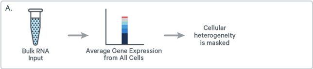

Figure 1. Chromium Single Cell Gene Expression with CRISPR Screening.

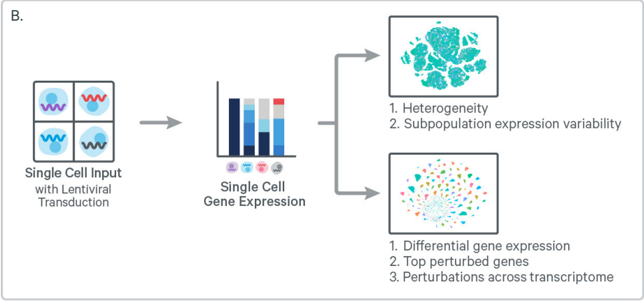

A. Traditional assays with bulk RNA input assess average gene expression, thereby masking cellular heterogeneity. B. Single Cell CRISPR Screening with Lentiviral sgRNA transduced single cell input, assesses perturbation effects across multiple genes, as well as of each individual sgRNA, across the entire transcriptome, at the single cell level.

## CRISPR Components

The CRISPR system consists of a guide RNA (gRNA/ sgRNA) and a CRISPR-associated (Cas) protein complex that can target and cleave specific DNA sequences, altering a cell's genome.

## Guide RNA (sgRNA)

sgRNA is a short synthetic RNA with three components: a hairpinned scaffold sequence for Cas binding, a 20 nucleotide protospacer sequence defining the genomic target, and a transcription terminator. The sgRNA targets the bound Cas protein to  a specific gene target. The target can be altered by modifying the protospacer sequence, ensuring that the modification is unique compared to the rest of the genome.

## CRISPR-associated (Cas) proteins

Cas proteins play a key role in defending certain bacteria from DNA viruses and plasmids by unwinding the foreign DNA and checking for sites complementary to the sgRNA protospacer.

Cas9 is a 160 kd protein that forms a complex with sgRNA, which targets the Cas9 to a specific DNA

## CRISPR System

## CRISPR Activation (CRISPRa)

CRISPR activation (CRISPRa) is a genetic perturbation tool that uses a modified Cas9 with dead endonuclease activity, dCAS9, to enable targeted gene activation.

dCas9, fused to strong viral transcription activation domains like VP64, can increase transcription. More potent activation of target genes can be obtained via strategies like the 'SunTag' system which uses dCas9 chimeras to recruit 10 transcription activation domains.

## CRISPR Interference (CRISPRi)

CRISPR interference (CRISPRi) is a genetic perturbation that allows for sequence-specific repression of gene expression.

dCas9 can repress transcription by directly blocking RNA polymerase activity or via effector domainmediated transcriptional silencing when fused to a strong transcriptional repressor like KRAB.

Figure 2. CRISPR gene editing system with a guide RNA (sgRNA) and CRISPR-associated (CAS) protein complex. sgRNA includes a scaffold sequence for Cas binding, a protospacer sequence for genomic targeting, and a transcription terminator while the CAS protein can bind and cleave DNA due to its intrinsic nuclease activity.

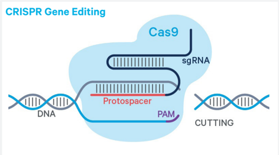

substrate. Cas9's intrinsic nuclease activity cleaves the targeted DNA, altering the cell's genome.

Point mutations that inactivate the Cas9 endonuclease domains and prevent it from cleaving DNA, create a programmable RNA-guided DNA-binding protein, capable of  binding target DNA bases and repressing transcription by blocking initiation. By fusing Cas9 with transcriptional repressors or activators, the downstream target genes can be modified.

Figure 3. dCas9, with dead endonuclease activity, for targeted gene activation.

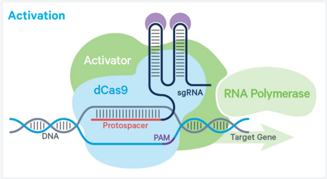

Figure 4. dCas9 mediated sequence-specific gene inactivation.

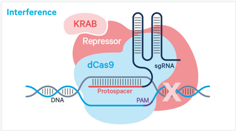

## Pooled CRISPR Screens

Pooled CRISPR-based genetic screens are powerful tools for biological discovery (2-3) but traditional CRISPR screening approaches can be complex and lengthy with some inherent limitations as described below.

## Perturb-Seq and CRISP-Seq

These CRISPR screening methods utilize a vector that encodes two transcripts.

The sgRNA is transcribed by DNA Pol III (no poly-A), while an indexing transcript is transcribed by DNA Pol II (poly-A). Only the indexing transcript is captured during reverse transcription in the emulsion droplet. The Guide Barcode (GBC) acting as a proxy for the sgRNA requires sequencing the vector to associate the GBC with a given sgRNA. Also, during viral transduction, GBCs can potentially uncouple from the originally paired sgRNA.

Figure 5. Overview of Preturb-Seq and CRISP-Seq CRISPR screening.

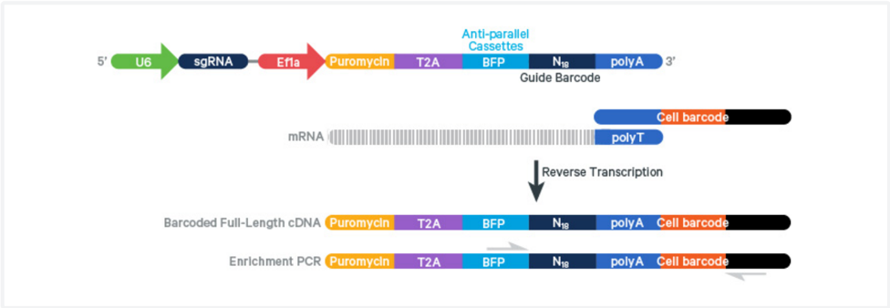

## CROP-Seq

In this method, sgRNA sequence is directly encoded in a DNA Pol II (poly-A) transcript, in addition to being expressed as a functioning sgRNA (DNA Pol III transcript). This ensures stronger linkage that equates to the one measured by scRNA-seq.

However, as the sgRNA Pol II transcript is captured in the same physical library as the gene expression information, sgRNA assignments are linked to the depth of sequencing, which can be very inefficient. Additionally, the CROP-Seq vector is not compatible with delivery of multiple sgRNAs.

Figure 6. Overview of CROP-Seq CRISPR screening.

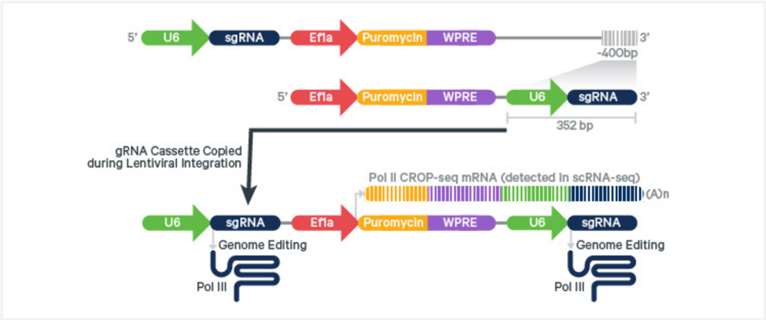

## Resources and Compatibility Guidelines for Experimental Planning

Comprehensive guidelines regarding available resources and compatibility are provided to enable easy experimental planning for the Single Cell CRISPR Screening assay.

NOTE: While this document focuses on using transduction based methods for introducing CRISPR machinery into cells, other CRISPR introduction techniques are available and utilized by researchers. However, 10x Genomics has not validated the Single Cell CRISPR Screening assay with non-transduction based techniques. Currently we are not aware of any technical limitations that would prevent the assay from directly capturing sgRNAs introduced into the cells using these techniques.

## sgRNA Designing Tools

There are multiple design and CRISPR sgRNA selection tools available online that can be used to design target specific compatible  sgRNAs.

- [Benchling](https://www.benchling.com/crispr/)
- [Broad Institute GPP](https://portals.broadinstitute.org/gpp/public/analysis-tools/sgrna-design)
- [CasOFFinder](http://www.rgenome.net/cas-offinder/)
- [CHOPCHOP](http://chopchop.cbu.uib.no/)
- [CRISPOR](http://crispor.tefor.net/)
- [E-CRISP](http://www.e-crisp.org/E-CRISP/designcrispr.html)

## Pooling sgRNA Vectors

Pooling sgRNA vectors correlates with the evenness of cells detected with a given sgRNA using the Chromium Single Cell CRISPR Screening assay. Optimal pooling of sgRNA vectors is a critical upfront step for recovering equal numbers of cells with a given set of perturbations.

The Chromium Single Cell CRISPR Screening assay reports cells detected with a given sgRNA with very high fidelity when compared back to the original sgRNA vector pool. Thus care should be taken at the upfront sgRNA vector pooling step to ensure the desired sgRNA representation.  For example, if a given target sgRNA is pooled at 1% when 5% cells were being targeted, fewer cells containing the sgRNA of interest will be recovered, leading to less sensitive detection of significant

- [Guides](http://guides.sanjanalab.org/)
- [Horizon Discovery](https://dharmacon.horizondiscovery.com/gene-editing/crispr-cas9/crispr-design-tool/)
- [IDT](https://www.idtdna.com/site/order/designtool/index/CRISPR_CUSTOM)
- [Millipore CRISPR Design](https://www.milliporesigmabioinfo.com/bioinfo_tools/)
- [Off-Spotter](https://cm.jefferson.edu/Off-Spotter/)
- [Synthego](https://www.synthego.com/products/bioinformatics/crispr-design-tool)

knockdown (due to loss of statistical power of having less cells). Similarly, if the non-targeting sgRNA are not pooled as desired, resulting in a low number of cells with non-targeting sgRNA, knockdown sensitivity could be limited. This could result in to reduced ability, or not being able, to detect significant perturbation for any/all of the targeting sgRNAs.

## sgRNA Pool QC Recommendations

Verifying the construction of the plasmid/viral pool of each CRISPR library via Next Generation Sequencing is highly recommended. This allows for the frequency of each sgRNA in the pool to be quantified prior to proceeding with the 10x Genomics assay.

## Cell Transduction

A wide variety of immortalized suspension and/or adherent cell lines (A375, HEK293T, Jurkat, K562, etc.) have been utilized to perform pooled CRISPR screens as they are easy to culture, transduce, and once established are able to stably and efficiently express Cas9/dCas9 and sgRNA(s). Cell lines are also amenable to the implementation of positive screening strategies (antibiotic selection or FACS) prior to, during, or postculturing. The generation of a stable cells that can continually express dCas9 without losing expression of the sgRNA is crucial for CRISPR screening studies.

Primary cells are inherently more difficult to culture than cell lines as they often require elaborate culture conditions, and either do not proliferate or cannot be maintained in long term cell culture. Additionally, the mechanisms of innate immunity that provide immune cells with their unique ability to defend against disease can also lead to lower transduction and expression efficiencies due to degradation of the CRISPR machinery.

## Cas9 Expressing Cells

10x Genomics currently does not provide cells expressing Cas9. As with most Lentiviral research, generating a stock of stably transduced KRAB-dCas9 Helper Cells is recommended. Millipore Sigma provides a useful Protocol outlining all the steps required to generate these cells. UCSF also provides a helpful primer on CRISPRi/a cell line production.

## Lentiviral MOI for CRISPR Screens

Multiplicity of Infection (MOI) is the ratio of the number of transducing Lentiviral particles to the number of cells. For most standard CRISPR pooled library screens, cells are infected at a low MOI (0.1-0.5) to increase the chances that an infected cell receives only one sgRNA. However, this naturally results in a significant proportion of the cells lacking a sgRNA.

Transducing at a higher MOI increases the chances that a majority of the cells contain one or more sgRNAs. However, a cell that contains two (or more) sgRNAs may impart combinatorial perturbations on the transcriptome relative to cells containing a single sgRNA. These cells will be identified during downstream analysis and can be analyzed or excluded from the analysis based on the specifics of the research question/application.

## Optimal MOI

Determining optimal MOI for each cell type and Lentiviral vector combination is highly recommended. A range of MOIs should be tested to determine optimal MOI for transduction experiments.

A brief outline of steps for determining optimal MOI is provided below:

- Plate 1.6 x 10 4  cells/well with 120 µl fresh media in a 96-well plate.
- Add control Lentivirus to cells in a range of MOIs. For most cell types, MOI of 0.1-10 is suitable. For hard to transfect cells, MOI may be increased to 50- 100.
- If using antibiotic selection, apply selection media and identify wells with viable cells at the lowest tested MOI value. Use this optimal MOI for transduction experiments.
- If using fluorescence, identify the well with desired quantifiable fluorophore expression at the lowest tested MOI value. Use this optimal MOI for transduction experiments.
- Flow cytometry can also be utilized to determine the proportions of fluorophore positive and fluorophore negative cells in each tested MOI condition.

Figure 7. Representation of cells transduced with low, optimal, and high Lentiviral Multiplicity of Infection (MOI).

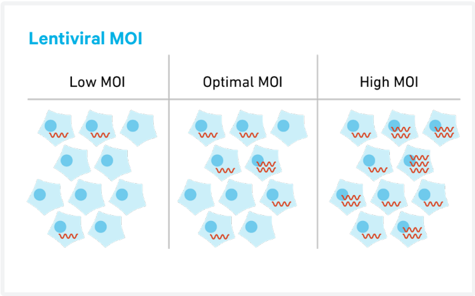

## Transduced Cell Selection

## Antibiotic Selection

Enriching for transduced cells via antibiotic selection is highly recommended as there are many factors that can impact the proportion of cells containing a sgRNA (provide template for the CRISPR Screening assay) and cells lacking a sgRNA (do not provide functional template for the assay). For most pooled library screens, cells are infected at a very low MOI to increase the chances that an infected cell receives only one sgRNA. However, this naturally results in a significant proportion of the cells lacking a sgRNA. A positive screening strategy, such as antibiotic selection, results in a significant proportion of the cell population dying, with only a small fraction surviving. These cells contain both the plasmid and sgRNA(s).

## Selection Duration

Following transduction, cells should be selected using concentrations and timelines established in the kill curve conduction prior to transduction (typically 5-7 days). The antibiotic-containing medium should be replaced as necessary during the selection process (~ every 2 to 3 days). Any non-transduced cells present in the culture should die completely after a 7 day selection with the appropriate antibiotic.

## Double Selection

Double antibiotic selection is recommended after transduction as this enables selection/survival of cells that have incorporated both genes for antibiotic resistance (e.g. puromyocin and blasticidin), resulting in a population of cells containing both Cas9 and sgRNA.

## Alternatives to Antibiotic Selection

The cell type(s) utilized in a CRISPR screen may impact whether antibiotic selection can be implemented. For example, primary cells can be inherently more difficult to culture than immortalized cell lines. Increasing the MOI to shift the population towards a slightly higher number of cells containing more than sgRNA per cell, reducing the number of cells lacking sgRNA, or employing FACS sorting to enrich for cells with sgRNA prior to running the 10x Genomics assay is recommended.

## Testing sgRNA Expression prior to 10x Genomics Assay

Prior to performing the 10x Genomics CRISPR Screening, sgRNA expression for target gene knockdown or activation should be tested.

## Gene Expression Interference/Activation Analysis via qPCR

Total RNA from transduced cells can be used for RTqPCR experiments to quantify target gene expression levels. The key steps are:

- Harvest cells
- Purify total RNA using GenElute Mammalian Total RNA Miniprep Kit (RTN10, MilliporeSigma)
- Perform RT-qPCR analysis to determine relative gene expression changes compared to controls, using Quantitative RT-PCR ReadyMix (QR0200 Sigma-Aldrich)

Analysis of Gene Expression Interference via FACS Post transduction, cells can be selected using antibiotic selection and then their GFP levels (or relevant fluorescent marker) can be recorded via flow cytometry, using GFP expression to gate for successfully transduced cells. When estimating the level of knock-down, GFP levels from normal (GFP-) cells are subtracted.

Figure 8. Selection of Lentiviral transduced cells using antibiotic and FACS.

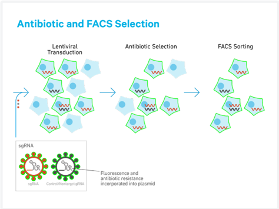

## sgRNA Distribution

If a low percentage of cells containing at least one sgRNA are detected in the 10x Genomics assay, it may be due to unstable/inconsistent levels of Cas9/dCas9 expression, very low transduction efficiency, inefficient or ineffective selection, or problems with the vector or sgRNA.

To increase the proportion of cells containing at least one sgRNA per cell, it may be necessary to optimize the transduction efficiency or MOI, increase the length of time in culture to ensure stable expression of the sgRNA, or enrich the transduced cell population to isolate only the cells containing at least one guide per cell via positive screening strategies, such as antibiotic selection or FACS sorting. It is worth noting that the cell type (i.e. cell lines or primary cells) being utilized in the screen may impact whether a positive screening strategy can be implemented.

## Numbers of Genes

The Single Cell CRISPR Screening assay can be used for investigating a number of genes simultaneously, starting from as low as 2-3 genes. A smaller gene set presents the opportunity to screen a large number of sgRNAs for a given gene of interest. For 2-3 genes, the sgRNA pool may include ~5-15 sgRNAs based on how many targeting and non-targeting sgRNA are selected. The perturbation effects across the 2-3 genes, as well as of each individual guide, can be measured across the entire transcriptome, at the single cell level.

For more complex cell types (primary cells), information for each target gene/sgRNA across a large number of cell types can be assessed in one single experiment without isolating individual cell types to determine the perturbation effects.

A representative example of  sgRNA distribution in cells transduced using optimal Lentiviral MOI and 10,000 cells/channel used for the CRISPR screening assay:

- Cells with a single sgRNA: ~75-80%
- Cells with two sgRNAs: ~5-10% These cells can be identified during downstream analysis and can be excluded (if expressing two distinct sgRNA), if desired, or depending on the application can be analyzed to examine the impact of combinatorial perturbations on the transcriptome.
- Cells with no sgRNA: ~10-20% These cells will not provide any useful information for the CRISPR Screening assay and we would recommend enriching the transduced cell population to remove these cells prior to performing the 10x Genomics assay.

## sgRNA per Targeted Gene

Majority of academic publications use 2-5 sgRNAs per targeted gene. The 10x Genomics CRISPR Screening assay is not impacted by the number of sgRNAs used per gene, though recovery of sufficient cells per protospacer is important for detecting statistically significant perturbations (~100-200 cells/sgRNA). Refer to Replogate et al., for more information (1).

## Control Non-targeted sgRNA per Gene

Typically 2-5 control non-targeting sgRNA can be used per experiment. For the 10x Genomics CRISPR Screening assay, the exact number of control sgRNAs used isn't important.  10x Genomics recommends a targeted recovery of 500-1,000 cells that include nontarget sgRNAs. For example, if using a single Chromium Chip channel for the assay with a targeted recovery of 10,000 cells, 5-10% of the cells should contain nontarget sgRNA(s).

## 10x Genomics Single Cell CRISPR Screening Assays

10x Genomics offers two high-throughput and scalable single cell CRISPR screening products that both enable single cell gene expression analysis coupled with Feature Barcode technology for CRISPR screening.

Chromium Single Cell Immune Profiling with Feature Barcode technology for CRISPR Screening (also referred to as Single Cell 5' CRISPR Screening) provides a multiomic approach to simultaneously detect gene expression, CRISPR guides, cell surface proteins, and/or immune cell clonotype frequencies from the same single cell. The Single Cell 5' CRISPR Screening approach is compatible with most Cas9 CRISPR vectors and does not require integration of specific capture sequences into the sgRNAs for compatibility.

Chromium Single Cell 3' Gene Expression with Feature Barcode technology for CRISPR Screening (also referred to as Single Cell 3' CRISPR Screening) enables obtaining gene expression profiles along with CRISPRmediated perturbation phenotypes in the same single cell. Single Cell 3' CRISPR Screening is enabled by engineering sgRNAs with one of two possible capture sequences that are required for assay compatibility.

The table below summarizes the key similarities and differences between the two 10x Genomics Single Cell CRISPR Screening assays.

| 10x Genomics Single Cell CRISPR Screening Assays   | 10x Genomics Single Cell CRISPR Screening Assays                                                                                                                            | 10x Genomics Single Cell CRISPR Screening Assays                                      |
|----------------------------------------------------|-----------------------------------------------------------------------------------------------------------------------------------------------------------------------------|---------------------------------------------------------------------------------------|
|                                                    | Single Cell 5' CRISPR Screening                                                                                                                                             | Single Cell 3' CRISPR Screening                                                       |
| Cas9 guide RNA compatibility                       | Compatible with most Cas9 guide structures, including off the shelf commercial guide libraries and existing sgRNA libraries with integrated 10x Genomics Capture Sequences. | Compatible with modified sgRNAs with integrated 10x Genomics Capture Sequence 1 or 2  |
| Guide RNA transduction                             | Stable transduction of sgRNA with sufficiently high MOI                                                                                                                     | Stable transduction of sgRNA with sufficiently high MOI                               |
| Single Cell CRISPR Screening in combination with:  | Single Cell 5' Gene Expression Single Cell 5' Gene Expression + V(D)J Single Cell 5' Gene Expression + V(D)J + Cell Surface Protein -                                       | Single Cell 3' Gene Expression - - Single Cell 3' Gene Expression + Cell Multiplexing |
| Data analysis & visualization                      | Cell Ranger & Loupe                                                                                                                                                         | Cell Ranger & Loupe                                                                   |

## Workflow Overview

The key steps involved in executing the Single Cell CRISPR Screening workflows are listed below and illustrated in Figure 9. Resources and Compatibility Guidelines chapter provides detailed information regarding each of these steps to enable seamless experimental planning and execution.

- Design 10x Genomics compatible guide RNA (sgRNA) constructs in silico. The sgRNA should include custom protospacer based on the gene of interest.

The Single Cell 5' CRISPR Screening assay is compatible with most Cas9 guide structures, including off the shelf commercial guide libraries and existing sgRNA libraries with integrated 10x Genomics Capture Sequences (see Section 1.1 sgRNA Compatibility for details).

The Single Cell 3' CRISPR Screening assay is compatible with sgRNA  with integrated 10x Genomics Capture Sequences  (see Section 2.2 Capture Sequence Integration in sgRNA for details).

- Synthesize sgRNA oligonucleotides.
- Generate pooled sgRNA plasmid library using the sgRNA oligonucleotides.
- Generate pooled lentiviral sgRNA library.
- Transduce Cas9 expressing cells with pooled lentiviral sgRNAs.
- Select sgRNA positive cells.
- The selected cells are ready for generating sequencing-ready single cell libraries for assessing gene expression profiles along with CRISPRmediated perturbation. Additionally, V(D)J and/ or cell surface protein libraries can be generated simultaneously when using the Single Cell 5' assay, while cell multiplexing libraries can be generated in parallel when performing the Single Cell 3' assay.

Figure 9. Overview of CRISPR screening workflow.

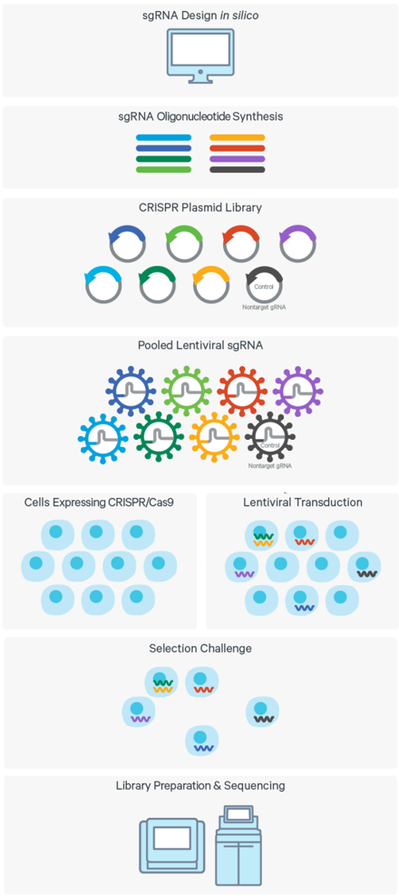

## Assay Specifics

## Assay Cell Load

10x Genomics recommends using 100-200 cells per targeting sgRNA. This ensures enough statistical power to be able to determine the significance of the perturbation.  For non-targeting sgRNAs, which are critical for providing a baseline for calculating perturbations, using 500-1,000 cells is recommended.

## Chromium Chip

## Cells per channel in the chip

The Chromium Single Cell CRISPR Screening assays currently supports recovering 500-10,000 cells per channel of the standard Chromium Chip and 2,00020,000 cells per channel of the high throughput Chromium Chip.

## Perturbations measured using a single channel

If a user loads the maximum number of cells (10,000) in a single channel of a standard Chromium Chip, 5001,000 (5-10%) of these cells should be non-targeting sgRNA containing cells. Each targeting sgRNA should be represented by 100-200 cells (1-2%).  Using this setup, ~45-90 sgRNA can be tested using a single channel of the standard chip.

Similarly, if loading a high throughput Chromium Chip with the maximum number of cells (20,000) in a single channel, 1,000- 2,000 (5-10%) of these cells should be non-targeting sgRNA containing cells. Each targeting sgRNA should be represented by 100-200 cells (0.5-1%). Using this setup, ~80-180 sgRNA can be tested using a single channel of the high throughput chip .

## Expanding the number of perturbation/cells beyond recommendations by 10x Genomics

Using the same recommendation as the preceding section, 500-1,000 total cells should be made up of non-targeting containing guides and each perturbation be represented by 100-200 cells.  If all 8 channels in a standard Chromium Chip are used with recovery of ~80,000 cells, this would enable a user to generate a pooled CRISPR screen so that ~1,000 cells (1.25%) contain non-targeting sgRNA and each targeting sgRNA would make up ~0.2% of the pool, allowing for testing of ~500 sgRNA.

Refer to Single Cell 5' CRISPR Screening Assay Overview and Single Cell 3' CRISPR Screening Assay Overview for additional details.

## Single Cell 5' CRISPR Screening Assay Overview

## 1.0 Assay Overview

Chromium Single Cell Immune Profiling coupled with Feature Barcode technology for CRISPR Screening provides a high-throughput and scalable approach to obtain gene expression profiles along with CRISPRmediated perturbation in the same single cell. Additionally, V(D)J and/or cell surface protein libraries can be generated simultaneously from the same cell. The Single Cell 5' CRISPR Screening can be performed using either the Chromium Next GEM Single Cell 5' HT v2 high-throughput assay or the Single Cell 5' v2 standard assay.

## 1.1 sgRNA Compatibility

For compatibility with the Chromium Single Cell 5' CRISPR Screening assay, sgRNAs should be engineered for use with standard Cas9 systems (panel A). Compatibility of the assay can be verified by ensuring primer binding is possible with the sgRNA of interest.

The assay is also compatible with sgRNA engineered with either Capture Sequence 1* or Capture Sequence 2* within the sgRNA hairpin structure (panel B), or immediately before the sgRNA termination signal (panel C), elongating the 3'-end of the sgRNA. Alternate sgRNA structures for use with other Cas enzymes may be compatible but have not been tested by 10x Genomics. The sgRNA priming site specific to Single Cell 5' and 3' assays is indicated in each of the panels.

Performing sgRNA QC by qPCR, NGS, or other methods is recommended prior to proceeding with the Single Cell CRISPR Screening assay.

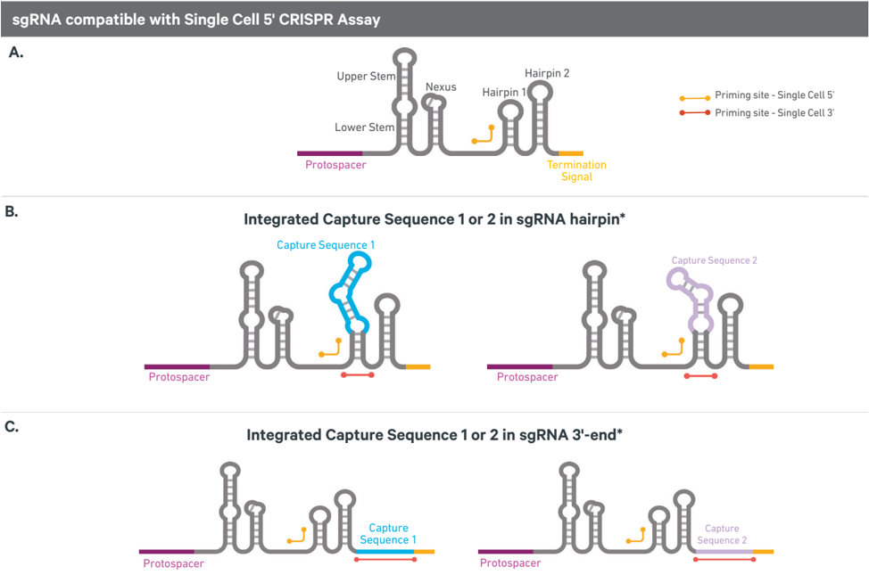

## 1.2 sgRNA Capture &amp; Library Construction Overview

Chromium Single Cell 5' CRISPR Screening workflow using Single Cell 5' v2 or 5' HT v2 Gel beads analyses multiple cellular attributes, including CRISPR screening at single cell resolution.

GEMs are generated by combining barcoded Single Cell  5' Gel Beads, a Master Mix containing transduced cells, and Partitioning Oil onto a Chromium Next GEM Chip. Immediately following GEM generation, the Gel Bead is dissolved and any co-partitioned cell is lysed. Oligonucleotides are released from the Gel Bead and mixed with the cell lysate and a Master Mix containing reverse transcription (RT) reagents and primer mix (poly(dT) + CRISPR primers). Incubation of the GEMs simultaneously produces 10x Barcoded, full-length cDNA from poly-adenylated mRNA (Figure 10A) and barcoded DNA from the sgRNA protospacer (Feature Barcode) cDNA, designed to target gene/s of interest (Figure 10B). Sequencing-ready gene expression and CRISPR screening libraries are generated from this pool of 10x Barcoded cDNA using the standard Single Cell 5' v2 assay (Figure 11) or the high throughput Single Cell 5' HT v2 (schematic not shown).

Figure 10. mRNA (A) and sgRNA (B) capture inside individual GEMs in the Single Cell 5' CRISPR Screening assay.

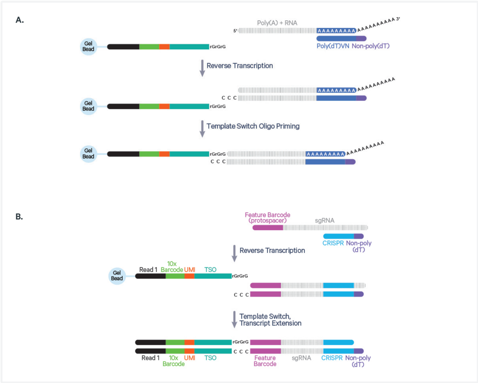

Figure 11. Chromium Single Cell 5' Gene Expression and CRISPR Screening standard assay overview.

## 1.3 Library Sequencing

Chromium Single Cell 5' Gene Expression and 5' CRISPR Screening are standard Illumina paired-end sequencing-ready libraries (Figure 12) that should be sequenced together. DO NOT sequence CRISPR

Screening libraries alone without pooling with Single Cell 5' Gene Expression libraries. Single Cell 5' V(D)J (not shown) and Cell Surface Protein libraries can also be pooled and sequenced with the other Single Cell 5' libraries.

Figure 12. Chromium Single Cell 5' Gene Expression (A), CRISPR Screening (B), and Cell Surface Protein library schematics.

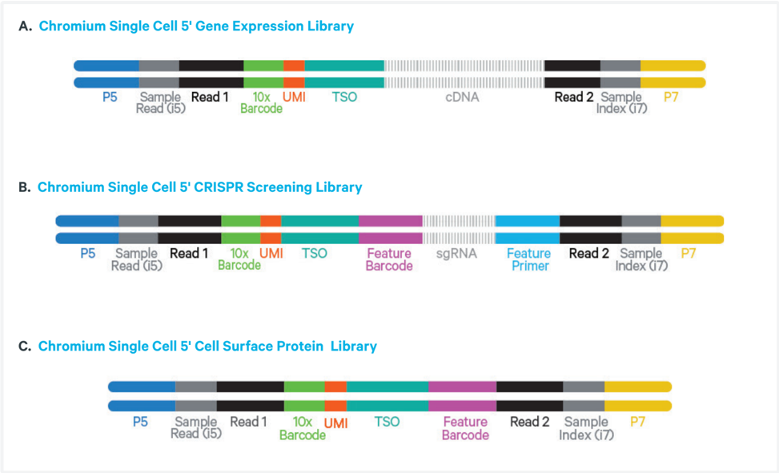

Pooling Chromium Single Cell 5' v2 CRISPR Screening (Feature Barcode) libraries with Single Cell 5' v2 Gene Expression libraries is required to maintain nucleotide diversity during sequencing. V(D)J, 5' Gene Expression, 5' CRISPR Screening, and/or Cell Surface Protein libraries may be pooled for sequencing, taking into account the differences in cell number and per-cell read depth requirements between each library. Samples utilizing the same sample index should not be pooled together or run on the same flow cell lane, as this would not enable correct sample demultiplexing.

When determining the effect of a given perturbation, the dynamic sequencing depth range of the target gene's expression is a key factor.  Since the number of UMIs seen for a given gene is dependent on the overall read depth of the gene expression library, the deeper that library is sequenced the more UMIs will be detected (up to the point where the gene expression library is saturated and there is a low likelihood of seeing a new UMI with each new sequencing read).  The higher the number of UMIs detected for a given gene, the more is the likelihood that a change in the gene's expression will be detectable and significant.

| Single Cell 5' Library Sequencing Recommendations   | Single Cell 5' Library Sequencing Recommendations                                                                                                                                                                                                                                                 |
|-----------------------------------------------------|---------------------------------------------------------------------------------------------------------------------------------------------------------------------------------------------------------------------------------------------------------------------------------------------------|
| Sequencing Depth*                                   | Minimum 20,000 read pairs/cell for 5' Gene Expression Dual Index library Minimum 5,000 read pairs/cell for 5' CRISPR Screening Dual Index library Minimum 5,000 read pairs per cell for V(D)J Dual Index library Minimum 5,000 read pairs per cell for 5' Cell Surface Protein Dual Index library |
| Sequencing Type                                     | Paired-end, single indexing or dual indexing                                                                                                                                                                                                                                                      |
| Number of Cycles (Dual Indexing)                    | Read 1: i7 Index: i5 Index: Read 2: 26 cycles 10 cycles 10 cycles 90 cycles                                                                                                                                                                                                                       |

*Adjust sequencing depth for required performance or application

## Single Cell 3' CRISPR Screening Assay Overview

## 2.0 Assay Overview

Chromium Single Cell 3' Gene Expression with Feature Barcode technology for CRISPR Screening provides a high-throughput and scalable approach to obtain gene expression profiles along with CRISPR-mediated perturbation phenotypes in the same single cell. Single cell CRISPR screening is enabled by Chromium Single Cell Gel Beads (v3/v3.1) that directly capture engineered sgRNAs with one of two possible capture sequences when partitioned in a Gel Bead-in- emulsion (GEM). The Single Cell 3' CRISPR Screening can be performed using either the Chromium Next GEM Single Cell 3' HT v3.1 high-throughput assay or the Single Cell 3' v3.1 standard assay.

## 2.1 Compatible sgRNA Vectors

## MilliporeSigma

MilliporeSigma provides optimized, customized vectors compatible with 10x Genomics Single Cell 3' CRISPR Screening assay. These vectors are also compatible with the Single Cell 5' CRISPR Screening assay.

Optimization Kit includes one human positive control guide RNA plus one negative control guide RNA Lentiviral vectors for each of the four Single Cell 3' CRISPR Screening guide capture strategies:

- RAB1A + non-targeting with Capture Sequence 1 in the 3' position
- RAB1A + non-targeting with Capture Sequence 1 in the stem-loop position
- RAB1A + non-targeting with Capture Sequence  2 in the 3' position
- RAB1A + non-targeting with Capture Sequence  2 in the stem-loop position

Each is provided as 20 µl of Lentiviral particles with a minimum specification of 1 x 10 6  VP/ml

Custom Lentiviral sgRNA Pools can be ordered from MilliporeSigma. Provide a list of genes of interest and based on that sgRNAs for gene activation or inhibition will be designed and custom pools will be generated.

Alternatively, provide sgRNA sequences (2-5 sgRNA are recommended per gene). Based on the information, custom lentiviral pool with the following specifications will be generated:

- Viral Titer: 5x10 8  particles/ml assessed by p24 assay
- Volume: 200 µ l
- 20-2,000 individual clones
- Deep Sequencing QC for representation and distribution

KRAB-dCas9 vectors (currently a custom product) are available to stably express dCas9 for the 10x Genomics CRISPR Screening assay. Millipore Sigma provides a useful Protocol outlining all the steps required to generate these cells.

## Addgene

10x Genomics compatible sgRNA capture sequenceexpressing plasmids can be procured from Addgene.

## [pBA904 (Plasmid #122238)](https://www.addgene.org/122238/)

Lentiviral CRISPR guide vector expressing  eGFPNT2 sgRNA with Capture Sequence 1 incorporated in the loop of the sgRNA constant region is available. A modified sgRNA (with Capture Sequence 1 in stem loop 2 of the constant region) was inserted using BlpI and XhoI sites.

## [pBA900 (Plasmid #122237)](https://www.addgene.org/122237/)

Lentiviral CRISPR guide vector expressing a eGFP-NT2 sgRNA with cs2 incorporated at the 3' end of the sgRNA constant region. A modified sgRNA (with Capture Sequence 2 at the 3' end of the constant region/tracr) was inserted using BlpI and XhoI sites.

## [pU6-sgRNA EF1Alpha-puro-T2A-BFP (Plasmid #60955)](https://www.addgene.org/60955/)

Expresses an sgRNA from the U6 promoter and a puromycin resistance cassette and BFP from the EF1Alpha promoter.

UCSF provides a helpful primer on CRISPRi/a cell line production.

## 2.2 Capture Sequence Integration in sgRNA

To enable direct capture, each sgRNA should be engineered to contain either Capture Sequence 1 or Capture Sequence 2, along with a protospacer (Feature Barcode), designed to target gene/s of interest. Two possible locations for integrating the capture sequence in the sgRNA include, within the sgRNA hairpin

## Capture Sequence 1

Capture Sequence 1 on Gel Bead:  5'-TTGCTAGGACCGGCCTTAAAGC-3'

Capture Sequence 1 integrated in sgRNA hairpin

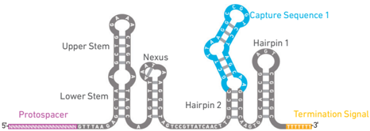

5'-N(20)-GTTTAAGAGCTAAGCTGGAAACAGCATAGCAAGTTTAAATAAGGCTAGTCCGTTATCAACTTggccGCTTTAAGGCCGGTCCTAGCAAggccAAGTGGCACCGAGTCGGTGC-T(7)-3'

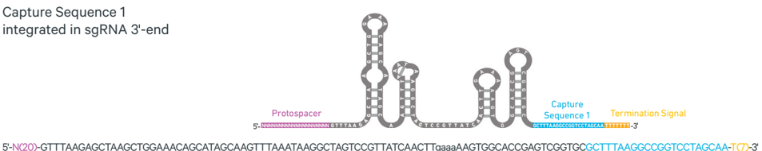

## Capture Sequence 2

Capture Sequence 2 on Gel Bead: 5'-CCTTAGCCGCTAATAGGTGAGC-3'

Capture Sequence 2 integrated in sgRNA hairpin

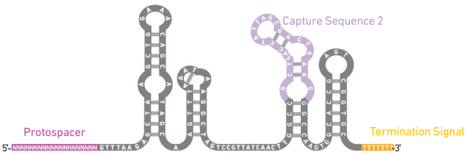

5'- N(20)-GTTTAAGAGCTAAGCTGGAAACAGCATAGCAAGTTTAAATAAGGCTAGTCCGTTATCAACTTggccGCTCACCTATTAGCGGCTAAGGggccAAGTGGCACCGAGTCGGTGC-T(7)-3'

Capture Sequence 2 integrated in sgRNA 3'-end

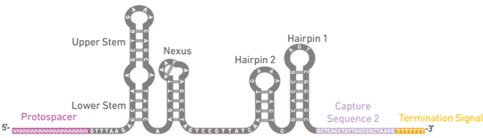

5'- N(20)-GTTTAAGAGCTAAGCTGGAAACAGCATAGCAAGTTTAAATAAGGCTAGTCCGTTATCAACTTgaaaAAGTGGCACCGAGTCGGTGCGCTCACCTATTAGCGGCTAAGG-T(7) -3'

structure or immediately before the sgRNA termination signal, elongating the 3' end of the sgRNA as shown below. However, alternate sgRNA integration locations for either of the two capture sequences may be possible depending on the specific application, type of construct used etc.

## 2.3 Chromium Single Cell 3' Gel Beads (v3/v3.1)

Chromium Single Cell 3' Gene Expression and CRISPR Screening workflow uses Single Cell 3' Gel Bead (v3/ v3.1) oligonucleotides that enable analysis of multiple cellular attributes, including gene expression and CRISPR screening at single cell resolution.

In addition to a poly(dT) primer sequence that enables the production of barcoded, full-length cDNA from poly- adenylated mRNA for assessing gene expression, the Single Cell 3' v3/v3.1 Gel Beads also include two additional primer sequences (Capture Sequence 1 and Capture Sequence 2) for direct capture and priming of Feature Barcode technology compatible sgRNAs present in a cell inside a GEM.

## 2.4 Library Construction Overview

GEMs are generated by combining barcoded Single Cell  3' v3/v3.1 Gel Beads, a Master Mix containing transduced cells, and Partitioning Oil onto a Chromium Next GEM Chip G. The poly(dT) and the capture sequence primers in the gel bead are engaged simultaneously in two different reactions inside individual GEMs, generating 10x Barcoded cDNA. Sequencing-ready gene expression and CRISPR screening libraries are generated from this pool of cDNA. The sequential protocol steps along with multiple stopping points are listed in the Protocol Time Planner in the relevant user guide.

Figure 13. Chromium Single Cell 3' v3/v3.1 Gel Bead Schematic. Capture Sequence 1 and Capture Sequence 2 enable direct capture of sgRNA molecules from a cell inside a GEM.

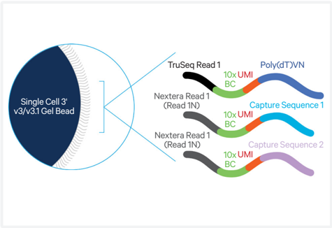

Figure 14. Chromium Single Cell 3' Gene Expression and CRISPR Screening standard assay overview.

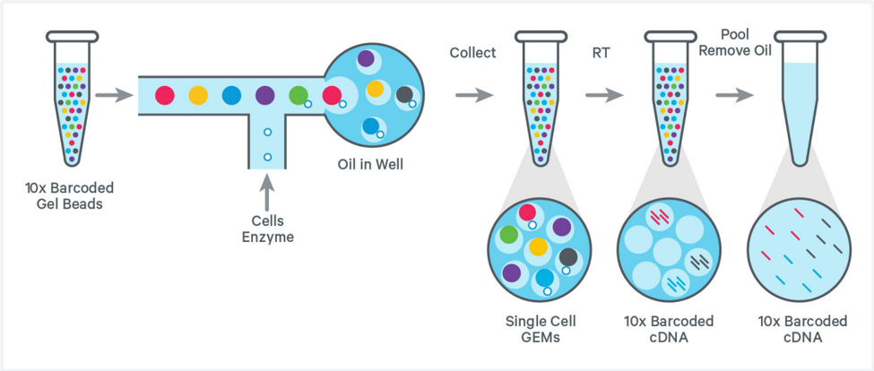

## 2.5 Library Sequencing

Chromium Single Cell 3' Gene Expression and CRISPR Screening are standard Illumina paired-end sequencingready libraries (Figure 15) that can be sequenced together. Pooling Single Cell 3' Gene Expression &amp; CRISPR Screening dual index libraries is recommended for sequencing to maintain nucleotide diversity. Single Cell 3' Cell Multiplexing libraries (not shown) can also be pooled and sequenced with these Single Cell 3' libraries.

The sequencing data is the input for 10x Genomics Cell Ranger analysis. The analysis provides combined gene expression and direct sgRNA detection on a per cell basis, thus enabling determination of the perturbation effects of a given set of sgRNAs.  Each physical library contributes different pieces of key information that are used to complete this analysis. Pooling Chromium Single Cell 3' v3/v3.1 CRISPR Screening (Feature Barcode)

libraries with Single Cell 3' v3/v3.1 Gene Expression libraries is recommended to maintain nucleotide diversity during sequencing.

When determining the effect of a given perturbation, the dynamic sequencing depth range of the target gene's expression is a key factor.  Since the number of UMIs seen for a given gene is dependent on the overall read depth of the gene expression library, the deeper that library is sequenced the more UMIs will be detected (up to the point where the gene expression library is saturated and there is a low likelihood of seeing a new UMI with each new sequencing read).  The higher the number of UMIs detected for a given gene, the more is the likelihood that a change in the gene's expression will be detectable and significant.

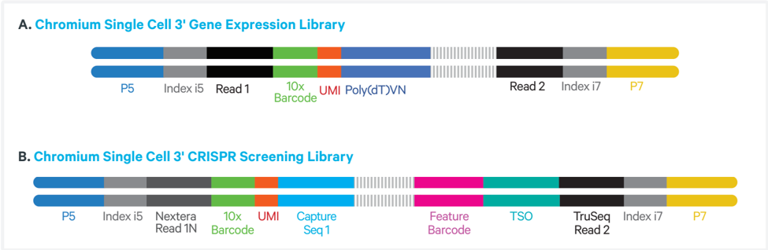

Figure 15. Chromium Single Cell 3' Gene Expression (A) and CRISPR Screening (B) library schematics.

| Single Cell 3' Library Sequencing Recommendations   | Single Cell 3' Library Sequencing Recommendations                                                                           |
|-----------------------------------------------------|-----------------------------------------------------------------------------------------------------------------------------|
| Sequencing Depth*                                   | Minimum 20,000 read pairs/cell for 3' Gene Expression library Minimum 5,000 read pairs/cell for 3' CRISPR Screening library |
| Sequencing Type                                     | Paired-end, single indexing or dual indexing                                                                                |
| Number of Cycles (Single Indexing)                  | Read 1: i7 Index: i5 Index: Read 2: 28 cycles 8 cycles 0 cycles 91 cycles                                                   |
| Number of Cycles (Dual Indexing)                    | Read 1: i7 Index: i5 Index: Read 2: 28 cycles 10 cycles 10 cycles 90 cycles                                                 |

## Single Cell CRISPR Screening Data Overview

## 3.1 Key Metrics

## Gene expression based cell calling

The gene expression library is used to determine cell barcodes that are associated with cell containing GEMs, also known as cell calling.  Reads from cell-associated 10x Barcodes are then used to calculate metrics such as number of reads, mapping and counting genes, all on a per cell basis.  Guide RNA based calling

## Guide RNA based calling

The CRISPR screening library is used to calculate key 10x Genomics CRISPR Application metrics after undergoing several levels of filtering.

First filter: Only reads in which a predefined constant region of the guide RNA can be found (supplied by the user as part of a 'Feature Reference File') are retained.  These reads are termed as "Reads with Putative Protospacer Sequence".

Second filter: After removing reads without a constant sequence, reads that contain a protospacer sequence mentioned in the Feature Reference File are retained. These reads are termed as Fraction Guide Reads.

Figure 16.  Representative plot showing cell associated barcodes derived from gene expression data.

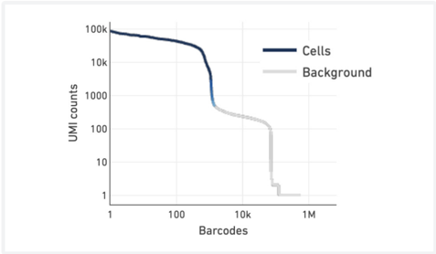

Third filter: Retains Guide Reads that contain a valid cell barcode, valid UMI, and the cell barcode is associated with a cell containing partition, as defined by the gene expression based cell-calling algorithm described above.

The reads that pass through all these three filters are defined as Fraction Guide Reads Usable (illustrated using Single Cell 3' library schematics in Figure 17) and are used to perform guide calling per cell.

Figure 17. Schematic showing Fraction Guide Read (A) and Fraction Guide Reads Usable (B) parameters for guide RNA based calling.

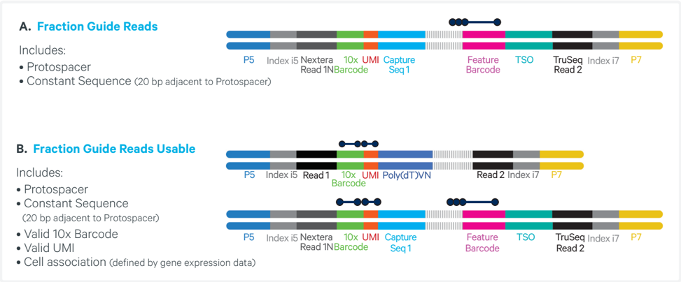

## CRISPR application metrics

For each sgRNA, Cell Ranger presumes two types of cell populations, one that expresses the sgRNA and one that does not (only includes UMI counts due to ambient sgRNA). To distinguish these two populations, Cell Ranger uses a model that calculates the probability that a given cell belongs to the population expressing the sgRNA rather than the background population, and uses that probability to identify cells expressing the guide RNA (this is performed on a per sgRNA basis).

Cell Ranger calculates summary metrics that convey the percentage of cells with either ≥1 or ≥2 protospacers detected.  'Cells with 1 or more protospacers detected' is useful for understanding the overall rate of cells detected with guide, while 'Cells with 2 or more protospacers detected' can help the user gauge how many cells received multiple guides (it is important to note, that the algorithm cannot differentiate between ≥ 2 protospacers detected resulting from multiple cells being encapsulated into a single GEM, or as the result of the original transduction event).  Finally, as part of the CRISPR Application metrics, 'Median UMIs per Cell' are calculated.

Figure 18. Representative CRISPR Application metrics.

| CRISPR Application                                |       |
|---------------------------------------------------|-------|
| Fraction Reads with Putative Protospacer Sequence | 77.4% |
| Fraction Guide Reads                              | 76.5% |
| Fraction Guide Reads Usable                       | 71.5% |
| Guide Reads Usable per Cell                       | 6,208 |
| Fraction Protospacer not Recognized               | 1.2%  |
| Guide Reads in Cells                              | 94.1% |
| Cells with 1 or more Protospacers Detected        | 91.7% |
| Cells with 2 or more Protospacers Detected        | 11.7% |
| Median UMI per Cell                               | 1,089 |

## 3.2 Data Visualization

A cloupe file is the output when CRISPR and gene expression libraries are combined and run through Cell Ranger.  Cell clustering can be visualized based on the single cell gene expression information. In addition to the gene expression based cell clustering, cells are also clustered based on guide expression. Users might notice that guide based clustering results in much more punctate structures, this is normal and is the result of how dimensional reduction algorithms and visualizations work, with far fewer expression patterns that are possible (in relation to the entire transcriptome). Examples of  gene expression based and sgRNA based cell clustering are shown on right.

As part of the Cell Ranger output, guide call assignments are made per cell.  The file 'protospacer\_ calls\_per\_cell' can be imported into Loupe as a category for quick and easy visualization of clusters with corresponding  sgRNAs. Each primary/larger cluster represents cells that received a single guide, while secondary/smaller clusters represent cells that have multiple guides.

After importing the guide calling categories to Loupe, users can switch back to the gene expression based clustering that now includes labels indicating the type of sgRNA/s associated with each cluster.

One possible way a user could utilize Loupe is to look for differential gene expression between cells that received either a targeting guide (for a gene of interest) or non-targeting guides (control cells), showing the expression differences seen for a subset of the guide containing cells.  This information is also present as part of additional cell ranger outputs, providing (either by target gene or a given guide) the top perturbed genes, as well as the perturbations across the entire transcriptome.

Figure 19. Example of  gene expression and sgRNA based cell clustering assessed using the Single Cell 3' CRISPR Screening assay.

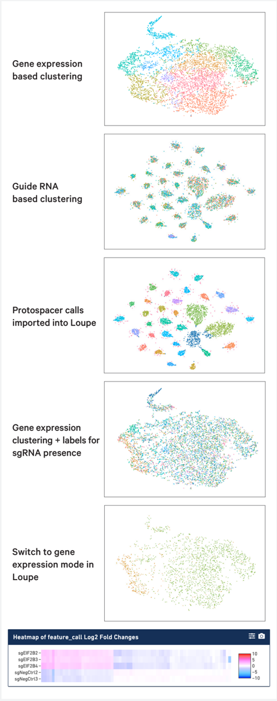

## Single Cell 5' CRISPR Screening Dataset

## Single Cell 5' Dataset: Cells Transduced with 2 guide RNAs

## Experimental Design

Jurkat and MM1S cells expressing dCas9-KRAB were transduced for CRISPR screening by a commercial vendor. Each cell line was transduced independently with one non-targeting control guide and one Rab1a targeting guide. The four resulting cell lines were expanded under hygromycin (selection for dCas9KRAB) and puromycin (selection for sgRNA) selection and cryopreserved for future use.

Upon thawing cells were stained with TotalSeq-C TBNK Panel and sorted to remove dead cells. Gene Expression, CRISPR Screening, Amplified TCR and BCR, and Cell Surface Protein libraries were generated with a target cell load of 10,000 (2,500 cells each for Jurkat control, Jurkat Rab1a sgRNA, MM1S control, and MM1S Rab1a sgRNA) and sequenced as described in the Chromium Next GEM Single Cell 5' Reagent Kits v2 (Dual Index) with Feature Barcode technology for Cell Surface Protein &amp; CRISPR Screening (CG000511).

Figure 20. Schematic showing the experimental design used for generating Single Cell 5' Dataset  using Jurkat and MM1S cells with a target cell load of 10,000.

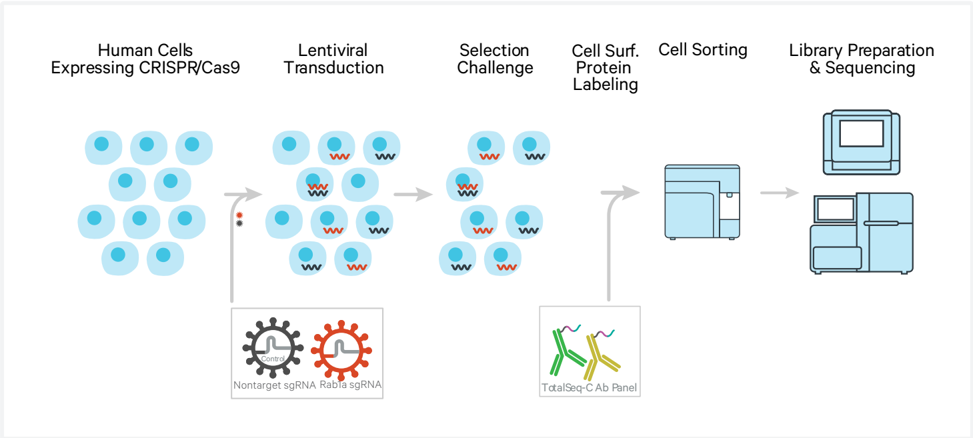

## Single Cell 5' Dataset

## Key Data Metrics

10x Genomics Cell Ranger software was used for data analysis and visualization. The output included 10x Genomics Web Summary file with information about number of cells recovered, reads per cell, and genes per cell, as well as a barcode rank plot displaying cells vs background, as shown in the adjacent plot (Figure 21).

The data also includes CRISPR Application metrics (Figure 22). Fraction of Reads with putative protospacer is the first filter and includes reads that contain the 20 bp constant sequence adjacent to the protospacer. Fraction guide reads is the second filter that includes reads in which a protospacer sequence is detected. The final level of filtering requires that read also contain a cell-associated barcode. The CRISPR Application metrics also includes summary metrics that convey the percentage of cells with either ≥1 or ≥2 protospacers detected. In this dataset, 80.42% cells with 1 or more protospacers were detected while only 2.45% cells with 2 or more protospacers were detected indicating that a significant majority of cells received only one sgRNA. It is important to note, that the algorithm cannot differentiate between ≥ 2 protospacers detected resulting from multiple cells being encapsulated into a single GEM, or as the result of the original transduction event. The calculated median UMIs per well for the dataset was 705.

Figure 21.  Single Cell 5' Web Summary file with information about  number of cells recovered, reads per cell, genes per cell, and the barcode rank plot.

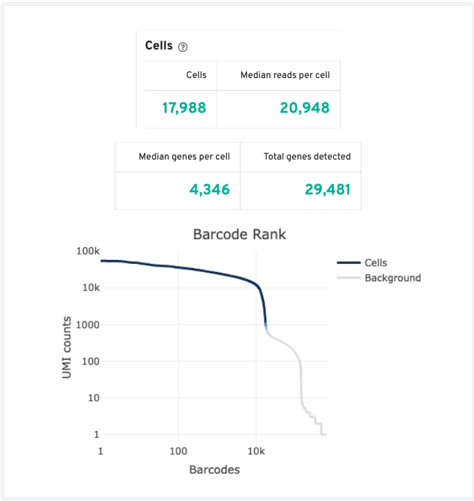

Figure 22.  CRISPR Application metrics for Single Cell 5' Dataset.

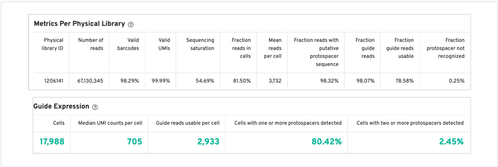

## Single Cell 5' Dataset

## Data Visualization

Loupe file, a Cell Ranger output, was used to visualize the single cell data derived from the experiment. t-SNE projection of gene expression and UMAP projection of CRISPR guide based  cell clustering is shown in Figures 23A and 23B respectively. Importing guide calls from Cell Ranger into Loupe Browser shows which cells received a specific sgRNA. This overlay when translated back to the gene expression based clustering shows no major clustering differences between cells that received the non-targeting guide and the cells that received Rab1a target guide.

Rab1a expression in MM1 cells receiving either sgRNA was determined using Loupe Browser. The data confirms significant Rab 1a knockdown (Figure 23C).

Figure 23.  Gene expression (A), CRISPR based cell clustering (B), and Rab1a gene expression in cells based on non-targeting or Rab1a CRISPR guide calls (C).

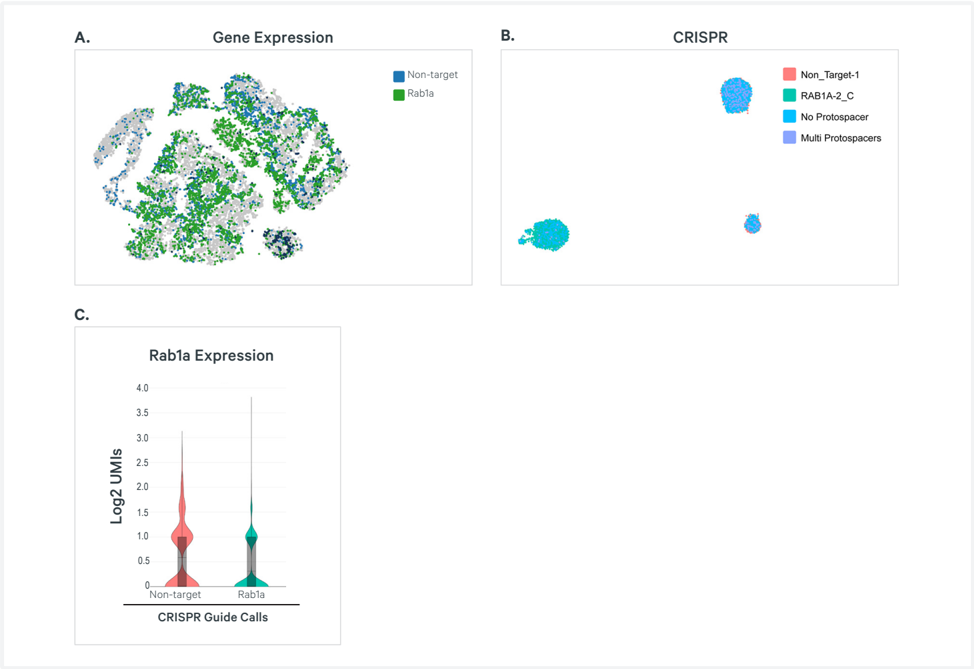

## Single Cell 5' Dataset

## Multiomic Readout from CRISPR Perturbed Cells

As a demonstration, in addition to Single Cell Gene Expression, Cell Surface Protein, TCR, and BCR libraries were also produced from this cell mixture, with and without using the Single Cell 5' Screening reagents .

Addition of the Single Cell  5' CRISPR reagents does not interfere with concordance in gene expression, cell surface protein, and V(D)J data, as shown in Figure 24.

Figure 24.  Single Cell  5' CRISPR Screening reagents do not interfere with concordance in single cell gene expression, cell surface protein, and V(D)J data as shown in panels A (CD3 &amp; TCR) and B (CD56 &amp; BCR) .

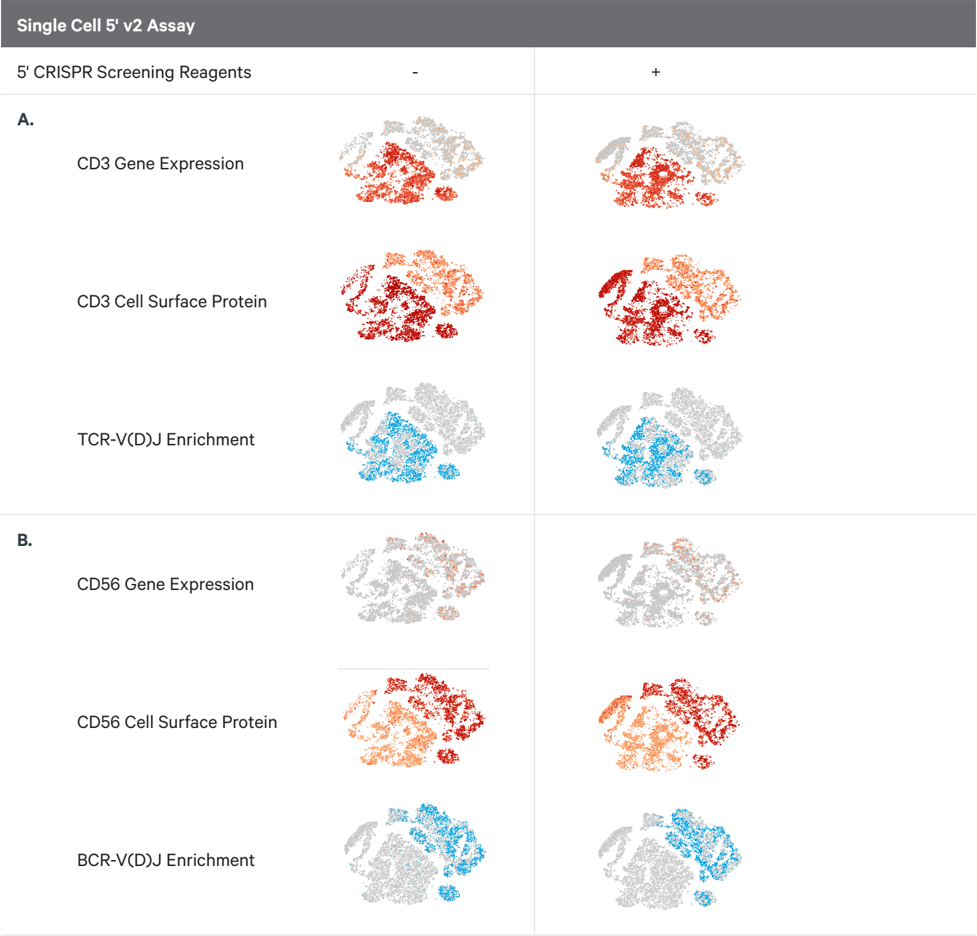

## Single Cell 3' CRISPR Screening Datasets

## Single Cell 3' Dataset 1: Cells Transduced with 2 guide RNAs

## Experimental Design

A549 lung carcinoma cells expressing dCas9-KRAB were transduced for CRISPR screening. Compatible sgRNA Lentivirus constructs in the MilliporeSigma 10X  CRISPRi Feature Barcode Optimization Kit that consists of four tubes, each containing Lentiviral particles expressing either a non-targeting control guide or a Rab1a targeting guide, mixed in a 1:1 ratio were used.  A549 cells were transduced with one of the four capture sequence/ location combinations (i.e.. Capture Sequence 1 and 2 integrated in either the stem or the 3' end of the sgRNA construct) before being used in the 10x Genomics CRISPR workflow. The transduced sgRNA containing cells were selected using blastocydin (selection for dCas9-KRAB) and puromycin (selection for sgRNA).

Gene Expression and CRISPR Screening libraries were generated with a target cell load of 1,000 (500 cells each for control and Rab1a sgRNA) and sequenced as described in the Chromium Next GEM Single Cell 3' User Guide with Feature Barcode technology for CRISPR Screening (CG000316).

Figure 25. Schematic showing the experimental design used for generating Single Cell 3' Dataset 1 using A549 lung carcinoma cells with a target cell load of 1,000.

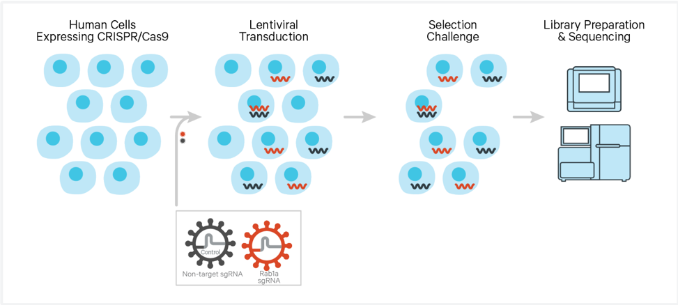

## Single Cell 3' Dataset 1

## Key Data Metrics

10x Genomics Cell Ranger software was used for data analysis and visualization. The output included 10x Genomics Web Summary file with information about number of cells recovered, reads per cell, and genes per cell, as well as a barcode rank plot displaying cells vs background, as shown in the adjacent plot (Figure 26).

The data also includes CRISPR Application metrics (Figure 27). Fraction of Reads with putative protospacer is the first filter and includes reads that contain the 20 bp constant sequence adjacent to the protospacer. Fraction guide reads is the second filter that includes reads in which a protospacer sequence is detected.  The final level of filtering requires that read also contain a cell-associated barcode.

The CRISPR Application metrics also includes summary metrics that convey the percentage of cells with either ≥1 or ≥2 protospacers detected. In this dataset, 72.7% cells with 1 or more protospacers were detected while only 2.0% cells with 2 or more protospacers were detected indicating that a significant majority of cells received only one sgRNA. It is important to note, that the algorithm cannot differentiate between ≥ 2 protospacers detected resulting from multiple cells being encapsulated into a single GEM, or as the result of the original transduction event.  The calculated median UMIs per well for Single Cell 3' Dataset 1 was 85.

Figure 26.  Web Summary file with information about  number of cells recovered, reads per cell, genes per cell, and the barcode rank plot.

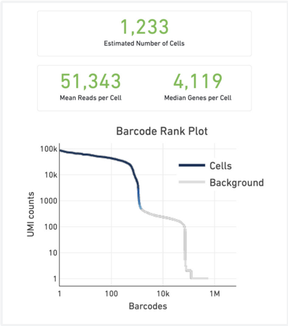

Figure 27.  CRISPR Application metrics for Single Cell 3' Dataset 1.

## Single Cell 3' Dataset 1

## Data Visualization

Loupe file, a Cell Ranger output, was used to visualize the single cell data derived from the experiment. UMAP projection of the gene expression and CRISPR guide based cell clustering is shown in Figures 28A and 28B respectively.  Importing guide calls from Cell Ranger into Loupe Browser shows which cells received a specific sgRNA (Figure 28D). This same overlay when translated back to the gene expression based clustering (Figure 28C) shows no major clustering differences between cells that received the non-targeting guide and the cells that received Rab1a target guide.

Rab1a expression in cells receiving either sgRNA was determined using Loupe Browser, as shown in Figure 28E. The data confirms significant Rab 1a knockdown.

Figure 28.  Gene expression and CRISPR based cell clustering (A-D) and Rab1a gene expression in cells based on CRISPR guide calls (E) .

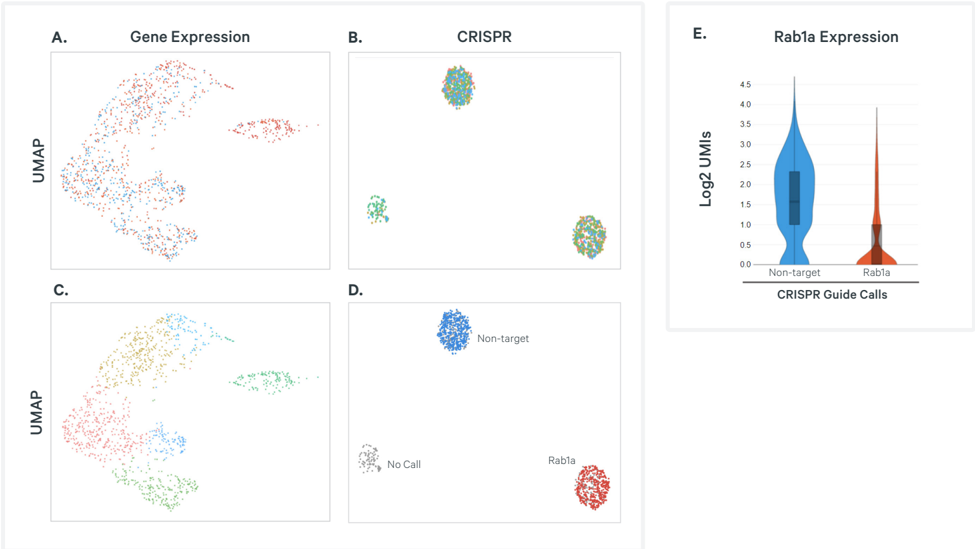

## Single Cell 3' Dataset 1

## Capture Sequence &amp; Integration Location

To determine the best capture sequence and integration location combination, CRISPR data derived from cells transduced using the MilliporeSigma 10X  CRISPRi Feature Barcode Optimization Kit with Capture Sequence 1 or Capture Sequence 2 integrated in either the 3' end or the stem location were analyzed (Figure 29).

CRISPR mapping data shows that Capture Sequence 2 integrated in the stem location has the highest fraction of usable guide reads(Figure 29A), which indicates high quality CRISPR Screening libraries and limits additional sequencing costs. All four combinations showed comparable protospacer distribution in transduced cells (Figure 29B).

None of the four combinations disrupt the overall transcriptional profiles of the cells as observed in the gene expression based cell clustering in Loupe Browser (Figure 29C).

Figure 29. CRISPR and gene expression data were derived from A549 cells transduced with indicated combinations of Capture sequence 1 and 2 integrated in either the 3' end or the stem of the sgRNA.  CRISPR mapping and protospacer assignments (A-B) along with gene expression profile (C) and Rab 1a expression (D) for each of the four combinations is shown.

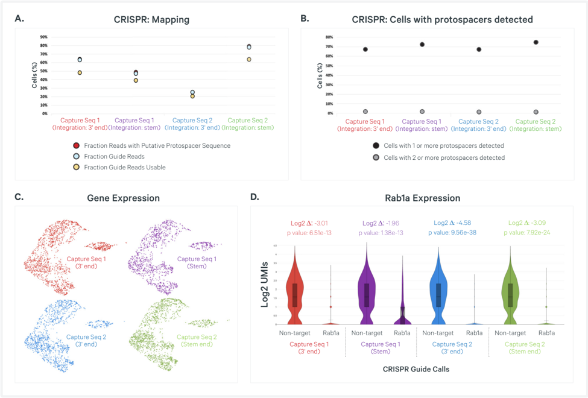

To measure CRISPR guide efficacy, comparison of Rab1a knockdown across the four combinations shows all combinations result in significant Rab 1a knockdown but Capture Sequence 2 integrated at the 3' end has the best knockdown (Figure 29D).

Even though Capture sequence 2 integrated at the 3' end shows the best knockdown in this experiment, 10x Genomics recommends using Capture Sequence 2 in the stem location as it has substantially better capture efficiency (Figure 29A).

Overall, the selection of the best capture sequence and integration location combination may vary between different experiments and will depend on the specifics of the CRISPR setup and other experimental conditions.

## Single Cell 3' Dataset 2: Cells Transduced with 93 sgRNA Pool

## Experimental Design

A549 cells expressing dCas9-KRAB were transduced with larger Lentiviral sgRNA pool with Capture Sequence 2 integrated in the sgRNA stem.  The Lentiviral pool included a total of 93 sgRNAs of which

3 were non-targeting control sgRNAs and 90 were targeting sgRNAs targeting 45 different genes.  The transduced cells were selected using blastocydin and puromycin.  Gene Expression and CRISPR Screening libraries were generated with a target cell load of 10,000 and sequenced as described in the Chromium Next GEM Single Cell 3' User Guide with Feature Barcode technology for CRISPR Screening (CG000316).

Figure 30. Schematic showing the experimental design used for generating Single Cell 3' Dataset 2 from A549 lung carcinoma cells transduced with a pool of 93 Lentiviral sgRNAs.

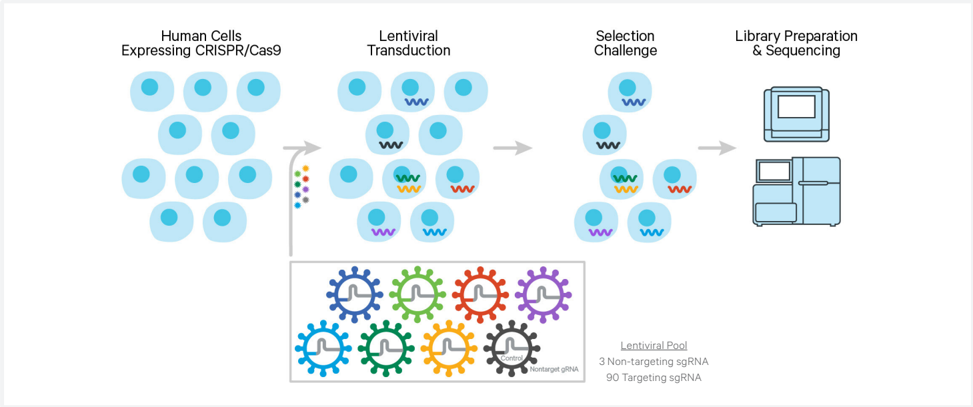

## Single Cell 3' Dataset 2

## Key Data Metrics

The output Web Summary file and the CRISPR Application metrics for Single Cell 3' Dataset 2 are shown in Figures 31 and 32, respectively.

Figure 31. CRISPR application metrics derived from Single Cell 3' Dataset 2.

Figure 32. Single Cell 3' Dataset 2 Web Summary file with information about  number of cells recovered, reads per cell, genes per cell, and the barcode rank plot.

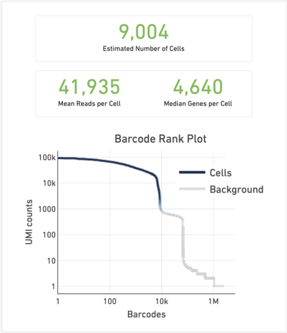

## Single Cell 3' Dataset 2

## Quality Control Data

Figure 33 shows the distribution of protospacers in Single Cell 3' Dataset 2, analyzed using Cell Ranger. The plot shows the percentage of cells with 0, 1, 2, or more protospacers. Majority of the cells received 1 protospacer, a smaller percentage of cells had 2 protospacers, while very few cells with more than 3 protospacers were detected, indicating that majority of cells received only one sgRNA.

As per QC Recommendations, NGS QC (MilliporeSigma) of the Lentiviral 93 sgRNA pool was performed for this experiment to ensure that the representation of each sgRNA was as expected. The Cell Ranger single cell data derived from the same experiment when compared to the MilliporeSigma NGS pool QC data showed similar distribution of various sgRNAs (Figure 34). Also, as expected, a higher percent of non-targeting sgRNA were observed (dotted rectangle, Figure 34) implying that ~1,000 non-targeting sgRNA containing cells were recovered.

Figure 33. Protospacer assignments in A549 cells transduced with the 93 sgRNA Lentiviral pool.

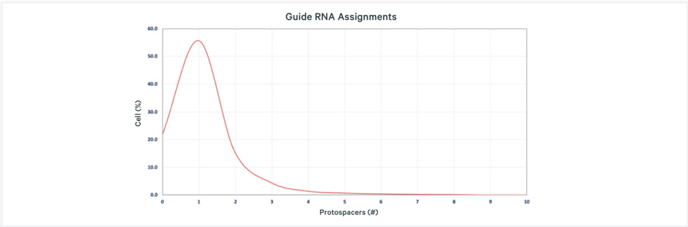

Figure 34. Comparable distribution of protospacers is observed between the 10x Genomics Single Cell CRISPR data and the MilliporeSigma NGS pool QC data. As expected, a higher percent of non-targeting sgRNAs (dotted rectangle) were observed in both sets of data.

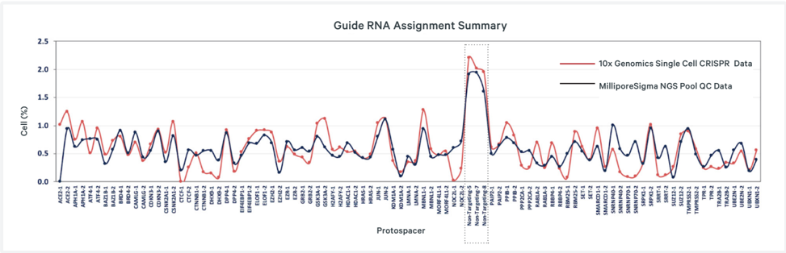

## Single Cell 3' Dataset 2

## Data Visualization

Cell Ranger data were visualized using Loupe Browser. Gene expression and CRISPR based cell clusterings are shown in Figures 35A and 35B, respectively.  A few cell clusters with lower gene expression levels were identified (Figure 35C). These cells with lower gene expression cluster together in the CRISPR t-SNE panel (Figure 35D).

Overlaying the CRISPR guide calls shows that the cells marked in purple correspond to cells that don't have a confident CRISPR guide call.  These data emphasize the importance of optimizing cell preparation for CRISPR screening  as it can impact the percentage of cells with confidently assigned sgRNA.

Figure 35.  Gene expression and CRISPR based cell clustering for Single Cell 3' Dataset 2.

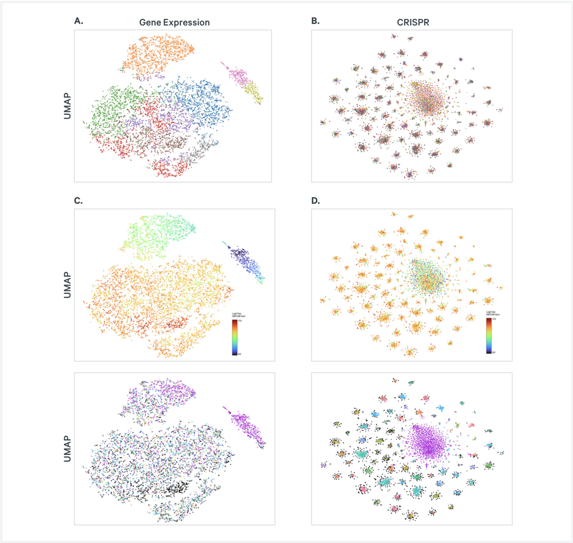

## Single Cell 3' Dataset 2

## Knockdown Efficiency

As mentioned earlier, the MilliporeSigma NGS pool QC performed prior to the single cell experiment included 93 sgRNAs of which 3 were control sgRNAs and 90 were targeting sgRNA (Table 1).

The single cell data analyzed using Cell Ranger detected

Table 1.  Guides detected and corresponding knockdown efficiencies observed in single cell data.

| NGS Pool QC Data                                      |   # sgRNA |
|-------------------------------------------------------|-----------|
| Total Guides                                          |        93 |
| Control non-target sgRNAs                             |         3 |
| Targeting sgRNAs                                      |        90 |
| Single Cell Data                                      |           |
| Total Guides Detected                                 |        84 |
| sgRNAs resulting in significant knockdown             |        51 |
| sgRNAs resulting in significant knockdown + Log 2 ≥ 2 |        39 |

## Exploring Single Cell 3' Dataset 2

The large amount of data generated in this experiment may be used to perform in-depth analysis. As one example, for ELOF1-2, cells that received ELOF1-2 sgRNA clustered distinctly from cells with nontargeting sgRNAs (data not shown). As expected, a significant ELOF1-2 knockdown was observed in the targeting sgRNA containing cells (data not shown).

cells containing 84 out of the 90 targeting sgRNA, of which 51 sgRNAs resulted in significant knockdown compared to cells that received a non-targeting sgRNA (Figure 36, Table 1).  The data was further filtered and showed that 39 sgRNAs resulted in greater than  2 fold knockdown.

Figure 36. Significant knockdown efficiency was observed in cells expressing 51 (red dots) of the 84 sgRNAs detected in single cell data.

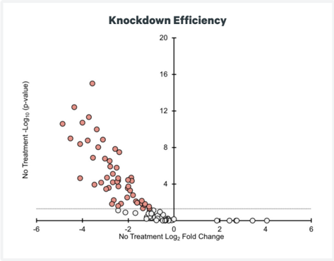

A heat map comparing expression of ELOF1-2 sgRNA containing cells to non-targeting sgRNA containing cells shows two additional genes, besides ELOF1-2, with significant knockdown and nine genes that were significantly upregulated in ELOF1-2 sgRNA containing cells (Figure 37). These data provide valuable insights into underlying molecular changes resulting in the cell clustering differences.

Figure 37.  Heat map comparing ELOF1-2 sgRNA containing cells to non-targeting sgRNA containing cells. In addition to ELOF1-2, two other genes showed significant knockdown (red rectangle), while nine genes were significantly upregulated in ELOF1-2 sgRNA containing cells (green rectangle).

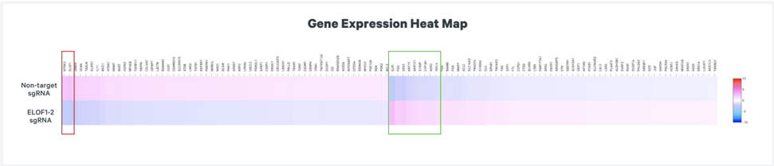

## Single Cell 3' Dataset 2

## Drug Treatment

Figure 38 highlights the immense potential of the data generated in a single experiment. Gene expression based clustering was derived from untreated cells or cells treated with 1 of 7 drugs targeting the epigenome or RNA splicing (Figure 38A).

Overlaying  the CRISPR guide calls onto these cells (Figure 38B) provides information regarding 90 targeting sgRNAs tested over 8 distinct conditions (7 drug treatments and 1 untreated) yielding a total of 720 combinatorial tests in one experiment.

Figure 38.  Single cell gene expression clustering data from untreated or drug treated cells (A) overlaid with CRISPR guide calls (B).

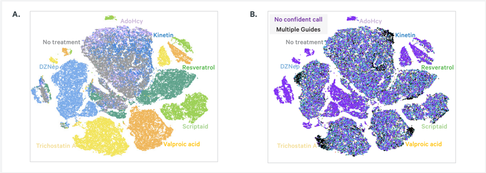

## References

1.  Replogle, J.M., Norman, T.M., Xu, A. et al. Combinatorial single-cell CRISPR screens by direct guide RNA capture and targeted sequencing. Nat Biotechnol (2020). https://doi.org/10.1038/s41587-020-0470-y
2.  Jaitin, D.A., Weiner, F., Yofe, I. et al. Dissecting Immune Circuits by Linking CRISPR-Pooled Screens with SingleCell RNA-Seq. Cell (Dec 15, 2016) Vol 167, Issue 7, P1883-1896.E15.
3.  Datlinger, P., Rendeiro, A.F., Schmidl, C. et al., Pooled CRISPR screening with single-cell transcriptome readout. Nature Methods (2017) Volume 14, pages297-301.

LEGAL NOTICE © 2022 10x Genomics, Inc.  All rights reserved.  Duplication and/or reproduction of all or any portion of this document without the express written consent of 10x Genomics, Inc., is strictly forbidden.  Nothing contained herein shall constitute any warranty, express or implied, as to the performance of any products described herein. Any and all warranties applicable to any products are set forth in the applicable terms and conditions of sale accompanying the purchase of such product. 10x Genomics provides no warranty and hereby disclaims any and all warranties as to the use of any third party products or protocols described herein.  The use of products described herein is subject to certain restrictions as set forth in the applicable terms and conditions of sale accompanying the purchase of such product. '10x', '10x Genomics', 'Changing the Definition of Sequencing', 'Chromium', 'GemCode', 'Loupe', 'Long Ranger', 'Cell Ranger' and 'Supernova' are trademarks of 10x Genomics, Inc. All other trademarks are the property of their respective owners.  All products and services described herein are intended FOR RESEARCH USE ONLY and NOT FOR USE IN DIAGNOSTIC PROCEDURES. The use of 10x Product(s) in practicing the methods set forth herein has not been validated by 10x, and such non-validated use is NOT COVERED BY 10X STANDARD WARRANTY, AND 10X HEREBY DISCLAIMS ANY AND ALL WARRANTIES FOR SUCH USE.Nothing in this document should be construed as altering, waiving or amending in any manner 10x Genomics, Inc., terms and conditions of sale for the Chromium ™  Controller or the Chromium Single Cell Controller, consumables or software, including without limitation such terms and conditions relating to certain use restrictions, limited license, warranty and limitation of liability, and nothing in this document shall be deemed to be Documentation, as that term is set forth in such terms and conditions of sale. Nothing in this document shall be construed as any representation by 10x Genomics, Inc that it currently or will at any time in the future offer or in any way support any application set forth herein.  LIT 012456789REVA / 022118

## Contact:

## [support@10xgenomics.com](mailto:support%4010xgenomics.com?subject=)

10x Genomics 6230 Stoneridge Mall Road Pleasanton, CA 94588 USA

