[Download the original PDF](10X_protocol.pdf){.btn .btn-primary download="10X_protocol.pdf"}

Source PDF: [10X_protocol.pdf](10X_protocol.pdf)

## USER GUIDE

## Chromium Next GEM Single Cell 3

## ' Reagent Kits v3.1 (Dual Index)

with Feature Barcode technology for CRISPR Screening

## FOR USE WITH

Chromium Next GEM Single Cell 3 ' Kit v3.1, 16 rxns PN-1000268

Chromium Next GEM Single Cell 3 ' Kit v3.1, 4 rxns PN-1000269

3' Feature Barcode Kit, 16 rxns PN-1000262

Chromium Next GEM Chip G Single Cell Kit, 48 rxns PN-1000120

Chromium Next GEM Chip G Single Cell Kit, 16 rxns PN-1000127

Dual Index Kit TT Set A, 96 rxns PN-1000215

Dual Index Kit NT Set A, 96 rxns PN-1000242

## Notices

## Document Number

CG000316 · Rev D

## Legal Notices

© 2022 10x Genomics, Inc (10x Genomics). All rights reserved. Duplication and/or reproduction of all or any portion of this document without the express written consent of 10x Genomics, is strictly forbidden. Nothing contained herein shall constitute any warranty, express or implied, as to the performance of any products described herein. Any and all warranties applicable to any products are set forth in the applicable terms and conditions of sale accompanying the purchase of such product. 10x Genomics provides no warranty and hereby disclaims any and all warranties as to the use of any third-party products or protocols described herein. The use of products described herein is subject to certain restrictions as set forth in the applicable terms and conditions of sale accompanying the purchase of such product. A non-exhaustive list of 10x Genomics' marks, many of which are registered in the United States and other countries can be viewed at: www.10xgenomics.com/trademarks. 10x Genomics may refer to the products or services offered by other companies by their brand name or company name solely for clarity, and does not claim any rights in those third party marks or names. 10x Genomics products may be covered by one or more of the patents as indicated at: www.10xgenomics.com/patents. The use of products described herein is subject to 10x Genomics Terms and Conditions of Sale, available at www.10xgenomics.com/legal-notices, or such other terms that have been agreed to in writing between 10x Genomics and user. All products and services described herein are intended FOR RESEARCH USE ONLY and NOT FOR USE IN DIAGNOSTIC PROCEDURES.

## Instrument &amp; Licensed Software Updates Warranties

Updates to existing  Instruments  and  Licensed  Software  may  be  required  to  enable  customers  to  use new or existing products.  In the event of an Instrument failure resulting from an update, such failed Instrument will be replaced or repaired in accordance with the 10x Limited Warranty, Assurance Plan or service agreement, only if such Instrument is covered by any of the foregoing at the time of such failure. Instruments not covered under a current 10x Limited Warranty, Assurance Plan or service agreement will not be replaced or repaired.

## Support

Email: support@10xgenomics.com 10x Genomics 6230 Stoneridge Mall Road Pleasanton, CA 94588  USA

| Document Revision Summary   | Document Number Title   | CG000316 Chromium Next GEM Single Cell 3' Reagent Kits v3.1 (Dual Index) with Feature Barcode technology for Screening User Guide   |
|-----------------------------|-------------------------|-------------------------------------------------------------------------------------------------------------------------------------|
|                             |                         | CRISPR                                                                                                                              |
|                             | Revision                | Rev D                                                                                                                               |
|                             | Revision Date           | August 2021                                                                                                                         |

## Specific Changes:

- Updated pipette tip and thermal cycler recommendations.
- Updated chip assembly guidance in Tips &amp; Best Practices and in step 1 - GEM Generation &amp; Barcoding.
- Updated Troubleshooting section to include guidance on gasket misalignment and GEM transfer.

## General Changes:

- Updated for general minor consistency of language and terms throughout.

## Table of Contents

| Introduction                                                                            |   6 |
|-----------------------------------------------------------------------------------------|-----|
| Chromium Next GEM Single Cell 3' Reagent Kits                                           |   7 |
| 10x Genomics Accessories                                                                |  11 |
| Recommended Thermal Cyclers                                                             |  11 |
| Additional Kits, Reagents & Equipment                                                   |  12 |
| Protocol Steps & Timing                                                                 |  14 |
| Stepwise Objectives                                                                     |  15 |
| CRISPR Screening Overview                                                               |  19 |
| Tips & Best Practices                                                                   |  20 |
| Step 1                                                                                  |  27 |
| GEM Generation & Barcoding                                                              |  27 |
| 1.1 Prepare Master Mix                                                                  |  29 |
| 1.2 Load Chromium NextGEM Chip G                                                        |  31 |
| 1.3 Run the Chromium Controller or X/iX                                                 |  32 |
| 1.4 Transfer GEMs                                                                       |  34 |
| 1.5 GEM-RT Incubation                                                                   |  34 |
| Step 2                                                                                  |  35 |
| Post GEM-RT Cleanup & cDNA Amplification                                                |  35 |
| 2.1 Post GEM-RT Cleanup - Dynabeads                                                     |  37 |
| 2.2 cDNA Amplification                                                                  |  39 |
| 2.3 cDNA Cleanup - SPRIselect                                                           |  41 |
| 2.3A Pellet Cleanup                                                                     |  41 |
| 2.3B Transferred Supernatant Cleanup                                                    |  41 |
| 2.4 Post cDNA Amplification QC & Quantification                                         |  42 |
| Step 3                                                                                  |  43 |
| 3' Gene Expression Library Construction                                                 |  43 |
| 3.1 Fragmentation, End Repair & A-tailing                                               |  46 |
| 3.2 Post Fragmentation, End Repair & A-tailing Double Sided Size Selection - SPRIselect |  47 |
| 3.3 Adaptor Ligation                                                                    |  48 |
| 3.4 Post Ligation Cleanup - SPRIselect                                                  |  49 |
| 3.5 Sample Index PCR                                                                    |  50 |
| 3.6 Post Sample Index PCR Double Sided Size Selection - SPRIselect                      |  51 |
| 3.7 Post Library Construction QC                                                        |  52 |

TOC

| Step 4                                                             |   53 |
|--------------------------------------------------------------------|------|
| CRISPR Screening Library Construction                              |   53 |
| 4.1 Guide RNA cDNA Cleanup - SPRIselect                            |   55 |
| 4.2 Feature PCR                                                    |   56 |
| 4.3 Post Feature PCR Cleanup - SPRIselect                          |   57 |
| 4.4 Sample Index PCR                                               |   58 |
| 4.5 Post Sample Index PCR Double Sided Size Selection - SPRIselect |   59 |
| 4.6 Post Library Construction QC                                   |   60 |
| Sequencing                                                         |   61 |
| Troubleshooting                                                    |   65 |
| GEM Generation & Barcoding                                         |   66 |
| Chromium Instrument Errors                                         |   69 |
| Appendix                                                           |   70 |
| Post Library Construction Quantification                           |   71 |
| Agilent TapeStation Traces                                         |   72 |
| LabChip Traces                                                     |   73 |
| Compatible sgRNA Specifications                                    |   74 |
| Oligonucleotide Sequences                                          |   75 |

## Introduction

Chromium Next GEM Single Cell 3 ' Reagent Kits v3.1 (Dual Index) 10x Genomics Accessories Recommended Thermal Cyclers Additional Kits, Reagents &amp; Equipment Protocol Steps &amp; Timing Stepwise Objectives CRISPR Screening Overview

## Chromium Next GEM Single Cell 3' Reagent Kits Chromium Next GEM Single Cell 3' Kit v3.1, 16 rxns PN-1000268

## Chromium Next GEM Single Cell 3 ' GEM Kit v3.1 16 rxns PN-1000123 (store at -20°C)

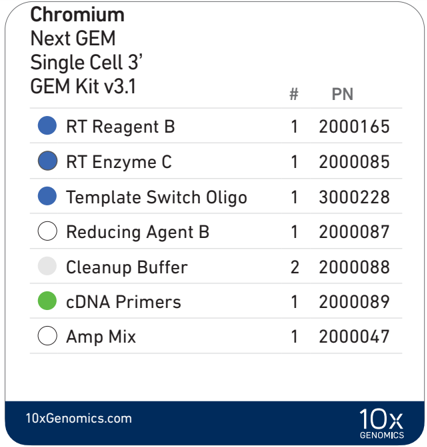

Library Construction Kit 16 rxns PN-1000190 (store at -20°C)

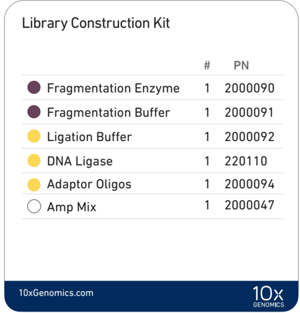

## Chromium Next GEM Single Cell 3 ' Gel Bead Kit v3.1, 16 rxns PN-1000122 (store at -80°C)

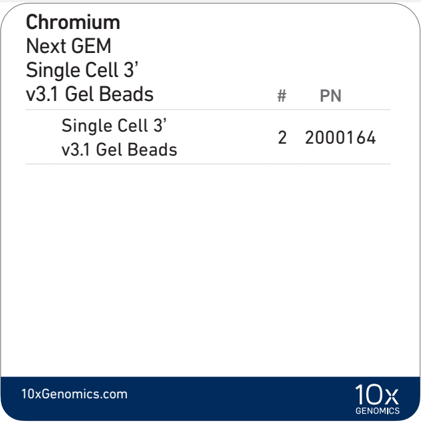

## Dynabeads ™ MyOne ™ SILANE PN-2000048 (store at 4°C)

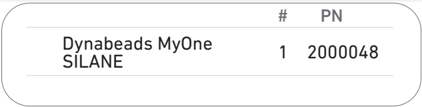

## Chromium Next GEM Single Cell 3' Kit v3.1, 4 rxns PN-1000269

## Chromium Next GEM Single Cell 3 ' GEM Kit v3. 1 4 rxns PN-1000130 (store at -20°C)

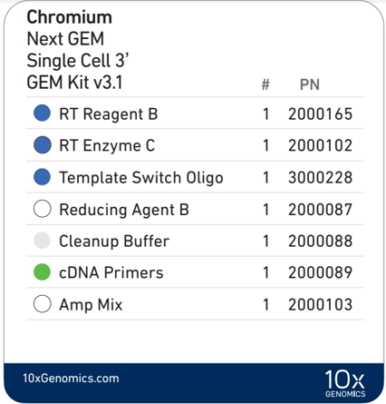

Library Construction Kit 4 rxns PN-1000196 (store at -20°C)

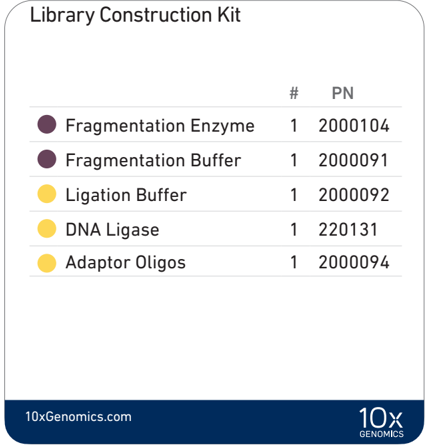

## Chromium Next GEM Single Cell 3 ' Gel Bead Kit v3.1, 4 rxns PN-1000129 (store at -80°C)

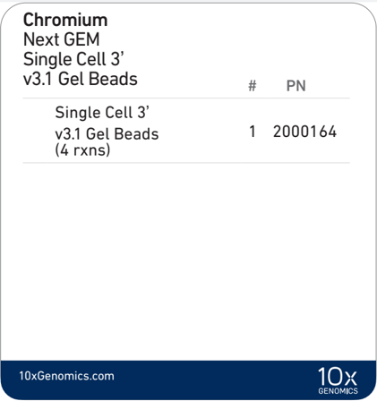

## Dynabeads ™ MyOne ™ SILANE PN-2000048 (store at 4°C)

## 3' Feature Barcode Kit, 16 rxns PN-1000262 (store at -20°C)

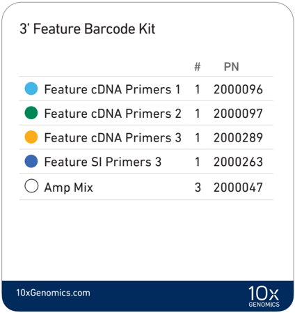

## Dual Index Kit TT Set A, 96 rxns PN-1000215 (store at -20°C)

## Dual Index Kit NT Set A, 96 rxns PN-1000242  (store at -20°C)

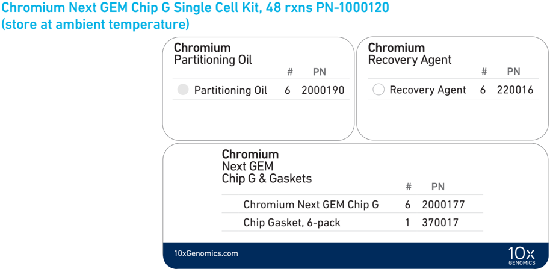

## Chromium Next GEM Chip G Single Cell Kit, 16 rxns PN-1000127 (store at ambient temperature)

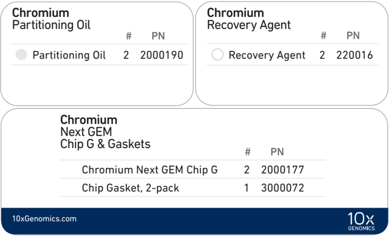

## 10x Genomics Accessories

## Recommended Thermal Cyclers

| Product                            |   Part Number (Kit) |   Part Number (Item) |
|------------------------------------|---------------------|----------------------|
| 10x Vortex Adapter                 |              120251 |               330002 |
| 10x Magnetic Separator             |              120250 |               230003 |
| Chromium Next GEM Secondary Holder |             1000142 |              3000332 |

The table below lists the thermal cyclers that have been validated by 10x Genomics. Thermal cyclers used must support uniform heating of 100 µl emulsion volumes.

| Supplier                 | Description                                                  | Part Number                                                         |
|--------------------------|--------------------------------------------------------------|---------------------------------------------------------------------|
| BioRad                   | C1000 Touch Thermal Cycler with 96-Deep Well Reaction Module | 1851197                                                             |
| Analytik Jena†           | Biometra TAdvanced 96 SG                                     | 846-x-070-241 (x = 2 for 230 V; 4 for 115 V; 5 for 100 V, 50-60 Hz) |
| Eppendorf‡               | Mastercycler X50s*                                           | 6311000010                                                          |
|                          | Mastercycler Pro (discontinued)                              | North America 950030010 International 6321 000.019                  |
| Thermo Fisher Scientific | Veriti 96-Well Thermal Cycler                                | 4375786                                                             |

For select instruments, ramp rates should be adjusted for all steps as described below:

† Analytik Jena Biometra TAdvanced 96 SG: 2°C/sec for both heating and cooling

‡ Eppendorf Mastercycler X50s: 3°C/sec heating and 2°C/sec cooling

## Additional Kits, Reagents &amp; Equipment

The  items  in  the  table  below  have  been  validated  by  10x  Genomics  and  are  highly recommended for the Single Cell 3 ' protocols. Substituting materials may adversely affect system performance. This list may not include some standard laboratory equipment.

| Supplier                         | Description                                                                                                                                                                 |                                                                                                                                                  | Part Number (US)                                                            |
|----------------------------------|-----------------------------------------------------------------------------------------------------------------------------------------------------------------------------|--------------------------------------------------------------------------------------------------------------------------------------------------|-----------------------------------------------------------------------------|
| Plastics                         |                                                                                                                                                                             |                                                                                                                                                  |                                                                             |
| Eppendorf                        | PCR Tubes 0.2 ml 8-tube strips DNA LoBind Tubes, 1.5 ml DNA LoBind Tubes, 2.0 ml                                                                                            | Choose either Eppendorf, USA Scientific or                                                                                                       | 951010022 022431021 022431048                                               |
| USA Scientific                   | TempAssure PCR 8-tube strip                                                                                                                                                 | Thermo Fisher Scientific PCR                                                                                                                     | 1402-4700                                                                   |
| Thermo Fisher Scientific         | MicroAmp 8-Tube Strip, 0.2 ml MicroAmp 8 -Cap Strip, clear                                                                                                                  | 8-tube strips.                                                                                                                                   | N8010580 N8010535                                                           |
| Kits & Reagents                  |                                                                                                                                                                             |                                                                                                                                                  |                                                                             |
| Thermo Fisher Scientific         | Nuclease-free Water Low TE Buffer (10 mM Tris-HCl pH 8.0, 0.1 mM EDTA)                                                                                                      | Nuclease-free Water Low TE Buffer (10 mM Tris-HCl pH 8.0, 0.1 mM EDTA)                                                                           | AM9937 12090-015                                                            |
| Millipore Sigma                  | Ethanol, Pure (200 Proof, anhydrous)                                                                                                                                        | Ethanol, Pure (200 Proof, anhydrous)                                                                                                             | E7023-500ML                                                                 |
| Beckman Coulter                  | SPRIselect Reagent Kit                                                                                                                                                      | SPRIselect Reagent Kit                                                                                                                           | B23318                                                                      |
| Bio-Rad                          | 10% Tween 20                                                                                                                                                                | 10% Tween 20                                                                                                                                     | 1662404                                                                     |
| Ricca Chemical Company           | Glycerin (glycerol), 50% (v/v) Aqueous Solution                                                                                                                             | Glycerin (glycerol), 50% (v/v) Aqueous Solution                                                                                                  | 3290-32                                                                     |
| Qiagen                           | Qiagen Buffer EB                                                                                                                                                            | Qiagen Buffer EB                                                                                                                                 | 19086                                                                       |
| Equipment                        |                                                                                                                                                                             |                                                                                                                                                  |                                                                             |
| VWR                              | Vortex Mixer Divided Polystyrene Reservoirs VWR Mini Centrifuge (alternatively, use any equivalent mini centrifuge)                                                         | Vortex Mixer Divided Polystyrene Reservoirs VWR Mini Centrifuge (alternatively, use any equivalent mini centrifuge)                              | 10153-838 41428-958 76269-066                                               |
| Eppendorf                        | Eppendorf ThermoMixer C Eppendorf SmartBlock 1.5 ml, Thermoblock for 24 reaction vessel (alternatively, use a temperature-controlled Heat Block)                            | Eppendorf ThermoMixer C Eppendorf SmartBlock 1.5 ml, Thermoblock for 24 reaction vessel (alternatively, use a temperature-controlled Heat Block) | 5382000023 5360000038                                                       |
| Quantification & Quality Control |                                                                                                                                                                             |                                                                                                                                                  |                                                                             |
| Agilent                          | 2100 Bioanalyzer Instrument & Laptop Bundle High Sensitivity DNA Kit 4200 TapeStation High Sensitivity D1000 ScreenTape/Reagents High Sensitivity D5000 ScreenTape/Reagents | Choose Bioanalyzer, TapeStation, LabChip, Fragment Analyzer or Qubit based on availability                                                       | G2939BA & G2953CA 5067-4626 G2991AA 5067-5584/5067-5585 5067-5592/5067-5593 |
| Thermo Fisher Scientific         | Qubit 4.0 Flourometer Qubit dsDNA HS Assay Kit                                                                                                                              | & preference.                                                                                                                                    | Q33226 Q32854                                                               |
| Advanced Analytical              | Fragment Analyzer Automated CE System - 12 cap Fragment Analyzer Automated CE System - 48/96 cap High Sensitivity NGS Fragment Analysis Kit                                 | Fragment Analyzer Automated CE System - 12 cap Fragment Analyzer Automated CE System - 48/96 cap High Sensitivity NGS Fragment Analysis Kit      | FSv2-CE2F FSv2-CE10F DNF-474                                                |
| PerkinElmer                      | LabChip GX Touch HT Nucleic Acid Analyzer DNA High Sensitivity Reagent Kit                                                                                                  | LabChip GX Touch HT Nucleic Acid Analyzer DNA High Sensitivity Reagent Kit                                                                       | CLS137031 CLS760672                                                         |
| KAPA Biosystems                  | KAPA Library Quantification Kit for Illumina Platforms                                                                                                                      | KAPA Library Quantification Kit for Illumina Platforms                                                                                           | KK4824                                                                      |

## Recommended Pipette Tips

10x Genomics recommends using only validated emulsion-safe pipette tips for all Single Cell protocols. Rainin pipette tips have been extensively validated by 10x Genomics and are highly recommended for all single cell assays. If Rainin tips are unavailable, any of the listed alternate pipette tips validated by 10x Genomics may be used.

| Supplier                                                                                                       | Description                                                                                                                                  | Part Number (US)                                                                                               |
|----------------------------------------------------------------------------------------------------------------|----------------------------------------------------------------------------------------------------------------------------------------------|----------------------------------------------------------------------------------------------------------------|
| Recommended Pipettes & Pipette tips                                                                            | Recommended Pipettes & Pipette tips                                                                                                          |                                                                                                                |
| Rainin                                                                                                         | Pipettes                                                                                                                                     |                                                                                                                |
|                                                                                                                | Pipet-Lite Multi Pipette L8-50XLS+                                                                                                           | 17013804                                                                                                       |
|                                                                                                                | Pipet-Lite Multi Pipette L8-200XLS+                                                                                                          | 17013805                                                                                                       |
|                                                                                                                | Pipet-Lite Multi Pipette L8-10XLS+                                                                                                           | 17013802                                                                                                       |
|                                                                                                                | Pipet-Lite Multi Pipette L8-20XLS+                                                                                                           | 17013803                                                                                                       |
|                                                                                                                | Pipet-Lite LTS Pipette L-2XLS+                                                                                                               | 17014393                                                                                                       |
|                                                                                                                | Pipet-Lite LTS Pipette L-10XLS+                                                                                                              | 17014388                                                                                                       |
|                                                                                                                | Pipet-Lite LTS Pipette L-20XLS+                                                                                                              | 17014392                                                                                                       |
|                                                                                                                | Pipet-Lite LTS Pipette L-100XLS+                                                                                                             | 17014384                                                                                                       |
|                                                                                                                | Pipet-Lite LTS Pipette L-200XLS+                                                                                                             | 17014391                                                                                                       |
|                                                                                                                | Pipet-Lite LTS Pipette L-1000XLS+                                                                                                            | 17014382                                                                                                       |
|                                                                                                                | Pipette Tips                                                                                                                                 |                                                                                                                |
|                                                                                                                | Tips LTS 200UL Filter RT-L200FLR                                                                                                             | 30389240                                                                                                       |
|                                                                                                                | Tips LTS 1ML Filter RT-L1000FLR                                                                                                              | 30389213                                                                                                       |
|                                                                                                                | Tips LTS 20UL Filter RT-L10FLR                                                                                                               | 30389226                                                                                                       |
| Alternate Recommendations (If Rainin pipette tips are unavailable, any of the listed pipette tips may be used) | Alternate Recommendations (If Rainin pipette tips are unavailable, any of the listed pipette tips may be used)                               | Alternate Recommendations (If Rainin pipette tips are unavailable, any of the listed pipette tips may be used) |
| Eppendorf                                                                                                      | Pipettes                                                                                                                                     |                                                                                                                |
|                                                                                                                | Eppendorf Research plus, 8-channel, epT.I.P.S. Box, 0.5 - 10 µL                                                                              | 3125000010                                                                                                     |
|                                                                                                                | Eppendorf Research plus, 8-channel, epT.I.P.S. Box, 10 - 100 µL                                                                              | 3125000036                                                                                                     |
|                                                                                                                | Eppendorf Research plus, 8-channel, epT.I.P.S. Box, 100 - 300 µL                                                                             | 3125000052                                                                                                     |
|                                                                                                                | Eppendorf Research plus, 1-channel, epT.I.P.S.® Box, 0.1 - 2.5 µL                                                                            | 3123000012                                                                                                     |
|                                                                                                                | Eppendorf Research plus, 1-channel, epT.I.P.S.® Box, 0.5 - 10 µL                                                                             | 3123000020                                                                                                     |
|                                                                                                                | Eppendorf Research plus, 1-channel, epT.I.P.S.® Box, 2 - 20 µL                                                                               | 3123000039                                                                                                     |
|                                                                                                                | Eppendorf Research plus, 1-channel, epT.I.P.S.® Box, 2 - 200 µL                                                                              | 3123000055                                                                                                     |
|                                                                                                                | Eppendorf Research plus, 1-channel, epT.I.P.S.® Box, 100 - 1000 µL                                                                           | 3123000063                                                                                                     |
|                                                                                                                | Pipette Tips (compatible with Eppendorf pipettes only)                                                                                       |                                                                                                                |
|                                                                                                                | ep Dualfilter T.I.P.S., 2-20 µL                                                                                                              | 0030078535                                                                                                     |
|                                                                                                                | ep Dualfilter T.I.P.S., 2-200 µL                                                                                                             | 0030078551                                                                                                     |
|                                                                                                                | ep Dualfilter T.I.P.S., 2-1,000 µL                                                                                                           | 0030078578 4-1143-965-008                                                                                      |
| Labcon*                                                                                                        | ZAP SLIK 20 µL Low Retention Aerosol Filter Pipet Tips for Rainin LTS ZAP SLIK 200 µL Low Retention Aerosol Filter Pipet Tips for Rainin LTS | 4-1144-965-008                                                                                                 |
|                                                                                                                | ZAP SLIK 1000 µL Low Retention Aerosol Filter Pipet Tips for Rainin LTS                                                                      | 4-1145-965-008                                                                                                 |
| Biotix*                                                                                                        | xTIP4 Racked Pipette Tips, Rainin LTS Pipette Compatible, 0.1-20uL                                                                           | 63300931                                                                                                       |
|                                                                                                                | xTIP4 Racked Pipette Tips, Rainin LTS Pipette Compatible, 200uL                                                                              | 63300001                                                                                                       |
|                                                                                                                | xTIP4 Racked Pipette Tips, Rainin LTS Pipette Compatible, 1000uL                                                                             | 63300003                                                                                                       |

## Protocol Steps &amp; Timing

| Day      | Steps                                                             | Timing                | Stop & Store                                                 |
|----------|-------------------------------------------------------------------|-----------------------|--------------------------------------------------------------|
| 2 h      | Cell Preparation                                                  |                       |                                                              |
| 2 h      | Dependent on Cell Type                                            | ~1-1.5 h              |                                                              |
| 2 h      | Step 1 - GEM Generation & Barcoding                               |                       |                                                              |
| 2 h      | 1.1 Prepare Reaction Mix                                          | 20 min                | 4°C ≤72 h or -20°C ≤1 week STOP                              |
| 2 h      | 1.2 Load Chromium Next GEM Chip G                                 | 10 min                | 4°C ≤72 h or -20°C ≤1 week STOP                              |
| 4 h      | 1.3 Run the Chromium Controller or X/iX                           | 18 min                |                                                              |
| 4 h      | 1.4 Transfer GEMs                                                 | 3 min                 |                                                              |
| 4 h      | 1.5 GEM-RT Incubation                                             | 55 min                |                                                              |
|          | Step 2 - Post GEM-RT Cleanup & cDNA Amplification                 |                       |                                                              |
|          | 2.1 Post GEM RT-Cleanup - Dynabead                                | 45 min                |                                                              |
|          | 2.2 cDNA Amplification                                            | 40 min                | 4°C ≤72 h or STOP                                            |
|          | 2.3 cDNA Cleanup - SPRIselect 2.3A Pellet Cleanup                 | 20 min STOP           | 4°C ≤72 h or -20°C ≤4 weeks 4°C ≤72 h or -20°C ≤4 weeks STOP |
|          | 2.4 2.3B Transferred Supernatant Cleanup cDNA QC & Quantification | 30 min 50 min         | 4°C ≤72 h or -20°C ≤4 weeks 4°C ≤72 h or -20°C ≤4 weeks STOP |
| 6 h      | Step 3 - 3 ' Gene Expression Library Construction                 |                       |                                                              |
| 6 h      | 3.1 Fragmentation, End Repair & A-tailing                         | 50 min                | 4°C ≤72 h 4°C ≤72 h or -20°C long term STOP                  |
| 6 h      | 3.2 Post Fragmentation, End Repair & A-tailing                    | Double 30 min         | 4°C ≤72 h 4°C ≤72 h or -20°C long term STOP                  |
| 6 h      | 3.3 Adaptor Ligation                                              | 25 min                | 4°C ≤72 h 4°C ≤72 h or -20°C long term STOP                  |
| 6 h      | 3.4 Post Ligation Cleanup - SPRIselect                            | 20 min                | 4°C ≤72 h 4°C ≤72 h or -20°C long term STOP                  |
| 6 h      | 3.6 Post Sample Index PCR Double Sided                            | Size Selection 30 min | STOP                                                         |
| 8 h Plus | Step 4 - CRISPR Screening Library Construction                    |                       |                                                              |
| 8 h Plus | 4.1 Guide RNA cDNA Cleanup                                        | 20 min                |                                                              |
| 8 h Plus | 4.2 Feature PCR                                                   | 50 min                |                                                              |
| 8 h Plus | Post Feature PCR Cleanup - SPRIselect                             | 20 min                |                                                              |
| 8 h Plus | 4.3                                                               |                       | min                                                          |
| 8 h Plus | 4.5 Post Sample Index PCR Size Selection                          | 20 min                | 4°C ≤72 h or -20°C long term STOP                            |
| 8 h Plus | 4.6 Post Library Construction QC                                  | - SPRIselect 50 min   | 4°C ≤72 h or -20°C long term STOP                            |

## Stepwise Objectives

## Single Cell 3' v3.1 Gel Beads

## Step 1 GEM Generation &amp; Barcoding

The Chromium Single Cell Gene Expression Solution with Feature Barcode technology upgrades short read sequencers to deliver a scalable microfluidic platform for assessing CRISPR-mediated perturbations of gene expression by profiling 500-10,000 individual cells per sample. A pool of ~3,500,000 10x Barcodes is used to separately index each cell's transcriptome along with the CRISPR-mediated perturbations. It is done by partitioning thousands of cells into nanoliter-scale Gel Beads-in-emulsion (GEMs), where all generated cDNA (from poly-adenylated mRNAs and single-guide RNAs/sgRNAs) share a common 10x Barcode. Libraries are generated and sequenced from the cDNA and 10x Barcodes are used to associate individual reads back to the individual partitions.

This document outlines the protocol for generating Single Cell 3' Gene Expression and CRISPR Screening dual index libraries from the same cells.

In addition to the poly(dT) primer that enables the production of barcoded, full-length cDNA from poly-adenylated mRNA, the Single Cell 3' v3.1 Gel Beads also include two additional primer sequences (Capture Sequence 1 and  Capture Sequence 2), that enable capture and priming of Feature Barcode technology compatible targets or analytes of interest.

The poly(dT) primers along with one of the capture sequence primers are used in this protocol for generating Single Cell 3' Gene  Expression and CRISPR Screening libraries.

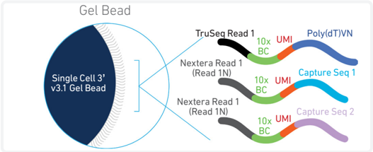

GEMs are generated by combining barcoded Single Cell 3' v3.1 Gel Beads, a Master Mix containing cells, and Partitioning Oil onto Chromium Next GEM Chip G. To achieve single cell resolution, cells are delivered at a limiting dilution, such that the majority (~90-99%) of generated GEMs contain no cell, while the remainder largely contain a single cell.

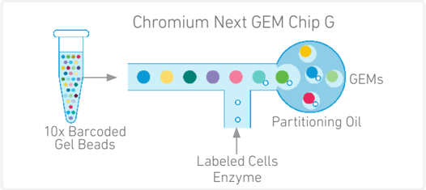

## Step 1 GEM Generation &amp; Barcoding

## See Appendix for Compatible sgRNA Specifications

Immediately following GEM generation, the Gel Bead is dissolved releasing the three types of primers and any co-partitioned cell is lysed. The poly(dT) and the capture sequence primers in the gel bead are engaged simultaneously in two different reactions inside individual GEMs (primer with Capture Sequence 2 is not shown in the illustrated example).

## A. Primers containing:

- an Illumina TruSeq Read 1  (read 1 sequencing primer)
- 16 nt 10x Barcode
- 12 nt unique molecular identifier (UMI)
- 30 nt poly(dT) sequence

## B. Primers containing:

- an Illumina Nextera Read 1 (Read 1N; read 1 sequencing primer)
- 16 nt 10x Barcode
- 12 nt unique molecular identifier (UMI)
- Capture Sequence 1 or 2

Both are mixed with cell lysate and Master Mix containing RT reagents. Incubation of the GEMs produces barcoded, full-length cDNA from poly-adenylated mRNA from reagents in A and barcoded DNA from the sgRNA Feature Barcode from reagents in B.

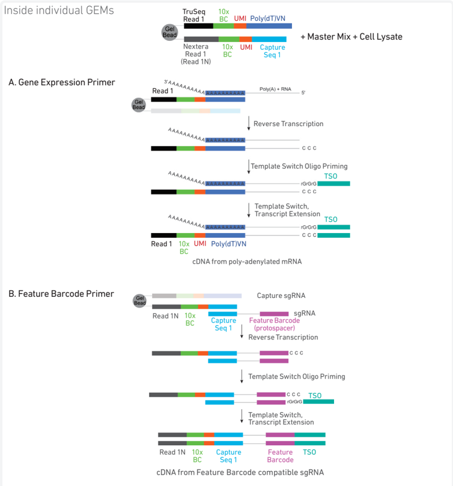

cDNA from poly-adenylated mRNA and Feature Barcode compatible sgRNA are generated simultaneously from the same single cell inside the GEM

## Step 2 Post GEM-RT Cleanup &amp; cDNA Amplification

## Step 3 3' Gene Expression Library Construction

After incubation, GEMs are broken and pooled fractions are recovered. Silane magnetic beads are used to purify the cell barcoded products from the post GEM-RT reaction mixture, which includes leftover biochemical reagents and primers. The cell barcoded cDNA molecules are amplified via PCR to generate sufficient mass for library constructions. Size selection is used to separate the amplified cDNA molecules for 3' Gene Expression and CRISPR Screening library construction.

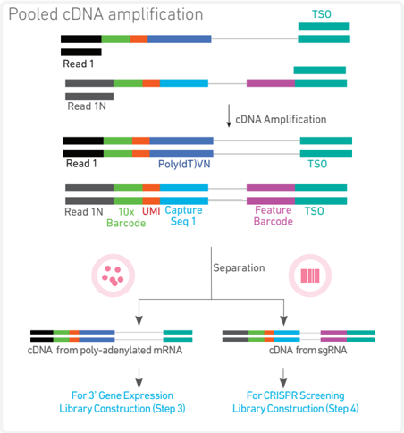

Enzymatic fragmentation and size selection are used to optimize the cDNA amplicon size. P5, P7, i7 and i5 sample indexes, and TruSeq Read 2 (read 2 primer sequence) are added via End Repair, A-tailing, Adaptor Ligation, and PCR. The final libraries contain the P5 and P7 primers used in Illumina amplification.

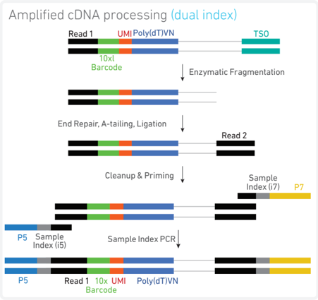

## Step 4 CRISPR Screening Library Construction

## Step 5 Sequencing

Amplified cDNA from sgRNA molecules is used to generate CRISPR Screening libraries. P5, P7, i7 and i5 sample indexes, and TruSeq Read 2 (read 2 primer sequence) are added via PCR. The final libraries contain the P5 and P7 primers used in Illumina bridge amplification.

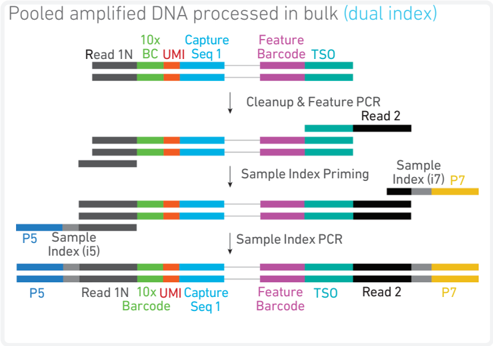

The Single Cell 3' libraries comprise standard Illumina paired-end constructs which begin and end with P5 and P7. The 16 bp 10x Barcode and 12 bp UMI are encoded in Read 1, while Read 2 is used to sequence the cDNA fragment in 3' Gene Expression libraries and the Feature Barcode (sgRNA protospacer) in the CRISPR Screening libraries. i7 and i5 index sequences are incorporated as the sample index reads. Standard Illumina sequencing primer sites TruSeq Read 1 and TruSeq Read 2 in the 3' Gene Expression libraries and Nextera Read 1 and Truseq Read 2 in the CRISPR Screening libraries are used in paired-end sequencing.

Illumina sequencer compatibility, sample indices, library loading and pooling, recommended read depths &amp; run parameters for sequencing are summarized in step 5.

## Chromium Single Cell 3 ' Gene Expression Dual Index Library

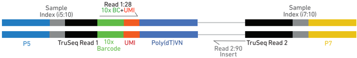

Chromium Single Cell 3 ' CRISPR Screening Dual Index Library

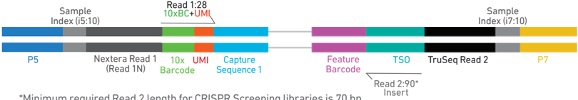

*Minimum required Read 2 length for CRISPR Screening libraries is 70 bp

## See Appendix for Oligonucleotide Sequences

## CRISPR Screening Overview

The Chromium Single Cell Gene Expression Solution with Feature Barcode technology provides a high-throughput and scalable approach to obtain gene expression profiles along with perturbation phenotypes via direct capture of poly-adentylated mRNAs and single-guide RNAs (sgRNAs) from the same single cell (see Stepwise Objectives). For compatibility    with  Feature  Barcode  technology,  sgRNAs  should  be  engineered containing  either  Capture  Sequence  1  or  Capture  Sequence  2.  Two  possible locations for integrating the capture sequence in the sgRNA include (1) within the sgRNA hairpin structure, or (2) immediately before the sgRNA termination signal, elongating the 3 ' -end of the sgRNA. However, alternate sgRNA integration locations for either of the two capture sequences may be possible depending on the specific application, type of construct used etc.

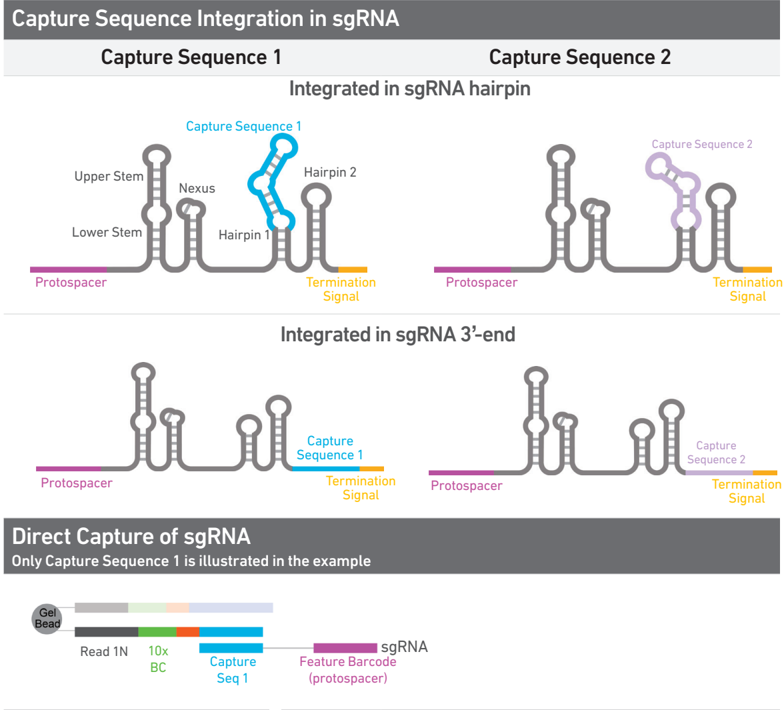

Performing sgRNA QC by qPCR, NGS, or other methods is recommended prior to proceeding with the Single Cell Gene Expression and CRISPR Screening Solution.

See Appendix for Compatible sgRNA Specifications

## Tips &amp; Best Practices

## Icons

## Emulsion-safe Plastics

-  Use validated emulsion-safe plastic consumables when handling GEMs as some plastics can destabilize GEMs.

## Cell Concentration

-  Recommended starting point is to load ~1,600 cells per reaction, resulting in recovery of ~1000 cells, and a multiplet rate of ~0.8%. The optimal input cell concentration is 700-1,200 cells/µl.
-  The presence of dead cells in the suspension may also reduce the recovery rate. Consult the 10x Genomics Single Cell Protocols Cell Preparation Guide and the Guidelines for Optimal Sample Preparation flowchart (Documents CG00053 and CG000126 respectively) for more information on preparing cells.

| Multiplet Rate (%)   | # of Cells Loaded   | # of Cells Recovered   |
|----------------------|---------------------|------------------------|
| ~0.4%                | ~825                | ~500                   |
| ~0.8%                | ~1,650              | ~1,000                 |
| ~1.6%                | ~3,300              | ~2,000                 |
| ~2.4%                | ~4,950              | ~3,000                 |
| ~3.2%                | ~6,600              | ~4,000                 |
| ~4.0%                | ~8,250              | ~5,000                 |
| ~4.8%                | ~9,900              | ~6,000                 |
| ~5.6%                | ~11,550             | ~7,000                 |
| ~6.4%                | ~13,200             | ~8,000                 |
| ~7.2%                | ~14,850             | ~9,000                 |
| ~8.0%                | ~16,500             | ~10,000                |

## General Reagent Handling

## 50% Glycerol Solution

## Pipette Calibration

## Chromium Next GEM Chip Handling

-  Fully thaw and thoroughly mix reagents before use.
-  Keep all enzymes and Master Mixes on ice during setup and use. Promptly move reagents back to the recommended storage.
-  Calculate reagent volumes with 10% excess of 1 reaction values.
-  Cover Partitioning Oil tubes and reservoirs to minimize evaporation.
-  If using multiple chips, use separate reagent reservoirs for each chip during loading.
-  Thoroughly mix samples with the beads during bead-based cleanup steps.
-  Purchase 50% glycerol solution from Ricca Chemical Company, Glycerin (glycerol), 50% (v/v) Aqueous Solution, PN-3290-32.
-  Prepare 50% glycerol solution:
- i.  Mix an equal volume of water and 99% Glycerol, Molecular Biology Grade.
- ii.  Filter through a 0.2 µm filter.
- iii.  Store at -20°C in 1-ml LoBind tubes. 50% glycerol solution should be equilibrated to room temperature before use.
-  Follow manufacturer's calibration and maintenance schedules.
-  Pipette accuracy is particularly important when using SPRIselect reagents.
-  Minimize exposure of reagents, chips, and gaskets to sources of particles and fibers, laboratory wipes, frequently opened flip-cap tubes, clothing that sheds fibers, and dusty surfaces.
-  After removing the chip from the sealed bag, use in ≤ 24 h.
-  Execute steps without pause or delay, unless indicated. When multiple chips are to be used, load, run, and collect the content from one chip before loading the next.
-  Fill all unused input wells in rows labeled 1, 2, and 3 on a chip with an appropriate volume of 50% glycerol solution before loading the used wells. DO NOT add glycerol to the wells in the bottom NO FILL row.
-  Avoid contacting the bottom surface of the chip with gloved hands and other surfaces. Frictional charging can lead to inadequate priming of the channels, potentially leading to either clogs or wetting failures.
-  Minimize the distance that a loaded chip is moved to reach the Chromium Controller or X/iX.
-  Keep the chip horizontal to prevent wetting the gasket with oil, which depletes the input volume and may adversely affect the quality of the resulting emulsion.

## Chromium Next GEM Secondary  Holders

## Chromium Next GEM Chip &amp; Holder Assembly with Gasket

## Chromium Next GEM Chip Loading

-  Chromium Next GEM Secondary Holders encase Chromium Next GEM Chips.
-  The holder lid flips over to become a stand, holding the chip at 45 degrees for optimal recovery well content removal.
-  Squeeze the black sliders on the back side of the holder together to unlock the lid and return the holder to a flat position.
-  Close the holder lid. Attach the gasket by holding the tongue (curved end, to the right) and hook the gasket on the left-hand tabs of the holder. Gently pull the gasket toward the right and hook it on the two right-hand tabs.
-  DO NOT touch the smooth side of the gasket.
-  Open the chip holder.
-  Align notch on the chip (upper left corner) and the open holder with the gasket attached.
-  Slide the chip to the left until the chip is inserted under the guide on the holder. Depress the right hand side of the chip until the spring-loaded clip engages.
-  Keep the assembled unit with the attached gasket until ready for dispensing reagents into the wells.
-  Place the assembled chip and holder flat (gasket attached) on the bench with the lid open.
-  Dispense at the bottom of the wells without introducing bubbles.
-  When dispensing Gel Beads into the chip, wait for the remainder to drain into the bottom of the pipette tips and dispense again to ensure complete transfer.
-  Refer to Load Chromium Next GEM Chip G for specific instructions.

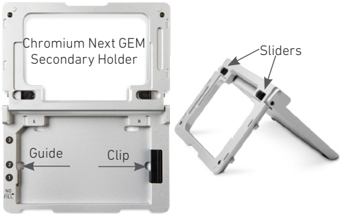

Chip in Chromium Next GEM Secondary Holder

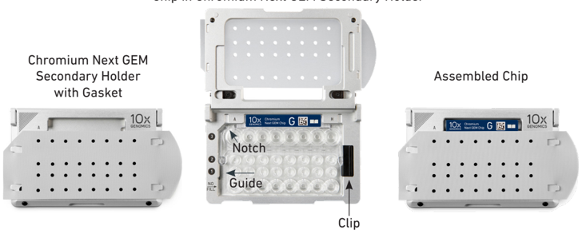

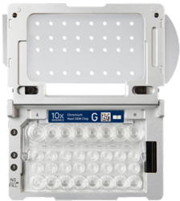

## Gel Bead Handling

## 10x Magnetic Separator

## Magnetic Bead Cleanup Steps

- Use one tube of Gel Beads per sample. DO NOT puncture the foil seals of tubes not used at the time.
-  Equilibrate the Gel Beads strip to room temperature before use.
-  Store unused Gel Beads at -80°C and avoid more than 12 freeze-thaw cycles. DO NOT store Gel Beads at -20°C.
- Snap the tube strip holder with the Gel Bead strip into a 10x Vortex Adapter . Vortex 30 sec .
-  Centrifuge the Gel Bead strip for ~ 5 sec after removing from the holder. Confirm there are no bubbles at the bottom of the tubes and the liquid levels look even. Place the Gel Bead strip back in the holder and secure the holder lid.
-  If the required volume of beads cannot be recovered, place the pipette tips against the sidewalls and slowly dispense the Gel Beads back into the tubes. DO NOT introduce bubbles into the tubes and verify that the pipette tips contain no leftover Gel Beads. Withdraw the full volume of beads again by pipetting slowly.
-  Offers two positions of the magnets (high and low) relative to a tube, depending on its orientation. Flip the magnetic separator over to switch between high (magnet· High) or low (magnet· Low) positions.
-  If using MicroAmp 8-Tube Strips, use the high position (magnet· High) only throughout the protocol.
-  During magnetic bead based cleanup steps that specify waiting 'until the solution clears', visually confirm clearing of solution before proceeding to the next step. See adjacent panel for an example.
-  The time needed for the solution to clear may vary based on specific step, reagents, volume of reagents etc.

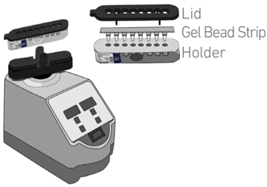

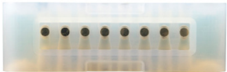

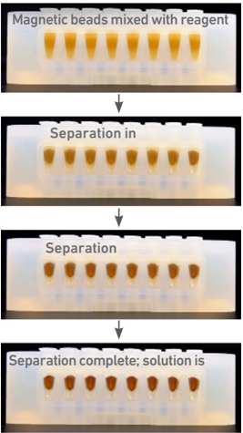

## SPRIselect Cleanup &amp; Size Selection

## Enzymatic Fragmentation

## Sample Indices in Sample Index PCR

-  After aspirating the desired volume of SPRIselect reagent, examine the pipette tips before dispensing to ensure the correct volume is transferred.
-  Pipette mix thoroughly as insufficient mixing of sample and SPRIselect reagent will lead to inconsistent results.
-  Use fresh preparations of 80% Ethanol.

## Tutorial - SPRIselect Reagent:DNA Sample Ratios

SPRI beads selectively bind DNA according to the ratio of SPRIselect reagent (beads).

Example: Ratio =  Volume of SPRIselect reagent added to the sample  =  50 µl  = 0.5X Volume of DNA sample 100 µl

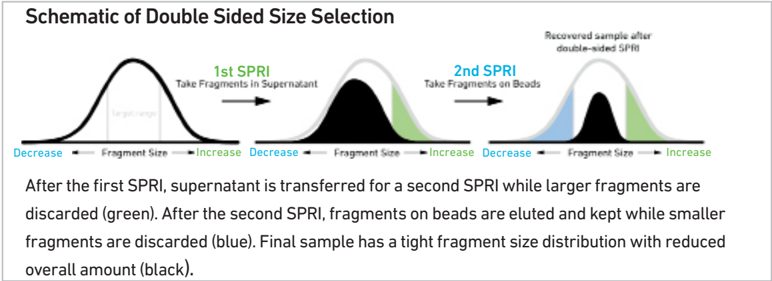

## Tutorial - Double Sided Size Selection

Step a - First SPRIselect : Add 50 µl SPRIselect reagent to 100 µl sample ( 0.5X ).

Ratio =  Volume of SPRIselect reagent added to the sample  =  50 µl  = 0.5X Volume of DNA sample 100 µl

Step b - Second SPRIselect: Add 30 µl SPRIselect reagent to supernatant from step a ( 0.8X ).

Ratio =  Total Volume of SPRIselect reagent added to the sample (step a + b)  =  50 µl + 30 µl   = 0.8X Original Volume of DNA sample 100 µl

-  Ensure enzymatic fragmentation reactions are prepared on ice and then loaded into a thermal cycler pre-cooled to 4°C prior to initiating the Fragmentation, End Repair, and A-tailing incubation steps.
-  Choose the appropriate sample index sets to ensure that no sample indices overlap in a multiplexed sequencing run.
-  Verify and use the specified index plate only. DO NOT use the plates interchangebaly.
-  Each well in the Dual Index Plate contains a unique i7 and a unique i5 oligonucleotide.

| Index Hopping Mitigation   | Index hopping can impact pooled samples sequenced on Illumina sequencing platforms that utilize patterned flow cells and exclusion amplification chemistry. To minimize index hopping, follow the guidelines listed below.   |
|----------------------------|------------------------------------------------------------------------------------------------------------------------------------------------------------------------------------------------------------------------------|
|                            | • Remove adapters during cleanup steps.                                                                                                                                                                                      |
|                            | • Ensure no leftover primers and/or adapters are present when performing post- Library Construction QC.                                                                                                                      |
|                            | • Store each library individually at 4°C for up to 72 h or at -20°C for long-term storage. DO NOT pool libraries during storage.                                                                                             |
|                            | • Pool libraries prior to sequencing. An additional 0.8X SPRI may be performed for the pooled libraries to remove any free adapters before sequencing.                                                                       |
|                            | • Hopped indices can be computationally removed from the data generated from single cell dual index libraries.                                                                                                               |

## Step 1

## GEM Generation &amp; Barcoding

- 1.1 Prepare Single Cell Master Mix
- 1.2 Load Chromium Next GEM Chip G
- 1.3 Run the Chromium Controller or X/iX
- 1.4 Transfer GEMs
- 1.5 GEM-RT Incubation

Click to TOC 1

| 1.0 GEM Generation & Barcoding                                                                                                                           | GET STARTED! Action             | Item                                        | 10x PN           | Preparation & Handling                                                                                                                                                                                                                         | Storage   |
|----------------------------------------------------------------------------------------------------------------------------------------------------------|---------------------------------|---------------------------------------------|------------------|------------------------------------------------------------------------------------------------------------------------------------------------------------------------------------------------------------------------------------------------|-----------|
|                                                                                                                                                          | Equilibrate to Room Temperature | Single Cell 3' v3.1 Gel Beads               | 2000164          | Equilibrate to room temperature 30 min before loading the chip.                                                                                                                                                                                | -80°C     |
|                                                                                                                                                          |                                 | RT Reagent B                                | 2000165          | Vortex, verify no precipitate, centrifuge briefly.                                                                                                                                                                                             | -20°C     |
|                                                                                                                                                          |                                 | Template Switch Oligo                       | 3000228          | Centrifuge briefly, resuspend in 80 µl Low TE Buffer. Vortex 15 sec at maximum speed, centrifuge briefly, leave at room temperature for ≥ 30 min. After resuspension, store at -80°C. Thaw at temperature for ≥ 30 minutes in subsequent uses. | -20°C     |
|                                                                                                                                                          |                                 | Reducing Agent B                            | 2000087          | Vortex, verify no precipitate, centrifuge briefly.                                                                                                                                                                                             | -20°C     |
|                                                                                                                                                          | Place on Ice                    | RT Enzyme C                                 | 2000085/ 2000102 | Centrifuge briefly before adding to the mix.                                                                                                                                                                                                   | -20°C     |
|                                                                                                                                                          |                                 | Cell Suspension                             |                  |                                                                                                                                                                                                                                                |           |
|                                                                                                                                                          | Obtain                          | Partitioning Oil                            | 2000190          | -                                                                                                                                                                                                                                              | Ambient   |
|                                                                                                                                                          |                                 | Chromium Next GEM Chip G                    | 2000177          | -                                                                                                                                                                                                                                              | Ambient   |
|                                                                                                                                                          |                                 | 10x Gasket                                  | 370017/ 3000072  | See Tips & Best Practices.                                                                                                                                                                                                                     | Ambient   |
|                                                                                                                                                          |                                 | Chromium Next GEM Secondary Holder          | 3000332          | See Tips & Best Practices.                                                                                                                                                                                                                     | Ambient   |
| !                                                                                                                                                        |                                 | 10x Vortex Adapter                          | 330002           | See Tips & Best Practices.                                                                                                                                                                                                                     | Ambient   |
| Firmware Version 4.0 or higher is required in the Chromium Controller or the Chromium Single Cell Controller used for this Single Cell 3' v3.1 protocol. |                                 | 50% glycerol solution If using <8 reactions | -                | See Tips & Best Practices.                                                                                                                                                                                                                     | -         |

## 1.1 Prepare Master Mix

For GEM generation, load the indicated reagents  only  in  the  specified  rows, starting  from  row  labeled  1,  followed by rows labeled 2 and 3.  DO NOT  load reagents  in  the  bottom  row  labeled NO FILL.  See step 1.2 for details.

- a. Prepare Master Mix on ice. Pipette mix 15x and centrifuge briefly.

| Master Mix Add reagents in the order listed   | PN               |   1X (µl) |   4X + 10% (µl) |   8X + 10% (µl) |
|-----------------------------------------------|------------------|-----------|-----------------|-----------------|
| RT Reagent B                                  | 2000165          |      18.8 |            82.7 |           165.4 |
| Template Switch Oligo                         | 3000228          |       2.4 |            10.6 |            21.1 |
| Reducing Agent B                              | 2000087          |       2.0 |             8.8 |            17.6 |
| RT Enzyme C                                   | 2000085/ 2000102 |       8.7 |            38.3 |            76.6 |
| Total                                         | -                |      31.9 |           140.4 |           280.7 |

## b. Add 31.9 µl Master Mix into each tube of a PCR 8-tube strip on ice.

## Assemble Chromium Next GEM Chip

See Tips &amp; Best Practices for chip handling instructions.

- Close the holder lid. Attach the gasket by holding the tongue (curved end, to the right) and hook the gasket on the left-hand tabs of the holder. Gently pull the gasket toward the right and hook it on the two right-hand tabs.
- DO NOT touch the smooth side of the gasket.
- Open the chip holder.
- Remove the chip from the sealed bag. Use the chip within ≤ 24 h.
- Align notch on the chip (upper left corner) and the open holder with the gasket attached.
- Slide the chip to the left until the chip is inserted under the guide on the holder.  Depress the right hand side of the chip until the spring-loaded clip engages.
- Keep the assembled unit with the attached gasket open until ready for and while dispensing reagents into the wells. DO NOT touch the smooth side of the gasket. After loading reagents, close the chip holder. DO NOT press down on the top of the gasket.

Chip in Chromium Next GEM Secondary Holder

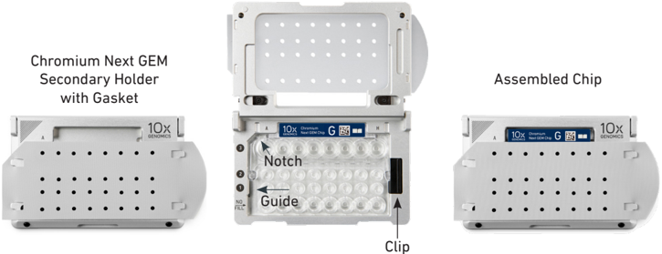

## Cell Suspension Volume Calculator Table

(for step 1.2 of Chromium Next GEM Single Cell 3' v3.1 protocol)

Volume of Cell Suspension Stock per reaction (µl) | Volume of Nuclease-free Water per reaction (µl)

DO NOT add nuclease-free water directly to single cell suspension. Add nuclease-free water to the Master Mix. Refer to step 1.2b.

| Cell Stock Concentration   | Targeted Cell Recovery   | Targeted Cell Recovery   | Targeted Cell Recovery   | Targeted Cell Recovery   | Targeted Cell Recovery   | Targeted Cell Recovery   | Targeted Cell Recovery   | Targeted Cell Recovery   | Targeted Cell Recovery   | Targeted Cell Recovery   | Targeted Cell Recovery   |
|----------------------------|--------------------------|--------------------------|--------------------------|--------------------------|--------------------------|--------------------------|--------------------------|--------------------------|--------------------------|--------------------------|--------------------------|
| (Cells/µl)                 | 500                      | 1000                     | 2000                     | 3000                     | 4000                     | 5000                     | 6000                     | 7000                     | 8000                     | 9000                     | 10000                    |
| 100                        | 8.3 16.5                 | 33.0                     | n/a                      |                          | n/a                      | n/a                      | n/a                      | n/a                      | n/a                      | n/a                      | n/a                      |
| 100                        | 35.0                     | 26.7                     | 10.2                     |                          |                          |                          |                          |                          |                          |                          |                          |
| 200                        | 4.1                      | 8.3                      | 16.5                     | 24.8                     | 33.0                     | 41.3                     | n/a                      | n/a                      | n/a                      | n/a                      | n/a                      |
| 200                        | 39.1                     | 35.0                     | 26.7                     | 18.5                     | 10.2                     | 2.0                      |                          | 38.5                     |                          |                          |                          |
| 2.8                        | 5.5                      |                          | 11.0                     | 16.5                     | 22.0                     | 27.5                     | 33.0                     |                          |                          |                          |                          |
| 2.8                        | 40.5                     | 37.7                     | 32.2                     | 26.7                     | 21.2                     | 15.7                     | 10.2                     | 4.7                      | n/a                      | n/a                      | n/a                      |
| 2.1                        | 4.1                      |                          | 8.3                      | 12.4                     | 16.5                     | 20.6                     | 24.8                     | 28.9                     | 33.0                     | 37.1                     | 41.3                     |
| 2.1                        | 41.1                     | 39.1                     | 35.0                     | 30.8                     | 26.7                     | 22.6                     | 18.5                     | 14.3                     | 10.2                     | 6.1                      | 2.0                      |
| 1.7 1.4                    |                          | 3.3                      | 6.6                      | 9.9                      | 13.2                     | 16.5                     | 19.8                     | 23.1                     | 26.4                     | 29.7                     | 33.0                     |
| 1.7 1.4                    | 41.6                     | 39.9                     | 36.6                     | 33.3                     | 30.0                     | 26.7                     | 23.4                     | 20.1                     | 16.8                     | 13.5                     | 10.2                     |
| 600                        |                          | 2.8                      | 5.5                      | 8.3                      | 11.0                     | 13.8                     | 16.5                     | 19.3                     | 22.0                     | 24.8                     | 27.5                     |
| 600                        | 41.8                     | 40.5                     | 37.7                     | 35.0                     | 32.2                     | 29.5                     | 26.7                     | 24.0                     | 21.2                     | 18.5                     | 15.7                     |
| 700                        | 1.2                      | 2.4                      | 4.7                      | 7.1                      | 9.4                      | 11.8                     | 14.1                     | 16.5                     | 18.9                     | 21.2                     | 23.6                     |
| 700                        | 42.0                     | 40.8                     | 38.5                     | 36.1                     | 33.8                     | 31.4                     | 29.1                     | 26.7                     | 24.3                     | 22.0                     | 19.6                     |
| 800                        | 1.0                      | 2.1                      | 4.1                      | 6.2                      | 8.3                      | 10.3                     | 12.4                     | 14.4                     | 16.5                     | 18.6                     | 20.6                     |
| 800                        | 42.2                     | 41.1                     | 39.1                     | 37.0                     | 35.0                     | 32.9                     | 30.8                     | 28.8                     | 26.7                     | 24.6                     | 22.6                     |
|                            | 0.9                      | 1.8                      | 3.7                      | 5.5                      | 7.3                      | 9.2                      | 11.0                     | 12.8                     | 14.7                     | 16.5                     | 18.3                     |
| 900                        | 42.3                     | 41.4                     | 39.5                     | 37.7                     | 35.9                     | 34.0                     | 32.2                     | 30.4                     | 28.5                     | 26.7                     | 24.9                     |
| 1000                       | 0.8                      | 1.7                      | 3.3                      | 5.0                      | 6.6                      | 8.3                      | 9.9                      | 11.6                     | 13.2                     | 14.9                     | 16.5                     |
| 1000                       | 42.4                     | 41.6                     | 39.9                     | 38.3                     | 36.6                     | 35.0                     | 33.3                     | 31.7                     | 30.0                     | 28.4                     | 26.7                     |
| 1100                       | 0.8                      | 1.5                      | 3.0                      | 4.5                      | 6.0                      | 7.5                      | 9.0                      | 10.5                     | 12.0                     | 13.5                     | 15.0                     |
| 1100                       | 42.5                     | 41.7                     | 40.2                     | 38.7                     | 37.2                     | 35.7                     | 34.2                     | 32.7                     | 31.2                     | 29.7                     | 28.2                     |
| 0.7                        |                          | 1.4                      | 2.8                      | 4.1                      | 5.5                      | 6.9                      | 8.3                      | 9.6                      | 11.0                     | 12.4                     | 13.8                     |
| 0.7                        | 42.5                     | 41.8                     | 40.5                     | 39.1                     | 37.7                     | 36.3                     | 35.0                     | 33.6                     | 32.2                     | 30.8                     | 29.5                     |
| 0.6                        |                          | 1.3                      | 2.5                      | 3.8                      | 5.1                      | 6.3                      | 7.6                      | 8.9                      | 10.2                     | 11.4                     | 12.7                     |
| 0.6                        | 42.6                     | 41.9                     | 40.7                     | 39.4                     | 38.1                     | 36.9                     | 35.6                     | 34.3                     | 33.0                     | 31.8                     | 30.5                     |
| 0.6                        |                          | 1.2                      | 2.4                      | 3.5                      | 4.7                      | 5.9                      | 7.1                      | 8.3                      | 9.4                      | 10.6                     | 11.8                     |
| 0.6                        | 42.6                     | 42.0                     | 40.8                     | 39.7                     | 38.5                     | 37.3                     | 36.1                     | 35.0                     | 33.8                     | 32.6                     | 31.4                     |
| 1500                       | 0.6                      | 1.1                      | 2.2                      | 3.3                      | 4.4                      | 5.5                      | 6.6                      | 7.7                      | 8.8                      | 9.9                      | 11.0                     |
| 1500                       | 42.7 0.5                 | 42.1 1.0                 | 41.0 2.1                 | 39.9 3.1                 | 38.8                     | 37.7                     | 36.6 6.2                 | 35.5 7.2                 | 34.4 8.3                 | 33.3 9.3                 | 32.2                     |
|                            |                          |                          |                          |                          | 4.1                      | 5.2                      |                          |                          |                          |                          | 10.3                     |
| 1600                       | 42.7                     | 42.2                     | 41.1                     | 40.1                     | 39.1                     | 38.0                     | 37.0                     | 36.0                     | 35.0                     | 33.9                     | 32.9                     |
| 0.5                        | 1.0                      |                          | 1.9                      | 2.9                      | 3.9                      | 4.9                      | 5.8                      | 6.8                      | 7.8                      | 8.7                      | 9.7                      |
| 0.5                        | 42.7                     | 42.2                     | 41.3                     | 40.3                     | 39.3                     | 38.3                     | 37.4                     | 36.4                     | 35.4                     | 34.5                     | 33.5                     |
| 0.5                        | 0.9                      |                          | 1.8                      | 2.8                      | 3.7                      | 4.6                      | 5.5                      | 6.4                      | 7.3                      | 8.3                      | 9.2                      |
| 0.5                        | 42.7                     | 42.3                     | 41.4                     | 40.5                     | 39.5                     | 38.6                     | 37.7                     | 36.8                     | 35.9                     | 35.0                     | 34.0                     |
| 42.8                       |                          |                          |                          |                          |                          |                          |                          |                          |                          |                          |                          |
| 42.8                       | 0.4                      | 0.9                      | 1.7                      | 2.6                      | 3.5                      | 4.3                      | 5.2                      | 6.1                      | 6.9                      | 7.8                      | 8.7                      |
| 1900 2000                  |                          | 42.3                     | 41.5                     | 40.6                     | 39.7                     | 38.9                     | 38.0                     | 37.1                     | 36.3                     | 35.4                     | 34.5                     |
| 1900 2000                  | 42.8                     | 42.4                     | 41.6                     | 40.7                     | 39.9                     | 39.1                     | 38.3                     | 37.4                     | 36.6                     | 35.8                     | 35.0                     |

Grey boxes:

Volumes that would exceed the allowable water volume in each reaction

Yellow boxes:

Indicate a low transfer volume that may result in higher cell load variability

Blue boxes:

Optimal range of cell stock concentration to maximize the likelihood of achieving the desired cell recovery target

## 1.2 Load Chromium NextGEM Chip G

After removing chip from the sealed bag, use in ≤24 h. Open the lid (gasket attached) of the assembled chip and lay flat for loading.

When loading the chip, raising and depressing the pipette plunger should each take ~5 sec.

When dispensing, raise the pipette tips at the same rate as the liquid is rising, keeping the tips slightly submerged.

- a.   Add 50% glycerol solution to each unused well (if processing &lt;8 samples/chip)
- 70 µl in each unused well in row labeled 1
- 50 µl in each unused well in row labeled 2
- 45 µl in each unused well in row labeled 3

DO NOT add 50% glycerol solution to the bottom row of NO FILL wells. DO NOT use any substitute for 50% glycerol solution.

## b.   Prepare Master Mix + Cell suspension

-  Refer to the Cell Suspension Volume Calculator Table.
-  Add the appropriate volume of nuclease-free water to Master Mix. Pipette mix 5x. Add corresponding volume of single cell suspension to Master Mix. Total of 75 µl in each tube.
-  Gently pipette mix the cell suspension before adding to the Master Mix.

## c.   Load Row Labeled 1

-  Gently pipette mix the Master Mix + Cell Suspension
-  Using the same pipette tip, dispense 70 µ l Master Mix + Cell Suspension into the bottom center of each well in row labeled 1 without introducing bubbles.

## d.   Prepare Gel Beads

-  Snap the tube strip holder with the Gel Bead strip into a 10x Vortex Adapter. Vortex 30 sec.
-  Centrifuge the Gel Bead strip for ~5 sec.
-  Confirm there are no bubbles at the bottom of the tubes and the liquid levels are even.
-  Place the Gel Bead strip back in the holder. Secure the holder lid.

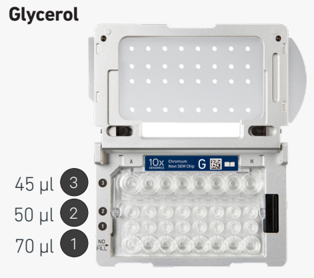

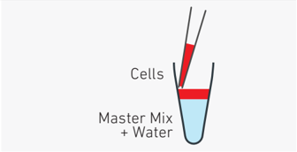

Master Mix + Sample

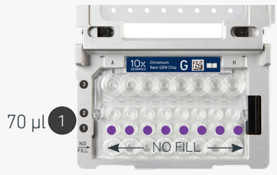

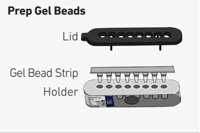

## e.   Load Row Labeled 2

-  Puncture the foil seal of the Gel Bead tubes.
-  Slowly aspirate 50 µl Gel Beads.
-  Dispense into the wells in row labeled 2 without introducing bubbles.
-  Wait 30 sec.

## f.    Load Row Labeled 3

-  Dispense 45 µl Partitioning Oil into the wells in row labeled 3 from a reagent reservoir.

Failure to add Partitioning Oil to the top row labeled 3 will prevent GEM generation and can damage the Chromium Controller or X/iX.

## g. Prepare for Run

-  Close the lid (gasket already attached). DO NOT touch the smooth side of the gasket. DO NOT press down on the top of the gasket. Run the chip in the Chromium Controller or X/iX immediately after loading the Partitioning Oil

## 1.3 Run the Chromium Controller or X/iX

## If using Chromium Controller:

- a. Press the eject button on the Controller to eject the tray.
- b. Place the assembled chip with the gasket in the tray, ensuring that the chip stays horizontal. Press the button to retract the tray.
- c. Press the play button.
- d. At completion of the run (~18 min), the Controller will chime. Immediately proceed to the next step.

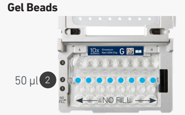

## Partitioning Oil

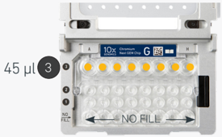

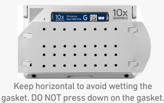

Firmware Version 4.0 or higher is required in the Chromium Controller or the Chromium Single Cell Controller used for this protocol.

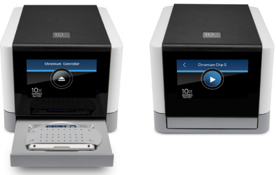

## If using Chromium X/iX:

Consult the Chromium X Series (X/iX) User Guide (CG000396) for detailed instrument operation instructions and follow the instrument touchscreen prompts for execution.

- a. Press the eject button on Chromium X/iX to eject the tray.

If the eject button is not touched within 1 min, tray will close automatically. System requires a few seconds before the tray can be ejected again.

- b. Place the assembled chip with the gasket in the tray, ensuring that the chip stays horizontal. Press the button to retract the tray.
- c. Press the play button.
- d. At completion of the run (~18 min), Chromium X/iX will chime. Immediately proceed to the next step.

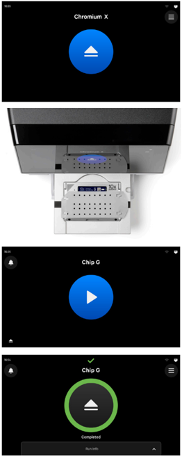

## 1.4 Transfer GEMs

## 1.5 GEM-RT Incubation

- a. Place a tube strip on ice.
- b. Press the eject button of the Controller or X/iX and remove the chip.
- c. Discard the gasket. Open the chip holder. Fold the lid back until it clicks to expose the wells at 45 degrees.
- d. Visually compare the remaining volume in rows labeled 1-2. Abnormally high volume in one well relative to other wells may indicate a clog.
- e. Slowly aspirate 100 µl GEMs from the lowest points of the recovery wells in the top row labeled 3 without creating a seal between the tips and the bottom of the wells.
- f. Withdraw pipette tips from the wells. GEMs should appear opaque and uniform across all channels. Excess Partitioning Oil (clear) in the pipette tips indicates a potential clog.
- g. Over the course of ~20 sec , dispense GEMs into the tube strip on ice with the pipette tips against the sidewalls of the tubes.
- h. If multiple chips are run back-to-back, cap/ cover the GEM-containing tube strip and place on ice for no more than 1 h .

## Expose Wells at 45 Degrees

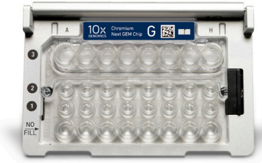

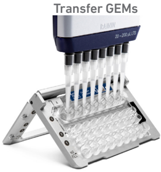

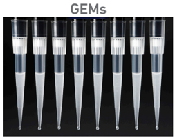

Use a thermal cycler that can accommodate at least 100 µl volume. A volume of 125 µl is the preferred setting on Bio-Rad C1000 Touch. In alternate thermal cyclers, use highest reaction volume setting.

- a. Incubate in a thermal cycler with the following protocol.

| Lid Temperature   | Reaction Volume   | Run Time   |
|-------------------|-------------------|------------|
| 53°C              | 125 µl            | ~55 min    |
| Step              | Temperature       | Time       |
| 1                 | 53°C              | 00:45:00   |
| 2                 | 85°C              | 00:05:00   |
| 3                 | 4°C               | Hold       |

b. Store at 4°C for up to 72 h or at -20°C for up to a week , or proceed to the next step.

## Step 2

## Post GEM-RT Cleanup &amp; cDNA Amplification

- 2.1 Post GEM-RT  Cleanup - Dynabeads
- 2.2 cDNA Amplification
- 2.3 cDNA Cleanup - SPRIselect
- 2.4 cDNA QC &amp; Quantification

Click to TOC 2

## 2.0 Post GEM-RT Cleanup &amp; cDNA Amplification

| GET STARTED!        | Item                                                                          | 10x PN                   |                                                                                                              | Storage   |
|---------------------|-------------------------------------------------------------------------------|--------------------------|--------------------------------------------------------------------------------------------------------------|-----------|
| Equilibrate to Room | Reducing Agent B                                                              | 2000087                  | Thaw, vortex, verify no precipitate, centrifuge.                                                             | -20°C     |
| Temperature         | Feature cDNA Primers 1 Verify name & PN. Use                                  | 2000096 indicated primer | Vortex, centrifuge briefly. only.                                                                            | -20°C     |
| !                   | Dynabeads MyOne SILANE                                                        | 2000048                  | Vortex thoroughly (≥30 sec) immediately before adding to the mix.                                            | 4°C       |
|                     | Beckman Coulter SPRIselect Reagent                                            | -                        | Manufacturer's recommendations.                                                                              | -         |
|                     | Agilent Bioanalyzer High Sensitivity Kit If used for QC and quantification    | -                        | Manufacturer's recommendations.                                                                              | -         |
|                     | Agilent TapeStation ScreenTape and Reagents If used for QC and quantification | -                        | Manufacturer's recommendations.                                                                              | -         |
|                     | Qubit dsDNA HS Assay Kit If used for QC and quantification                    | -                        | Manufacturer's recommendations.                                                                              | -         |
|                     | DNA High Sensitivity Reagnt Kit If LabChip used for QC                        | -                        | Manufacturer's recommendations.                                                                              | -         |
| Place on ice        | Amp Mix Retrieve from Single Cell 3' GEM Kit                                  | 2000047/ 2000103         | Vortex, centrifuge briefly.                                                                                  | -20°C     |
| Thaw at 65°C        | Cleanup Buffer                                                                | 2000088                  | Thaw for 10 min at 65°C at max speed on a thermomixer. Verify no visible crystals. Cool to room temperature. | -20°C     |
| Obtain              | Recovery Agent                                                                | 220016                   | -                                                                                                            | Room Temp |
|                     | Qiagen Buffer EB                                                              | -                        | Manufacturer's recommendations.                                                                              | -         |
|                     | Bio-Rad 10% Tween 20                                                          | -                        | Manufacturer's recommendations.                                                                              | -         |
|                     | 10x Magnetic Separator                                                        | 230003                   | -                                                                                                            | Ambient   |
|                     | Prepare 80% Ethanol Prepare 15 ml for 8 reactions.                            | -                        | -                                                                                                            | -         |

## 2.1 Post GEM-RT Cleanup Dynabeads

- a. Add 125 µl Recovery Agent to each sample at room temperature. DO NOT pipette mix or vortex the biphasic mixture. Wait 2 min .

The resulting biphasic mixture contains Recovery Agent/Partitioning Oil (pink) and aqueous phase (clear), with no persisting emulsion (opaque).

If biphasic separation is incomplete:

Firmly secure the cap on the tube strip, ensuring that no liquid is trapped between the cap and the tube rim. Mix by inverting the capped tube strip 5x, centrifuge briefly, and proceed to step b. DO NOT invert without firmly securing the caps.

A smaller aqueous phase volume  indicates a clog during GEM generation.

- b. Slowly remove and discard 125 µl Recovery Agent/Partitioning Oil (pink) from the bottom of the tube. DO NOT aspirate any aqueous sample.
- c. Prepare Dynabeads Cleanup Mix.
- d. Vortex and add 200 µl to each sample. Pipette mix 10x (pipette set to 200 µl).
- e. Incubate 10 min at room temperature (keep caps open). Pipette mix again at ~5 min after start of incubation to resuspend settled beads.

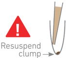

| Dynabeads Cleanup Mix Add reagents in the order listed                                                                                                                                                            | PN      |   1X (µl) |   4X + 10% (µl) |   8X + 10% (µl) |
|-------------------------------------------------------------------------------------------------------------------------------------------------------------------------------------------------------------------|---------|-----------|-----------------|-----------------|
| Cleanup Buffer                                                                                                                                                                                                    | 2000088 |       182 |             801 |            1602 |
| Dynabeads MyOne SILANE Vortex thoroughly (≥ 30 sec ) immediately before adding to the mix.                                                                                                                        |         |           |                 |                 |
| Aspirate the full liquid volume with a pipette tip to verify that the beads have not settled in the bottom of the tube. If clumps are present, pipette mix to resuspend completely. DO NOT centrifuge before use. | 2000048 |         8 |              35 |              70 |
| Reducing Agent B                                                                                                                                                                                                  | 2000087 |         5 |              22 |              44 |
| Nuclease-free Water                                                                                                                                                                                               |         |         5 |              22 |              44 |
| Total                                                                                                                                                                                                             | -       |       200 |             880 |            1760 |

Add Dynabeads Cleanup Mix

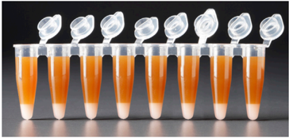

Remove Recovery Agent

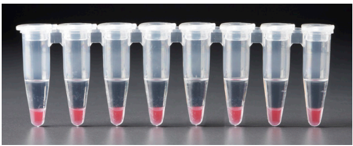

Biphasic Mixture

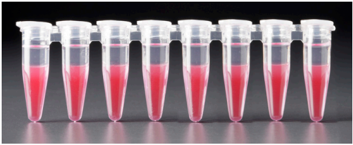

## f. Prepare Elution Solution I. Vortex and centrifuge briefly.

| Elution Solution I Add reagents in the order listed   | PN      |   1X (µl) |   10X (µl) |
|-------------------------------------------------------|---------|-----------|------------|
| Buffer EB                                             | -       |        98 |        980 |
| 10% Tween 20                                          | -       |         1 |         10 |
| Reducing Agent B                                      | 2000084 |         1 |         10 |
| Total                                                 | -       |       100 |       1000 |

- g. At the end of 10 min incubation, place on a 10x Magnetic Separator· High position (magnet· High ) until the solution clears.

A  white interface between the aqueous phase and Recovery Agent is normal.

- h. Remove the supernatant (aqueous phase and Recovery Agent).
- i. Add 300 µl 80% ethanol to the pellet while on the magnet. Wait 30 sec .
- j. Remove the ethanol.
- k. Add 200 µl 80% ethanol to pellet. Wait 30 sec .
- l. Remove the ethanol.
- m. Centrifuge briefly. Place on the magnet· Low .
- n. Remove remaining ethanol. Air dry for 1 min .
- o. Remove from the magnet. Immediately add 35.5 µl Elution Solution I (prepared in step 2.1f).
- p. Pipette mix (pipette set to 30 µl) without introducing bubbles.
- q. Incubate 2 min at room temperature .
- r. Place on the magnet· Low until the solution clears.
- s. Transfer 35 µl sample to a new tube strip.

## 2.2 cDNA Amplification

- a. Prepare cDNA Amplification Mix on ice. Vortex and centrifuge briefly.
- b. Add 65 µl cDNA Amplification Reaction Mix to 35 µl sample.
- c. Pipette mix 15x (pipette set to 90 µl). Centrifuge briefly.
- d. Incubate in a thermal cycler with the following protocol.

|                                                                 | cDNA Amplification Reaction Mix Add reagents in the order listed   |   PN |   1X (µl) 4X + 10% (µl) |   8X + 10% (µl) |
|-----------------------------------------------------------------|--------------------------------------------------------------------|------|-------------------------|-----------------|
| Amp Mix Retrieve from Single                                    | Cell 3' GEM Kit 2000047/ 2000103                                   |   50 |                     220 |             440 |
| Feature cDNA Primers Verify name & PN Use indicated primer only | 1 2000096                                                          |   15 |                      66 |             132 |
| Total                                                           | -                                                                  |   65 |                     286 |             572 |

| Lid Temperature   | Reaction Volume                                     | Run Time                                            |
|-------------------|-----------------------------------------------------|-----------------------------------------------------|
| 105°C             | 100 µl                                              | ~30-45 min                                          |
| Step              | Temperature                                         | Time                                                |
| 1                 | 98°C                                                | 00:03:00                                            |
| 2                 | 98°C                                                | 00:00:15                                            |
| 3                 | 63°C                                                | 00:00:20                                            |
| 4                 | 72°C                                                | 00:01:00                                            |
| 5                 | Go to Step 2, see table below for total # of cycles | Go to Step 2, see table below for total # of cycles |
| 6                 | 72°C                                                | 00:01:00                                            |
| 7                 | 4°C                                                 | Hold                                                |

Recommended starting point for cycle number optimization.

| Targeted Cell Recovery   |   Total Cycles |
|--------------------------|----------------|
| ˂ 500                    |             13 |
| 500-6,000                |             12 |
| > 6,000                  |             11 |

The optimal number of cycles is a trade-off between generating sufficient final mass for library construction and minimizing PCR amplification artifacts. The number of cDNA cycles should also be reduced if large numbers of cells are sampled.

- e. Store at 4°C for up to 72 h or -20°C for ≤1 week, or proceed to the next step.

## Step Overview (steps 2.2 &amp; 2.3)

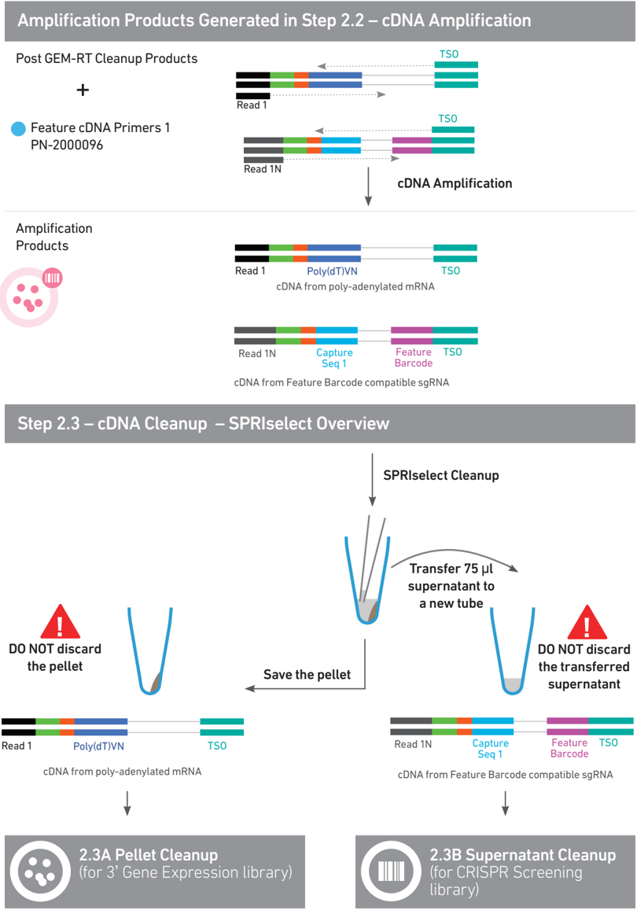

## 2.3 cDNA Cleanup SPRIselect

- a. Vortex to resuspend the SPRIselect reagent. Add 60 µl SPRIselect reagent (0.6X) to each sample and pipette mix 15x (pipette set to 150 µl).
- b. Incubate 5 min at room temperature .
- c. Place on the magnet· High until the solution clears.
- d. Transfer and save 75 µl supernatant in a new tube strip without disturbing the pellet. Maintain at room temperature. DO NOT discard the transferred supernatant (cleanup for CRISPR Screening library construction).
- e. Remove the remaining supernatant from the pellet without disturbing the pellet. DO NOT discard the pellet (cleanup for 3 ' Gene Expression library construction). Immediately proceed to Pellet Cleanup (step 2.3A).

## 2.3A Pellet Cleanup

(for 3' Gene Expression library)

- i. Add 200 µl 80% ethanol to the pellet. Wait 30 sec .
- ii. Remove the ethanol.
- iii.  Repeat steps i and ii for a total of 2 washes.
- iv. Centrifuge briefly and place on the magnet· Low .
- v. Remove any remaining ethanol. Air dry for 2 min . DO NOT exceed 2 min as this will decrease elution efficiency.
- vi. Remove from the magnet. Add 40.5 µl Buffer EB. Pipette mix 15x.
- vii. Incubate 2 min at room temperature .
- viii. Place the tube strip on the magnet· High until the solution clears.
9. ix . Transfer 40 µl sample to a new tube strip.
- x. Store at 4°C for up to 72 h or at -20°C for up to 4 weeks , or proceed to step 2.4 followed by step 3 for 3 ' Gene Expression Library Construction. STOP

## 2.3B Transferred Supernatant Cleanup (for CRISPR Screening library)

- i. Vortex to resuspend the SPRIselect reagent. Add 30 µl SPRIselect reagent (1.2X) to 75 µl of the transferred supernatant and pipette mix 15x (pipette set to 80 µl).
- ii. Incubate for 5 min at room temperature .
- iii. Place on the magnet· High until the solution clears.
- iv. Remove supernatant.
- v. Add 300 µl 80% ethanol to the pellet. Wait 30 sec .
- vi. Remove the ethanol.
- vii. Repeat steps v and vi for a total of 2 washes.
- viii. Centrifuge briefly and place on the magnet· Low .
- ix. Remove any remaining ethanol. Air dry for 2 min . DO NOT exceed 2 min as this will decrease elution efficiency.
- x. Remove from the magnet. Add 40.5 µl Buffer EB. Pipette mix 15x.
- xi. Incubate 2 min at room temperatur e.
- xii. Place the tube strip on the magnet· High until the solution clears.
- xiii. Transfer 40 µl sample to a new tube strip.

Store at 4°C for up to 72 h or at -20°C for up to 4 weeks , or proceed directly to step 4 for CRISPR Screening Library Construction.

## 2.4 Post cDNA Amplification QC &amp; Quantification

- a. Run 1 µl of sample from Pellet Cleanup (step 2.3A-x), diluted 1:10 on an Agilent Bioanalyzer High Sensitivity chip. DO NOT run sample from 2.3B Transferred

## Supernatant Cleanup step.

For input cells with low RNA content (&lt;1pg total RNA/cell), 1 µl undiluted product may be run. Lower molecular weight product (35 - 150 bp) may be present. This is normal and does not affect sequencing or application performance.

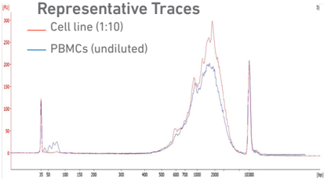

## EXAMPLE CALCULATION

## i.  Select Region

Under the 'Electropherogram' view choose the 'Region Table'. Manually select the region of ~200 - ~9000 bp

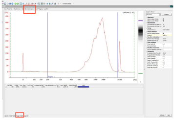

## ii. Note Concentration [pg/µl]

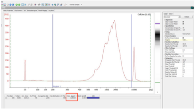

## iii. Calculate

Multiply the cDNA concentration [pg/µl] reported via the Agilent 2100 Expert Software by the elution volume (40 µl) of the Post cDNA Amplification Reaction Clean Up sample (taking any dilution factors into account) and then divide by 1000 to obtain the total cDNA yield in ng.

## Example Calculation of cDNA Total Yield

Concentration: 1890.19 pg/µl

Elution Volume: 40

Dilution Factor: 10

## Total cDNA Yield

- = Conc'n (pg/µl) x Elution Volume x Dilution Factor 1000 (pg/ng)
- =  1890.19 (pg/µl) x 40 x 10 = 756.08 ng 1000 (pg/ng)

Carry forward ONLY 25% of total cDNA yield into 3 ' Gene Expression Library Construction (step 3)

- = 0.25 x Total cDNA yield
- =  0.25 x 756.08= 189.02 ng

Refer to step 3.5 for appropriate number of Sample Index PCR cycles based on carry forward cDNA yield/input cDNA.

## Alternate Quantification Methods See Appendix for representative traces

- Agilent TapeStation
- LabChip

Agilent Bioanalyzer, Agilent TapeStation, LabChip are the recommended methods for accurate quantification.

(If using Qubit Fluorometer and Qubit dsDNA HS Assay Kit, see Appendix)

## Step 3

## 3' Gene Expression Library Construction

- 3.1 Fragmentation, End Repair &amp; A-tailing
- 3.2 Post Fragmentation End Repair &amp; A-tailing Double Sided Size Selection - SPRIselect
- 3.3 Adaptor Ligation
- 3.4 Post Ligation Cleanup - SPRIselect
- 3.5 Sample Index PCR
- 3.6 Post Sample Index PCR Double Sided Size Selection - SPRIselect
- 3.7 Post Library Construction QC

Click to TOC 3

## 3.0 3' Gene Expression Library Construction

Ensure that Fragmentation Enzyme and Fragmentation Buffer from the same kit are used together. Lots are matched for optimal performance.

| GET STARTED!                             | GET STARTED!                                                        |                  |                                                    |         |
|------------------------------------------|---------------------------------------------------------------------|------------------|----------------------------------------------------|---------|
| Action                                   | Item                                                                | 10x PN           | Preparation & Handling                             | Storage |
| Equilibrate to Room Fragmentation Buffer | Equilibrate to Room Fragmentation Buffer                            | 2000091          | Vortex, verify no precipitate, centrifuge briefly. | -20°C   |
| Temperature                              | Adaptor Oligos                                                      | 2000094          | Vortex, centrifuge briefly.                        | -20°C   |
|                                          | Ligation Buffer                                                     | 2000092          | Vortex, verify no precipitate, centrifuge briefly. | -20°C   |
| !                                        | Dual Index Plate TT Set A Verify name & PN Use indicated plate only | 3000431          | -                                                  | -20°C   |
|                                          | Beckman Coulter SPRIselect Reagent                                  | -                | Manufacturer's recommendations.                    | -       |
|                                          | Agilent TapeStation Screen Tape and Reagents If used for QC         | -                | Manufacturer's recommendations.                    | -       |
|                                          | Agilent Bioanalyzer High Sensitivity kit If used for QC             | -                | Manufacturer's recommendations.                    | -       |
|                                          | DNA High Sensitivity Reagent Kit If LabChip used for QC             | -                | Manufacturer's recommendations.                    | -       |
| Place on Ice Fragmentation Enzyme        | Place on Ice Fragmentation Enzyme                                   | 2000090/ 2000104 | Centrifuge briefly.                                | -20°C   |
|                                          | DNA Ligase                                                          | 220110/ 220131   | Centrifuge briefly.                                | -20°C   |
|                                          | Amp Mix                                                             | 2000047/ 2000103 | Centrifuge briefly.                                | -20°C   |
|                                          | KAPA Library Quantification Kit for Illumina Platforms              | -                | Manufacturer's recommendations.                    | -       |
| Obtain Qiagen Buffer EB                  | Obtain Qiagen Buffer EB                                             | -                | -                                                  | Ambient |
|                                          | 10x Magnetic Separator                                              | 230003           | See Tips & Best Practices.                         | Ambient |
|                                          | Prepare 80% Ethanol Prepare 20 ml for 8 reactions                   | -                | Prepare fresh.                                     | Ambient |

## Step Overview (Step 3.1d)

## Correlation between input &amp; library complexity

A Single Cell 3' Gene Expression library is generated using a fixed proportion (10 µl, 25%) of the total cDNA (40 µl) obtained at step 2.3A-ix. The complexity of this library will be comparable to one generated using a higher proportion (&gt;25%) of the cDNA. The remaining proportion (30 µl, 75%) of the cDNA may be stored at 4°C for up to 72 h or at -20°C for longer-term storage (up to 4 weeks ).

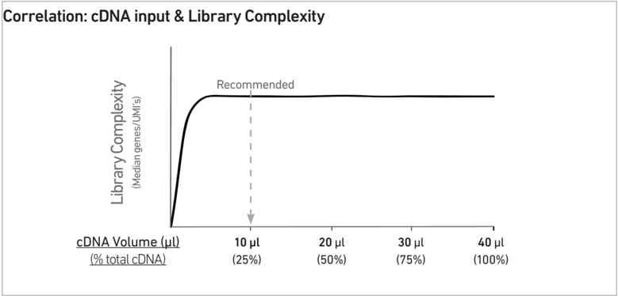

Note that irrespective of the total cDNA yield (ng), which may vary based on cell type, targeted cell recovery etc., this protocol has been optimized for a broad range of input mass (ng), as shown in the example below. The total number of SI PCR cycles (step 3.5e) should be optimized based on carrying forward a fixed proportion (10 µl, 25%) of the total cDNA yield calculated during Post cDNA Amplification QC &amp; Quantification (step 2.4).

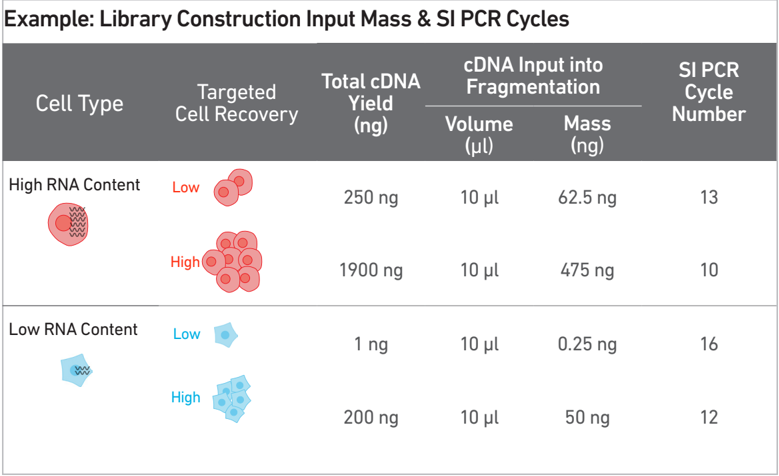

## 3.1 Fragmentation, End Repair &amp; A-tailing

- a. Prepare a thermal cycler with the following incubation protocol.
- b. Vortex Fragmentation Buffer. Verify there is no precipitate.
- c. Prepare Fragmentation Mix on ice. Pipette mix and centrifuge briefly.
- d. Transfer ONLY 10 µl purified cDNA sample from Pellet Cleanup (step 2.3A-x) to a tube strip.

| Lid Temperature                                                        | Reaction Volume   | Run Time   |
|------------------------------------------------------------------------|-------------------|------------|
| 65°C                                                                   | 50 µl             | ~35 min    |
| Step                                                                   | Temperature       | Time       |
| Pre-cool block Pre-cool block prior to preparing the Fragmentation Mix | 4°C               | Hold       |
| Fragmentation                                                          | 32°C              | 00:05:00   |
| End Repair & A-tailing                                                 | 65°C              | 00:30:00   |
| Hold                                                                   | 4°C               | Hold       |

| Fragmentation Mix Add reagents in the order listed   | PN               |   1X (µl) |   4X + 10% (µl) |   8X + 10% (µl) |
|------------------------------------------------------|------------------|-----------|-----------------|-----------------|
| Fragmentation Buffer                                 | 2000091          |         5 |              22 |              44 |
| Fragmentation Enzyme                                 | 2000090/ 2000104 |        10 |              44 |              88 |
| Total                                                | -                |        15 |              66 |             132 |

Note that only 10 µl ( 25%) cDNA sample transfer is sufficient for generating 3 ' Gene Expression library.

The remaining 30 µl ( 75%) cDNA sample can be stored at 4°C for up to 72 h or at -20°C for up to 4 weeks for generating additional 3 ' Gene Expression libraries.

- e. Add 25 µl Buffer EB to each sample.
- f. Add 15 µl Fragmentation Mix to each sample.
- g. Pipette mix 15x (pipette set to 35 µl) on ice. Centrifuge briefly.
- h. Transfer into the pre-cooled thermal cycler (4°C) and press 'SKIP' to initiate the protocol.

## 3.2 Post Fragmentation, End Repair &amp; A-tailing Double Sided Size Selection - SPRIselect

- a. Vortex to resuspend SPRIselect reagent. Add 30 µl SPRIselect (0.6X) reagent to each sample. Pipette mix 15x (pipette set to 75 µl).
- b. Incubate 5 min at room temperature .
- c. Place on the magnet· High until the solution clears. DO NOT discard supernatant.
- d. Transfer 75 µl supernatant to a new tube strip.
- e. Vortex to resuspend SPRIselect reagent. Add 10 µl SPRIselect reagent (0.8X) to each transferred supernatant. Pipette mix 15x (pipette set to 80 µl).
- f. Incubate 5 min at room temperature .
- g. Place on the magnet· High until the solution clears.
- h. Remove 80 µl supernatant. DO NOT discard any beads.
- i. Add 125 µl 80% ethanol to the pellet. Wait 30 sec.
- j. Remove the ethanol.
- k. Repeat steps i and j for a total of 2 washes.
- l. Centrifuge briefly. Place on the magnet· Low until the solution clears. Remove remaining ethanol. DO NOT over dry to ensure maximum elution efficiency.
- m. Remove from the magnet. Add 50.5 µl Buffer EB to each sample. Pipette mix 15x (pipette set to 45 µl).
- n. Incubate 2 min at room temperature .
- o. Place on the magnet· High until the solution clears.
- p. Transfer 50 µl sample to a new tube strip.

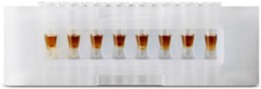

## 3.3 Adaptor Ligation

- a. Prepare Adaptor Ligation Mix. Pipette mix and centrifuge briefly.
- b. Add 50 µl Adaptor Ligation Mix to 50 µl sample. Pipette mix 15x (pipette set to 90 µl). Centrifuge briefly.
- c. Incubate in a thermal cycler with the following protocol.

| Adaptor Ligation Mix Add reagents in the order listed   | PN             |   1X (µl) |   4X + 10% (µl) |   8X + 10% (µl) |
|---------------------------------------------------------|----------------|-----------|-----------------|-----------------|
| Ligation Buffer                                         | 2000092        |        20 |              88 |             176 |
| DNA Ligase                                              | 220110/ 220131 |        10 |              44 |              88 |
| Adaptor Oligos                                          | 2000094        |        20 |              88 |             176 |
| Total                                                   | -              |        50 |             220 |             440 |

| Lid Temperature   | Reaction Volume   | Run Time   |
|-------------------|-------------------|------------|
| 30°C              | 100 µl            | 15 min     |
| Step              | Temperature       | Time       |
| 1                 | 20°C              | 00:15:00   |
| 2                 | 4°C               | Hold       |

| 3.4 Post Ligation Cleanup - SPRIselect   | a. Vortex to resuspend SPRIselect Reagent. Add 80 µl SPRIselect Reagent (0.8X ) to each sample. Pipette mix 15x (pipette set to 150 µl). b. Incubate 5 min at room temperature .   |
|------------------------------------------|------------------------------------------------------------------------------------------------------------------------------------------------------------------------------------|

## 3.5 Sample Index PCR

- a. Choose the appropriate sample index sets to ensure that no sample indices overlap in a multiplexed sequencing run. Record the 10x Sample Index name (PN-3000431 Dual Index Plate TT Set A well ID) used.
- b. Add 50 µl Amp Mix (PN-2000047/2000103) to 30 µl sample.
- c. Add 20 µl of an individual Dual Index TT Set A to each sample and record the well ID used. Pipette mix 5x (pipette set to 90 µl). Centrifuge briefly.
- d. Incubate in a thermal cycler with the following protocol.

| Lid Temperature   | Reaction Volume                         | Run Time                                |
|-------------------|-----------------------------------------|-----------------------------------------|
| 105°C             | 100 µl                                  | ~25-40 min                              |
| Step              | Temperature                             | Time                                    |
| 1                 | 98°C                                    | 00:00:45                                |
| 2                 | 98°C                                    | 00:00:20                                |
| 3                 | 54°C                                    | 00:00:30                                |
| 4                 | 72°C                                    | 00:00:20                                |
| 5                 | Go to step 2, see below for # of cycles | Go to step 2, see below for # of cycles |
| 6                 | 72°C                                    | 00:01:00                                |
| 7                 | 4°C                                     | Hold                                    |

The total cycles should be optimized based on 25% carry forward cDNA yield/input calculated during cDNA QC &amp; Quantification (step 2.4)

| cDNA Input     | Total Cycles   |
|----------------|----------------|
| 0.25-25 ng     | 14-16          |
| 25-150 ng      | 12-14          |
| 150-500 ng     | 10-12          |
| 500-1,000 ng   | 8-10           |
| 1,000-1,500 ng | 6-8            |
| > 1500 ng      | 5              |

- e. Store at 4°C for up to 72 h or proceed to the next step.

## 3.6 Post Sample Index PCR Double Sided Size Selection - SPRIselect

- a. Vortex to resuspend the SPRIselect reagent. Add 60 µl SPRIselect Reagent (0.6X) to each sample. Pipette mix 15x (pipette set to 150 µl).
- b. Incubate 5 min at room temperature .
- c. Place the magnet· High until the solution clears. DO NOT discard supernatant.
- d. Transfer 150 µl supernatant to a new tube strip.
- e. Vortex to resuspend the SPRIselect reagent. Add 20 µl SPRIselect Reagent (0.8X) to each transferred supernatant. Pipette mix 15x (pipette set to 150 µl).
- f. Incubate 5 min at room temperature .
- g. Place the magnet· High until the solution clears.
- h. Remove 165 µl supernatant. DO NOT discard any beads.
- i. With the tube still in the magnet, add 200 µl 80% ethanol to the pellet. Wait 30 sec .
- j. Remove the ethanol.
- k.  Repeat steps i and j for a total of 2 washes.
- l. Centrifuge briefly. Place on the magnet· Low . Remove remaining ethanol.
- m. Remove from the magnet. Add 35.5 µl Buffer EB. Pipette mix 15x.
- n. Incubate 2 min at room temperature .
- o. Place on the magnet· Low until the solution clears.
- p. Transfer 35 µl to a new tube strip.
- q. Store at 4°C for up to 72 h or at -20°C for long-term storage.

## 3.7 Post Library Construction QC

## Run 1 µl s ample at 1:10 dilution on an Agilent Bioanalyzer High Sensitivity chip.

Determine the average fragment size from the Bioanalyzer trace. This will be used as the insert size for library quantification.

If additional peaks below 200 bp are observed, repeat step 3.6 Post Sample Index PCR Double Sided Size Selection - SPRIselect. Add nuclease-free water to bring the library volume to 100 µl before performing step 3.6a. Note that ~40% of material may be lost when repeating step 3.6.

Alternatively, libraries that will be sequenced together can first be pooled and then used as input into step 3.6.

See Troubleshooting for further details.

## Alternate QC Methods:

- Agilent TapeStation
- LabChip

## See Appendix for representative traces

See Appendix for Post Library Construction Quantification

## Step 4

## CRISPR Screening Library Construction

- 4.1 Guide RNA cDNA Cleanup- SPRIselect
- 4.2 Feature PCR
- 4.3 Post Feature PCR Cleanup - SPRIselect
- 4.4 Sample Index PCR
- 4.5 Post Sample Index PCR Double Sided Size Selection - SPRIselect
- 4.6 Post Library Construction QC

Click to TOC 4

## 4.0 CRISPR Screening Library Construction

| GET STARTED!                    | GET STARTED!   |                                                                     |         |                                 |         |
|---------------------------------|----------------|---------------------------------------------------------------------|---------|---------------------------------|---------|
| Equilibrate to Room Temperature |                | Feature SI Primers 3 Verify name & PN Use indicated primer only     | 2000263 | -                               | -20°C   |
|                                 | !              | Dual Index Plate NT Set A Verify name & PN Use indicated plate only | 3000483 | -                               | -20°C   |
|                                 |                | Beckman Coulter SPRIselect Reagent                                  | -       | Manufacturer's recommendations. | -       |
|                                 |                | Agilent TapeStation Screen Tape and Reagents If used for QC         |         | Manufacturer's recommendations. | -       |
|                                 |                | Agilent Bioanalyzer High Sensitivity kit If used for QC             | -       | Manufacturer's recommendations. | -       |
|                                 |                | DNA High Sensitivity Reagent Kit If LabChip used for QC             | -       | Manufacturer's recommendations. | -       |
| Place on Ice                    |                | Amp Mix Retrieve from 3' Feature Barcode                            | 2000047 | Centrifuge briefly.             | -20°C   |
|                                 |                | KAPA Library Quantification Kit for Illumina Platforms              | -       | Manufacturer's recommendations. | -       |
| Obtain                          |                | Qiagen Buffer EB                                                    | -       | -                               | Ambient |
|                                 |                | 10x Magnetic Separator                                              | 230003  | See Tips & Best Practices.      | Ambient |
|                                 |                | Prepare 80% Ethanol Prepare 20 ml for 8 reactions                   | -       | Prepare fresh.                  | Ambient |

## 4.1 Guide RNA cDNA Cleanup - SPRIselect

- a. Vortex to resuspend the SPRIselect reagent. Add 40 µl SPRIselect reagent (1.0X) to 40 µl Transfered Supernatant Cleanup (step 2.3B-xiv) and pipette mix 15x (pipette set to 60 µl).
- b. Incubate 5 min at room temperature .
- c. Place on the magnet· High until the solution clears.
- d. Remove supernatant.
- e. Add 200 µl 80% ethanol to the pellet. Wait 30 sec .
- f. Remove the ethanol.
- g. Repeat steps e and f for a total of 2 washes.
- h. Centrifuge briefly and place on the magnet· Low .
- i. Remove any remaining ethanol. Air dry for 2 min . DO NOT exceed 2 min as this will decrease elution efficiency.
- j. Remove from the magnet. Add 50.5 µl Buffer EB. Pipette mix 15x.
- k. Incubate 2 min at room temperature .
- l. Place the tube strip on the magnet· High until the solution clears.
- m. Transfer 50 µl sample to a new tube strip.
- n. Store at 4°C for up to 72 h or at -20°C for up to a week , or proceed to the next step.

## 4.2 Feature PCR

- a. Prepare Feature PCR Mix on ice. Vortex and centrifuge briefly.
- b. Transfer ONLY 5 µl from Guide RNA cDNA Cleanup (step 4.1m) to a new tube strip. Note that only 5 µl of the DNA sample transfer is sufficient for generating CRISPR Screening library. The remaining 45 µl sample can be stored at 4°C for up to 72 h or at -20°C for up to 4 weeks, for generating additional CRISPR Screening libraries.
- c. Add 95 µl Feature PCR Mix to 5 µl sample.
- d. Pipette mix 15x (pipette set to 90 µl). Centrifuge briefly.
- e. Incubate in a thermal cycler with the following protocol.

| Feature PCR Mix Add reagents in the order listed   | PN      |   1X (µl) |   4X + 10% (µl) |   8X + 10% (µl) |
|----------------------------------------------------|---------|-----------|-----------------|-----------------|
| Amp Mix Retrieve from 3' Feature Barcode Kit       | 2000047 |        50 |             220 |             440 |
| Feature SI Primers 3                               | 2000263 |        45 |             198 |             396 |
| Total                                              | -       |        95 |             418 |             836 |

| Lid Temperature   | Reaction Volume                                   | Run Time                                          |
|-------------------|---------------------------------------------------|---------------------------------------------------|
| 105°C             | 100 µl                                            | ~20 min                                           |
| Step              | Temperature                                       | Time                                              |
| 1                 | 98°C                                              | 00:00:45                                          |
| 2                 | 98°C                                              | 00:00:20                                          |
| 3                 | 58°C                                              | 00:00:05                                          |
| 4                 | 72°C                                              | 00:00:05                                          |
| 5                 | Go to Step 2, repeat 10X for a total of 11 cycles | Go to Step 2, repeat 10X for a total of 11 cycles |
| 6                 | 72°C                                              | 00:01:00                                          |
| 7                 | 4°C                                               | Hold                                              |

## 4.3 Post Feature PCR Cleanup - SPRIselect

a. Vortex to resuspend SPRIselect Reagent. Add 100 µl SPRIselect Reagent (1.0X ) to each sample. Pipette mix 15x (pipette set to 150 µl).

- b. Incubate 5 min at room temperature .
- c. Place on the magnet· High until the solution clears.
- d. Remove the supernatant.
- e. Add 300 µl 80% ethanol to the pellet. Wait 30 sec .
- f. Remove the ethanol.
- g.  Repeat steps e and f for a total of 2 washes.
- h. Centrifuge briefly. Place on the magnet· Low .
- i. Remove any remaining ethanol. Air dry for 1 min . DO NOT exceed 1 min as this will decrease elution efficiency.
- j. Remove from the magnet. Add 30.5 µl Buffer EB. Pipette mix 15x.
- k. Incubate 2 min at room temperature .
- l. Place on the magnet· Low until the solution clears.

m. Transfer 30 µl sample to a new tube strip.

## 4.4 Sample Index PCR

- a. Choose the appropriate sample index sets to ensure that no sample indices overlap in a multiplexed sequencing run. Record the 10x sample index name (PN-3000483 Dual Index Plate NT Set A well ID) used.
- b. Prepare Sample Index PCR Mix.
- c. Transfer ONLY 5 µl Post Feature PCR Cleanup sample (step 4.3m) to a new tube strip. Note that only 5 µl sample transfer is sufficient for generating CRISPR Screening library. The remaining 25 µl sample can be stored at 4°C for up to 72 h or at -20°C for up to 4 weeks, for generating additional CRISPR Screening libraries.
- d. Add 75 µl Sample Index PCR Mix to 5 µl sample (Post Feature PCR Cleanup).
- e. Add 20 µl of an individual sample index (Dual Index Plate NT Set A) to each well and record the well ID. Pipette mix 5x (pipette set to 90 µl). Centrifuge briefly.
- f. Incubate in a thermal cycler with the following protocol.

| Sample Index PCR Mix Add reagents in the order listed   | PN      |   1X (µl) |   4X + 10% (µl) |   8X + 10% (µl) |
|---------------------------------------------------------|---------|-----------|-----------------|-----------------|
| Amp Mix Retrieve from 3' Feature Barcode Kit            | 2000047 |        50 |             220 |             440 |
| Buffer EB                                               | -       |        25 |             110 |             220 |
| Total                                                   | -       |        75 |             330 |             660 |

| Lid Temperature   | Reaction Volume                                 | Run Time                                        |
|-------------------|-------------------------------------------------|-------------------------------------------------|
| 105°C             | 100 µl                                          | ~25 min                                         |
| Step              | Temperature                                     | Time                                            |
| 1                 | 98°C                                            | 00:00:45                                        |
| 2                 | 98°C                                            | 00:00:20                                        |
| 3                 | 54°C                                            | 00:00:30                                        |
| 4                 | 72°C                                            | 00:00:20                                        |
| 5                 | Go to step 2, repeat 8X for a total of 9 cycles | Go to step 2, repeat 8X for a total of 9 cycles |
| 6                 | 72°C                                            | 00:01:00                                        |
| 7                 | 4°C                                             | Hold                                            |

## 4.5 Post Sample Index PCR Double Sided Size Selection - SPRIselect

- a. Vortex to resuspend the SPRIselect reagent. Add 80 µl SPRIselect Reagent (0.8X) to each sample. Pipette mix 15x (pipette set to 150 µl).
- b. Incubate 5 min at room temperature .
- c. Place the magnet· High until the solution clears. DO NOT discard supernatant.
- d. Transfer 170 µl supernatant to a new tube strip.
- e. Vortex to resuspend the SPRIselect reagent. Add 20 µl SPRIselect Reagent (1.0X) to each sample. Pipette mix 15x (pipette set to 150 µl).
- f. Incubate 5 min at room temperature .
- g. Place the magnet· High until the solution clears.
- h. Remove the supernatant.
- i. Add 300 µl 80% ethanol to the pellet. Wait 30 sec .
- j. Remove the ethanol.
- k. Add 200 µl 80% ethanol to the pellet. Wait 30 sec .
- l. Remove the ethanol.
- m. Centrifuge briefly. Place on the magnet· Low .
- n. Remove remaining ethanol. Air dry for 1 min.
- o. Remove from the magnet. Add 30.5 µl Buffer EB. Pipette mix 15x.
- p. Incubate 2 min at room temperature .
- q. Place on the magnet· Low until the solution clears.
- r. Transfer 30 µl to a new tube strip.
- s. Store at 4°C for up to 72 h or at -20°C for long-term storage.

## 4.6 Post Library Construction QC

Run 1 µl s ample at 1:50 dilution on an Agilent Bioanalyzer High Sensitivity chip.

Determine the average fragment size from the Bioanalyzer trace. This will be used as the insert size for library quantification.

## Alternate QC Method:

- Agilent TapeStation
- LabChip

See Appendix for representative trace

See Appendix for Post Library Construction Quantification

## Sequencing

Click to TOC 5

## Sequencing Libraries

## Illumina Sequencer Compatibility

## Sample Indices

Chromium Single Cell 3' Gene Expression and CRISPR Screening Dual Index libraries comprise standard Illumina paired-end constructs which begin with P5 and end with P7. These libraries include 16  bp 10x Barcodes at the start of TruSeq Read 1 and Nextera Read 1 (Read 1N) respectively while 10 bp i7 and i5 sample index sequences are incorporated as the sample index reads. TruSeq Read 1 and TruSeq Read 2 are standard Illumina sequencing primer sites used in paired-end sequencing of  Single Cell 3' Gene Expression libraries. Nextera Read 1 (Read 1N) and TruSeq Read 2 are used for paired-end sequencing of Single Cell 3' CRISPR Screening libraries. Sequencing these libraries produce a standard Illumina BCL data output folder.

## Chromium Single Cell 3 ' Gene Expression Dual Index Library

## Chromium Single Cell 3 ' CRISPR Screening Dual Index Library

*Minimum required Read 2 length for CRISPR Screening libraries is 70 bp

The compatibility of the listed sequencers has been verified by 10x Genomics. Some variation in assay performance is expected based on sequencer choice. For more information about performance variation, visit the 10x Genomics Support website.

-  MiSeq
-  NextSeq 500/550
-  NextSeq 1000/2000
-  HiSeq  2500 (Rapid Run)
-  HiSeq 3000/4000
-  NovaSeq

Each sample index in the Dual Index Kit TT Set A (PN-1000215) or Dual Index Kit NT Set A (PN-1000242), is a mix of one unique i7 and one unique i5 sample index. If multiple samples are pooled in a sequencing lane, the sample index name (i.e. the Dual Index TT Set A plate well ID, SI-TT-\_\_) is needed in the sample sheet used for generating FASTQs with 'cellranger mkfastq'. Samples utilizing the same sample index should not be pooled together or run on the same flow cell lane, as this would not enable correct sample demultiplexing.

| 3 ' Gene Expression                                                                                   | Sequencing Depth         | Minimum 20,000 read pairs per cell                  |
|-------------------------------------------------------------------------------------------------------|--------------------------|-----------------------------------------------------|
| Library Sequencing                                                                                    | Sequencing Type          | Paired-end, dual indexing                           |
| Depth & Run Parameters                                                                                | Sequencing Read          | Recommended Number of Cycles                        |
| CRISPR Screening Library Sequencing                                                                   | Sequencing Depth         | Minimum 5,000 read pairs per cell                   |
| Depth & Run                                                                                           | Sequencing Type          | Paired-end, dual indexing                           |
| Parameters †                                                                                          | Sequencing Read          | Recommended Number of Cycles                        |
| †DO NOT sequence CRISPR Screening libraries alone. It is recommended to pool with Single Cell 3' Gene | Read 1 i7 Index i5 Index | 28 cycles 10 cycles 10 cycles                       |
| Expression dual index libraries to                                                                    | Read 2                   | 90 cycles Minimum required Read 2 length for CRISPR |

## Library Loading

## Library Pooling

Once quantified and normalized, the 3' Gene Expression and CRISPR Screening dual index libraries should be denatured and diluted as recommended for Illumina sequencing platforms. Refer to Illumina documentation for denaturing and diluting libraries. Refer to the 10x Genomics Support website, for more information.

| Instrument        | 3' Gene Expression libraries only or 3' Gene Expression + CRISPR Screening libraries   | 3' Gene Expression libraries only or 3' Gene Expression + CRISPR Screening libraries   |
|-------------------|----------------------------------------------------------------------------------------|----------------------------------------------------------------------------------------|
|                   | Loading Concentration (pM)                                                             | PhiX (%)                                                                               |
| MiSeq             | 11                                                                                     | 1                                                                                      |
| NextSeq 500/550   | 1.8                                                                                    | 1                                                                                      |
| NextSeq 1000/2000 | 650                                                                                    | 1                                                                                      |
| HiSeq 2500 (RR)   | 11                                                                                     | 1                                                                                      |
| HiSeq 4000        | 240                                                                                    | 1                                                                                      |
| NovaSeq           | 150*/300                                                                               | 1                                                                                      |

The 3' Gene Expression and CRISPR Screening dual index libraries may be pooled for sequencing, taking into account the differences in cell number and  per-cell read depth requirements between each library.  Samples utilizing the same sample index should not be pooled together, or run on the same flow cell lane, as this would not enable correct sample demultiplexing.

## Library Pooling Example:

| Libraries                   |   Sequencing Depth (read pairs per cell) |   Library Pooling Ratio |
|-----------------------------|------------------------------------------|-------------------------|
| 3 ' Gene Expression library |                                   20,000 |                       4 |
| CRISPR Screening library    |                                    5,000 |                       1 |

## Data Analysis and Visualization

Sequencing data may be analyzed using Cell Ranger or 10x Genomics Cloud Analysis and visualized using Loupe Browser. Key features for these tools are listed below. For detailed productspecific information, visit the 10x Genomics Support website.

## Cell Ranger

Cell Ranger is a set of analysis pipelines that processes Chromium Single Gene Expression data to align reads, generate Feature Barcode matrices and perform clustering and gene expression analysis.

-  Input: Base call (BCL) and FASTQ
-  Output: BAM, MEX, CSV, HDF5, Web Summary, .cloupe/.loupe
-  Operating System: Linux

## Cloud Analysis

Cloud Analysis is currently only available for US customers.

Cloud Analysis allows users to run Cell Ranger analysis pipelines from a web browser while computation is handled in the cloud.

-  Key features: scalable, highly secure, simple to set up and run
-  Input: FASTQ
-  Output: BAM, MEX, CSV, HDF5, Web Summary, .cloupe/.loupe.

## Loupe Browser

Loupe Browser is an interactive data visualization tool that requires no prior programming knowledge.

-  Input: .cloupe
-  Output: Data visualization, including t-SNE and UMAP projections, custom clusters, differentially expressed genes
-  Operating System: MacOS, Windows

## Troubleshooting

Click to TOC 6

## GEM Generation &amp; Barcoding

STEP

## 1.2 Load Chromium Next GEM Chip

1.4 d After Chip G is removed from the Controller or X/iX and the wells are exposed

## 1.4 f Transfer GEMs from Chip G Row Labeled 3

## NORMAL

Gasket holes are aligned with the sample and gel bead wells.

All 8 recovery wells are similar in volume and opacity.

All liquid levels are similar in volume and opacity without air trapped in the pipette tips.

## IMPACTED

Gasket holes are misaligned with the gel bead wells. Open and close the chip holder slowly once.

Recovery well G indicates a reagent clog. Recovery well C and E indicate a wetting failure. Recovery wells B, D, and F are normal. Wells A and H contain 50% Glycerol Solution.

Adequate emulsion volume (no clog or wetting failure)

Wetting failure

Low emulsion volume (clog)

Pipette tip A shows normal GEM generation, pipette tip B indicates a wetting failure, and pipette tip C shows a clog and wetting failure.

Consult the Best Practices to Minimize Chromium Next GEM Chip Clogs and Wetting Failures (Technical Note CG000479) for more information.

## STEP

2.1 a After transfer of the GEMs + Recovery Agent

2.1 b After aspiration of Recovery Agent/ Partitioning Oil

2.1 d After addition of Dynabeads Cleanup Mix

## NORMAL

All liquid levels are similar in the aqueous sample volume (clear) and Recovery Agent/Partitioning Oil (pink).

All liquid volumes are similar in the aqueous sample volume (clear) and residual Recovery Agent/Partitioning Oil (pink).

All liquid volumes are similar after addition of the Dynabeads Cleanup Mix.

If a channel clogs or wetting failure occurs during GEM generation, it is recommended that the sample be remade. If any of the listed issues occur, take a picture and send it to support@10xgenomics.com for further assistance.

## IMPACTED

Tube G indicates a reagent clog has occurred. There is a decreased volume of aqueous layer (clear). Tube C and E indicate a wetting failure has occurred. There is an abnormal volume of Recovery Agent/Partitioning Oil (pink).

Tube G indicates a reagent clog has occurred. There is a decreased volume of aqueous layer (clear). There is also a greater residual volume of Recovery Agent/Partitioning Oil (pink). Tube C and E indicate a wetting failure has occurred. There is an abnormal residual volume of Recovery Agent/Partitioning Oil

(pink).

Tube G indicates a reagent clog has occurred. There is an abnormal ratio of Dynabeads Cleanup Mix (brown) to

Recovery Agent/Partitioning Oil (appears white). has occurred. There is an abnormal ratio Recovery Agent/Partitioning Oil (appears

Tube C and E indicate a wetting failure of Dynabeads Cleanup Mix (brown) to white).

## Chromium Controller Errors Chromium Controller

If the Chromium Controller or the Chromium Single Cell Controller fails to start, an error tone will sound and one of the following error messages will be displayed:

- a.  Chip not read - Try again: Eject the tray, remove and/or reposition the Chromium Next GEM Secondary Holder assembly and try again. If the error message is still received after trying this more than twice, contact support@10xgenomics.com for further assistance.
- b.  Check gasket: Eject the tray by pressing the eject button to check that the 10x Gasket is correctly installed on the Chromium Next GEM Chip. If the error message persists, contact support@10xgenomics.com for further assistance.
- c. Error Detected: Row \_ Pressure:
- i. If this message is received within a few seconds of starting a run, eject the tray by pressing the eject button and check for dirt or deposits on the 10x Gasket. If dirt is observed, replace with a new 10x Gasket, open and close the lid to ensure the gasket is properly aligned, and try again. If the error message is still received after trying this more than twice, contact support@10xgenomics.com for further assistance.
- ii. If this message is received after a few minutes into the run, the Chromium Next GEM Chip must be discarded. Do not try running this Chromium Next GEM Chip again as this may damage the Chromium Controller.
- d.  Invalid Chip CRC Value: This indicates that a Chromium Next GEM Chip has been used with an older firmware version. The chip must be discarded. Contact support@10xgenomics.com for further assistance.
- e.  Chip Holder Not Present: Open the controller drawer and check if chip holder is present. Insert chip properly into chip holder and retry.
- f. Unauthorized Chip: This indicates that an incompatible non-Next GEM chip has been used with an instrument that only can run Next GEM assays. Use only Chromium Controller (PN-120223;120246) or Chromium Single Cell Controller (PN-120263;120212) to run that chip or chip must be discarded. Contact support@10xgenomics.com for further assistance.
- g.  Endpoint Reached Early: If this message is received, contact support@10xgenomics.com for further assistance.

## Chromium X Series Errors

The Chromium X touchscreen will guide the user through recoverable errors. If the error continues, or if the instrument has seen critical or intermediate errors, email support@10xgenomics.com with the displayed error code. Support will request a troubleshooting package. Upload pertinent logs to 10x Genomics by navigating to the Logs menu option on screen.

## There are two types of errors:

Critical Errors - When the instrument has seen a critical error, the run will immediately abort. Do not proceed with any further runs. Contact support@10xgenomics. com with the error code.

- a. System Error
- b. Pressure Error
- c. Chip Error
- d. Run Error
- e. Temperature Error
- f. Software Error

User Recoverable Errors - Follow error handling instructions through the touchscreen and continue the run.

- a. Gasket Error
- b. Tray Error
- c. Chip Error
- d. Unsupported Chip Error
- e. Update Error

Consult the Chromium X Series (X/iX) User Guide (CG000396) for additional information and follow the Chromium X touchscreen prompts for execution.

## Appendix

Post Library Construction Quantification Agilent TapeStation Traces LabChip Traces Compatible sgRNA Specifications Oligonucleotide Sequences

Click to TOC 7

## Post Library Construction Quantification

- a. Thaw KAPA Library Quantification Kit for Illumina Platforms.
- b. Dilute 2 µl sample with deionized water to appropriate dilutions that fall within the linear detection range of the KAPA Library Quantification Kit for Illumina Platforms. (For more accurate quantification, make the dilution(s) in duplicate).
- c. Make enough Quantification Master Mix for the DNA dilutions per sample and the DNA Standards (plus 10% excess) using the guidance for 1 reaction volume below.
- d. Dispense 16 µl Quantification Master Mix for sample dilutions and DNA Standards into a 96 well PCR plate.
- e. Add 4 µl sample dilutions and 4 µl DNA Standards to appropriate wells. Centrifuge briefly.
- f. Incubate in a thermal cycler with the following protocol.
- g. Follow the manufacturer's recommendations for qPCR-based quantification. For library quantification for sequencer clustering, determine the concentration based on insert size derived from the Bioanalyzer/TapeStation trace.

| Quantification Master Mix     |   1X (µl) |
|-------------------------------|-----------|
| SYBR Fast Master Mix + Primer |        12 |
| Water                         |         4 |
| Total                         |        16 |

|   Step | Temperature                         | Run Time                            |
|--------|-------------------------------------|-------------------------------------|
|      1 | 95°C                                | 00:03:00                            |
|      2 | 95°C                                | 00:00:05                            |
|      3 | 67°C                                | 00:00:30                            |
|      4 | Go to Step 2, 29X (Total 30 cycles) | Go to Step 2, 29X (Total 30 cycles) |

## Agilent TapeStation Traces

## Agilent TapeStation Traces

Agilent TapeStation High Sensitivity D5000 ScreenTape  was used . Protocol steps correspond to the Chromium Next GEM Single Cell 3'  v3. 1 (Dual Index) User Guide with Feature Barcode technology for CRISPR Screening  (CG00031 6)

## Protocol Step 2.4 - cDNA QC &amp; Quantification

Run 2 µl sample mixed with 2 µl loading buffer. Ensure dilution factor is factored in when calculating cDNA yield.

## Protocol Step 3.7 - Post Library Construction QC

Run 2 µl diluted sample (1:10 dilution) mixed with 2 µl loading buffer.

## Protocol Step 4.6 - Post Library Construction QC (CRISPR Screening)

Run 2 µl diluted sample (1:50 dilution) mixed with 2 µl loading buffer.

All traces are representative.

## LabChip Traces

## Alternate QC Method:

## Qubit Fluorometer and Qubit dsDNA HS Assay Kit

Multiply the cDNA concentration reported via the Qubit Fluorometer by the elution volume (40 µl) to obtain the total cDNA yield in ng. To determine the equivalent range using the Agilent 2100 Expert Software, select the region encompassing 35-10,000 bp.

## Compatible sgRNA Specifications

## Integration of Capture Sequence 1 and Capture Sequence 2 in sgRNA

A representative sgRNA sequence along with the specific capture sequences integrated in two different locations in the sgRNA are shown

## Capture Sequence 1

## Capture Sequence 1 on Gel Bead: 5 ' -TTGCTAGGACCGGCCTTAAAGC-3 '

Capture Sequence 1 integrated in sgRNA hairpin

5

'

-NNNNNNNNNNNNNNNNNNNNGTTTAAGAGCTAAGCTGGAAACAGCATAGCAAGTTTAAATAAGGCTAGTCCGTTATCAACTTggccGCTTTAAGGCCGGTCCTAGCAAggccAAGTGGCACCGAGTCGGTGCTTTTTTT-3

Capture Sequence 1 integrated in sgRNA 3 ' -end

5

'

-NNNNNNNNNNNNNNNNNNNNGTTTAAGAGCTAAGCTGGAAACAGCATAGCAAGTTTAAATAAGGCTAGTCCGTTATCAACTTgaaaAAGTGGCACCGAGTCGGTGCGCTTTAAGGCCGGTCCTAGCAATTTTTTT-3

## Capture Sequence 2

Capture Sequence 2 on Gel Bead: 5 ' -CCTTAGCCGCTAATAGGTGAGC-3 '

Capture Sequence 2 integrated in sgRNA 3 ' -end

5

-  N N N N N N N N N N N N N N N N N N N N G TTT A A G A G C T A A G C T G G A A A C A G C A T A G C A A G T T T A A A T A A G G C T A G T C C G T T A T C A A C T T g a a a A A G T G G C A C C G A G T C G G T G C G C T C A C C T A T T A G C G G C T A A G G T T T T T T T   - 3

'

›

›

›

## Oligonucleotide Sequences

