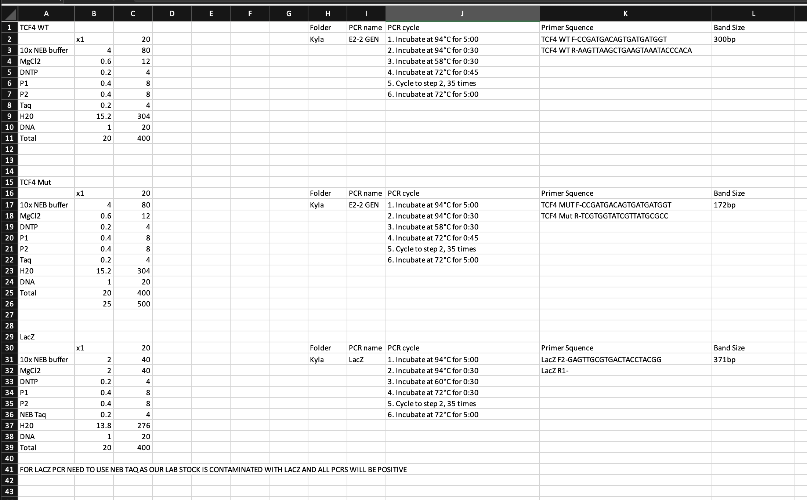

# PCR master mix recipe headings

[Open the original Excel workbook](PCR master mix recipes.xlsx).

{fig-alt="Screenshot of the PCR master mix recipes spreadsheet" width=100%}

## Id2flox

## Id2flox_current

## Id2flox Alt

## Id3flox current

## Id3flox

## P14

## Cre

## PLZF Cre

## dLCK Cre

## Cre Reporter

## FOXO1

## NKT (va14g)

## HEB KO

## HEBflox

## E2Aflox

## Zeb2flox

## Tbetflox

## OT-I

## Bhlhe40

## HIFVHL

## HIF2

## E2-2 Reporter

## E2-2 Conditional

## USP1

## ER cre
