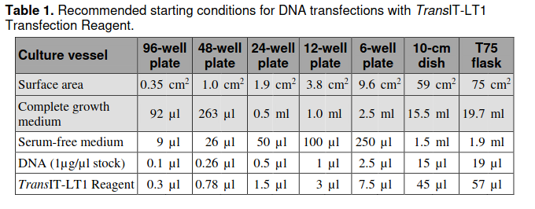

## Recommended starting conditions

Recommended starting conditions for DNA transfections with TransIT-LT1 Transfection Reagent.

| Culture vessel | 96-well plate | 48-well plate | 24-well plate | 12-well plate | 6-well plate | 10-cm dish | T75 flask |
|---|---:|---:|---:|---:|---:|---:|---:|
| Surface area | 0.35 cm² | 1.0 cm² | 1.9 cm² | 3.8 cm² | 9.6 cm² | 59 cm² | 75 cm² |
| Complete growth medium | 92 µL | 263 µL | 0.5 mL | 1.0 mL | 2.5 mL | 15.5 mL | 19.7 mL |
| Serum-free medium | 9 µL | 26 µL | 50 µL | 100 µL | 250 µL | 1.5 mL | 1.9 mL |
| DNA (1 µg/µL stock) | 0.1 µL | 0.26 µL | 0.5 µL | 1 µL | 2.5 µL | 15 µL | 19 µL |
| TransIT-LT1 Reagent | 0.3 µL | 0.78 µL | 1.5 µL | 3 µL | 7.5 µL | 45 µL | 57 µL |

: TransIT-LT1 DNA-transfection starting conditions
