# Introduction to DESeq2

A good way to document our R code is to use a R Markdown document (Rmd), which allows you to have R and text blocks within one document. [Click here for an introduction to R Markdown](https://rmarkdown.rstudio.com/lesson-1.html)

## Install required packages

The first thing we need to do, is install all the required packages in R. You can do this by running the following commands in R.


```r
# BiocManager is an excellent source for R packages used in bioinformatics
if (!requireNamespace("BiocManager", quietly = TRUE))
    install.packages("BiocManager")

# these are the packages that we are going to need.
list.of.packages <- c("ggplot2", "DESeq2", "readr", "readxl", "pheatmap",
                      "RColorBrewer", "EnhancedVolcano", "fgsea", "org.Mm.eg.db",
                      "AnnotationDbi", "gage", "plotly", "dplyr", "ComplexHeatmap",
                      "patchwork", "GSVA", "limma", "magrittr", "purrr")

# check, which packages have not been installed so far
new.packages <- list.of.packages[!(list.of.packages %in% installed.packages()[,"Package"])]
# install the missing packages. If a package is not in Bioconductor, it will be installed from cran. this can take a while
if(length(new.packages)) BiocManager::install(new.packages)
```

## Load count data and sample annotation into R

The next thing we need to do, is to load the raw count data and the sample annotation into R. We can import excel files with `read_excel` from the package `readxl` and the CSV file with `read_csv` from `readr`. First, we load the libraries in R, then we can access their function to load the data.

You can download the file here:
[GeneMatrix](GeneMatrix_all_Ms.xlsx)
[Annotation](annotation.csv)


```r
library(readxl)
counts <- read_excel("GeneMatrix_all_Ms.xlsx")

library(readr)
library(dplyr)
```

```
## 
## Attache Paket: 'dplyr'
```

```
## The following objects are masked from 'package:stats':
## 
##     filter, lag
```

```
## The following objects are masked from 'package:base':
## 
##     intersect, setdiff, setequal, union
```

```r
annotation <- read_csv("annotation.csv")
```

```
## 
## ── Column specification ──────────────────────────────────────────────────────────────────────────────────────────────────
## cols(
##   sample = col_character(),
##   tissue = col_character(),
##   cell.type = col_character()
## )
```

```r
## let's inspect the files
head(counts)
```


|Gene_ID_ENSMUSG    |Gene_ID       | LP_DP_Trm_1| LP_DP_Trm_2| mAT_Tem_1| mAT_Tem_2| mAT_Trm_1| mAT_Trm_2| mAT_Trm_3| Spl_Tem_1| Spl_Tem_2|
|:------------------|:-------------|-----------:|-----------:|---------:|---------:|---------:|---------:|---------:|---------:|---------:|
|ENSMUSG00000102693 |4933401J01Rik |           0|           0|         0|         0|         0|         0|         0|         0|         0|
|ENSMUSG00000064842 |Gm26206       |           0|           0|         0|         0|         0|         0|         0|         0|         0|
|ENSMUSG00000051951 |Xkr4          |           0|           0|         0|         0|         0|         0|         2|         0|         0|
|ENSMUSG00000102851 |Gm18956       |           0|           0|         0|         0|         0|         0|         0|         0|         0|
|ENSMUSG00000103377 |Gm37180       |           0|           0|         0|         0|         0|         0|         0|         0|         0|
|ENSMUSG00000104017 |Gm37363       |           0|           0|         0|         4|         0|         0|         0|         0|         0|

```r
head(annotation)
```


|sample      |tissue |cell.type |
|:-----------|:------|:---------|
|LP_DP_Trm_1 |LP_DT  |Trm       |
|LP_DP_Trm_2 |LP_DT  |Trm       |
|mAT_Tem_1   |mAT    |Tem       |
|mAT_Tem_2   |mAT    |Tem       |
|mAT_Trm_1   |mAT    |Trm       |
|mAT_Trm_2   |mAT    |Trm       |

### Prepare counts data

As you can see, in this case the counts table has 11 columns. The first two have the gene names, the last 9 contain the actual counts that we are interested in. `DESeq` requires a table, that only contains the counts. The row names contain the information about the gene. So let's do that.


```r
# to set to rownames, we first have to convert the table to a data.frame
counts <- as.data.frame(counts)
# Set the column ENSMUSG as the rownames of the table.
rownames(counts) <- counts$Gene_ID_ENSMUSG
# Remove ENSMUSG and Gene_Id from the table
counts$Gene_ID_ENSMUSG <- NULL
counts$Gene_ID <- NULL

head(counts)
```


|                   | LP_DP_Trm_1| LP_DP_Trm_2| mAT_Tem_1| mAT_Tem_2| mAT_Trm_1| mAT_Trm_2| mAT_Trm_3| Spl_Tem_1| Spl_Tem_2|
|:------------------|-----------:|-----------:|---------:|---------:|---------:|---------:|---------:|---------:|---------:|
|ENSMUSG00000102693 |           0|           0|         0|         0|         0|         0|         0|         0|         0|
|ENSMUSG00000064842 |           0|           0|         0|         0|         0|         0|         0|         0|         0|
|ENSMUSG00000051951 |           0|           0|         0|         0|         0|         0|         2|         0|         0|
|ENSMUSG00000102851 |           0|           0|         0|         0|         0|         0|         0|         0|         0|
|ENSMUSG00000103377 |           0|           0|         0|         0|         0|         0|         0|         0|         0|
|ENSMUSG00000104017 |           0|           0|         0|         4|         0|         0|         0|         0|         0|

Now we have a table with the samples as columns and the gene as rows. 

### Prepare annotation

Next, let's have a look at the annotation file. For each column in counts, we need one row in the annotation file. In this case, the row name needs to be the sample name. Then we will do some checks. We want to make sure that we have an annotation for all samples in counts and that the order of the column in counts equals the order of the rows in annotation.


```r
# set rownames
annotation <- as.data.frame(annotation)
rownames(annotation) <- annotation$sample

# check if all rownames in annotation correspond to a column in counts
all(rownames(annotation) %in% colnames(counts))  # --> this should return TRUE
```

```
## [1] TRUE
```

```r
# check if they are in the same order
# if this does not return TRUE, do not worry about that. We will sort the columns of counts accordingly.
all(rownames(annotation) == colnames(counts))
```

```
## [1] TRUE
```

```r
# reorder the columns of counts
counts <- counts[, rownames(annotation)]

# now, this sould return TRUE
all(rownames(annotation) == colnames(counts))
```

```
## [1] TRUE
```

## DESeq2

Here, we will use `DESeq2` to analyze differential gene expression. `DESeq2` has a very good vignette that explains a lot of the features of `DESeq2`. If you have any problem about running DESeq2 it is worth to check this page, as this provides a lot of answers: [`DESeq2` vignette](https://bioconductor.org/packages/release/bioc/vignettes/DESeq2/inst/doc/DESeq2.html)

### Create DESeqDataSet

With the count matrix, counts, and the sample information, annotation, we can construct a `DESeqDataSet`. The design formula depends on the experimental design of your experiment. In this case, `tissue` (Spleen, Fat, Gut) and `cell.type` (Trm, Tem). Let's assume that there is no interaction between `tissue` and `cell.type` to make the analysis a little easier. Again, the `DESeq2` vignette provides a very nice section on how to deal with interaction in `DESeq2` (https://bioconductor.org/packages/release/bioc/vignettes/DESeq2/inst/doc/DESeq2.html#interactions)


```r
suppressPackageStartupMessages(library(DESeq2))

dds <- DESeqDataSetFromMatrix(countData = counts,
                              colData = annotation,
                              design = ~ tissue + cell.type)
```

```
## converting counts to integer mode
```

```
## Warning in DESeqDataSet(se, design = design, ignoreRank): some variables in
## design formula are characters, converting to factors
```

```r
dds <- DESeq(dds)
```

```
## estimating size factors
```

```
## estimating dispersions
```

```
## gene-wise dispersion estimates
```

```
## mean-dispersion relationship
```

```
## final dispersion estimates
```

```
## fitting model and testing
```

```r
dds
```

```
## class: DESeqDataSet 
## dim: 55471 9 
## metadata(1): version
## assays(4): counts mu H cooks
## rownames(55471): ENSMUSG00000102693 ENSMUSG00000064842 ...
##   ENSMUSG00000095019 ENSMUSG00000095041
## rowData names(30): baseMean baseVar ... deviance maxCooks
## colnames(9): LP_DP_Trm_1 LP_DP_Trm_2 ... Spl_Tem_1 Spl_Tem_2
## colData names(4): sample tissue cell.type sizeFactor
```

If you have additional feature data (gene data, eg. names), it can be added to the `DESeqDataSet` by adding to the metadata columns of a newly constructed object using the `mcol` function. Let us add the Gene_ID_ENSMUSG and Gene_ID.


```r
# read the excel file, but keep only the first to columns  [,1:2]
gene_information <- read_excel("GeneMatrix_all_Ms.xlsx")[,1:2]
head(gene_information)
```


|Gene_ID_ENSMUSG    |Gene_ID       |
|:------------------|:-------------|
|ENSMUSG00000102693 |4933401J01Rik |
|ENSMUSG00000064842 |Gm26206       |
|ENSMUSG00000051951 |Xkr4          |
|ENSMUSG00000102851 |Gm18956       |
|ENSMUSG00000103377 |Gm37180       |
|ENSMUSG00000104017 |Gm37363       |

```r
mcols(dds) <- DataFrame(mcols(dds), gene_information)
# head(as.data.frame(mcols(dds)))
```

#### (Optional) Pre-filtering

While it is not necessary to pre-filter low count genes before running the `DESeq2` functions, there are two reasons which make pre-filtering useful: by removing rows in which there are very few reads, we reduce the memory size of the dds data object, and we increase the speed of the transformation and testing functions within `DESeq2`. Here we perform a minimal pre-filtering to keep only rows that have at least 10 reads total. 


```r
keep <- rowSums(counts(dds)) >= 10
dds <- dds[keep,]
```

### PCA

In order to check for batch effects etc. I find it useful to have a look at the PCA before starting with the DE analysis.

For downstream analyses – e.g. for visualization or clustering but NOT for DE analysis(!) – it might be useful to work with transformed versions of the count data. The most obvious choice for transformation is log transformation with a pseudocount. However, the `DESeq2` package offers two alternative ways for data transformation (VST and rlog).

The be honest, I do not understand the mathematical background of either of these. But again there is a whole section on data transformation in the vignette (https://bioconductor.org/packages/release/bioc/vignettes/DESeq2/inst/doc/DESeq2.html#data-transformations-and-visualization).

Let us just do all normalizations and compare the results.


```r
ntd <- normTransform(dds)  ## log2(n +1)
vsd <- vst(dds, blind=FALSE)
rld <- rlog(dds, blind=FALSE)

plotPCA(ntd, intgroup=c("tissue", "cell.type")) + ggplot2::theme_bw()
```

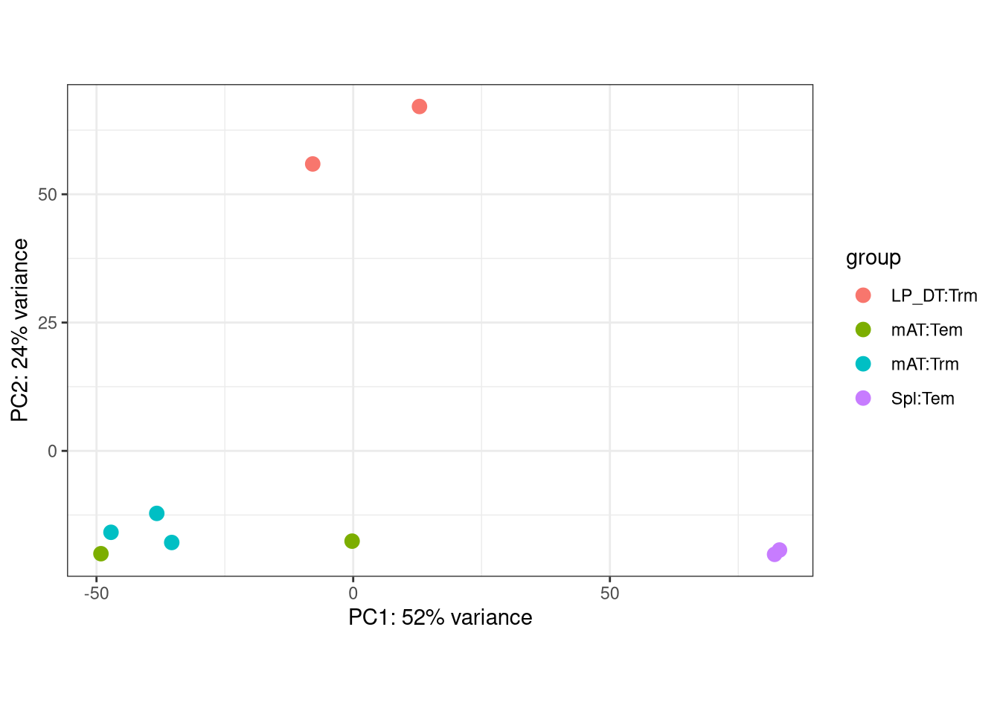

```r
plotPCA(vsd, intgroup=c("tissue", "cell.type")) + ggplot2::theme_bw()
```

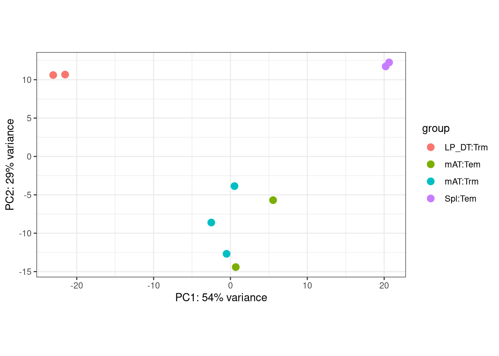

```r
plotPCA(rld, intgroup=c("tissue", "cell.type")) + ggplot2::theme_bw()
```

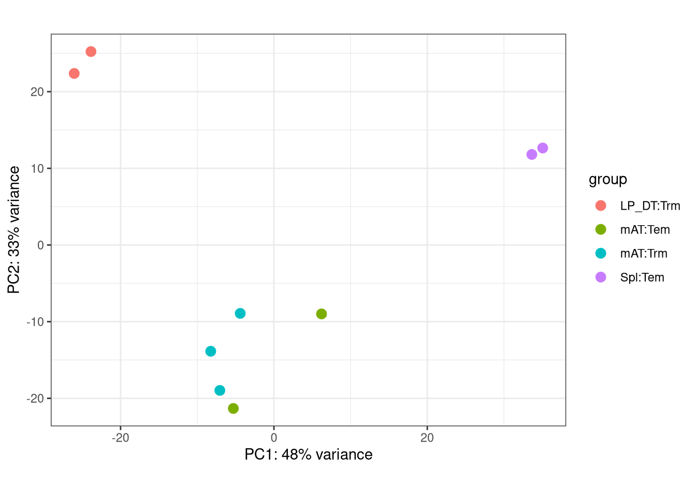

In all three cases, we get the biggest difference in the PCA between the tissues and the Tem and Trm in mAT seem to be closer together.

#### Sample to sample distance matrix

An alternative way is to visualize the sample to sample distance.


```r
library(pheatmap)
library(RColorBrewer)
sampleDists <- dist(t(assay(vsd)))
sampleDistMatrix <- as.matrix(sampleDists)
rownames(sampleDistMatrix) <- paste(vsd$tissue, vsd$cell.type, sep="-")
colnames(sampleDistMatrix) <- NULL
colors <- colorRampPalette( rev(brewer.pal(9, "Blues")) )(255)
pheatmap(sampleDistMatrix,
         clustering_distance_rows=sampleDists,
         clustering_distance_cols=sampleDists,
         col=colors)
```

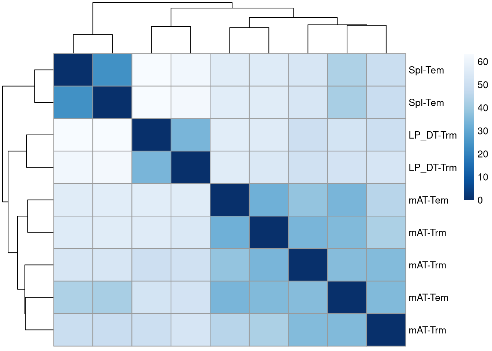


### Differential expression analysis

For the DE analysis, you first have to know which groups you want to compare. For some special comparisons you might need to adapt the design when creating the DDS (see above). In this example, we want to compare mAT-TEM vs mAT-TRM.

Therefore we need to slightly adapt the experimental design. So far we have `~ tissue + cell.type`. If we were to compare Tem vs Trm in this design, the Tem population would consist of Spl and mAT and the Trm population of mAT and LP. We could either add an interaction term or create a new grouping variable by pasting tissue and cell.type together.


```r
# create new grouping variable and convert it to a factor
dds$tissue_cell.type <- factor(paste(dds$tissue, dds$cell.type, sep="-"))
dds$tissue_cell.type
```

```
## [1] LP_DT-Trm LP_DT-Trm mAT-Tem   mAT-Tem   mAT-Trm   mAT-Trm   mAT-Trm  
## [8] Spl-Tem   Spl-Tem  
## Levels: LP_DT-Trm mAT-Tem mAT-Trm Spl-Tem
```

```r
# update design
design(dds) <- ~ tissue_cell.type
```

```
##   Note: levels of factors in the design contain characters other than
##   letters, numbers, '_' and '.'. It is recommended (but not required) to use
##   only letters, numbers, and delimiters '_' or '.', as these are safe characters
##   for column names in R. [This is a message, not a warning or an error]
```

```r
design(dds)
```

```
## ~tissue_cell.type
```

The actual analysis only consists of two commands: `DESeq` and `results`.


```r
dds <- DESeq(dds)
```

```
## using pre-existing size factors
```

```
## estimating dispersions
```

```
## found already estimated dispersions, replacing these
```

```
## gene-wise dispersion estimates
```

```
## mean-dispersion relationship
```

```
##   Note: levels of factors in the design contain characters other than
##   letters, numbers, '_' and '.'. It is recommended (but not required) to use
##   only letters, numbers, and delimiters '_' or '.', as these are safe characters
##   for column names in R. [This is a message, not a warning or an error]
```

```
## final dispersion estimates
```

```
##   Note: levels of factors in the design contain characters other than
##   letters, numbers, '_' and '.'. It is recommended (but not required) to use
##   only letters, numbers, and delimiters '_' or '.', as these are safe characters
##   for column names in R. [This is a message, not a warning or an error]
```

```
## fitting model and testing
```

```r
# we want to compare mAT-Trm against mAT-Tem
res <- results(dds, contrast = c("tissue_cell.type", "mAT-Trm", "mAT-Tem"))
```

#### MA Plot

Let's inspect the results with a MA Plot.
Points will be colored if the adjusted p value is less than 0.1. Points which fall out of the window are plotted as open triangles pointing either up or down.


```r
plotMA(res, ylim=c(-2,2))
```

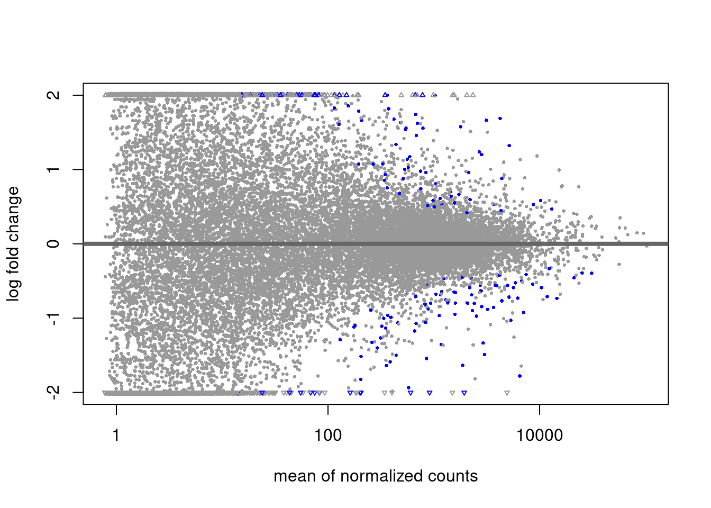

#### Shrinkage of effect size

Shrinkage of effect size (LFC estimates) is useful for visualization and ranking of genes. You can do this by running


```r
resLFC <- lfcShrink(dds, contrast = c("tissue_cell.type", "mAT-Trm", "mAT-Tem"), type="normal")
```

```
## using 'normal' for LFC shrinkage, the Normal prior from Love et al (2014).
## 
## Note that type='apeglm' and type='ashr' have shown to have less bias than type='normal'.
## See ?lfcShrink for more details on shrinkage type, and the DESeq2 vignette.
## Reference: https://doi.org/10.1093/bioinformatics/bty895
```

```r
resLFC
```

```
## log2 fold change (MAP): tissue_cell.type mAT-Trm vs mAT-Tem 
## Wald test p-value: tissue_cell.type mAT-Trm vs mAT-Tem 
## DataFrame with 20977 rows and 6 columns
##                      baseMean log2FoldChange     lfcSE       stat    pvalue
##                     <numeric>      <numeric> <numeric>  <numeric> <numeric>
## ENSMUSG00000025902   38.81707     -0.0657565  0.593222  -0.190398  0.848998
## ENSMUSG00000098104    7.42396      0.2483116  0.603883   0.319437  0.749395
## ENSMUSG00000102175    1.47403      0.0000000  0.315270   0.000000  1.000000
## ENSMUSG00000103265    2.19491     -0.1765775  0.319821  -0.382525  0.702072
## ENSMUSG00000103922   14.05290      0.1197084  0.588259   0.206813  0.836156
## ...                       ...            ...       ...        ...       ...
## ENSMUSG00000062783    4.59173     -0.0226735  0.554738  0.0165099  0.986828
## ENSMUSG00000051412  719.08000      0.0734676  0.220288  0.3431146  0.731512
## ENSMUSG00000079834  206.93385     -0.3998476  0.373403 -1.1192906  0.263016
## ENSMUSG00000095742   40.18873      0.4429883  0.539459  0.7876592  0.430896
## ENSMUSG00000095041 6206.13205      0.1826876  0.237423  0.7870539  0.431250
##                         padj
##                    <numeric>
## ENSMUSG00000025902         1
## ENSMUSG00000098104        NA
## ENSMUSG00000102175        NA
## ENSMUSG00000103265        NA
## ENSMUSG00000103922         1
## ...                      ...
## ENSMUSG00000062783        NA
## ENSMUSG00000051412  1.000000
## ENSMUSG00000079834  0.932940
## ENSMUSG00000095742  0.987327
## ENSMUSG00000095041  0.987327
```

It is more useful visualize the MA-plot for the shrunken log2 fold changes, which remove the noise associated with log2 fold changes from low count genes without requiring arbitrary filtering thresholds.


```r
plotMA(resLFC, ylim=c(-2,2))
```

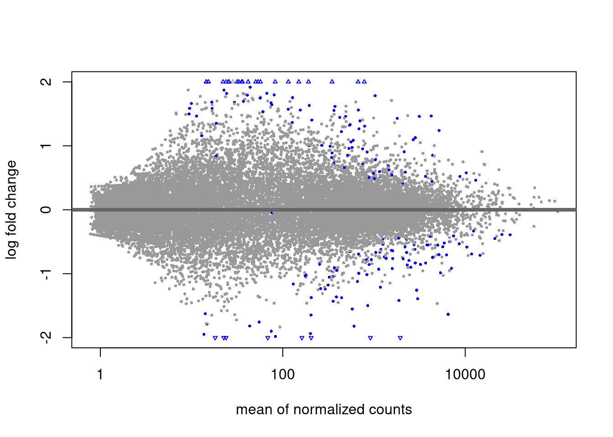

As you can see, `lfcShrink` removes the noise associated with log2 fold changes from low count genes without requiring arbitrary filtering thresholds. P values are not affected by this.


```r
plot(res$pvalue, resLFC$pvalue)
```

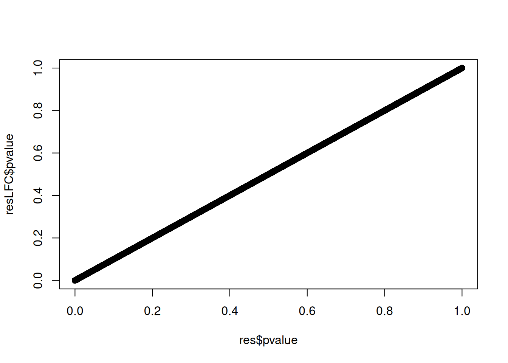

#### Volcano plot

With this, it is really easy to create a volcano plot.


```r
library(EnhancedVolcano)
```

```
## Lade nötiges Paket: ggplot2
```

```
## Lade nötiges Paket: ggrepel
```

```r
EnhancedVolcano(resLFC,
    lab = mcols(dds)$Gene_ID,
    x = 'log2FoldChange',
    y = 'padj', ## use pvalue for unadjusted p values
    pCutoff = 10e-4,
    title = "Volcano plot",
    subtitle = "Comparison mAT-Trm vs mAT-Tem")
```

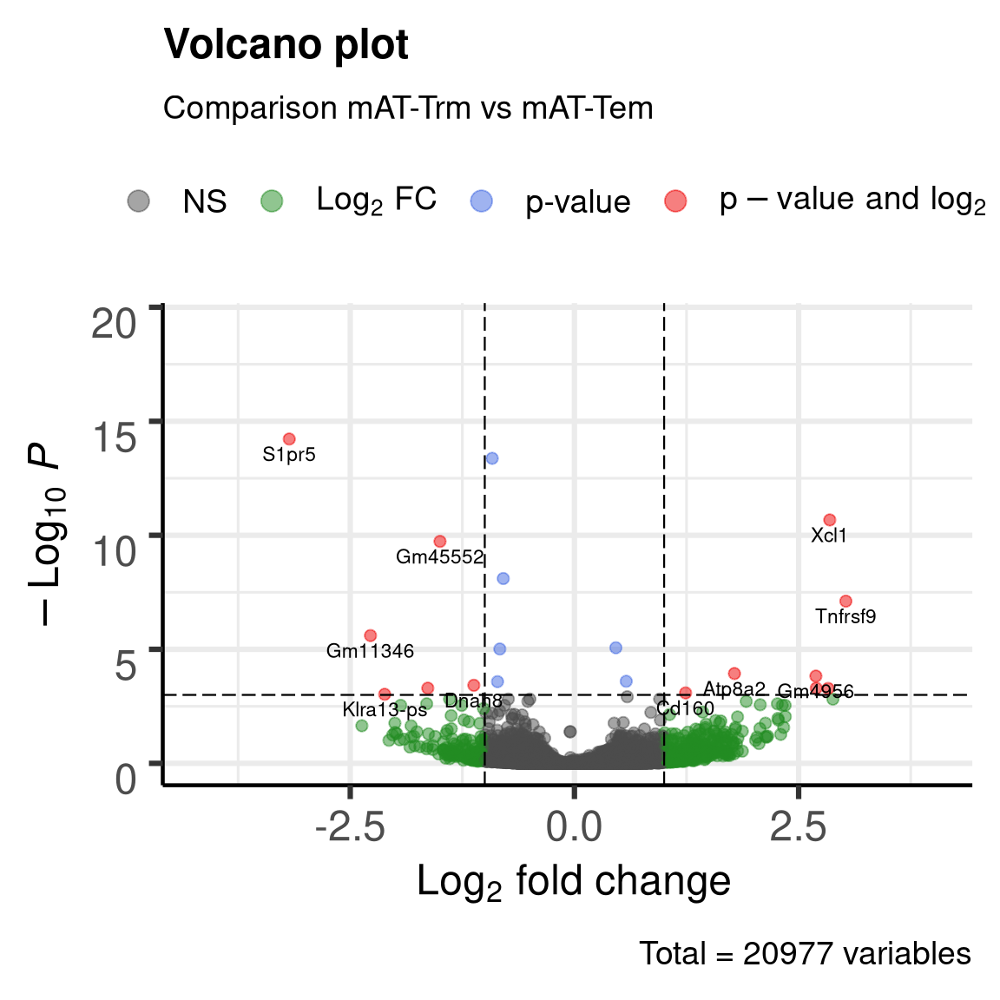

You can see, that e.g. 4-1BB (Tnfrsf9) is upregulated in Trm.

#### Summary of the results


```r
summary(resLFC)
```

```
## 
## out of 20977 with nonzero total read count
## adjusted p-value < 0.1
## LFC > 0 (up)       : 103, 0.49%
## LFC < 0 (down)     : 100, 0.48%
## outliers [1]       : 5, 0.024%
## low counts [2]     : 6507, 31%
## (mean count < 9)
## [1] see 'cooksCutoff' argument of ?results
## [2] see 'independentFiltering' argument of ?results
```

103 genes are upregulated and 100 are down regulated.

It can also be useful to plot the counts of a gene across the different groups. Let's plot the gene with the lowest p-value.


```r
plotCounts(dds, gene=which.min(resLFC$padj), intgroup="tissue_cell.type")
```

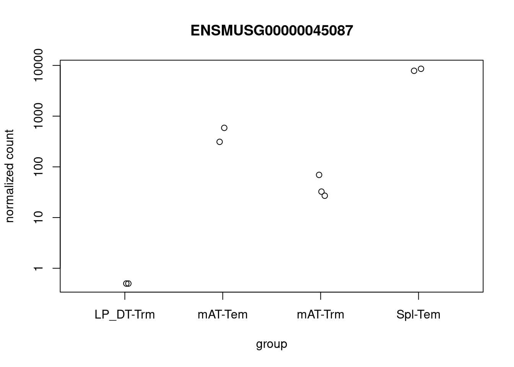

I don't really know many (or any) of the ENSMUSG by heart. So let us add the gene symbols stored in mcols.


```r
## important: add additonal columns before you change the order of the results!
resLFC$Gene_ID <- mcols(dds)$Gene_ID
head(resLFC)
```

```
## log2 fold change (MAP): tissue_cell.type mAT-Trm vs mAT-Tem 
## Wald test p-value: tissue_cell.type mAT-Trm vs mAT-Tem 
## DataFrame with 6 rows and 7 columns
##                      baseMean log2FoldChange     lfcSE      stat    pvalue
##                     <numeric>      <numeric> <numeric> <numeric> <numeric>
## ENSMUSG00000025902   38.81707     -0.0657565  0.593222 -0.190398  0.848998
## ENSMUSG00000098104    7.42396      0.2483116  0.603883  0.319437  0.749395
## ENSMUSG00000102175    1.47403      0.0000000  0.315270  0.000000  1.000000
## ENSMUSG00000103265    2.19491     -0.1765775  0.319821 -0.382525  0.702072
## ENSMUSG00000103922   14.05290      0.1197084  0.588259  0.206813  0.836156
## ENSMUSG00000033845 1056.28656      0.2889131  0.247552  1.161845  0.245299
##                         padj     Gene_ID
##                    <numeric> <character>
## ENSMUSG00000025902  1.000000       Sox17
## ENSMUSG00000098104        NA      Gm6085
## ENSMUSG00000102175        NA      Gm6119
## ENSMUSG00000103265        NA      Gm2053
## ENSMUSG00000103922  1.000000      Gm6123
## ENSMUSG00000033845  0.917011      Mrpl15
```

Much better... Now sort the list by adjusted p-value.


```r
resOrdered <- resLFC[order(resLFC$padj),]
head(resOrdered)
```

```
## log2 fold change (MAP): tissue_cell.type mAT-Trm vs mAT-Tem 
## Wald test p-value: tissue_cell.type mAT-Trm vs mAT-Tem 
## DataFrame with 6 rows and 7 columns
##                     baseMean log2FoldChange     lfcSE      stat      pvalue
##                    <numeric>      <numeric> <numeric> <numeric>   <numeric>
## ENSMUSG00000045087  1938.381      -3.180235  0.354143  -8.93271 4.15716e-19
## ENSMUSG00000036006  7066.525      -0.916814  0.106214  -8.63554 5.84496e-18
## ENSMUSG00000026573   782.167       2.847248  0.360103   7.84296 4.40044e-15
## ENSMUSG00000110279   852.944      -1.499104  0.199339  -7.52882 5.12005e-14
## ENSMUSG00000036944  2417.237      -0.793412  0.113439  -6.99133 2.72299e-12
## ENSMUSG00000028965   668.821       3.026469  0.444460   6.63673 3.20723e-11
##                           padj     Gene_ID
##                      <numeric> <character>
## ENSMUSG00000045087 6.01333e-15       S1pr5
## ENSMUSG00000036006 4.22736e-14      Ripor2
## ENSMUSG00000026573 2.12175e-11        Xcl1
## ENSMUSG00000110279 1.85154e-10     Gm45552
## ENSMUSG00000036944 7.87761e-09      Tmem71
## ENSMUSG00000028965 7.73211e-08     Tnfrsf9
```

We can export the list to csv (or excel) to make manual inspection a little easier.


```r
write_csv(as.data.frame(resOrdered), "de_mAT-Trm_vs_mAT-Tem.csv")
```


### Heatmap

Using the normalized counts, we can easily create a Heatmap displaying the differentially regulated genes.


```r
# we are using which here, as some pvalues are NA.
de_genes <- rownames(resLFC)[which(resLFC$padj<0.1)]

# extract count data and filter rows.
m <- assay(ntd)[de_genes,]  ## or rld (for rlog) or vsd (for vst)

# keep only the samples, that we compared.
m <- m[, dds$tissue_cell.type %in% c("mAT-Trm", "mAT-Tem")]

suppressPackageStartupMessages(library(ComplexHeatmap))

Heatmap(t(scale(t(m))),     # we want to normalize the counts per row. 
                            # scale() normalizes per column.
                            # therefore we first transponse the matrix, 
                            # then call scale and then transpose again.
        show_row_names = FALSE,
        column_split = 2,
        row_split = 2,
        name="z-score")
```

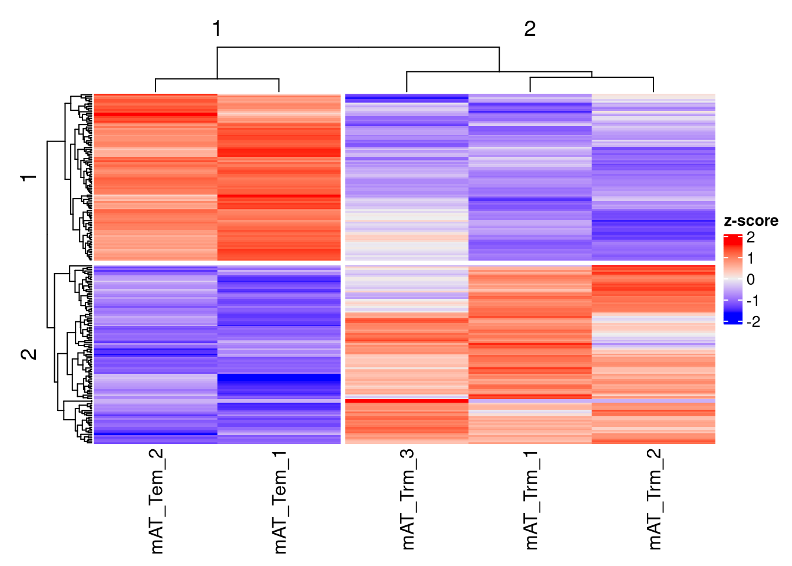


## GSEA

### Prepare ranked gene list

In order to do a GSEA analysis in R, we need to create a ranked gene list. Many tools use the signed -log10(pvalue) for ranking of the genes. As the pvalue is between 0 and 1, the -log10(pvalue) will be between 0 and Inf. We use the sign from the log2FC to seperate between up and down regulated genes.


```r
# function for signal to noise
# see: https://www.gsea-msigdb.org/gsea/doc/GSEAUserGuideTEXT.htm#_Metrics_for_Ranking
signal2noise <- function(var1, var2, col_names, log_counts)
{
  col_names2 <- colnames(log_counts)[col_names==var2]
  col_names1 <- colnames(log_counts)[col_names==var1]

  library(dplyr)
  assay(log_counts) %>%
    as_tibble() %>%
    rowwise() %>%
    mutate(mean1 = mean(c_across(all_of(col_names1))),
           mean2 = mean(c_across(all_of(col_names2))),
           sd1 = sd(c_across(all_of(col_names1))),
           sd2 = sd(c_across(all_of(col_names2))),
           ) %>%
    mutate(sd1 = if_else(sd1 < .2 * abs(mean1), .2 * abs(mean1), sd1),
           sd2 = if_else(sd2 < .2 * abs(mean2), .2 * abs(mean2), sd2)) %>%
    mutate(rank = (mean1 - mean2) / (sd1 + sd2)) %>%
    pull(rank)
}
```


```r
#rank <- -log10(res$padj) * sign(res$log2FoldChange)
rank <- res$stat
#rank <- signal2noise("mAT-Trm" ,"mAT-Tem", dds$tissue_cell.type, ntd)
names(rank) <- rownames(res)
head(rank)
```

```
## ENSMUSG00000025902 ENSMUSG00000098104 ENSMUSG00000102175 ENSMUSG00000103265 
##         -0.1903976          0.3194374          0.0000000         -0.3825247 
## ENSMUSG00000103922 ENSMUSG00000033845 
##          0.2068132          1.1618447
```

```r
summary(rank)
```


|      Min.|    1st Qu.|    Median|     Mean|   3rd Qu.|     Max.|
|---------:|----------:|---------:|--------:|---------:|--------:|
| -8.932705| -0.5409195| 0.0206167| 0.066334| 0.6656471| 7.842961|

```r
barplot(sort(rank, decreasing = T))
```

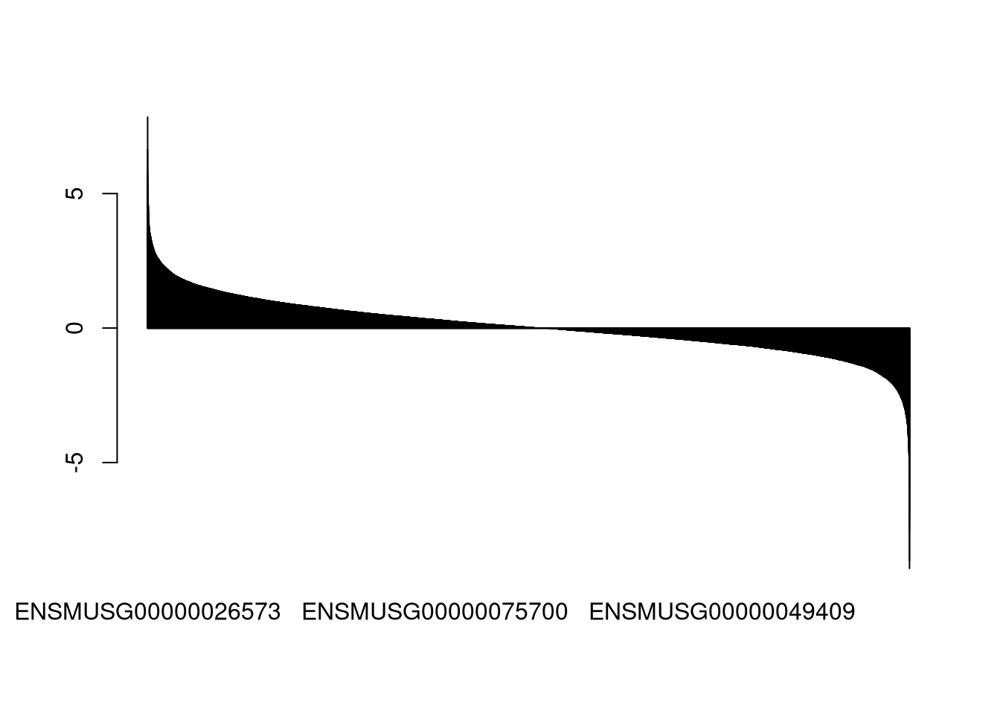

As you can see, a few genes do not have a p-value, which is mostly because these genes have to few counts. We can remove these.


```r
rank <- rank[!is.na(rank)]
head(rank)
```

```
## ENSMUSG00000025902 ENSMUSG00000098104 ENSMUSG00000102175 ENSMUSG00000103265 
##         -0.1903976          0.3194374          0.0000000         -0.3825247 
## ENSMUSG00000103922 ENSMUSG00000033845 
##          0.2068132          1.1618447
```


Most of the gene lists available (eg. KEGG) use the ENTREZ ID as gene identifiers. Therefore we must match the ENSEMBL IDs to the ENTREZ IDs. The package [`org.Mm.eg.db`](http://bioconductor.org/packages/release/data/annotation/html/org.Mm.eg.db.html) has all these information stored in it. We load the package and use `AnnotationDbi` to match the ENSEMBL IDs (`keytype`) to the ENTREZ IDs (`column`). For some ENSEMBL IDs there might be multiple or none ENTREZ IDs. If there are multiple matches, we will take the first (`multiVals="first"`) .


```r
library(org.Mm.eg.db)
```

```
## Lade nötiges Paket: AnnotationDbi
```

```
## 
## Attache Paket: 'AnnotationDbi'
```

```
## The following object is masked from 'package:dplyr':
## 
##     select
```

```
## 
```

```r
entrez_ids <- AnnotationDbi::mapIds(org.Mm.eg.db,
                         keys=names(rank), 
                         column="ENTREZID",
                         keytype="ENSEMBL",
                         multiVals="first")
```

```
## 'select()' returned 1:many mapping between keys and columns
```

```r
## for 1838 genes there is no matching ENTREZ ID
sum(is.na(entrez_ids))
```

```
## [1] 5454
```

```r
names(rank) <- entrez_ids
head(rank)
```

```
##      20671       <NA>       <NA>       <NA>       <NA>      27395 
## -0.1903976  0.3194374  0.0000000 -0.3825247  0.2068132  1.1618447
```

Now, we are almost set to run the GSEA. We only need the gene lists, that we want to test for enrichment. There are multipe sources to get pathway gene lists. In this example, we will use the KEGG pathways.

### Retrieve pathways

The `gage` package has a convenient function to download the KEGG pathways. Since we will only use one function of that package, we will not load it using `library` but intead diretly access the function with `::`.

The function `gage::kegg.gsets` returns a list with five entires. 

`kg.sets`: KEGG gene sets, a named list. Each element is a character vector of member gene IDs for a single KEGG pathway. The number of elements of this list is the total number of KEGG pathways defined for the specified species.  
`sigmet.idx`: integer indice, which elements in kg.sets are signaling or metabolism pathways.  
`sig.idx`: integer indice, which elements in kg.sets are signaling pathways.  
`met.idx`: integer indice, which elements in kg.sets are metabolism pathways.  
`dise.idx`: integer indice, which elements in kg.sets are disease pathways.  

We can use `sigmet.idx` to subset the `kg.sets` to only retain pathways that are important for signaling and metabolism.


```r
pathways_kegg <- gage::kegg.gsets(species = "mouse")
```

```
## 
```

```r
pathways_kegg <- pathways_kegg$kg.sets[pathways_kegg$sigmet.idx]
head(pathways_kegg, 2)
```

```
## $`mmu00970 Aminoacyl-tRNA biosynthesis`
##  [1] "102436" "104458" "105148" "107045" "107271" "107508" "109093" "110960"
##  [9] "15115"  "17726"  "17727"  "17728"  "17729"  "17730"  "17731"  "17732" 
## [17] "17733"  "17734"  "17735"  "17736"  "17737"  "17738"  "17739"  "17740" 
## [25] "17741"  "17742"  "17743"  "17744"  "17745"  "17746"  "17747"  "20226" 
## [33] "211006" "212679" "214580" "216443" "22321"  "22375"  "224805" "226414"
## [41] "226539" "229487" "230577" "234734" "23874"  "244141" "272396" "27267" 
## [49] "353172" "381314" "384281" "66590"  "67417"  "68915"  "69606"  "69955" 
## [57] "70120"  "70223"  "70560"  "70791"  "71807"  "71941"  "71984"  "76563" 
## [65] "85305"  "97541" 
## 
## $`mmu02010 ABC transporters`
##  [1] "11303"  "11304"  "11305"  "11306"  "11307"  "11666"  "12638"  "12780" 
##  [9] "13214"  "17250"  "18669"  "18670"  "18671"  "192663" "19299"  "19300" 
## [17] "20927"  "20928"  "21354"  "21355"  "217258" "217262" "217265" "224814"
## [25] "233810" "239273" "244562" "26357"  "268379" "26874"  "27403"  "27404" 
## [33] "27405"  "27409"  "27410"  "27413"  "27416"  "27421"  "320631" "381072"
## [41] "56199"  "56325"  "67470"  "67928"  "74104"  "74591"  "74610"  "76184" 
## [49] "76408"  "77706"
```

The pathways only contain a list of ENTREZ IDs. So it is acually pretty easy to create a gene list you self, that you can than test in other settings.

### Run GSEA (`fgsea`)

Now we can finally run the GSEA. Using`maxSize=500` we limit the maximal size (= number of genes in that pathway). This speeds up the calculation as the time increases exponentially (not so sure about that, but I guess it is exponentially) with the number of genes in the list.

Note, if you are using a "older" verion on `fgsea` you might have to add `nperm=5000` to set the number of permutations to do. In the most recent verion of `fgsea` this is no longer needed.


```r
library(fgsea)

fgsea.res <- fgsea(pathways_kegg,
                   rank,
                   maxSize=500)
```

```
## Warning in preparePathwaysAndStats(pathways, stats, minSize, maxSize, gseaParam, : There are ties in the preranked stats (0.7% of the list).
## The order of those tied genes will be arbitrary, which may produce unexpected results.
```

```
## Warning in preparePathwaysAndStats(pathways, stats, minSize, maxSize,
## gseaParam, : There are duplicate gene names, fgsea may produce unexpected
## results.
```

```r
## inspect the results
head(fgsea.res[order(pval), -c("leadingEdge")])
```


|pathway                                              |    pval|      padj|   log2err|        ES|      NES| size|
|:----------------------------------------------------|-------:|---------:|---------:|---------:|--------:|----:|
|mmu04060 Cytokine-cytokine receptor interaction      | 0.0e+00| 0.0000000| 0.8266573| 0.4937635| 2.105015|  188|
|mmu04145 Phagosome                                   | 0.0e+00| 0.0000044| 0.7195128| 0.4945685| 2.041303|  143|
|mmu04141 Protein processing in endoplasmic reticulum | 1.3e-06| 0.0001008| 0.6435518| 0.4507566| 1.882707|  156|
|mmu01230 Biosynthesis of amino acids                 | 2.1e-06| 0.0001247| 0.6272567| 0.5571240| 2.051999|   67|
|mmu04110 Cell cycle                                  | 6.1e-06| 0.0002887| 0.6105269| 0.4785216| 1.931904|  120|
|mmu01200 Carbon metabolism                           | 9.0e-06| 0.0003193| 0.5933255| 0.4830972| 1.915062|  106|

In this example we do not get any significant results from the GSEA analysis. If there are ties in the preranked stats, the p-value might change form run to run a little.`

If you wanted to further inspect a gene set, you can create the "typical" GSEA plots using:


```r
plotEnrichment(pathways_kegg[["mmu04660 T cell receptor signaling pathway"]],
               rank) + ggplot2::ggtitle("T cell receptor signaling pathway",
                                        subtitle = "Comparison mAT-Trm vs mAT-Tem")
```

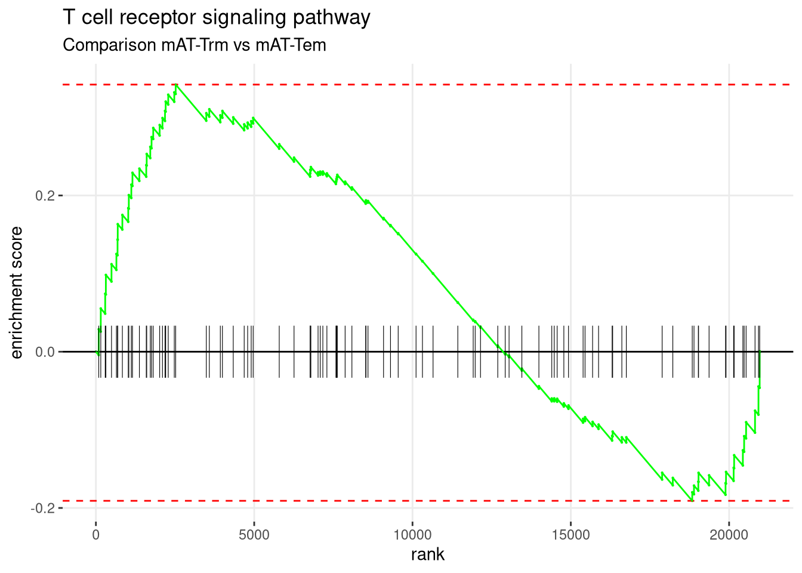

I admit, this is not really exiting in this case.


### Heatmap


```r
genes <- pathways_kegg[["mmu04060 Cytokine-cytokine receptor interaction"]]
subsets <- c("mAT-Trm" ,"mAT-Tem")

ensemblids <- unlist(mapIds(org.Mm.eg.db,
                     keys=genes, 
                     column="ENSEMBL",
                     keytype="ENTREZID",
                     multiVals="list"))
```

```
## 'select()' returned 1:many mapping between keys and columns
```

```r
mat <- assay(ntd[rownames(ntd) %in% ensemblids,dds$tissue_cell.type %in% subsets])
#scale 
mat <- t(scale(t(mat)))
mat <- mat[!is.nan(rowSums(mat)),]

Heatmap(mat, 
        row_labels = mapIds(org.Mm.eg.db,
                     keys=rownames(mat), 
                     column="SYMBOL",
                     keytype="ENSEMBL",
                     multiVals="first"),
        row_title = "mmu04060 Cytokine-cytokine receptor interactiony",
        name = "ntd"
        )
```

```
## 'select()' returned 1:many mapping between keys and columns
```

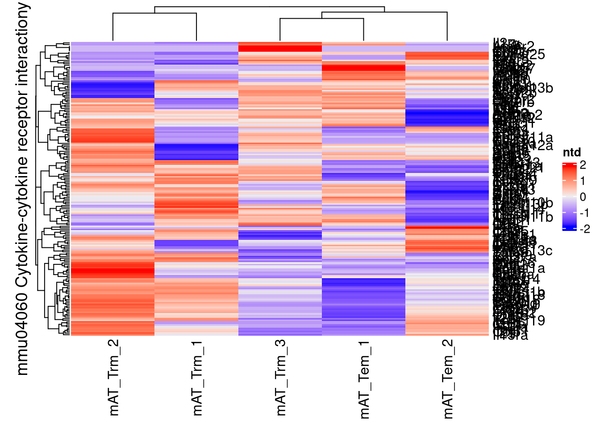


## GSVA

See: https://towardsdatascience.com/decoding-gene-set-variation-analysis-8193a0cfda3

Gene Set Variation analysis is a technique for characterising pathways or signature summaries from a gene expression dataset. GSVA builds on top of Gene Set Enrichment analysis where a set of genes is characterised between two condition groups defined in the sample. GSEA (Gene set enrichment analysis) works on how genes are behaving differently between the two groups defined. 

What if I want to study my samples for the enrichment of a pathway without relying on phenotypic information. What if I want to ask, how is this pathway or gene signature behaving in this sample? Gene Set Variation analysis can help me out here!


First we need to get the values to run the GSVA with. You can either use the counts, that follow a Poission distribution or the normalized values (here rlog). These values have a Gaussian distribution. Again, we map the ENSEMBL gene name to the Entrez IDs.


```r
m <- assay(rlog(dds, blind = F))
entrez_ids <- AnnotationDbi::mapIds(org.Mm.eg.db,
                         keys=rownames(m), 
                         column="ENTREZID",
                         keytype="ENSEMBL",
                         multiVals="first")
```

```
## 'select()' returned 1:many mapping between keys and columns
```

```r
rownames(m) <- entrez_ids
```

Now we can run the GSVA using e.g. the KEGG pathways (as in section GSEA)


```r
library(GSVA)
res_gsva <- gsva(
  expr = m,
  gset.idx.list = pathways_kegg,
  kcdf = "Gaussian",
      # Poisson if count data, Gaussian if log transformed (=continouus) data
      # see above, in this case we use counts, not rlog
  verbose = FALSE
)
head(res_gsva)
```


|                                           | LP_DP_Trm_1| LP_DP_Trm_2|  mAT_Tem_1|  mAT_Tem_2|  mAT_Trm_1|  mAT_Trm_2| mAT_Trm_3|  Spl_Tem_1|  Spl_Tem_2|
|:------------------------------------------|-----------:|-----------:|----------:|----------:|----------:|----------:|---------:|----------:|----------:|
|mmu00970 Aminoacyl-tRNA biosynthesis       |  -0.3601172|  -0.4289843|  0.1452521|  0.2575340| -0.0762623| -0.3346715| 0.4647248| -0.0725019| -0.1002151|
|mmu02010 ABC transporters                  |   0.1333820|   0.1171211|  0.2598238|  0.1429869| -0.0211218|  0.2326393| 0.0276217| -0.2302680| -0.1658841|
|mmu03008 Ribosome biogenesis in eukaryotes |  -0.3597666|  -0.3841356|  0.2082684|  0.0064840|  0.0951391| -0.3820233| 0.5831122| -0.0324359| -0.2084009|
|mmu03010 Ribosome                          |  -0.2376022|  -0.1956811|  0.5456778| -0.1864645|  0.2308542| -0.7221239| 0.6845166|  0.1356616| -0.5235316|
|mmu03013 RNA transport                     |  -0.2401994|  -0.0652585| -0.1512559| -0.0651579|  0.0968792| -0.2997936| 0.4890308| -0.1274834| -0.1137668|
|mmu03015 mRNA surveillance pathway         |   0.0095893|  -0.1745615| -0.0637988| -0.0712079| -0.0729849| -0.1884230| 0.3146337| -0.1351570| -0.0322716|

We get a table with one value for every gene set for every sample. You can imagine these as kind of summerized expression values for the genes in the gene set.


### Test which sets are differentially expressed

To test which pathways show differences between the samples, we can use the `limma` package to fit models one the results obtained form the GSVA.


```r
library(limma)
```

```
## 
## Attache Paket: 'limma'
```

```
## The following object is masked from 'package:DESeq2':
## 
##     plotMA
```

```
## The following object is masked from 'package:BiocGenerics':
## 
##     plotMA
```

```r
library(magrittr)

design <- model.matrix(~0+tissue_cell.type, data=colData(dds))
colnames(design) <- make.names(levels(dds$tissue_cell.type))

fit <- lmFit(res_gsva, design = design)

# define contrasts of interest
# here we create all possible contrasts
cont.matrix <- colnames(design) %>%
    utils::combn(., 2, simplify = FALSE) %>%
    purrr::map(~paste0(.[2], "-", .[1]))
cont.matrix <- makeContrasts(contrasts = cont.matrix,
                            levels=design)

# fit the contrasts to the model
fit <- contrasts.fit(fit, contrasts = cont.matrix)

fit <- eBayes(fit)

# topTable gives the overall significant genelists (F statistics)
topTable(fit)
```


|                                                                | mAT.Tem.LP_DT.Trm| mAT.Trm.LP_DT.Trm| Spl.Tem.LP_DT.Trm| mAT.Trm.mAT.Tem| Spl.Tem.mAT.Tem| Spl.Tem.mAT.Trm|    AveExpr|         F|   P.Value| adj.P.Val|
|:---------------------------------------------------------------|-----------------:|-----------------:|-----------------:|---------------:|---------------:|---------------:|----------:|---------:|---------:|---------:|
|mmu00232 Caffeine metabolism                                    |         0.8683428|         0.6445148|         1.6445248|      -0.2238280|       0.7761820|       1.0000100|  0.0082799| 14.521401| 0.0000011| 0.0002611|
|mmu00290 Valine, leucine and isoleucine biosynthesis            |        -1.1749214|        -0.5488655|        -0.9472088|       0.6260560|       0.2277126|      -0.3983433|  0.0497815| 11.569356| 0.0000107| 0.0012688|
|mmu00100 Steroid biosynthesis                                   |        -0.8181161|        -0.8745774|        -0.8803358|      -0.0564612|      -0.0622197|      -0.0057585| -0.0595818|  7.783175| 0.0002891| 0.0219509|
|mmu00785 Lipoic acid metabolism                                 |         0.8085219|        -0.1315340|         0.5842803|      -0.9400559|      -0.2242416|       0.7158144| -0.0037113|  7.524634| 0.0003689| 0.0219509|
|mmu00780 Biotin metabolism                                      |         0.0546339|         0.2179942|         0.9245288|       0.1633603|       0.8698949|       0.7065346| -0.0730370|  6.116143| 0.0014571| 0.0693574|
|mmu04136 Autophagy - other                                      |        -0.5390446|        -0.4635072|         0.1881294|       0.0755374|       0.7271740|       0.6516366| -0.0362939|  5.911162| 0.0017915| 0.0710628|
|mmu03020 RNA polymerase                                         |         0.2666479|         0.5912456|         0.8497391|       0.3245978|       0.5830912|       0.2584935| -0.0546775|  5.309252| 0.0033199| 0.1047056|
|mmu00563 Glycosylphosphatidylinositol (GPI)-anchor biosynthesis |        -0.3599868|        -0.4811312|         0.2063048|      -0.1211444|       0.5662916|       0.6874360| -0.0539065|  5.253034| 0.0035195| 0.1047056|
|mmu00500 Starch and sucrose metabolism                          |        -0.7315302|        -0.5740061|        -0.6345317|       0.1575241|       0.0969985|      -0.0605256| -0.0192852|  4.989934| 0.0046340| 0.1225428|
|mmu00350 Tyrosine metabolism                                    |        -0.2723208|         0.0437200|        -0.6591992|       0.3160408|      -0.3868784|      -0.7029192|  0.0503223|  4.838083| 0.0054386| 0.1294396|

```r
# Multiple Testing Across Genes and Contrasts 
summary(res_limma <- decideTests(fit))
```


|       | mAT.Tem-LP_DT.Trm| mAT.Trm-LP_DT.Trm| Spl.Tem-LP_DT.Trm| mAT.Trm-mAT.Tem| Spl.Tem-mAT.Tem| Spl.Tem-mAT.Trm|
|:------|-----------------:|-----------------:|-----------------:|---------------:|---------------:|---------------:|
|Down   |                 1|                 1|                 2|               1|               0|               0|
|NotSig |               237|               237|               233|             237|             238|             237|
|Up     |                 0|                 0|                 3|               0|               0|               1|

```r
# make upsetplot
UpSet(make_comb_mat(abs(as.data.frame(res_limma))))
```

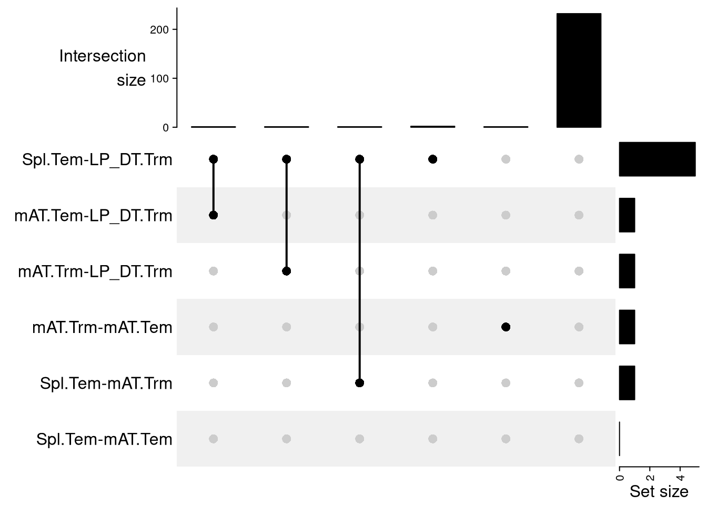

Only few pathways show singificant differences between all the samples (F statistics). Let's plot these in a Heatmap.


```r
significant_pathways <- rownames(topTable(fit, p.value = 0.05, number = Inf))

Heatmap(res_gsva[significant_pathways,],
        name="gsva score")
```

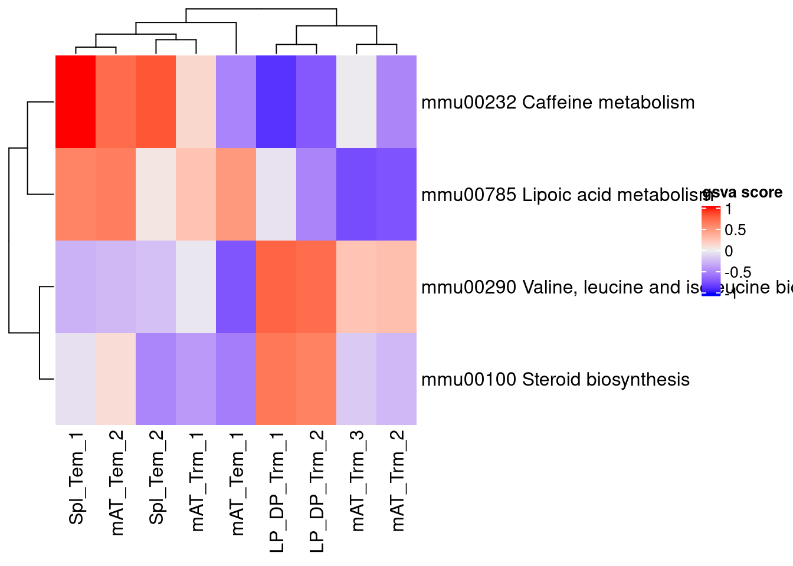


