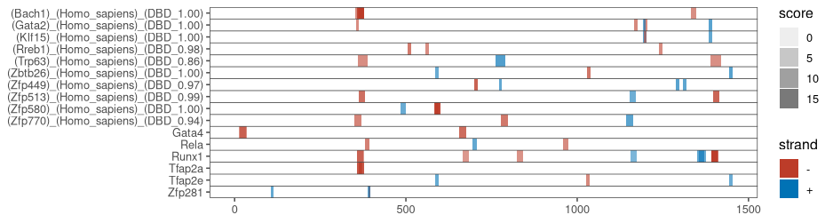

## Generate a table of binding sites

We start by generating a table with the predicted binding sites for TF. This can be done with either [FIMO](https://meme-suite.org/meme/tools/fimo) or Jaspar or any other tool that you like.

You should get a table that looks similar to this one: 

::: {style="overflow:scroll;"}

| tf                                 | start | stop | strand | score   | p-value     | q-value  | matched_sequence     |
|------------------------------------|-------|------|--------|---------|-------------|----------|----------------------|
| Zfp281                             | 363   | 377  | -      | 19.1091 | 0.000000138 | 0.000363 | CCCCTCTCCCACCCC      |
| (Rreb1)_(Homo_sapiens)_(DBD_0.98)  | 1391  | 1410 | -      | 17.8606 | 0.000000464 | 0.00119  | CCCCCAACTACCCTCACCCC |
| (Zfp513)_(Homo_sapiens)_(DBD_0.99) | 586   | 600  | -      | 17.5939 | 0.000000584 | 0.0016   | ACCATCCTTATCATC      |
| (Klf15)_(Homo_sapiens)_(DBD_1.00)  | 363   | 377  | -      | 16.3394 | 0.000000887 | 0.00235  | CCCCTCTCCCACCCC      |
| (Zfp513)_(Homo_sapiens)_(DBD_0.99) | 583   | 597  | -      | 16.703  | 0.00000113  | 0.0016   | ATCCTTATCATCATC      |
| (Nr5a1)_(Homo_sapiens)_(DBD_1.00)  | 1429  | 1439 | -      | 13.697  | 0.00000203  | 0.00565  | GCCAAGGTCAT          |
| (Zfp467)_(Homo_sapiens)_(DBD_0.95) | 365   | 376  | -      | 15.6182 | 0.00000208  | 0.0056   | CCCTCTCCCACC         |
| (Zfp770)_(Homo_sapiens)_(DBD_0.94) | 699   | 709  | -      | 14.897  | 0.00000275  | 0.0076   | CCCTAGCCTCC          |
| Esrra                              | 1429  | 1437 | -      | 12.1988 | 0.00000403  | 0.0114   | CAAGGTCAT            |

: Transcription factor binding predictions {#tbl-tf-pred}

:::

## Generate the plot

Using this table, we can create a plot showing where the TF motif is found within the peak/region. We can put that in a small helper function.

``` r
library(tidyverse)

#' plotTFSites
#' 
#' Plots the locations of TF within a peak/region
#'
#' @param data A dataframe with the following columns: 
#' - tf: name of the transcription factor
#' - start: starting position of the motifs
#' - stop: stop position of the motif
#' - strand: + or -
#' - score: A score that is used for the alpha value in the plot
#' @param start Starting position of the range that should be plotted. Default 0
#' @param end End position of the range. Default max(data$stop)
#'
#' @return A ggplot2 object
plotTFSites <- function(data, start = 0, end = max(data$stop)) {
  # Set the TF as a factor, this is important for plotting
  # you could also change the order of the TF in the plot
  # by changing the levels of the factor here
  data$tf <- as.factor(data$tf)
  # reverse the order of the levels so, so that they appear alphabetically later
  levels(data$tf) <- rev(levels(data$tf))
  
  # Time to plot
  ggplot(data = data) +
    # draw rectangles for the TF binding sites
    geom_rect(
      mapping = aes(
        xmin = start,
        xmax = stop,
        ymin = as.numeric(tf) - .5,
        ymax = as.numeric(tf) + .5,
        fill = strand,
        alpha = score
      )
    ) +
    # add a theme to the plot
    ggthemes::theme_few() +
    # don't expand the y scale, this way the boxes go right to the border of the plot
    # also use custom labels with the TF names
    scale_y_continuous(
      labels = levels(data$tf),
      breaks = seq_len(length(levels(data$tf))),
      expand = c(0, 0)
    ) +
    # set the limits of the x axis 
    # to include the full range of the peak
    scale_x_continuous(
      limits = c(start, end)
    ) + 
    # modify the transparency to a range from 0 to max(score)
    scale_alpha_continuous(limits = c(0, max(data$score))) +
    # use the color scheme from the NEJM
    paletteer::scale_fill_paletteer_d(palette = "ggsci::default_nejm") +
    # add horizontal lines between the TF, use the same color as for the border color of the plot
    geom_hline(yintercept = seq(1.5, length(levels(data$tf))),
               size = .3,
               color = '#4D4D4D')
}
```

### Example

And here's an example of how it could look like.

``` r
data <- read_tsv(file ="fimo.csv")

# we only want to keep tf that occur more than twice
tf_keep <- count(data, tf) %>%  filter(n >2) %>% pull(tf)
data <- data %>% 
  filter(tf %in% tf_keep)

plotTFSites(data)
```

{#fig-example}
