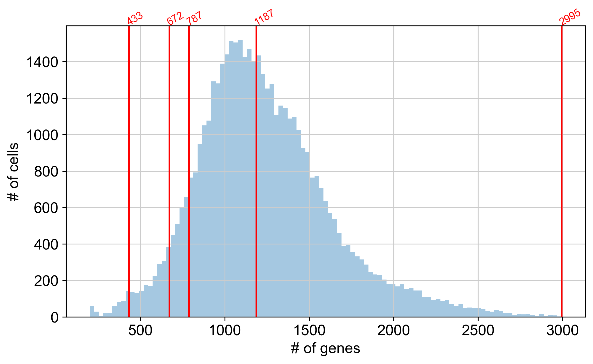

In this part, we will run the pySCENIC pipeline. This pipeline has three parts and especially the first part requires a lot of computational power. Although this could in theory be done on a personal computer, I recommend using the TSCC for that.

In addition to the `loom` file we created in the previous part, we need some additional files for the mouse genome and mouse transcription factors. These can be downloaded from the SCENIC website. We need the 

- mm_mgi_tfs.txt from [https://github.com/aertslab/pySCENIC/tree/master/resources](https://github.com/aertslab/pySCENIC/tree/master/resources) 
- mm10\_\_refseq-r80\_\_500bp_up_and_100bp_down_tss.mc9nr.feather 
- mm10\_\_refseq-r80\_\_10kb_up_and_down_tss.mc9nr.feather 
- motifs-v9-nr.mgi-m0.001-o0.0.tbl

The last three files can be found on [https://resources.aertslab.org/cistarget/](https://resources.aertslab.org/cistarget/)

## Run SCENIC

More details on the workflow can be found in this [publication](https://www.nature.com/articles/s41596-020-0336-2).

### Infer gene regulatory network

In the first step a gene regulatory network is created. This is the most computational intensive step. I did have some issues to get this working on the supercomputer (for some reasons that I did not understand the `dask` framework caused an error). But using a fallback option by running `arboreto_with_multiprocessing.py` work flawlessly. The downside of that is, that I cannot use multiple nodes (but it can use multiple cores).

Create a file called `pyscenic_grn.sh` with the following content. Make sure to adapt e-mail address and paths in the script for your needs. Make sure, that you have the conda environment created on the supercomputer too.

``` bash
#!/bin/bash
#PBS -q home-yeo
#PBS -N pyscenic_grn
#PBS -l nodes=1:ppn=16
#PBS -l walltime=30:00:00
#PBS -o pyscenic_grn.out
#PBS -e pyscenic_grn.err
#PBS -m abe
#PBS -M mheeg@ucsd.edu

echo "running"

# activate conda
source /home/mheeg/mambaforge/etc/profile.d/conda.sh
conda activate pyscenic

#navigate to project folder
cd /home/mheeg/scratch/pySCENIC

# this in the command that would use the dask framework.
# pyscenic grn 'pySCENIC_input.loom' 'mm_mgi_tfs.txt' -o adj.tsv --num_workers 16

# this is the command without dask
arboreto_with_multiprocessing.py \
    pySCENIC_input.loom \
    mm_mgi_tfs.txt \
    --method grnboost2 \
    --output adj.tsv \
    --num_workers 16 \
    --seed 777

# when this is done, we can automatially sumbit the next job
# but you can also do this manually
echo "submitting next job"
qsub pyscenic_ctx.sh

echo "done"
```

Finally, submit the job by running `qsub pyscenic_grn.sh`. For my dataset, this step took approximately 14 hours.

### Module generation and Motif enrichment and TF-regulon prediction

Again create a files called `pyscenic_ctx.sh`

``` bash
#!/bin/bash
#PBS -q home-yeo
#PBS -N pyscenic_ctx
#PBS -l nodes=1:ppn=16
#PBS -l walltime=12:00:00
#PBS -o pyscenic_ctx.out
#PBS -e pyscenic_ctx.err
#PBS -m abe
#PBS -M mheeg@ucsd.edu

echo "running"

# activate conda
source /home/mheeg/mambaforge/etc/profile.d/conda.sh
conda activate pyscenic

#navigate to project folder
cd /home/mheeg/scratch/pySCENIC

# --mode 'custom_multiprocessing` because I had issued with dask....
pyscenic ctx adj.tsv mm10__refseq-r80__10kb_up_and_down_tss.mc9nr.feather  mm10__refseq-r80__500bp_up_and_100bp_down_tss.mc9nr.feather --annotations_fname 'motifs-v9-nr.mgi-m0.001-o0.0.tbl' --expression_mtx_fname 'pySCENIC_input.loom'  --output 'motifs.csv'  --num_workers 16 --mode 'custom_multiprocessing'

# submit next job
echo "submitting next job"
qsub pyscenic_aucell.sh

echo "done"
```

Submit with `qsub pyscenic_ctx.sh` or automatically from the first step.

### Cellular enrichment (AUCell step)

Again, we create a bash script called `pyscenic_auc.sh`

``` bash
#!/bin/bash
#PBS -q home-yeo
#PBS -N pyscenic_aucell
#PBS -l nodes=1:ppn=16
#PBS -l walltime=8:00:00
#PBS -o pyscenic_aucell.out
#PBS -e pyscenic_aucell.err
#PBS -m abe
#PBS -M mheeg@ucsd.edu

echo "running"

# activate conda
source /home/mheeg/mambaforge/etc/profile.d/conda.sh
conda activate pyscenic

#navigate to project folder
cd /home/mheeg/scratch/pySCENIC

pyscenic aucell 'pySCENIC_input.loom'   'motifs.csv'    --output 'pySCENIC_output.loom'   --num_workers 16

echo "done"
```

Submit with `qsub pyscenic_auc.sh` or automatically from the second step.

## Integrate the output

We can now work on our computer again. Load the libraries and open the `anndata` file.

``` python
import anndata
from os import listdir
import pandas as pd
import scanpy as sc
import numpy as np
import matplotlib.pyplot as plt
import seaborn as sns
import pyscenic
import loompy as lp
import re

adata = sc.read_h5ad('pySCENIC/pyscenic.h5ad')
```

It is important to check that most cells have a substantial fraction of expressed/detected genes in the calculation of the AUC. The following histogram gives an idea of the distribution and allows selection of an appropriate threshold. In this plot, a few thresholds are highlighted, with the number of genes selected shown in red text and the corresponding percentile in parentheses). See the relevant section in the R tutorial for more information.

By using the default setting for --auc_threshold of 0.05, we see that 672 genes are selected for the rankings based on the plot below.

``` python
nGenesDetectedPerCell = adata.obs['n_genes']
percentiles = np.quantile(nGenesDetectedPerCell, [.01, .05, .10, .50, 1])
print(percentiles)
```

    [ 433.  672.  787. 1187. 2995.]

``` python
fig, ax = plt.subplots(1, 1, figsize=(8, 5), dpi=150)
sns.distplot(nGenesDetectedPerCell, norm_hist=False, kde=False, bins='fd')
for i,x in enumerate(percentiles):
    fig.gca().axvline(x=x, ymin=0,ymax=1, color='red')
    ax.text(x=x, y=ax.get_ylim()[1], s=f'{int(x)}', color='red', rotation=30, size='x-small',rotation_mode='anchor' )
ax.set_xlabel('# of genes')
ax.set_ylabel('# of cells')
fig.tight_layout()
```



## Visualization of SCENIC's AUC matrix

Next, load the relevant data from the `loom` file that was created in the script `pyscenic_auc.sh`. Then we calculate a UMAP and a TSNE from the AUC matrix (AUC values for each regulon for each cell)

``` python
import json
import zlib
import base64
import umap
from MulticoreTSNE import MulticoreTSNE as TSNE

# collect SCENIC AUCell output
lf = lp.connect( 'pySCENIC/pySCENIC_output.loom', mode='r+', validate=False )
auc_mtx = pd.DataFrame( lf.ca.RegulonsAUC, index=lf.ca.CellID)
lf.close()


# UMAP
runUmap = umap.UMAP(n_neighbors=10, min_dist=0.4, metric='correlation').fit_transform
dr_umap = runUmap( auc_mtx )
pd.DataFrame(dr_umap, columns=['X', 'Y'], index=auc_mtx.index).to_csv( "scenic_umap.txt", sep='\t')
# tSNE
tsne = TSNE( n_jobs=10 )
dr_tsne = tsne.fit_transform( auc_mtx )
pd.DataFrame(dr_tsne, columns=['X', 'Y'], index=auc_mtx.index).to_csv( "scenic_tsne.txt", sep='\t')
```

### Add the AUC results to the `anndata` object

Here, we combine the results from SCENIC and the Scanpy analysis into a SCope-compatible loom file

``` python
# scenic output
lf = lp.connect( 'pySCENIC_output.loom', mode='r+', validate=False )
meta = json.loads(zlib.decompress(base64.b64decode( lf.attrs.MetaData )))
#exprMat = pd.DataFrame( lf[:,:], index=lf.ra.Gene, columns=lf.ca.CellID)
auc_mtx = pd.DataFrame( lf.ca.RegulonsAUC, index=lf.ca.CellID)
regulons = lf.ra.Regulons
dr_umap = pd.read_csv( 'scenic_umap.txt', sep='\t', header=0, index_col=0 )
dr_tsne = pd.read_csv( 'scenic_tsne.txt', sep='\t', header=0, index_col=0 )
###
```

Fix regulon objects to display properly in SCope:

``` python
auc_mtx.columns = auc_mtx.columns.str.replace('\(','_(')
regulons.dtype.names = tuple( [ x.replace("(","_(") for x in regulons.dtype.names ] )

# regulon thresholds
rt = meta['regulonThresholds']
for i,x in enumerate(rt):
    tmp = x.get('regulon').replace("(","_(")
    x.update( {'regulon': tmp} )
```

Concatenate embeddings (tSNE, UMAP, etc.)

``` python
tsneDF = pd.DataFrame(adata.obsm['X_tsne'], columns=['_X', '_Y'])

Embeddings_X = pd.DataFrame( index=lf.ca.CellID )
Embeddings_X = pd.concat( [
        pd.DataFrame(adata.obsm['X_umap'],index=adata.obs.index)[0] ,
        pd.DataFrame(adata.obsm['X_pca'],index=adata.obs.index)[0] ,
        dr_tsne['X'] ,
        dr_umap['X']
    ], sort=False, axis=1, join='outer' )
Embeddings_X.columns = ['1','2','3','4']

Embeddings_Y = pd.DataFrame( index=lf.ca.CellID )
Embeddings_Y = pd.concat( [
        pd.DataFrame(adata.obsm['X_umap'],index=adata.obs.index)[1] ,
        pd.DataFrame(adata.obsm['X_pca'],index=adata.obs.index)[1] ,
        dr_tsne['Y'] ,
        dr_umap['Y']
    ], sort=False, axis=1, join='outer' )
Embeddings_Y.columns = ['1','2','3','4']
```

Create the Metadata for the loom file

``` python
metaJson = {}

metaJson['embeddings'] = [
    {
        "id": -1,
        "name": f"Scanpy t-SNE (highly variable genes)"
    },
    {
        "id": 1,
        "name": f"Scanpy UMAP  (highly variable genes)"
    },
    {
        "id": 2,
        "name": "Scanpy PC1/PC2"
    },
    {
        "id": 3,
        "name": "SCENIC AUC t-SNE"
    },
    {
        "id": 4,
        "name": "SCENIC AUC UMAP"
    },
]

metaJson["clusterings"] = [{
            "id": 0,
            "group": "Scanpy",
            "name": "Scanpy leiden default resolution",
            "clusters": [],
        }]

metaJson["metrics"] = [
        {
            "name": "nUMI"
        }, {
            "name": "nGene"
        }, {
            "name": "Percent_mito"
        }
]

metaJson["annotations"] = [
    {
        "name": "Leiden_clusters_Scanpy",
        "values": list(set( adata.obs['leiden'].astype(np.str) ))
    },
    {
       "name": "Tissue",
       "values": list(set(adata.obs['tissue'].values))
    },
    {
       "name": "Dataset",
       "values": list(set(adata.obs['dataset'].values))
    },
]

# SCENIC regulon thresholds:
metaJson["regulonThresholds"] = rt

for i in range(max(set([int(x) for x in adata.obs['leiden']])) + 1):
    clustDict = {}
    clustDict['id'] = i
    clustDict['description'] = f'Unannotated Cluster {i + 1}'
    metaJson['clusterings'][0]['clusters'].append(clustDict)
    
clusterings = pd.DataFrame()
clusterings["0"] = adata.obs['leiden'].values.astype(np.int64)
```

Assemble loom file row and column attributes

``` python
def dfToNamedMatrix(df):
    arr_ip = [tuple(i) for i in df.values]
    dtyp = np.dtype(list(zip(df.dtypes.index, df.dtypes)))
    arr = np.array(arr_ip, dtype=dtyp)
    return arr

col_attrs = {
    "CellID": np.array(adata.obs.index),
    "nUMI": np.array(adata.obs['total_counts'].values),
    "nGene": np.array(adata.obs['n_genes'].values),
    "Leiden_clusters_Scanpy": np.array( adata.obs['leiden'].values ),
    "Tissue": np.array(adata.obs['tissue'].values),
    "Dataset": np.array(adata.obs['dataset'].values),
    "Percent_mito": np.array(adata.obs['pct_counts_mt'].values),
    "Embedding": dfToNamedMatrix(tsneDF),
    "Embeddings_X": dfToNamedMatrix(Embeddings_X),
    "Embeddings_Y": dfToNamedMatrix(Embeddings_Y),
    "RegulonsAUC": dfToNamedMatrix(auc_mtx),
    "Clusterings": dfToNamedMatrix(clusterings),
    "ClusterID": np.array(adata.obs['leiden'].values)
}

row_attrs = {
    "Gene": lf.ra.Gene,
    "Regulons": regulons,
}

attrs = {
    "title": "sampleTitle",
    "MetaData": json.dumps(metaJson),
    "Genome": 'mm10',
    "SCopeTreeL1": "",
    "SCopeTreeL2": "",
    "SCopeTreeL3": ""
}

# compress the metadata field:
attrs['MetaData'] = base64.b64encode(zlib.compress(json.dumps(metaJson).encode('ascii'))).decode('ascii')
```

Create a final `loom` file that can be inpsected in: [SCOPE](https://scope.aertslab.org)

``` python
lp.create(
    filename = 'pySCENIC_final.loom' ,
    layers=lf[:,:],
    row_attrs=row_attrs, 
    col_attrs=col_attrs, 
    file_attrs=attrs
)
lf.close() # close original pyscenic loom file
```
