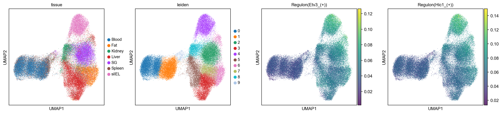
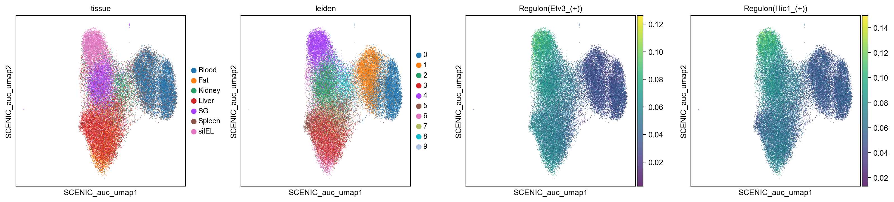
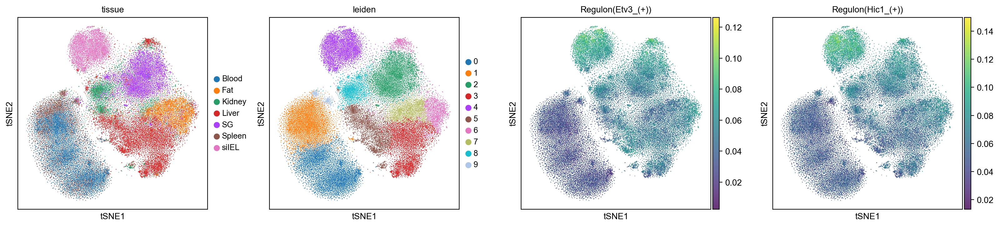
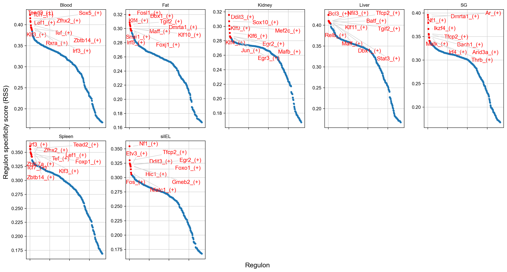
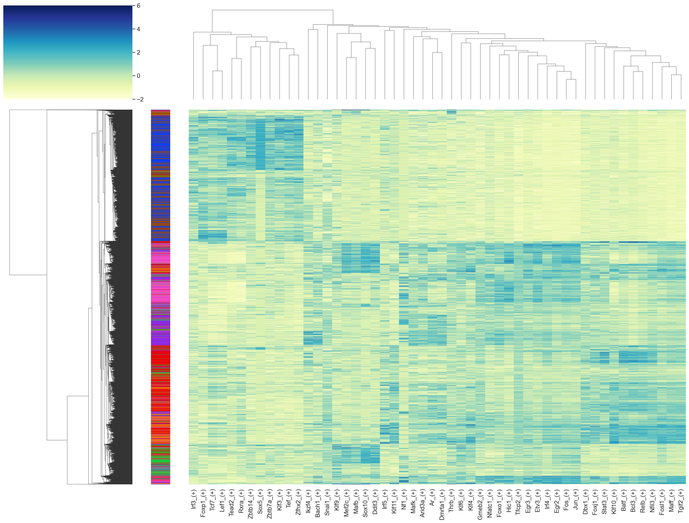
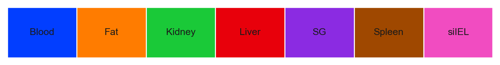

See also the official [notebook](http://htmlpreview.github.io/?https://github.com/aertslab/SCENICprotocol/blob/master/notebooks/PBMC10k_downstream-analysis.html). Again this can be done in a jupyer notebook or in visual studio code.

Load the libraries.

``` python
import os
import numpy as np
import pandas as pd
import scanpy as sc
import loompy as lp
from MulticoreTSNE import MulticoreTSNE as TSNE
import json
import base64
import zlib
from pyscenic.plotting import plot_binarization
from pyscenic.export import add_scenic_metadata
from pyscenic.cli.utils import load_signatures
import matplotlib as mpl
import matplotlib.pyplot as plt
import seaborn as sns

f_final_loom = 'pySCENIC_final.loom'

sc.settings.verbosity = 3 # verbosity: errors (0), warnings (1), info (2), hints (3)
sc.logging.print_header()
sc.settings.set_figure_params(dpi=150)
```

    scanpy==1.8.2 anndata==0.7.8 umap==0.5.2 numpy==1.21.5 scipy==1.7.3 pandas==1.3.5 scikit-learn==1.0.2 statsmodels==0.13.2 python-igraph==0.9.9 pynndescent==0.5.6

## Extract relevant data from the integrated loom file

``` python
# scenic output
lf = lp.connect( f_final_loom, mode='r', validate=False )
meta = json.loads(zlib.decompress(base64.b64decode( lf.attrs.MetaData )))
exprMat = pd.DataFrame( lf[:,:], index=lf.ra.Gene, columns=lf.ca.CellID).T
auc_mtx = pd.DataFrame( lf.ca.RegulonsAUC, index=lf.ca.CellID)
```

``` python
# create a dictionary of regulons:
regulons = {}
for i,r in pd.DataFrame(lf.ra.Regulons,index=lf.ra.Gene).iteritems():
    regulons[i] =  list(r[r==1].index.values)
```

``` python
# cell annotations from the loom column attributes:
cellAnnot = pd.concat(
    [
        pd.DataFrame( lf.ca.Tissue, index=lf.ca.CellID ),
        pd.DataFrame( lf.ca.Dataset, index=lf.ca.CellID ),
        pd.DataFrame( lf.ca.Leiden_clusters_Scanpy, index=lf.ca.CellID ),
        pd.DataFrame( lf.ca.Percent_mito, index=lf.ca.CellID ),
        pd.DataFrame( lf.ca.nGene, index=lf.ca.CellID ),
        pd.DataFrame( lf.ca.nUMI, index=lf.ca.CellID ),
    ],
    axis=1
)
cellAnnot.columns = [
 'Tissue',
 'Dataset',
 'Leiden_clusters_Scanpy',
 'Percent_mito',
 'nGene',
 'nUMI']

cellAnnot
```

::: {style="overflow: scroll;"}
|                       | Tissue | Dataset | Leiden_clusters_Scanpy | Percent_mito | nGene |   nUMI |
|----------:|----------:|----------:|----------:|----------:|----------:|----------:|
|  AAAGGTAGTAACCCTA-1-0 | Spleen |      ty |                      1 |     7.444040 |   942 | 1921.0 |
|  AAGGAATGTACCGTGC-1-0 | Spleen |      ty |                      1 |     9.393818 |  1001 | 2491.0 |
|  ACATGCACAAATGCGG-1-0 | Spleen |      ty |                      1 |     6.955017 |  1136 | 2890.0 |
|  ACCTGTCTCGAATCCA-1-0 | Spleen |      ty |                      1 |    10.536460 |  1220 | 3113.0 |
|  ACGTTCCGTCGGATTT-1-0 | Spleen |      ty |                      1 |     8.917197 |  1053 | 2198.0 |
|                   ... |    ... |     ... |                    ... |          ... |   ... |    ... |
| TTTCGATGTGTAAACA-1-22 |  siIEL |      ty |                      4 |     5.277614 |  1921 | 5097.0 |
| TTTGACTAGGCGAACT-1-22 |  siIEL |      ty |                      4 |     3.714430 |  2546 | 7942.0 |
| TTTGACTAGTATCTGC-1-22 |  siIEL |      ty |                      4 |     3.994145 |  2011 | 4782.0 |
| TTTGGAGGTATAGGGC-1-22 |  siIEL |      ty |                      4 |     4.676259 |  1765 | 4726.0 |
| TTTGGTTTCTCAACCC-1-22 |  siIEL |      ty |                      4 |     5.299395 |  1871 | 4793.0 |

: Cell Annotation {#tbl-cell-annotation}
:::

``` python
# capture embeddings:
dr = [
    pd.DataFrame( lf.ca.Embedding, index=lf.ca.CellID )
]
dr_names = [
    meta['embeddings'][0]['name'].replace(" ","_")
]

# add other embeddings
drx = pd.DataFrame( lf.ca.Embeddings_X, index=lf.ca.CellID )
dry = pd.DataFrame( lf.ca.Embeddings_Y, index=lf.ca.CellID )

for i in range( len(drx.columns) ):
    dr.append( pd.concat( [ drx.iloc[:,i], dry.iloc[:,i] ], sort=False, axis=1, join='outer' ))
    dr_names.append( meta['embeddings'][i+1]['name'].replace(" ","_").replace('/','-') )

# rename columns:
for i,x in enumerate( dr ):
    x.columns = ['X','Y']

dr
```

    [                               X          Y
     AAAGGTAGTAACCCTA-1-0  -44.256683  -9.668363
     AAGGAATGTACCGTGC-1-0  -33.491440  -3.297726
     ACATGCACAAATGCGG-1-0  -33.907196  -4.941042
     ACCTGTCTCGAATCCA-1-0  -44.095432 -19.017708
     ACGTTCCGTCGGATTT-1-0  -40.111629   1.809371
     ...                          ...        ...
     TTTCGATGTGTAAACA-1-22 -16.264544  61.427082
     TTTGACTAGGCGAACT-1-22  -3.069563  59.597412
     TTTGACTAGTATCTGC-1-22 -19.453512  62.868225
     TTTGGAGGTATAGGGC-1-22 -11.554585  56.908619
     TTTGGTTTCTCAACCC-1-22 -13.888440  60.807884
     
     [47399 rows x 2 columns],
                                    X         Y
     AAAGGTAGTAACCCTA-1-0    4.267516 -0.358908
     AAGGAATGTACCGTGC-1-0    4.009174  1.997062
     ACATGCACAAATGCGG-1-0    4.355668  2.242534
     ACCTGTCTCGAATCCA-1-0    3.466083  0.814867
     ACGTTCCGTCGGATTT-1-0    4.428813  1.851918
     ...                          ...       ...
     TTTCGATGTGTAAACA-1-22  12.109454  7.827275
     TTTGACTAGGCGAACT-1-22  12.481410  6.887196
     TTTGACTAGTATCTGC-1-22  12.032427  8.997864
     TTTGGAGGTATAGGGC-1-22  12.500347  7.756375
     TTTGGTTTCTCAACCC-1-22  12.351318  8.031884
     
     [47399 rows x 2 columns],
                                   X         Y
     AAAGGTAGTAACCCTA-1-0  -5.316865  0.031803
     AAGGAATGTACCGTGC-1-0  -5.771563  0.948205
     ACATGCACAAATGCGG-1-0  -5.050992  0.660940
     ACCTGTCTCGAATCCA-1-0  -5.682570  1.005959
     ACGTTCCGTCGGATTT-1-0  -4.961972  1.614491
     ...                         ...       ...
     TTTCGATGTGTAAACA-1-22  6.782731  5.370419
     TTTGACTAGGCGAACT-1-22  5.805494  3.747248
     TTTGACTAGTATCTGC-1-22  7.218953  4.793280
     TTTGGAGGTATAGGGC-1-22  6.280628  2.557807
     TTTGGTTTCTCAACCC-1-22  6.497605  5.259722
     
     [47399 rows x 2 columns],
                                    X          Y
     AAAGGTAGTAACCCTA-1-0   -7.505530  12.712798
     AAGGAATGTACCGTGC-1-0  -10.337648   6.583519
     ACATGCACAAATGCGG-1-0   -5.800608   4.764103
     ACCTGTCTCGAATCCA-1-0  -12.050342  14.171928
     ACGTTCCGTCGGATTT-1-0   -9.325992  10.604991
     ...                          ...        ...
     TTTCGATGTGTAAACA-1-22  -5.050969 -18.308673
     TTTGACTAGGCGAACT-1-22  -3.528611 -19.236477
     TTTGACTAGTATCTGC-1-22  -7.534005 -16.889703
     TTTGGAGGTATAGGGC-1-22  -4.523451 -16.261502
     TTTGGTTTCTCAACCC-1-22  -4.778773 -18.822832
     
     [47399 rows x 2 columns],
                                    X         Y
     AAAGGTAGTAACCCTA-1-0   13.101749  4.386499
     AAGGAATGTACCGTGC-1-0   12.668396  6.909234
     ACATGCACAAATGCGG-1-0   12.186983  4.602508
     ACCTGTCTCGAATCCA-1-0   14.040202  6.695107
     ACGTTCCGTCGGATTT-1-0   13.238804  5.382064
     ...                          ...       ...
     TTTCGATGTGTAAACA-1-22   5.854157  7.325392
     TTTGACTAGGCGAACT-1-22   4.681789  5.274339
     TTTGACTAGTATCTGC-1-22   5.274803  7.125849
     TTTGGAGGTATAGGGC-1-22   6.677212  6.647086
     TTTGGTTTCTCAACCC-1-22   7.380332  7.604433
     
     [47399 rows x 2 columns]]

``` python
lf.close()
```

## Alternately, we can load this data into a scanpy.AnnData object

``` python
adata = sc.read_h5ad('pyscenic.h5ad')
adata
```

    AnnData object with n_obs × n_vars = 47399 × 16402
        obs: 'batch', 'sample', 'tissue', 'dataset', 'n_genes', 'n_genes_by_counts', 'total_counts', 'total_counts_mt', 'pct_counts_mt', 'leiden'
        var: 'gene_ids', 'feature_types', 'n_cells', 'mt', 'n_cells_by_counts', 'mean_counts', 'pct_dropout_by_counts', 'total_counts', 'highly_variable', 'means', 'dispersions', 'dispersions_norm'
        uns: 'dataset_colors', 'hvg', 'leiden', 'leiden_colors', 'neighbors', 'pca', 'tissue_colors', 'tsne', 'umap'
        obsm: 'X_pca', 'X_tsne', 'X_umap'
        varm: 'PCs'
        layers: 'counts', 'logcounts'
        obsp: 'connectivities', 'distances'

``` python
sig = load_signatures('pySCENIC/motifs.csv')
adata = add_scenic_metadata(adata, auc_mtx, sig)
```

    Create regulons from a dataframe of enriched features.
    Additional columns saved: []

``` python
# Add dimrensional reduction
dr_umap = pd.read_csv( 'scenic_umap.txt', sep='\t', header=0, index_col=0 )
dr_tsne = pd.read_csv( 'scenic_tsne.txt', sep='\t', header=0, index_col=0 )

adata.obsm['X_SCENIC_auc_tnse'] = dr_tsne
adata.obsm['X_SCENIC_auc_umap'] = dr_umap
```

## Display a motifs table with motif logos

``` python
# helper functions (not yet integrated into pySCENIC):

from pyscenic.utils import load_motifs
import operator as op
from IPython.display import HTML, display

BASE_URL = "http://motifcollections.aertslab.org/v9/logos/"
COLUMN_NAME_LOGO = "MotifLogo"
COLUMN_NAME_MOTIF_ID = "MotifID"
COLUMN_NAME_TARGETS = "TargetGenes"

def display_logos(df: pd.DataFrame, top_target_genes: int = 3, base_url: str = BASE_URL):
    """
    :param df:
    :param base_url:
    """
    # Make sure the original dataframe is not altered.
    df = df.copy()
    
    # Add column with URLs to sequence logo.
    def create_url(motif_id):
        return '</img>'.format(base_url, motif_id)
    df[("Enrichment", COLUMN_NAME_LOGO)] = list(map(create_url, df.index.get_level_values(COLUMN_NAME_MOTIF_ID)))
    
    # Truncate TargetGenes.
    def truncate(col_val):
        return sorted(col_val, key=op.itemgetter(1))[:top_target_genes]
    df[("Enrichment", COLUMN_NAME_TARGETS)] = list(map(truncate, df[("Enrichment", COLUMN_NAME_TARGETS)]))
    
    MAX_COL_WIDTH = pd.get_option('display.max_colwidth')
    pd.set_option('display.max_colwidth', 200)
    display(HTML(df.head().to_html(escape=False)))
    pd.set_option('display.max_colwidth', MAX_COL_WIDTH)
```

``` python
df_motifs = load_motifs('pySCENIC/motifs.csv')
```

``` python
selected_motifs = ['Hic1','Klf2','Etv3']
df_motifs_sel = df_motifs.iloc[ [ True if x in selected_motifs else False for x in df_motifs.index.get_level_values('TF') ] ,:]
```

``` python
display_logos( df_motifs_sel.sort_values([('Enrichment','NES')], ascending=False))
```

::: {style="overflow: scroll;"}
|      |                      |     AUC    |    NES   | MotifSimilarityQvalue | OrthologousIdentity |                                                                                                     Annotation                                                                                                    |                                   Context                                  |                                          TargetGenes                                         | RankAtMax | MotifLogo |
|:----:|:--------------------:|:----------:|:--------:|:---------------------:|:-------------------:|:-----------------------------------------------------------------------------------------------------------------------------------------------------------------------------------------------------------------:|:--------------------------------------------------------------------------:|:--------------------------------------------------------------------------------------------:|:---------:|:---------:|
|  TF  |        MotifID       |            |          |                       |                     |                                                                                                                                                                                                                   |                                                                            |                                                                                              |           |           |
| Klf2 |     cisbp__M6324     | 0.180405   | 6.066523 | 0.000069              | 1.000000            | motif similar to transfac_pro__M07461 ('V\$KLF_Q3: KLF'; q-value = 6.87e-05) which is directly annotated                                                                                                           | (top50, activating, mm10__refseq-r80__10kb_up_and_down_tss.mc9nr)          | [(Plec, 66.31599391721404), (Stk38, 70.33390472195971), (S1pr4, 74.2406393033667)]           | 515       | </img>         |
|      |     cisbp__M6127     | 0.172812   | 5.738987 | 0.000216              | 1.000000            | motif similar to transfac_pro__M07461 ('V\$KLF_Q3: KLF'; q-value = 0.000216) which is directly annotated                                                                                                           | (top50, activating, mm10__refseq-r80__10kb_up_and_down_tss.mc9nr)          | [(Plec, 66.31599391721404), (Stk38, 70.33390472195971), (Tagln2, 75.9309836560863)]          | 596       | </img>         |
|      | transfac_pro__M07460 | 0.159789   | 5.177195 | 0.000121              | 1.000000            | motif similar to transfac_pro__M07461 ('V\$KLF_Q3: KLF'; q-value = 0.000121) which is directly annotated                                                                                                           | (top50, activating, mm10__refseq-r80__10kb_up_and_down_tss.mc9nr)          | [(1700025G04Rik, 64.56604911159242), (Plec, 66.31599391721404), (Gramd4, 66.81849347848782)] | 2763      | </img>         |
| Etv3 | transfac_pro__M07282 | 0.111136   | 4.792040 | 0.000675              | 0.861598            | gene is orthologous to ENSG00000117036 in H. sapiens (identity  = 86%) which is annotated for similar motif  taipale_cyt_meth__ETV3_NNAGGAANNNNNNNTTCCTNN_eDBD_meth ('ETV3 [ETS,  CpG-meth]'; q-value = 0.000675) | (mm10__refseq-r80__10kb_up_and_down_tss.mc9nr, activating, top10perTarget) | [(Etv3, 1.0), (Setbp1, 2.852092901183992), (Mob3c, 3.413525399790094)]                       | 270       | </img>         |
| Klf2 |     cisbp__M2391     | 0.148376   | 4.684838 | 0.000119              | 1.000000            | motif similar to transfac_pro__M07461 ('V\$KLF_Q3: KLF'; q-value = 0.000119) which is directly annotated                                                                                                           | (top50, activating, mm10__refseq-r80__10kb_up_and_down_tss.mc9nr)          | [(1700025G04Rik, 64.56604911159242), (Plec, 66.31599391721404), (Stk38, 70.33390472195971)]  | 1112      | </img> 

: Motifs table with motif logos {#tbl-motifs}

:::

## Dimensionality reduction plots

``` python
sc.set_figure_params(frameon=True, dpi=100, fontsize=10, dpi_save=600, facecolor='white')

sc.pl.embedding( adata, basis='umap', 
    color=['tissue', 'leiden', 'Regulon(Etv3_(+))', 'Regulon(Hic1_(+))'],
    alpha=0.8
    )

sc.pl.embedding( adata, basis='SCENIC_auc_umap', 
    color=['tissue', 'leiden', 'Regulon(Etv3_(+))', 'Regulon(Hic1_(+))'],
    alpha=0.8
    )

sc.pl.embedding( adata, basis='tsne', 
    color=['tissue', 'leiden', 'Regulon(Etv3_(+))', 'Regulon(Hic1_(+))'],
    alpha=0.8
    )
```

::: {#fig-umap-regulon layout-ncol="1"}
{#fig-umap-regulon-1}

{#fig-umap-regulon-2}

{#fig-umap-regulon-3}

UMAP and TSNEs colord by regulon activity
:::

## Regulon specificity scores (RSS) across predicted cell types

``` python
from pyscenic.rss import regulon_specificity_scores
from pyscenic.plotting import plot_rss
import matplotlib.pyplot as plt
from adjustText import adjust_text
import seaborn as sns
from pyscenic.binarization import binarize
```

### Calculate RSS

``` python
rss_cellType = regulon_specificity_scores( auc_mtx, cellAnnot['Tissue'] )
rss_cellType
```

::: {style="overflow: scroll;"}
|        |  Ar\_(+) | Arid3a\_(+) | Arnt\_(+) | Atf1\_(+) | Atf2\_(+) | Atf3\_(+) | Atf4\_(+) | Atf6\_(+) | Bach1\_(+) | Bach2\_(+) | ... | Zfp595\_(+) | Zfp597\_(+) | Zfp697\_(+) | Zfp729a\_(+) | Zfp729b\_(+) | Zfp740\_(+) | Zfp950\_(+) | Zfx\_(+) | Zmiz1\_(+) | Zscan26\_(+) |
|---:|---:|---:|---:|---:|---:|---:|---:|---:|---:|---:|---:|---:|---:|---:|---:|---:|---:|---:|---:|---:|---:|
| Spleen | 0.232280 |    0.273306 |  0.278422 |  0.308866 |  0.294680 |  0.264102 |  0.297217 |  0.314747 |   0.272364 |   0.319069 | ... |    0.328458 |    0.315514 |    0.259725 |     0.309563 |     0.329232 |    0.314901 |    0.336295 | 0.314717 |   0.327139 |     0.284513 |
|     SG | 0.391551 |    0.348651 |  0.305377 |  0.317457 |  0.317565 |  0.326440 |  0.321046 |  0.306075 |   0.354013 |   0.292556 | ... |    0.301613 |    0.308412 |    0.210021 |     0.282744 |     0.310660 |    0.318654 |    0.302439 | 0.287605 |   0.304893 |     0.230063 |
|    Fat | 0.291867 |    0.271865 |  0.256028 |  0.265920 |  0.271507 |  0.297004 |  0.272466 |  0.269912 |   0.254001 |   0.266343 | ... |    0.250664 |    0.266730 |    0.198462 |     0.230732 |     0.254275 |    0.253300 |    0.246143 | 0.238127 |   0.259192 |     0.220235 |
|  Liver | 0.344804 |    0.342607 |  0.335567 |  0.362833 |  0.339648 |  0.389853 |  0.366652 |  0.362712 |   0.323196 |   0.381668 | ... |    0.340810 |    0.347843 |    0.261404 |     0.285314 |     0.337824 |    0.330925 |    0.335338 | 0.324400 |   0.351803 |     0.225780 |
|  Blood | 0.251463 |    0.289112 |  0.312196 |  0.335547 |  0.317125 |  0.282955 |  0.320095 |  0.346146 |   0.289398 |   0.340837 | ... |    0.352879 |    0.347346 |    0.225315 |     0.334475 |     0.361861 |    0.337154 |    0.362620 | 0.339570 |   0.365139 |     0.293112 |
| Kidney | 0.253650 |    0.270133 |  0.270303 |  0.273987 |  0.268736 |  0.278792 |  0.278251 |  0.270327 |   0.260637 |   0.261795 | ... |    0.273918 |    0.274490 |    0.232872 |     0.270643 |     0.273070 |    0.271859 |    0.275161 | 0.265928 |   0.270121 |     0.229809 |
|  siIEL | 0.243424 |    0.301847 |  0.260098 |  0.282439 |  0.302509 |  0.295051 |  0.296714 |  0.265307 |   0.282399 |   0.265112 | ... |    0.282115 |    0.273094 |    0.216590 |     0.273726 |     0.262292 |    0.294644 |    0.282063 | 0.287218 |   0.266651 |     0.227413 |

: RSS scores {#tbl-rss}

7 rows × 366 columns
:::

``` python
rss_cellType.to_csv('pySCENIC/Regulon_specificity_scores.csv')
```

### RSS panel plot with all cell types

``` python
cats = sorted(list(set(cellAnnot['Tissue'])))

fig = plt.figure(figsize=(15, 8))
for c,num in zip(cats, range(1,len(cats)+1)):
    x=rss_cellType.T[c]
    ax = fig.add_subplot(2,5,num)
    plot_rss(rss_cellType, c, top_n=10, max_n=None, ax=ax)
    ax.set_ylim( x.min()-(x.max()-x.min())*0.05 , x.max()+(x.max()-x.min())*0.05 )
    for t in ax.texts:
        t.set_fontsize(12)
    ax.set_ylabel('')
    ax.set_xlabel('')
    adjust_text(ax.texts, autoalign='xy', ha='right', va='bottom', arrowprops=dict(arrowstyle='-',color='lightgrey'), precision=0.001 )
 
fig.text(0.5, 0.0, 'Regulon', ha='center', va='center', size='x-large')
fig.text(0.00, 0.5, 'Regulon specificity score (RSS)', ha='center', va='center', rotation='vertical', size='x-large')
plt.tight_layout()
plt.rcParams.update({
    'figure.autolayout': True,
        'figure.titlesize': 'large' ,
        'axes.labelsize': 'medium',
        'axes.titlesize':'large',
        'xtick.labelsize':'medium',
        'ytick.labelsize':'medium'
        })
plt.savefig("figures/pySCENIC_cellType-RSS-top10.pdf", dpi=600, bbox_inches = "tight")
plt.show()
```

{#fig-rss}

### Heatmap with top RSS

Select the top 10 regulons from each cell type

``` python
topreg = []
for i,c in enumerate(cats):
    topreg.extend(
        list(rss_cellType.T[c].sort_values(ascending=False)[:10].index)
    )
topreg = list(set(topreg))
```

Generate a Z-score for each regulon to enable comparison between regulons

``` python
auc_mtx_Z = pd.DataFrame( index=auc_mtx.index )
for col in list(auc_mtx.columns):
    auc_mtx_Z[ col ] = ( auc_mtx[col] - auc_mtx[col].mean()) / auc_mtx[col].std(ddof=0)
```

Generate a heatmap

``` python
def palplot(pal, names, colors=None, size=1):
    n = len(pal)
    f, ax = plt.subplots(1, 1, figsize=(n * size, size))
    ax.imshow(np.arange(n).reshape(1, n),
              cmap=mpl.colors.ListedColormap(list(pal)),
              interpolation="nearest", aspect="auto")
    ax.set_xticks(np.arange(n) - .5)
    ax.set_yticks([-.5, .5])
    ax.set_xticklabels([])
    ax.set_yticklabels([])
    colors = n * ['k'] if colors is None else colors
    for idx, (name, color) in enumerate(zip(names, colors)):
        ax.text(0.0+idx, 0.0, name, color=color, horizontalalignment='center', verticalalignment='center')
    return f
```

``` python
colors = sns.color_palette('bright',n_colors=len(cats) )
colorsd = dict( zip( cats, colors ))
colormap = [ colorsd[x] for x in cellAnnot['Tissue'] ]
```

``` python
sns.set()
sns.set(font_scale=0.8)
fig = palplot( colors, cats, size=1.0)
plt.savefig("figures/pySCENIC_cellType-heatmap-legend-top10.pdf", dpi=600, bbox_inches = "tight")


sns.set(font_scale=1.2)
g = sns.clustermap(auc_mtx_Z[topreg], annot=False,  square=False,  linecolor='gray',
    yticklabels=False, xticklabels=True, vmin=-2, vmax=6, row_colors=colormap,
    cmap="YlGnBu", figsize=(21,16) )
g.cax.set_visible(True)
g.ax_heatmap.set_ylabel('')
g.ax_heatmap.set_xlabel('')
plt.savefig("figures/pySCENIC_cellType-heatmap-top10.png", dpi=600, bbox_inches = "tight")
```

::: {#fig-heatmap}
{#fig-heatmap-2}

{#fig-heatmap-1}

Heatmap
:::

## Generate a binary regulon activity matrix:

``` python
binary_mtx, auc_thresholds = binarize( auc_mtx, num_workers=12 )
binary_mtx.head()
```

::: {style="overflow: scroll;"}
|                      | Ar\_(+) | Arid3a\_(+) | Arnt\_(+) | Atf1\_(+) | Atf2\_(+) | Atf3\_(+) | Atf4\_(+) | Atf6\_(+) | Bach1\_(+) | Bach2\_(+) | ... | Zfp595\_(+) | Zfp597\_(+) | Zfp697\_(+) | Zfp729a\_(+) | Zfp729b\_(+) | Zfp740\_(+) | Zfp950\_(+) | Zfx\_(+) | Zmiz1\_(+) | Zscan26\_(+) |
|---:|---:|---:|---:|---:|---:|---:|---:|---:|---:|---:|---:|---:|---:|---:|---:|---:|---:|---:|---:|---:|---:|
| AAAGGTAGTAACCCTA-1-0 |       0 |           0 |         1 |         0 |         0 |         0 |         0 |         0 |          0 |          0 | ... |           0 |           0 |           0 |            0 |            0 |           0 |           0 |        0 |          0 |            0 |
| AAGGAATGTACCGTGC-1-0 |       0 |           1 |         0 |         0 |         0 |         0 |         0 |         0 |          0 |          0 | ... |           0 |           0 |           0 |            1 |            0 |           0 |           0 |        0 |          0 |            1 |
| ACATGCACAAATGCGG-1-0 |       0 |           0 |         1 |         0 |         0 |         0 |         0 |         0 |          0 |          0 | ... |           0 |           0 |           0 |            0 |            0 |           0 |           0 |        0 |          0 |            0 |
| ACCTGTCTCGAATCCA-1-0 |       0 |           0 |         1 |         0 |         0 |         0 |         0 |         0 |          0 |          0 | ... |           0 |           0 |           0 |            0 |            0 |           0 |           0 |        1 |          0 |            1 |
| ACGTTCCGTCGGATTT-1-0 |       1 |           0 |         1 |         0 |         0 |         0 |         0 |         0 |          0 |          0 | ... |           0 |           0 |           0 |            1 |            0 |           0 |           0 |        0 |          0 |            0 |

: Binary regulon activity {#tbl-binary}
:::

## Further exploration of modules directly from the network inference output

``` python
adjacencies = pd.read_csv("pySCENIC/adj.tsv", index_col=False, sep='\t')
```

Create the modules

``` python
from pyscenic.utils import modules_from_adjacencies
modules = list(modules_from_adjacencies(adjacencies, exprMat))
```

    2022-03-03 09:01:26,897 - pyscenic.utils - INFO - Calculating Pearson correlations.

    2022-03-03 09:01:27,327 - pyscenic.utils - WARNING - Note on correlation calculation: the default behaviour for calculating the correlations has changed after pySCENIC verion 0.9.16. Previously, the default was to calculate the correlation between a TF and target gene using only cells with non-zero expression values (mask_dropouts=True). The current default is now to use all cells to match the behavior of the R verision of SCENIC. The original settings can be retained by setting 'rho_mask_dropouts=True' in the modules_from_adjacencies function, or '--mask_dropouts' from the CLI.
        Dropout masking is currently set to [False].

    2022-03-03 09:03:19,216 - pyscenic.utils - INFO - Creating modules.

Pick a module

``` python
tf = 'Etv3'
tf_mods = [ x for x in modules if x.transcription_factor==tf ]

for i,mod in enumerate( tf_mods ):
    print( f'{tf} module {str(i)}: {len(mod.genes)} genes' )
print( f'{tf} regulon: {len(regulons[tf+"_(+)"])} genes' )
```

    Etv3 module 0: 1071 genes
    Etv3 module 1: 484 genes
    Etv3 module 2: 51 genes
    Etv3 module 3: 25 genes
    Etv3 module 4: 72 genes
    Etv3 module 5: 690 genes
    Etv3 regulon: 235 genes

``` python
for i,mod in enumerate( tf_mods ):
    with open( 'module/'+tf+'_module_'+str(i)+'.txt', 'w') as f:
        for item in mod.genes:
            f.write("%s\n" % item)
            
with open( 'regulons/'+tf+'_regulon.txt', 'w') as f:
    for item in regulons[tf+'_(+)']:
        f.write("%s\n" % item)
```

### Save some files

I used those to create a few more plots in R.

``` python
adata.obs.to_csv('coldata.csv')
auc_mtx.to_csv('aucell.csv')
binary_mtx.to_csv('binary.csv')
```
