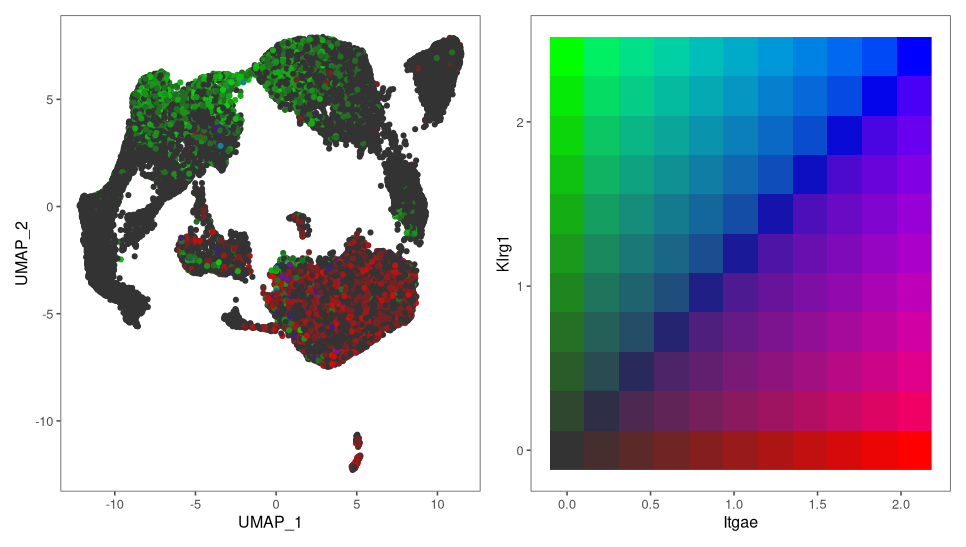
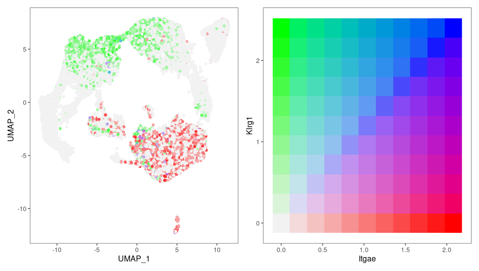
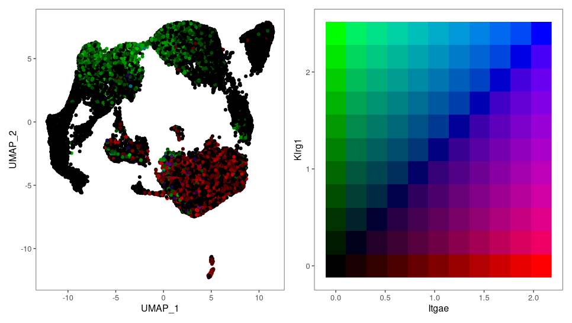
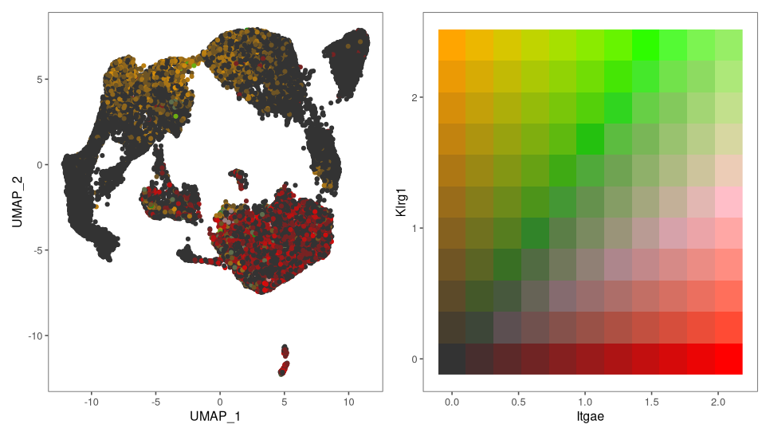
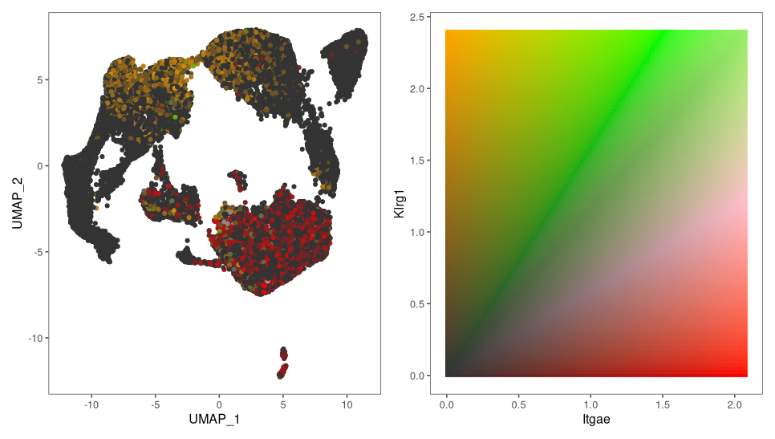

In `Seurat` you can scale and blend expression values to visualize coexpression of two features by using the `blend` parameter in `FeaturePlot`. But you cannot change the color scale then, which can be quite ugly.

Here is a example of how you can create a similar function that allows you to use your own color scale.

## Code

``` r
library(dplyr)
library(tidyr)
library(ggplot2)
library(magrittr)
library(Seurat)


seu <- readRDS("path/to/seurat_object.rds")

#' Blend colors
#' 
#' this is a function that we use to blend the colors. It takes the arctan
#' from the x and y vector. This results in a value between 0 and pi/2.
#' We can convert that to a range between 0 and 1  and map this value to
#' the color scale defined in col_fun.
#' The if `use_alpha=TRUE` is used, the alpha value of the color is set to the maximum of
#' either `x` and `y`. If `use_alpha=FALSE`, the individual RGB values are multiplied with
#' the maximum of `x` or `y`
#'
#' @param x A value between 0 and 1
#' @param y A value between 0 and 1
#' @param col_fun A color function defined by `circlize::colorRamp2` ranging at least from 0 to 1
#' @param bg Integer. Color for the backgroud. Raning from 0=black to 1=white
#'
#' @return The blended color as HEX
blend <- function(x, y, col_fun, bg) {
  col = col_fun(atan2(y, x) / pi * 2, return_rgb = TRUE)
    
  alpha = pmax(x, y)
  beta = 1 - alpha
  return(rgb(bg * beta + col[, 1] * alpha,
             bg * beta + col[, 2] * alpha,
             bg * beta + col[, 3] * alpha))
  

}


#' Max' Better Overlay Plot
#' 
#' Plot two parameters in a Single Cell Object at the same time.
#'
#' @param seu A `Seurat` object
#' @param gene1 String. Gene 1
#' @param gene2 String. Gene 2
#' @param col_fun col_fun A color function defined by `circlize::colorRamp2` ranging at least from 0 to 1. Passed on to `blend`
#' @param bg Integer. Color for the backgroud. Raning from 0=black to 1=white. Passed on to `blend`
#' @param n Integer fo the number of bins for the color scale.
#'
#' @return An assembled ggplot
MaxBetterOverlayPlot <- function(seu, gene1, gene2, 
                                 col_fun=circlize::colorRamp2(c(0,0.5,1), c('red', 'blue', 'green'), space = "XYZ"),
                                 bg=.2,
                                 n = 10)
{
  data <-  FetchData(
    object = seu,
    vars = c(gene1, gene2),
    slot = 'data'
  )

  colnames(data) <- c('x', 'y')
  
  data <- cbind(data, Embeddings(seu[['umap']]))
  
  max_x = max(data$x)
  max_y = max(data$y)  
  
  p1 <- data %>% 
    mutate( col = blend(x = x/max_x, 
                        y = y/max_y,
                        col_fun = col_fun,
                        bg = bg)) %>% 
    ggplot(aes(x=UMAP_1,
               y=UMAP_2,
               color = col)) +
    geom_point() +
    scale_color_identity() +
    ggthemes::theme_few()
  
  p2 <- tidyr::expand_grid(x=0:n, y=0:n) %>% 
    mutate(col = blend(x = x/n, 
                       y = y/n,
                       col_fun = col_fun,
                       bg = bg)) %>%
    mutate(x = x/n * max_x,
           y = y/n * max_y) %>% 
    ggplot(aes(x=x,y=y, fill=col)) +
    geom_raster() +
    theme_minimal() +
    theme(legend.position = 'none') +
    scale_fill_identity() +
    xlab(gene1) + ylab(gene2) +
    ggthemes::theme_few()
  
  p1 + p2
  
}

MaxBetterOverlayPlot(seu, 'Itgae', 'Klrg1')
MaxBetterOverlayPlot(seu, 'Itgae', 'Klrg1', bg = .95)
MaxBetterOverlayPlot(seu, 'Itgae', 'Klrg1', bg = 0)

# range need to be from 0 to 1
my_colors = circlize::colorRamp2(c(0,.3,.6,1), c('red', 'pink', 'green', 'orange'))
MaxBetterOverlayPlot(seu, 'Itgae', 'Klrg1', bg = .2,
                     col_fun = my_colors)

MaxBetterOverlayPlot(seu, 'Itgae', 'Klrg1', bg = .2,
                     col_fun = my_colors,
                     n = 100)
```

## Examples

The resulting images look like this:

::: {#fig-results layout-ncol=2}

{#fig-res-1}

{#fig-res-2}

{#fig-res-3}

{#fig-res-4}

{#fig-res-5}

Resulting plots
:::


