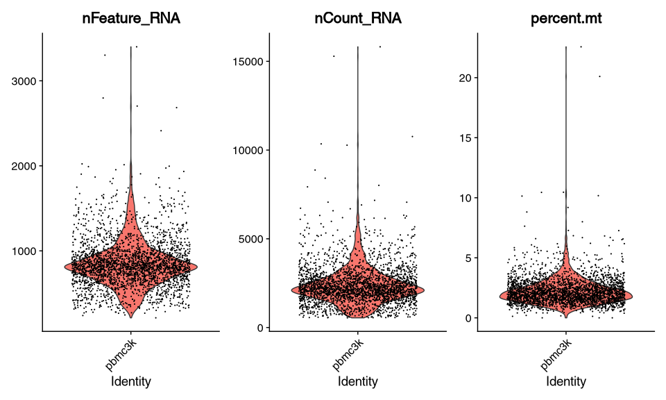
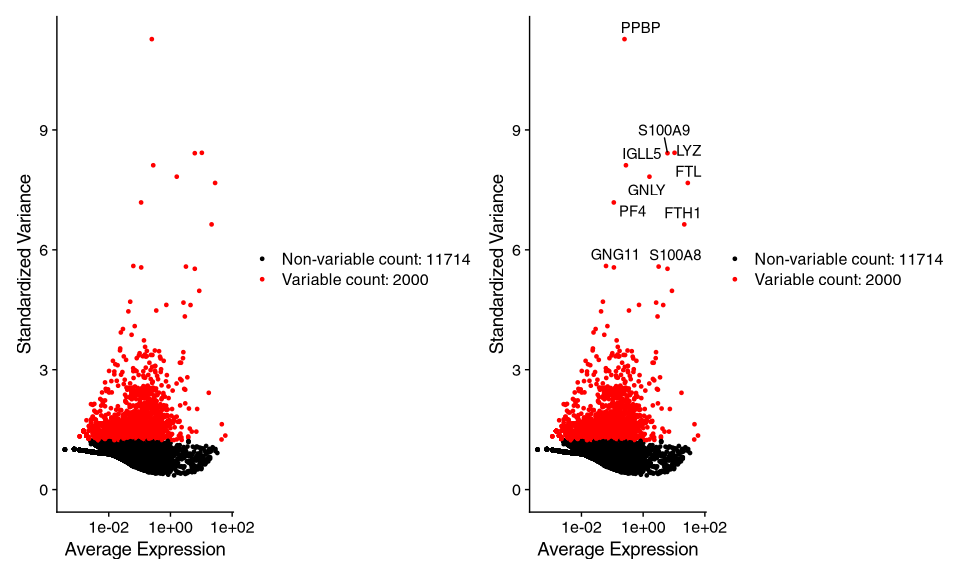
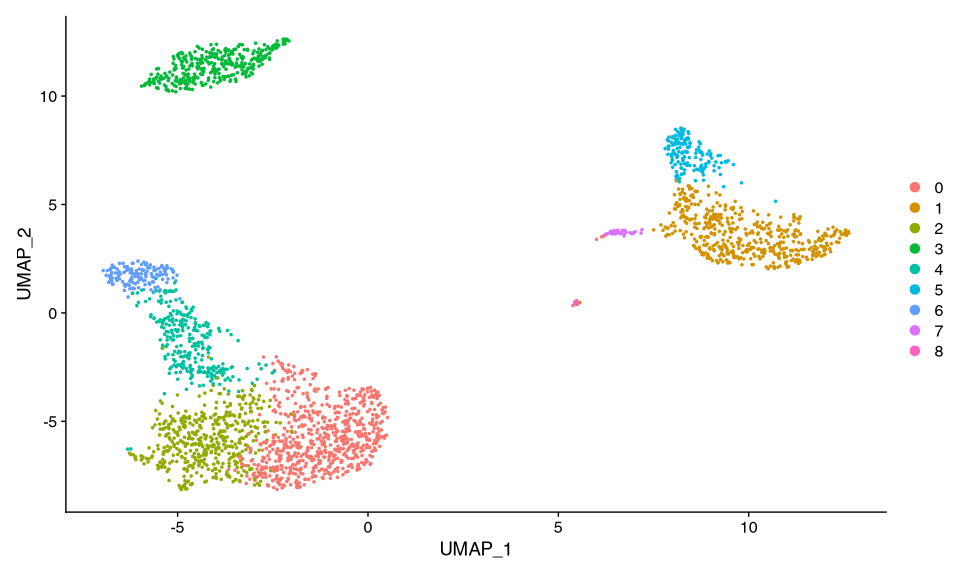
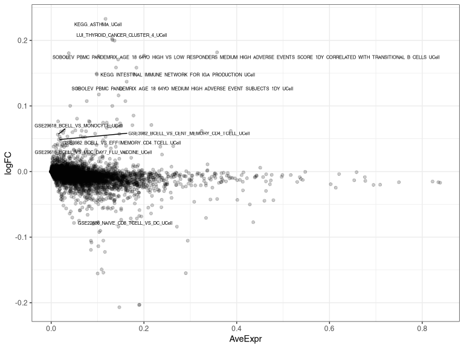
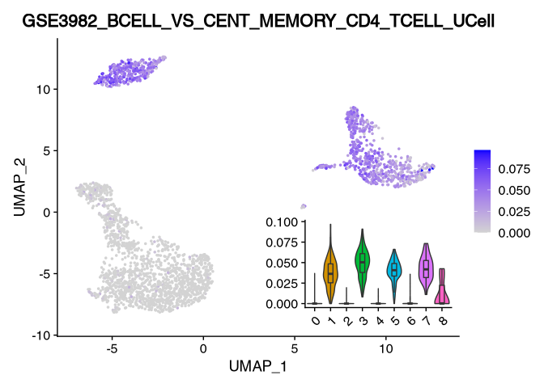

## Preprocessing

### Download and load the dataset

Let's download the example dataset from 10x genomics and load that as a `Seurat` object.

``` r
library(BiocFileCache)

bfc <- BiocFileCache("raw_data", ask = FALSE)
raw.path <- bfcrpath(bfc, "https://cf.10xgenomics.com/samples/cell/pbmc3k/pbmc3k_filtered_gene_bc_matrices.tar.gz")
untar(raw.path, exdir=file.path(tempdir(), "10xPBMC3k"))

folder <- file.path(tempdir(), "10xPBMC3k")


library(Seurat)


# Load the PBMC dataset
pbmc.data <- Read10X(data.dir = file.path(folder, "/filtered_gene_bc_matrices/hg19/"))
# Initialize the Seurat object with the raw (non-normalized data).
pbmc <- CreateSeuratObject(counts = pbmc.data, project = "pbmc3k", min.cells = 3, min.features = 200)
```

    ## Warning: Feature names cannot have underscores ('_'), replacing with dashes ('-')

``` r
pbmc
```

    ## An object of class Seurat 
    ## 13714 features across 2700 samples within 1 assay 
    ## Active assay: RNA (13714 features, 0 variable features)

### Filtering, Clustering and UMAP

These steps are all taken from the Seurat tutorial. Please see there for further information <https://satijalab.org/seurat/articles/pbmc3k_tutorial.html>

``` r
pbmc[["percent.mt"]] <- PercentageFeatureSet(pbmc, pattern = "^MT-")
VlnPlot(pbmc, features = c("nFeature_RNA", "nCount_RNA", "percent.mt"), ncol = 3)
```



``` r
# Subset and normalize
pbmc <- subset(pbmc, subset = nFeature_RNA > 200 & nFeature_RNA < 2500 & percent.mt < 5)
pbmc <- NormalizeData(pbmc, normalization.method = "LogNormalize", scale.factor = 10000)

# Find variable Features
pbmc <- FindVariableFeatures(pbmc, selection.method = "vst", nfeatures = 2000)
# Identify the 10 most highly variable genes
top10 <- head(VariableFeatures(pbmc), 10)
# plot variable features with and without labels
plot1 <- VariableFeaturePlot(pbmc)
plot2 <- LabelPoints(plot = plot1, points = top10, repel = TRUE)
```

    ## When using repel, set xnudge and ynudge to 0 for optimal results

``` r
plot1 + plot2
```

    ## Warning: Transformation introduced infinite values in continuous x-axis

    ## Warning: Removed 1 rows containing missing values (geom_point).

    ## Warning: Transformation introduced infinite values in continuous x-axis

    ## Warning: Removed 1 rows containing missing values (geom_point).



``` r
# Scale Data
all.genes <- rownames(pbmc)
pbmc <- ScaleData(pbmc, features = all.genes)
```

    ## Centering and scaling data matrix

``` r
# PCA
pbmc <- RunPCA(pbmc, features = VariableFeatures(object = pbmc))
```

    ## PC_ 1 
    ## Positive:  CST3, TYROBP, LST1, AIF1, FTL, FTH1, LYZ, FCN1, S100A9, TYMP 
    ##     FCER1G, CFD, LGALS1, S100A8, CTSS, LGALS2, SERPINA1, IFITM3, SPI1, CFP 
    ##     PSAP, IFI30, SAT1, COTL1, S100A11, NPC2, GRN, LGALS3, GSTP1, PYCARD 
    ## Negative:  MALAT1, LTB, IL32, IL7R, CD2, B2M, ACAP1, CD27, STK17A, CTSW 
    ##     CD247, GIMAP5, AQP3, CCL5, SELL, TRAF3IP3, GZMA, MAL, CST7, ITM2A 
    ##     MYC, GIMAP7, HOPX, BEX2, LDLRAP1, GZMK, ETS1, ZAP70, TNFAIP8, RIC3 
    ## PC_ 2 
    ## Positive:  CD79A, MS4A1, TCL1A, HLA-DQA1, HLA-DQB1, HLA-DRA, LINC00926, CD79B, HLA-DRB1, CD74 
    ##     HLA-DMA, HLA-DPB1, HLA-DQA2, CD37, HLA-DRB5, HLA-DMB, HLA-DPA1, FCRLA, HVCN1, LTB 
    ##     BLNK, P2RX5, IGLL5, IRF8, SWAP70, ARHGAP24, FCGR2B, SMIM14, PPP1R14A, C16orf74 
    ## Negative:  NKG7, PRF1, CST7, GZMB, GZMA, FGFBP2, CTSW, GNLY, B2M, SPON2 
    ##     CCL4, GZMH, FCGR3A, CCL5, CD247, XCL2, CLIC3, AKR1C3, SRGN, HOPX 
    ##     TTC38, APMAP, CTSC, S100A4, IGFBP7, ANXA1, ID2, IL32, XCL1, RHOC 
    ## PC_ 3 
    ## Positive:  HLA-DQA1, CD79A, CD79B, HLA-DQB1, HLA-DPB1, HLA-DPA1, CD74, MS4A1, HLA-DRB1, HLA-DRA 
    ##     HLA-DRB5, HLA-DQA2, TCL1A, LINC00926, HLA-DMB, HLA-DMA, CD37, HVCN1, FCRLA, IRF8 
    ##     PLAC8, BLNK, MALAT1, SMIM14, PLD4, LAT2, IGLL5, P2RX5, SWAP70, FCGR2B 
    ## Negative:  PPBP, PF4, SDPR, SPARC, GNG11, NRGN, GP9, RGS18, TUBB1, CLU 
    ##     HIST1H2AC, AP001189.4, ITGA2B, CD9, TMEM40, PTCRA, CA2, ACRBP, MMD, TREML1 
    ##     NGFRAP1, F13A1, SEPT5, RUFY1, TSC22D1, MPP1, CMTM5, RP11-367G6.3, MYL9, GP1BA 
    ## PC_ 4 
    ## Positive:  HLA-DQA1, CD79B, CD79A, MS4A1, HLA-DQB1, CD74, HLA-DPB1, HIST1H2AC, PF4, TCL1A 
    ##     SDPR, HLA-DPA1, HLA-DRB1, HLA-DQA2, HLA-DRA, PPBP, LINC00926, GNG11, HLA-DRB5, SPARC 
    ##     GP9, AP001189.4, CA2, PTCRA, CD9, NRGN, RGS18, GZMB, CLU, TUBB1 
    ## Negative:  VIM, IL7R, S100A6, IL32, S100A8, S100A4, GIMAP7, S100A10, S100A9, MAL 
    ##     AQP3, CD2, CD14, FYB, LGALS2, GIMAP4, ANXA1, CD27, FCN1, RBP7 
    ##     LYZ, S100A11, GIMAP5, MS4A6A, S100A12, FOLR3, TRABD2A, AIF1, IL8, IFI6 
    ## PC_ 5 
    ## Positive:  GZMB, NKG7, S100A8, FGFBP2, GNLY, CCL4, CST7, PRF1, GZMA, SPON2 
    ##     GZMH, S100A9, LGALS2, CCL3, CTSW, XCL2, CD14, CLIC3, S100A12, CCL5 
    ##     RBP7, MS4A6A, GSTP1, FOLR3, IGFBP7, TYROBP, TTC38, AKR1C3, XCL1, HOPX 
    ## Negative:  LTB, IL7R, CKB, VIM, MS4A7, AQP3, CYTIP, RP11-290F20.3, SIGLEC10, HMOX1 
    ##     PTGES3, LILRB2, MAL, CD27, HN1, CD2, GDI2, ANXA5, CORO1B, TUBA1B 
    ##     FAM110A, ATP1A1, TRADD, PPA1, CCDC109B, ABRACL, CTD-2006K23.1, WARS, VMO1, FYB

``` r
# Cluster
pbmc <- FindNeighbors(pbmc, dims = 1:10)
```

    ## Computing nearest neighbor graph

    ## Computing SNN

``` r
pbmc <- FindClusters(pbmc, resolution = 0.5)
```

    ## Modularity Optimizer version 1.3.0 by Ludo Waltman and Nees Jan van Eck
    ## 
    ## Number of nodes: 2638
    ## Number of edges: 95965
    ## 
    ## Running Louvain algorithm...
    ## Maximum modularity in 10 random starts: 0.8723
    ## Number of communities: 9
    ## Elapsed time: 0 seconds

``` r
# UMAP
pbmc <- RunUMAP(pbmc, dims = 1:10)
```

    ## Warning: The default method for RunUMAP has changed from calling Python UMAP via reticulate to the R-native UWOT using the cosine metric
    ## To use Python UMAP via reticulate, set umap.method to 'umap-learn' and metric to 'correlation'
    ## This message will be shown once per session

    ## 20:16:55 UMAP embedding parameters a = 0.9922 b = 1.112

    ## 20:16:55 Read 2638 rows and found 10 numeric columns

    ## 20:16:55 Using Annoy for neighbor search, n_neighbors = 30

    ## 20:16:55 Building Annoy index with metric = cosine, n_trees = 50

    ## 0%   10   20   30   40   50   60   70   80   90   100%

    ## [----|----|----|----|----|----|----|----|----|----|

    ## **************************************************|
    ## 20:16:56 Writing NN index file to temp file /tmp/RtmpH1DpaG/file6ea9f6f6a9e
    ## 20:16:56 Searching Annoy index using 1 thread, search_k = 3000
    ## 20:16:56 Annoy recall = 100%
    ## 20:16:57 Commencing smooth kNN distance calibration using 1 thread
    ## 20:16:58 Initializing from normalized Laplacian + noise
    ## 20:16:58 Commencing optimization for 500 epochs, with 105124 positive edges
    ## 20:17:01 Optimization finished

``` r
DimPlot(pbmc, reduction = "umap")
```



## Get gene signatures

This function get the MSigDB pathways. If a pathway ends witt `_UP` and `+` will be added to the gene to mark it as up-regulated. Vice versa, if there the pathways ends with `_DN` a `-` will be added.

Additionally if there are two pathways containing the UP and DOWN signatures, they will be merged. E.g. `GOLDRATH_EFF_VS_MEMORY_CD8_TCELL_UP` and `GOLDRATH_EFF_VS_MEMORY_CD8_TCELL_DN` will be merged in `GOLDRATH_EFF_VS_MEMORY_CD8_TCELL`. In that list, the genes that are up-regulated are marked by a `+` and the down-regulated genes by a `-`

``` r
library(magrittr)

#' getMSigDBPathways
#'
#' @param categories MSigDB categories. Can be "H" or "C1" - "C8".
#' @param species Species to get the pathways for. Default: Mus musculus
#'
#' @return A names list. If specificed in MSigDB, the direction of the genes in specified by + and -
getMSigDBPathways <- function(categories, species = "Mus musculus"){
  pathways <- msigdbr::msigdbr(species = species)
  
  pathways <- pathways %>% 
    dplyr::filter(gs_cat %in% categories)
  
  pathways <- pathways %>% 
    # check if the pathways names ends with _DN or _UP
    # if yes, add a "-" or "+" to the end of the gene name
    dplyr::mutate(gene_symbol = dplyr::case_when(
      stringr::str_detect(gs_name, "_UP$") ~ paste0(gene_symbol, "+"),
      stringr::str_detect(gs_name, "_DN$") ~ paste0(gene_symbol, "-"),
      TRUE ~ gene_symbol
    )) %>% 
    # remove the _UP and _DN from the pathway name. 
    # this allows to combine these to by splitting using the shortend name
    dplyr::mutate(gs_name_short = stringr::str_remove(gs_name, "_UP$|_DN$"))
  
  pathways <- split(pathways$gene_symbol, pathways$gs_name_short)
  return(pathways)
}
```

Let's see how that works in an example. Note that we need to set the specied to "Homo sapiens" as we are using a human scRNA dataset. But the function can be used the same way with mice data.

``` r
# Example
pathways <- getMSigDBPathways(categories = c("C2", "C7"), species = "Homo sapiens")

# a small function to show head and tail. this is just to recude the output a little bit
ht <- function(d, m=5, n=m){
  # print the head and tail together
  list(HEAD = head(d,m), TAIL = tail(d,n))
}

ht(pathways$GOLDRATH_EFF_VS_MEMORY_CD8_TCELL, 10)
```

    ## $HEAD
    ##  [1] "ABCA2-"   "ABCC5-"   "ABHD14A-" "ACADM-"   "ACP5-"    "ACP6-"    "ADAM22-"  "ADCY7-"   "ADGRG3-"  "AKAP9-"  
    ## 
    ## $TAIL
    ##  [1] "TYMS+"   "TYROBP+" "UBE2N+"  "UBE2T+"  "UCHL5+"  "UCK2+"   "VPS45+"  "WEE1+"   "XBP1+"   "YBX3+"

## Run UCell

UCell has a function called `AddModuleScore_UCell` that adds the score directly to the `Seurat`object. I will not use this here, as I want to run `limma` on the scores matrix. We will add the scores manually to the `Seurat` object in a later step.

``` r
library(UCell)
```

    ## Loading required package: data.table

    ## data.table 1.14.0 using 8 threads (see ?getDTthreads).  Latest news: r-datatable.com

    ## Loading required package: Matrix

``` r
scores <- ScoreSignatures_UCell(GetAssayData(pbmc, 
                                             slot="data", 
                                             assay=Seurat::DefaultAssay(pbmc)),
                                features=pathways,
                                ncores = 8)
```

``` r
# Let's inspect the results
scores[1:5, 1:5]
```

    ##                  ABBUD_LIF_SIGNALING_1_UCell ABBUD_LIF_SIGNALING_2_UCell ABDELMOHSEN_ELAVL4_TARGETS_UCell ABDULRAHMAN_KIDNEY_CANCER_VHL_UCell
    ## AAACATACAACCAC-1                 0.027867717                  0.00000000                        0.1013542                                   0
    ## AAACATTGAGCTAC-1                 0.006188047                  0.13538889                        0.1298333                                   0
    ## AAACATTGATCAGC-1                 0.016126532                  0.08650000                        0.1234167                                   0
    ## AAACCGTGCTTCCG-1                 0.080817204                  0.08261111                        0.0926875                                   0
    ## AAACCGTGTATGCG-1                 0.008143286                  0.06941667                        0.1036250                                   0
    ##                  ABE_INNER_EAR_UCell
    ## AAACATACAACCAC-1           0.2351364
    ## AAACATTGAGCTAC-1           0.2393106
    ## AAACATTGATCAGC-1           0.2001742
    ## AAACCGTGCTTCCG-1           0.2331970
    ## AAACCGTGTATGCG-1           0.1219242

## "Differential expression" with `limma`

Using the `limma` package we can see which pathways are differentially between two clusters. But for that we need to switch rows (=observations) and columns (=samples/cells).

In this example we will compare cluster3 (B cells) vs cluster 0 and 2 (CD4 cells).

``` r
library(limma)

design <- model.matrix(~0+seurat_clusters, data=pbmc@meta.data)

fit <- lmFit(t(scores), design = design)

cont.matrix <- makeContrasts(seurat_clusters3 - (seurat_clusters0 + seurat_clusters2)/2,
                            levels=design)
fit <- contrasts.fit(fit, contrasts = cont.matrix)
fit <- eBayes(fit)
```

    ## Warning: Zero sample variances detected, have been offset away from zero

``` r
# topTable gives the overall significant genelists (F statistics)
top <- topTable(fit, number = Inf) %>% 
  as.data.frame() %>% 
  tibble::rownames_to_column("pathway")

top[1:20, ]
```


::: {style="overflow:scroll;"}

| pathway                                                                                                                                    | logFC              | AveExpr           | t                 | P.Value | adj.P.Val | B                |
|-----------------------------|-------|-------|-------|-------|-------|-------|
| SOBOLEV_PBMC_PANDEMRIX_AGE_18_64YO_MEDIUM_HIGH_ADVERSE_EVENT_SUBJECTS_1DY_UCell                                                            | 0.126648009270756  | 0.057337211562761 | 103.072674947176  | 0       | 0         | 2116.8839169302  |
| SOBOLEV_PBMC_PANDEMRIX_AGE_18_64YO_HIGH_VS_LOW_RESPONDERS_MEDIUM_HIGH_ADVERSE_EVENTS_SCORE_1DY_CORRELATED_WITH_TRANSITIONAL_B\_CELLS_UCell | 0.174565703301626  | 0.034752211271165 | 98.2410795425678  | 0       | 0         | 2016.6306515114  |
| KEGG_ASTHMA_UCell                                                                                                                          | 0.232809951388     | 0.117191672984584 | 80.3762848985127  | 0       | 0         | 1620.88861912753 |
| GSE29618_BCELL_VS_MONOCYTE_UCell                                                                                                           | 0.056365991677203  | 0.014359945688333 | 78.6521407525925  | 0       | 0         | 1580.60342780014 |
| GSE3982_BCELL_VS_CENT_MEMORY_CD4_TCELL_UCell                                                                                               | 0.048696526588387  | 0.016502537669401 | 76.3510124759989  | 0       | 0         | 1526.28039984072 |
| KEGG_INTESTINAL_IMMUNE_NETWORK_FOR_IGA_PRODUCTION_UCell                                                                                    | 0.147865935825099  | 0.098235653062084 | 72.7873862266304  | 0       | 0         | 1440.93146946918 |
| LUI_THYROID_CANCER_CLUSTER_4\_UCell                                                                                                        | 0.199639371744963  | 0.136529724298109 | 70.0395500296777  | 0       | 0         | 1374.14890528798 |
| GSE29618_BCELL_VS_MDC_DAY7_FLU_VACCINE_UCell                                                                                               | 0.038007853534524  | 0.005150556438023 | 68.8459304813632  | 0       | 0         | 1344.88860725392 |
| GSE22886_NAIVE_CD8_TCELL_VS_DC_UCell                                                                                                       | -0.078376085639075 | 0.049082996422193 | -68.2058900827913 | 0       | 0         | 1329.13842768732 |
| GSE3982_BCELL_VS_EFF_MEMORY_CD4_TCELL_UCell                                                                                                | 0.042024786161555  | 0.013926522521361 | 65.7961915095323  | 0       | 0         | 1269.47850109547 |
| KEGG_AUTOIMMUNE_THYROID_DISEASE_UCell                                                                                                      | 0.125845994513671  | 0.150514300363523 | 65.5650483141624  | 0       | 0         | 1263.72684715868 |
| GSE29618_BCELL_VS_MONOCYTE_DAY7_FLU_VACCINE_UCell                                                                                          | 0.05886674575098   | 0.02576935202354  | 65.3535674130366  | 0       | 0         | 1258.46017763889 |
| KEGG_ALLOGRAFT_REJECTION_UCell                                                                                                             | 0.176729706070747  | 0.200274945529305 | 65.1186241566344  | 0       | 0         | 1252.6044533117  |
| KEGG_GRAFT_VERSUS_HOST_DISEASE_UCell                                                                                                       | 0.158362691932928  | 0.183825027583104 | 64.1426432867401  | 0       | 0         | 1228.22663068787 |
| FOURATI_BLOOD_TWINRIX_AGE_65_81Y0_RESPONDERS_VS_POOR_RESPONDERS_TRAINING_SET_0DY_NETWORK_INFERENCE_UCell                                   | 0.180440596390948  | 0.037989620563919 | 62.772526829005   | 0       | 0         | 1193.86709741313 |
| KEGG_TYPE_I\_DIABETES_MELLITUS_UCell                                                                                                       | 0.148510266913546  | 0.178178876409777 | 62.3795533905701  | 0       | 0         | 1183.98400147905 |
| RICKMAN_HEAD_AND_NECK_CANCER_D\_UCell                                                                                                      | 0.061133787030304  | 0.021137054586808 | 59.8591242975195  | 0       | 0         | 1120.3227465619  |
| SHIN_B\_CELL_LYMPHOMA_CLUSTER_9\_UCell                                                                                                     | 0.100171677718511  | 0.040996096191958 | 59.7793370645804  | 0       | 0         | 1118.3002742325  |
| GSE10325_BCELL_VS_MYELOID_UCell                                                                                                            | 0.049986455460947  | 0.020289995660968 | 59.3232442600431  | 0       | 0         | 1106.7312891303  |
| GSE10325_LUPUS_CD4_TCELL_VS_LUPUS_MYELOID_UCell                                                                                            | -0.070118906587563 | 0.045476404329073 | -59.2687879074764 | 0       | 0         | 1105.34910959777 |

:::

``` r
library(patchwork)
library(ggplot2)
library(ggrepel)

top %>% 
  ggplot(aes(x=AveExpr, y=logFC)) + 
  geom_point(alpha=0.2) + 
  geom_text_repel(data = function(x) x[1:10,],
                  aes(label = pathway),
                  size=2) + 
  theme_bw()
```



One of the top pathways is "GSE3982_BCELL_VS_CENT_MEMORY_CD4_TCELL_UCell". And we can easily see that this pathway was put together by an UP and DN list.

``` r
selected = "GSE3982_BCELL_VS_CENT_MEMORY_CD4_TCELL_UCell"

ht(pathways[[gsub("_UCell$", "", selected)]], 10)
```

    ## $HEAD
    ##  [1] "ACKR3-"  "ACSL6-"  "ADCY10-" "ADGRE1-" "ADNP2-"  "ADTRP-"  "AGR2-"   "AKR1C1-" "AP1M2-"  "ASTN1-" 
    ## 
    ## $TAIL
    ##  [1] "TULP2+"   "URB1+"    "UROD+"    "USP22+"   "YBX3+"    "ZBTB18+"  "ZDHHC4+"  "ZNF232+"  "ZNF804A+" "ZSCAN32+"

## Visualization of the results

To use `Seurat`'s plotting function, we need to add the pathway scores to the object's metadata. Then we can use `VlnPlot` etc as usual.

``` r
pbmc <- Seurat::AddMetaData(pbmc, as.data.frame(scores))

p_umap <- FeaturePlot(pbmc, selected)
p_vln <- VlnPlot(pbmc, selected,
                 pt.size = 0) + 
  geom_boxplot(width = .3, alpha = .2, outlier.shape = NA) +
  ggtitle("") +
  theme(legend.position = "none",
        axis.title.x = element_blank())

p_umap + inset_element(p_vln, left = .5, right = 1, top = .5, bottom = .0)
```



## Session info


    > sessionInfo()
    R version 4.1.1 (2021-08-10)
    Platform: x86_64-pc-linux-gnu (64-bit)
    Running under: Manjaro Linux

    Matrix products: default
    BLAS:   /usr/lib/libopenblasp-r0.3.17.so
    LAPACK: /usr/lib/liblapack.so.3.10.0

    locale:
    [1] LC_CTYPE=en_US.UTF-8       LC_NUMERIC=C               LC_TIME=en_US.UTF-8        LC_COLLATE=en_US.UTF-8     LC_MONETARY=en_US.UTF-8   
    [6] LC_MESSAGES=en_US.UTF-8    LC_PAPER=en_US.UTF-8       LC_NAME=C                  LC_ADDRESS=C               LC_TELEPHONE=C            
    [11] LC_MEASUREMENT=en_US.UTF-8 LC_IDENTIFICATION=C       

    attached base packages:
    [1] stats     graphics  grDevices datasets  utils     methods   base     

    other attached packages:
    [1] future.apply_1.8.1  future_1.22.1       UCell_1.1.0         Matrix_1.3-4        data.table_1.14.0   magrittr_2.0.1      rmarkdown_2.11     
    [8] SeuratObject_4.0.2  Seurat_4.0.4        patchwork_1.1.1     ggrepel_0.9.1       ggplot2_3.3.5       limma_3.48.3        BiocFileCache_2.0.0
    [15] dbplyr_2.1.1       

    loaded via a namespace (and not attached):
    [1] Rtsne_0.15            colorspace_2.0-2      deldir_0.2-10         ellipsis_0.3.2        ggridges_0.5.3        spatstat.data_2.1-0  
    [7] farver_2.1.0          leiden_0.3.9          listenv_0.8.0         bit64_4.0.5           RSpectra_0.16-0       fansi_0.5.0          
    [13] codetools_0.2-18      splines_4.1.1         cachem_1.0.6          knitr_1.34            polyclip_1.10-0       jsonlite_1.7.2       
    [19] ica_1.0-2             cluster_2.1.2         png_0.1-7             uwot_0.1.10           shiny_1.7.0           sctransform_0.3.2    
    [25] spatstat.sparse_2.0-0 BiocManager_1.30.16   msigdbr_7.4.1         compiler_4.1.1        httr_1.4.2            assertthat_0.2.1     
    [31] fastmap_1.1.0         lazyeval_0.2.2        cli_3.0.1             later_1.3.0           htmltools_0.5.2       tools_4.1.1          
    [37] igraph_1.2.6          gtable_0.3.0          glue_1.4.2            RANN_2.6.1            reshape2_1.4.4        dplyr_1.0.7          
    [43] rappdirs_0.3.3        Rcpp_1.0.7            scattermore_0.7       vctrs_0.3.8           babelgene_21.4        nlme_3.1-152         
    [49] lmtest_0.9-38         xfun_0.26             stringr_1.4.0         globals_0.14.0        mime_0.11             miniUI_0.1.1.1       
    [55] lifecycle_1.0.0       irlba_2.3.3           renv_0.13.2           goftest_1.2-2         MASS_7.3-54           zoo_1.8-9            
    [61] scales_1.1.1          spatstat.core_2.3-0   promises_1.2.0.1      spatstat.utils_2.2-0  parallel_4.1.1        RColorBrewer_1.1-2   
    [67] yaml_2.2.1            curl_4.3.2            memoise_2.0.0         reticulate_1.22       pbapply_1.5-0         gridExtra_2.3        
    [73] rpart_4.1-15          stringi_1.7.4         RSQLite_2.2.8         highr_0.9             filelock_1.0.2        rlang_0.4.11         
    [79] pkgconfig_2.0.3       matrixStats_0.61.0    evaluate_0.14         lattice_0.20-44       ROCR_1.0-11           purrr_0.3.4          
    [85] tensor_1.5            labeling_0.4.2        htmlwidgets_1.5.4     cowplot_1.1.1         bit_4.0.4             tidyselect_1.1.1     
    [91] parallelly_1.28.1     RcppAnnoy_0.0.19      plyr_1.8.6            R6_2.5.1              generics_0.1.0        DBI_1.1.1            
    [97] withr_2.4.2           pillar_1.6.2          mgcv_1.8-36           fitdistrplus_1.1-5    survival_3.2-11       abind_1.4-5          
    [103] tibble_3.1.4          crayon_1.4.1          KernSmooth_2.23-20    utf8_1.2.2            spatstat.geom_2.2-2   plotly_4.9.4.1       
    [109] grid_4.1.1            blob_1.2.2            digest_0.6.27         xtable_1.8-4          tidyr_1.1.3           httpuv_1.6.3         
    [115] munsell_0.5.0         viridisLite_0.4.0  

