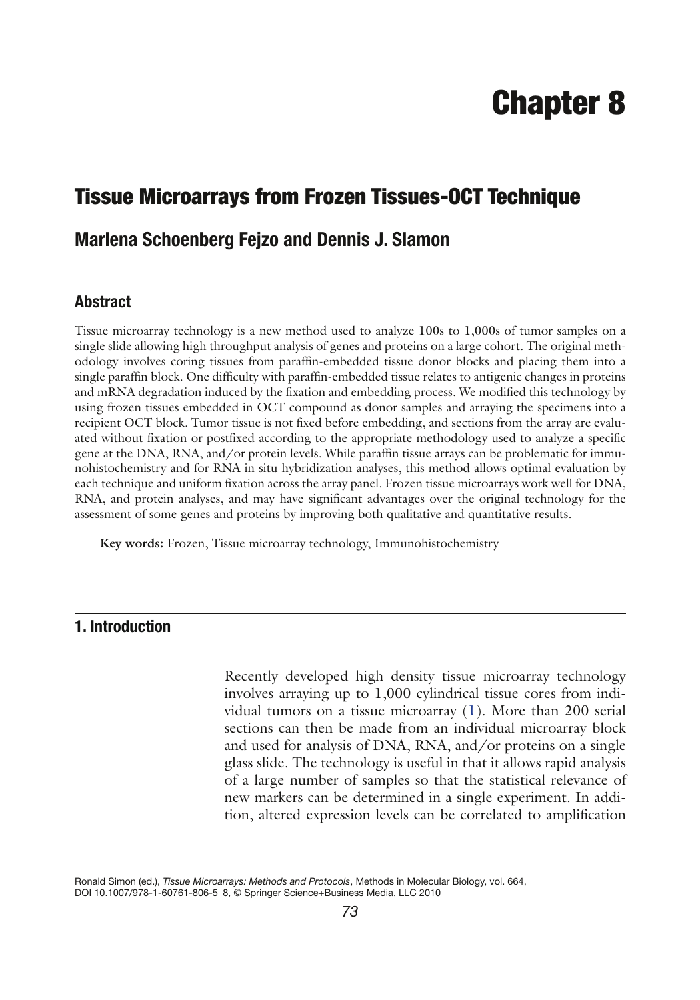
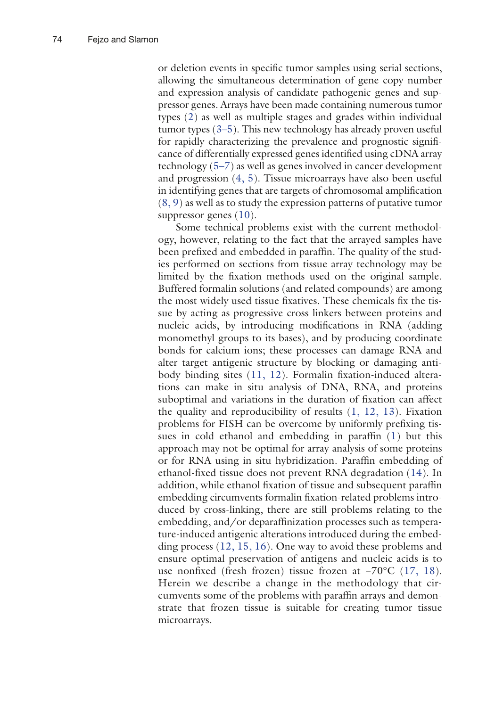
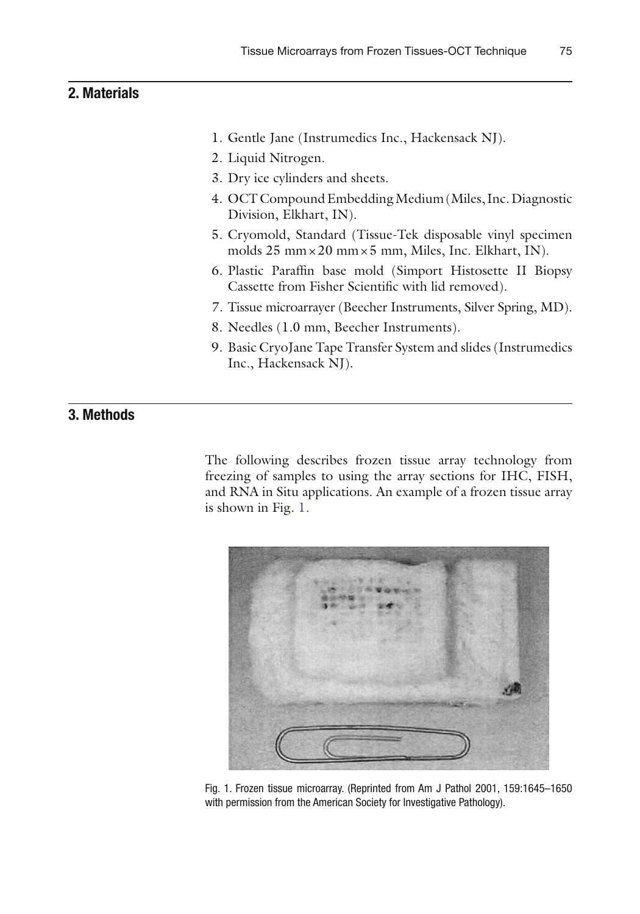
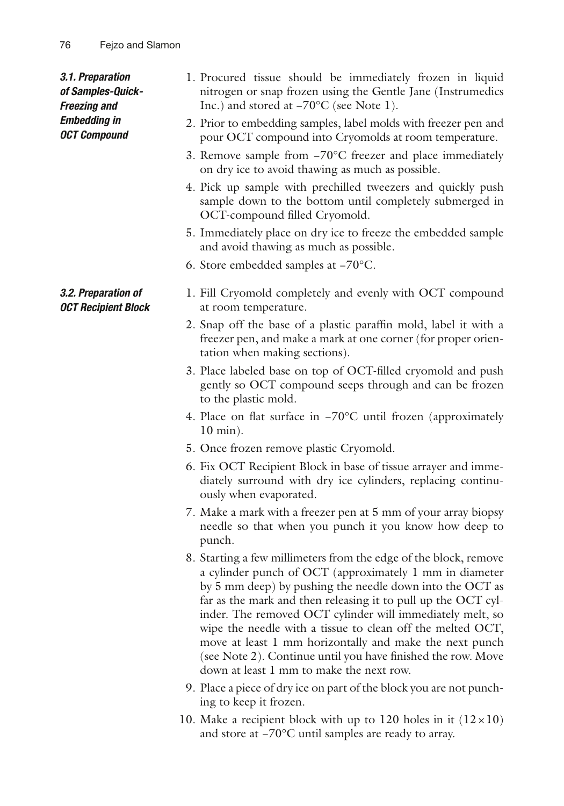
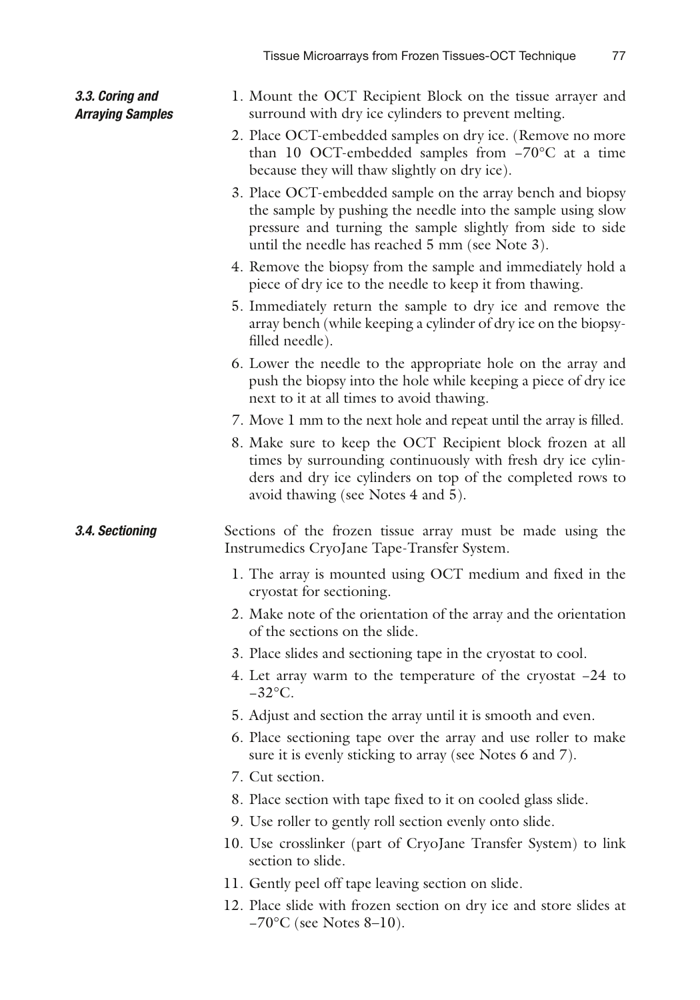
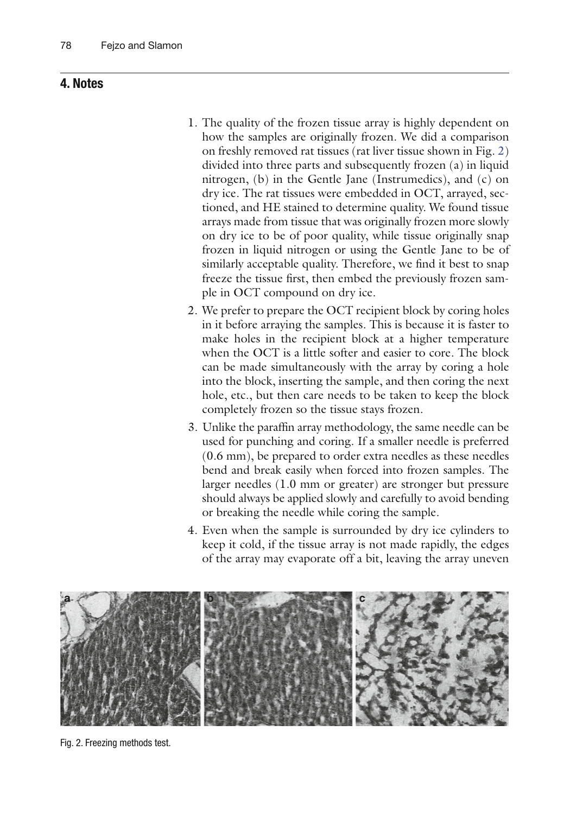
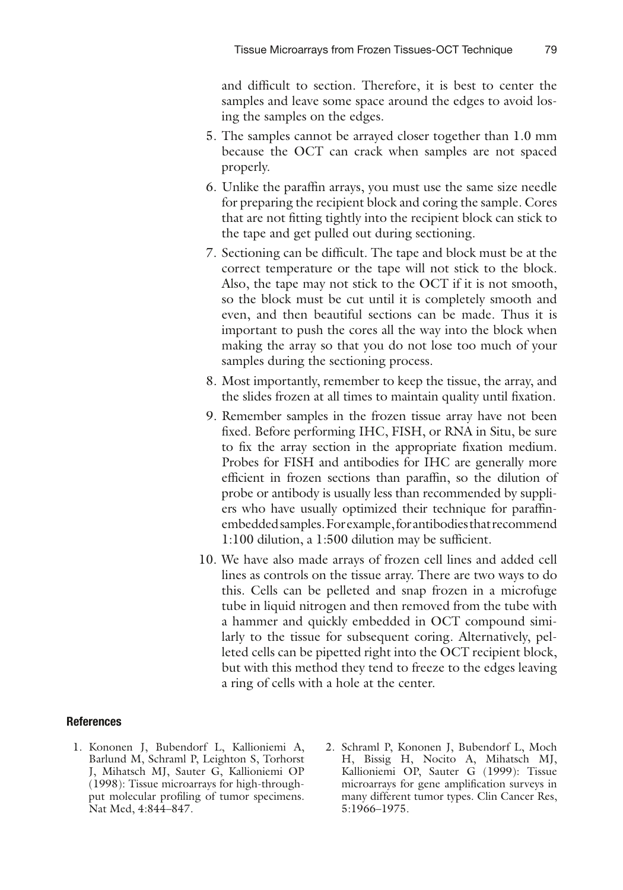
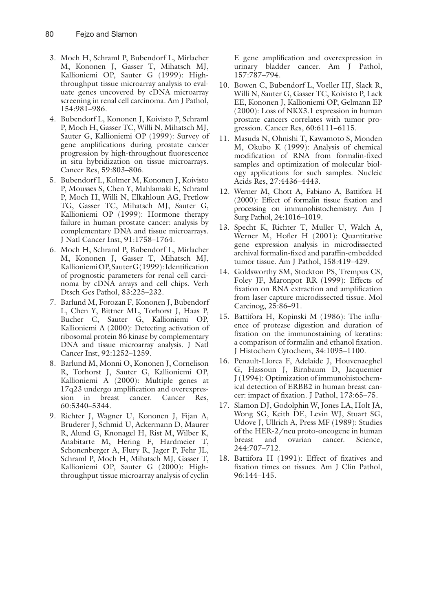

[Download the original PDF](TMA_Frozen_histology.pdf){.btn .btn-primary download="TMA_Frozen_histology.pdf"}

# TMA_Frozen_histology

{width=100%}

{width=100%}

{width=100%}

{width=100%}

{width=100%}

{width=100%}

{width=100%}

{width=100%}
