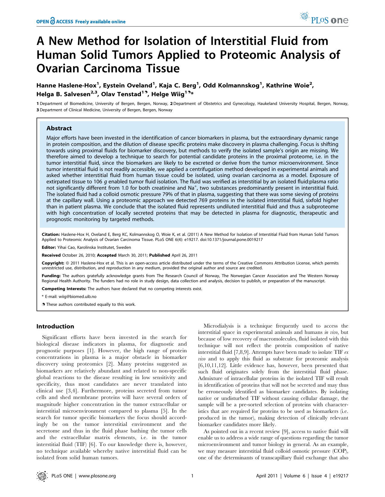
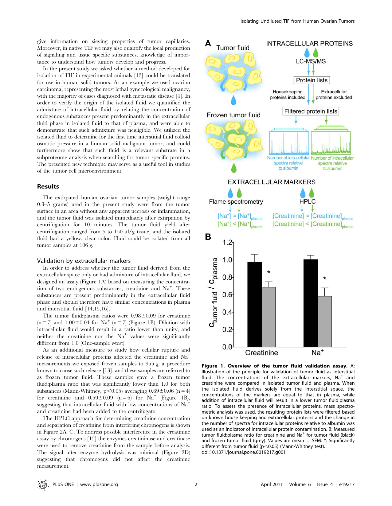
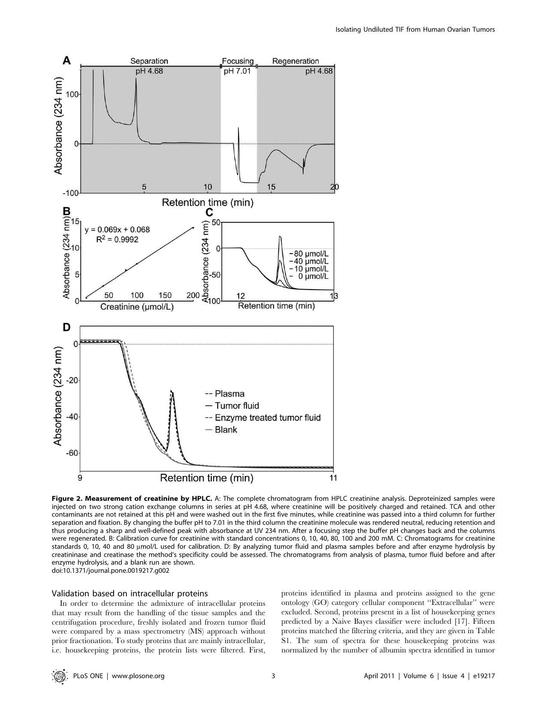
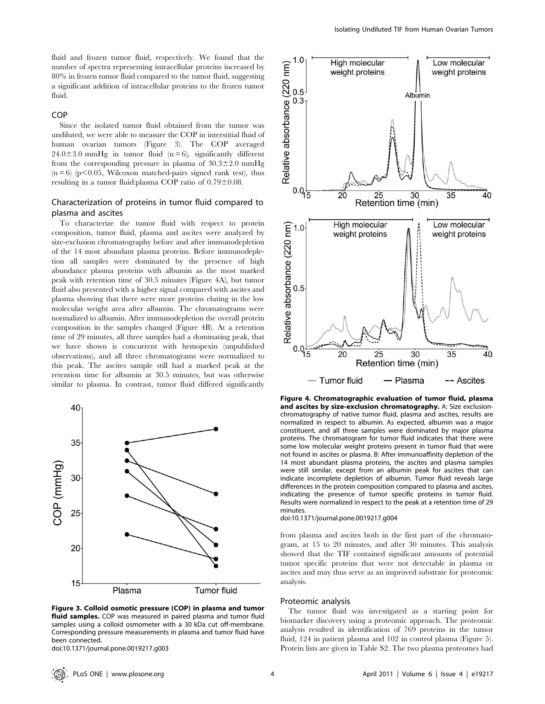
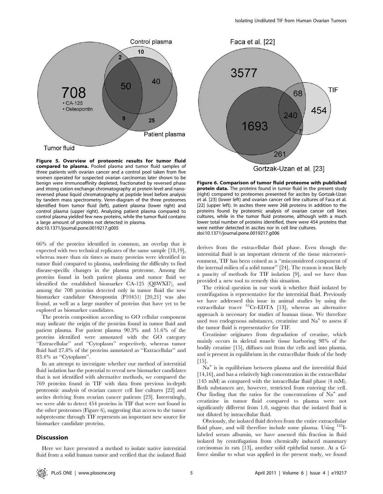
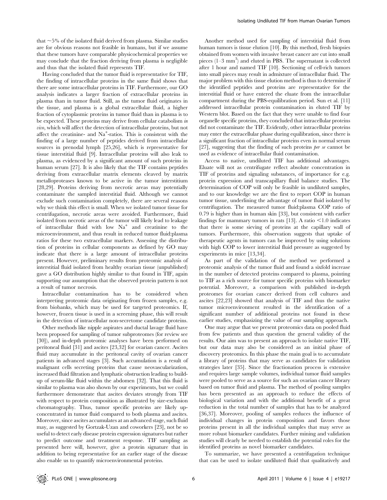
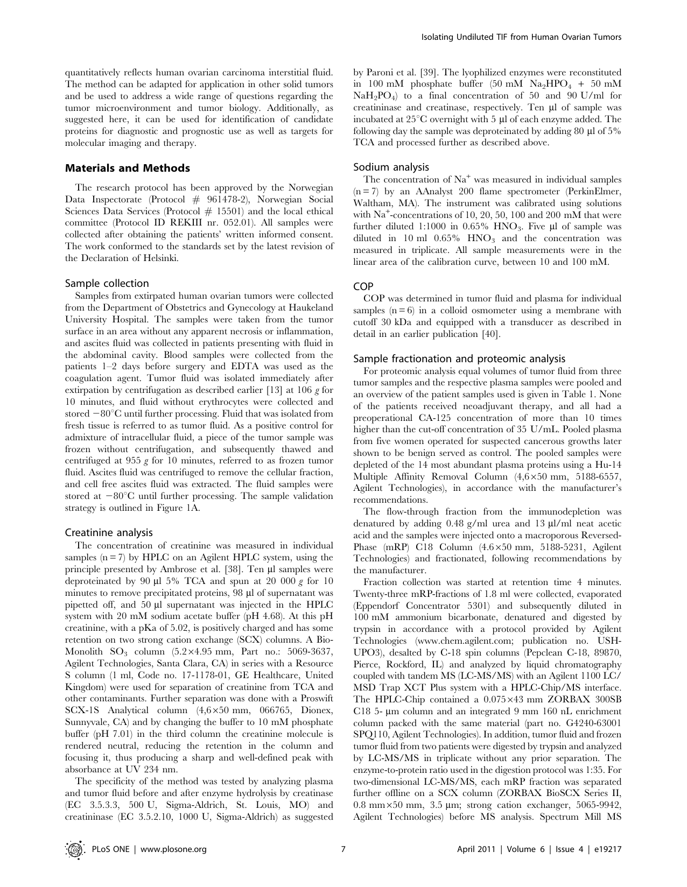
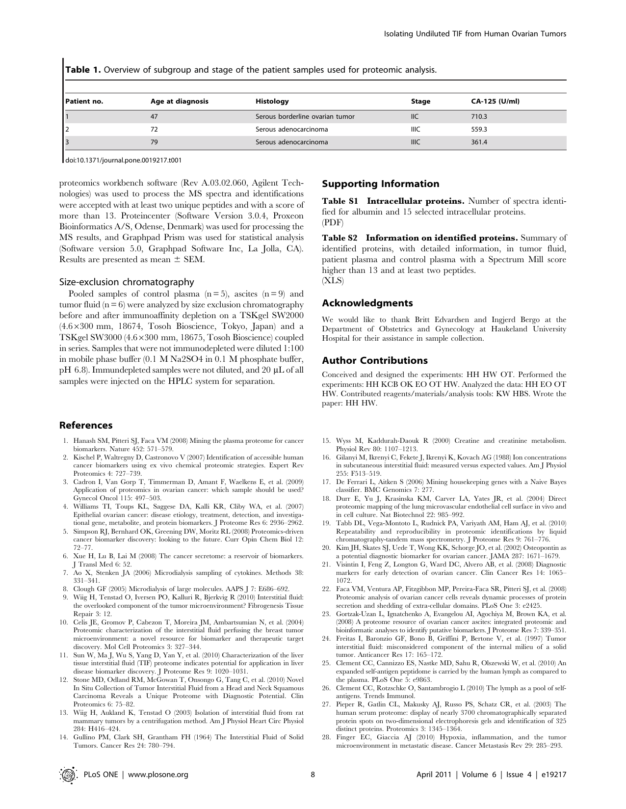
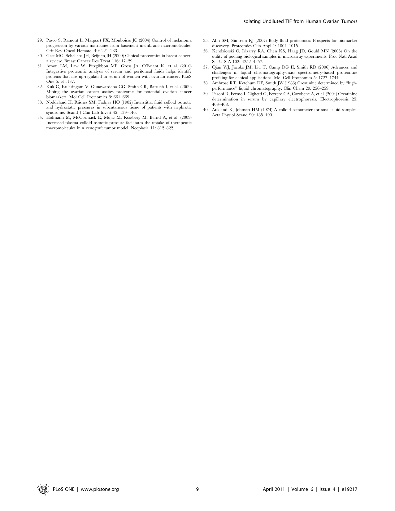

[Download the original PDF](Tumor_Interstitial_Fluid.pdf){.btn .btn-primary download="Tumor_Interstitial_Fluid.pdf"}

{width=100%}

{width=100%}

{width=100%}

{width=100%}

{width=100%}

{width=100%}

{width=100%}

{width=100%}

{width=100%}

# Tumor_Interstitial_Fluid
