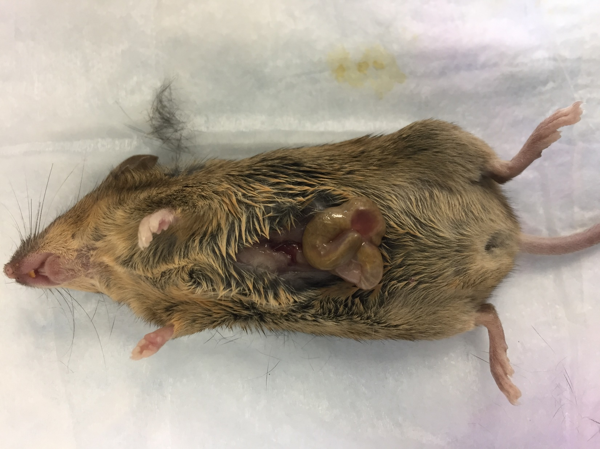

**Orthotopic Implantation of MC38-gp33 cells into the Caecum of Bl6 mice**

Mouse colon cancer cells (e.g., MC-38 cells) will be grown to confluence using standard aseptic cell culture technique, harvested for injection, and resuspended in serum-free DMEM at a concentration of 4 x 10^7 cells/mL – Inject 200K cells in 20 ul serum-free DMEM.

**Cecum injection:**

a) After induction of anesthesia, under sterile conditions (sterile instruments, surgical PPE per policy), the middle abdomen will be shaved with an electric razor, and scrubbed with Betadine, after which the surgical site is wiped with 70% ethanol, and re-painted with Betadine.

b) The animal is then draped appropriately, and using sterile gloves and instruments, a middle abdominal incision will be made

1\. **31G needle** will be used to inject **20μl of cell suspension** (up to 2x10^5 cells resuspended in serum-free DMEM) into the cecum wall between the mucosa and the muscularis layers under a binocular lens (23 magnification), with an approximate 30° angle and its tip introduced 5 mm into the cecal wall. **The delivery of tumor cells will occur within the subserosa**. Alternatively, 2-10 mm3 tumor pieces derived from subcutanous tumors will be sutured to the caecum wall using 3-0 Vicryl.\\

c) Slight pressure with a cotton stick will be done at 32 mm from the injection point in the direction of the pipette axis. The pipette is pulled out and clean the area around the injection with 3% iodine to avoid seeding of unlikely refluxed tumor cells into the abdominal cavity. Any potential bleeding will be controlled by using a cotton swab.

d) The wound will be closed in two layers, with running 4-0 Vicryl, and nylon or polypropylene sutures for the skin. Mice will be monitored for anesthesia withdrawal as well as an increase or change in respiratory rate and/or pattern. The length of anesthesia will be approximately 20 minutes so the variance from normothermic conditions should be minimal. A heat lamp will be used if the mice do not begin to recover and move after 20 minutes of anesthesia. Care will be taken to ensure the mice do not overheat by keeping the lamp far enough away that it is comfortable for surgeon’s hands to rest there.

e) Respiratory rate and depth will be monitored until mouse is able to right itself after mouse is subject to surgery. The animal is then placed back into its cage, observed until fully recovered from anesthesia, and returned to its rack.

After 2w, I could get around 20-30mm3 volume tumors.

