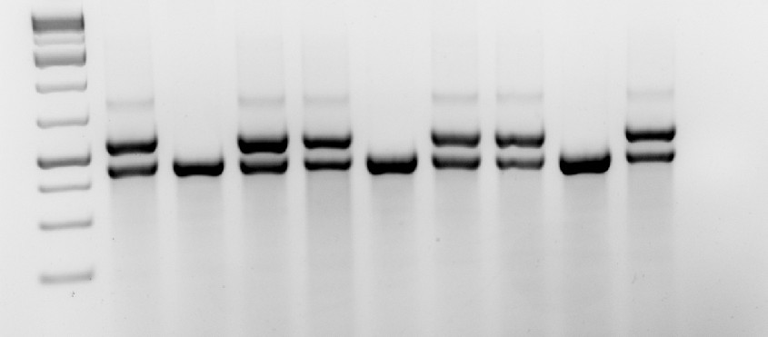
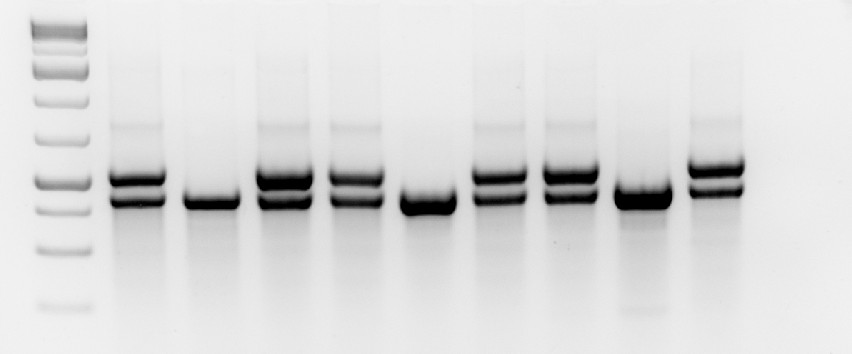
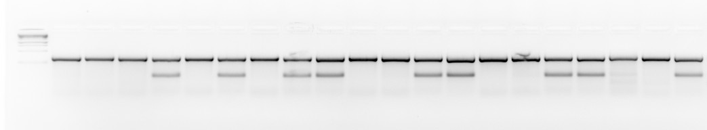

## PCR Protocol

1.  Thaw DNA at room temperature, in water bath or incubator
2.  Centrifuge and vortex X (dNTP), MgCl2, and 5X GO buffer
3.  Gently flick primers and controls
    1.  Etv3 primers: 140+141 or 142+143 (Max's primer box)
        -   Etv3 fl/fl control
        -   Negative control: CT2 or B6 and H2O
    2.  UBC Cre primers: 80, 81, 82, 83 (Max's primer box)
        -   Cre + control: CT2
        -   Cre - control: cKO and H2O

::: callout-note
There are two pairs for the Etv3 floxed mouse strain. This is because it contains two [loxP sites that flank](../tamoxifen.qmd) exon 2-4 of the gene. Pair 140+141 spans the region containing the loxP site in intro 1, pair 142+143 spans the loxP in intron 4.

It is okay to only use one of the primer pairs to genotype the mice
:::

::: callout-note
Making Primers: Dilute primers 1:10 in ddH~2~O (e.g. 10μL primer stock + 90μL H~2~O =\> 100μL final volume)
:::

4.  Make master mix; [PCR calculator](https://docs.google.com/spreadsheets/u/1/d/1KQnku03JQWAxwmSI1ExukldTsRrIlwtF--9MxJH9g_M/edit)
    1.  Etv3 fl use `Hic1 fl PCR` sheet
    2.  UBC Cre use `UBC Cre & tdTomato PCR` sheet
5.  Label and add 1uL of controls/ DNA to PCR tubes, for many PCRs it is best to use a 96 well plate.
6.  Add Taq polymerase (must be kept on ice!)
7.  Vortex gently and centrifuge master mix
8.  Add 24μL of master mix to PCR tubes
9.  Centrifuge PCR strips/plate
10. Place in PCR machine
    1.  Use `Geno_TD` protocol on machine B

::: {.callout-tip collapse="true"}
## Touchdown PCR

A touchdown PCR tries to minimize the incidence non-specific, contaminating products. With touchdown cycling, the initial annealing step is done at a high temperature to promote only correct, specific priming. At the beginning of each of the next 5-10 cycles, the annealing temperature stringency is dropped by 0.5-1.0 ⁰C per cycle; that is, if the annealing temperature of the first cycle is 65⁰C, the annealing temperature of second is 64.5, of the third, 64.0, etc. At the conclusion of the touchdown cycling steps, the last cycle is run for the remaining 25-30 cycles.

| Step | Temperature           | Time   |
|------|-----------------------|--------|
| 1    | 95°C                  | 1 min  |
| 2    | 95°C                  | 20 sec |
| 3    | 64°C (-0.5°C / cycle) | 20 sec |
| 4    | 72°C                  | 30 sec |
| 5    | Goto Step 2           | 9x     |
| 6    | 95°C                  | 20 sec |
| 7    | 59°C                  | 20 sec |
| 8    | 72°C                  | 30 sec |
| 9    | Goto Step 6           | 28x    |
| 10   | 72°C                  | 3 min  |
:::

## Gel Electrophoresis

1.  Make agarose gel (more % agarose for small fragments)
    -   All PCRs can be run on a 2.5% TAE gel
        -   2.5g agarose + 100ml TAE for small gel
        -   5g agarose + 200ml TAE for large gel
    -   Add 4μL EtBr for small gel; \> 20 samples
    -   Add 8μL EtBr for large gel; \< 20 samples
2.  Microwave gel bottle for 1.5 - 2 minutes until agarose has dissolved; add EtBr (mix well) and let cool
3.  Pour liquid into gel mold; pop/move bubbles to the bottom with pipet tip
4.  Carefully insert combs and let cool for 10 - 15 minutes (until hardened)
5.  Remove combs & place gel into easycast
6.  Fill easycast with 1x TAE to cover gel
7.  Load 10μL gene ladder in the first lane; 15μL of sample in other lanes
8.  Run gel \@ 90-120V
    1.  UBC Cre & tdTomato: 35 min
    2.  Hic1 fl, Hic1 Cre and Zeb2: 1h
    3.  If there is no good separation for the bands, extend running time.
9.  UV Image

## Results

### Etv3 fl Expected Bands:

#### Pair Intron 1 (140+141)

-   WT: 466bp
-   Flox: 574bp
-   Example in @fig-etv3-fl-intron1

#### Pair Intron 4 (142+143)

-   WT: 448bp
-   Flox: 537bp
-   Example in @fig-etv3-fl-intron4

### UBC Cre Expected Bands:

-   Cre +: band \@ 100bp
-   Cre -: no band \@ 100bp
-   Example in @fig-cre

### Examples

::: {#fig-examples layout-nrow="2"}
{#fig-etv3-fl-intron1}

{#fig-etv3-fl-intron4}

{#fig-cre}

Examples of PCR results
:::
