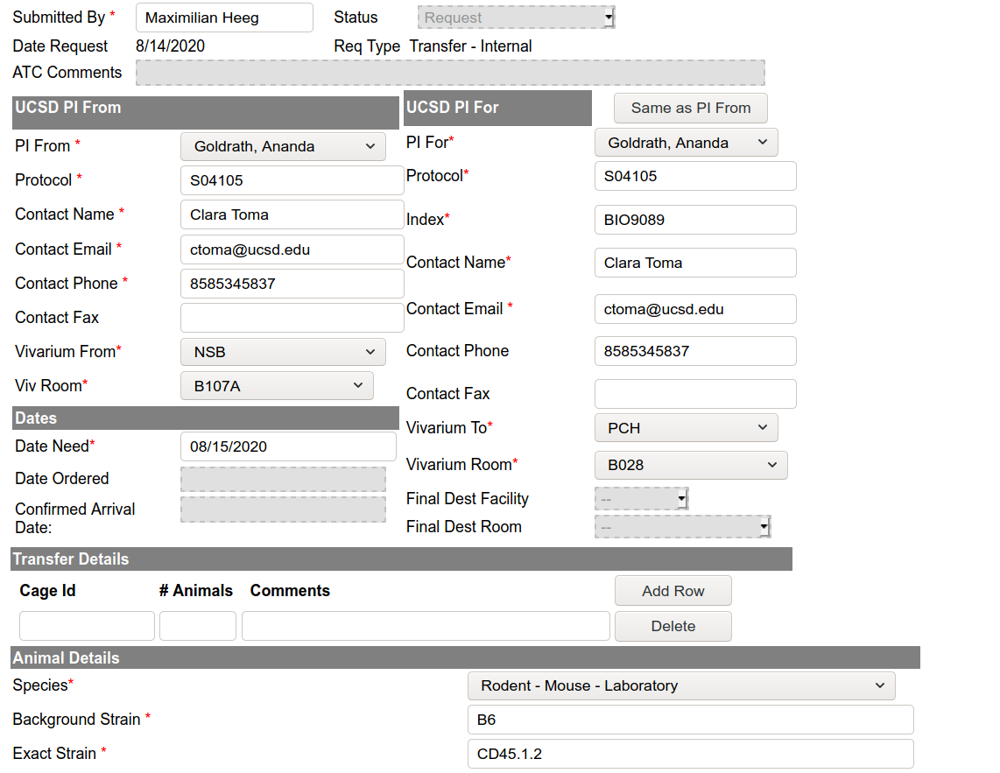

## Transfer request

1. Go to this site: https://animalcare.ucsd.edu/pages/
2. Under "Quick Links" click on "Animal Transfers"
3. Then under “Place an Animal Transfer Request” click on “Internal Transfer Request”
4. Sign in with your single sign-on
5. You will then be prompted to a form titled “Animal Transfer (Internal Transfer)
    - Fill this form out
    - Protocol: S04105
    - Index: BIO9089
    - NSB Vivarium Room Number: B107A (common room) or B (Kyla’s room)
    - PCH Vivarium BSL2 Room Number: B028
    - Under submitted by please put your name
    - Under contact info for the FOR and FROM (name, email, phone) please put my name, email, and the office number

::: callout-warning
Make sure you do not check any of the boxes that say ACP will print new cards or move the mice
:::

## Example
{#fig-example}
