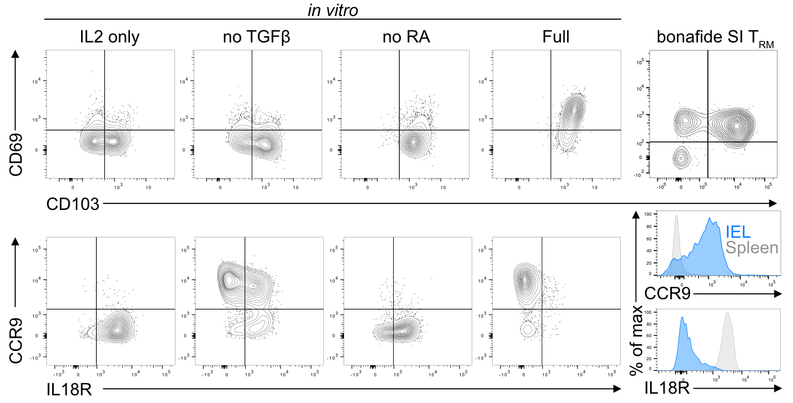

## Materials

-   naïve CD8 T cells
-   anti-CD3e Ab
-   anti-CD28 Ab
-   Dulbecco's PBS
-   complete RPMI (cRPMI)
-   RPMI 1640 media,
-   Fetal Calf Serum,
-   Hepes 1M,
-   L-glutamine 200 mM,
-   Pen strep 5000 units,
-   β-mercaptoethanol

## Cytokines

-   hIL-2 (stock: 100 000 U / ml) -\> working dilution 25.000 U / ml (1:4) --\> use at 1:1000 for f.c.
-   Mouse IL-15 (stock: 100 µg / ml) -\> working stock 10 µg / ml (1:10) --\> use at 1:1000 for f.c.
-   Mouse TGFβ (stock 220 µg / ml) -\> working stock 10 µg / ml (1:22) --\> use at 1:1000 for f.c.
-   Retinoic acid ≥98% (HPLC) powder

### Retinoic acid prep

-  0.0015 g/ml for 5 mM stock in EtOH in black tubes (RA is light sensitive), store at -20°C
-  1:1000 dilution in PBS (5 μM working dilution, use day-of only (i.e., make fresh every time))
-  Add 1:250 into polarisation stock for final conc. 10 nM

### Polarization media

See above for workings stock concentrations.

-   10ml TCM
-   40 µl RA from 1:1000 dilution (see above)
-   10 µl of IL-15 working stock
-   10 µl of IL-2 working stock
-   10 µl of TGF-b working stock

## Method

1.  Coat a flat bottom 6-well plate with anti-CD3 (1 μg/ml for T~RM~, 3µg/ml for control/effector T cells) in 1ml PBS per well, and place at 37°C for 3hr.
2.  Per mouse, harvest the spleen and peripheral lymph nodes. Magnetically isolate CD8 T cells per lab protocol.
3.  PBS is removed after 3hr and enriched CD8+ T cells are gently plated at a density of 5 million cells per well in complete RPMI (cRPMI - a media containing RPMI supplemented with 10% FCS, 2.5% 1M HEPES, 1% 200 mM L-glutamine, 1% PenStrep (10000 U/ml penicillin + 10000 μg/ml streptomycin) and 0.1% 5\*10-2M β-mercaptoethanol) along with 2ug/ml anti-CD28 and 50U/ml IL2. I usually do 2ml media per well. Plates are incubated at 37°C in 5% CO2.
4.  After 24hr, cells are taken off stimulation, washed with cRPMI, spin down, and replate either with 25U/ml IL2 for control/effector T cells or with T~RM~ polarizing media: 25U/ml IL-2, 10ng/ml IL-15, 10ng/ml TGFβ and 10nM retinoic acid.
5.  Cell media is doubled every 48hr with new cytokines added only for the volume of media added. Old media is not removed. A fresh working dilution of atRA is needed every time additional media is added since atRA is light sensitive.
6.  Cells can be used/analyzed on day 7.

