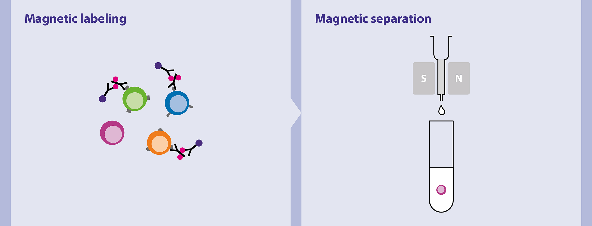

## Preparation

2Hrs before plating: prepare 6-well plate with GAH-IgG - Dilute GAH-IgG Ab 1:30 in sterile PBS - Aliquot 550 μL/well into a round-bottom 6-well plate; tap plate to distribute liquid equally across bottom of wells - Incubate at 37°C for at least 2 hrs

### Biotin-Ab stain

| Antibody          | Marker for  | Volume |
|-------------------|-------------|--------|
| NK1.1             | NK cells    | 3μl    |
| MHC II            | APC         | 3μl    |
| CD4               | Th cells    | 3μl    |
| B220              | B cells     | 3μl    |
| Ter119            | RBCs        | 3μl    |
| Ly6C (clone GR-1) | Neutrophils | 3μl    |
| MACS              |             | 600μl  |

## Process spleen and/or lymph node tissues collected from mouse

-   Homogenize tissue(s) in PBS with frosted glass slides and place solution in 15 mL tube
-   Centrifuge at 1600 rpm for 4 min and discard supernatant
-   Resuspend pellet in 1-2 mL ACK and incubate at room temperature for 5-6 min
-   Neutralize with 3-4 mL MACS
-   Centrifuge at 1600 rpm for 4 min and discard supernatant

## Treatment of cells with Biotin-Ab stain

-   Resuspend pellet in 500 μL Biotin-Ab stain
-   Incubate at 4°C (fridge) for 15 min protected from light
-   Fill tube with MACS buffer
-   Centrifuge at 1600 rpm for 4 min and discard supernatant
-   Resuspend pellet with 50 μL streptavidin-beads and 500 μL MACS Buffer
-   Incubate at 4°C for 15 min protected from light
-   Fill tube with MACS buffer
-   Centrifuge at 1600 rpm for 4 min and discard supernatant
-   Resuspend pellet in 500 μL MACS buffer

## Column purification of streptavidin-bound cells

-   Attach MACS column to magnet
-   Pre-treat MACS column with 3 mL MACS buffer and discard flow-through
-   Run cell solution through column, collecting flow-through
-   Wash column three times (3X) with 3 mL MACS buffer
-   Centrifuge at 1600 rpm for 4 min and discard supernatant
-   Resuspend pellet in 500 μL TCM
-   Count cells
-   Dilute cells to wanted concentration of 2x10^6^ cells/mL

## Plating cells in pre-treated 6-well plate

-   Wash GAH-Ab coated wells twice with 1mL TCM
-   Plate 2 x 10^6^ cells in 1ml TCM (1ml)
-   Dilute CD3 and CD28 Abs 1:500 in TCM
-   Add 1 mL CD3/CD28 Ab mixture to each well, pipette to mix
-   Incubate at 37°C until further processing
