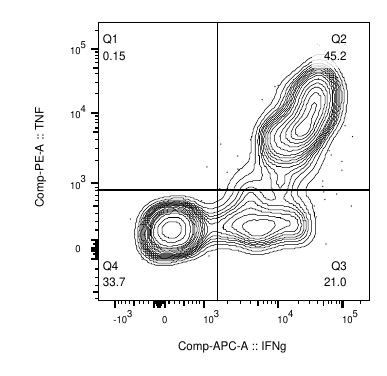

## Stimulation with gp33

The final concentration of gp33 should be 10nM. Our stock has a concentration of 1 mM. This means a diluation of 1:100 000 is needed.

-   Resuspend T cells in 100µl TCM
-   For TRM, add 50µl Splenocytes as spike in with a difference congenic. These cells serve as APCs to the TRM. If only staining splenocytes, add 50 µl TCM.
-   Add 50µl of *Stimulation Mix*:
    -   e.g. 500µl TCM
    -   add 4µl Protein Transport Inhibitor Cocktail resulting in a total dilution of 1:125 \* 1:4 = 1:500
    -   add 2µl of gp33 (prediluted 1:100) resulting in a total dilution of 1:100 \* 1:250 \* 1:4 = 1:100 000
-   Incubate at 37°C for 4 hours.
-   Stain

*If staining for CD107a, add antibody and gp33 peptide first for 30 mins-1 hour. Then add Protein Transport Inhibitor Cocktail for remaining stim time. 

